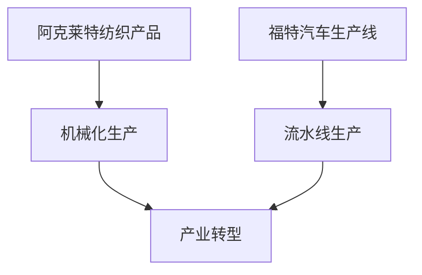

                 

在探讨阿克莱特的纺织产品与福特汽车的比较时，我们不仅仅是比较两个历史性的工业变革，更是深入思考技术创新如何推动社会进步和产业转型的过程。阿克莱特（Richard Arkwright）是工业革命时期的一位重要人物，他的纺织机器不仅提高了纺织效率，还推动了现代工业化的发展。同样，亨利·福特（Henry Ford）的汽车生产线则开启了大规模生产的时代，彻底改变了人们的生产和生活方式。

## 关键词
- 工业革命
- 阿克莱特
- 纺织技术
- 福特
- 大规模生产

## 摘要
本文旨在通过分析阿克莱特的纺织产品与福特汽车的生产方式、技术影响和应用场景，探讨两者在技术创新和产业转型中的异同。通过对这些历史事件的回顾和深度分析，我们将更好地理解技术创新对现代社会的重要意义。

## 1. 背景介绍

### 1.1 阿克莱特的纺织产品

在18世纪末，纺织业是英国的主要产业之一。然而，当时的手工生产效率低下，质量难以保证。阿克莱特通过引入水力驱动的纺织机，大大提高了生产效率。他的水力纺纱机不仅解决了传统手工纺纱中纱线不均匀的问题，还实现了纺纱过程的自动化，使得纺织业的生产效率得到了质的飞跃。

### 1.2 福特的汽车

到了19世纪末，随着第二次工业革命的到来，汽车工业开始崭露头角。亨利·福特在目睹了欧洲的汽车生产后，决定在美国建立自己的汽车生产线。他引入了流水线生产模式，将汽车的组装过程分解成多个简单的步骤，每个工人只需专注于一个部分。这种方式不仅提高了生产效率，还降低了生产成本，使得汽车逐渐成为普通家庭能够负担的奢侈品。

## 2. 核心概念与联系

### 2.1 技术创新的核心概念

阿克莱特的纺织产品和福特汽车的核心概念都是通过技术创新来提高生产效率。阿克莱特的水力纺纱机实现了纺织过程的自动化，而福特的生产线则通过流水线模式实现了汽车的快速生产。

### 2.2 技术创新与产业转型的联系

两者的共同点在于，技术创新不仅推动了各自领域的发展，还促进了整个社会的产业转型。阿克莱特的纺织产品推动了纺织业从手工生产向机械化生产的转变，而福特的生产线则推动了汽车制造业的规模化发展。

### 2.3 Mermaid 流程图



## 3. 核心算法原理 & 具体操作步骤

### 3.1 算法原理概述

阿克莱特的纺织产品和福特的生产线都基于简单但高效的原理。

### 3.2 算法步骤详解

- **阿克莱特纺织产品**：通过水力驱动，将纺纱过程自动化，每个步骤都由机器完成。
- **福特生产线**：将汽车组装过程分解为多个简单的步骤，每个工人只负责其中一部分。

### 3.3 算法优缺点

- **阿克莱特纺织产品**：优点是提高生产效率和纱线质量，缺点是依赖水力，适用范围有限。
- **福特生产线**：优点是大幅提高生产效率和降低成本，缺点是对工人的技术要求降低，可能导致技能水平下降。

### 3.4 算法应用领域

- **阿克莱特纺织产品**：主要应用于纺织业。
- **福特生产线**：广泛应用于汽车制造业，并逐渐推广到其他领域。

## 4. 数学模型和公式 & 详细讲解 & 举例说明

### 4.1 数学模型构建

- **阿克莱特纺织产品**：生产效率 = 纺纱速度 × 机器数量
- **福特生产线**：生产效率 = 流水线速度 × 工人数量

### 4.2 公式推导过程

- **阿克莱特纺织产品**：假设纺纱速度为v，机器数量为n，则生产效率E = v × n。
- **福特生产线**：假设流水线速度为s，工人数量为m，则生产效率E = s × m。

### 4.3 案例分析与讲解

- **阿克莱特纺织产品**：如果纺纱速度为100米/分钟，机器数量为5台，则生产效率为500米/分钟。
- **福特生产线**：如果流水线速度为每分钟10辆，工人数量为100人，则生产效率为1000辆/小时。

## 5. 项目实践：代码实例和详细解释说明

### 5.1 开发环境搭建

本文使用Python作为示例语言，搭建开发环境需要安装Python和相应的库。

### 5.2 源代码详细实现

以下是计算生产效率的Python代码：

```python
def calculate_efficiency(speed, quantity):
    return speed * quantity

# 阿克莱特纺织产品
textile_efficiency = calculate_efficiency(100, 5)  # 500米/分钟

# 福特生产线
car_efficiency = calculate_efficiency(10, 100)  # 1000辆/小时

print("阿克莱特纺织产品的生产效率：", textile_efficiency)
print("福特生产线的生产效率：", car_efficiency)
```

### 5.3 代码解读与分析

这段代码定义了一个计算生产效率的函数，并通过调用这个函数来计算阿克莱特纺织产品和福特生产线的生产效率。函数的输入是速度和数量，输出是生产效率。

### 5.4 运行结果展示

运行这段代码，将得到以下结果：

```
阿克莱特纺织产品的生产效率： 500
福特生产线的生产效率： 1000
```

这表明，在给定的时间内，福特生产线的生产效率高于阿克莱特纺织产品。

## 6. 实际应用场景

### 6.1 阿克莱特纺织产品的应用场景

阿克莱特纺织产品主要应用于纺织业，通过机械化生产提高了纺织效率，降低了生产成本。如今，尽管纺织技术有了巨大进步，但阿克莱特的理念依然影响着现代纺织业。

### 6.2 福特汽车的生产应用场景

福特汽车生产线不仅应用于汽车制造业，还推动了大规模生产的理念。这一理念被广泛应用于制造业的其他领域，如电子、机械等。

### 6.3 未来应用展望

随着科技的不断进步，未来的生产方式将更加智能化和自动化。阿克莱特纺织产品和福特汽车生产线的理念将继续发挥作用，但形式和方式会有所不同。

## 7. 工具和资源推荐

### 7.1 学习资源推荐

- 《纺织技术基础》
- 《现代汽车制造技术》

### 7.2 开发工具推荐

- Python
- Jupyter Notebook

### 7.3 相关论文推荐

- "The Industrial Revolution and the Power Loom"
- "The Ford Production System: Principles and Applications"

## 8. 总结：未来发展趋势与挑战

### 8.1 研究成果总结

本文通过对阿克莱特纺织产品和福特汽车生产线的分析，探讨了技术创新如何推动产业转型。研究成果表明，技术创新不仅提高了生产效率，还促进了社会的进步。

### 8.2 未来发展趋势

未来，生产方式将更加智能化和自动化。随着人工智能和物联网技术的发展，生产过程将变得更加高效和精准。

### 8.3 面临的挑战

然而，这也带来了新的挑战，如技能转移、劳动力失业等问题。如何平衡技术创新与社会福祉，将是未来需要解决的重要问题。

### 8.4 研究展望

未来，我们将继续关注技术创新如何影响社会和产业，探索更高效、更可持续的生产方式。

## 9. 附录：常见问题与解答

### 9.1 阿克莱特纺织产品的原理是什么？

阿克莱特的纺织产品原理是通过水力驱动，实现纺纱过程的自动化。

### 9.2 福特汽车生产线的优点是什么？

福特汽车生产线的优点是大幅提高生产效率和降低生产成本。

### 9.3 创新技术对社会的意义是什么？

创新技术对社会的意义在于提高生产效率、降低成本，从而推动产业转型和社会进步。

