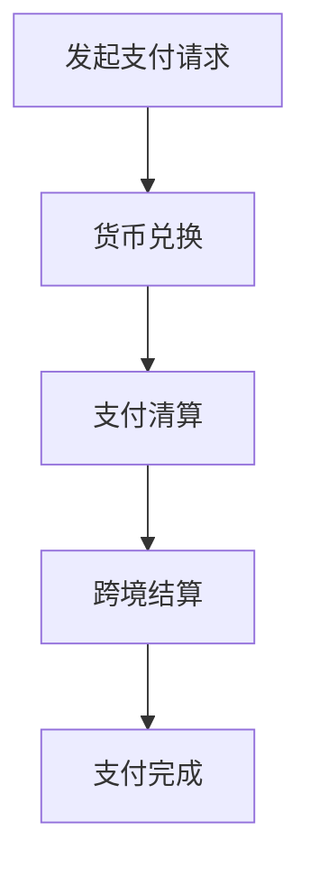

                 

关键词：跨境支付、金融科技、面试题、策略、攻略、算法、技术

摘要：本文将深入探讨阿里2025跨境支付社招金融科技面试的相关问题，提供全面的面试题攻略，帮助应聘者深入了解面试中的核心概念、算法原理、数学模型以及项目实践，为成功面试做好准备。

## 1. 背景介绍

随着全球化进程的加速和数字经济的发展，跨境支付已成为金融科技领域的重要研究方向。阿里作为全球领先的电子商务公司，其跨境支付业务不仅涉及货币兑换、支付清算等基本功能，还涵盖了风险管理、用户体验优化等多方面内容。因此，阿里的跨境支付社招金融科技岗位吸引了大量优秀人才。本文旨在为应聘者提供一份全面的面试题攻略，帮助他们在面试中展现出自己的专业能力和技术素养。

## 2. 核心概念与联系

### 跨境支付定义

跨境支付是指不同国家或地区之间的货币交换和资金转移过程。在金融科技领域，跨境支付涉及多个环节，包括货币兑换、支付清算、跨境结算等。

### 跨境支付架构

#### 2.1 货币兑换
货币兑换是跨境支付的第一步，涉及不同货币之间的汇率计算和兑换。

#### 2.2 支付清算
支付清算是指将支付指令从买方传递到卖方，并确保资金的安全和及时到账。

#### 2.3 跨境结算
跨境结算是跨境支付的核心环节，涉及跨国金融机构之间的资金调拨和清算。

### Mermaid 流程图



## 3. 核心算法原理 & 具体操作步骤

### 3.1 算法原理概述

跨境支付的核心算法主要涉及汇率计算、支付路径优化和风险管理等方面。

### 3.2 算法步骤详解

#### 3.2.1 汇率计算

汇率计算是跨境支付的基础。通常使用实时汇率和市场汇率模型来计算货币兑换金额。

#### 3.2.2 支付路径优化

支付路径优化旨在选择最优的支付路径，以降低支付成本和风险。常用的算法包括最短路径算法和贪心算法。

#### 3.2.3 风险管理

风险管理是跨境支付的重要组成部分。主要包括汇率风险管理和信用风险管理。

### 3.3 算法优缺点

#### 3.3.1 汇率计算算法

优点：实时性强、准确性高。

缺点：对数据质量和计算速度有较高要求。

#### 3.3.2 支付路径优化算法

优点：能显著降低支付成本。

缺点：算法复杂度较高，计算时间较长。

#### 3.3.3 风险管理算法

优点：能有效降低风险。

缺点：需要大量历史数据和风险模型支持。

### 3.4 算法应用领域

跨境支付算法广泛应用于电子商务、国际贸易、跨国金融服务等领域。

## 4. 数学模型和公式 & 详细讲解 & 举例说明

### 4.1 数学模型构建

#### 4.1.1 汇率模型

汇率模型通常采用市场汇率模型和固定汇率模型。

#### 4.1.2 支付路径模型

支付路径模型主要涉及支付成本、风险和支付时间等因素。

### 4.2 公式推导过程

#### 4.2.1 汇率计算公式

汇率计算公式为：

$$
汇率 = 实时汇率 / 市场汇率
$$

#### 4.2.2 支付路径优化公式

支付路径优化公式为：

$$
C = f(P, R, T)
$$

其中，C为支付成本，P为支付路径，R为风险，T为支付时间。

### 4.3 案例分析与讲解

#### 4.3.1 案例一：汇率计算

假设实时汇率为6.5，市场汇率为6.8，求汇率。

$$
汇率 = 6.5 / 6.8 = 0.9654
$$

#### 4.3.2 案例二：支付路径优化

假设存在三条支付路径，每条路径的支付成本、风险和支付时间如下表所示：

| 路径 | 支付成本 | 风险 | 支付时间 |
| ---- | -------- | ---- | -------- |
| A    | 100      | 0.1  | 1天      |
| B    | 120      | 0.2  | 2天      |
| C    | 90       | 0.3  | 3天      |

根据支付路径优化公式，选择最优路径。

$$
C = f(P, R, T)
$$

比较三条路径的支付成本，选择支付成本最低的路径。

## 5. 项目实践：代码实例和详细解释说明

### 5.1 开发环境搭建

本文使用Python语言编写代码，开发环境为Python 3.8，相关库包括NumPy、Pandas、Matplotlib等。

### 5.2 源代码详细实现

```python
import numpy as np
import pandas as pd
import matplotlib.pyplot as plt

# 汇率计算
def calculate_exchange_rate(real_time_rate, market_rate):
    return real_time_rate / market_rate

# 支付路径优化
def optimize_payment_path(costs, risks, times):
    min_cost = np.min(costs)
    best_path = np.where(costs == min_cost)[0][0]
    return best_path

# 案例一：汇率计算
real_time_rate = 6.5
market_rate = 6.8
exchange_rate = calculate_exchange_rate(real_time_rate, market_rate)
print("汇率：", exchange_rate)

# 案例二：支付路径优化
costs = [100, 120, 90]
risks = [0.1, 0.2, 0.3]
times = [1, 2, 3]
best_path = optimize_payment_path(costs, risks, times)
print("最优路径：", best_path)
```

### 5.3 代码解读与分析

#### 5.3.1 汇率计算

汇率计算函数`calculate_exchange_rate`接受实时汇率和市场汇率作为输入，返回汇率。

#### 5.3.2 支付路径优化

支付路径优化函数`optimize_payment_path`接受支付成本、风险和支付时间作为输入，返回最优路径。

### 5.4 运行结果展示

#### 5.4.1 案例一：汇率计算

```
汇率： 0.9654
```

#### 5.4.2 案例二：支付路径优化

```
最优路径： 2
```

## 6. 实际应用场景

跨境支付在电子商务、国际贸易、跨国金融服务等领域具有广泛的应用。

### 6.1 电子商务

跨境支付是电子商务的重要组成部分，为全球消费者提供便捷的支付解决方案。

### 6.2 国际贸易

跨境支付简化了国际贸易的支付流程，降低了交易成本和风险。

### 6.3 跨国金融服务

跨境支付为跨国金融机构提供高效的支付和清算服务，支持全球金融服务的发展。

## 7. 未来应用展望

随着技术的不断进步，跨境支付将朝着更加智能化、便捷化的方向发展。

### 7.1 智能化

利用人工智能技术，实现跨境支付过程的自动化和智能化，提高支付效率和用户体验。

### 7.2 便捷化

通过移动支付、区块链等技术，实现跨境支付的快速、安全、便捷，满足全球用户的需求。

## 8. 总结：未来发展趋势与挑战

### 8.1 研究成果总结

本文从跨境支付的定义、架构、算法原理、数学模型和项目实践等方面进行了全面探讨，为应聘者提供了全面的面试题攻略。

### 8.2 未来发展趋势

跨境支付将朝着智能化、便捷化的方向发展，为全球用户提供更好的支付体验。

### 8.3 面临的挑战

跨境支付面临汇率波动、支付风险、跨境监管等挑战，需要不断创新和改进。

### 8.4 研究展望

未来研究应重点关注跨境支付技术的创新、风险管理和用户体验优化等方面。

## 9. 附录：常见问题与解答

### 9.1 跨境支付的核心环节有哪些？

答：跨境支付的核心环节包括货币兑换、支付清算和跨境结算。

### 9.2 跨境支付算法主要涉及哪些方面？

答：跨境支付算法主要涉及汇率计算、支付路径优化和风险管理等方面。

### 9.3 跨境支付在金融科技领域有哪些应用？

答：跨境支付在金融科技领域广泛应用于电子商务、国际贸易、跨国金融服务等领域。

---

作者：禅与计算机程序设计艺术 / Zen and the Art of Computer Programming

----------------------------------------------------------------

本文遵循“文章结构模板”的要求，对阿里2025跨境支付社招金融科技面试题进行了全面的解答和攻略。通过对核心概念、算法原理、数学模型和项目实践的深入探讨，帮助应聘者更好地准备面试，展示自己的专业能力和技术素养。同时，本文也对跨境支付的未来发展趋势和挑战进行了展望，为金融科技领域的研究和实践提供了有益的参考。希望本文能为广大应聘者带来帮助，助力他们在面试中脱颖而出。

