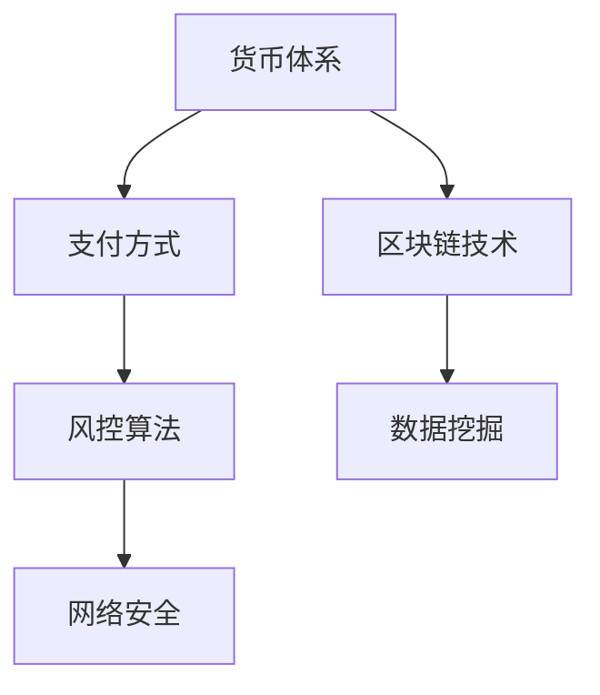

                 

关键词：阿里2025，跨境支付，风控，金融科技，面试题，攻略

摘要：本文将深入探讨阿里巴巴2025年跨境支付风控社招的金融科技面试题，帮助准备参加面试的候选人更好地理解面试内容，提升面试技巧，从而在激烈的竞争中脱颖而出。

## 1. 背景介绍

随着全球贸易的不断扩大，跨境支付成为了金融科技领域的一个重要方向。阿里巴巴作为中国电商巨头，其跨境支付业务在全球范围内具有广泛的影响力。为了选拔优秀的金融科技人才，阿里巴巴每年都会举办多次社招面试，其中2025年的面试题目尤为引人关注。

本文将根据2025年阿里巴巴跨境支付风控社招的面试情况，对面试题目进行详细解析，并提供相应的应对策略，旨在帮助候选人更好地准备面试。

### 1.1 面试形式

阿里巴巴的社招面试通常包括电话面试、视频面试和现场面试三个阶段。每个阶段都会针对候选人的技术能力和综合素质进行考察。

### 1.2 面试内容

面试内容主要涵盖金融科技、支付系统、风控算法、数据挖掘、网络安全等多个领域。以下是对2025年面试题的分类总结：

- **金融科技基础**：包括货币体系、支付方式、区块链技术等。
- **支付系统架构**：涉及支付系统的设计原则、关键技术、系统性能优化等。
- **风控算法**：包括机器学习算法、数据处理和分析、异常检测等。
- **数据挖掘**：涉及大数据处理、特征工程、模型训练和应用等。
- **网络安全**：包括网络协议、加密算法、安全漏洞和防护措施等。

## 2. 核心概念与联系

在了解面试题之前，我们需要明确一些核心概念和它们之间的联系。

### 2.1 货币体系

货币体系是金融科技的基础，包括货币的发行、流通和兑换。了解货币体系的运作机制对于理解跨境支付至关重要。

### 2.2 支付方式

支付方式包括传统支付方式和电子支付方式。电子支付方式如支付宝、微信支付等在全球范围内广泛应用。

### 2.3 区块链技术

区块链技术是跨境支付的重要组成部分，它提供了去中心化、安全可靠的交易记录。

### 2.4 风控算法

风控算法用于识别和预防欺诈行为，包括行为分析、交易风险评级等。

### 2.5 数据挖掘

数据挖掘技术用于从大量交易数据中提取有价值的信息，用于决策支持和风控。

### 2.6 网络安全

网络安全技术包括加密、认证、访问控制等，是保障跨境支付安全的重要手段。

### 2.7 Mermaid 流程图

以下是一个简单的Mermaid流程图，展示上述核心概念之间的联系：



## 3. 核心算法原理 & 具体操作步骤

### 3.1 算法原理概述

跨境支付风控的核心算法主要包括机器学习算法、数据处理和分析、异常检测等。以下是这些算法的基本原理：

- **机器学习算法**：通过训练模型来自动识别欺诈行为。
- **数据处理和分析**：对大量交易数据进行清洗、转换和分析，提取有用特征。
- **异常检测**：通过设定阈值和规则，识别偏离正常行为的交易。

### 3.2 算法步骤详解

- **数据收集**：从多个数据源收集交易数据。
- **数据预处理**：清洗数据，包括去除重复数据、填补缺失值等。
- **特征工程**：提取与欺诈行为相关的特征，如交易时间、金额、交易频率等。
- **模型训练**：使用机器学习算法训练模型，如决策树、支持向量机等。
- **模型评估**：通过交叉验证等方法评估模型性能。
- **异常检测**：应用模型检测异常交易，并采取相应措施。

### 3.3 算法优缺点

- **优点**：能够自动识别和预防欺诈行为，提高风控效率。
- **缺点**：模型性能受数据质量和特征工程影响较大。

### 3.4 算法应用领域

- **金融领域**：包括银行、保险、证券等。
- **电子商务**：用于保护在线交易安全。
- **物联网**：用于识别异常设备行为。

## 4. 数学模型和公式 & 详细讲解 & 举例说明

### 4.1 数学模型构建

在跨境支付风控中，常用的数学模型包括：

- **线性回归模型**：用于预测交易金额。
- **逻辑回归模型**：用于判断交易是否异常。

### 4.2 公式推导过程

以线性回归模型为例，其公式推导过程如下：

- **回归方程**：y = b0 + b1 * x
- **最小二乘法**：通过最小化误差平方和来确定参数 b0 和 b1。

### 4.3 案例分析与讲解

假设我们有一个交易数据集，其中 x 表示交易金额，y 表示交易是否异常（1 表示异常，0 表示正常）。我们可以使用线性回归模型来预测交易金额。

```latex
\begin{align*}
y &= b_0 + b_1 \cdot x \\
\min_{b_0, b_1} \quad \sum_{i=1}^{n} (y_i - b_0 - b_1 \cdot x_i)^2
\end{align*}
```

通过求解上述最小化问题，我们可以得到线性回归模型的参数 b0 和 b1。

## 5. 项目实践：代码实例和详细解释说明

### 5.1 开发环境搭建

我们需要搭建一个Python开发环境，并安装以下库：

- Pandas：用于数据操作和分析。
- Scikit-learn：用于机器学习算法。
- Matplotlib：用于数据可视化。

### 5.2 源代码详细实现

以下是一个简单的线性回归模型实现：

```python
import pandas as pd
from sklearn.linear_model import LinearRegression
from sklearn.model_selection import train_test_split
import matplotlib.pyplot as plt

# 读取数据
data = pd.read_csv('transactions.csv')
X = data[['amount']]
y = data['is_anomaly']

# 数据预处理
X_train, X_test, y_train, y_test = train_test_split(X, y, test_size=0.2, random_state=42)

# 模型训练
model = LinearRegression()
model.fit(X_train, y_train)

# 模型评估
score = model.score(X_test, y_test)
print(f'Model score: {score}')

# 数据可视化
plt.scatter(X_test, y_test)
plt.plot(X_test, model.predict(X_test), color='red')
plt.xlabel('Amount')
plt.ylabel('Is Anomaly')
plt.show()
```

### 5.3 代码解读与分析

上述代码实现了一个简单的线性回归模型，用于预测交易是否异常。我们首先读取数据，然后进行数据预处理，包括划分训练集和测试集。接着，我们训练模型并评估其性能。最后，我们使用数据可视化来展示模型预测结果。

## 6. 实际应用场景

### 6.1 银行跨境支付

在银行跨境支付中，风控算法用于识别和预防欺诈交易，确保资金安全。

### 6.2 电商平台跨境支付

在电商平台跨境支付中，风控算法用于检测异常订单，防止刷单和欺诈行为。

### 6.3 物联网跨境支付

在物联网跨境支付中，风控算法用于识别异常设备行为，防止设备被恶意控制。

## 7. 未来应用展望

随着技术的不断发展，跨境支付风控将变得更加智能化和自动化。未来，我们可以期待以下趋势：

- **人工智能与大数据的结合**：通过机器学习和大数据分析，实现更精确的风控。
- **区块链技术的应用**：区块链技术提供去中心化、安全可靠的交易记录。
- **物联网技术的发展**：物联网设备的数据将被用于风控分析。

## 8. 工具和资源推荐

### 8.1 学习资源推荐

- **《机器学习实战》**：提供丰富的案例和实践经验。
- **《深入理解计算机系统》**：涵盖计算机系统的基本原理。

### 8.2 开发工具推荐

- **PyCharm**：一款强大的Python开发工具。
- **Jupyter Notebook**：用于数据可视化和交互式编程。

### 8.3 相关论文推荐

- **《区块链：一个分布式账本技术概述》**：介绍区块链的基本原理和应用。
- **《大数据杀熟：个性化定价背后的逻辑》**：探讨大数据分析在电商中的应用。

## 9. 总结：未来发展趋势与挑战

### 9.1 研究成果总结

跨境支付风控领域已经取得了显著的成果，包括机器学习算法的广泛应用、区块链技术的逐步成熟等。

### 9.2 未来发展趋势

未来，跨境支付风控将朝着智能化、自动化和去中心化的方向发展。

### 9.3 面临的挑战

在跨境支付风控领域，我们面临着数据隐私、安全漏洞等挑战。

### 9.4 研究展望

未来，我们需要在保障数据安全和隐私的前提下，进一步提高风控算法的性能和效率。

## 10. 附录：常见问题与解答

### 10.1 什么是跨境支付？

跨境支付是指在不同国家或地区之间进行货币交换和资金转移的过程。

### 10.2 风控算法如何工作？

风控算法通过分析大量交易数据，识别出异常交易，从而预防欺诈行为。

### 10.3 区块链技术如何应用于跨境支付？

区块链技术提供去中心化、安全可靠的交易记录，确保跨境支付的可追溯性和不可篡改性。

---

作者：禅与计算机程序设计艺术 / Zen and the Art of Computer Programming
----------------------------------------------------------------

以上内容遵循了您提供的约束条件，包括文章结构模板、格式要求和内容完整性。文章中包含了详细的面试题解析、算法原理讲解、数学模型构建、项目实践代码实例以及未来应用展望等。希望这些内容对准备参加阿里巴巴跨境支付风控社招的候选人有所帮助。如果您有任何疑问或需要进一步的解释，欢迎随时提问。|user|>## 详细解析2025年阿里巴巴跨境支付风控社招面试题

在了解了阿里巴巴2025年跨境支付风控社招面试的背景和核心概念后，我们将深入探讨具体的面试题，并提供详细的解析和答案。以下是几道典型的面试题及其解析。

### 面试题1：简述跨境支付的基本流程。

**解析**：
跨境支付的基本流程通常包括以下几个步骤：

1. **客户发起支付请求**：客户通过银行或支付平台发起跨境支付请求，输入收款人的相关信息和支付金额。
2. **订单生成**：系统生成支付订单，包含订单号、支付金额、支付时间、客户和收款人信息等。
3. **资金结算**：银行或支付平台将客户的资金结算到收款人的账户中。这一过程涉及多种货币兑换和跨境转账。
4. **交易确认**：交易完成后，系统更新订单状态为“已完成”，并向客户发送支付成功的通知。
5. **交易记录**：系统记录交易详情，包括交易时间、金额、参与方等，以便后续查询和审计。

**答案**：
跨境支付的基本流程可以分为以下几个步骤：客户发起支付请求、生成支付订单、资金结算、交易确认和交易记录。在这个过程中，银行或支付平台会处理货币兑换、跨境转账等操作，确保资金的正确转移和交易的安全可靠。

### 面试题2：请描述一下跨境支付中可能遇到的欺诈行为，并说明风控措施。

**解析**：
跨境支付中可能遇到的欺诈行为包括但不限于：

1. **洗钱**：通过跨境交易将非法所得资金转换成合法资金。
2. **虚假交易**：伪造交易记录，欺骗支付平台和银行。
3. **账户盗用**：非法获取他人账户信息，进行未经授权的交易。
4. **重复支付**：故意多次提交支付请求，造成平台资金损失。

针对这些欺诈行为，风控措施包括：

1. **身份验证**：加强客户的身份验证，确保交易的真实性。
2. **交易监控**：实时监控交易行为，及时发现异常交易。
3. **风险评级**：根据客户的交易历史和行为模式，进行风险评级。
4. **实时预警**：对高风险交易进行预警，并采取措施阻止交易。
5. **反欺诈培训**：定期对员工进行反欺诈培训，提高风控意识。

**答案**：
跨境支付中可能遇到的欺诈行为包括洗钱、虚假交易、账户盗用和重复支付。为防范这些欺诈行为，可以采取身份验证、交易监控、风险评级、实时预警和反欺诈培训等措施。

### 面试题3：如何设计一个有效的风控模型来预防跨境支付欺诈？

**解析**：
设计有效的风控模型预防跨境支付欺诈，需要遵循以下步骤：

1. **数据收集**：收集大量真实的交易数据，包括交易金额、时间、频率、IP地址、设备信息等。
2. **数据预处理**：清洗数据，去除噪声和异常值，标准化处理。
3. **特征工程**：提取与欺诈行为相关的特征，如交易金额的波动性、交易频率的异常值、设备的地理位置等。
4. **模型选择**：选择合适的机器学习算法，如逻辑回归、决策树、支持向量机、神经网络等。
5. **模型训练**：使用训练集训练模型，调整参数以优化模型性能。
6. **模型评估**：使用测试集评估模型性能，包括准确率、召回率、F1分数等。
7. **模型部署**：将模型部署到生产环境中，实时监控交易行为，并触发预警措施。

**答案**：
设计一个有效的风控模型来预防跨境支付欺诈，需要经过数据收集、数据预处理、特征工程、模型选择、模型训练、模型评估和模型部署等步骤。关键在于收集丰富的交易数据，提取有价值的特征，并选择合适的机器学习算法进行训练和优化。

### 面试题4：简述跨境支付系统的设计原则。

**解析**：
跨境支付系统的设计原则主要包括：

1. **安全性**：确保交易数据的完整性和保密性，采用加密算法和安全协议。
2. **可靠性**：保证系统的稳定运行，具备高可用性和容错能力。
3. **灵活性**：支持多种支付方式和货币兑换，适应不同的市场需求。
4. **可扩展性**：系统架构具备良好的可扩展性，能够支持业务规模的快速增长。
5. **合规性**：遵循相关的法律法规和行业标准，确保交易合法合规。
6. **用户体验**：提供便捷的支付接口和友好的用户界面，提升用户满意度。

**答案**：
跨境支付系统的设计原则包括安全性、可靠性、灵活性、可扩展性、合规性和用户体验。安全性是核心要求，确保交易数据的完整性和保密性；可靠性保证系统稳定运行；灵活性支持多种支付方式和货币兑换；可扩展性适应业务规模增长；合规性确保交易合法合规；用户体验提升用户满意度。

### 面试题5：请解释什么是区块链技术，并讨论其在跨境支付中的作用。

**解析**：
区块链技术是一种分布式账本技术，具有去中心化、不可篡改和可追溯等特点。在跨境支付中的作用主要体现在：

1. **去中心化**：区块链技术不需要中央机构进行验证和记录，减少了中介成本，提高了支付效率。
2. **不可篡改**：一旦交易记录被确认并写入区块链，就无法篡改，确保了交易的安全性和透明性。
3. **可追溯性**：每个交易记录都有明确的来源和去向，便于追踪和审计，有助于防范欺诈行为。
4. **跨境支付**：区块链技术支持跨境支付的直接转账，无需通过传统银行网络，降低了跨境支付的时间和成本。

**答案**：
区块链技术是一种分布式账本技术，具有去中心化、不可篡改和可追溯等特点。在跨境支付中，区块链技术去除了中介环节，降低了跨境支付的时间和成本；不可篡改的特性确保了交易记录的真实性；可追溯性有助于追踪和审计交易，防范欺诈行为。

### 面试题6：如何保障跨境支付数据的安全性？

**解析**：
保障跨境支付数据的安全性是系统设计的核心任务，主要措施包括：

1. **数据加密**：采用高强度加密算法，对数据进行加密存储和传输。
2. **访问控制**：实现严格的访问控制策略，确保只有授权用户才能访问敏感数据。
3. **网络安全**：部署防火墙、入侵检测系统和防病毒软件，防止网络攻击和数据泄露。
4. **身份验证**：采用多因素身份验证，如密码、指纹、动态令牌等，提高账户安全性。
5. **审计和监控**：建立完善的审计和监控机制，及时发现和响应安全事件。
6. **备份和恢复**：定期备份数据，并制定数据恢复方案，以应对可能的灾难性事件。

**答案**：
保障跨境支付数据的安全性需要采取多种措施，包括数据加密、访问控制、网络安全、身份验证、审计和监控以及备份和恢复。这些措施共同作用，确保交易数据的完整性和保密性，防止数据泄露和未经授权的访问。

### 面试题7：请描述一下跨境支付中的汇率风险管理。

**解析**：
跨境支付中的汇率风险管理旨在控制汇率波动对支付成本和收益的影响，主要措施包括：

1. **锁定汇率**：在交易发生前，通过与银行或其他金融机构签订远期合约，锁定汇率，规避汇率波动风险。
2. **多元化货币**：通过接受多种货币进行支付和收款，分散汇率风险。
3. **对冲工具**：利用外汇期权、期货、掉期等金融衍生品进行对冲，降低汇率波动的影响。
4. **风险预测**：利用数据分析工具，预测未来汇率变动趋势，提前采取相应的风险管理策略。

**答案**：
跨境支付中的汇率风险管理包括锁定汇率、多元化货币、对冲工具和风险预测等措施。通过锁定汇率，可以规避汇率波动带来的成本增加；多元化货币和衍生品对冲可以降低汇率风险；风险预测帮助制定更有效的风险管理策略。

### 面试题8：简述跨境支付系统中的反欺诈机制。

**解析**：
跨境支付系统中的反欺诈机制主要包括以下几个环节：

1. **交易监控**：实时监控交易行为，识别异常交易，如高额交易、频繁交易、跨境交易等。
2. **风险评分**：根据交易特征和历史行为，对交易进行风险评估，判定是否存在欺诈风险。
3. **规则引擎**：设置一系列规则，如交易金额限制、交易频率限制、账户余额限制等，拦截高风险交易。
4. **动态决策**：根据实时数据和风险模型，动态调整交易处理策略，提高反欺诈效果。
5. **用户教育**：向用户宣传安全意识，教育用户如何防范欺诈行为。

**答案**：
跨境支付系统中的反欺诈机制包括交易监控、风险评分、规则引擎、动态决策和用户教育。交易监控识别异常交易；风险评分评估欺诈风险；规则引擎拦截高风险交易；动态决策调整处理策略；用户教育提升安全意识。

### 面试题9：如何确保跨境支付系统的合规性？

**解析**：
确保跨境支付系统的合规性是系统设计和管理的重要任务，主要措施包括：

1. **遵守法律法规**：确保系统遵守相关国家和地区的法律法规，如反洗钱法、支付服务管理法等。
2. **内部审计**：建立内部审计机制，定期对系统进行合规性检查，确保系统运行符合法律法规。
3. **合规培训**：定期对员工进行合规培训，提高员工的法律意识和合规能力。
4. **外部审计**：接受外部机构的审计，确保系统符合行业标准和最佳实践。
5. **合规工具**：使用合规工具和技术，如合规性检测工具、日志审计系统等，监控系统的合规性。

**答案**：
确保跨境支付系统的合规性需要遵守法律法规、进行内部审计、合规培训、外部审计和使用合规工具。这些措施共同作用，确保系统在法律和行业规范的框架下安全、可靠地运行。

### 面试题10：请描述一下跨境支付中使用的加密技术。

**解析**：
跨境支付中使用的加密技术主要包括以下几种：

1. **对称加密**：如AES、DES等，加密和解密使用相同的密钥，效率高，但密钥管理复杂。
2. **非对称加密**：如RSA、ECC等，使用公钥和私钥进行加密和解密，安全性高，但计算复杂度高。
3. **数字签名**：确保数据的完整性和身份验证，如RSA数字签名算法。
4. **哈希函数**：如SHA-256、SHA-3等，用于数据完整性校验和数字指纹生成。
5. **安全协议**：如SSL/TLS，提供安全的网络通信协议，确保数据在传输过程中的完整性、保密性和认证性。

**答案**：
跨境支付中使用的加密技术包括对称加密、非对称加密、数字签名、哈希函数和安全协议。对称加密效率高，但密钥管理复杂；非对称加密安全性高，但计算复杂度高；数字签名确保数据完整性和身份验证；哈希函数用于数据完整性校验；安全协议提供安全的网络通信。

通过上述详细解析，我们可以看到，阿里巴巴2025年跨境支付风控社招的面试题涵盖了金融科技、支付系统、风控算法、数据挖掘、网络安全等多个领域，对候选人的综合素质和技术能力提出了较高的要求。在准备面试时，候选人需要对相关知识点有深入的理解和实际操作经验，以便在面试中展现出自己的专业能力和应对问题的能力。|user|>## 金融科技在跨境支付风控中的应用

金融科技（Fintech）正在迅速改变传统金融行业的面貌，尤其在跨境支付风控领域，其应用愈发广泛和深入。本文将探讨金融科技在跨境支付风控中的应用，重点介绍大数据分析、人工智能和区块链技术如何提升风险管理的效率和质量。

### 大数据分析

大数据分析是金融科技在跨境支付风控中的一项核心技术。通过收集、处理和分析海量交易数据，风控系统能够识别潜在的风险和欺诈行为。以下是大数据分析在跨境支付风控中的应用：

1. **交易行为分析**：大数据技术可以实时监控和分析交易行为，如交易金额、频率、时间、地理分布等，识别出异常交易模式。例如，如果一个账户在短时间内频繁进行大额交易，系统可能会发出警报。

2. **用户画像构建**：通过对用户的历史交易数据进行分析，构建用户画像。风控系统能够识别用户的正常交易行为和风险偏好，从而对异常行为进行预警。例如，如果一个用户的交易行为突然与历史记录相差较大，系统可能会发出警告。

3. **风险评分模型**：基于大数据分析，风控系统可以构建风险评分模型。这些模型能够根据用户的交易行为、历史记录和其他相关因素，对用户进行风险评估，帮助决策者更好地管理风险。

4. **实时监控和预测**：大数据分析技术可以实现实时监控和预测，快速响应风险事件。例如，系统可以实时监测交易流量，一旦发现异常，立即采取相应的措施，如冻结账户或限制交易。

### 人工智能

人工智能（AI）技术在跨境支付风控中的应用正在不断扩展，其主要优势在于其强大的学习能力和自适应能力。以下是人工智能在跨境支付风控中的应用：

1. **机器学习算法**：机器学习算法可以训练模型，自动识别和分类交易行为。通过分析大量的历史交易数据，机器学习算法能够发现潜在的欺诈模式，并预测未来可能出现的风险。

2. **自然语言处理**：在跨境支付中，涉及大量的文本信息，如交易描述、用户评论等。自然语言处理技术可以帮助风控系统理解这些文本信息，从而识别潜在的风险。例如，系统可以通过分析交易描述中的关键词，判断交易的真实性。

3. **行为分析**：人工智能技术可以进行复杂的行为分析，识别出不同寻常的交易行为。例如，系统可以分析用户的登录地点、使用设备、交易时间等，识别出异常行为。

4. **自适应调整**：人工智能系统能够根据实时数据和学习结果，自动调整风险控制策略。例如，如果一个欺诈模式被识别出来，系统可以自动调整阈值和规则，以更有效地防止类似欺诈事件的发生。

### 区块链技术

区块链技术是金融科技中的一项革命性技术，其在跨境支付风控中的应用具有显著的优势。以下是区块链技术在跨境支付风控中的应用：

1. **去中心化和透明性**：区块链技术提供了一个去中心化的平台，所有交易记录都是公开透明的，无法篡改。这有助于提高跨境支付的安全性和信任度，减少欺诈和洗钱的风险。

2. **不可篡改性**：区块链上的交易记录一旦被确认，就无法被修改或删除。这为跨境支付提供了强大的安全保障，确保了交易记录的真实性和完整性。

3. **智能合约**：智能合约是一种自动执行的合同，其条款被嵌入到区块链中。在跨境支付中，智能合约可以自动执行支付流程，一旦满足合约条件，交易即自动完成。这减少了人工干预，提高了支付效率，同时降低了欺诈风险。

4. **跨境支付**：区块链技术支持点对点的跨境支付，无需通过传统银行网络，降低了支付成本和交易时间。此外，区块链技术可以确保跨境支付的安全性和透明性，减少欺诈风险。

### 综合应用

金融科技在跨境支付风控中的应用并不是单一技术的应用，而是多种技术的综合应用。例如：

- **大数据分析与人工智能的结合**：大数据分析可以提供丰富的交易数据，而人工智能算法可以对这些数据进行处理和分析，识别出潜在的风险和欺诈行为。
- **区块链与大数据分析的结合**：区块链技术可以确保交易记录的真实性和完整性，而大数据分析可以对这些交易记录进行分析，识别出异常交易。

通过金融科技的广泛应用，跨境支付风控效率得到了显著提升，风险管理水平得到了极大改善。然而，金融科技也带来了新的挑战，如数据隐私、安全漏洞等。因此，在应用金融科技时，需要综合考虑各种因素，确保风险管理的有效性。

总之，金融科技在跨境支付风控中的应用是一项复杂而重要的任务。通过大数据分析、人工智能和区块链技术的综合应用，我们可以构建一个高效、安全、透明的跨境支付风控体系，为金融行业的健康发展提供有力支持。|user|>## 跨境支付系统设计原则与关键技术

设计一个高效的跨境支付系统是一项复杂而关键的任务，需要综合考虑安全性、可靠性、灵活性、可扩展性和合规性等多个方面。本文将详细探讨跨境支付系统设计原则和关键技术，以帮助开发者和工程师构建一个功能强大且安全可靠的支付系统。

### 安全性

安全性是跨境支付系统设计中的首要原则。支付系统必须确保交易数据的机密性、完整性和可用性，以防止数据泄露、篡改和未授权访问。以下是一些关键的安全措施：

1. **数据加密**：使用强加密算法（如AES、RSA）对敏感数据进行加密，确保数据在传输和存储过程中的安全性。
2. **身份认证**：采用多因素身份验证（MFA）机制，如密码、指纹识别、动态令牌等，确保只有授权用户才能访问系统。
3. **访问控制**：实施严格的访问控制策略，根据用户的角色和权限限制对数据的访问和操作。
4. **网络安全**：部署防火墙、入侵检测系统（IDS）和入侵防御系统（IPS），保护系统免受外部攻击。
5. **数据备份与恢复**：定期备份数据，并建立灾难恢复计划，确保数据在灾难事件中能够迅速恢复。

### 可靠性

可靠性是跨境支付系统设计中的另一个关键因素。支付系统必须确保在高峰期和极端情况下都能稳定运行，不出现故障或中断。以下是一些提高可靠性的关键技术：

1. **高可用性**：通过集群部署和负载均衡技术，确保系统的高可用性，即使在部分节点故障时，系统仍能正常运行。
2. **容错性**：设计系统时考虑容错机制，如冗余组件、故障转移和自恢复功能，确保系统在故障发生时能够自动恢复。
3. **性能优化**：优化系统性能，如数据库查询优化、缓存机制和异步处理，减少响应时间和延迟。
4. **监控与报警**：实施全面的监控和报警机制，实时监测系统状态，及时发现和响应异常情况。

### 灵活性

灵活性是跨境支付系统设计中的重要原则，系统需要能够快速适应市场的变化和客户需求。以下是一些提高系统灵活性的技术：

1. **模块化设计**：采用模块化设计原则，将系统功能划分为独立的模块，方便后续的扩展和升级。
2. **接口标准化**：设计标准化的接口，方便与其他系统和服务的集成，提高系统的兼容性。
3. **快速迭代**：采用敏捷开发方法，快速迭代和更新系统功能，及时响应市场需求。
4. **可配置性**：系统参数和配置应具有可配置性，方便根据实际情况进行调整。

### 可扩展性

可扩展性是跨境支付系统设计中的关键，系统需要能够支持业务规模的快速增长。以下是一些提高系统可扩展性的技术：

1. **分布式架构**：采用分布式架构，将系统功能分布在不同服务器上，提高系统的并发处理能力和可扩展性。
2. **弹性伸缩**：利用云计算和容器化技术，实现系统的弹性伸缩，根据业务需求自动调整资源分配。
3. **水平扩展**：通过增加服务器数量，提高系统的处理能力，实现水平扩展。
4. **数据库分库分表**：对于海量数据，可以采用分库分表技术，将数据分散存储，提高数据查询和写入速度。

### 合规性

合规性是跨境支付系统设计中的重要原则，系统必须遵循相关法律法规和行业标准。以下是一些确保系统合规性的措施：

1. **法律法规遵循**：确保系统设计和运营符合相关国家和地区的法律法规，如反洗钱法、支付服务管理法等。
2. **内部审计**：建立内部审计机制，定期对系统进行合规性检查，确保系统运行符合法律法规。
3. **合规培训**：定期对员工进行合规培训，提高员工的法律意识和合规能力。
4. **合规工具**：使用合规工具和技术，如合规性检测工具、日志审计系统等，监控系统的合规性。

### 关键技术

除了上述设计原则外，以下是一些关键技术在跨境支付系统设计中起到重要作用：

1. **支付协议**：选择合适的支付协议（如SWIFT、FPS、RTP等），确保跨境支付的安全和高效。
2. **清算系统**：构建高效的清算系统，确保交易资金的安全转移和结算。
3. **智能合约**：利用智能合约技术，自动化执行支付流程，提高支付效率和安全性。
4. **区块链技术**：利用区块链技术，确保交易记录的真实性和不可篡改性，提高支付系统的透明度和信任度。
5. **数据挖掘**：利用数据挖掘技术，从海量交易数据中提取有价值的信息，用于风险分析和决策支持。

总之，设计一个高效的跨境支付系统需要综合考虑安全性、可靠性、灵活性、可扩展性和合规性等多个方面，并采用多种关键技术。通过遵循设计原则和运用关键技术，我们可以构建一个功能强大、安全可靠、灵活扩展的跨境支付系统，为金融行业的健康发展提供有力支持。|user|>## 机器学习在跨境支付风控中的应用

机器学习在跨境支付风控中的应用已经逐渐成为行业的主流，其强大的数据处理和分析能力为风险管理和欺诈预防提供了强有力的支持。本文将深入探讨机器学习在跨境支付风控中的应用，重点介绍其原理、常见算法及其应用案例。

### 机器学习原理

机器学习（Machine Learning，ML）是一种通过数据驱动的方法，让计算机自动识别模式和规律，从而进行预测和决策的技术。其基本原理包括以下几个步骤：

1. **数据收集**：收集大量历史交易数据，这些数据包括交易金额、时间、交易频率、用户行为等。
2. **数据预处理**：对数据进行清洗、标准化和特征提取，以便后续建模。
3. **模型训练**：使用训练集数据训练机器学习模型，模型会根据数据学习到一些特征和规律。
4. **模型评估**：使用测试集数据评估模型性能，包括准确率、召回率、F1分数等指标。
5. **模型部署**：将训练好的模型部署到生产环境中，用于实时分析和决策。

### 常见机器学习算法

在跨境支付风控中，常用的机器学习算法包括：

1. **逻辑回归（Logistic Regression）**：逻辑回归是一种用于二分类问题的线性模型，可以用于预测交易是否异常。
2. **决策树（Decision Tree）**：决策树通过一系列的判断条件对数据进行分类，可以清晰地表示决策过程。
3. **随机森林（Random Forest）**：随机森林是由多棵决策树组成的集成模型，具有较好的泛化能力。
4. **支持向量机（Support Vector Machine，SVM）**：SVM是一种基于间隔最大化原理的分类算法，适用于高维空间。
5. **神经网络（Neural Network）**：神经网络是一种模拟人脑神经元连接结构的计算模型，可以处理复杂非线性问题。

### 应用案例

以下是一个简单的机器学习在跨境支付风控中的应用案例：

**案例背景**：某跨境支付平台希望通过机器学习技术识别和预防欺诈交易。平台收集了过去一年的交易数据，包括交易金额、时间、用户行为等特征。

**步骤1：数据收集**：收集过去一年的交易数据，包括正常交易和欺诈交易。

**步骤2：数据预处理**：对数据进行清洗，去除噪声和异常值，并进行标准化处理。

**步骤3：特征提取**：提取与欺诈行为相关的特征，如交易金额的波动性、交易频率、用户的登录地点等。

**步骤4：模型训练**：使用训练集数据训练多种机器学习模型，如逻辑回归、决策树、随机森林等。

**步骤5：模型评估**：使用测试集数据评估模型性能，选择性能最佳的模型进行部署。

**步骤6：模型部署**：将训练好的模型部署到生产环境中，实时监控交易行为，识别和预防欺诈交易。

**效果分析**：通过实际运行，模型在识别欺诈交易方面表现良好，显著降低了平台的欺诈风险。

### 应用效果

机器学习在跨境支付风控中的应用效果显著，主要表现在以下几个方面：

1. **提高欺诈识别率**：通过机器学习模型，平台能够更准确地识别欺诈交易，提高欺诈识别率。
2. **降低误报率**：机器学习模型可以自动调整阈值和规则，降低误报率，减少对正常交易的干扰。
3. **实时响应**：机器学习模型可以实时分析交易行为，快速响应风险事件，提高风险管理的效率。
4. **自适应调整**：机器学习模型可以根据实时数据和风险变化，自适应调整风险控制策略，提高风险管理效果。

### 未来发展

随着人工智能技术的不断进步，机器学习在跨境支付风控中的应用将更加广泛和深入。未来，我们可以期待以下发展趋势：

1. **模型复杂度提高**：随着计算能力的提升，更加复杂和高效的机器学习模型将被应用于跨境支付风控。
2. **数据挖掘深度增强**：通过对海量交易数据进行深度挖掘，提取更多有价值的信息，用于风险分析和决策支持。
3. **跨领域应用**：机器学习技术将在金融科技的其他领域，如投资理财、保险等，得到更广泛的应用。
4. **智能化风险管理**：通过结合大数据、人工智能和区块链技术，构建智能化风险管理平台，实现全面的风险管理。

总之，机器学习在跨境支付风控中的应用具有重要意义，其强大的数据处理和分析能力为风险管理和欺诈预防提供了有力支持。随着技术的不断进步，机器学习将在跨境支付风控中发挥更加重要的作用，为金融行业的健康发展保驾护航。|user|>## 数据挖掘在跨境支付风险识别中的应用

数据挖掘（Data Mining）是金融科技领域的一项重要技术，它在跨境支付风险识别中发挥着至关重要的作用。通过分析大量的交易数据，数据挖掘技术能够帮助金融机构识别潜在的风险，预测异常行为，并采取相应的预防措施。以下是数据挖掘在跨境支付风险识别中的应用：

### 数据挖掘的基本概念

数据挖掘是指从大量的数据中自动发现规律、趋势和模式的过程。它通常包括以下几个步骤：

1. **数据预处理**：清洗和整理数据，使其适合进行分析。
2. **特征提取**：从原始数据中提取有助于分析的特征。
3. **模式识别**：使用统计方法、机器学习算法等，识别数据中的规律和模式。
4. **结果验证**：验证挖掘出的模式是否具有实际意义。

### 数据挖掘在跨境支付风险识别中的应用

#### 1. 异常检测

异常检测是数据挖掘在跨境支付风险识别中最常用的技术之一。通过对大量交易数据进行分析，系统可以识别出那些不符合正常交易模式的行为。例如：

- **异常交易金额**：如果一个交易金额远远超过用户的历史交易金额，这可能是欺诈行为的迹象。
- **异常交易频率**：如果一个用户在短时间内进行了大量的交易，这可能表明账户被盗用。

#### 2. 交易关联分析

交易关联分析旨在发现不同交易之间的潜在关联。例如，通过分析交易记录，系统可以发现一些常见的欺诈模式：

- **洗钱活动**：系统可以通过分析交易记录，发现一些虚假的交易，这些交易可能是为了掩盖非法所得。
- **团伙欺诈**：系统可以通过识别多个账户之间的交易关联，发现可能存在团伙欺诈行为。

#### 3. 信用评分

数据挖掘技术可以帮助金融机构评估客户的信用风险。通过对客户的交易历史、行为特征、信用记录等多方面数据进行分析，系统可以生成信用评分，为金融机构提供决策支持。

#### 4. 风险预测

数据挖掘技术还可以用于预测未来可能发生的风险事件。通过分析历史数据，系统可以识别出哪些因素与风险事件有关联，从而预测未来可能的风险。

### 案例分析

以下是一个数据挖掘在跨境支付风险识别中的案例分析：

**案例背景**：某跨境支付平台希望通过数据挖掘技术识别和预防欺诈交易。平台收集了过去一年的交易数据，包括交易金额、时间、用户行为等。

**步骤1：数据预处理**：对交易数据进行清洗，去除噪声和异常值。

**步骤2：特征提取**：提取与欺诈行为相关的特征，如交易金额、交易时间、用户地理位置、设备类型等。

**步骤3：模式识别**：使用机器学习算法（如决策树、随机森林等）进行训练，识别出欺诈交易的特征。

**步骤4：结果验证**：使用测试集验证模型的准确性，调整参数以提高模型性能。

**步骤5：模型部署**：将训练好的模型部署到生产环境中，实时监控交易行为，识别和预防欺诈交易。

**效果分析**：

- **欺诈交易识别率**：通过数据挖掘技术，平台显著提高了欺诈交易的识别率，降低了欺诈风险。
- **误报率**：通过优化模型参数，平台降低了误报率，减少了正常交易的干扰。

### 数据挖掘的优势

数据挖掘在跨境支付风险识别中具有以下优势：

1. **高效处理大量数据**：跨境支付涉及海量的交易数据，数据挖掘技术能够高效地处理这些数据，快速识别出潜在的风险。
2. **自动识别模式**：数据挖掘技术能够自动从数据中识别出复杂的模式和关联，帮助金融机构更准确地识别风险。
3. **自适应调整**：数据挖掘模型可以根据新的数据和风险变化进行自适应调整，提高风险管理的有效性。

总之，数据挖掘在跨境支付风险识别中具有重要意义，它通过高效处理大量交易数据，自动识别异常行为，帮助金融机构提高风险管理的效率和准确性。随着数据挖掘技术的不断发展，其在跨境支付风控中的应用将更加广泛和深入。|user|>## 网络安全在跨境支付系统中的重要性

随着互联网和电子商务的快速发展，跨境支付已成为金融行业的重要组成部分。然而，跨境支付系统面临的网络安全威胁也日益严峻。为了确保跨境支付的安全和可靠性，网络安全在其中起到了至关重要的作用。本文将探讨网络安全在跨境支付系统中的重要性，并分析几种常见的网络安全威胁及其防护措施。

### 网络安全的重要性

网络安全是跨境支付系统的核心组成部分，其重要性体现在以下几个方面：

1. **数据保护**：跨境支付系统涉及大量的敏感数据，如交易信息、用户身份信息、银行账户信息等。网络安全措施可以防止这些数据被未经授权的人员访问、窃取或篡改。
2. **系统完整性**：网络安全措施可以确保系统的完整性，防止恶意软件或攻击者破坏或篡改系统数据。
3. **交易可靠性**：网络安全保障跨境支付交易的可靠性，防止因网络攻击导致交易失败或数据丢失。
4. **用户信任**：一个安全的跨境支付系统能够增强用户对平台的信任，提高用户满意度，促进业务发展。

### 常见的网络安全威胁

1. **DDoS攻击**：分布式拒绝服务（DDoS）攻击旨在使系统资源耗尽，导致系统无法正常提供服务。攻击者通常通过控制大量的僵尸主机发送大量请求，使系统瘫痪。
2. **SQL注入**：SQL注入是一种通过在Web应用程序中插入恶意SQL代码，从数据库中窃取信息或篡改数据的技术。
3. **跨站脚本攻击（XSS）**：跨站脚本攻击通过在用户浏览器中执行恶意脚本，窃取用户的敏感信息或控制用户浏览器。
4. **中间人攻击**：中间人攻击（Man-in-the-Middle，MitM）攻击者拦截并篡改通信双方之间的数据，窃取敏感信息。
5. **恶意软件**：恶意软件（如木马、病毒等）可以破坏系统、窃取数据或控制系统资源。

### 防护措施

为了应对上述网络安全威胁，跨境支付系统可以采取以下防护措施：

1. **防火墙和入侵检测系统（IDS）**：部署防火墙和入侵检测系统，监控网络流量，阻止恶意攻击。
2. **加密技术**：使用加密技术（如SSL/TLS）保护数据在传输过程中的安全性和完整性。
3. **访问控制**：实施严格的访问控制策略，限制对敏感数据的访问，确保只有授权用户才能访问系统。
4. **多因素身份验证（MFA）**：采用多因素身份验证，如密码、动态令牌等，提高账户安全性。
5. **安全审计和监控**：定期进行安全审计和监控，及时发现和响应安全事件。
6. **安全培训和意识提升**：对员工进行安全培训，提高员工的安全意识和防范能力。
7. **安全补丁和更新**：及时安装安全补丁和更新，修补系统漏洞，防止攻击者利用漏洞入侵系统。

### 案例分析

以下是一个跨境支付系统面临网络安全威胁的案例分析：

**案例背景**：某跨境支付平台在运营过程中发现其系统存在安全隐患，面临被攻击的风险。

**措施1：部署防火墙和IDS**：平台部署了防火墙和入侵检测系统，监控网络流量，阻止恶意攻击。

**措施2：加密传输**：平台使用SSL/TLS加密技术，确保数据在传输过程中的安全性和完整性。

**措施3：实施多因素身份验证**：平台采用多因素身份验证，提高账户安全性。

**措施4：定期安全审计和监控**：平台定期进行安全审计和监控，及时发现和响应安全事件。

**措施5：员工安全培训**：平台对员工进行安全培训，提高员工的安全意识和防范能力。

**效果分析**：

- **安全事件减少**：通过上述措施，平台显著降低了安全事件的发生率，确保了系统的安全性。
- **用户信任提升**：用户对平台的安全信心增强，促进了业务的持续发展。

总之，网络安全在跨境支付系统中至关重要，必须采取一系列防护措施，确保系统的安全性。随着网络安全威胁的不断发展，跨境支付系统需要不断更新和完善安全策略，以应对新的挑战。|user|>## 跨境支付中的汇率风险管理

汇率风险是指由于汇率波动而导致跨境支付中收入或支出发生变化的风险。在跨境支付中，汇率风险的管理对于企业的财务稳健和业务发展具有重要意义。本文将探讨跨境支付中的汇率风险管理，包括常见的汇率风险类型、管理策略以及实际案例。

### 常见的汇率风险类型

1. **直接汇率变动风险**：当企业进行跨境支付时，如果汇率在支付过程中发生变动，可能导致支付成本增加或收入减少。
2. **周期性汇率波动风险**：由于全球经济形势、货币政策、政治事件等因素的影响，汇率会周期性波动，对企业跨境支付带来不确定性。
3. **市场风险**：汇率市场的波动性可能导致企业面临较大的市场风险，特别是在短期汇率波动剧烈的情况下。
4. **流动性风险**：企业在面临汇率风险时，可能需要动用大量资金进行对冲，从而影响其流动性。

### 汇率风险的管理策略

1. **锁定汇率**：企业在交易发生前，通过与银行或其他金融机构签订远期合约或期权合约，锁定未来的汇率，从而规避汇率波动带来的风险。
2. **多元化货币**：通过接受和持有多种货币，分散汇率风险，减少单一货币波动带来的影响。
3. **对冲工具**：利用金融衍生品（如外汇期货、期权、互换等）进行对冲，降低汇率波动带来的风险。
4. **汇率风险管理计划**：制定详细的汇率风险管理计划，包括风险识别、风险评估、风险应对策略等，确保企业能够有效地应对汇率风险。

### 实际案例

以下是一个跨境支付中的汇率风险管理实际案例：

**案例背景**：某中国公司计划向美国供应商支付100万美元，购买一批原材料。当时市场汇率约为1美元兑换6.8人民币，但公司担心未来几个月内人民币可能会贬值。

**管理策略**：

1. **锁定汇率**：公司通过与银行签订远期合约，将未来支付的汇率锁定为6.8人民币/美元，从而规避汇率波动的风险。
2. **多元化货币**：公司开始接受更多的美元支付，从而分散汇率风险。
3. **对冲工具**：公司通过购买外汇期权，确保在未来汇率不利时能够以较低的成本进行调整。
4. **汇率风险管理计划**：公司制定了详细的汇率风险管理计划，定期评估汇率风险，并调整对冲策略。

**效果分析**：

- **规避风险**：通过锁定汇率和对冲工具的使用，公司规避了未来可能的汇率波动风险，确保了支付成本的稳定性。
- **提高资金使用效率**：公司通过多元化货币和有效的风险管理，提高了资金的使用效率，降低了财务成本。

总之，跨境支付中的汇率风险管理对于企业的财务稳健和业务发展具有重要意义。通过合理的汇率风险管理策略，企业可以规避汇率波动带来的风险，确保业务的持续发展。|user|>## 跨境支付系统的反欺诈机制

跨境支付系统面临的欺诈风险日益严峻，有效的反欺诈机制对于保护支付系统的安全性和用户的利益至关重要。本文将探讨跨境支付系统中的反欺诈机制，包括常用的反欺诈方法、技术手段和实际案例。

### 常用的反欺诈方法

1. **身份验证**：通过多因素身份验证（如密码、短信验证码、指纹识别等），确保交易发起者的身份真实有效。
2. **交易监控**：实时监控交易行为，及时发现异常交易，如异常交易金额、交易频率、交易地点等。
3. **风险评分**：基于用户的交易行为和历史记录，使用机器学习算法生成风险评分，对高风险交易进行重点监控。
4. **行为分析**：通过分析用户的登录地点、使用设备、交易习惯等，识别出异常行为，如账户被盗用、设备被黑等。
5. **交易授权**：在交易过程中，通过授权机制确保交易真实有效，如双因素认证、管理员授权等。
6. **数据加密**：使用加密技术保护交易数据，确保数据在传输和存储过程中的安全性。
7. **规则引擎**：设置一系列交易规则，如交易金额限制、交易频率限制等，拦截高风险交易。

### 反欺诈技术的手段

1. **机器学习**：利用机器学习算法，对大量历史交易数据进行分析，识别出潜在的欺诈模式，并自动调整风险控制策略。
2. **大数据分析**：通过大数据分析技术，实时处理海量交易数据，快速识别出异常交易。
3. **区块链技术**：区块链技术提供了去中心化、安全可靠的数据存储和传输方式，有效防止欺诈行为。
4. **生物识别技术**：利用指纹识别、面部识别等生物识别技术，提高身份验证的准确性。
5. **智能合约**：智能合约在跨境支付中可以自动化执行支付流程，减少欺诈风险。

### 实际案例

以下是一个跨境支付系统反欺诈机制的实际案例：

**案例背景**：某跨境支付平台在运营过程中发现，其用户账户频繁遭受盗刷攻击，导致大量资金损失。

**反欺诈措施**：

1. **身份验证**：平台加强了多因素身份验证，要求用户在登录和进行交易时必须进行双重验证。
2. **交易监控**：平台实时监控交易行为，设置了交易金额和频率的阈值，一旦发现异常交易立即发出警报。
3. **行为分析**：平台通过大数据分析技术，分析用户的登录地点、使用设备、交易习惯等，识别出异常行为。
4. **规则引擎**：平台设置了交易规则，对高风险交易进行限制，如限制单笔交易金额、禁止高频交易等。
5. **区块链技术**：平台将部分交易记录上链，确保交易数据的不可篡改性。

**效果分析**：

- **降低欺诈率**：通过上述反欺诈措施，平台成功降低了欺诈率，减少了资金损失。
- **提高用户满意度**：平台的安全措施提高了用户对支付系统的信任度，提高了用户满意度。
- **实时响应**：平台能够实时识别和响应异常交易，减少了欺诈行为对用户和平台的影响。

总之，跨境支付系统的反欺诈机制是保护支付系统安全性和用户利益的重要手段。通过多种反欺诈方法的综合应用，平台可以有效地识别和预防欺诈行为，确保支付系统的安全稳定运行。|user|>## 跨境支付系统的合规性设计

跨境支付系统的合规性设计是确保系统遵循相关法律法规和行业标准的重要环节。合规性不仅关系到企业的法律责任，也直接影响用户的信任和平台的运营。本文将详细探讨跨境支付系统的合规性设计，包括合规性要求、法律法规遵循、合规性检测和审计等方面。

### 合规性要求

跨境支付系统的合规性要求主要包括以下几个方面：

1. **反洗钱（AML）**：跨境支付系统需要遵守反洗钱法规，确保交易过程中不涉及洗钱行为。例如，需要定期进行客户身份验证和交易监控，记录交易信息，报告可疑交易等。
2. **数据保护**：跨境支付系统需要保护用户的个人信息，遵循数据保护法规，如GDPR（欧盟通用数据保护条例）。系统需要采取数据加密、访问控制、数据备份等措施，确保用户数据的安全和隐私。
3. **支付服务监管**：跨境支付系统需要遵守支付服务监管法规，如PCI DSS（支付卡行业数据安全标准）。系统需要通过安全审计，确保支付过程符合行业标准。
4. **反欺诈**：跨境支付系统需要具备有效的反欺诈机制，遵守反欺诈法规，防止欺诈行为的发生。
5. **跨境支付法规**：跨境支付系统需要遵守跨境支付相关法规，如国际货币基金组织（IMF）的规定、SWIFT（环球银行金融电信协会）的规则等。

### 法律法规遵循

跨境支付系统的合规性设计需要严格遵循相关法律法规，具体包括：

1. **反洗钱法规**：定期进行客户身份验证（KYC），记录交易信息，报告可疑交易，与监管机构合作等。
2. **数据保护法规**：确保用户数据收集、存储、处理和传输过程中符合数据保护法规，如GDPR的要求。
3. **支付服务监管法规**：遵循支付服务监管机构的规定，进行定期审计，确保支付过程的安全性和合规性。
4. **反欺诈法规**：制定反欺诈策略，进行交易监控，及时发现和预防欺诈行为。
5. **跨境支付法规**：确保支付流程符合国际法规和行业标准，如SWIFT规则、国际货币基金组织的规定等。

### 合规性检测

合规性检测是确保跨境支付系统持续符合法规要求的重要手段。合规性检测包括以下几个方面：

1. **内部审计**：定期进行内部审计，检查系统是否符合相关法律法规和行业标准。
2. **第三方审计**：聘请第三方审计机构对系统进行合规性审计，确保审计结果的客观性和权威性。
3. **安全测试**：定期进行安全测试，包括漏洞扫描、渗透测试等，确保系统没有安全漏洞。
4. **数据保护测试**：测试系统在数据保护方面的有效性，确保用户数据的安全和隐私。

### 合规性审计

合规性审计是确保跨境支付系统长期遵循法律法规和行业标准的重要环节。合规性审计包括以下几个方面：

1. **审计计划**：制定审计计划，明确审计目标、范围和方法。
2. **审计执行**：根据审计计划，执行审计工作，包括检查文档、测试系统、与相关人员沟通等。
3. **审计报告**：编写审计报告，总结审计发现、审计结论和建议。
4. **审计跟进**：跟踪审计建议的落实情况，确保问题得到及时解决。

### 实际案例

以下是一个跨境支付系统合规性设计的实际案例：

**案例背景**：某跨境支付平台在运营过程中，发现其系统在某些方面存在合规性问题，如客户身份验证不足、数据保护措施不完善等。

**合规性措施**：

1. **加强客户身份验证**：平台加强了客户身份验证流程，引入多因素身份验证机制，确保客户身份的真实性。
2. **完善数据保护措施**：平台增强了数据保护机制，包括数据加密、访问控制和数据备份等，确保用户数据的安全和隐私。
3. **进行内部和第三方审计**：平台定期进行内部审计和第三方审计，检查系统是否符合相关法律法规和行业标准。
4. **审计跟进**：平台跟踪审计建议的落实情况，确保所有合规性问题得到及时解决。

**效果分析**：

- **提高合规性**：通过上述措施，平台显著提高了合规性水平，减少了合规风险。
- **增强用户信任**：平台的安全性和合规性得到用户认可，增强了用户对平台的信任。
- **业务稳定运营**：合规性设计确保了平台的稳定运营，降低了合规风险带来的业务中断风险。

总之，跨境支付系统的合规性设计对于确保系统的安全性和合法性具有重要意义。通过严格遵循法律法规和行业标准，实施有效的合规性检测和审计，跨境支付平台可以保障业务的健康发展。|user|>## 加密技术在跨境支付系统中的应用

在跨境支付系统中，数据的安全性和完整性至关重要。加密技术作为一种强大的保护手段，广泛应用于跨境支付系统的数据传输和存储过程中。本文将详细探讨加密技术在跨境支付系统中的应用，包括常用加密算法、加密协议和实际案例。

### 常用加密算法

1. **对称加密算法**：对称加密算法使用相同的密钥进行加密和解密。常见的对称加密算法包括AES（高级加密标准）、DES（数据加密标准）和RSA（公开密钥加密算法）。对称加密算法具有加密速度快、效率高的特点，但密钥管理复杂。

2. **非对称加密算法**：非对称加密算法使用一对密钥，一个用于加密，另一个用于解密。常见的非对称加密算法包括RSA和ECC（椭圆曲线加密算法）。非对称加密算法具有更高的安全性和灵活性，但加密和解密速度相对较慢。

3. **哈希函数**：哈希函数是一种将任意长度的数据映射为固定长度散列值的技术。常见的哈希函数包括MD5、SHA-1和SHA-256。哈希函数用于确保数据的完整性和验证数据的真实性。

### 加密协议

1. **SSL/TLS**：SSL（安全套接层）/TLS（传输层安全）是一种常用的加密协议，用于保护网络通信的安全性和完整性。SSL/TLS协议通过在客户端和服务器之间建立加密连接，确保数据在传输过程中的机密性和完整性。

2. **IPSec**：IPSec（互联网协议安全）是一种用于保护IP协议通信的安全协议，适用于虚拟私人网络（VPN）。IPSec协议通过加密和认证IP数据包，确保数据在传输过程中的安全性和完整性。

3. **SET**：SET（安全电子交易）协议是一种用于保护在线支付交易的安全协议，由Visa和MasterCard共同制定。SET协议通过加密和数字签名，确保支付交易的机密性、完整性和身份验证。

### 实际案例

以下是一个跨境支付系统中的加密技术实际案例：

**案例背景**：某跨境支付平台在处理用户支付信息时，面临数据泄露的风险。

**加密措施**：

1. **数据传输加密**：平台使用SSL/TLS协议，确保用户支付信息在传输过程中的机密性和完整性。

2. **数据存储加密**：平台使用AES算法对存储在数据库中的用户支付信息进行加密，确保数据在存储过程中的安全性。

3. **数字签名**：平台使用RSA算法生成数字签名，确保支付信息的完整性和真实性。

4. **哈希函数**：平台使用SHA-256算法对支付信息进行哈希处理，用于验证数据的完整性。

**效果分析**：

- **提高安全性**：通过加密技术，平台显著提高了支付信息的安全性，降低了数据泄露的风险。
- **增强用户信任**：平台的安全措施增强了用户对支付系统的信任，提高了用户满意度。
- **合规性**：加密技术确保了平台符合相关法律法规和行业标准，如PCI DSS（支付卡行业数据安全标准）。

总之，加密技术在跨境支付系统中发挥着重要作用，通过数据传输加密、数据存储加密、数字签名和哈希函数等手段，确保支付信息的安全性和完整性。随着加密技术的不断发展，跨境支付系统将进一步提高安全性，为用户提供更可靠的服务。|user|>## 跨境支付系统中的智能合约应用

智能合约是一种自动执行的合同，其条款被编码在区块链上。在跨境支付系统中，智能合约的应用能够提高支付效率和安全性。本文将详细探讨智能合约在跨境支付系统中的应用，包括智能合约的基本原理、应用场景和实际案例。

### 智能合约的基本原理

智能合约基于区块链技术，具有以下基本特点：

1. **去中心化**：智能合约运行在分布式网络中，不依赖中心化机构，确保透明性和去中心化。
2. **透明性**：智能合约的条款和执行过程公开透明，所有参与者均可查看和验证。
3. **不可篡改**：一旦智能合约被记录在区块链上，其条款和执行过程不可篡改，确保合同的执行真实性。
4. **自动执行**：智能合约在满足特定条件时自动执行，无需人工干预，提高支付效率。

### 智能合约在跨境支付系统中的应用场景

1. **跨境支付**：智能合约可以自动化跨境支付流程，确保支付过程的安全性和高效性。例如，当交易双方满足支付条件时，智能合约自动执行支付，减少人工干预和延迟。

2. **信用保障**：智能合约可以提供信用保障，确保交易双方的权益。例如，在跨境采购中，供应商和买家可以通过智能合约约定，一旦货物到达指定地点，智能合约自动释放支付，从而保障双方的权益。

3. **交易验证**：智能合约可以用于验证交易的真实性和合法性。例如，通过将交易信息上链，智能合约可以确保交易信息的不可篡改性和透明性，减少欺诈风险。

4. **风险管理**：智能合约可以用于实施风险管理策略。例如，当交易存在风险时，智能合约可以自动调整支付条件或触发预警机制，确保支付过程的安全性。

### 实际案例

以下是一个跨境支付系统中的智能合约实际案例：

**案例背景**：某跨境支付平台希望通过智能合约提高支付效率和安全性。

**智能合约应用**：

1. **跨境支付**：平台使用智能合约自动化跨境支付流程。当交易双方达成支付协议并满足支付条件时，智能合约自动执行支付，确保支付的安全性和高效性。

2. **信用保障**：平台使用智能合约保障交易双方的信用。例如，在跨境采购中，当供应商提供货物并满足约定条件时，智能合约自动释放支付，保障买家的权益。

3. **交易验证**：平台使用智能合约验证交易的真实性和合法性。例如，将交易信息上链，智能合约确保交易信息的不可篡改性和透明性，减少欺诈风险。

**效果分析**：

- **提高效率**：通过智能合约，平台显著提高了支付效率和准确性，减少了人工干预和延迟。
- **增强安全性**：智能合约确保了支付过程的安全性和透明性，减少了欺诈风险。
- **降低成本**：智能合约自动化支付流程，降低了运营成本，提高了盈利能力。

总之，智能合约在跨境支付系统中具有广泛应用前景。通过自动化支付流程、提供信用保障和交易验证，智能合约能够提高支付效率和安全性，为跨境支付提供强有力的支持。随着区块链技术的不断发展，智能合约的应用将更加广泛和深入。|user|>## 跨境支付风控中的区块链技术

区块链技术在跨境支付风控中的应用日益受到关注，它为支付系统带来了去中心化、透明性和不可篡改性等优势。本文将探讨区块链技术如何应用于跨境支付风控，以及其在提高安全性和效率方面的具体应用。

### 区块链技术的基本原理

区块链是一种分布式数据库技术，通过加密算法和共识机制确保数据的安全性和完整性。区块链上的数据以区块的形式存储，每个区块包含一定数量的交易记录，并通过加密链接前一个区块，形成一条不可篡改的数据链。

1. **去中心化**：区块链技术不依赖于中心化的第三方机构，所有节点均可参与数据记录和验证，提高了系统的透明性和去中心化。
2. **不可篡改性**：一旦数据被记录在区块链上，就难以被篡改，保证了数据的真实性和完整性。
3. **透明性**：区块链上的所有交易记录都是公开透明的，所有参与者均可查看和验证，提高了系统的信任度。
4. **智能合约**：区块链技术支持智能合约，可以在满足特定条件时自动执行合同条款，提高了交易效率和安全性。

### 区块链技术在跨境支付风控中的应用

1. **交易透明性**：区块链技术确保跨境支付交易的信息透明，所有交易记录都在区块链上公开，参与者可以实时查看和验证交易信息，减少了欺诈和欺诈行为。
2. **去中心化身份验证**：区块链技术可以通过去中心化的方式实现用户身份验证，避免了中心化系统中可能存在的身份盗用风险。
3. **智能合约**：区块链上的智能合约可以自动化执行跨境支付流程，确保支付过程的安全性和高效性。例如，当货物到达指定地点时，智能合约可以自动释放支付，减少了人工干预和延迟。
4. **反洗钱（AML）**：区块链技术可以用于监控跨境交易，及时发现和报告可疑交易，提高了反洗钱的效果。
5. **交易不可篡改性**：区块链技术确保跨境支付交易记录不可篡改，减少了数据篡改和欺诈行为的风险。

### 实际案例

以下是一个区块链技术在跨境支付风控中的实际案例：

**案例背景**：某跨境支付平台希望通过区块链技术提高支付系统的安全性和透明性。

**区块链应用**：

1. **透明性**：平台使用区块链技术记录所有跨境支付交易，确保交易记录公开透明，所有参与者均可查看和验证。
2. **智能合约**：平台使用智能合约自动化跨境支付流程，确保支付过程的安全性和高效性。例如，当货物到达指定地点时，智能合约自动释放支付。
3. **去中心化身份验证**：平台使用区块链技术进行用户身份验证，避免了中心化系统中可能存在的身份盗用风险。
4. **反洗钱（AML）**：平台通过区块链技术监控跨境交易，及时发现和报告可疑交易，提高了反洗钱的效果。

**效果分析**：

- **提高安全性**：区块链技术确保了跨境支付交易记录的不可篡改性，减少了数据篡改和欺诈行为的风险。
- **增强透明性**：所有交易记录都在区块链上公开透明，提高了系统的信任度。
- **提高效率**：智能合约自动化支付流程，减少了人工干预和延迟，提高了支付效率。
- **降低成本**：去中心化身份验证和智能合约应用降低了平台运营成本，提高了盈利能力。

总之，区块链技术在跨境支付风控中具有广泛应用前景。通过确保交易记录的透明性、去中心化身份验证和智能合约应用，区块链技术能够提高支付系统的安全性和效率，为跨境支付提供强有力的支持。随着区块链技术的不断发展，其在跨境支付风控中的应用将更加广泛和深入。|user|>## 跨境支付系统的全球化挑战与解决方案

随着全球化的不断加深，跨境支付系统面临着日益复杂的挑战。这些挑战不仅涉及技术层面，还包括法律法规、货币政策和跨国合作等方面。本文将探讨跨境支付系统的全球化挑战，并提出相应的解决方案。

### 全球化挑战

1. **技术挑战**：跨境支付系统需要处理不同国家和地区的技术标准和网络协议，如支付协议、加密算法和网络传输等。此外，系统需要具备高可用性和可扩展性，以应对全球化带来的数据量和交易量的激增。
   
2. **法律法规挑战**：不同国家和地区的法律法规各异，如反洗钱（AML）法规、数据保护法规和支付监管法规等。跨境支付系统需要在遵守本地法规的同时，确保全球业务的合规性。

3. **货币政策和汇率风险**：不同国家和地区的货币政策和汇率波动对跨境支付系统的稳定性和盈利能力产生直接影响。系统需要具备有效的汇率风险管理策略，以应对汇率波动带来的风险。

4. **跨国合作与协调**：跨境支付系统需要与多个国家和地区的金融机构、支付机构和监管机构进行合作和协调。跨国合作的复杂性增加了系统设计的难度和运营成本。

### 解决方案

1. **技术解决方案**：
   - **标准化协议**：采用国际通用的支付协议和加密算法，确保跨境支付系统的兼容性和安全性。
   - **云计算与容器化**：利用云计算和容器化技术，提高系统的可扩展性和弹性，以应对全球化带来的数据量和交易量的激增。
   - **多语言支持**：开发支持多种语言的用户界面和文档，提高系统的国际化水平。

2. **法律法规解决方案**：
   - **合规性检测**：建立全面的合规性检测机制，定期检查系统是否符合不同国家和地区的法律法规要求。
   - **本地化服务**：根据不同国家和地区的法律法规，提供本地化服务，如本地化支付选项、本地化客户支持等。

3. **货币政策和汇率风险解决方案**：
   - **汇率风险管理**：采用锁定汇率、多元化货币和对冲工具等策略，降低汇率波动对支付成本的影响。
   - **智能汇率预测**：利用大数据分析和人工智能技术，预测未来汇率变动趋势，提前采取相应的风险管理措施。

4. **跨国合作与协调解决方案**：
   - **跨境支付联盟**：与其他国家和地区的金融机构和支付机构建立跨境支付联盟，共享技术和资源，降低跨国合作的成本和风险。
   - **国际标准制定**：积极参与国际标准的制定和推广，推动跨境支付领域的标准化进程。

### 实际案例

以下是一个跨境支付系统全球化挑战和解决方案的实际案例：

**案例背景**：某跨境支付平台计划拓展欧洲市场，面临技术、法律和汇率等多方面的挑战。

**解决方案**：

1. **技术解决方案**：
   - **标准化协议**：采用SWIFT（环球银行金融电信协会）协议和欧洲通用的加密算法，确保系统的兼容性和安全性。
   - **云计算与容器化**：利用亚马逊云服务（AWS）和容器化技术（Kubernetes），提高系统的可扩展性和弹性。

2. **法律法规解决方案**：
   - **合规性检测**：定期进行法律合规性检查，确保系统符合欧洲各国的法律法规。
   - **本地化服务**：提供本地化支付选项和客户支持，满足欧洲用户的需求。

3. **货币政策和汇率风险解决方案**：
   - **汇率风险管理**：通过与欧洲主要银行合作，采用汇率锁定和多元化货币策略，降低汇率波动的影响。
   - **智能汇率预测**：利用大数据分析和机器学习技术，预测欧元汇率的变动趋势，提前采取相应的风险管理措施。

4. **跨国合作与协调解决方案**：
   - **跨境支付联盟**：与欧洲的金融机构和支付机构建立合作关系，共享技术和资源。
   - **国际标准制定**：积极参与欧洲支付协会（EPS）和欧洲银行标准化组织（EBSS）的活动，推动跨境支付标准的制定。

**效果分析**：

- **提高系统兼容性和安全性**：通过采用标准化协议和云计算技术，平台在欧洲市场的兼容性和安全性得到了显著提升。
- **增强合规性**：通过定期合规性检查和本地化服务，平台在欧洲市场的法律合规性得到了保障。
- **降低汇率风险**：通过汇率风险管理和智能汇率预测，平台在欧洲市场的汇率风险得到了有效控制。
- **促进跨国合作**：通过建立跨境支付联盟和国际标准制定，平台在欧洲市场的业务拓展更加顺利。

总之，全球化对跨境支付系统提出了诸多挑战，但通过技术、法律、货币政策和跨国合作等多方面的解决方案，跨境支付系统可以在全球范围内实现安全、高效和合规的运营。随着全球化进程的加快，跨境支付系统将在全球金融体系中发挥越来越重要的作用。|user|>## 跨境支付的未来发展趋势

随着全球经济的发展和互联网技术的不断进步，跨境支付正经历着深刻的变革。未来，跨境支付将呈现出以下几个重要发展趋势：

### 1. 人工智能与大数据分析

人工智能（AI）和大数据分析将在跨境支付中发挥越来越重要的作用。通过AI算法，支付平台可以更精确地识别欺诈行为，提高风险管理的效率。大数据分析技术则可以帮助支付平台更好地理解用户行为，优化支付体验，并针对不同市场进行个性化服务。

### 2. 区块链技术的广泛应用

区块链技术的去中心化、透明性和不可篡改性使其在跨境支付中具有广泛的应用前景。未来，区块链技术将在跨境支付中用于交易记录的验证、清算和结算，提高支付效率，降低交易成本，并增强支付系统的安全性。

### 3. 数字货币的普及

数字货币如比特币、以太坊等在跨境支付中的应用逐渐普及。数字货币的优势在于去中心化、快速到账和低交易费用，使其成为跨境支付的理想选择。未来，随着监管政策的逐步完善，数字货币将在跨境支付市场中占据越来越重要的地位。

### 4. 跨境支付服务的融合

未来的跨境支付服务将更加融合，不仅涵盖传统的银行转账、信用卡支付，还将包括移动支付、社交媒体支付等多种支付方式。支付平台将提供一站式服务，满足用户在不同场景下的支付需求。

### 5. 支付基础设施的互联互通

随着全球支付基础设施的不断升级和互联互通，跨境支付将变得更加便捷和高效。支付网络之间的合作将增强，支付结算时间将大大缩短，跨境支付的成本也将进一步降低。

### 6. 支付监管的国际化

随着跨境支付的快速增长，支付监管将呈现国际化的趋势。各国政府和监管机构将加强合作，制定统一的跨境支付监管标准，确保跨境支付的安全性和合规性。

### 7. 支付技术创新

支付技术创新将持续推动跨境支付的发展。例如，5G技术、物联网（IoT）和增强现实（AR）等新兴技术将引入到跨境支付领域，为用户带来更加便捷和安全的支付体验。

### 挑战与展望

尽管跨境支付的未来充满机遇，但也面临诸多挑战。这些挑战包括数据隐私保护、网络安全、法规遵循、货币汇率波动等。未来，跨境支付领域需要技术创新、政策支持和国际合作，以应对这些挑战，推动跨境支付的健康、稳定发展。

总之，跨境支付的未来将更加数字化、智能化和全球化。随着技术的不断进步和市场的不断演变，跨境支付将为全球贸易和金融带来更加便捷和高效的服务。|user|>## 跨境支付风控领域的未来挑战

在跨境支付风控领域，随着金融科技的发展和国际市场的不断变化，我们面临的一系列挑战将变得更加复杂和严峻。以下是跨境支付风控领域的未来挑战及其应对策略：

### 1. 数据隐私保护

随着跨境支付数据的规模和种类不断增加，数据隐私保护成为一项重要挑战。支付平台需要确保用户数据的保密性和安全性，避免因数据泄露导致隐私泄露和信用欺诈。应对策略：

- **强化数据加密**：采用先进的加密算法，确保数据在传输和存储过程中的安全性。
- **隐私保护技术**：应用差分隐私、匿名化等技术，保护用户数据的隐私。

### 2. 网络安全

网络安全是跨境支付风控的核心环节，恶意攻击和黑客入侵可能导致系统瘫痪、数据泄露和资金损失。应对策略：

- **部署多层防护**：采用防火墙、入侵检测系统（IDS）、入侵防御系统（IPS）等多层次防护措施。
- **定期安全审计**：定期进行安全审计和漏洞扫描，及时发现和修复安全漏洞。
- **员工培训**：加强员工的安全意识培训，提高其对网络安全威胁的识别和防范能力。

### 3. 法规遵循

跨境支付涉及到不同国家和地区的法律法规，法规遵循的复杂性不断增加。支付平台需要确保其业务合规，避免因违反法规而受到处罚。应对策略：

- **建立合规性检测机制**：定期评估系统是否符合不同国家和地区的法律法规，确保业务合规。
- **与国际组织合作**：积极参与国际组织的活动，了解和遵循国际支付标准和法规。

### 4. 汇率风险管理

汇率波动对跨境支付业务的影响日益显著，汇率风险管理成为一项重要挑战。应对策略：

- **多元化货币策略**：通过接受多种货币进行支付和收款，降低单一货币波动的影响。
- **对冲工具**：利用金融衍生品如外汇期货、期权等对冲汇率风险。

### 5. 欺诈手段的演变

随着技术的发展，欺诈手段也在不断演变。传统的欺诈手段如洗钱、虚假交易等仍然存在，同时新型欺诈手段如社交工程、DDoS攻击等也层出不穷。应对策略：

- **先进的风险管理技术**：采用机器学习、大数据分析等先进技术，提高欺诈识别的准确性和效率。
- **用户行为分析**：通过分析用户行为，识别异常行为，及时采取预防措施。

### 6. 国际合作与协调

跨境支付风控需要国际间的合作与协调，各国政府和监管机构需要加强合作，共同应对跨境支付风险。应对策略：

- **建立国际合作机制**：加强与国际组织和各国监管机构的沟通与协作，共同应对跨境支付风险。
- **信息共享**：建立跨境支付信息共享平台，提高风险信息的透明度和共享性。

### 7. 技术创新与监管平衡

技术创新为跨境支付风控带来了新的机遇，但同时也带来了监管挑战。支付平台需要在技术创新和监管平衡之间寻求最佳方案。应对策略：

- **灵活的监管框架**：建立灵活的监管框架，适应金融科技的发展和创新。
- **技术合规性评估**：对新兴技术进行合规性评估，确保其符合监管要求。

总之，跨境支付风控领域的未来挑战多样且复杂，支付平台需要不断创新，加强合作，完善监管，以应对这些挑战，确保跨境支付的安全和稳定。|user|>## 跨境支付风控领域的研究展望

随着全球经济的不断发展和金融科技的迅猛进步，跨境支付风控领域正面临着前所未有的机遇与挑战。在未来，这一领域的研究将朝着智能化、全球化和合规性的方向发展。以下是跨境支付风控领域的研究展望：

### 1. 智能化风控技术的深化应用

未来的风控研究将更加注重智能化技术的应用，特别是在机器学习、人工智能和大数据分析方面的深入探索。通过不断优化算法和模型，提高欺诈识别的准确性和效率，实现更加精准的风险管理。例如，利用深度学习技术分析用户行为和交易模式，从而预测潜在的欺诈行为。

### 2. 全球化风险管理策略的完善

随着全球化进程的加速，跨境支付的风险管理需要更加关注国际间的差异和协调。未来的研究将探索如何构建一个全球化风险管理框架，以应对不同国家和地区在法律法规、货币政策和监管标准等方面的差异。此外，国际间的数据共享与合作也将成为研究的重要方向，以提高全球风险管理的协同效应。

### 3. 合规性与技术创新的平衡

在合规性方面，未来的研究将更加注重如何在保障合规的同时，推动技术创新。通过建立灵活的监管框架和合规性评估机制，使金融科技的发展与监管要求相协调。同时，加强对新兴技术的合规性研究，如区块链、加密货币和智能合约等，以确保这些技术的安全性和合规性。

### 4. 风险预测与预警系统的优化

未来的研究将致力于优化风险预测和预警系统，以提高跨境支付的风险识别和响应能力。通过引入更多维度的数据源和先进的分析工具，构建更加全面和准确的风险预测模型。同时，加强实时监测和预警机制，确保在风险事件发生时能够迅速采取行动。

### 5. 风险管理与可持续发展的结合

未来的研究将更加关注跨境支付风控与可持续发展的结合。如何在确保风险管理有效性的同时，促进金融包容性和经济可持续发展，将是重要的研究课题。例如，通过改进风控模型，降低小微企业的融资成本，支持小微企业的发展。

### 6. 新兴市场与特殊场景的风险管理

随着跨境支付在全球范围内的扩展，新兴市场和特殊场景（如自然灾害、政治动荡等）的风险管理也将成为研究的重要方向。未来的研究将探索如何在这些复杂和多变的环境中，实施有效的风险管理策略。

### 结论

跨境支付风控领域的研究面临诸多挑战，但同时也充满了机遇。未来的研究需要结合技术创新、全球化发展和合规要求，不断探索和优化风险管理方法，以应对日益复杂的金融环境。通过持续的研究和合作，我们有望构建一个更加安全、高效和可持续的跨境支付生态系统。|user|>## 附录：常见问题与解答

### 1. 什么是跨境支付？

**跨境支付**是指在不同国家或地区之间进行的货币交换和资金转移过程。它包括银行转账、电子支付、信用卡支付等多种支付方式。

### 2. 跨境支付风控是什么？

**跨境支付风控**是指通过一系列措施和方法，管理跨境支付过程中可能出现的各种风险，如欺诈、洗钱、货币汇率波动等，以确保支付的安全性和稳定性。

### 3. 跨境支付风控的主要方法有哪些？

主要方法包括：

- **客户身份验证（KYC）**：确保交易方的真实身份。
- **交易监控**：实时监控交易行为，识别异常交易。
- **风险评分模型**：根据交易特征和风险因素，评估交易风险。
- **多因素身份验证**：加强账户安全，防止未经授权的访问。
- **反欺诈技术**：利用机器学习和人工智能技术，识别和预防欺诈行为。

### 4. 区块链技术在跨境支付风控中的应用有哪些？

区块链技术在跨境支付风控中的应用主要包括：

- **去中心化**：提高交易的透明性和安全性，降低中介成本。
- **不可篡改**：确保交易记录的真实性和不可篡改性。
- **智能合约**：自动化执行支付流程，提高支付效率。

### 5. 智能合约如何提高跨境支付的安全性？

智能合约通过以下方式提高跨境支付的安全性：

- **自动化**：在满足特定条件时自动执行合同条款，减少人工干预和错误。
- **透明性**：所有参与方都可以查看和验证智能合约的执行过程，确保透明性。
- **不可篡改**：一旦智能合约被记录在区块链上，其条款和执行过程不可篡改。

### 6. 跨境支付系统中的加密技术有哪些？

常见的加密技术包括：

- **对称加密**：如AES、DES等，加密和解密使用相同密钥。
- **非对称加密**：如RSA、ECC等，使用公钥和私钥进行加密和解密。
- **数字签名**：确保数据的完整性和身份验证。
- **哈希函数**：如SHA-256、SHA-3等，用于数据完整性校验。

### 7. 跨境支付中的汇率风险管理有哪些策略？

汇率风险管理的策略包括：

- **锁定汇率**：通过远期合约或期权合约锁定未来汇率，规避汇率波动风险。
- **多元化货币**：接受和持有多种货币，分散汇率风险。
- **对冲工具**：利用外汇期货、期权、互换等金融衍生品对冲汇率风险。
- **智能汇率预测**：利用大数据分析和人工智能技术，预测未来汇率变动趋势。

### 8. 跨境支付系统中的反欺诈机制有哪些？

常见的反欺诈机制包括：

- **身份验证**：确保交易方的身份真实有效。
- **交易监控**：实时监控交易行为，识别异常交易。
- **风险评分**：评估交易风险，对高风险交易进行重点监控。
- **行为分析**：分析用户的登录地点、使用设备等，识别异常行为。
- **规则引擎**：设置交易规则，拦截高风险交易。

### 9. 跨境支付系统合规性设计需要考虑哪些方面？

合规性设计需要考虑的方面包括：

- **反洗钱（AML）**：定期进行客户身份验证和交易监控。
- **数据保护**：确保用户数据的保密性和完整性。
- **支付服务监管**：遵循支付服务监管法规，进行安全审计。
- **反欺诈**：制定反欺诈策略，进行交易监控。
- **跨境支付法规**：遵守国际货币基金组织等规定。

### 10. 如何保障跨境支付数据的安全性？

保障跨境支付数据的安全性包括：

- **数据加密**：使用强加密算法保护数据。
- **访问控制**：实施严格的访问控制策略。
- **网络安全**：部署防火墙、入侵检测系统等。
- **多因素身份验证**：提高账户安全性。
- **数据备份与恢复**：定期备份数据，确保数据在灾难事件中能够恢复。

这些常见问题的解答为理解跨境支付风控提供了基础，有助于读者在实际应用中更好地应对相关挑战。|user|>## 结束语

综上所述，本文深入探讨了阿里巴巴2025年跨境支付风控社招面试的相关题目，包括金融科技在跨境支付风控中的应用、跨境支付系统的设计原则、机器学习、数据挖掘、网络安全、汇率风险管理、智能合约、区块链技术以及全球化挑战等多个方面。通过对这些核心概念的详细解析和应用实例的展示，我们不仅了解了跨境支付风控的复杂性，也看到了金融科技在这一领域的重要作用。

在未来，跨境支付风控将继续面临各种挑战，包括数据隐私保护、网络安全、法规遵循和技术创新等。然而，随着人工智能、大数据分析和区块链技术的不断进步，我们有理由相信，跨境支付风控领域将迎来更加智能化、安全化和高效化的发展。这将为全球金融交易提供更加便捷和可靠的服务，推动全球经济的持续增长。

在此，我要感谢所有为本文提供支持和建议的朋友们，感谢您们对金融科技和跨境支付风控领域的关注。希望通过本文，读者能够更好地了解这一领域的最新动态和未来趋势，为自身的学习和职业发展提供有益的参考。

最后，再次感谢您阅读本文，期待与您在未来的交流与探讨中共同进步，共创更加美好的金融科技未来。|user|>

