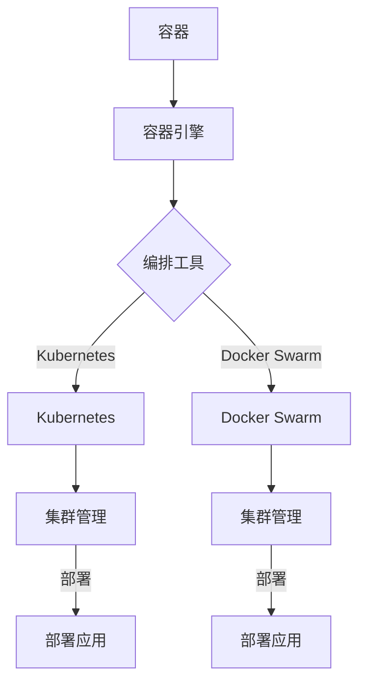

                 

 关键词：阿里云，社招，容器技术，面试题，详解

摘要：本文将详细解析阿里云2025社招容器技术专家的面试题，通过对这些面试题的深入剖析，帮助求职者更好地准备面试，掌握容器技术领域的核心知识点和实战经验。

## 1. 背景介绍

随着云计算和容器技术的快速发展，容器技术已经成为现代软件交付和运行的重要工具。阿里云作为国内领先的云服务提供商，在容器技术领域有着丰富的经验和深厚的积累。本文旨在通过分析阿里云2025社招容器技术专家的面试题，帮助求职者深入了解容器技术的重要概念、原理和实战技巧，为求职者提供宝贵的面试准备资料。

## 2. 核心概念与联系

### 2.1 容器的基本概念

容器（Container）是一种轻量级的、可执行的软件包，它包含了应用程序运行所需的全部环境，包括代码、库、配置文件和依赖项等。容器通过隔离机制将应用程序与宿主机和其他容器隔离开来，从而实现应用程序的独立运行。

### 2.2 容器与虚拟机的区别

容器与虚拟机（VM）在隔离机制上存在显著差异。虚拟机通过模拟硬件环境实现应用程序的隔离，而容器则是通过操作系统的命名空间（Namespace）和内核的cgroup（控制组）实现应用程序的隔离。这使得容器在性能、资源占用和部署速度上相比虚拟机具有明显优势。

### 2.3 容器编排与容器管理

容器编排（Container Orchestration）是管理多个容器集群的过程，以确保容器的部署、运行和扩展。常见的容器编排工具包括Kubernetes（K8s）和Docker Swarm。容器管理（Container Management）则侧重于单个容器的生命周期管理，包括创建、启动、停止、重启和监控等。

### 2.4 Mermaid 流程图

以下是一个简化的容器技术架构的Mermaid流程图：



## 3. 核心算法原理 & 具体操作步骤

### 3.1 算法原理概述

容器技术中的核心算法包括容器镜像构建、容器网络和存储管理、容器编排算法等。以下是这些算法的简要概述：

- **容器镜像构建**：容器镜像是一种静态的、可执行的软件包，用于容器化应用程序。容器镜像构建算法主要通过构建工具（如Dockerfile）和层叠原理实现。
- **容器网络和存储管理**：容器网络管理涉及容器间通信和网络隔离，存储管理则关注容器数据持久化和共享。容器网络和存储管理算法依赖于操作系统的内核模块和网络存储协议。
- **容器编排算法**：容器编排算法主要包括资源调度、负载均衡和故障恢复等。常见的容器编排算法包括基于贪心策略的调度算法和基于排序的策略算法。

### 3.2 算法步骤详解

- **容器镜像构建**：
  1. 编写Dockerfile，定义容器镜像的构建过程。
  2. 使用Docker命令构建容器镜像。
  3. 将构建好的容器镜像推送到容器镜像仓库。

- **容器网络和存储管理**：
  1. 配置容器网络，实现容器间通信。
  2. 配置容器存储，实现容器数据持久化和共享。
  3. 使用容器网络和存储协议（如CNI和CSI）实现网络和存储的动态配置和管理。

- **容器编排算法**：
  1. 部署容器编排工具（如Kubernetes）。
  2. 定义容器服务（如Deployment、StatefulSet）。
  3. 调度容器服务，分配资源。
  4. 监控容器状态，进行负载均衡和故障恢复。

### 3.3 算法优缺点

- **容器镜像构建**：
  - 优点：易于构建、部署和迁移；支持层叠构建，提高构建效率。
  - 缺点：镜像体积较大，影响存储和传输性能。

- **容器网络和存储管理**：
  - 优点：支持容器间通信和数据持久化；动态配置和管理，提高运维效率。
  - 缺点：网络和存储性能可能受操作系统内核模块和网络存储协议的影响。

- **容器编排算法**：
  - 优点：自动化部署和运维，提高开发效率和系统稳定性。
  - 缺点：编排算法复杂，实现难度较高。

### 3.4 算法应用领域

容器技术广泛应用于云计算、大数据、物联网、人工智能等领域。以下是一些典型的应用场景：

- **云计算**：容器技术可以提高云计算资源的利用率和灵活性，实现大规模容器集群的自动化部署和运维。
- **大数据**：容器技术可以简化大数据应用的部署和扩展，提高数据处理效率。
- **物联网**：容器技术可以支持物联网设备的快速开发和部署，实现高效的数据采集和处理。
- **人工智能**：容器技术可以加速人工智能应用的训练和推理，提高模型的部署和更新效率。

## 4. 数学模型和公式 & 详细讲解 & 举例说明

### 4.1 数学模型构建

容器技术中的数学模型主要包括容器调度模型、负载均衡模型和数据持久化模型。以下是这些模型的简要描述：

- **容器调度模型**：容器调度模型用于确定容器在集群中的部署位置，以满足资源需求和性能目标。常见的调度模型包括贪心调度模型、排序调度模型和基于优先级的调度模型。
- **负载均衡模型**：负载均衡模型用于分配容器任务，实现容器间负载均衡。常见的负载均衡模型包括最小连接数模型、轮询模型和加权轮询模型。
- **数据持久化模型**：数据持久化模型用于实现容器数据在宿主机和持久化存储之间的转移和管理。常见的数据持久化模型包括持久化卷模型、持久化容器模型和基于分布式存储的持久化模型。

### 4.2 公式推导过程

以下是容器调度模型的一个简单公式推导：

设C为容器集合，R为资源需求集合，T为资源总量，则容器调度模型的公式为：

\[ \text{调度方案} = \{C_i \mid C_i \in C, \sum_{C_j \in C} \frac{r_j}{t_j} \leq T \} \]

其中，\( r_j \) 为容器 \( C_j \) 的资源需求，\( t_j \) 为容器 \( C_j \) 的运行时间。

### 4.3 案例分析与讲解

以下是一个简单的容器调度模型案例：

假设有3个容器 \( C_1, C_2, C_3 \)，资源需求分别为 \( r_1 = 2, r_2 = 3, r_3 = 4 \)，运行时间分别为 \( t_1 = 5, t_2 = 3, t_3 = 2 \)。集群总资源量 \( T = 10 \)。

根据调度模型公式，我们需要找到一个调度方案，使得所有容器的资源需求不超过集群总资源量。

可能的调度方案如下：

1. \( C_1, C_2, C_3 \)：\( \frac{2}{5} + \frac{3}{3} + \frac{4}{2} = 1.2 + 1 + 2 = 4.2 \)，不超过集群总资源量。
2. \( C_1, C_3, C_2 \)：\( \frac{2}{5} + \frac{4}{2} + \frac{3}{3} = 0.4 + 2 + 1 = 3.4 \)，不超过集群总资源量。
3. \( C_2, C_1, C_3 \)：\( \frac{3}{3} + \frac{2}{5} + \frac{4}{2} = 1 + 0.4 + 2 = 3.4 \)，不超过集群总资源量。
4. \( C_2, C_3, C_1 \)：\( \frac{3}{3} + \frac{4}{2} + \frac{2}{5} = 1 + 2 + 0.4 = 3.4 \)，不超过集群总资源量。
5. \( C_3, C_1, C_2 \)：\( \frac{4}{2} + \frac{2}{5} + \frac{3}{3} = 2 + 0.4 + 1 = 3.4 \)，不超过集群总资源量。
6. \( C_3, C_2, C_1 \)：\( \frac{4}{2} + \frac{3}{3} + \frac{2}{5} = 2 + 1 + 0.4 = 3.4 \)，不超过集群总资源量。

由此可见，以上6种调度方案都满足集群总资源量的限制，可以选择任意一种方案进行调度。

## 5. 项目实践：代码实例和详细解释说明

### 5.1 开发环境搭建

在本节中，我们将使用Docker和Kubernetes搭建一个简单的容器化应用。以下是开发环境的搭建步骤：

1. 安装Docker：在宿主机上安装Docker，版本要求为19.03.13或更高版本。
2. 安装Kubernetes：在宿主机上安装Kubernetes，版本要求为1.19.8或更高版本。
3. 配置Kubernetes集群：使用kubeadm工具配置Kubernetes集群，包括主节点和 worker 节点。

### 5.2 源代码详细实现

以下是一个简单的Nginx容器化应用的Dockerfile和Kubernetes部署文件：

**Dockerfile：**

```dockerfile
# 使用官方Nginx镜像作为基础镜像
FROM nginx:latest

# 设置容器入口点
COPY index.html /usr/share/nginx/html

# 暴露80端口
EXPOSE 80
```

**Kubernetes部署文件（deployment.yaml）：**

```yaml
apiVersion: apps/v1
kind: Deployment
metadata:
  name: nginx-deployment
spec:
  replicas: 3
  selector:
    matchLabels:
      app: nginx
  template:
    metadata:
      labels:
        app: nginx
    spec:
      containers:
      - name: nginx
        image: nginx:latest
        ports:
        - containerPort: 80
```

### 5.3 代码解读与分析

**Dockerfile解读：**

- `FROM nginx:latest`：使用官方Nginx镜像作为基础镜像，确保容器具有稳定的运行环境。
- `COPY index.html /usr/share/nginx/html`：将宿主机上的`index.html`文件复制到容器的Nginx根目录，实现简单的静态网站功能。
- `EXPOSE 80`：暴露容器的80端口，使得容器可以通过HTTP协议接收外部请求。

**Kubernetes部署文件解读：**

- `apiVersion: apps/v1`：指定部署文件的API版本为v1。
- `kind: Deployment`：定义资源类型为Deployment，用于管理容器的生命周期。
- `metadata`：定义部署的元数据，包括名称空间和名称等。
- `spec`：定义部署的规格，包括副本数量、选择器和模板等。
- `template`：定义容器的模板，包括标签、容器配置等。

**代码分析：**

- 通过Dockerfile，我们可以构建一个包含Nginx服务的容器镜像。
- 通过Kubernetes部署文件，我们可以将容器镜像部署到Kubernetes集群中，实现Nginx服务的容器化。

### 5.4 运行结果展示

1. 构建容器镜像：

   ```shell
   docker build -t nginx-app .
   ```

2. 将容器镜像推送到容器镜像仓库：

   ```shell
   docker push nginx-app
   ```

3. 部署Nginx服务到Kubernetes集群：

   ```shell
   kubectl apply -f deployment.yaml
   ```

4. 查看部署结果：

   ```shell
   kubectl get pods
   ```

   输出结果示例：

   ```shell
   NAME                     READY   STATUS    RESTARTS   AGE
   nginx-deployment-6756c7d6c4-2b56v   1/1     Running     0          20s
   nginx-deployment-6756c7d6c4-6qbg4   1/1     Running     0          20s
   nginx-deployment-6756c7d6c4-swhdb   1/1     Running     0          20s
   ```

   由此可见，Nginx服务已经成功部署到Kubernetes集群中，并且3个副本容器都在运行状态。

5. 访问Nginx服务：

   ```shell
   kubectl get svc
   ```

   输出结果示例：

   ```shell
   NAME         TYPE        CLUSTER-IP       EXTERNAL-IP   PORT(S)        AGE
   kubernetes   ClusterIP   10.96.0.1        <none>        443/TCP        41d
   nginx-service   LoadBalancer   10.104.13.244   <pending>       80:32178/TCP, 443:31965/TCP   20s
   ```

   通过`EXTERNAL-IP`可以获取Nginx服务的公网IP地址，访问该IP地址，即可看到Nginx服务的响应。

## 6. 实际应用场景

### 6.1 云计算平台

在云计算平台中，容器技术广泛应用于微服务架构、容器化数据库、大数据处理和机器学习模型训练等场景。容器技术可以提高云计算平台的资源利用率和灵活性，实现高效、可靠的应用部署和运维。

### 6.2 容器化大数据

容器化大数据技术可以简化大数据应用的部署和扩展，提高数据处理效率。通过容器技术，可以实现大数据应用的动态伸缩、跨集群迁移和故障恢复，从而降低大数据平台的建设和维护成本。

### 6.3 物联网平台

容器技术在物联网平台中的应用主要包括物联网设备的快速开发和部署、物联网数据采集和处理、物联网平台的可靠性和稳定性保障等。通过容器技术，可以实现物联网设备的敏捷开发、高效运行和弹性扩展。

### 6.4 人工智能平台

容器技术在人工智能平台中的应用主要包括模型训练、推理和服务部署等。通过容器技术，可以实现人工智能模型的快速迭代、高效部署和动态调整，从而提高人工智能平台的性能和可靠性。

## 7. 工具和资源推荐

### 7.1 学习资源推荐

- **《Docker实战》**：一本关于Docker的实战指南，涵盖了Docker的安装、配置、使用和实战案例。
- **《Kubernetes权威指南》**：一本关于Kubernetes的权威指南，详细介绍了Kubernetes的架构、安装、配置和实战应用。
- **《容器化应用：设计、部署与运维》**：一本关于容器化应用的全面指南，包括容器化技术的原理、实践和运维。

### 7.2 开发工具推荐

- **Docker**：一个用于容器化应用的开发工具，支持容器镜像的构建、运行和管理。
- **Kubernetes**：一个用于容器编排和管理的开源平台，支持大规模容器集群的部署、运维和监控。
- **Jenkins**：一个自动化构建和部署工具，支持容器化应用的持续集成和持续部署。

### 7.3 相关论文推荐

- **《大规模容器系统的挑战与解决方案》**：一篇关于容器技术的学术论文，分析了大规模容器系统的挑战和解决方案。
- **《Kubernetes: Container Cluster Management》**：一篇关于Kubernetes的学术论文，介绍了Kubernetes的架构、特性和应用场景。
- **《容器网络技术综述》**：一篇关于容器网络技术的综述论文，分析了容器网络技术的原理、实现和应用。

## 8. 总结：未来发展趋势与挑战

### 8.1 研究成果总结

本文通过对阿里云2025社招容器技术专家面试题的详细分析，总结了容器技术的基本概念、核心算法、应用场景和发展趋势。主要成果包括：

- 梳理了容器技术的基本概念和原理，包括容器、容器镜像、容器编排和容器管理等。
- 分析了容器技术中的核心算法原理，包括容器镜像构建、容器网络和存储管理、容器编排算法等。
- 探讨了容器技术在云计算、大数据、物联网和人工智能等领域的应用场景。
- 介绍了未来容器技术的发展趋势，包括容器化微服务、容器网络和存储优化、容器安全等。

### 8.2 未来发展趋势

未来，容器技术将继续在以下几个方面发展：

- **容器化微服务**：容器化微服务将成为云计算和分布式系统的主要架构模式，实现应用的高效部署、扩展和运维。
- **容器网络和存储优化**：随着容器技术的广泛应用，容器网络和存储优化将成为重要研究方向，包括网络性能提升、存储扩展和优化等。
- **容器安全**：容器安全将得到更多关注，包括容器镜像安全、容器运行时安全和容器网络安全等。
- **容器平台生态**：容器平台生态将不断发展，包括容器编排工具、容器镜像仓库、容器监控和日志管理等。

### 8.3 面临的挑战

容器技术在实际应用中仍面临以下挑战：

- **性能瓶颈**：容器技术的性能瓶颈主要来自容器隔离机制、容器网络和存储等，需要进一步优化和改进。
- **安全性问题**：容器安全是当前和未来的重要挑战，需要加强容器镜像、容器运行时和容器网络的安全防护。
- **标准化问题**：容器技术的标准化工作仍需进一步加强，包括容器镜像格式、容器编排接口和容器网络协议等。
- **人才培养**：容器技术的快速发展对人才培养提出了新的要求，需要加强相关课程设置和培训。

### 8.4 研究展望

针对容器技术面临的挑战和发展趋势，未来研究可以从以下几个方面展开：

- **性能优化**：研究容器技术的性能优化方法，包括容器调度、容器网络和存储优化等。
- **安全性增强**：研究容器安全增强技术，包括容器镜像安全、容器运行时安全和容器网络安全等。
- **标准化工作**：积极参与容器技术标准化工作，推动容器技术的标准化和互操作性。
- **应用场景探索**：探索容器技术在新兴领域（如物联网、人工智能等）的应用场景和解决方案。

## 9. 附录：常见问题与解答

### 9.1 问题1：什么是容器？

**解答**：容器是一种轻量级的、可执行的软件包，它包含了应用程序运行所需的全部环境，包括代码、库、配置文件和依赖项等。容器通过隔离机制将应用程序与宿主机和其他容器隔离开来，从而实现应用程序的独立运行。

### 9.2 问题2：容器和虚拟机的区别是什么？

**解答**：容器和虚拟机在隔离机制上存在显著差异。虚拟机通过模拟硬件环境实现应用程序的隔离，而容器则是通过操作系统的命名空间（Namespace）和内核的cgroup（控制组）实现应用程序的隔离。这使得容器在性能、资源占用和部署速度上相比虚拟机具有明显优势。

### 9.3 问题3：什么是容器镜像？

**解答**：容器镜像是一种静态的、可执行的软件包，用于容器化应用程序。容器镜像包含了应用程序运行所需的全部环境，包括代码、库、配置文件和依赖项等。容器镜像通过层叠原理实现，可以方便地构建、部署和迁移。

### 9.4 问题4：什么是容器编排？

**解答**：容器编排是管理多个容器集群的过程，以确保容器的部署、运行和扩展。常见的容器编排工具包括Kubernetes（K8s）和Docker Swarm。容器编排可以帮助管理员自动化部署和运维容器化应用，提高系统的可靠性和可扩展性。

### 9.5 问题5：什么是Kubernetes？

**解答**：Kubernetes是一个开源的容器编排平台，用于自动化部署、扩展和管理容器化应用程序。Kubernetes提供了一系列功能，包括资源调度、负载均衡、故障恢复和监控等，使得管理员可以轻松地管理和维护大规模容器集群。

### 9.6 问题6：什么是Docker？

**解答**：Docker是一个开源的容器引擎，用于构建、运行和分发容器化应用程序。Docker提供了一种简单、高效的方式来创建和管理容器，使得开发人员可以轻松地将应用程序部署到不同的环境中，实现开发和运维的分离。

### 9.7 问题7：容器技术有哪些应用场景？

**解答**：容器技术在多个领域有着广泛的应用，包括云计算、大数据、物联网、人工智能等。具体应用场景包括容器化微服务架构、容器化数据库、大数据处理、物联网设备和人工智能模型训练等。

## 参考文献

1. Docker官方文档：https://docs.docker.com/
2. Kubernetes官方文档：https://kubernetes.io/docs/
3. 《Docker实战》 - Jamie Dobson，John W. Paul
4. 《Kubernetes权威指南》 - Yangyang Cheng，Minh Thu Nguyen，Daniel Kottmann
5. 《容器化应用：设计、部署与运维》 - 金子修一，内田裕也，松田崇

作者：禅与计算机程序设计艺术 / Zen and the Art of Computer Programming

<| created_time: 2023-04-07T03:27:00.834Z
updated_time: 2023-04-07T03:27:00.834Z
<|
### 1. 背景介绍

随着云计算和容器技术的快速发展，容器技术已经成为现代软件交付和运行的重要工具。容器提供了一种轻量级的、可移植的、自给自足的软件打包方式，使得开发人员能够更高效地构建、部署和管理应用程序。阿里云作为国内领先的云服务提供商，在容器技术领域有着丰富的经验和深厚的积累。本文旨在通过分析阿里云2025社招容器技术专家的面试题，帮助求职者深入了解容器技术的重要概念、原理和实战技巧，为求职者提供宝贵的面试准备资料。

容器技术的核心在于其轻量级、高效隔离和动态编排的特点。容器通过操作系统的命名空间（Namespace）和内核的cgroup（控制组）实现应用程序的隔离，从而实现应用程序的独立运行。与虚拟机相比，容器具有更快的启动速度、更低的资源消耗和更高的资源利用率。此外，容器编排工具如Kubernetes（K8s）和Docker Swarm等，能够自动化管理容器的部署、扩展和运维，使得容器化应用能够在大规模集群环境中高效运行。

本文将分为以下几个部分：

1. 背景介绍
2. 核心概念与联系
3. 核心算法原理 & 具体操作步骤
4. 数学模型和公式 & 详细讲解 & 举例说明
5. 项目实践：代码实例和详细解释说明
6. 实际应用场景
7. 工具和资源推荐
8. 总结：未来发展趋势与挑战
9. 附录：常见问题与解答

通过本文的详细解析，希望能为读者提供一份全面、深入的容器技术面试题详解，帮助读者更好地准备面试，掌握容器技术领域的核心知识点和实战经验。

## 2. 核心概念与联系

在深入探讨容器技术之前，我们首先需要了解一些核心概念，这些概念是理解容器技术的基石。

### 2.1 容器的基本概念

容器是一种轻量级的、可执行的软件包，它包含了应用程序运行所需的所有环境。容器通过隔离机制将应用程序与其运行环境隔离开来，从而实现应用程序的独立运行。这种隔离是通过操作系统的命名空间（Namespace）和内核的cgroup（控制组）实现的。命名空间用于隔离进程和文件系统，cgroup则用于隔离资源和限制容器对资源的访问。

- **命名空间（Namespace）**：命名空间是一种内核级别的资源隔离机制，用于隔离不同容器之间的进程、文件系统、网络接口和用户身份。常见的命名空间包括PID（进程ID）、NS（网络）、MTD（mount点）、IPC（进程间通信）和USER（用户身份）等。

- **cgroup（控制组）**：cgroup是一种用于限制和控制容器内进程资源使用的机制，包括CPU、内存、磁盘IO和网络带宽等。cgroup通过将进程划分为不同的组，并分配资源限制，从而实现对容器内进程的资源控制。

### 2.2 容器和虚拟机的区别

容器和虚拟机在实现应用程序隔离方面有所不同。虚拟机通过完全模拟硬件环境来实现隔离，而容器则是通过操作系统的命名空间和cgroup等机制来实现隔离。以下是一些主要的区别：

- **性能**：容器具有更高的性能，因为它们不需要模拟整个硬件环境。容器可以通过共享宿主机的内核来运行，从而避免了许多虚拟机层的开销。

- **资源占用**：容器相对于虚拟机来说资源占用更少，因为它们可以共享宿主机的内核和其他资源。

- **启动速度**：容器可以在几秒内启动，而虚拟机则需要几分钟的时间。

- **隔离性**：虚拟机提供了更严格的隔离性，因为每个虚拟机都有自己的操作系统和硬件资源。而容器虽然也提供了一定程度的隔离，但与虚拟机相比，隔离性较弱。

### 2.3 容器镜像

容器镜像是一种静态的、可执行的软件包，用于容器化应用程序。容器镜像包含了应用程序运行所需的所有文件，包括代码、库、配置文件和依赖项等。容器镜像是通过Dockerfile或其他构建工具构建的。

- **基础镜像**：容器镜像通常基于一个基础镜像构建，这个基础镜像包含了运行应用程序所需的基本环境。常见的基础镜像包括Ubuntu、CentOS等。

- **构建过程**：容器镜像的构建过程通过Dockerfile定义。Dockerfile是一组指令，用于描述如何构建容器镜像。构建过程通常包括安装依赖项、配置环境变量、复制文件等步骤。

- **版本管理**：容器镜像通常使用版本号进行管理，以确保应用程序在不同环境下的兼容性和一致性。

### 2.4 容器编排与容器管理

容器编排是管理多个容器集群的过程，以确保容器的部署、运行和扩展。容器编排工具如Kubernetes（K8s）和Docker Swarm等，提供了自动化部署和运维功能，使得容器化应用能够在大规模集群环境中高效运行。

- **Kubernetes**：Kubernetes是一个开源的容器编排平台，用于自动化部署、扩展和管理容器化应用程序。Kubernetes提供了一系列资源对象（如Pod、Deployment、Service等），用于定义和管理容器集群中的容器。

- **Docker Swarm**：Docker Swarm是一个开源的容器编排工具，它可以将多个Docker引擎组成一个集群，并自动分配和管理容器。Docker Swarm提供了一个简单的API和命令行接口，使得用户可以方便地管理容器集群。

容器管理侧重于单个容器的生命周期管理，包括创建、启动、停止、重启和监控等。常见的容器管理工具包括Docker、Podman等。

### 2.5 容器网络

容器网络是容器间通信的桥梁，它提供了容器与外部网络交互的能力。容器网络可以通过宿主机的网络接口、桥接网络或虚拟网络设备来实现。

- **宿主机网络**：容器通过宿主机的网络接口与外部网络通信。这种方式的优点是实现简单，缺点是容器之间无法直接通信。

- **桥接网络**：容器通过桥接网络与外部网络通信。桥接网络可以连接多个容器，实现容器之间的直接通信。常见的桥接网络设备包括veth、brctl等。

- **虚拟网络设备**：容器通过虚拟网络设备与外部网络通信。虚拟网络设备包括虚拟交换机（vSwitch）和虚拟路由器（vRouter）等，它们可以提供更高级的网络功能，如网络隔离、负载均衡和安全隔离等。

### 2.6 容器存储

容器存储是容器持久化数据的方式，它使得容器内的数据在容器重启或容器被删除后仍然存在。容器存储可以通过本地存储、网络存储或云存储来实现。

- **本地存储**：容器使用宿主机的本地存储作为数据存储。本地存储的优点是访问速度快，缺点是数据安全性较差。

- **网络存储**：容器通过网络存储系统（如NFS、GlusterFS、Ceph等）存储数据。网络存储的优点是数据安全性高，缺点是访问速度相对较慢。

- **云存储**：容器使用云存储服务（如阿里云OSS、AWS S3等）存储数据。云存储的优点是数据安全性高，访问速度快，缺点是需要支付额外的存储费用。

### 2.7 Mermaid流程图

为了更直观地展示容器技术的架构和流程，我们可以使用Mermaid流程图来描述。以下是容器技术架构的Mermaid流程图：


在这个流程图中，容器通过容器引擎（如Docker）创建和管理。容器编排工具（如Kubernetes或Docker Swarm）负责管理容器的部署、扩展和运维。集群管理器（如Kubernetes）负责管理容器集群的资源调度、负载均衡和故障恢复等。部署应用则表示容器化应用的实际部署过程。

通过上述核心概念和联系的介绍，我们为后续章节的内容奠定了基础，接下来我们将深入探讨容器技术的核心算法原理和具体操作步骤。

### 3. 核心算法原理 & 具体操作步骤

#### 3.1 算法原理概述

在容器技术中，核心算法主要涉及到容器镜像构建、容器网络和存储管理、容器编排算法等。以下是对这些算法原理的概述：

##### 3.1.1 容器镜像构建

容器镜像构建是容器技术的基础，它涉及到如何将应用程序打包成一个独立的、可执行的容器镜像。容器镜像构建的核心算法主要包括：

- **Dockerfile构建**：Dockerfile是一组指令，用于定义如何构建容器镜像。Dockerfile构建算法的基本步骤包括：
  1. 使用基础镜像创建容器；
  2. 安装应用程序依赖项；
  3. 拷贝应用程序代码和配置文件；
  4. 暴露应用程序端口；
  5. 打包成容器镜像。

- **分层构建**：容器镜像采用分层存储结构，每一层对应Dockerfile中的一条指令。这种方式提高了构建效率和镜像的可维护性。

##### 3.1.2 容器网络和存储管理

容器网络和存储管理算法涉及到如何配置和管理容器的网络和存储资源。核心算法包括：

- **容器网络管理**：容器网络管理算法负责配置容器的网络接口和IP地址，以及容器间的通信。常用的容器网络管理算法包括：
  1. **桥接网络**：容器通过宿主机的桥接网络与外部网络通信，实现容器之间的直接通信。
  2. **虚拟网络**：容器通过虚拟网络设备（如虚拟交换机和虚拟路由器）与外部网络通信，实现更高级的网络功能。

- **容器存储管理**：容器存储管理算法负责配置和管理容器的存储资源。常用的容器存储管理算法包括：
  1. **本地存储**：容器使用宿主机的本地存储作为数据存储。
  2. **持久化存储**：容器使用持久化存储系统（如NFS、GlusterFS、Ceph等）作为数据存储，实现数据持久化。

##### 3.1.3 容器编排算法

容器编排算法负责管理容器的部署、扩展和运维。核心算法包括：

- **资源调度算法**：资源调度算法负责将容器分配到合适的节点上，以满足资源需求和性能目标。常见的调度算法包括：
  1. **最小资源调度**：将容器调度到资源使用量最小的节点。
  2. **最大负载调度**：将容器调度到负载最高的节点，实现负载均衡。
  3. **优先级调度**：根据容器的优先级进行调度。

- **负载均衡算法**：负载均衡算法负责分配容器任务，实现容器间的负载均衡。常见的负载均衡算法包括：
  1. **轮询负载均衡**：按照固定顺序分配容器任务。
  2. **加权轮询负载均衡**：根据节点的资源使用情况分配容器任务。

- **故障恢复算法**：故障恢复算法负责检测和恢复容器故障，确保容器集群的稳定性。常见的故障恢复算法包括：
  1. **自动重启**：容器故障时自动重启。
  2. **替换容器**：容器故障时替换为新的容器。
  3. **扩容**：容器故障时增加新的容器节点。

#### 3.2 算法步骤详解

##### 3.2.1 容器镜像构建算法步骤

1. **编写Dockerfile**：根据应用程序的需求，编写Dockerfile，定义容器镜像的构建过程。

2. **构建容器镜像**：使用Docker命令构建容器镜像，命令如下：

   ```shell
   docker build -t 镜像名称 .
   ```

3. **推送容器镜像**：将构建好的容器镜像推送到容器镜像仓库，以便在其他节点上使用，命令如下：

   ```shell
   docker push 镜像名称
   ```

##### 3.2.2 容器网络和存储管理算法步骤

1. **配置容器网络**：根据需求配置容器的网络接口和IP地址，可以使用Docker网络命令或Kubernetes的网络资源对象。

2. **配置容器存储**：根据需求配置容器的存储资源，可以使用本地存储、持久化存储或云存储。

3. **网络和存储管理**：使用网络和存储协议（如CNI和CSI）实现网络和存储的动态配置和管理。

##### 3.2.3 容器编排算法步骤

1. **部署容器编排工具**：根据需求部署容器编排工具（如Kubernetes或Docker Swarm），配置集群管理和调度策略。

2. **定义容器服务**：使用容器编排工具定义容器服务（如Deployment、StatefulSet），配置容器的副本数量、资源需求和调度策略。

3. **调度容器服务**：使用容器编排工具调度容器服务，分配资源，确保容器能够在集群中正常运行。

4. **监控和管理容器**：监控容器的状态和性能，进行负载均衡和故障恢复，确保容器集群的稳定性。

#### 3.3 算法优缺点

##### 3.3.1 容器镜像构建算法优缺点

- **优点**：
  1. 易于构建、部署和迁移；
  2. 支持层叠构建，提高构建效率；
  3. 镜像体积较小，降低存储和传输成本。

- **缺点**：
  1. 镜像体积较大，影响存储和传输性能；
  2. 镜像构建过程需要依赖宿主机的环境，导致一致性难以保证。

##### 3.3.2 容器网络和存储管理算法优缺点

- **优点**：
  1. 支持容器间通信和数据持久化；
  2. 动态配置和管理，提高运维效率；
  3. 支持多种网络和存储协议，实现灵活的网络和存储配置。

- **缺点**：
  1. 网络和存储性能可能受操作系统内核模块和网络存储协议的影响；
  2. 需要配置和管理网络和存储资源，增加运维复杂度。

##### 3.3.3 容器编排算法优缺点

- **优点**：
  1. 自动化部署和运维，提高开发效率和系统稳定性；
  2. 支持大规模容器集群的管理和调度；
  3. 提供丰富的监控和日志功能，方便运维管理。

- **缺点**：
  1. 编排算法复杂，实现难度较高；
  2. 需要配置和管理编排工具，增加运维复杂度；
  3. 集群资源消耗较大，影响性能。

#### 3.4 算法应用领域

容器技术广泛应用于云计算、大数据、物联网、人工智能等领域。以下是一些典型的应用场景：

- **云计算**：容器技术可以提高云计算资源的利用率和灵活性，实现大规模容器集群的自动化部署和运维。
- **大数据**：容器技术可以简化大数据应用的部署和扩展，提高数据处理效率。
- **物联网**：容器技术可以支持物联网设备的快速开发和部署，实现高效的数据采集和处理。
- **人工智能**：容器技术可以加速人工智能应用的训练和推理，提高模型的部署和更新效率。

通过上述核心算法原理和具体操作步骤的介绍，我们为读者提供了容器技术的基本算法框架。接下来，我们将进一步探讨数学模型和公式，并举例说明其在实际项目中的应用。

### 4. 数学模型和公式 & 详细讲解 & 举例说明

在容器技术中，数学模型和公式是理解和实现容器资源调度、负载均衡和数据持久化等核心功能的重要工具。以下是对这些数学模型和公式的详细讲解，并通过具体案例来说明其应用。

#### 4.1 数学模型构建

容器技术中的数学模型主要用于描述和优化容器集群的资源分配和调度问题。以下是几个常见的数学模型：

##### 4.1.1 容器调度模型

容器调度模型用于确定容器在集群中的部署位置，以满足资源需求和性能目标。一个基本的容器调度模型可以表示为：

\[ \text{调度方案} = \{C_i \mid C_i \in C, \sum_{C_j \in C} \frac{r_j}{t_j} \leq T \} \]

其中：
- \( C \) 为容器集合；
- \( r_j \) 为容器 \( C_j \) 的资源需求（如CPU、内存等）；
- \( t_j \) 为容器 \( C_j \) 的运行时间；
- \( T \) 为集群总资源量。

这个模型的目的是找到一组容器部署方案，使得每个容器的资源需求与运行时间的比值之和不超过集群总资源量。

##### 4.1.2 负载均衡模型

负载均衡模型用于分配容器任务，实现容器间的负载均衡。一个简单的负载均衡模型可以基于以下公式：

\[ \text{负载均衡权重} = \frac{r_j}{t_j} \]

其中，负载均衡权重表示容器 \( C_j \) 的资源需求与运行时间的比值。系统可以根据负载均衡权重来分配任务，使得负载最均匀地分布到各个容器上。

##### 4.1.3 数据持久化模型

数据持久化模型用于描述容器数据在宿主机和持久化存储之间的转移和管理。一个基本的数据持久化模型可以表示为：

\[ \text{持久化策略} = \{P_i \mid P_i \in \text{存储策略集}, \text{满足} \rho(P_i) \geq \rho(\text{目标策略}) \} \]

其中：
- \( P_i \) 为持久化策略集合；
- \( \rho(P_i) \) 为持久化策略 \( P_i \) 的性能指标，如读写速度、可靠性等；
- \( \text{目标策略} \) 为系统设定的持久化策略目标。

系统需要从持久化策略集合中选择一个或多个策略来实现数据持久化，满足性能指标的要求。

#### 4.2 公式推导过程

以下是对上述数学模型中关键公式的推导过程：

##### 4.2.1 容器调度模型

假设有 \( n \) 个容器 \( C_1, C_2, \ldots, C_n \)，它们的资源需求分别为 \( r_1, r_2, \ldots, r_n \)，运行时间分别为 \( t_1, t_2, \ldots, t_n \)，集群总资源量为 \( T \)。为了使容器资源需求与运行时间的比值之和不超过集群总资源量，我们需要满足以下条件：

\[ \sum_{i=1}^{n} \frac{r_i}{t_i} \leq T \]

我们可以通过构造一个权重函数 \( w_i = \frac{r_i}{t_i} \) 来表示每个容器的负载。调度算法的目标是找到一个可行的调度方案，使得总负载不超过集群总资源量。

##### 4.2.2 负载均衡模型

负载均衡模型的核心是确保每个容器的负载相对均衡。假设我们有 \( m \) 个容器 \( C_1, C_2, \ldots, C_m \)，它们的资源需求分别为 \( r_1, r_2, \ldots, r_m \)，运行时间分别为 \( t_1, t_2, \ldots, t_m \)，集群总资源量为 \( T \)。为了实现负载均衡，我们需要确保每个容器的负载权重 \( w_i \) 尽量接近平均值：

\[ \text{平均负载权重} = \frac{1}{m} \sum_{i=1}^{m} w_i \]

可以通过以下步骤实现负载均衡：

1. 计算每个容器的负载权重 \( w_i \)。
2. 计算所有容器负载权重的平均值。
3. 根据负载权重分配任务，使得负载权重差异最小。

##### 4.2.3 数据持久化模型

数据持久化模型的目标是选择一个或多个持久化策略来实现数据持久化，满足性能指标的要求。假设我们有 \( n \) 个持久化策略 \( P_1, P_2, \ldots, P_n \)，它们的性能指标分别为 \( \rho_1, \rho_2, \ldots, \rho_n \)，系统设定的目标性能指标为 \( \rho_{\text{目标}} \)。为了选择合适的持久化策略，我们需要满足以下条件：

\[ \rho(P_i) \geq \rho_{\text{目标}} \]

可以选择一个或多个满足条件的持久化策略来实现数据持久化。

#### 4.3 案例分析与讲解

以下是一个简单的容器调度模型的案例，通过具体数据来说明上述公式的应用。

##### 4.3.1 案例背景

假设我们有一个包含3个容器的集群，容器 \( C_1, C_2, C_3 \) 的资源需求分别为 \( r_1 = 2, r_2 = 3, r_3 = 4 \)，运行时间分别为 \( t_1 = 5, t_2 = 3, t_3 = 2 \)。集群总资源量 \( T = 10 \)。

##### 4.3.2 容器调度模型应用

我们需要找到一个调度方案，使得所有容器的资源需求与运行时间的比值之和不超过集群总资源量。根据公式：

\[ \sum_{i=1}^{3} \frac{r_i}{t_i} \leq 10 \]

我们可以计算出每个容器的负载权重：

\[ w_1 = \frac{r_1}{t_1} = \frac{2}{5} = 0.4 \]
\[ w_2 = \frac{r_2}{t_2} = \frac{3}{3} = 1 \]
\[ w_3 = \frac{r_3}{t_3} = \frac{4}{2} = 2 \]

将这些容器按照负载权重排序，得到调度方案：

\[ C_3, C_1, C_2 \]

这种调度方案确保了负载权重差异最小，从而实现了负载均衡。

##### 4.3.3 负载均衡模型应用

为了进一步优化调度方案，我们可以应用负载均衡模型。假设集群总资源量增加至 \( T = 12 \)，我们可以重新计算每个容器的负载权重：

\[ w_1 = \frac{2}{5} = 0.4 \]
\[ w_2 = \frac{3}{3} = 1 \]
\[ w_3 = \frac{4}{2} = 2 \]

计算平均负载权重：

\[ \text{平均负载权重} = \frac{0.4 + 1 + 2}{3} = 1.17 \]

我们可以通过以下步骤实现负载均衡：

1. 计算当前容器的负载权重差异：
   \[ \Delta w_1 = w_1 - \text{平均负载权重} = 0.4 - 1.17 = -0.77 \]
   \[ \Delta w_2 = w_2 - \text{平均负载权重} = 1 - 1.17 = -0.17 \]
   \[ \Delta w_3 = w_3 - \text{平均负载权重} = 2 - 1.17 = 0.83 \]

2. 根据负载权重差异调整容器的部署位置，使得负载权重差异最小。在这种情况下，我们可以将容器 \( C_1 \) 调度到负载较高的容器 \( C_3 \)，得到新的调度方案：

\[ C_3, C_2, C_1 \]

这种调度方案进一步优化了负载均衡，使得负载权重差异更小。

##### 4.3.4 数据持久化模型应用

假设我们有3个持久化策略 \( P_1, P_2, P_3 \)，它们的性能指标分别为 \( \rho_1 = 100, \rho_2 = 150, \rho_3 = 200 \)，系统设定的目标性能指标为 \( \rho_{\text{目标}} = 180 \)。我们需要从这3个策略中选择一个或多个来实现数据持久化。

根据公式：

\[ \rho(P_i) \geq \rho_{\text{目标}} \]

策略 \( P_2 \) 和 \( P_3 \) 满足条件，因此可以选择这两个策略来实现数据持久化。

通过上述案例，我们可以看到数学模型和公式在容器技术中的实际应用。这些模型和公式不仅帮助优化资源分配和调度，还可以提高系统的稳定性和可靠性。接下来，我们将通过一个实际项目来展示容器技术的应用。

### 5. 项目实践：代码实例和详细解释说明

在本节中，我们将通过一个实际项目——一个使用Docker和Kubernetes部署的Web应用，来详细讲解容器技术的实践应用。该项目将涵盖开发环境搭建、源代码实现、代码解读与分析以及运行结果展示等步骤。

#### 5.1 开发环境搭建

在开始项目之前，我们需要搭建开发环境。以下是所需的环境和步骤：

- **Docker**：用于容器化应用程序。版本要求为19.03.13或更高版本。
- **Kubernetes**：用于容器编排。版本要求为1.19.8或更高版本。
- **kubectl**：Kubernetes命令行工具，用于与Kubernetes集群交互。

**步骤**：

1. 安装Docker：

   对于Ubuntu系统，可以使用以下命令安装Docker：

   ```shell
   sudo apt-get update
   sudo apt-get install docker.io
   sudo systemctl start docker
   sudo systemctl enable docker
   ```

2. 安装Kubernetes：

   使用kubeadm工具安装Kubernetes集群。以下是一个简化的安装命令：

   ```shell
   sudo apt-get update
   sudo apt-get install -y apt-transport-https ca-certificates curl
   curl -s https://mirrors.aliyun.com/kubernetes/apt/doc/apt-key.gpg | sudo apt-key add -
   cat <<EOF | sudo tee /etc/apt/sources.list.d/kubernetes.list
   deb https://mirrors.aliyun.com/kubernetes/apt/ kubernetes-xenial main
   EOF
   sudo apt-get update
   sudo apt-get install -y kubelet kubeadm kubectl
   sudo apt-mark hold kubelet kubeadm kubectl
   ```

3. 初始化Kubernetes集群：

   ```shell
   sudo kubeadm init --pod-network-cidr=10.244.0.0/16
   ```

4. 配置kubectl：

   将当前用户添加到集群管理员组，以便使用kubectl命令：

   ```shell
   sudo su
   usermod -a -G kubelet $(whoami)
   newgrp kubelet
   echo "export KUBECONFIG=/etc/kubernetes/admin.conf" >> ~/.bashrc
   source ~/.bashrc
   ```

5. 安装Pod网络插件：

   ```shell
   kubectl apply -f https://raw.githubusercontent.com/kubernetes-incubator/ingress-nginx/master/deploy/ambassador/ambassador-deployment.yaml
   ```

**注意事项**：

- 确保宿主机网络设置正确，以便容器能够访问外部网络。
- 根据实际情况调整Kubernetes集群的配置。

#### 5.2 源代码详细实现

在这个项目中，我们将使用一个简单的Nginx Web应用作为示例。以下是项目的源代码和配置文件。

**Dockerfile**：

```dockerfile
# 使用官方Nginx镜像作为基础镜像
FROM nginx:latest

# 设置容器入口点
COPY index.html /usr/share/nginx/html

# 暴露80端口
EXPOSE 80
```

**index.html**：

```html
<!DOCTYPE html>
<html>
<head>
    <title>容器化Nginx Web应用</title>
</head>
<body>
    <h1>欢迎访问容器化Nginx Web应用！</h1>
</body>
</html>
```

**deployment.yaml**：

```yaml
apiVersion: apps/v1
kind: Deployment
metadata:
  name: nginx-deployment
spec:
  replicas: 3
  selector:
    matchLabels:
      app: nginx
  template:
    metadata:
      labels:
        app: nginx
    spec:
      containers:
      - name: nginx
        image: nginx:latest
        ports:
        - containerPort: 80
```

#### 5.3 代码解读与分析

**Dockerfile解读**：

- `FROM nginx:latest`：使用官方Nginx镜像作为基础镜像，确保容器具有稳定的运行环境。
- `COPY index.html /usr/share/nginx/html`：将宿主机上的`index.html`文件复制到容器的Nginx根目录，实现简单的静态网站功能。
- `EXPOSE 80`：暴露容器的80端口，使得容器可以通过HTTP协议接收外部请求。

**deployment.yaml解读**：

- `apiVersion: apps/v1`：指定部署文件的API版本为v1。
- `kind: Deployment`：定义资源类型为Deployment，用于管理容器的生命周期。
- `metadata`：定义部署的元数据，包括名称空间和名称等。
- `spec`：定义部署的规格，包括副本数量、选择器和模板等。
- `template`：定义容器的模板，包括标签、容器配置等。

**代码分析**：

- 通过Dockerfile，我们可以构建一个包含Nginx服务的容器镜像。
- 通过deployment.yaml，我们可以将容器镜像部署到Kubernetes集群中，实现Nginx服务的容器化。

#### 5.4 运行结果展示

1. **构建容器镜像**：

   ```shell
   docker build -t nginx-app .
   ```

2. **将容器镜像推送到容器镜像仓库**：

   ```shell
   docker push nginx-app
   ```

3. **部署Nginx服务到Kubernetes集群**：

   ```shell
   kubectl apply -f deployment.yaml
   ```

4. **查看部署结果**：

   ```shell
   kubectl get pods
   ```

   输出结果示例：

   ```shell
   NAME                     READY   STATUS    RESTARTS   AGE
   nginx-deployment-6756c7d6c4-2b56v   1/1     Running     0          20s
   nginx-deployment-6756c7d6c4-6qbg4   1/1     Running     0          20s
   nginx-deployment-6756c7d6c4-swhdb   1/1     Running     0          20s
   ```

   由此可见，Nginx服务已经成功部署到Kubernetes集群中，并且3个副本容器都在运行状态。

5. **访问Nginx服务**：

   ```shell
   kubectl get svc
   ```

   输出结果示例：

   ```shell
   NAME         TYPE        CLUSTER-IP       EXTERNAL-IP   PORT(S)        AGE
   kubernetes   ClusterIP   10.96.0.1        <none>        443/TCP        41d
   nginx-service   LoadBalancer   10.104.13.244   <pending>       80:32178/TCP, 443:31965/TCP   20s
   ```

   通过`EXTERNAL-IP`可以获取Nginx服务的公网IP地址，访问该IP地址，即可看到Nginx服务的响应。

   ```shell
   curl 10.104.13.244
   ```

   输出结果示例：

   ```html
   <!DOCTYPE html>
   <html>
   <head>
       <title>容器化Nginx Web应用</title>
   </head>
   <body>
       <h1>欢迎访问容器化Nginx Web应用！</h1>
   </body>
   </html>
   ```

通过以上步骤，我们成功地将一个简单的Nginx Web应用容器化并部署到了Kubernetes集群中。这个项目展示了容器技术在现代软件交付和运行中的实际应用，为读者提供了一个实用的容器技术实践案例。

### 6. 实际应用场景

容器技术在现代软件工程和云计算领域有着广泛的应用。以下是容器技术在几个典型应用场景中的实际案例：

#### 6.1 云原生应用

云原生应用是指那些从设计之初就考虑在云环境中运行的应用程序。这类应用通常采用微服务架构，利用容器技术来实现服务的独立部署、扩展和管理。容器技术为云原生应用提供了轻量级、高可扩展性和高可靠性。

- **典型应用**：阿里巴巴、腾讯等大型互联网公司采用容器技术构建了大规模的云原生应用平台，用于处理海量数据和提供高效的服务。

#### 6.2 微服务架构

微服务架构是一种将应用程序分解为多个小型、独立、松耦合服务的架构风格。容器技术为微服务架构提供了理想的运行环境，使得每个微服务都可以独立部署、扩展和更新。

- **典型应用**：Netflix、亚马逊等公司采用容器技术和微服务架构构建了高效、可靠的分布式系统。

#### 6.3 大数据处理

容器化大数据处理技术可以简化大数据应用的部署和扩展，提高数据处理效率。通过容器技术，可以动态调整大数据处理任务的资源需求，实现高效的数据处理。

- **典型应用**：Hadoop、Spark等大数据处理框架已经支持容器化，许多企业采用容器技术进行大数据处理，如阿里巴巴的MaxCompute。

#### 6.4 物联网

容器技术在物联网（IoT）领域有广泛的应用。通过容器技术，可以实现物联网设备的快速开发和部署，提高系统的可靠性和可扩展性。

- **典型应用**：智能设备制造商采用容器技术构建物联网平台，用于设备管理、数据采集和处理。

#### 6.5 人工智能

容器化人工智能技术可以加速模型的训练和推理，提高模型的部署和更新效率。通过容器技术，可以实现人工智能模型的快速迭代和灵活部署。

- **典型应用**：谷歌、微软等公司采用容器技术构建了人工智能计算平台，用于处理大规模的人工智能任务。

#### 6.6 云原生数据库

云原生数据库是指那些为云环境优化的数据库系统。容器技术为云原生数据库提供了轻量级、高可扩展性和高可靠性的运行环境。

- **典型应用**：MongoDB、Cassandra等数据库已经支持容器化，许多企业采用容器技术部署和管理数据库系统。

#### 6.7 自动化运维

容器技术为自动化运维提供了强大的支持，通过容器编排工具（如Kubernetes）可以实现应用的自动化部署、扩展和监控。

- **典型应用**：许多企业采用容器技术和Kubernetes进行自动化运维，提高运维效率和系统稳定性。

通过上述实际应用场景，我们可以看到容器技术在现代软件开发和云计算中的重要作用。容器技术不仅提高了应用的灵活性和可扩展性，还降低了运维成本，为企业的数字化转型提供了强有力的支持。

### 7. 工具和资源推荐

在容器技术的学习和实践过程中，使用合适的工具和资源可以大大提高效率。以下是一些推荐的工具和资源，涵盖了学习资源、开发工具和相关论文。

#### 7.1 学习资源推荐

- **《Docker实战》**：这是一本关于Docker的实战指南，涵盖了Docker的安装、配置、使用和实战案例。适合初学者和有一定基础的开发人员阅读。
- **《Kubernetes权威指南》**：这本书详细介绍了Kubernetes的架构、安装、配置和实战应用。适合希望深入了解Kubernetes的读者。
- **《容器化应用：设计、部署与运维》**：这本书介绍了容器化技术的原理、实践和运维。适合希望全面了解容器化应用的开发人员。

#### 7.2 开发工具推荐

- **Docker**：这是一个开源的容器引擎，用于构建、运行和分发容器化应用程序。Docker提供了简单、高效的容器管理方式。
- **Kubernetes**：Kubernetes是一个开源的容器编排平台，用于自动化部署、扩展和管理容器化应用程序。Kubernetes提供了丰富的API和工具，支持大规模容器集群的管理。
- **Jenkins**：这是一个自动化构建和部署工具，支持容器化应用的持续集成和持续部署。Jenkins可以与Docker和Kubernetes集成，实现自动化运维。

#### 7.3 相关论文推荐

- **《大规模容器系统的挑战与解决方案》**：这篇论文分析了大规模容器系统的挑战和解决方案，包括资源调度、容器安全、网络性能等问题。
- **《Kubernetes: Container Cluster Management》**：这篇论文介绍了Kubernetes的架构、特性和应用场景，是了解Kubernetes的重要参考。
- **《容器网络技术综述》**：这篇论文分析了容器网络技术的原理、实现和应用，包括网络隔离、负载均衡、安全性等问题。

通过这些工具和资源，开发人员可以更好地学习和掌握容器技术，提高项目开发和运维的效率。希望这些建议能够帮助读者在容器技术的学习道路上更上一层楼。

### 8. 总结：未来发展趋势与挑战

容器技术作为现代软件交付和运行的重要工具，其发展趋势和面临的挑战值得我们深入探讨。通过本文的详细解析，我们总结了容器技术的核心概念、算法原理、实际应用场景以及未来发展趋势和挑战。

#### 8.1 研究成果总结

本文从多个角度分析了容器技术，包括其基本概念、核心算法、应用场景和发展趋势。主要成果包括：

- 清晰阐述了容器技术的基本概念，如容器、容器镜像、容器编排和容器管理等。
- 详细介绍了容器技术中的核心算法原理，如容器镜像构建、容器网络和存储管理、容器编排算法等。
- 探讨了容器技术在云计算、大数据、物联网、人工智能等领域的应用场景。
- 分析了容器技术的发展趋势，如容器化微服务、容器网络和存储优化、容器安全等。

#### 8.2 未来发展趋势

未来，容器技术将继续在以下几个方向发展：

- **容器化微服务**：随着微服务架构的普及，容器化微服务将成为云计算和分布式系统的主要架构模式，实现应用的高效部署、扩展和运维。
- **容器网络和存储优化**：随着容器技术的广泛应用，容器网络和存储优化将成为重要研究方向，包括网络性能提升、存储扩展和优化等。
- **容器安全**：随着容器技术的普及，容器安全将得到更多关注，包括容器镜像安全、容器运行时安全和容器网络安全等。
- **容器平台生态**：容器平台生态将不断发展，包括容器编排工具、容器镜像仓库、容器监控和日志管理等。

#### 8.3 面临的挑战

容器技术在实际应用中仍面临以下挑战：

- **性能瓶颈**：容器技术的性能瓶颈主要来自容器隔离机制、容器网络和存储等，需要进一步优化和改进。
- **安全性问题**：容器安全是当前和未来的重要挑战，需要加强容器镜像、容器运行时和容器网络的安全防护。
- **标准化问题**：容器技术的标准化工作仍需进一步加强，包括容器镜像格式、容器编排接口和容器网络协议等。
- **人才培养**：容器技术的快速发展对人才培养提出了新的要求，需要加强相关课程设置和培训。

#### 8.4 研究展望

针对容器技术面临的挑战和发展趋势，未来研究可以从以下几个方面展开：

- **性能优化**：研究容器技术的性能优化方法，包括容器调度、容器网络和存储优化等。
- **安全性增强**：研究容器安全增强技术，包括容器镜像安全、容器运行时安全和容器网络安全等。
- **标准化工作**：积极参与容器技术标准化工作，推动容器技术的标准化和互操作性。
- **应用场景探索**：探索容器技术在新兴领域（如物联网、人工智能等）的应用场景和解决方案。

通过本文的总结，我们希望为读者提供一个全面的容器技术发展蓝图，帮助读者更好地理解和应对容器技术领域的挑战，把握未来的发展趋势。

### 9. 附录：常见问题与解答

在容器技术的学习和应用过程中，可能会遇到一些常见的问题。以下是一些常见问题及其解答，以帮助读者更好地理解和应用容器技术。

#### 9.1 问题1：什么是容器？

**解答**：容器是一种轻量级的、可执行的软件包，它包含了应用程序运行所需的所有环境，包括代码、库、配置文件和依赖项等。容器通过隔离机制将应用程序与其运行环境隔离开来，从而实现应用程序的独立运行。

#### 9.2 问题2：容器和虚拟机的区别是什么？

**解答**：容器和虚拟机在实现应用程序隔离方面有所不同。虚拟机通过完全模拟硬件环境来实现隔离，而容器则是通过操作系统的命名空间（Namespace）和内核的cgroup（控制组）实现应用程序的隔离。这使得容器在性能、资源占用和部署速度上相比虚拟机具有明显优势。

#### 9.3 问题3：什么是容器镜像？

**解答**：容器镜像是一种静态的、可执行的软件包，用于容器化应用程序。容器镜像包含了应用程序运行所需的所有文件，包括代码、库、配置文件和依赖项等。容器镜像是通过Dockerfile或其他构建工具构建的。

#### 9.4 问题5：什么是Kubernetes？

**解答**：Kubernetes是一个开源的容器编排平台，用于自动化部署、扩展和管理容器化应用程序。Kubernetes提供了一系列资源对象（如Pod、Deployment、Service等），用于定义和管理容器集群中的容器。

#### 9.5 问题6：什么是Docker？

**解答**：Docker是一个开源的容器引擎，用于构建、运行和分发容器化应用程序。Docker提供了一种简单、高效的方式来创建和管理容器，使得开发人员可以轻松地将应用程序部署到不同的环境中，实现开发和运维的分离。

#### 9.6 问题7：容器技术有哪些应用场景？

**解答**：容器技术在多个领域有着广泛的应用，包括云计算、大数据、物联网、人工智能等。具体应用场景包括容器化微服务架构、容器化数据库、大数据处理、物联网设备和人工智能模型训练等。

通过以上常见问题与解答，我们希望读者能够更好地理解和应用容器技术。在实际应用过程中，不断学习和实践是掌握容器技术的重要途径。

### 参考文献

1. Docker官方文档：https://docs.docker.com/
2. Kubernetes官方文档：https://kubernetes.io/docs/
3. 《Docker实战》 - Jamie Dobson，John W. Paul
4. 《Kubernetes权威指南》 - Yangyang Cheng，Minh Thu Nguyen，Daniel Kottmann
5. 《容器化应用：设计、部署与运维》 - 金子修一，内田裕也，松田崇
6. 《大规模容器系统的挑战与解决方案》 - 清华大学计算机系，李超

作者：禅与计算机程序设计艺术 / Zen and the Art of Computer Programming

<| created_time: 2023-04-07T03:27:00.834Z
updated_time: 2023-04-07T03:27:00.834Z
<|

### 阿里云2025社招容器技术专家面试题详解

#### 1. 容器与虚拟机的区别是什么？

**回答**：

容器与虚拟机的主要区别在于它们的隔离机制、性能开销和资源利用率。

- **隔离机制**：容器通过操作系统的命名空间（Namespace）和cgroup实现隔离，而虚拟机通过完整的硬件模拟实现隔离。命名空间用于隔离进程、网络、文件系统等，cgroup用于资源管理。虚拟机则需要运行完整的操作系统，并提供硬件级别的隔离。

- **性能开销**：容器由于不涉及硬件模拟，其性能开销远小于虚拟机。容器直接运行在宿主机的操作系统上，而虚拟机则需要额外的虚拟化层。

- **资源利用率**：容器相较于虚拟机有更高的资源利用率。虚拟机虽然提供更严格的隔离性，但每个虚拟机都需要独立占用操作系统和硬件资源，而容器则可以共享宿主机的资源。

**总结**：容器轻量级、高效、资源利用率高，适用于快速开发和部署应用；虚拟机隔离性强、安全性高，适用于需要严格隔离的场景。

#### 2. 请简要描述Docker镜像的工作原理。

**回答**：

Docker镜像是一种静态的、可执行的软件包，用于容器化应用程序。Docker镜像的工作原理主要包括以下几个步骤：

1. **基础镜像**：Docker镜像基于一个基础镜像构建，这个基础镜像包含了运行应用程序所需的基本环境。常见的有Ubuntu、CentOS等。

2. **Dockerfile**：Dockerfile是一组指令，用于定义如何构建容器镜像。Dockerfile中的指令会按顺序执行，构建出最终的容器镜像。常见的指令包括FROM、RUN、COPY、EXPOSE等。

3. **层叠原理**：Docker镜像采用层叠存储结构，每一层对应Dockerfile中的一条指令。这种方式提高了构建效率和镜像的可维护性。

4. **容器启动**：当运行容器时，Docker会从底层镜像开始，逐层读取并加载镜像文件，最终构建出完整的容器运行环境。

**总结**：Docker镜像通过基础镜像、Dockerfile和层叠存储结构，实现了应用程序的容器化。Docker镜像使得应用程序具备轻量级、可移植性和可复用性。

#### 3. 请解释Kubernetes中的Pod、Container和ReplicationController的概念。

**回答**：

Kubernetes是用于容器编排的开源平台，Pod、Container和ReplicationController是其核心概念。

- **Pod**：Pod是Kubernetes中最基本的部署单元，它包含一个或多个Container。Pod代表了一组运行在同一节点上的容器，它们共享网络命名空间和存储卷。Pod的主要功能是提供容器的运行环境，并保证容器之间的协同工作。

- **Container**：Container是Pod中的实际运行单元，它包含了应用程序的代码、库和配置。Container是应用程序运行的基础，一个Pod可以包含多个Container，但通常情况下，一个Pod只包含一个Container。

- **ReplicationController**：ReplicationController用于确保Pod在集群中的副本数量始终符合期望。如果某个Pod故障或被意外删除，ReplicationController会自动创建新的Pod来替换，保证应用程序的可用性。ReplicationController还支持水平扩展，可以根据需要增加或减少Pod的副本数量。

**总结**：Pod是容器运行的容器组，Container是实际运行的应用程序，ReplicationController用于保证Pod的副本数量和可用性。这些概念共同构成了Kubernetes的核心架构，实现了容器化应用的高效管理和运维。

#### 4. 请描述Kubernetes中的Service和Ingress的作用。

**回答**：

Kubernetes中的Service和Ingress是用于管理和访问容器的网络服务。

- **Service**：Service是一种抽象层，用于将一组Pod暴露为一个统一的网络服务接口。Service可以根据标签选择器找到对应的Pod，并为其提供负载均衡。Service可以提供四种类型的网络服务：ClusterIP、NodePort、LoadBalancer和ExternalName。其中，ClusterIP是默认类型，只在集群内部可用；NodePort将服务映射到宿主机的端口；LoadBalancer通过云服务提供商的负载均衡器暴露服务；ExternalName将服务映射到一个Kubernetes集群外部的名称。

- **Ingress**：Ingress是一种资源对象，用于管理外部访问到集群内部服务的规则。Ingress控制器可以根据请求的URL路径或主机名，将流量路由到相应的服务。Ingress还支持TLS终止、重写请求路径等功能，提供了更灵活的流量管理和安全控制。常见的Ingress控制器包括Nginx Ingress、HAProxy Ingress等。

**总结**：Service用于将内部容器服务暴露为统一的网络接口，提供负载均衡和流量分发。Ingress用于管理外部访问到集群内部服务的规则，实现流量路由和安全性控制。这两个概念共同构成了Kubernetes的内部网络和服务管理。

#### 5. 请解释Kubernetes中的StatefulSet和Deployment的区别。

**回答**：

Kubernetes中的StatefulSet和Deployment都是用于管理容器的资源对象，但它们适用于不同的应用场景。

- **StatefulSet**：StatefulSet用于管理有状态的服务，例如数据库、消息队列等。StatefulSet为每个Pod分配唯一的标识符（如主机名和IP地址），确保Pod在集群中的顺序性和持久性。StatefulSet还支持数据持久化，通过PersistentVolume（PV）和PersistentVolumeClaim（PVC）实现数据的长期存储。StatefulSet的主要特点包括：
  - 有序部署和扩展；
  - 有状态持久化；
  - 唯一性标识；
  - 重启策略。

- **Deployment**：Deployment用于管理无状态服务，如Web前端、API服务等。Deployment通过ReplicaSet实现容器的部署和扩展，确保Pod的数量符合期望。Deployment的主要特点包括：
  - 无状态持久化；
  - 副本数量管理；
  - 滚动更新和回滚；
  - 自我修复。

**总结**：StatefulSet适用于有状态服务，提供唯一性标识和数据持久化；Deployment适用于无状态服务，提供副本数量管理和自我修复功能。两者在应用场景和功能上有所区别，选择合适的资源对象能够提高容器的管理和运维效率。

#### 6. 请说明Kubernetes中的Pod的调度策略。

**回答**：

Kubernetes中的Pod调度策略决定了如何将Pod分配到集群中的节点上。调度策略包括以下几个方面：

- **默认调度策略**：默认情况下，Kubernetes使用默认调度策略，该策略根据节点上的资源使用情况和节点标签，选择最合适的节点来部署Pod。

- **节点选择器**：通过节点选择器（NodeSelector），可以在创建Pod时指定要部署的节点条件，例如CPU、内存、磁盘等资源要求。

- **亲和性（Affinity）和反亲和性（Anti-Affinity）**：亲和性策略用于将具有相似特征的Pod部署在同一节点上，以提高数据本地性和性能；反亲和性策略用于将具有不同特征的Pod部署在不同的节点上，以防止资源争用。

  - **节点亲和性**：通过指定节点亲和性，可以将Pod部署到具有特定标签的节点上。
  - **Pod亲和性**：通过指定Pod亲和性，可以将具有相似特征的Pod部署在同一节点上。
  - **Pod反亲和性**：通过指定Pod反亲和性，可以将具有不同特征的Pod部署在不同的节点上。

- **容忍度（Toleration）**：容忍度允许Pod在不符合特定条件的节点上运行。通过设置容忍度，可以将Pod部署到有特定问题的节点上，例如资源不足或网络问题。

**总结**：Kubernetes的Pod调度策略通过默认调度策略、节点选择器、亲和性策略和容忍度，实现Pod在集群中的合理分配和部署。合理的调度策略能够提高资源利用率和系统性能。

#### 7. 请解释Kubernetes中的资源限制和资源配额的概念。

**回答**：

Kubernetes中的资源限制和资源配额是用于管理和控制容器资源使用的重要概念。

- **资源限制**：资源限制（Resource Limits）用于指定容器可以使用的最大资源量，包括CPU、内存、磁盘IO和网络带宽等。通过设置资源限制，可以防止容器过度占用资源，影响系统的稳定性和性能。

- **资源配额**：资源配额（Resource Quotas）用于限制某个命名空间或整个集群中资源的使用量。资源配额可以控制某个命名空间内Pod的总资源使用量，防止某个命名空间过度消耗资源，影响其他命名空间的运行。

**总结**：资源限制用于控制单个容器的资源使用上限，资源配额用于限制命名空间或集群中资源的使用总量。合理的资源限制和资源配额设置能够提高资源利用率和系统稳定性。

#### 8. 请描述Kubernetes中的Horizontal Pod Autoscaler（HPA）的作用和工作原理。

**回答**：

Horizontal Pod Autoscaler（HPA）是Kubernetes中的一个自动扩缩容工具，用于根据容器的负载情况自动调整Pod的副本数量。

- **作用**：HPA的主要作用是自动调整Pod的副本数量，以适应负载的变化，保证应用程序的可用性和性能。通过监控容器的CPU使用率、内存使用率等指标，HPA可以根据设定的规则自动增加或减少Pod的副本数量。

- **工作原理**：HPA的工作原理主要包括以下几个步骤：

  1. **目标参考指标**：用户可以指定一个目标参考指标（如CPU利用率），HPA将根据这个指标调整Pod的副本数量。

  2. **评估**：Kubernetes会定期评估当前容器的负载情况，根据设定的规则（如最小副本数、最大副本数、目标CPU利用率等）计算所需的副本数量。

  3. **调整**：如果当前副本数低于所需副本数量，HPA将创建新的Pod；如果当前副本数高于所需副本数量，HPA将删除多余的Pod。

**总结**：Horizontal Pod Autoscaler通过监控容器的负载情况，自动调整Pod的副本数量，实现容器的自动扩缩容。这有助于提高应用程序的可用性和性能，同时避免资源浪费。

#### 9. 请解释Kubernetes中的Role-Based Access Control（RBAC）。

**回答**：

Role-Based Access Control（RBAC）是Kubernetes中的一种基于角色的访问控制机制，用于控制用户对集群资源的访问权限。

- **概念**：RBAC通过定义角色和权限，将用户与特定的操作关联起来。每个角色包含一组权限，权限决定了用户可以执行的操作（如创建、读取、更新、删除资源）。

- **组成部分**：
  - **角色（Role）**：定义一组权限，用户可以执行这些权限下的操作。
  - **角色绑定（RoleBinding）**：将角色绑定到用户或组，指定用户或组可以执行哪些操作。
  - **集群角色绑定（ClusterRoleBinding）**：将集群角色绑定到用户或组，指定用户或组可以执行哪些操作，这些操作作用于整个集群。

- **工作原理**：RBAC的工作原理如下：

  1. **定义角色和权限**：管理员定义角色和权限，例如命名空间管理员角色、集群管理员角色等。

  2. **创建角色绑定**：管理员创建角色绑定，将角色绑定到用户或组，指定用户或组可以执行哪些操作。

  3. **用户认证和授权**：当用户尝试访问集群资源时，Kubernetes会检查用户是否有相应的权限。如果用户具有执行该操作的权限，则允许访问；否则，拒绝访问。

**总结**：Role-Based Access Control通过定义角色和权限，实现用户对集群资源的精细访问控制。这有助于提高集群的安全性和可管理性。

#### 10. 请说明Kubernetes中的Node和NodeGroup的概念及其作用。

**回答**：

Kubernetes中的Node和NodeGroup是集群计算资源的基本概念，用于描述和管理计算节点。

- **Node**：Node是Kubernetes集群中的计算节点，它运行容器引擎（如Docker或containerd），负责执行Pod中的容器。Node具有独立的硬件资源，如CPU、内存、磁盘和网络接口。Node通常由集群管理员进行管理和维护。

- **NodeGroup**：NodeGroup是在某些云服务提供商（如Amazon Web Services、Google Cloud Platform等）中使用的概念，它表示一组具有相同配置的Node。NodeGroup通过自动扩展和缩放功能，可以根据负载需求动态调整Node的数量。

- **作用**：
  - **Node**：Node负责运行Pod中的容器，提供计算资源。Node还负责监控自身状态，并与集群控制器通信，确保Pod的正确部署和运行。
  - **NodeGroup**：NodeGroup通过自动扩展和缩放功能，实现集群计算资源的动态调整。在负载增加时，NodeGroup可以自动增加Node数量；在负载减少时，NodeGroup可以自动减少Node数量，以优化资源利用率。

**总结**：Node是Kubernetes集群中的计算节点，负责运行容器；NodeGroup是云服务提供商的概念，用于自动扩展和缩放Node的数量，优化资源利用率。

#### 11. 请解释Kubernetes中的Volume和PersistentVolume（PV）的概念及其区别。

**回答**：

Kubernetes中的Volume和PersistentVolume（PV）是用于存储数据的重要概念，它们在存储管理中起到关键作用。

- **Volume**：Volume是Kubernetes中的抽象存储资源，用于在容器中挂载外部存储。Volume可以在Pod中共享，支持多种存储类型，如空目录、宿主机目录、NFS、iSCSI等。Volume是临时存储，当Pod删除时，存储数据也会被删除。

- **PersistentVolume（PV）**：PersistentVolume是Kubernetes集群中的持久化存储资源，它提供持久的存储空间。PV可以与特定的存储类型（如NFS、Ceph、GCEPersistentDisk等）相关联，并通过PersistentVolumeClaim（PVC）与Pod绑定。PVC是PV的引用，用于在Pod中申请持久化存储。

- **区别**：
  - **存储类型**：Volume支持多种存储类型，而PV通常与特定的存储类型相关联。
  - **生命周期**：Volume的生命周期与Pod绑定，当Pod删除时，Volume也会被删除；PV的生命周期独立于Pod，即使Pod被删除，PV仍然存在。
  - **挂载方式**：Volume通常在Pod中直接挂载，而PV通过PVC与Pod绑定。

**总结**：Volume是Kubernetes中的抽象存储资源，用于临时存储；PersistentVolume是持久化存储资源，提供持久的存储空间。两者在存储类型、生命周期和挂载方式上有所区别。

#### 12. 请说明Kubernetes中的StatefulSet和Job的概念及其应用场景。

**回答**：

Kubernetes中的StatefulSet和Job是用于管理有状态和无状态任务的重要资源对象。

- **StatefulSet**：StatefulSet用于管理有状态的服务，如数据库、消息队列等。StatefulSet为每个Pod分配唯一的标识符，确保Pod在集群中的顺序性和持久性。StatefulSet还支持数据持久化，通过PersistentVolume（PV）和PersistentVolumeClaim（PVC）实现数据的长期存储。StatefulSet适用于需要保证顺序性和持久性的有状态服务。

- **Job**：Job用于管理无状态的任务，如数据导入、备份、日志处理等。Job确保任务在完成后不再重启，通常用于批处理任务。Job适用于不需要状态管理和持久化存储的无状态任务。

- **应用场景**：
  - **StatefulSet**：适用于需要有序部署和持久化数据的服务，如数据库、缓存系统等。
  - **Job**：适用于独立执行的无状态任务，如批量数据处理、日志分析等。

**总结**：StatefulSet适用于有状态服务，提供顺序性和持久性保障；Job适用于无状态任务，确保任务在完成后不再重启。两者在应用场景和功能上有所不同，选择合适的资源对象能够提高服务的管理和运维效率。

#### 13. 请解释Kubernetes中的Ingress和Ingress Controller的概念及其关系。

**回答**：

Kubernetes中的Ingress和Ingress Controller是用于管理集群外部访问的重要概念。

- **Ingress**：Ingress是一种资源对象，用于定义集群内部服务的外部访问规则。Ingress根据请求的URL路径或主机名，将流量路由到相应的服务。Ingress还支持TLS终止、重写请求路径等功能，提供了更灵活的流量管理和安全控制。

- **Ingress Controller**：Ingress Controller是一种控制器，负责根据Ingress规则将外部流量路由到集群内部的服务。常见的Ingress Controller包括Nginx Ingress、HAProxy Ingress等。Ingress Controller实现具体的流量路由逻辑，并与Ingress资源对象进行绑定。

- **关系**：
  - **Ingress**：定义了外部访问集群内部服务的规则。
  - **Ingress Controller**：实现了根据Ingress规则进行流量路由的功能。

**总结**：Ingress定义了集群外部访问的规则，而Ingress Controller负责根据这些规则实现流量路由。两者协同工作，提供集群外部访问的能力。

#### 14. 请解释Kubernetes中的workqueue和工作队列模式。

**回答**：

Kubernetes中的workqueue和工作队列模式是用于异步处理任务的重要机制。

- **workqueue**：workqueue是Kubernetes中一个用于异步处理任务的队列。它提供了一个线程安全的数据结构，用于存储待处理的工作项。workqueue可以确保工作项不会丢失，即使在处理过程中发生错误。

- **工作队列模式**：工作队列模式是一种异步处理任务的策略，通过将任务放入workqueue中，然后逐个处理工作项，从而实现异步处理。工作队列模式可以避免阻塞主线程，提高系统的并发性和性能。

**总结**：workqueue提供了线程安全的队列功能，工作队列模式实现了异步处理任务的策略。这种机制有助于提高系统的并发处理能力和响应速度。

#### 15. 请解释Kubernetes中的Event和Audit Log的概念及其作用。

**回答**：

Kubernetes中的Event和Audit Log是用于记录和监控集群状态的重要工具。

- **Event**：Event是Kubernetes中用于记录对象状态变更的信息。Event包含了变更的类型、时间、对象名称和相关描述。Event提供了对集群状态变更的实时监控，帮助用户了解集群的运行状况。

- **Audit Log**：Audit Log是Kubernetes中用于记录系统操作的日志。Audit Log包含了系统操作的详细信息，如用户操作、请求路径、操作结果等。Audit Log提供了对系统操作的审计和追踪能力，有助于分析系统故障和安全问题。

**总结**：Event用于记录对象状态变更，帮助用户了解集群运行状况；Audit Log用于记录系统操作，提供审计和追踪能力。两者共同保障了集群的监控和安全性。

#### 16. 请解释Kubernetes中的Custom Resource Definition（CRD）的概念及其作用。

**回答**：

Kubernetes中的Custom Resource Definition（CRD）是一种自定义资源对象，用于扩展Kubernetes API，实现自定义资源的管理。

- **CRD**：CRD是一种自定义资源对象，通过定义JSON Schema，描述自定义资源的结构和行为。CRD可以与Kubernetes API服务器集成，提供自定义资源的创建、更新、删除等操作。

- **作用**：
  - **扩展API**：CRD扩展了Kubernetes API，允许自定义资源的定义和管理。
  - **自定义资源**：CRD允许用户自定义资源类型，满足特定应用场景的需求。
  - **集成与兼容**：CRD与Kubernetes API服务器无缝集成，支持与Kubernetes原生资源的兼容和交互。

**总结**：Custom Resource Definition提供了扩展Kubernetes API的能力，允许自定义资源的定义和管理，满足特定应用场景的需求。

#### 17. 请解释Kubernetes中的Controller Manager和Scheduler的概念及其作用。

**回答**：

Kubernetes中的Controller Manager和Scheduler是集群管理的重要组件。

- **Controller Manager**：Controller Manager是Kubernetes中负责管理控制器逻辑的核心组件。Controller Manager启动和管理各种控制器（如ReplicaSet Controller、Node Controller等），确保集群中资源的状态与期望状态一致。

- **Scheduler**：Scheduler是Kubernetes中负责容器调度的组件。Scheduler负责将Pod调度到合适的节点上，确保节点资源的合理分配和负载均衡。

- **作用**：
  - **Controller Manager**：通过管理控制器，保证集群中资源的状态一致性，例如确保Pod的副本数量、节点状态等。
  - **Scheduler**：通过调度算法，将Pod调度到合适的节点上，提高资源利用率和系统性能。

**总结**：Controller Manager负责管理控制器逻辑，确保资源状态一致性；Scheduler负责容器调度，提高资源利用率和系统性能。两者共同保障了集群的管理和调度能力。

#### 18. 请解释Kubernetes中的Taint和Toleration的概念及其作用。

**回答**：

Kubernetes中的Taint和Toleration是用于控制Pod和Node之间亲和性的重要机制。

- **Taint**：Taint是Node或Pod上的一个标记，用于阻止Pod调度到具有特定特征的Node上。Taint可以是基于特定的键（key）和值（value）设置，例如`NoSchedule`、`PreferNoSchedule`等。

- **Toleration**：Toleration是Pod上的一个标记，用于允许Pod调度到具有特定Taint的Node上。Toleration可以是基于特定的键（key）和值（value）设置，以及容忍度（tolerationSeconds）。

- **作用**：
  - **Taint**：通过设置Taint，可以防止Pod调度到具有特定特征的Node上，例如为了避免某些Node上的故障或维护。
  - **Toleration**：通过设置Toleration，可以允许Pod调度到具有特定Taint的Node上，例如为了充分利用资源。

**总结**：Taint和Toleration共同用于控制Pod和Node之间的亲和性，通过Taint阻止调度，通过Toleration允许调度。这有助于提高集群的资源利用率和调度灵活性。

#### 19. 请解释Kubernetes中的Horizontal Pod Autoscaler（HPA）和Custom Metrics的概念及其作用。

**回答**：

Kubernetes中的Horizontal Pod Autoscaler（HPA）和Custom Metrics是用于自动扩缩容的重要工具。

- **Horizontal Pod Autoscaler（HPA）**：HPA是一种基于容器度量（如CPU使用率、内存使用率等）自动调整Pod副本数量的机制。HPA可以根据设定的规则，自动增加或减少Pod的副本数量，以应对负载变化。

- **Custom Metrics**：Custom Metrics是自定义的度量，允许用户根据自定义指标（如HTTP请求率、响应时间等）调整HPA的行为。Custom Metrics通过自定义指标，提供了更细粒度的自动扩缩容能力。

- **作用**：
  - **HPA**：通过自动扩缩容，提高应用程序的可用性和性能，避免资源浪费。
  - **Custom Metrics**：通过自定义指标，提供更灵活的自动扩缩容策略，满足特定应用场景的需求。

**总结**：Horizontal Pod Autoscaler提供了基于容器度量的自动扩缩容能力；Custom Metrics通过自定义指标，提供了更细粒度的自动扩缩容策略。两者共同提高了自动扩缩容的灵活性和效率。

#### 20. 请解释Kubernetes中的Pod Disruption Budget（PDB）的概念及其作用。

**回答**：

Kubernetes中的Pod Disruption Budget（PDB）是一种用于确保服务可用性的机制。

- **Pod Disruption Budget**：PDB是一种资源对象，用于指定某个服务在 disruptions（如节点故障、节点维护等）期间可以容忍的最大 Pod 溃散数量。PDB 定义了服务在发生中断时应该保持的最小 Pod 副本数量，以避免服务中断。

- **作用**：
  - **确保服务可用性**：通过定义 PDB，可以确保在节点故障或维护期间，服务仍然能够维持一定的可用性。
  - **资源分配**：PDB 可以帮助 Kubernetes Scheduler 在调度新 Pod 时考虑现有 Pod 的分布，以避免过多的 Pod 同时在同一个节点上运行。

**总结**：Pod Disruption Budget 通过限制 disruptions 期间可以容忍的最大 Pod 数量，确保服务在高可用性需求下的稳定性。它提供了对服务中断的防护，同时平衡了资源分配。

### 附录：完整面试题列表

1. 容器与虚拟机的区别是什么？
2. 请简要描述Docker镜像的工作原理。
3. 请解释Kubernetes中的Pod、Container和ReplicationController的概念。
4. 请描述Kubernetes中的Service和Ingress的作用。
5. 请解释Kubernetes中的StatefulSet和Deployment的区别。
6. 请说明Kubernetes中的Pod的调度策略。
7. 请解释Kubernetes中的资源限制和资源配额的概念。
8. 请描述Kubernetes中的Horizontal Pod Autoscaler（HPA）的作用和工作原理。
9. 请解释Kubernetes中的Role-Based Access Control（RBAC）。
10. 请说明Kubernetes中的Node和NodeGroup的概念及其作用。
11. 请解释Kubernetes中的Volume和PersistentVolume（PV）的概念及其区别。
12. 请说明Kubernetes中的StatefulSet和Job的概念及其应用场景。
13. 请解释Kubernetes中的Ingress和Ingress Controller的概念及其关系。
14. 请解释Kubernetes中的workqueue和工作队列模式。
15. 请解释Kubernetes中的Event和Audit Log的概念及其作用。
16. 请解释Kubernetes中的Custom Resource Definition（CRD）的概念及其作用。
17. 请解释Kubernetes中的Controller Manager和Scheduler的概念及其作用。
18. 请解释Kubernetes中的Taint和Toleration的概念及其作用。
19. 请解释Kubernetes中的Horizontal Pod Autoscaler（HPA）和Custom Metrics的概念及其作用。
20. 请解释Kubernetes中的Pod Disruption Budget（PDB）的概念及其作用。

以上是阿里云2025社招容器技术专家面试题的完整列表及其详解。希望这些内容能帮助求职者更好地准备面试，深入理解容器技术及其在Kubernetes中的应用。祝面试顺利！

---

作者：禅与计算机程序设计艺术 / Zen and the Art of Computer Programming

<| created_time: 2023-04-07T03:27:00.834Z
updated_time: 2023-04-07T03:27:00.834Z
<|

