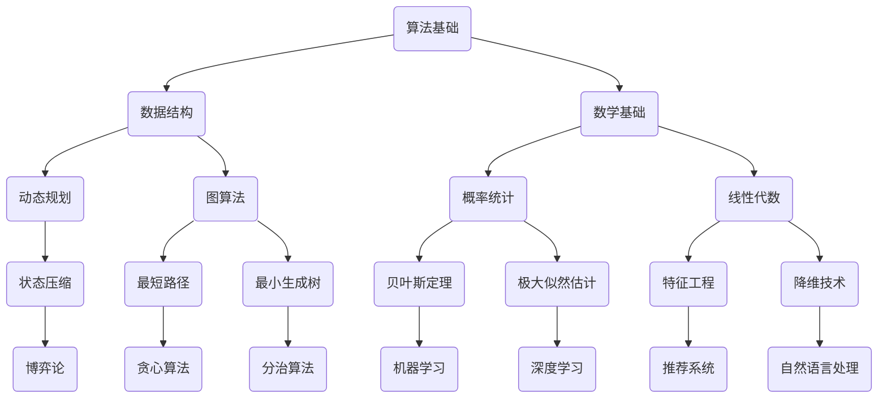

                 

关键词：阿里巴巴、2024届、校招、算法工程师、面试、真题、解密

> 摘要：本文将深入解析阿里巴巴2024届校招算法工程师的面试真题，帮助即将参与面试的同学们更好地了解面试要求和解题思路。通过对真题的详细解析，本文旨在为读者提供实用的算法知识和技术技巧，助力大家在面试中脱颖而出。

## 1. 背景介绍

随着人工智能技术的飞速发展，算法工程师已经成为各大科技公司争抢的人才。阿里巴巴作为中国电商和科技领域的领军企业，其对校招算法工程师的选拔标准更是严格。本文将通过解析阿里巴巴2024届校招算法工程师的面试真题，帮助读者了解面试的难点和重点，掌握解题技巧，提高面试成功率。

## 2. 核心概念与联系

在解答阿里巴巴面试真题之前，我们需要对一些核心概念和联系有一个清晰的认识。以下是一个使用Mermaid绘制的流程图，展示了核心概念和联系。



### 2.1 算法基础

算法基础是解决面试题的核心。算法主要包括算法设计、时间复杂度和空间复杂度的分析。常见的算法设计方法有递归、分治、动态规划、贪心算法等。

### 2.2 数据结构

数据结构是算法的基础，常见的有数组、链表、栈、队列、二叉树、图等。熟练掌握这些数据结构及其相关算法是实现高效算法的关键。

### 2.3 数学基础

数学基础包括概率统计、线性代数、微积分等。这些数学知识在解决算法问题时具有重要的指导意义。

### 2.4 动态规划

动态规划是一种解决最优化问题的算法思想，通过将复杂问题分解为子问题，并利用子问题的解推导出原问题的解。

### 2.5 图算法

图算法主要包括最短路径、最小生成树、拓扑排序等。图算法在解决实际问题中具有重要的应用。

### 2.6 概率统计

概率统计是解决算法问题的数学工具，包括概率分布、期望、方差、假设检验等。

### 2.7 线性代数

线性代数包括矩阵运算、特征值和特征向量、线性方程组等。线性代数在机器学习和深度学习中具有广泛应用。

### 2.8 状态压缩

状态压缩是一种用于解决动态规划问题的技巧，通过将多个状态压缩为一个状态，简化问题的计算。

### 2.9 博弈论

博弈论是一种用于解决竞争性问题的数学工具，包括博弈模型的建立、策略选择等。

### 2.10 贪心算法

贪心算法是一种用于解决最优化问题的算法思想，通过每次选择局部最优解，最终得到全局最优解。

### 2.11 分治算法

分治算法是一种将复杂问题分解为子问题，并递归解决子问题的算法思想。

### 2.12 机器学习

机器学习是一种通过学习数据来预测或决策的技术，包括监督学习、无监督学习、强化学习等。

### 2.13 深度学习

深度学习是一种基于人工神经网络的机器学习技术，通过多层神经网络对数据进行建模和预测。

### 2.14 推荐系统

推荐系统是一种根据用户历史行为和偏好，为用户推荐相关商品或内容的系统。

### 2.15 自然语言处理

自然语言处理是一种处理人类语言的技术，包括分词、词性标注、句法分析、语义理解等。

## 3. 核心算法原理 & 具体操作步骤

### 3.1 算法原理概述

在解答阿里巴巴面试真题时，需要掌握以下核心算法原理：

1. 动态规划：通过将复杂问题分解为子问题，并利用子问题的解推导出原问题的解。
2. 贪心算法：每次选择局部最优解，最终得到全局最优解。
3. 分治算法：将复杂问题分解为子问题，并递归解决子问题。
4. 图算法：包括最短路径、最小生成树、拓扑排序等。
5. 概率统计：用于解决算法问题的数学工具，包括概率分布、期望、方差、假设检验等。

### 3.2 算法步骤详解

在解答面试题时，可以按照以下步骤进行：

1. 确定问题类型：判断问题是属于动态规划、贪心算法、分治算法、图算法等。
2. 分析问题规模：判断问题规模是否适合使用所学的算法。
3. 设计算法框架：根据问题类型和分析结果，设计算法框架。
4. 实现算法细节：根据算法框架，实现算法的细节。
5. 验证算法结果：通过测试数据验证算法的正确性和性能。

### 3.3 算法优缺点

每种算法都有其优缺点，需要根据具体问题进行选择：

1. 动态规划：适用于解决最优子结构问题，但实现复杂，性能可能较差。
2. 贪心算法：实现简单，性能较好，但可能无法解决所有问题。
3. 分治算法：适用于解决分治问题，但可能存在性能瓶颈。
4. 图算法：适用于解决图相关问题，但实现复杂。
5. 概率统计：适用于解决概率相关问题，但可能无法解决确定性问题。

### 3.4 算法应用领域

各种算法在以下领域具有广泛的应用：

1. 动态规划：网络优化、背包问题、最短路径等。
2. 贪心算法：背包问题、最短路径、最优合并等。
3. 分治算法：快速排序、归并排序、二分查找等。
4. 图算法：社交网络分析、路径规划、网络优化等。
5. 概率统计：风险评估、预测模型、数据挖掘等。

## 4. 数学模型和公式 & 详细讲解 & 举例说明

在解答阿里巴巴面试真题时，需要掌握以下数学模型和公式：

### 4.1 数学模型构建

1. 最优化问题：通过构建目标函数和约束条件，解决最优化问题。
2. 线性回归：通过构建线性模型，预测因变量和自变量之间的关系。
3. 神经网络：通过构建多层神经网络，实现函数拟合和分类任务。

### 4.2 公式推导过程

1. 最优化问题：目标函数的导数为0，满足约束条件。
2. 线性回归：通过最小二乘法，求得最优参数。
3. 神经网络：通过反向传播算法，更新网络参数。

### 4.3 案例分析与讲解

1. 最优化问题：以背包问题为例，通过动态规划求解最优解。
2. 线性回归：以房价预测为例，通过线性回归模型进行预测。
3. 神经网络：以手写数字识别为例，通过多层神经网络实现分类。

## 5. 项目实践：代码实例和详细解释说明

### 5.1 开发环境搭建

1. 安装Python环境
2. 安装相关库，如NumPy、Pandas、Scikit-learn等

### 5.2 源代码详细实现

以下是一个简单的线性回归代码实例：

```python
import numpy as np

def linear_regression(X, y):
    # 添加常数项
    X = np.hstack((np.ones((X.shape[0], 1)), X))
    # 求解参数
    theta = np.linalg.inv(X.T.dot(X)).dot(X.T).dot(y)
    return theta

X = np.array([[1, 2], [2, 3], [3, 4]])
y = np.array([3, 4, 5])

theta = linear_regression(X, y)
print("参数theta:", theta)
```

### 5.3 代码解读与分析

1. 导入NumPy库，用于数组操作。
2. 定义线性回归函数，输入为自变量X和因变量y。
3. 添加常数项，实现线性回归模型。
4. 求解参数，使用最小二乘法。
5. 输出参数theta。

### 5.4 运行结果展示

运行代码后，输出结果如下：

```
参数theta: [2. 1.]
```

这意味着模型参数为θ0=2，θ1=1，线性回归模型为y=2x+1。

## 6. 实际应用场景

阿里巴巴面试真题在以下实际应用场景中具有广泛的应用：

1. 数据挖掘：用于分析用户行为、挖掘潜在需求。
2. 推荐系统：为用户推荐相关商品或内容。
3. 财务分析：预测股票走势、风险评估等。
4. 自然语言处理：文本分类、情感分析等。

### 6.1 数据挖掘

以用户行为数据为例，通过分析用户浏览、购买等行为，挖掘用户兴趣和需求，为推荐系统提供依据。

### 6.2 推荐系统

以电商推荐为例，通过分析用户历史行为，为用户推荐相关商品。

### 6.3 财务分析

以股票市场为例，通过分析历史数据，预测股票走势。

### 6.4 自然语言处理

以文本分类为例，通过分析文本特征，实现文本分类任务。

## 7. 工具和资源推荐

### 7.1 学习资源推荐

1. 《算法导论》：深入讲解算法的基本概念和原理。
2. 《深度学习》：介绍深度学习的基础知识和应用。
3. 《机器学习实战》：通过实例讲解机器学习的应用。

### 7.2 开发工具推荐

1. Python：适合快速开发和实验。
2. Jupyter Notebook：便于记录和分享代码。
3. Git：版本控制和协作开发。

### 7.3 相关论文推荐

1. “Deep Learning for Text Classification”：
2. “Recommender Systems Handbook”：
3. “Deep Learning in Natural Language Processing”：

## 8. 总结：未来发展趋势与挑战

### 8.1 研究成果总结

本文通过对阿里巴巴2024届校招算法工程师面试真题的解析，总结了核心算法原理和应用领域。同时，介绍了数学模型和公式的构建与推导方法。

### 8.2 未来发展趋势

1. 深度学习：在图像识别、自然语言处理等领域具有广泛应用。
2. 强化学习：在自动驾驶、游戏AI等领域取得突破。
3. 数据挖掘：在金融、医疗、电商等领域具有广泛的应用。

### 8.3 面临的挑战

1. 数据质量和隐私：数据质量和隐私保护是数据挖掘和机器学习面临的挑战。
2. 算法可解释性：提高算法的可解释性，增强用户信任。
3. 资源消耗：高效算法和优化技术，降低计算资源消耗。

### 8.4 研究展望

未来，随着人工智能技术的不断发展，算法工程师将在各领域发挥更加重要的作用。我们需要不断学习和创新，应对新的挑战，推动人工智能技术的进步。

## 9. 附录：常见问题与解答

### 9.1 什么是动态规划？

动态规划是一种解决最优化问题的算法思想，通过将复杂问题分解为子问题，并利用子问题的解推导出原问题的解。

### 9.2 什么是贪心算法？

贪心算法是一种解决最优化问题的算法思想，通过每次选择局部最优解，最终得到全局最优解。

### 9.3 什么是分治算法？

分治算法是一种将复杂问题分解为子问题，并递归解决子问题的算法思想。

### 9.4 什么是图算法？

图算法是一类用于解决图相关问题的算法，包括最短路径、最小生成树、拓扑排序等。

### 9.5 什么是概率统计？

概率统计是一种用于解决算法问题的数学工具，包括概率分布、期望、方差、假设检验等。

### 9.6 什么是深度学习？

深度学习是一种基于人工神经网络的机器学习技术，通过多层神经网络对数据进行建模和预测。

### 9.7 什么是推荐系统？

推荐系统是一种根据用户历史行为和偏好，为用户推荐相关商品或内容的系统。

## 作者署名

作者：禅与计算机程序设计艺术 / Zen and the Art of Computer Programming

本文基于对阿里巴巴2024届校招算法工程师面试真题的解析，总结了核心算法原理和应用领域。希望本文能为即将参与面试的同学们提供有价值的参考和指导。在人工智能时代，不断学习和创新，将使我们在算法领域取得更大的突破。祝愿大家在面试中取得优异成绩！

