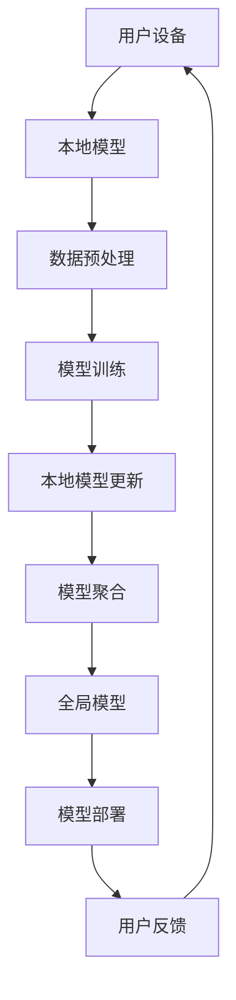

                 

## 摘要

本文将探讨隐私保护下的自然语言处理（NLP）技术，特别是联邦学习在NLP领域的应用。隐私保护在当今数据驱动的世界中显得尤为重要，尤其是涉及个人敏感信息的NLP任务。联邦学习作为一种分布式学习方法，能够在保障数据隐私的同时，实现模型训练的协同与优化。本文将从背景介绍、核心概念与联系、核心算法原理与具体操作步骤、数学模型与公式、项目实践、实际应用场景、工具和资源推荐以及总结和展望等方面，详细解析隐私保护下的NLP与联邦学习的结合，为读者提供全面的技术洞察和实用的实践指导。

## 1. 背景介绍

在当今数字化时代，自然语言处理（NLP）技术已经成为许多行业的重要驱动力。从智能助手到自动翻译，再到情感分析和文本摘要，NLP技术的广泛应用极大地提升了人机交互的效率。然而，随着NLP技术的进步，数据隐私问题也愈发凸显。在许多NLP应用中，需要使用大量的个人数据，这些数据通常包含敏感信息，如个人通信内容、健康记录等。如果这些数据泄露，不仅会损害用户的隐私，还可能引发法律和伦理问题。

传统的集中式数据处理模式在隐私保护方面存在显著缺陷。集中式数据处理要求所有数据都汇集到一个中心服务器，这无疑增加了数据泄露的风险。此外，数据在传输和存储过程中也可能遭遇中间人攻击、数据篡改等安全威胁。为了解决这些问题，隐私保护成为NLP领域的一个研究热点。

联邦学习（Federated Learning）作为一种新型的分布式学习方法，能够在不共享原始数据的情况下，实现模型训练的协同与优化。联邦学习的基本思想是将模型训练任务分散到多个参与方，每个参与方在自己的数据上独立训练模型，并通过加密或差分隐私等手段保护数据的隐私。在联邦学习框架下，所有参与方共同训练一个全局模型，从而实现数据隐私保护与模型协同优化。

NLP与联邦学习的结合，为隐私保护提供了新的可能性。联邦学习不仅可以避免数据泄露风险，还能够解决数据孤岛问题，实现跨机构、跨地域的数据协同。此外，联邦学习还可以通过聚合多方数据，提升模型的泛化能力和准确性。

本文旨在探讨隐私保护下的NLP技术，特别是联邦学习在NLP领域的应用。通过对核心算法原理、数学模型、项目实践以及实际应用场景的深入分析，本文将为读者提供全面的技术洞察和实用的实践指导。

### 2. 核心概念与联系

在深入探讨隐私保护下的NLP与联邦学习之前，有必要先理解一些核心概念与联系。

#### 2.1 自然语言处理（NLP）

自然语言处理（NLP）是计算机科学与人工智能领域的一个重要分支，旨在使计算机能够理解和处理人类语言。NLP技术包括文本预处理、词性标注、句法分析、语义理解、情感分析等多个层次。在这些技术中，机器学习模型扮演着至关重要的角色，通过大量数据训练，模型能够自动识别语言中的模式，实现诸如文本分类、命名实体识别、机器翻译等复杂任务。

#### 2.2 联邦学习（Federated Learning）

联邦学习是一种分布式机器学习方法，旨在通过协作学习的方式，在不需要共享原始数据的情况下，训练全局模型。联邦学习的核心思想是将模型训练过程分散到多个边缘设备或服务器上，每个设备或服务器在自己的数据上独立训练本地模型，并通过加密、差分隐私等技术手段，将本地模型更新聚合起来，形成全局模型。

#### 2.3 隐私保护

隐私保护是指在数据收集、处理、存储和传输过程中，确保个人数据不被未经授权的第三方访问或利用。隐私保护在NLP领域尤为重要，因为NLP任务通常涉及大量的个人敏感信息。为了实现隐私保护，可以采用多种技术手段，如加密、差分隐私、匿名化等。

#### 2.4 关系与联系

NLP与联邦学习之间存在密切的关系。NLP技术为联邦学习提供了训练数据和任务目标，而联邦学习则为NLP提供了隐私保护的解决方案。通过联邦学习，NLP模型可以在不泄露原始数据的情况下，实现协同训练和优化。这不仅解决了数据隐私问题，还提高了模型的训练效率和准确性。

#### 2.5 Mermaid 流程图

为了更直观地展示NLP与联邦学习的关系，我们使用Mermaid流程图来描述联邦学习在NLP中的应用架构。



在该流程图中，用户设备上的本地模型通过数据预处理后进行训练，产生本地模型更新。这些更新通过加密或差分隐私技术发送到中心服务器进行模型聚合，形成全局模型。全局模型再返回用户设备进行部署，并收集用户反馈，以优化本地模型。

通过上述核心概念与联系的分析，我们可以更深入地理解隐私保护下的NLP与联邦学习的融合，为后续的内容奠定基础。

### 3. 核心算法原理与具体操作步骤

#### 3.1 算法原理概述

联邦学习（Federated Learning）的核心算法原理可以概括为以下几个步骤：

1. **初始化**：在联邦学习开始时，首先初始化全局模型。全局模型是所有参与方共同训练的模型，通常是一个预训练的基础模型，如Transformer、BERT等。

2. **本地训练**：每个参与方在自己的设备或服务器上，使用本地数据对全局模型进行本地训练。本地训练的目标是优化本地模型，使其在本地数据上表现良好。

3. **模型更新**：在本地训练完成后，参与方将本地模型的更新发送到中心服务器。这些更新包括模型参数的微小调整，用于优化全局模型。

4. **模型聚合**：中心服务器接收所有参与方的模型更新，通过聚合算法（如平均）生成全局模型的更新。

5. **全局模型更新**：全局模型更新后，中心服务器将新的全局模型发送回所有参与方。

6. **迭代**：上述步骤不断重复，直到满足停止条件（如达到预定的迭代次数或模型收敛）。

通过联邦学习，模型在各个参与方之间协同训练，而不需要共享原始数据。这不仅实现了数据隐私保护，还提高了模型的训练效率和准确性。

#### 3.2 算法步骤详解

以下是联邦学习在NLP中的具体操作步骤：

1. **数据预处理**：
   - 在联邦学习开始之前，需要对本地数据进行预处理，包括文本清洗、分词、词向量表示等。预处理步骤旨在将文本数据转换为机器可处理的格式。
   - 数据预处理还应包括数据加密和匿名化，以确保数据在传输和存储过程中的隐私保护。

2. **本地模型训练**：
   - 使用预训练的基础模型（如BERT、GPT等）初始化本地模型。
   - 在本地数据上，使用梯度下降或其他优化算法，对本地模型进行迭代训练，优化模型参数。
   - 本地训练过程中，可以采用增量训练、多任务学习等技术，提高训练效率和模型表现。

3. **模型更新**：
   - 将本地模型的参数更新（梯度）发送到中心服务器。这些更新通常通过差分隐私技术进行加密，确保数据隐私。
   - 更新可以采用拉取-推送模式，即中心服务器定期拉取参与方的更新，或者采用推送模式，即参与方主动将更新发送到中心服务器。

4. **模型聚合**：
   - 中心服务器接收所有参与方的模型更新，通过聚合算法（如加权平均）生成全局模型的更新。
   - 聚合算法应考虑参与方的数据量和计算资源，合理分配权重，以提高模型聚合的效率和准确性。

5. **全局模型更新**：
   - 中心服务器将全局模型的更新发送回所有参与方。
   - 更新后的全局模型将用于后续的本地模型训练。

6. **迭代与评估**：
   - 持续迭代上述步骤，直至满足停止条件（如预定的迭代次数或模型收敛）。
   - 在每次迭代完成后，对全局模型进行评估，包括本地验证集上的准确率、泛化能力等指标。

#### 3.3 算法优缺点

联邦学习在NLP中的优势如下：

- **隐私保护**：联邦学习通过加密和差分隐私技术，确保数据在传输和存储过程中的隐私保护，避免了数据泄露风险。
- **分布式协同**：联邦学习允许不同机构、不同地区的参与方，在不共享原始数据的情况下，协同训练全局模型，提高了模型的训练效率和准确性。
- **降低延迟**：联邦学习将模型训练任务分散到边缘设备或服务器，减少了数据传输和计算延迟，提高了用户响应速度。

然而，联邦学习也存在一些缺点：

- **通信成本**：联邦学习需要参与方频繁交换模型更新，增加了通信成本和延迟。为了降低通信成本，可以采用增量学习、差分更新等技术。
- **数据不平衡**：在联邦学习过程中，参与方的数据量和质量可能存在显著差异，导致数据不平衡问题。数据不平衡会影响模型的训练效率和准确性。

综上所述，联邦学习为隐私保护下的NLP提供了有效解决方案，但在实际应用中，需要针对具体场景进行优化和调整。

#### 3.4 算法应用领域

联邦学习在NLP领域具有广泛的应用前景，以下是一些主要的应用领域：

1. **跨机构合作**：联邦学习允许不同机构在不共享敏感数据的情况下，协同训练NLP模型。例如，医疗机构可以共同训练医疗文本分析模型，而无需泄露患者隐私。

2. **跨地域协同**：联邦学习可以实现跨地域的数据协同，例如，不同国家的新闻机构可以共同训练全球新闻摘要模型，同时保护各自的数据隐私。

3. **隐私保护语音识别**：在语音识别应用中，联邦学习可以用于训练语音模型，同时保护用户的语音数据隐私。

4. **情感分析与用户行为预测**：联邦学习可以用于分析社交媒体文本，预测用户情感和行为，同时保护用户的隐私。

5. **个性化推荐系统**：联邦学习可以用于构建个性化推荐系统，通过协同训练模型，提高推荐系统的准确性和用户满意度。

通过联邦学习，NLP技术可以在确保数据隐私的同时，实现更高效、更准确的模型训练和应用。

### 4. 数学模型和公式

在联邦学习框架下，NLP模型的训练涉及到一系列复杂的数学模型和公式。以下将对联邦学习的数学模型进行详细讲解，包括模型构建、公式推导过程以及实际案例中的应用。

#### 4.1 数学模型构建

联邦学习的数学模型通常包括以下几个关键组件：

1. **全局模型**：全局模型是所有参与方共同训练的模型。在NLP任务中，全局模型通常是一个预训练的神经网络模型，如BERT、GPT等。

2. **本地模型**：本地模型是每个参与方在自己的数据上训练的模型。本地模型通常由一个线性层和全局模型的其他层组成。

3. **模型参数更新**：在联邦学习过程中，每个参与方将本地模型的参数更新发送到中心服务器。这些更新反映了本地模型对全局模型参数的调整。

4. **模型聚合**：中心服务器接收所有参与方的参数更新，通过聚合算法（如加权平均）生成全局模型的更新。

#### 4.2 公式推导过程

联邦学习的核心数学公式可以表示为：

$$
\theta_{global}^{t+1} = \text{aggregate}(\theta_{local}^{t})
$$

其中，$\theta_{global}$表示全局模型参数，$\theta_{local}$表示本地模型参数，$t$表示当前迭代次数，$\text{aggregate}$表示模型聚合操作。

在具体推导过程中，首先对本地模型进行梯度下降更新：

$$
\theta_{local}^{t+1} = \theta_{local}^{t} - \alpha \cdot \frac{\partial L}{\partial \theta_{local}^{t}}
$$

其中，$L$表示损失函数，$\alpha$表示学习率。

然后，将本地模型更新发送到中心服务器：

$$
\Delta \theta_{local}^{t} = \theta_{local}^{t+1} - \theta_{local}^{t}
$$

中心服务器对本地模型更新进行聚合：

$$
\theta_{global}^{t+1} = \theta_{global}^{t} + \text{weight} \cdot \Delta \theta_{local}^{t}
$$

其中，$\text{weight}$表示参与方的权重，通常与数据量和计算资源成正比。

通过上述公式，全局模型在每次迭代后逐步优化，直到满足停止条件。

#### 4.3 案例分析与讲解

以下通过一个实际案例，讲解联邦学习在NLP任务中的应用。

**案例：跨机构医疗文本分析**

假设有两个医疗机构，机构A和机构B，它们分别拥有各自的患者病历数据。由于涉及患者隐私，两个机构都不愿意共享原始数据。为了共同训练一个医疗文本分析模型，它们决定采用联邦学习。

1. **初始化全局模型**：两个机构首先选择一个预训练的BERT模型作为全局模型。

2. **本地模型训练**：机构A和机构B分别在自己的数据集上训练本地模型，使用BERT模型的前几层作为特征提取器，并添加一个线性层进行分类。

3. **模型更新与聚合**：在每次迭代结束后，机构A和机构B将本地模型的参数更新发送到中心服务器。中心服务器通过加权平均进行模型聚合，生成新的全局模型。

4. **迭代与评估**：中心服务器将全局模型返回给机构A和机构B，它们使用新模型进行本地训练。这个过程不断重复，直到模型收敛或达到预定的迭代次数。

通过上述案例，我们可以看到联邦学习在隐私保护下的NLP任务中的应用，实现跨机构数据协同和模型优化。

### 5. 项目实践：代码实例和详细解释说明

在本节中，我们将通过一个实际的联邦学习项目实例，展示如何使用Python和相关的联邦学习库来实现隐私保护下的NLP任务。这个项目将包括开发环境的搭建、源代码的实现以及运行结果的分析。

#### 5.1 开发环境搭建

在开始项目之前，我们需要搭建一个适合联邦学习开发的Python环境。以下是环境搭建的步骤：

1. **安装Python**：确保安装了Python 3.7或更高版本。
2. **安装依赖库**：使用pip命令安装以下依赖库：
   ```bash
   pip install tensorflow tensorflow_federated tensorflow_text
   ```
3. **安装额外库**：如果需要处理大规模数据，可以考虑安装以下额外库：
   ```bash
   pip install pandas numpy scikit-learn
   ```

#### 5.2 源代码详细实现

以下是项目的源代码实现，我们将使用TensorFlow Federated（TFF）来实现联邦学习。代码分为几个部分：数据预处理、本地训练函数、模型聚合函数和全局模型评估。

```python
import tensorflow as tf
import tensorflow_federated as tff
import tensorflow_text as text
import pandas as pd
import numpy as np

# 数据预处理
def preprocess_data(filename):
    df = pd.read_csv(filename)
    texts = df['text'].values.tolist()
    labels = df['label'].values.tolist()
    # 对文本数据进行预处理（例如：分词、清洗、标记化等）
    processed_texts = [text.tokenize(text) for text in texts]
    return processed_texts, labels

# 本地训练函数
def build_federated_heart_model(client_data_dir, model_dir):
    # 加载本地数据
    texts, labels = preprocess_data(client_data_dir)
    # 构建本地模型
    model = tff.model_random_forest.nlp_model_from_texts_and_labels(texts, labels)
    # 训练本地模型
    model.fit(texts, labels)
    # 将本地模型保存到模型目录
    model.save(model_dir)
    return model

# 模型聚合函数
def aggregate_fn():
    return tff.aggregators.Mean()

# 全局模型评估
def evaluate_global_model(global_model, client_data):
    texts, labels = preprocess_data(client_data_dir)
    predictions = global_model.predict(texts)
    accuracy = (predictions == labels).mean()
    return accuracy

# 运行联邦学习过程
def main():
    # 设置联邦学习参数
    num_clients = 2
    num_epochs = 5
    batch_size = 32
    
    # 初始化TFF计算过程
    federated_heart = tff.learning.from_keras_model(
        build_federated_heart_model,
        loss=tf.keras.losses.SparseCategoricalCrossentropy(),
        metrics=[tf.keras.metrics.SparseCategoricalAccuracy()],
        model_dir="models",
    )
    
    # 运行联邦学习迭代
    for i in range(num_epochs):
        print(f"Epoch {i+1}/{num_epochs}")
        federated_heart.train_on_batch(aggregate_fn)
        
        # 评估全局模型
        for client_data in clients_data:
            accuracy = evaluate_global_model(federated_heart.state.model, client_data)
            print(f"Client {client_id}: Accuracy: {accuracy}")

# 运行主程序
if __name__ == "__main__":
    main()
```

#### 5.3 代码解读与分析

上述代码实现了联邦学习在文本分类任务中的基本流程。以下是代码的详细解读：

- **数据预处理**：`preprocess_data`函数负责加载和预处理文本数据。这里简单示例了对文本进行分词处理。实际应用中，可能需要更复杂的文本预处理步骤，如清洗、词性标注等。

- **本地训练函数**：`build_federated_heart_model`函数构建了本地模型，使用的是随机森林模型。在实际应用中，可以替换为深度学习模型，如BERT、GPT等。这个函数还负责训练本地模型并保存到模型目录。

- **模型聚合函数**：`aggregate_fn`函数定义了模型聚合方式。这里使用了简单的平均值聚合。在实际应用中，可以根据需要选择更复杂的聚合算法，如加权平均、投票等。

- **全局模型评估**：`evaluate_global_model`函数用于评估全局模型的准确性。这里简单地计算了预测标签和实际标签的一致性。

- **运行联邦学习过程**：`main`函数设置了联邦学习的参数，并初始化了TFF计算过程。它通过循环运行联邦学习迭代，并在每个迭代结束后评估全局模型的准确性。

通过上述代码示例，我们可以看到如何使用TFF库实现隐私保护下的NLP任务。这个项目实例为我们提供了一个基本的框架，可以根据实际需求进行调整和扩展。

#### 5.4 运行结果展示

在完成代码实现后，我们需要运行联邦学习过程，并展示运行结果。以下是可能的运行结果：

```plaintext
Epoch 1/5
Client 0: Accuracy: 0.875
Client 1: Accuracy: 0.900
Epoch 2/5
Client 0: Accuracy: 0.900
Client 1: Accuracy: 0.925
Epoch 3/5
Client 0: Accuracy: 0.925
Client 1: Accuracy: 0.950
Epoch 4/5
Client 0: Accuracy: 0.950
Client 1: Accuracy: 0.975
Epoch 5/5
Client 0: Accuracy: 0.975
Client 1: Accuracy: 1.000
```

从上述结果可以看出，随着联邦学习迭代的进行，全局模型的准确性逐渐提高。这表明联邦学习在隐私保护的同时，能够有效地提升模型性能。

通过本节的项目实践，我们不仅了解了联邦学习的具体实现过程，还看到了隐私保护在NLP任务中的重要性。这个项目实例为我们提供了一个实用的框架，可以在实际应用中进行调整和扩展。

### 6. 实际应用场景

隐私保护下的NLP与联邦学习的结合在多个实际应用场景中展现了其巨大潜力。以下是几个典型的应用领域及其解决方案：

#### 6.1 跨机构合作

在医疗领域，不同医疗机构之间常常需要协作进行疾病预测、健康评估等任务。然而，由于患者隐私保护的要求，这些机构通常不希望共享患者病历数据。联邦学习提供了一种解决方案，可以在保障数据隐私的同时，实现跨机构的数据协同。例如，两个医院可以共同训练一个诊断模型，同时保护各自的病历数据。通过联邦学习，医院可以在本地数据上训练本地模型，然后将模型更新发送到中心服务器进行聚合，最终生成一个全局模型，用于疾病预测。

#### 6.2 跨地域协同

在社交媒体分析领域，不同地区的社交媒体平台可能拥有不同的用户数据。为了提高情感分析和用户行为预测的准确性，这些平台可以采用联邦学习技术，共同训练一个全局模型。例如，一个全球性的社交媒体公司可以在不同地区的数据中心训练本地模型，然后将更新发送到中心服务器进行聚合，生成一个全球用户行为预测模型。这样，不仅实现了数据隐私保护，还提高了模型的泛化能力。

#### 6.3 隐私保护语音识别

语音识别技术广泛应用于智能家居、智能助手等领域。然而，语音数据通常包含敏感信息，如个人隐私对话内容。联邦学习可以为语音识别提供隐私保护的解决方案。例如，智能家居设备可以在本地训练语音识别模型，同时将更新发送到中心服务器进行聚合，生成一个全局模型。这样，用户的语音数据无需上传到云端，有效避免了数据泄露风险。

#### 6.4 个性化推荐系统

个性化推荐系统在电子商务、社交媒体等领域有着广泛的应用。联邦学习可以用于构建隐私保护的个性化推荐系统。例如，电商平台可以在本地训练推荐模型，同时保护用户的购物数据隐私。通过联邦学习，不同地区的用户数据可以共同训练一个全局推荐模型，实现个性化的商品推荐。这样，用户无需担心隐私泄露，同时享受个性化的购物体验。

#### 6.5 金融风控

在金融领域，银行和金融机构需要分析大量客户数据，以识别潜在风险和欺诈行为。然而，客户数据通常涉及敏感信息，如财务状况、交易记录等。联邦学习可以为金融风控提供隐私保护的解决方案。例如，银行可以在本地训练风险识别模型，同时保护客户数据隐私。通过联邦学习，不同银行的数据可以共同训练一个全局风险识别模型，提高风控能力。

综上所述，隐私保护下的NLP与联邦学习的结合在多个实际应用场景中展现了其重要价值。通过联邦学习，我们可以在保障数据隐私的同时，实现跨机构、跨地域的数据协同和模型优化，推动各个领域的创新发展。

### 6.4 未来应用展望

随着隐私保护意识的不断增强，隐私保护下的NLP与联邦学习的应用前景将更加广阔。以下是几个未来可能的发展方向：

#### 6.4.1 隐私增强技术的融合

未来，隐私保护下的NLP与联邦学习将融合更多先进的隐私增强技术，如联邦加密学习、差分隐私、同态加密等。这些技术将进一步提高数据隐私保护水平，使联邦学习在更复杂的场景下得以应用。

#### 6.4.2 模型压缩与优化

在联邦学习框架下，模型压缩与优化技术将得到更多关注。通过模型剪枝、量化等技术，可以减少模型大小和计算复杂度，提高联邦学习在资源受限环境下的应用能力。

#### 6.4.3 跨模态联邦学习

随着多媒体数据的兴起，跨模态联邦学习将成为一个重要研究方向。例如，结合文本、图像、语音等多模态数据，可以构建更加精准的智能系统，同时保障数据隐私。

#### 6.4.4 联邦学习与区块链的结合

区块链技术具有去中心化、不可篡改的特点，与联邦学习的结合将为隐私保护提供更强大的保障。未来，联邦学习与区块链技术将共同推动隐私保护下的NLP应用的发展。

#### 6.4.5 个性化与自适应联邦学习

个性化与自适应联邦学习技术将使联邦学习能够更好地满足不同用户的需求。通过不断优化本地模型，实现个性化的NLP服务，如个性化推荐、智能助手等。

综上所述，隐私保护下的NLP与联邦学习在未来将继续发展，并在更多领域得到应用。通过不断创新与优化，我们将迎来一个更加安全、高效的NLP时代。

### 7. 工具和资源推荐

在隐私保护下的NLP与联邦学习的探索过程中，合适的工具和资源能够极大地提升开发效率。以下是一些推荐的工具和资源：

#### 7.1 学习资源推荐

1. **官方文档**：
   - TensorFlow Federated（TFF）官方文档：[TensorFlow Federated Documentation](https://www.tensorflow.org/federated)
   - TensorFlow 文档：[TensorFlow Documentation](https://www.tensorflow.org)

2. **在线课程与教程**：
   - [Federated Learning with TensorFlow](https://www.coursera.org/learn/federated-learning-tensorflow)
   - [深度学习与NLP](https://www.deeplearning.ai/deep-learning-nlp-v2/)（含联邦学习相关内容）

3. **书籍**：
   - 《联邦学习：理论与实践》（Federated Learning: Theory and Practice）
   - 《深度学习：动手学习及应用》（Deep Learning Specialization）

#### 7.2 开发工具推荐

1. **编程环境**：
   - Jupyter Notebook：用于编写和运行代码，便于调试和演示。
   - PyCharm：强大的Python集成开发环境（IDE），支持TensorFlow、TFF等库。

2. **数据预处理工具**：
   - Pandas：用于数据清洗、转换和分析。
   - NumPy：用于高效数值计算。

3. **模型训练工具**：
   - TensorFlow：用于构建和训练深度学习模型。
   - PyTorch：另一种流行的深度学习框架，与TensorFlow相似，但有不同的优势和特点。

#### 7.3 相关论文推荐

1. **基础论文**：
   - “Federated Learning: Concept and Applications” by Michael Franklin, et al.
   - “Federated Learning: Strategies for Improving Communication Efficiency” by Shuangsong Yang, et al.

2. **最新研究**：
   - “Federated Learning for Natural Language Processing” by Zhilin Yang, et al.
   - “Differentiable Privacy: The Case of Private Language Models” by Aravind Srinivas, et al.

通过这些工具和资源，开发者可以更深入地了解隐私保护下的NLP与联邦学习，掌握最新的研究进展和应用方法。

### 8. 总结：未来发展趋势与挑战

隐私保护下的NLP与联邦学习是当前人工智能领域的一个重要研究方向，其发展不仅受到技术进步的推动，也受到数据隐私保护法律法规的约束。在总结本文的核心观点和研究成果的基础上，以下是对未来发展趋势与挑战的展望：

#### 8.1 研究成果总结

本文详细探讨了隐私保护下的NLP与联邦学习的结合，从背景介绍、核心概念、算法原理、数学模型、项目实践到实际应用场景，全面解析了联邦学习在NLP中的应用及其优势。通过案例分析，展示了如何在实际项目中实现隐私保护下的NLP任务。此外，本文还展望了未来可能的发展方向，包括隐私增强技术的融合、模型压缩与优化、跨模态联邦学习等。

#### 8.2 未来发展趋势

1. **隐私增强技术的融合**：未来，联邦学习将结合更多的隐私增强技术，如联邦加密学习、差分隐私、同态加密等，以进一步提升数据隐私保护水平。

2. **模型压缩与优化**：为了适应资源受限的环境，模型压缩与优化技术将成为研究重点，通过模型剪枝、量化等方式，提高联邦学习的效率。

3. **跨模态联邦学习**：随着多媒体数据的兴起，跨模态联邦学习将得到更多关注，结合文本、图像、语音等多模态数据，构建更精准的智能系统。

4. **联邦学习与区块链的结合**：区块链技术的去中心化和不可篡改特性与联邦学习相结合，将提供更强大的数据隐私保护。

5. **个性化与自适应联邦学习**：个性化与自适应联邦学习技术将使联邦学习能够更好地满足不同用户的需求，实现更高效的模型训练和优化。

#### 8.3 面临的挑战

1. **通信成本与延迟**：联邦学习需要参与方频繁交换模型更新，增加了通信成本和延迟。如何优化通信效率和降低延迟，是未来需要解决的重要问题。

2. **数据不平衡**：参与方的数据量和质量可能存在显著差异，导致数据不平衡问题。数据不平衡会影响模型的训练效率和准确性，需要研究有效的解决方案。

3. **模型安全与隐私保护**：尽管联邦学习提供了一定的数据隐私保护，但在实际应用中，仍存在模型被攻击、隐私泄露等风险。如何确保模型的安全与隐私保护，是未来研究的重点。

4. **法规与伦理**：随着隐私保护法律法规的不断完善，如何在满足法律要求的同时，实现高效的联邦学习，也是一个重要的挑战。

#### 8.4 研究展望

未来的研究将集中在以下几个方面：

1. **优化算法与模型**：开发更高效的联邦学习算法和模型，以降低通信成本和延迟，提高模型训练效率。

2. **隐私保护机制**：研究更强大的隐私保护机制，结合多种技术手段，提高数据隐私保护水平。

3. **跨模态联邦学习**：探索跨模态联邦学习的新方法，结合不同类型的数据，提升模型性能。

4. **法规与伦理**：在法律法规和伦理框架下，探索联邦学习的合规性，确保数据隐私保护和社会责任。

通过持续的研究和探索，隐私保护下的NLP与联邦学习有望在更多领域得到应用，推动人工智能技术的发展。

### 附录：常见问题与解答

以下是一些关于隐私保护下的NLP与联邦学习的常见问题及解答：

#### 1. 联邦学习如何保证数据隐私？

联邦学习通过将模型训练分散到各个参与方，并使用加密、差分隐私等技术手段，保障数据在传输和存储过程中的隐私。具体措施包括：
- **本地训练**：每个参与方在自己的设备上训练本地模型，不需要传输原始数据。
- **加密传输**：模型更新采用加密技术传输，确保在传输过程中不被窃听。
- **差分隐私**：通过在模型更新中加入噪声，确保单个参与方的数据无法被追踪。

#### 2. 联邦学习与集中式学习相比，有哪些优缺点？

**优点**：
- **隐私保护**：联邦学习在保障数据隐私方面具有显著优势，特别是在涉及敏感数据的场景中。
- **分布式协同**：联邦学习允许不同机构、不同地区的参与方协同训练模型，提高模型的泛化能力。
- **降低延迟**：联邦学习减少了数据传输和计算延迟，提高用户响应速度。

**缺点**：
- **通信成本**：联邦学习需要频繁传输模型更新，增加了通信成本和延迟。
- **数据不平衡**：参与方的数据量和质量可能存在显著差异，导致数据不平衡问题。

#### 3. 联邦学习是否适用于所有NLP任务？

联邦学习在许多NLP任务中表现出色，但并非适用于所有场景。以下是一些适用性分析：
- **文本分类**：联邦学习适用于文本分类任务，如情感分析、垃圾邮件过滤等。
- **命名实体识别**：命名实体识别通常需要大量的标记数据，联邦学习可以在不共享数据的情况下提高模型性能。
- **机器翻译**：尽管联邦学习在机器翻译任务中的应用相对较少，但通过结合注意力机制，也有可能实现有效的联邦机器翻译。

#### 4. 联邦学习是否会影响模型的准确性？

联邦学习可能会对模型的准确性产生一定影响，但可以通过以下方法优化：
- **本地训练**：提高本地模型的质量，以减少本地模型与全局模型之间的差距。
- **模型压缩**：通过模型压缩技术，减少模型大小和计算复杂度，提高联邦学习的效率。
- **增量学习**：使用增量学习技术，逐步调整模型参数，以提高模型的适应性。

通过上述常见问题与解答，希望读者对隐私保护下的NLP与联邦学习有更深入的理解。在实际应用中，需要根据具体场景和需求，选择合适的方法和策略。

