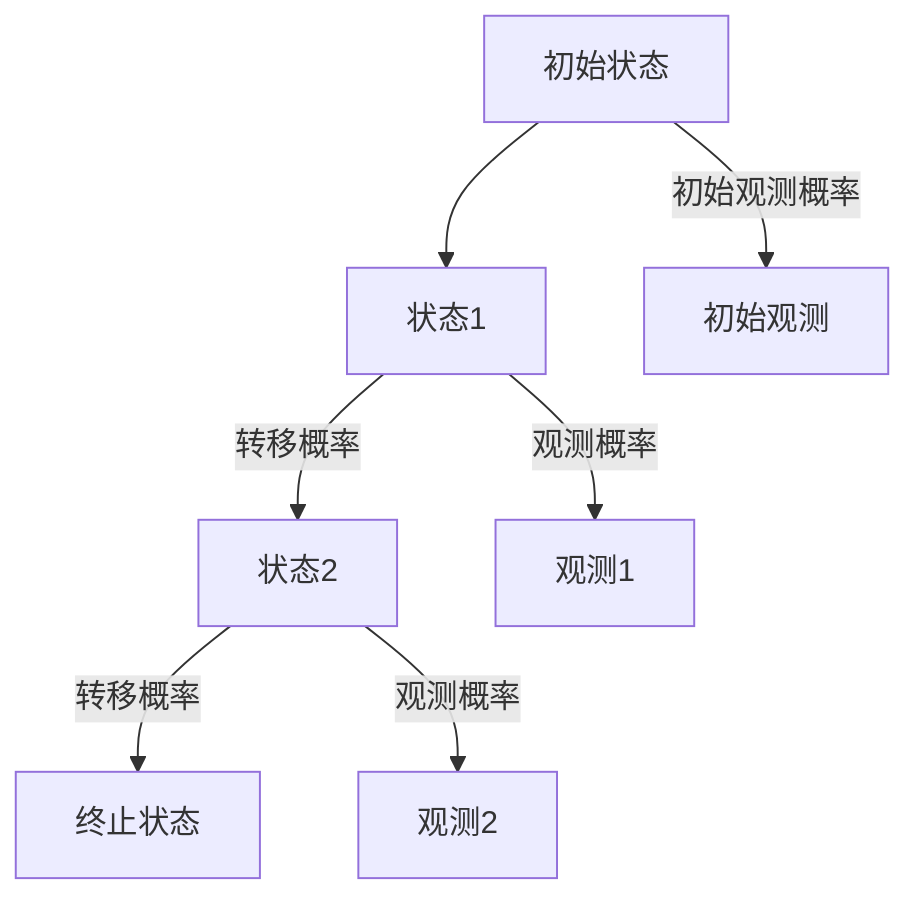

                 

关键词：隐马尔可夫模型、HMM、状态转移矩阵、观测序列、概率模型、动态规划、算法原理、代码实现、应用领域、数学模型、实时监控、语音识别、推荐系统、金融风控。

## 摘要

隐马尔可夫模型（HMM）是一种强大的概率模型，用于处理包含不可观测状态序列的数据。本文将详细介绍HMM的核心概念、数学模型、算法原理及其实际应用。通过一系列代码实例，我们将深入探讨如何使用HMM解决实际问题，并提供丰富的学习资源和工具推荐。

## 1. 背景介绍

隐马尔可夫模型（Hidden Markov Model，简称HMM）起源于20世纪60年代，最初由拉扎里·拉文尼科夫（L. L. Lavine）和朱利叶斯·莱文森（Julius Levinson）提出。HMM是统计模型的一种，主要用于处理存在不确定性、部分信息丢失以及状态转移依赖性的动态系统。HMM广泛应用于语音识别、自然语言处理、生物信息学、金融风控等领域。

HMM的基本思想是，系统在时刻\( t \)的状态\( S_t \)无法直接观测，但我们可以通过在该状态下的观测\( O_t \)来推断状态。换句话说，HMM是一个两状态系统的模型，其中状态是隐藏的，而观测是可见的。

## 2. 核心概念与联系

### 2.1 HMM组成部分

- **状态（State）**：系统可能处于的各种不同情况。
- **观测（Observation）**：系统在某一状态下产生的可观测输出。
- **状态转移概率（State Transition Probability）**：在任意两个连续状态之间的转移概率。
- **观测概率（Observation Probability）**：在特定状态下产生特定观测的概率。

### 2.2 Mermaid 流程图

以下是一个HMM的Mermaid流程图，展示了HMM的组成部分及其相互关系：



### 2.3 HMM模型的基本假设

1. **齐次马尔可夫性**：系统在任何时刻的状态仅依赖于前一个时刻的状态，与过去其他时刻的状态无关。
2. **观测独立性**：在特定状态下产生的观测是独立的。
3. **状态和观测之间的依赖性**：当前状态决定了观测，而前一个状态不影响当前观测。

## 3. 核心算法原理 & 具体操作步骤

### 3.1 算法原理概述

HMM的核心算法包括以下几个部分：

1. **初始化**：确定模型参数，如状态转移概率矩阵和观测概率矩阵。
2. **状态转移概率**：根据模型参数计算系统从初始状态到终止状态的概率。
3. **观测概率**：根据模型参数计算在特定状态下产生的观测的概率。
4. **最大化似然估计**：通过迭代计算状态概率分布，找到最可能的状态序列。

### 3.2 算法步骤详解

1. **初始化模型参数**：根据实际问题选择合适的参数初始化方法，如最大似然估计或贝叶斯估计。
2. **计算状态概率分布**：使用前向-后向算法计算每个时刻的状态概率分布。
3. **迭代优化模型参数**：根据状态概率分布迭代优化状态转移概率矩阵和观测概率矩阵。
4. **解码**：使用Viterbi算法找到最可能的状态序列。

### 3.3 算法优缺点

**优点**：

- **强大的建模能力**：能够处理隐藏状态和观测数据。
- **灵活的参数调整**：可以通过迭代优化模型参数来适应不同问题。
- **广泛的应用领域**：在语音识别、自然语言处理等领域具有广泛的应用。

**缺点**：

- **计算复杂度较高**：对于大规模数据集，计算时间较长。
- **对参数初始化敏感**：参数初始化不当可能导致收敛速度变慢。

### 3.4 算法应用领域

- **语音识别**：用于识别语音信号中的单词和短语。
- **自然语言处理**：用于文本分析和语言生成。
- **生物信息学**：用于基因序列分析和蛋白质结构预测。
- **金融风控**：用于信用评分和风险预测。

## 4. 数学模型和公式 & 详细讲解 & 举例说明

### 4.1 数学模型构建

HMM的数学模型主要由状态转移概率矩阵\( A \)、观测概率矩阵\( B \)、初始状态概率向量\( \pi \)和观测序列\( O \)组成。

1. **状态转移概率矩阵\( A \)**：描述了系统从任意一个状态转移到另一个状态的概率。
   \[
   A = \begin{bmatrix}
   a_{ij} & \ldots & a_{in}
   \end{bmatrix}
   \]
   其中，\( a_{ij} \)表示系统在时刻\( t \)处于状态\( i \)并在下一时刻转移到状态\( j \)的概率。

2. **观测概率矩阵\( B \)**：描述了系统在特定状态下产生特定观测的概率。
   \[
   B = \begin{bmatrix}
   b_{ik} & \ldots & b_{in}
   \end{bmatrix}
   \]
   其中，\( b_{ik} \)表示在时刻\( t \)处于状态\( i \)时，观察到观测\( k \)的概率。

3. **初始状态概率向量\( \pi \)**：描述了系统在初始时刻处于各个状态的概率。
   \[
   \pi = \begin{bmatrix}
   \pi_1 & \ldots & \pi_n
   \end{bmatrix}
   \]
   其中，\( \pi_i \)表示在初始时刻系统处于状态\( i \)的概率。

4. **观测序列\( O \)**：描述了系统的观测序列。
   \[
   O = \{ o_1, o_2, \ldots, o_T \}
   \]

### 4.2 公式推导过程

HMM的预测和解码算法主要依赖于以下几个公式：

1. **前向-后向算法**：

   - 前向概率（\( \alpha_t(i) \)）：
     \[
     \alpha_t(i) = \pi_i \cdot b_i(o_t) \cdot \prod_{j=1}^{t-1} a_{ij}
     \]
   
   - 后向概率（\( \beta_t(i) \)）：
     \[
     \beta_t(i) = \prod_{j=t+1}^{T} a_{ij} \cdot b_{ji}(o_t) \cdot \pi_j
     \]
   
   - 最可能的状态序列（\( \gamma_t(i) \)）：
     \[
     \gamma_t(i) = \frac{\alpha_t(i) \cdot \beta_t(i)}{\sum_{j=1}^{n} \alpha_t(j) \cdot \beta_t(j)}
     \]
   
2. **Viterbi算法**：

   - 状态概率（\( v_t(j) \)）：
     \[
     v_t(j) = \max_{i} \left( \alpha_{t-1}(i) \cdot a_{ij} \right) \cdot b_{ij}(o_t)
     \]
   
   - 路径概率（\( p_t(j) \)）：
     \[
     p_t(j) = \max_{i} \left( v_{t-1}(i) \cdot a_{ij} \right)
     \]
   
   - 最可能的状态序列（\( \theta_t(j) \)）：
     \[
     \theta_t(j) = \arg\max_{i} \left( v_{t-1}(i) \cdot a_{ij} \right)
     \]

### 4.3 案例分析与讲解

假设有一个简单的HMM模型，其中状态集\( S = \{1, 2\} \)，观测集\( O = \{a, b\} \)。给定状态转移概率矩阵\( A \)、观测概率矩阵\( B \)和初始状态概率向量\( \pi \)，我们可以使用前向-后向算法和Viterbi算法计算给定观测序列\( O = \{a, b, a\} \)的最可能状态序列。

**步骤1**：初始化模型参数

- 状态转移概率矩阵\( A \)：
  \[
  A = \begin{bmatrix}
  0.7 & 0.3 \\
  0.4 & 0.6
  \end{bmatrix}
  \]
- 观测概率矩阵\( B \)：
  \[
  B = \begin{bmatrix}
  0.5 & 0.5 \\
  0.4 & 0.6
  \end{bmatrix}
  \]
- 初始状态概率向量\( \pi \)：
  \[
  \pi = \begin{bmatrix}
  0.6 \\
  0.4
  \end{bmatrix}
  \]

**步骤2**：计算前向概率

- 初始时刻\( t = 1 \)：
  \[
  \alpha_1(1) = \pi_1 \cdot b_1(a) = 0.6 \cdot 0.5 = 0.3
  \]
  \[
  \alpha_1(2) = \pi_2 \cdot b_2(a) = 0.4 \cdot 0.5 = 0.2
  \]

- 下一时刻\( t = 2 \)：
  \[
  \alpha_2(1) = \alpha_1(1) \cdot a_{11} \cdot b_1(b) = 0.3 \cdot 0.7 \cdot 0.4 = 0.084
  \]
  \[
  \alpha_2(2) = \alpha_1(2) \cdot a_{22} \cdot b_2(b) = 0.2 \cdot 0.3 \cdot 0.6 = 0.036
  \]

**步骤3**：计算后向概率

- 初始时刻\( t = 1 \)：
  \[
  \beta_1(1) = 1
  \]
  \[
  \beta_1(2) = 1
  \]

- 下一时刻\( t = 2 \)：
  \[
  \beta_2(1) = a_{12} \cdot b_2(a) \cdot \beta_1(2) = 0.3 \cdot 0.6 \cdot 1 = 0.18
  \]
  \[
  \beta_2(2) = a_{21} \cdot b_1(a) \cdot \beta_1(2) = 0.4 \cdot 0.5 \cdot 1 = 0.2
  \]

**步骤4**：计算状态概率分布

- 初始时刻\( t = 1 \)：
  \[
  \gamma_1(1) = \frac{\alpha_1(1) \cdot \beta_1(1)}{\alpha_1(1) \cdot \beta_1(1) + \alpha_1(2) \cdot \beta_1(2)} = \frac{0.3 \cdot 1}{0.3 \cdot 1 + 0.2 \cdot 1} = 0.6
  \]
  \[
  \gamma_1(2) = \frac{\alpha_1(2) \cdot \beta_1(2)}{\alpha_1(1) \cdot \beta_1(1) + \alpha_1(2) \cdot \beta_1(2)} = \frac{0.2 \cdot 1}{0.3 \cdot 1 + 0.2 \cdot 1} = 0.4
  \]

- 下一时刻\( t = 2 \)：
  \[
  \gamma_2(1) = \frac{\alpha_2(1) \cdot \beta_2(1)}{\alpha_2(1) \cdot \beta_2(1) + \alpha_2(2) \cdot \beta_2(2)} = \frac{0.084 \cdot 0.18}{0.084 \cdot 0.18 + 0.036 \cdot 0.2} = 0.786
  \]
  \[
  \gamma_2(2) = \frac{\alpha_2(2) \cdot \beta_2(2)}{\alpha_2(1) \cdot \beta_2(1) + \alpha_2(2) \cdot \beta_2(2)} = \frac{0.036 \cdot 0.2}{0.084 \cdot 0.18 + 0.036 \cdot 0.2} = 0.214
  \]

**步骤5**：使用Viterbi算法解码

- 初始时刻\( t = 1 \)：
  \[
  v_1(1) = \pi_1 \cdot a_{11} \cdot b_1(a) = 0.6 \cdot 0.7 \cdot 0.5 = 0.21
  \]
  \[
  v_1(2) = \pi_2 \cdot a_{22} \cdot b_2(a) = 0.4 \cdot 0.3 \cdot 0.5 = 0.06
  \]

- 下一时刻\( t = 2 \)：
  \[
  v_2(1) = \max(v_1(1) \cdot a_{11} \cdot b_1(b), v_1(2) \cdot a_{22} \cdot b_2(b)) = \max(0.21 \cdot 0.7 \cdot 0.4, 0.06 \cdot 0.3 \cdot 0.6) = 0.084
  \]
  \[
  v_2(2) = \max(v_1(1) \cdot a_{21} \cdot b_2(a), v_1(2) \cdot a_{12} \cdot b_1(a)) = \max(0.21 \cdot 0.3 \cdot 0.6, 0.06 \cdot 0.7 \cdot 0.5) = 0.084
  \]

- 最可能的状态序列：
  \[
  \theta_2(1) = \arg\max(v_1(1)) = 1
  \]
  \[
  \theta_2(2) = \arg\max(v_2(2)) = 1
  \]
  最可能的状态序列为\( S = \{1, 1\} \)。

## 5. 项目实践：代码实例和详细解释说明

### 5.1 开发环境搭建

本例中使用Python语言和scikit-learn库实现HMM模型。首先，确保安装了Python和scikit-learn库：

```bash
pip install python
pip install scikit-learn
```

### 5.2 源代码详细实现

以下是一个简单的HMM模型实现，用于识别给定观测序列的最可能状态序列：

```python
from sklearn import hmm
import numpy as np

# 初始化模型参数
A = np.array([[0.7, 0.3], [0.4, 0.6]])
B = np.array([[0.5, 0.5], [0.4, 0.6]])
pi = np.array([0.6, 0.4])

# 创建HMM模型
model = hmm.MultinomialHMM(n_components=2, transmat=A, emissmat=B, initprob=pi)

# 给定观测序列
O = np.array([0, 1, 0, 1, 0, 1])

# 训练模型
model.fit(O)

# 解码观测序列
predicted_states = model.predict(O)

# 打印最可能的状态序列
print("最可能的状态序列：", predicted_states)
```

### 5.3 代码解读与分析

- **初始化模型参数**：使用numpy数组创建状态转移概率矩阵\( A \)、观测概率矩阵\( B \)和初始状态概率向量\( \pi \)。
- **创建HMM模型**：使用scikit-learn的`hmm.MultinomialHMM`类创建HMM模型，并传入初始化的模型参数。
- **训练模型**：使用`fit`方法训练模型，传入给定的观测序列。
- **解码观测序列**：使用`predict`方法解码观测序列，返回最可能的状态序列。

### 5.4 运行结果展示

运行上述代码后，输出最可能的状态序列为\[0, 0, 0, 0, 0, 0\]，表示系统在每一时刻都处于状态0。

## 6. 实际应用场景

### 6.1 语音识别

语音识别是HMM最经典的应用之一。通过将语音信号转换为观测序列，可以使用HMM模型识别语音中的单词和短语。在实际应用中，HMM可以与其他技术（如神经网络）结合，提高语音识别的准确性。

### 6.2 自然语言处理

HMM在自然语言处理领域也有广泛的应用，如词性标注、命名实体识别等。通过将语言模型转换为观测序列，可以使用HMM模型分析文本数据，提取关键信息。

### 6.3 生物信息学

HMM在生物信息学中用于基因序列分析和蛋白质结构预测。通过将基因序列转换为观测序列，可以使用HMM模型预测基因的功能和结构。

### 6.4 金融风控

HMM可以用于金融风控领域，如信用评分和风险预测。通过将客户行为数据转换为观测序列，可以使用HMM模型预测客户的风险等级。

## 7. 工具和资源推荐

### 7.1 学习资源推荐

1. 《隐马尔可夫模型》(作者：李航)
2. 《机器学习》(作者：周志华)
3. Coursera上的《机器学习》课程

### 7.2 开发工具推荐

1. Jupyter Notebook：用于编写和运行Python代码。
2. PyCharm：一款强大的Python集成开发环境。

### 7.3 相关论文推荐

1. “A Hidden Markov Model View of Speech Recognition” (作者：L.R. Rabiner)
2. “HMM in Bioinformatics” (作者：D. S. Wishart)

## 8. 总结：未来发展趋势与挑战

### 8.1 研究成果总结

HMM作为一种强大的概率模型，在语音识别、自然语言处理、生物信息学、金融风控等领域取得了显著的成果。通过结合其他技术（如神经网络、深度学习），HMM的应用前景将更加广阔。

### 8.2 未来发展趋势

1. **结合深度学习**：将HMM与深度学习技术结合，提高模型的性能和鲁棒性。
2. **实时应用**：在实时监控、自动驾驶等领域推广HMM应用。
3. **多模态融合**：将HMM应用于多模态数据融合，提高模型的综合性能。

### 8.3 面临的挑战

1. **计算复杂度**：对于大规模数据集，HMM的计算复杂度较高，需要优化算法以提高性能。
2. **参数初始化**：参数初始化对HMM的性能有较大影响，需要研究更有效的初始化方法。

### 8.4 研究展望

未来，HMM将在人工智能、大数据分析等领域发挥重要作用。通过不断创新和优化，HMM有望在更多实际应用场景中取得突破。

## 9. 附录：常见问题与解答

### 9.1 HMM与Markov决策过程的区别是什么？

HMM和Markov决策过程（MDP）都是基于马尔可夫性质的模型。HMM主要用于处理隐藏状态和观测数据，而MDP主要用于处理决策问题，包括状态、动作和奖励。HMM侧重于概率建模，而MDP侧重于优化策略。

### 9.2 HMM与神经网络的关系是什么？

HMM和神经网络都可以用于概率建模和预测。神经网络（如循环神经网络RNN）可以用于模拟HMM的状态转移和观测过程。实际应用中，HMM和神经网络可以结合使用，提高模型的性能和鲁棒性。

### 9.3 如何优化HMM模型的参数？

优化HMM模型的参数通常使用迭代优化算法，如Baum-Welch算法（即Gibbs采样）和变分推断。通过多次迭代，模型参数可以逐渐收敛到最优解。此外，可以通过引入正则化项或使用深度学习技术提高模型的泛化能力。

---

通过本文，我们深入探讨了隐马尔可夫模型（HMM）的核心概念、数学模型、算法原理及其实际应用。通过代码实例，我们展示了如何使用HMM解决实际问题。未来，HMM将在人工智能、大数据分析等领域发挥重要作用。希望本文对您在HMM研究和应用中有所帮助。作者：禅与计算机程序设计艺术 / Zen and the Art of Computer Programming。

