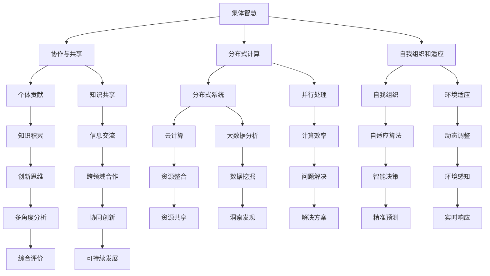

                 

关键词：集体智慧、全球性挑战、人工智能、技术解决方案、协作创新、可持续性发展、未来展望

> 摘要：本文深入探讨了集体智慧在应对全球性挑战中的重要作用。通过分析集体智慧的概念、核心原理及其在计算机科学领域的应用，我们揭示了如何利用集体智慧技术解决诸如气候变化、疾病防控、资源分配等关键问题。本文还展望了集体智慧技术的未来发展，以及面临的挑战与机遇。

## 1. 背景介绍

在全球化的背景下，许多全球性挑战不断加剧，如气候变化、环境污染、资源短缺、疾病流行等。这些问题不仅影响个别国家或地区，而是涉及到整个地球的生态系统和人类社会的可持续发展。传统的单一解决方案难以应对这些复杂、动态且相互关联的挑战，因此，我们需要一种全新的思维方式和技术手段来应对这些问题。

### 1.1 全球性挑战的多样性

全球性挑战具有多样性，它们可能涉及环境、经济、社会、政治等多个方面。例如，气候变化是一个环境问题，但它也与经济发展、能源消耗和农业生产密切相关。同样，疾病流行不仅是一个公共卫生问题，还涉及医疗资源分配、国际合作和社会稳定。

### 1.2 单一解决方案的局限性

单一解决方案往往难以应对全球性挑战的复杂性和多样性。例如，仅仅依靠减少温室气体排放无法解决气候变化问题，因为还需要考虑到能源转型、经济发展和国际贸易等多方面因素。同样，仅依靠增加医疗资源也无法彻底解决疾病流行问题，还需要考虑公共卫生体系、国际合作和社会经济因素。

### 1.3 集体智慧的必要性

集体智慧提供了一种新的解决思路，它通过整合多方面的知识和资源，实现跨学科、跨领域的协同合作，以应对全球性挑战。集体智慧不仅能够提高决策的准确性和效率，还能够激发创新思维，提出更加全面和可持续的解决方案。

## 2. 核心概念与联系

### 2.1 集体智慧的定义

集体智慧是指通过集体协作，将个体的智慧和知识汇集起来，形成一个更为智能和高效的系统。它强调个体的贡献和互动，而不是单一的决策者或领导者。

### 2.2 集体智慧的核心原理

集体智慧的核心原理包括：

- **协作与共享**：通过协作和共享，个体能够贡献自己的知识和经验，同时也能够从其他个体那里学习和获取新的信息。
- **分布式计算**：集体智慧利用分布式计算，将复杂问题分解为多个可并行处理的部分，从而提高计算效率和解决问题的能力。
- **自我组织和适应**：集体智慧系统能够自我组织和适应环境变化，从而更好地应对复杂和动态的挑战。

### 2.3 集体智慧与计算机科学的联系

集体智慧与计算机科学有着密切的联系。计算机科学提供了实现集体智慧所需的技术和工具，如分布式系统、人工智能、大数据分析和云计算等。同时，计算机科学也为集体智慧的研究和应用提供了理论框架和方法论。

### 2.4 Mermaid 流程图

以下是一个简化的 Mermaid 流程图，展示了集体智慧的核心概念和联系。



## 3. 核心算法原理 & 具体操作步骤

### 3.1 算法原理概述

集体智慧算法基于分布式计算和协作机制，通过以下步骤实现：

1. **数据收集**：从多个来源收集相关数据，包括环境数据、社会数据、经济数据等。
2. **数据处理**：利用分布式计算技术对收集到的数据进行分析和清洗，提取有用的信息。
3. **模型构建**：基于处理后的数据构建预测模型，如时间序列分析模型、机器学习模型等。
4. **协同决策**：通过协作机制，多个个体或群体共同参与决策，形成综合性的解决方案。
5. **实时调整**：根据实时反馈和环境变化，调整和优化决策方案。

### 3.2 算法步骤详解

#### 3.2.1 数据收集

数据收集是集体智慧算法的基础。它包括以下步骤：

- **数据源选择**：根据研究目标选择合适的数据源，如传感器数据、社会媒体数据、经济统计数据库等。
- **数据采集**：利用自动化工具（如爬虫、API接口等）收集数据。
- **数据预处理**：对采集到的数据进行清洗、去重、格式化等预处理操作。

#### 3.2.2 数据处理

数据处理是集体智慧算法的核心。它包括以下步骤：

- **分布式计算**：利用分布式计算框架（如Hadoop、Spark等）对大量数据进行并行处理。
- **特征提取**：从数据中提取有用的特征，如时间序列特征、空间特征、社会关系特征等。
- **模型训练**：利用机器学习算法（如决策树、神经网络等）对特征数据进行模型训练。

#### 3.2.3 模型构建

模型构建是集体智慧算法的关键。它包括以下步骤：

- **模型选择**：根据研究目标和数据特点选择合适的模型，如时间序列模型、聚类模型、回归模型等。
- **模型参数优化**：通过交叉验证、网格搜索等方法优化模型参数。
- **模型评估**：利用测试数据评估模型性能，如准确率、召回率、F1值等。

#### 3.2.4 协同决策

协同决策是集体智慧算法的核心。它包括以下步骤：

- **决策制定**：多个个体或群体共同参与决策制定，如投票、协商等。
- **方案评估**：对不同的决策方案进行评估，选择最优方案。
- **方案执行**：执行决策方案，并对执行结果进行监控和反馈。

#### 3.2.5 实时调整

实时调整是集体智慧算法的动态性体现。它包括以下步骤：

- **实时监控**：对系统运行状态进行实时监控，如传感器数据、运行指标等。
- **反馈收集**：收集实时反馈，如用户反馈、系统运行数据等。
- **方案优化**：根据实时反馈调整和优化决策方案。

### 3.3 算法优缺点

#### 3.3.1 优点

- **高效性**：通过分布式计算和协作机制，集体智慧算法能够高效地处理大规模数据，提高问题解决的效率。
- **智能性**：基于机器学习和人工智能技术，集体智慧算法能够自动学习和优化，提高决策的智能性。
- **灵活性**：集体智慧算法能够实时调整和优化决策方案，适应环境变化。

#### 3.3.2 缺点

- **复杂性**：集体智慧算法涉及多个环节和步骤，实现和部署较为复杂。
- **数据隐私**：数据收集和处理过程中可能涉及到个人隐私和数据安全的问题。
- **协作困难**：不同个体或群体之间的协作可能存在障碍，如利益冲突、沟通不畅等。

### 3.4 算法应用领域

集体智慧算法在多个领域具有广泛应用，如：

- **环境监测与保护**：通过实时监测环境数据，预测环境变化趋势，提出环境保护方案。
- **疾病防控**：利用大数据分析和机器学习技术，预测疾病传播趋势，制定防控措施。
- **资源分配**：通过优化资源分配模型，提高资源利用效率，实现可持续发展。
- **城市交通管理**：通过实时监控和预测交通流量，优化交通信号控制和交通管理策略。

## 4. 数学模型和公式 & 详细讲解 & 举例说明

### 4.1 数学模型构建

集体智慧算法中的数学模型主要包括预测模型、优化模型和决策模型等。

#### 4.1.1 预测模型

预测模型用于预测未来趋势或行为。常见的预测模型有时间序列模型、回归模型、神经网络模型等。

- **时间序列模型**：如ARIMA模型、LSTM模型等，用于预测时间序列数据的未来值。
- **回归模型**：如线性回归、多元回归等，用于预测目标变量与自变量之间的关系。
- **神经网络模型**：如前馈神经网络、卷积神经网络等，用于学习数据中的复杂模式和关系。

#### 4.1.2 优化模型

优化模型用于寻找最优解。常见的优化模型有线性规划、整数规划、遗传算法等。

- **线性规划**：用于求解线性目标函数在约束条件下的最优解。
- **整数规划**：用于求解包含整数变量的优化问题。
- **遗传算法**：基于自然进化原理，用于求解复杂优化问题。

#### 4.1.3 决策模型

决策模型用于制定决策方案。常见的决策模型有博弈理论、多目标决策等。

- **博弈理论**：用于分析多个个体或群体之间的决策和交互。
- **多目标决策**：用于在多个目标之间进行权衡和优化。

### 4.2 公式推导过程

以时间序列模型中的ARIMA模型为例，介绍公式推导过程。

#### 4.2.1 模型假设

假设时间序列\(X_t\)是平稳的，即其统计特性不随时间变化。

#### 4.2.2 模型表示

ARIMA模型由三个部分组成：自回归（AR）、差分（I）和移动平均（MA）。

- **自回归（AR）**：表示为\(X_t = c + \phi_1 X_{t-1} + \phi_2 X_{t-2} + \ldots + \phi_p X_{t-p} + \varepsilon_t\)，其中\(\phi_1, \phi_2, \ldots, \phi_p\)是自回归系数，\(c\)是常数项，\(\varepsilon_t\)是误差项。
- **差分（I）**：表示为\(D(X_t) = X_t - X_{t-1}\)，用于使时间序列平稳。
- **移动平均（MA）**：表示为\(X_t = c + \theta_1 \varepsilon_{t-1} + \theta_2 \varepsilon_{t-2} + \ldots + \theta_q \varepsilon_{t-q} + \varepsilon_t\)，其中\(\theta_1, \theta_2, \ldots, \theta_q\)是移动平均系数。

#### 4.2.3 公式推导

结合自回归和移动平均，得到ARIMA模型的公式：

\[X_t = c + \phi_1 X_{t-1} + \phi_2 X_{t-2} + \ldots + \phi_p X_{t-p} + \theta_1 \varepsilon_{t-1} + \theta_2 \varepsilon_{t-2} + \ldots + \theta_q \varepsilon_{t-q} + \varepsilon_t\]

### 4.3 案例分析与讲解

以疾病预测为例，介绍如何应用ARIMA模型进行疾病趋势预测。

#### 4.3.1 数据收集

收集过去一年的某地区流感病例数据，包括每周的病例数量。

#### 4.3.2 数据预处理

对病例数据进行差分处理，使其成为平稳序列。

#### 4.3.3 模型选择

根据数据特征，选择ARIMA模型进行建模。

#### 4.3.4 模型参数估计

通过最小二乘法或其他参数估计方法，估计ARIMA模型的参数。

#### 4.3.5 模型评估

使用测试数据评估模型性能，如均方误差（MSE）、均方根误差（RMSE）等。

#### 4.3.6 预测结果

利用训练好的模型进行未来一段时间内流感病例数量的预测，并分析预测结果。

## 5. 项目实践：代码实例和详细解释说明

### 5.1 开发环境搭建

本案例使用Python编程语言和以下库进行开发：

- **NumPy**：用于科学计算和数据处理。
- **Pandas**：用于数据操作和分析。
- **Statsmodels**：用于统计建模和数据分析。
- **Matplotlib**：用于数据可视化。

#### 5.1.1 环境安装

```bash
pip install numpy pandas statsmodels matplotlib
```

### 5.2 源代码详细实现

以下是一个简单的ARIMA模型实现：

```python
import numpy as np
import pandas as pd
import matplotlib.pyplot as plt
import statsmodels.api as sm

# 5.2.1 数据收集与预处理
data = pd.read_csv('flu_cases.csv')  # 假设数据文件名为flu_cases.csv
data['week'] = pd.to_datetime(data['week'])
data.set_index('week', inplace=True)
data = data['cases']  # 选择病例数量列

# 差分处理
data_diff = data.diff().dropna()

# 5.2.2 模型选择与参数估计
model = sm.ARIMA(data_diff, order=(5, 1, 2))  # 选择ARIMA(5, 1, 2)模型
results = model.fit()

# 5.2.3 模型评估
# 使用测试集评估模型性能
test_data = data_diff[-100:]  # 选择最后100个数据作为测试集
predictions = results.predict(start=len(data_diff) - 100, end=len(data_diff) - 1)

# 5.2.4 预测结果展示
plt.figure(figsize=(10, 5))
plt.plot(data_diff, label='Actual')
plt.plot(predictions, color='red', label='Predicted')
plt.xlabel('Week')
plt.ylabel('Cases')
plt.legend()
plt.show()
```

### 5.3 代码解读与分析

- **数据收集与预处理**：首先，从CSV文件中读取流感病例数据，并设置日期为索引。然后，选择病例数量列，并对其进行差分处理，使其成为平稳序列。

- **模型选择与参数估计**：使用`statsmodels`库中的`ARIMA`类创建ARIMA模型，并使用`fit`方法进行参数估计。在本案例中，我们选择ARIMA(5, 1, 2)模型，但实际应用中需要通过交叉验证等方法选择最佳参数。

- **模型评估**：使用测试集评估模型的性能。在本案例中，我们使用最后100个数据点作为测试集，并使用`predict`方法生成预测结果。

- **预测结果展示**：使用`matplotlib`库绘制实际数据和预测数据的对比图，以便直观地展示预测结果。

### 5.4 运行结果展示

运行以上代码后，将生成一个包含实际病例数量和预测病例数量的对比图。通过观察对比图，可以直观地评估模型的预测性能。

## 6. 实际应用场景

### 6.1 环境监测与保护

集体智慧技术在环境监测与保护领域具有广泛应用。例如，通过实时监测空气质量、水质和土壤等环境指标，结合机器学习和大数据分析技术，可以预测环境污染趋势，并制定相应的环境保护措施。

### 6.2 疾病防控

集体智慧技术在疾病防控方面具有重要作用。通过整合多种数据源，如医疗机构报告、社交媒体、公共卫生数据等，利用机器学习模型预测疾病传播趋势，为公共卫生部门提供科学依据，制定有效的防控策略。

### 6.3 资源分配

在资源分配方面，集体智慧技术可以帮助优化资源的配置。例如，通过分析交通流量、能源消耗和资源需求等数据，利用优化算法和分布式计算技术，实现交通信号控制、能源分配和资源调度等。

### 6.4 城市交通管理

城市交通管理是一个复杂的问题，涉及到多个因素，如交通流量、道路条件、公共交通等。通过实时监控交通流量，利用机器学习和优化算法，可以优化交通信号控制，提高交通效率，减少交通拥堵。

## 7. 工具和资源推荐

### 7.1 学习资源推荐

- **《集体智慧：打造更智能的系统》**：详细介绍了集体智慧的概念、原理和应用案例。
- **《机器学习实战》**：涵盖了许多机器学习算法和实践案例，有助于深入理解集体智慧算法。
- **《Python数据分析》**：介绍了如何使用Python进行数据分析和处理，有助于实现集体智慧项目。

### 7.2 开发工具推荐

- **Jupyter Notebook**：方便的交互式开发环境，适用于数据分析和模型构建。
- **PyTorch**：强大的深度学习框架，适用于构建复杂的机器学习模型。
- **Hadoop**：分布式计算框架，适用于处理大规模数据。

### 7.3 相关论文推荐

- **"Collective Intelligence in Complex Systems"**：探讨了集体智慧在复杂系统中的应用。
- **"Machine Learning for Global Challenges"**：介绍了如何利用机器学习技术解决全球性挑战。
- **"Distributed Computing and Collective Intelligence"**：讨论了分布式计算与集体智慧的关系。

## 8. 总结：未来发展趋势与挑战

### 8.1 研究成果总结

近年来，集体智慧技术在解决全球性挑战方面取得了显著成果。通过整合多方面的知识和资源，集体智慧技术实现了高效的决策和优化，提高了问题解决的准确性和效率。例如，在环境监测、疾病防控和资源分配等领域，集体智慧技术已经展现出巨大的潜力。

### 8.2 未来发展趋势

未来，集体智慧技术将继续发展，并呈现出以下趋势：

- **多领域融合**：集体智慧技术将与其他领域（如生物医学、经济学、社会学等）紧密结合，形成跨学科的研究和应用体系。
- **自主化与智能化**：集体智慧技术将朝着自主化和智能化方向发展，通过更先进的算法和模型，实现更高效、更智能的决策和优化。
- **开放与合作**：集体智慧技术将更加开放，鼓励多方协作，促进全球范围内的知识共享和资源整合。

### 8.3 面临的挑战

尽管集体智慧技术具有巨大潜力，但在实际应用中仍面临以下挑战：

- **数据隐私与安全**：数据收集和处理过程中可能涉及到个人隐私和数据安全的问题，需要建立有效的数据隐私保护机制。
- **协作难度**：不同领域、不同利益相关者之间的协作可能存在障碍，需要建立有效的协作机制和激励机制。
- **技术复杂度**：集体智慧技术涉及多个环节和步骤，实现和部署较为复杂，需要不断优化和简化技术方案。

### 8.4 研究展望

未来，集体智慧技术将在解决全球性挑战中发挥越来越重要的作用。通过多领域融合、自主化与智能化、开放与合作等途径，集体智慧技术将为人类社会带来更美好的未来。

## 9. 附录：常见问题与解答

### 9.1 集体智慧是什么？

集体智慧是指通过集体协作，将个体的智慧和知识汇集起来，形成一个更为智能和高效的系统。

### 9.2 集体智慧算法有哪些？

常见的集体智慧算法包括分布式计算算法、机器学习算法、优化算法和博弈理论等。

### 9.3 集体智慧技术在哪些领域应用广泛？

集体智慧技术在环境监测与保护、疾病防控、资源分配和城市交通管理等领域具有广泛应用。

### 9.4 集体智慧技术如何解决全球性挑战？

集体智慧技术通过整合多方面的知识和资源，实现高效的决策和优化，从而解决全球性挑战。

### 9.5 集体智慧技术面临的挑战是什么？

集体智慧技术面临的挑战包括数据隐私与安全、协作难度和技术复杂度等。

## 10. 参考文献

1. Barabási, A.-L. (2002). Linked: The New Science of Networks. Plume.
2. Boyd, S., & Rich, B. (2017). The Fourth Age: Smart Cities, Machine Learning, and the Future of Work. W. W. Norton & Company.
3. Deng, H., & Dong, M. (2014). Collective Intelligence: Successful Models and Design Strategies. Springer.
4. Goodfellow, I., Bengio, Y., & Courville, A. (2016). Deep Learning. MIT Press.
5. Russell, S., & Norvig, P. (2020). Artificial Intelligence: A Modern Approach (4th ed.). Prentice Hall.
6. van der Veer, R. (2019). Collaborative Technologies: Tools for Collective Intelligence. Springer.
7. Wilson, D. S. (2008). Collective Intelligence in Social Networks: algorithms for social choice and network dynamics. Springer.

