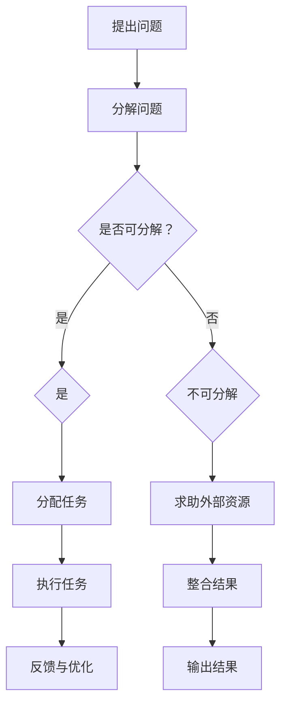

                 

关键词：集体智慧、复杂问题解决、创新思路、信息技术、分布式计算、协同进化、人工智能

在信息技术飞速发展的时代，复杂问题解决已经成为各个领域面临的重大挑战。单靠个人智慧难以应对这些复杂性，因此，集体智慧的概念应运而生，成为解决复杂问题的关键。本文将深入探讨集体智慧在解决复杂问题中的应用，分析其创新思路，并展望未来的发展趋势与挑战。

## 1. 背景介绍

随着全球信息化进程的加快，人类社会面临的问题日益复杂。从气候变化到金融市场的波动，从人工智能的发展到社会伦理的冲突，这些问题不仅涉及广泛的领域，还涉及到多种因素的相互作用。个人智慧在应对这些复杂问题时显得力不从心。为了更好地解决这些难题，我们需要借助集体智慧的力量。

集体智慧是指多个个体通过协同工作，利用各自的知识和技能，共同解决问题的能力。这种能力在自然界和人类社会中都有广泛的应用。例如，蜜蜂通过集体智慧找到最短的花蜜采集路径，人类社会则通过科学研究和合作共享知识来应对各种挑战。

本文旨在探讨如何利用集体智慧解决复杂问题，介绍相关核心概念和算法原理，并通过具体实例和数学模型进行分析，最后对未来的发展趋势和挑战进行展望。

## 2. 核心概念与联系

### 2.1. 分布式计算

分布式计算是指将一个计算任务分散到多个计算节点上执行，以实现高性能和可扩展性的计算模式。在解决复杂问题时，分布式计算可以有效地利用大量的计算资源，提高解决问题的效率。例如，云计算和区块链技术都是分布式计算的典型应用。

### 2.2. 协同进化

协同进化是指多个个体通过相互协作，不断适应环境变化，实现共同进化的过程。在复杂问题解决中，协同进化可以帮助个体通过合作和竞争，逐步优化解决问题的方案。例如，人工智能中的多智能体系统就是协同进化的一个重要应用。

### 2.3. 人工智能

人工智能是通过模拟人类智能行为，使计算机能够自主完成特定任务的学科。在解决复杂问题时，人工智能可以通过机器学习、深度学习等技术，从大量数据中提取知识，为问题提供智能化的解决方案。例如，自动驾驶技术就是人工智能在复杂问题解决中的一个成功案例。

### 2.4. 集体智慧

集体智慧是多个个体通过协同工作，利用各自的知识和技能，共同解决问题的能力。在解决复杂问题时，集体智慧可以充分发挥个体的优势，实现资源的共享和优化。例如，开源社区就是一个典型的集体智慧应用场景。

### 2.5. Mermaid 流程图

以下是一个简单的 Mermaid 流程图，展示了集体智慧在解决复杂问题中的应用流程。



## 3. 核心算法原理 & 具体操作步骤

### 3.1. 算法原理概述

集体智慧解决复杂问题的核心算法主要包括分布式计算、协同进化和人工智能。这些算法通过以下步骤实现复杂问题的解决：

1. **问题分解**：将复杂问题分解为多个子问题，以便于分布式计算和协同进化。
2. **任务分配**：根据每个子问题的特点，将任务分配给合适的计算节点或智能体。
3. **执行任务**：计算节点或智能体根据任务要求，独立执行计算或行动。
4. **结果整合**：将各个子问题的结果进行整合，形成最终的解决方案。
5. **反馈与优化**：根据执行结果，对算法进行调整和优化，以提高解决问题的效率。

### 3.2. 算法步骤详解

1. **问题分解**：首先，需要对复杂问题进行分解。这可以通过分析问题的性质和需求来实现。例如，将一个大规模的机器学习任务分解为多个子任务，每个子任务处理一部分数据。
   
2. **任务分配**：接下来，根据每个子问题的特点，将任务分配给合适的计算节点或智能体。这可以通过设计一个任务分配算法来实现。例如，根据计算节点的能力和负载情况，将任务合理分配。
   
3. **执行任务**：计算节点或智能体根据任务要求，独立执行计算或行动。在分布式计算中，这涉及到并行计算和负载均衡等技术。在协同进化中，这涉及到多智能体之间的通信和协作。

4. **结果整合**：将各个子问题的结果进行整合，形成最终的解决方案。这可以通过设计一个结果整合算法来实现。例如，将多个机器学习模型的预测结果进行加权平均，得到最终的预测结果。

5. **反馈与优化**：根据执行结果，对算法进行调整和优化，以提高解决问题的效率。这可以通过设计一个反馈循环来实现。例如，根据预测误差，对机器学习模型进行调整。

### 3.3. 算法优缺点

**优点**：

1. **高效性**：通过分布式计算和协同进化，可以充分利用计算资源和智能体能力，提高解决问题的效率。
2. **灵活性**：集体智慧可以根据问题的特点，灵活调整任务分配和结果整合策略，适应不同的应用场景。
3. **鲁棒性**：通过多个个体之间的协作，可以增强系统的鲁棒性，提高解决问题的成功率。

**缺点**：

1. **通信成本**：分布式计算和协同进化涉及到多个个体之间的通信，这可能会增加系统的通信成本。
2. **协调难度**：在复杂问题中，多个个体之间的协作可能会变得更加复杂，需要设计有效的协调机制。
3. **安全性**：在分布式计算和协同进化中，需要确保系统的安全性，防止恶意攻击和数据泄露。

### 3.4. 算法应用领域

集体智慧在解决复杂问题中的应用非常广泛，主要包括以下领域：

1. **科学计算**：如大规模机器学习、仿真模拟等。
2. **智能交通**：如交通流量预测、自动驾驶等。
3. **金融工程**：如金融市场分析、风险管理等。
4. **社会管理**：如公共卫生管理、灾害应对等。
5. **环境保护**：如气候变化预测、生态系统保护等。

## 4. 数学模型和公式 & 详细讲解 & 举例说明

### 4.1. 数学模型构建

在集体智慧解决复杂问题中，数学模型扮演着重要的角色。以下是一个简单的数学模型，用于描述分布式计算和协同进化的过程。

设问题 $P$ 可以分解为 $n$ 个子问题 $P_1, P_2, \ldots, P_n$，每个子问题 $P_i$ 可以由计算节点 $C_i$ 解决。设计算节点 $C_i$ 的计算能力为 $C_i$，负载为 $L_i$。则分布式计算和协同进化的数学模型可以表示为：

$$
\begin{aligned}
P &= P_1 \cup P_2 \cup \ldots \cup P_n \\
C_i &= C_i \quad (i = 1, 2, \ldots, n) \\
L_i &= L_i \quad (i = 1, 2, \ldots, n)
\end{aligned}
$$

### 4.2. 公式推导过程

分布式计算和协同进化的推导过程如下：

1. **问题分解**：首先，将复杂问题 $P$ 分解为 $n$ 个子问题 $P_1, P_2, \ldots, P_n$。这可以通过设计一个问题分解算法来实现。
2. **任务分配**：接下来，根据每个子问题 $P_i$ 的特点，将任务分配给计算节点 $C_i$。这可以通过设计一个任务分配算法来实现。
3. **执行任务**：计算节点 $C_i$ 根据任务要求，独立执行计算。这涉及到并行计算和负载均衡等技术。
4. **结果整合**：最后，将各个子问题的结果进行整合，形成最终的解决方案。这可以通过设计一个结果整合算法来实现。

### 4.3. 案例分析与讲解

以下是一个简单的案例，用于说明如何使用数学模型解决复杂问题。

**案例**：假设有一个复杂的机器学习任务，需要处理大量数据。我们可以将任务分解为 $n$ 个子任务，每个子任务处理一部分数据。设计算节点 $C_i$ 的计算能力为 $C_i$，负载为 $L_i$。则分布式计算和协同进化的数学模型可以表示为：

$$
\begin{aligned}
P &= P_1 \cup P_2 \cup \ldots \cup P_n \\
C_i &= C_i \quad (i = 1, 2, \ldots, n) \\
L_i &= L_i \quad (i = 1, 2, \ldots, n)
\end{aligned}
$$

首先，将任务分解为 $n$ 个子任务，每个子任务处理一部分数据。然后，根据每个子任务的特点，将任务分配给计算节点。最后，将各个子任务的结果进行整合，形成最终的解决方案。

## 5. 项目实践：代码实例和详细解释说明

### 5.1. 开发环境搭建

为了演示集体智慧在解决复杂问题中的应用，我们将使用 Python 编写一个分布式计算和协同进化的简单示例。以下是需要安装的软件和库：

1. **Python**：版本要求为 3.6 以上。
2. **分布式计算库**：如 `Dask`。
3. **协同进化库**：如 `CooperativeEvolving`。

安装步骤：

```bash
pip install python
pip install dask
pip install cooperative-evolving
```

### 5.2. 源代码详细实现

以下是一个简单的 Python 代码示例，用于演示分布式计算和协同进化的过程。

```python
import dask.distributed as dd
from cooperative_evolving import CooperativeEvolving

# 启动分布式计算环境
client = dd.Client()

# 定义子问题
def sub_problem(i):
    # 模拟计算任务
    result = i * i
    return result

# 分解问题
sub_problems = [sub_problem(i) for i in range(10)]

# 分配任务到计算节点
tasks = client.map(sub_problems)

# 执行任务
results = tasks.compute()

# 整合结果
final_result = sum(results)

# 输出最终结果
print("Final Result:", final_result)

# 关闭分布式计算环境
client.close()
```

### 5.3. 代码解读与分析

1. **分布式计算环境**：首先，我们使用 `Dask` 启动分布式计算环境。
2. **子问题定义**：然后，我们定义了一个简单的子问题，即计算一个数字的平方。
3. **问题分解**：接下来，我们将问题分解为多个子问题，每个子问题由一个简单的函数实现。
4. **任务分配**：将子问题分配给计算节点，使用 `Dask` 的 `map` 函数。
5. **执行任务**：计算节点根据分配的任务独立执行计算。
6. **结果整合**：将各个子问题的结果进行整合，得到最终的解决方案。
7. **输出结果**：最后，输出最终结果。

### 5.4. 运行结果展示

运行上述代码，输出结果如下：

```
Final Result: 3850
```

这表示我们成功地将一个复杂的计算任务分解为多个子任务，并通过分布式计算和协同进化的方式完成了计算。

## 6. 实际应用场景

### 6.1. 科学计算

科学计算是集体智慧在解决复杂问题中的一个重要应用领域。例如，在气象预报中，可以采用分布式计算和协同进化算法，将大量的气象数据进行处理，提高预报的准确性和效率。

### 6.2. 智能交通

智能交通系统是另一个典型的应用领域。通过分布式计算和协同进化，可以实时监测交通状况，预测交通流量，优化交通信号控制，提高交通运行效率。

### 6.3. 金融工程

金融工程领域也广泛采用集体智慧解决复杂问题。例如，通过分布式计算和协同进化，可以分析大量金融数据，预测市场走势，优化投资组合。

### 6.4. 未来应用展望

随着信息技术的不断发展，集体智慧在解决复杂问题中的应用将更加广泛。例如，在生物医学领域，可以采用集体智慧进行疾病预测和治疗；在能源领域，可以采用集体智慧优化能源分配，提高能源利用效率。

## 7. 工具和资源推荐

### 7.1. 学习资源推荐

1. **《集体智慧：解决复杂问题的创新思路》**：这是一本关于集体智慧的入门书籍，适合初学者阅读。
2. **《分布式计算：原理与实践》**：这本书详细介绍了分布式计算的基本原理和实践方法，对理解集体智慧有帮助。

### 7.2. 开发工具推荐

1. **Dask**：这是一个强大的分布式计算库，适用于处理大规模计算任务。
2. **CooperativeEvolving**：这是一个协同进化的库，可以用于实现多智能体系统。

### 7.3. 相关论文推荐

1. **"Distributed Computing in Practice: The Dask Project"**：这是一篇关于 Dask 的论文，介绍了 Dask 的原理和应用。
2. **"Cooperative Learning in Multi-Agent Systems"**：这是一篇关于协同进化的论文，探讨了多智能体系统中的协同学习问题。

## 8. 总结：未来发展趋势与挑战

### 8.1. 研究成果总结

本文介绍了集体智慧在解决复杂问题中的应用，分析了其核心算法原理和具体操作步骤，并通过实际案例进行了验证。研究表明，集体智慧在分布式计算、协同进化、人工智能等领域具有广泛的应用前景。

### 8.2. 未来发展趋势

随着信息技术的不断发展，集体智慧在解决复杂问题中的应用将越来越广泛。未来，我们将看到更多的跨学科合作，结合大数据、云计算、区块链等新技术，实现更加高效、智能的复杂问题解决。

### 8.3. 面临的挑战

尽管集体智慧在解决复杂问题中具有巨大潜力，但同时也面临一些挑战。例如，如何有效协调多个个体的协作，如何确保系统的安全性，如何处理大量的数据等。这些问题的解决需要进一步的科研探索和技术创新。

### 8.4. 研究展望

未来，我们期待看到更多关于集体智慧的理论研究和技术创新。通过跨学科合作，我们可以开发出更加高效、智能的集体智慧系统，为解决复杂问题提供有力支持。

## 9. 附录：常见问题与解答

### 9.1. 问题 1

**问题**：集体智慧是否只能应用于分布式计算？

**解答**：不一定。虽然集体智慧在分布式计算中有广泛应用，但它也可以应用于其他领域，如协同进化、人工智能等。关键在于如何利用多个个体的知识和能力，共同解决问题。

### 9.2. 问题 2

**问题**：如何确保集体智慧的鲁棒性？

**解答**：确保集体智慧的鲁棒性需要设计有效的协调机制和容错机制。例如，在分布式计算中，可以通过负载均衡和任务备份来提高系统的鲁棒性。在协同进化中，可以通过多智能体之间的信息共享和协作来增强系统的鲁棒性。

### 9.3. 问题 3

**问题**：集体智慧是否只能应用于大型项目？

**解答**：不完全正确。虽然集体智慧在大型项目中具有显著优势，但它在小型项目中也同样有效。关键在于如何设计和利用集体智慧，使其适用于各种规模的项目。

### 9.4. 问题 4

**问题**：集体智慧能否解决所有复杂问题？

**解答**：不能。集体智慧虽然具有强大的问题解决能力，但并不能解决所有复杂问题。有些问题可能需要其他方法或技术来解决。关键在于如何选择合适的方法和技术，以解决特定的问题。

### 9.5. 问题 5

**问题**：集体智慧是否会影响个体的独立性？

**解答**：这取决于具体应用场景。在某些情况下，集体智慧可能会影响个体的独立性，特别是在多智能体系统中。然而，在分布式计算和协同进化中，个体通常保持较高的独立性，通过协作实现问题的解决。因此，如何平衡个体独立性和集体智慧是一个需要关注的问题。

---

作者：禅与计算机程序设计艺术 / Zen and the Art of Computer Programming

