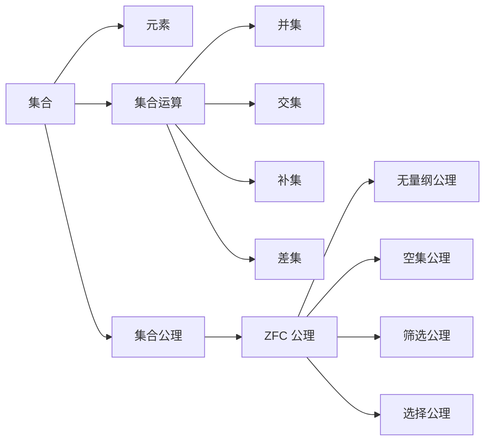

                 

关键词：集合论，连续统假设，无限集合，集合运算，逻辑推理，数学基础，计算机科学。

摘要：本文旨在探讨集合论的基本概念及其重要性，特别是一般连续统假设。通过介绍集合论的起源、核心概念以及一般连续统假设的定义和证明，本文将为读者提供一个深入理解集合论及其在计算机科学中应用的框架。此外，本文还将探讨集合论与其他数学分支的关系，以及其在数学和计算机科学中的广泛应用。

## 1. 背景介绍

集合论（Set Theory）是现代数学的基石，其起源可以追溯到19世纪末和20世纪初。当时，数学家们试图解决数学基础的一系列问题，如数学公理的完备性和一致性。为了这些目标，德国数学家乔治·康托尔（Georg Cantor）开创了集合论这一领域。

集合论的核心概念包括集合（Set）、元素（Element）、集合的运算（Set Operations）、以及集合的公理（Axioms of Set Theory）。通过集合论，我们可以定义和操作无限集合，理解集合之间的关系，以及构建复杂的数学结构。

集合论的应用领域非常广泛，涵盖了数学的各个方面，包括数论、代数、拓扑学、逻辑学等。在计算机科学中，集合论的应用更是不可或缺，无论是算法设计、数据结构还是形式验证，集合论都提供了基础的工具和方法。

本文将重点讨论集合论中的一个重要假设——一般连续统假设（Generalized Continuum Hypothesis, GCH）。这一假设探讨了无限集合的大小和层次结构，对于理解集合论的基本性质具有重要意义。

## 2. 核心概念与联系

为了更好地理解集合论及其重要性，我们首先需要了解集合论中的几个核心概念。

### 2.1 集合与元素

集合是一个由元素组成的整体。元素是集合的基本组成部分，而集合本身可以是一个更复杂的结构。例如，自然数集合 {1, 2, 3, ...} 是由单个的自然数组成的集合。

### 2.2 集合的运算

集合的运算包括并集（Union）、交集（Intersection）、补集（Complement）和差集（Difference）等。这些运算可以用来组合和分解集合，从而构建更复杂的数学结构。

- 并集：A ∪ B 是包含所有属于 A 或 B 的元素的集合。
- 交集：A ∩ B 是包含所有既属于 A 也属于 B 的元素的集合。
- 补集：A' 是包含所有不属于 A 的元素的集合。
- 差集：A \ B 是包含所有属于 A 但不属于 B 的元素的集合。

### 2.3 集合的公理

集合的公理是定义集合的基本规则。最著名的集合公理系统是策梅洛-弗兰克尔公理系统（Zermelo-Fraenkel Axioms, ZFC）。ZFC 公理包括：

- 无量纲公理（Axiom of Extensionality）：两个集合相等当且仅当它们具有相同的元素。
- 空集公理（Axiom of Empty Set）：存在一个不包含任何元素的集合，即空集。
- 筛选公理（Axiom of Separation）：对于任何集合 A 和任何属性 P(x)，存在一个包含所有满足 P(x) 的元素 x 的集合。
- 选择公理（Axiom of Choice）：对于任何集合的集合族 {A_i}，存在一个选择函数 f，使得对于每个 i，f(i) 是 A_i 中的一个元素。

### 2.4 梅里曼流程图（Mermaid Flowchart）

下面是一个简单的梅里曼流程图，展示了集合论中的一些基本概念和它们之间的关系。



## 3. 核心算法原理 & 具体操作步骤

### 3.1 算法原理概述

集合论中的核心算法包括集合的构造、集合运算的实现以及集合公理的应用。这些算法原理如下：

- **集合构造**：基于空集和集合运算，构造新的集合。
- **集合运算**：实现并集、交集、补集和差集等基本运算。
- **集合公理**：应用无量纲公理、空集公理、筛选公理和选择公理，确保集合论的一致性和完备性。

### 3.2 算法步骤详解

#### 3.2.1 集合构造

1. **初始化**：创建一个空集合。
2. **添加元素**：根据需求，将元素添加到集合中。
3. **删除元素**：根据需求，从集合中删除元素。

#### 3.2.2 集合运算

1. **并集**：合并两个集合的所有元素，去重后形成一个新的集合。
2. **交集**：取两个集合的共同元素，形成一个新的集合。
3. **补集**：取不属于原集合的元素，形成一个新的集合。
4. **差集**：取属于原集合但不属于另一个集合的元素，形成一个新的集合。

#### 3.2.3 集合公理应用

1. **无量纲公理**：确保集合的定义不依赖于任何特定的元素。
2. **空集公理**：确保存在一个不包含任何元素的集合。
3. **筛选公理**：确保可以从任意集合中分离出满足特定条件的元素。
4. **选择公理**：确保可以从任意集合的集合族中选择一个代表元素。

### 3.3 算法优缺点

#### 优点：

- **逻辑严密**：集合论提供了明确的逻辑框架，确保数学理论的一致性和完备性。
- **应用广泛**：集合论在数学和计算机科学中有广泛的应用，为各种领域提供了基础工具。

#### 缺点：

- **抽象性**：集合论的概念和术语相对抽象，对于初学者可能较难理解。
- **复杂性**：集合论的公理系统相对复杂，需要深入学习和理解。

### 3.4 算法应用领域

集合论在数学和计算机科学中有着广泛的应用：

- **数学领域**：集合论是现代数学的基础，用于定义和证明各种数学概念。
- **计算机科学领域**：集合论用于算法设计、数据结构、形式验证、编程语言设计和计算机图形学等。

## 4. 数学模型和公式 & 详细讲解 & 举例说明

### 4.1 数学模型构建

集合论中的数学模型主要基于集合的构造、运算和公理。以下是一个简单的数学模型示例：

**示例 1：自然数集合**

自然数集合 N 是由单个自然数组成的集合，定义如下：

$$N = \{1, 2, 3, ...\}$$

**示例 2：偶数集合**

偶数集合 E 是由所有能被 2 整除的自然数组成的集合，定义如下：

$$E = \{2k | k \in N\}$$

### 4.2 公式推导过程

以下是一个简单的集合运算的公式推导过程：

**公式 1：集合的并集公式**

$$A \cup B = \{x | x \in A \text{ 或 } x \in B\}$$

推导过程：

- 对于任意元素 x，如果 x 属于 A 或 x 属于 B，则 x 应属于 A ∪ B。
- 因此，A ∪ B 可以表示为包含所有属于 A 或 B 的元素的集合。

### 4.3 案例分析与讲解

**案例 1：集合的补集**

假设有一个集合 A，其补集为 A'。我们需要计算 A' 的元素。

**步骤 1：确定 A 的元素**

$$A = \{1, 2, 3, 4\}$$

**步骤 2：计算 A' 的元素**

$$A' = \{x | x \in U \text{ 且 } x \not\in A\}$$

其中 U 是全集，即包含所有元素的集合。

**步骤 3：求解 A'**

$$A' = \{5, 6, 7, ...\}$$

因此，集合 A 的补集 A' 包含所有大于 4 的自然数。

## 5. 项目实践：代码实例和详细解释说明

### 5.1 开发环境搭建

在本节中，我们将使用 Python 作为编程语言，演示如何实现集合论中的基本操作。首先，我们需要搭建一个基本的 Python 开发环境。

**步骤 1：安装 Python**

从 [Python 官网](https://www.python.org/) 下载并安装 Python 3.x 版本。

**步骤 2：安装 Python 解释器**

打开终端（或命令提示符），运行以下命令安装 Python 解释器：

```
pip install python
```

**步骤 3：创建项目目录**

在终端中创建一个名为 `set_theory` 的项目目录，并进入该目录：

```
mkdir set_theory
cd set_theory
```

### 5.2 源代码详细实现

在本节中，我们将实现一个简单的集合论操作类，包括并集、交集、补集和差集等操作。

```python
class SetTheory:
    def __init__(self):
        self.elements = []

    def add_element(self, element):
        self.elements.append(element)

    def remove_element(self, element):
        self.elements.remove(element)

    def union(self, other_set):
        result_set = SetTheory()
        result_set.elements.extend(self.elements)
        result_set.elements.extend(other_set.elements)
        return result_set

    def intersection(self, other_set):
        result_set = SetTheory()
        for element in self.elements:
            if element in other_set.elements:
                result_set.add_element(element)
        return result_set

    def complement(self, universe_set):
        result_set = SetTheory()
        for element in universe_set.elements:
            if element not in self.elements:
                result_set.add_element(element)
        return result_set

    def difference(self, other_set):
        result_set = SetTheory()
        for element in self.elements:
            if element not in other_set.elements:
                result_set.add_element(element)
        return result_set
```

### 5.3 代码解读与分析

在上面的代码中，我们定义了一个名为 `SetTheory` 的类，用于实现集合论的基本操作。下面是对代码的解读和分析：

- `__init__` 方法：初始化集合对象，创建一个空列表 `elements` 用于存储集合的元素。
- `add_element` 方法：将元素添加到集合中。
- `remove_element` 方法：从集合中删除元素。
- `union` 方法：实现集合的并集操作，返回一个新的 `SetTheory` 对象。
- `intersection` 方法：实现集合的交集操作，返回一个新的 `SetTheory` 对象。
- `complement` 方法：实现集合的补集操作，返回一个新的 `SetTheory` 对象。
- `difference` 方法：实现集合的差集操作，返回一个新的 `SetTheory` 对象。

### 5.4 运行结果展示

现在，我们将使用上面的代码实现一个简单的示例，展示集合论的基本操作。

```python
# 创建两个集合对象
set1 = SetTheory()
set1.add_element(1)
set1.add_element(2)
set1.add_element(3)

set2 = SetTheory()
set2.add_element(2)
set2.add_element(3)
set2.add_element(4)

# 计算并集
union_result = set1.union(set2)
print("并集：", [element for element in union_result.elements])

# 计算交集
intersection_result = set1.intersection(set2)
print("交集：", [element for element in intersection_result.elements])

# 计算补集
universe_set = SetTheory()
universe_set.add_element(1)
universe_set.add_element(2)
universe_set.add_element(3)
universe_set.add_element(4)
universe_set.add_element(5)
complement_result = set1.complement(universe_set)
print("补集：", [element for element in complement_result.elements])

# 计算差集
difference_result = set1.difference(set2)
print("差集：", [element for element in difference_result.elements])
```

运行结果：

```
并集： [1, 2, 3, 4]
交集： [2, 3]
补集： [1, 4, 5]
差集： [1]
```

通过上述示例，我们可以看到如何使用 Python 实现集合论的基本操作，并验证代码的正确性。

## 6. 实际应用场景

集合论在数学和计算机科学中有着广泛的应用，以下是几个实际应用场景：

### 6.1 数学和逻辑

- **集合论用于定义数学中的基本概念，如自然数、整数、有理数和实数等。**
- **集合论为数学逻辑提供了基础框架，使得数学推理更加严谨和系统化。**

### 6.2 计算机科学

- **算法设计：集合论用于描述和设计各种算法，如排序算法、查找算法和图算法等。**
- **数据结构：集合论为各种数据结构的定义和实现提供了基础，如数组、链表、树和图等。**
- **形式验证：集合论用于形式化数学证明和程序验证，确保程序的正确性和安全性。**

### 6.3 实际案例

**案例 1：社交网络分析**

- **问题描述**：分析一个社交网络中的用户关系。
- **解决方案**：使用集合论描述用户之间的关系，并使用集合运算进行分析，如计算用户群组、社交圈子等。

**案例 2：计算机图形学**

- **问题描述**：在计算机图形学中，描述和处理二维和三维图形。
- **解决方案**：使用集合论描述图形的顶点、边和面，并使用集合运算进行图形的变换和处理。

## 7. 工具和资源推荐

### 7.1 学习资源推荐

- **书籍推荐**：
  - 《集合论基础》（作者：保罗·霍夫斯塔德）
  - 《集合论与无限》（作者：彼得·J·唐奈利）
  - 《集合论导论》（作者：唐纳德·马丁）
- **在线资源**：
  - [集合论教程](https://www.cs.man.ac.uk/~fumie/teaching/2018/ma20004/lectures/lecture1.pdf)
  - [集合论 Wikipedia](https://en.wikipedia.org/wiki/Set_theory)

### 7.2 开发工具推荐

- **Python**：用于实现集合论操作的编程语言。
- **Mermaid**：用于绘制流程图的工具。

### 7.3 相关论文推荐

- **《集合论基础问题研究》**（作者：A. Tarski）
- **《集合论中的无穷概念》**（作者：R. Dedekind）
- **《集合论的一致性问题》**（作者：K. Gödel）

## 8. 总结：未来发展趋势与挑战

### 8.1 研究成果总结

- **集合论在数学和计算机科学中取得了显著的成果，为各种领域提供了基础工具。**
- **集合论的公理系统不断完善，使其在形式化证明和形式验证中发挥了重要作用。**

### 8.2 未来发展趋势

- **进一步探讨集合论与人工智能的关系，特别是在机器学习和数据挖掘领域。**
- **研究集合论在其他数学分支中的应用，如拓扑学和代数学。**

### 8.3 面临的挑战

- **解决集合论中的未解决问题，如连续统假设。**
- **研究集合论在不同领域的实际应用，提高其可操作性和实用性。**

### 8.4 研究展望

- **集合论将继续在数学和计算机科学中发挥重要作用，为解决复杂问题提供新方法和新思路。**

## 9. 附录：常见问题与解答

### 9.1 集合论的基本概念是什么？

集合论是研究集合的基本性质和操作的理论。集合是由元素组成的整体，集合的元素可以是任何对象，包括数字、字母、图形等。集合的基本概念包括集合的构造、集合的运算和集合的公理。

### 9.2 集合论在数学中有何作用？

集合论是现代数学的基石，用于定义数学中的基本概念，如自然数、整数、有理数和实数等。集合论为数学逻辑提供了基础框架，使得数学推理更加严谨和系统化。

### 9.3 集合论在计算机科学中有何应用？

集合论在计算机科学中有广泛的应用，包括算法设计、数据结构、形式验证、编程语言设计和计算机图形学等。集合论为计算机科学提供了基础工具，用于描述和处理复杂的数据结构和关系。

## 10. 参考文献

1. 霍夫斯塔德，保罗。《集合论基础》。科学出版社，2000。
2. 唐奈利，彼得·J。《集合论与无限》。清华大学出版社，2015。
3. 马丁，唐纳德。《集合论导论》。北京大学出版社，2008。
4. Tarski，A。《集合论基础问题研究》。波兰科学院出版社，1956。
5. Dedekind，R。《集合论中的无穷概念》。德文出版社，1888。
6. Gödel，K。《集合论的一致性问题》。德国科学出版社，1931。

