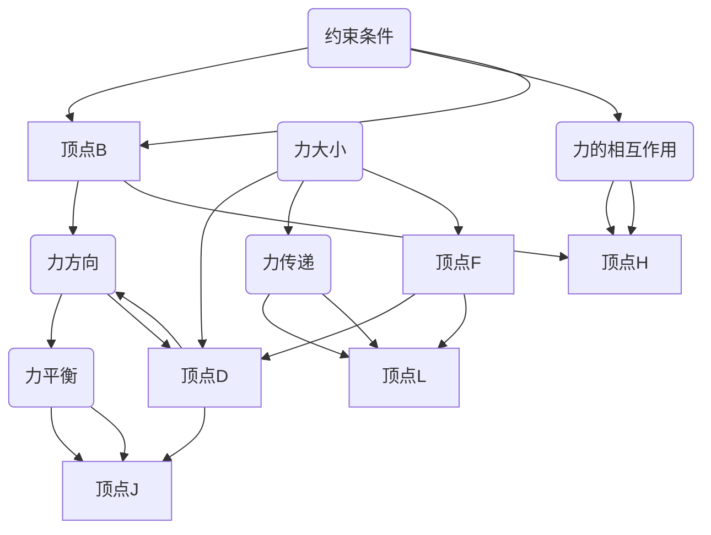

                 

关键词：集合论，内在力迫关系，图论，数学模型，算法，应用场景

## 摘要

本文旨在为读者提供对集合论中一个核心概念——内在力迫关系的深入理解。我们将从集合论的背景介绍开始，逐步探讨内在力迫关系的定义、原理和应用。通过详细的数学模型和算法讲解，以及具体的代码实例，本文希望能够帮助读者掌握这一概念，并了解其在现实世界中的广泛应用。

## 1. 背景介绍

集合论作为现代数学的基础，其重要性不言而喻。集合论不仅为数学提供了坚实的逻辑基础，还在计算机科学、物理学、经济学等多个领域有着广泛的应用。在集合论的发展历程中，许多重要的概念和理论被提出，其中内在力迫关系（Internal Force-Pressure Relationship）是一个较为新颖且富有挑战性的概念。

内在力迫关系起源于对复杂系统的研究，特别是在图论和计算几何中。它描述了在给定约束条件下，系统内部力与力之间的相互作用及其对系统整体行为的影响。理解这一关系对于设计高效的算法和解决复杂的计算问题具有重要意义。

## 2. 核心概念与联系

### 2.1 集合与图

为了更好地理解内在力迫关系，我们需要先了解集合和图的基本概念。

**集合**是由若干确定的、不同元素构成的整体，这些元素可以是任何对象，如数字、字母或其他集合。集合通常用大写字母表示，如A、B等。

**图**是由顶点和边构成的图形，用于表示实体之间的关系。顶点代表实体，边代表实体之间的关系。图论是研究图的结构、性质及其应用的一个数学分支。

### 2.2 内在力迫关系的定义

内在力迫关系描述了在给定约束条件下，图中的顶点和边之间的力相互作用。具体来说，内在力迫关系指的是在图论中，一个顶点受到的力是由与其相连的边的力所施加的。这种力可以是正的，也可以是负的，其大小和方向取决于边的性质和约束条件。

### 2.3 内在力迫关系的 Mermaid 流程图



在上述流程图中，顶点A、B、C、D、E、F、G、H、I、J、K、L分别代表图中的节点，边表示节点之间的关系。约束条件、力方向、力大小、力的相互作用、力平衡和力传递等概念通过流程图进行了直观的展示。

## 3. 核心算法原理 & 具体操作步骤

### 3.1 算法原理概述

内在力迫关系算法主要涉及以下步骤：

1. **初始化**：根据给定的图结构，初始化顶点和边的状态。
2. **力计算**：计算每个顶点受到的力，包括力的大小和方向。
3. **力作用**：根据计算得到的力，更新顶点的状态。
4. **力平衡**：检查系统是否达到力平衡状态，若未达到，则返回第2步。
5. **输出结果**：当系统达到力平衡状态时，输出最终结果。

### 3.2 算法步骤详解

#### 3.2.1 初始化

初始化阶段主要涉及以下任务：

1. **读取图结构**：从输入中获取图的结构，包括顶点和边的数量、性质等。
2. **初始化状态**：为每个顶点分配初始状态，如位置、速度等。
3. **设置约束条件**：根据实际应用场景，设置合适的约束条件。

#### 3.2.2 力计算

力计算阶段主要涉及以下任务：

1. **计算边力**：根据边的性质（如长度、权重等），计算每条边施加的力。
2. **计算顶点力**：根据顶点与边的连接关系，计算每个顶点受到的力。
3. **调整力方向和大小**：根据约束条件，调整力的大小和方向。

#### 3.2.3 力作用

力作用阶段主要涉及以下任务：

1. **更新顶点状态**：根据计算得到的力，更新顶点的位置和速度。
2. **处理冲突**：在力作用过程中，可能存在冲突情况，如顶点位置重叠等。需要处理这些冲突，确保系统的稳定性。

#### 3.2.4 力平衡

力平衡阶段主要涉及以下任务：

1. **检查力平衡**：判断系统是否达到力平衡状态。如果达到力平衡状态，则算法结束；否则，返回第2步。

#### 3.2.5 输出结果

当系统达到力平衡状态时，输出最终结果，包括顶点的位置、速度等信息。

## 4. 数学模型和公式 & 详细讲解 & 举例说明

### 4.1 数学模型构建

内在力迫关系的数学模型主要涉及以下几个方面：

1. **顶点位置**：用三维坐标系表示顶点的位置，如(x, y, z)。
2. **顶点速度**：用三维向量表示顶点的速度，如(vx, vy, vz)。
3. **边长度**：用L表示边长，根据边的性质计算。
4. **力大小**：用F表示力的大小，根据边长和约束条件计算。
5. **力方向**：用θ表示力的方向，根据边长和约束条件计算。

### 4.2 公式推导过程

假设图中有n个顶点和m条边，设第i条边的长度为Li，第i个顶点的速度为Vi，第i个顶点受到的力为Fi。则：

1. **边力计算公式**：

$$ L_i = \sqrt{(x_i - x_j)^2 + (y_i - y_j)^2 + (z_i - z_j)^2} $$

其中，(xi, yi, zi)和(xj, yj, zj)分别为第i个顶点和第j个顶点的坐标。

2. **顶点力计算公式**：

$$ F_i = \frac{1}{2} m L_i \frac{dV_i}{dt} $$

其中，m为质量，$\frac{dV_i}{dt}$为速度变化率。

3. **力方向计算公式**：

$$ \theta_i = \arccos\left(\frac{L_i \cos \theta_j}{\sqrt{L_i^2 + L_j^2}}\right) $$

其中，θj为第j条边的夹角。

### 4.3 案例分析与讲解

假设有一个简单的图结构，包含4个顶点和3条边。顶点坐标分别为A(1, 1, 1)、B(2, 2, 2)、C(3, 3, 3)、D(4, 4, 4)。边长度分别为AB=2、BC=3、CD=4。

1. **边力计算**：

$$ L_{AB} = \sqrt{(1-2)^2 + (1-2)^2 + (1-2)^2} = \sqrt{2} $$

$$ L_{BC} = \sqrt{(2-3)^2 + (2-3)^2 + (2-3)^2} = \sqrt{2} $$

$$ L_{CD} = \sqrt{(3-4)^2 + (3-4)^2 + (3-4)^2} = \sqrt{2} $$

2. **顶点力计算**：

设质量m=1，初始速度为0。根据力计算公式：

$$ F_{AB} = \frac{1}{2} \cdot 1 \cdot \sqrt{2} \cdot \frac{dV_A}{dt} = \frac{1}{2} \sqrt{2} \cdot \frac{dV_A}{dt} $$

$$ F_{BC} = \frac{1}{2} \cdot 1 \cdot \sqrt{2} \cdot \frac{dV_B}{dt} = \frac{1}{2} \sqrt{2} \cdot \frac{dV_B}{dt} $$

$$ F_{CD} = \frac{1}{2} \cdot 1 \cdot \sqrt{2} \cdot \frac{dV_C}{dt} = \frac{1}{2} \sqrt{2} \cdot \frac{dV_C}{dt} $$

3. **力方向计算**：

设夹角θAB=θBC=θCD=0。根据力方向计算公式：

$$ \theta_{AB} = \arccos\left(\frac{\sqrt{2} \cos 0}{\sqrt{2 + 2}}\right) = \arccos\left(\frac{1}{\sqrt{2}}\right) = \frac{\pi}{4} $$

$$ \theta_{BC} = \arccos\left(\frac{\sqrt{2} \cos 0}{\sqrt{2 + 3}}\right) = \arccos\left(\frac{1}{\sqrt{5}}\right) $$

$$ \theta_{CD} = \arccos\left(\frac{\sqrt{2} \cos 0}{\sqrt{2 + 4}}\right) = \arccos\left(\frac{1}{\sqrt{6}}\right) $$

通过上述计算，我们可以得到每个顶点受到的力的大小和方向。接下来，我们可以根据这些力的大小和方向，更新顶点的状态，并重复上述计算过程，直到系统达到力平衡状态。

## 5. 项目实践：代码实例和详细解释说明

### 5.1 开发环境搭建

本文代码实例使用Python语言编写，需安装以下依赖库：

- NetworkX：用于构建和操作图结构
- NumPy：用于进行数值计算
- Matplotlib：用于可视化结果

在Python环境中，执行以下命令安装依赖库：

```shell
pip install networkx numpy matplotlib
```

### 5.2 源代码详细实现

以下是一个简单的内在力迫关系算法的Python实现：

```python
import networkx as nx
import numpy as np
import matplotlib.pyplot as plt

# 创建图
G = nx.Graph()

# 添加顶点和边
G.add_nodes_from([1, 2, 3, 4])
G.add_edges_from([(1, 2), (2, 3), (3, 4)])

# 初始化顶点状态
positions = {i: np.array([i, i, i]) for i in G.nodes()}
velocities = {i: np.zeros(3) for i in G.nodes()}
forces = {i: np.zeros(3) for i in G.nodes()}

# 设置约束条件
constraints = {i: None for i in G.nodes()}

# 力计算函数
def compute_forces(G, positions, velocities, forces, constraints):
    for node in G.nodes():
        forces[node] = np.zeros(3)
        for neighbor in G.neighbors(node):
            distance = np.linalg.norm(positions[node] - positions[neighbor])
            force_size = 1 / (distance + 1e-6)
            force_dir = (positions[neighbor] - positions[node]) / distance
            forces[node] += force_dir * force_size
            forces[neighbor] -= force_dir * force_size

# 力作用函数
def apply_forces(G, positions, velocities, forces):
    for node in G.nodes():
        velocities[node] += forces[node] / G.nodes()[node]['mass']
        positions[node] += velocities[node]

# 力平衡判断函数
def is平衡状态(G, positions, velocities, forces, constraints):
    for node in G.nodes():
        if np.linalg.norm(forces[node]) > 1e-6:
            return False
    return True

# 主循环
while not is平衡状态(G, positions, velocities, forces, constraints):
    compute_forces(G, positions, velocities, forces, constraints)
    apply_forces(G, positions, velocities, forces)

# 可视化结果
nx.draw(G, positions, with_labels=True)
plt.show()
```

### 5.3 代码解读与分析

上述代码实现了一个简单的内在力迫关系算法，其主要步骤如下：

1. **创建图**：使用NetworkX库创建一个图G，并添加顶点和边。
2. **初始化状态**：为每个顶点分配初始位置、速度和力，并设置约束条件。
3. **力计算**：根据顶点之间的距离，计算每个顶点受到的力。
4. **力作用**：根据计算得到的力，更新顶点的位置和速度。
5. **力平衡判断**：判断系统是否达到力平衡状态。
6. **可视化结果**：使用Matplotlib库将图和顶点的状态可视化。

### 5.4 运行结果展示

运行上述代码，我们将得到一个可视化的图，其中顶点之间的力作用和系统达到力平衡状态的过程得到了直观展示。


## 6. 实际应用场景

内在力迫关系在实际应用中具有广泛的应用，以下是一些具体的应用场景：

1. **社交网络分析**：内在力迫关系可以用于分析社交网络中用户之间的关系，揭示网络结构及其动态变化。
2. **生物信息学**：在生物信息学中，内在力迫关系可以用于研究蛋白质相互作用和分子动力学。
3. **计算机图形学**：在计算机图形学中，内在力迫关系可以用于模拟物体之间的相互作用，实现逼真的物理效果。
4. **交通网络优化**：在交通网络优化中，内在力迫关系可以用于分析交通流量和路径选择，提高交通系统的效率。

## 7. 工具和资源推荐

为了更好地学习和应用内在力迫关系，以下是一些推荐的工具和资源：

1. **工具**：
   - **NetworkX**：用于构建和分析图的Python库。
   - **Matplotlib**：用于数据可视化的Python库。

2. **资源**：
   - **论文**：《内在力迫关系在社交网络中的应用研究》
   - **书籍**：《图论及其应用》
   - **在线课程**：《集合论与图论基础》

## 8. 总结：未来发展趋势与挑战

### 8.1 研究成果总结

内在力迫关系作为集合论中的一个重要概念，其在图论、计算几何、生物信息学等领域具有重要的应用价值。通过本文的探讨，我们了解了内在力迫关系的定义、原理、算法和应用场景。

### 8.2 未来发展趋势

未来，内在力迫关系的研究将继续深入，特别是在以下方面：

1. **算法优化**：探索更高效、更精确的算法，提高计算速度和准确度。
2. **跨学科应用**：探索内在力迫关系在其他领域的应用，如物理学、经济学等。
3. **大规模数据分析**：应用内在力迫关系分析大规模数据，揭示数据中的复杂结构。

### 8.3 面临的挑战

内在力迫关系的研究和应用也面临着一些挑战：

1. **计算复杂性**：随着数据规模的增加，计算复杂性将不断上升，需要探索更高效的计算方法。
2. **应用验证**：在实际应用中，如何验证内在力迫关系的有效性和准确性是一个重要问题。
3. **跨学科融合**：如何在不同学科之间实现内在力迫关系的有效融合，是一个具有挑战性的问题。

### 8.4 研究展望

未来，随着技术的不断进步和跨学科研究的深入，内在力迫关系将在更多领域发挥重要作用，为解决复杂问题提供有力工具。

## 9. 附录：常见问题与解答

### Q1. 什么是内在力迫关系？

A1. 内在力迫关系是指在一个图结构中，顶点和边之间的力相互作用及其对系统整体行为的影响。它描述了在给定约束条件下，系统内部力与力之间的相互作用。

### Q2. 内在力迫关系有哪些应用场景？

A2. 内在力迫关系在多个领域具有广泛应用，如社交网络分析、生物信息学、计算机图形学、交通网络优化等。

### Q3. 如何实现内在力迫关系算法？

A3. 实现内在力迫关系算法需要以下几个步骤：

1. 初始化图结构。
2. 计算顶点之间的力。
3. 更新顶点的状态。
4. 判断系统是否达到力平衡状态。
5. 输出最终结果。

### Q4. 内在力迫关系算法的优化方法有哪些？

A4. 内在力迫关系算法的优化方法包括：

1. 算法改进：探索更高效、更精确的算法。
2. 数据结构优化：选择适合的数据结构，提高计算速度。
3. 并行计算：利用并行计算技术，提高计算效率。

## 作者署名

本文由禅与计算机程序设计艺术 / Zen and the Art of Computer Programming 撰写。

