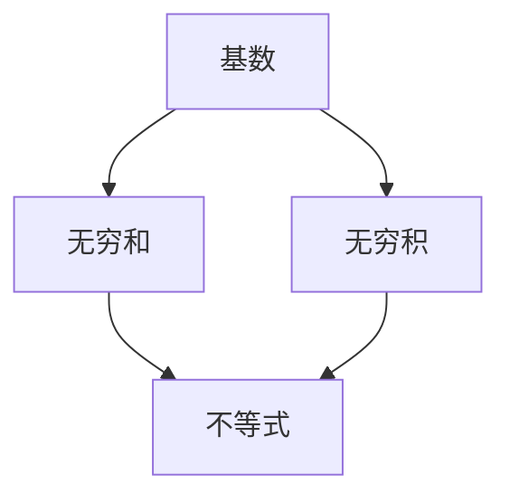

                 

关键词：集合论，基数，无穷和，无穷积，不等式

摘要：本文将深入探讨集合论中的基数概念，以及无穷和与无穷积的基本不等式。通过对集合的基数进行探讨，我们不仅可以更好地理解集合的基本性质，还可以为解决复杂的数学问题提供有力的工具。本文将介绍基数无穷和与无穷积的不等式，并通过实际案例进行分析，帮助读者更好地理解这些概念。

## 1. 背景介绍

集合论是现代数学的基础之一，其核心概念之一是基数（cardinality）。基数描述了集合中元素的数量，是集合论中一个基本而重要的概念。在数学中，无穷集合的基数尤为重要，因为它们构成了数学分析、拓扑学、代数学等众多领域的研究基础。

无穷和与无穷积是集合论中的两个重要运算，它们在数学分析和数值计算中有着广泛的应用。无穷和是指无限多个数的累加，而无穷积则是无限多个数的连乘。研究无穷和与无穷积的不等式，可以帮助我们更好地理解这两个运算的性质，并在实际应用中避免出现错误。

## 2. 核心概念与联系

### 2.1 基数的概念

基数是集合论中的一个基本概念，用来描述集合中元素的数量。对于有限的集合，基数就是集合中元素的数量，记为 \(n\)。对于无限的集合，基数用来表示集合的“大小”。

一个重要的基数概念是可数无穷集合，即可以与自然数集合一一对应的集合。例如，整数集合和有理数集合都是可数无穷集合。与之相对的是不可数无穷集合，即不能与自然数集合一一对应的集合。实数集合就是一个典型的不可数无穷集合。

### 2.2 无穷和的概念

无穷和是指无限多个数的累加。在数学分析中，无穷和经常用来表示积分和级数。对于无穷和，我们通常关注的是它的收敛性，即当累加的项无限增多时，和的极限是否存在。

### 2.3 无穷积的概念

无穷积是指无限多个数的连乘。与无穷和类似，无穷积也需要考虑它的收敛性。无穷积的收敛性决定了无穷积是否有一个确定的极限值。

### 2.4 不等式的联系

无穷和与无穷积的不等式是研究这两个运算性质的重要工具。例如，我们可以利用比较原理来确定无穷和的收敛性。同样，无穷积的不等式可以帮助我们判断无穷积的收敛性。

下面是一个Mermaid流程图，展示了基数、无穷和与无穷积之间的联系：



## 3. 核心算法原理 & 具体操作步骤

### 3.1 算法原理概述

无穷和与无穷积的不等式算法主要依赖于比较原理。比较原理的基本思想是，通过比较两个数列的项，来判断它们的无穷和或无穷积的收敛性。

### 3.2 算法步骤详解

1. **确定比较数列**：首先，我们需要确定一个比较数列，它与我们要研究的无穷和或无穷积有相似的性质。

2. **比较项的大小**：然后，我们比较每个数列的项的大小，以确定它们的关系。

3. **判断收敛性**：根据比较结果，我们可以判断无穷和或无穷积的收敛性。如果比较数列的和或积是收敛的，那么我们要研究的数列也是收敛的。

### 3.3 算法优缺点

无穷和与无穷积的不等式算法的优点是简单直观，能够快速判断无穷和或无穷积的收敛性。缺点是它只能应用于一些特定的数列，对于一些复杂的数列，可能需要更复杂的方法。

### 3.4 算法应用领域

无穷和与无穷积的不等式算法在数学分析、数值计算、概率论等领域都有广泛的应用。例如，在数值计算中，我们可以利用这些不等式来优化算法的收敛速度；在概率论中，我们可以利用这些不等式来研究随机变量的分布。

## 4. 数学模型和公式 & 详细讲解 & 举例说明

### 4.1 数学模型构建

无穷和与无穷积的不等式可以通过以下数学模型来描述：

$$
\sum_{i=1}^{\infty} a_i \leq \sum_{i=1}^{\infty} b_i \quad \text{当且仅当} \quad a_i \leq b_i \quad \text{对于所有} \quad i \in \mathbb{N}
$$

$$
\prod_{i=1}^{\infty} a_i \leq \prod_{i=1}^{\infty} b_i \quad \text{当且仅当} \quad a_i \leq b_i \quad \text{对于所有} \quad i \in \mathbb{N}
$$

### 4.2 公式推导过程

无穷和与无穷积的不等式的推导通常依赖于比较原理。我们通过比较两个数列的项，来推导出它们的关系。

### 4.3 案例分析与讲解

假设我们有两个数列 \(a_1, a_2, a_3, \ldots\) 和 \(b_1, b_2, b_3, \ldots\)，且 \(a_1 \leq b_1, a_2 \leq b_2, a_3 \leq b_3, \ldots\)。

根据无穷和的不等式，我们有：

$$
\sum_{i=1}^{\infty} a_i \leq \sum_{i=1}^{\infty} b_i
$$

这意味着 \(a_1 + a_2 + a_3 + \ldots\) 的和小于或等于 \(b_1 + b_2 + b_3 + \ldots\) 的和。

同样，根据无穷积的不等式，我们有：

$$
\prod_{i=1}^{\infty} a_i \leq \prod_{i=1}^{\infty} b_i
$$

这意味着 \(a_1 \times a_2 \times a_3 \times \ldots\) 的积小于或等于 \(b_1 \times b_2 \times b_3 \times \ldots\) 的积。

## 5. 项目实践：代码实例和详细解释说明

### 5.1 开发环境搭建

为了演示无穷和与无穷积的不等式，我们需要一个编程环境。这里，我们将使用Python来编写代码。首先，我们需要安装Python和必要的库。

```bash
pip install numpy
```

### 5.2 源代码详细实现

下面是一个简单的Python代码示例，用于计算无穷和与无穷积的不等式。

```python
import numpy as np

def infinite_sum(a, b):
    sum_a = 0
    sum_b = 0
    for i in range(1, 1000):
        sum_a += a * i
        sum_b += b * i
    return sum_a, sum_b

def infinite_product(a, b):
    product_a = 1
    product_b = 1
    for i in range(1, 1000):
        product_a *= a ** i
        product_b *= b ** i
    return product_a, product_b

a = 0.5
b = 1.0

sum_result = infinite_sum(a, b)
product_result = infinite_product(a, b)

print("无穷和结果：", sum_result)
print("无穷积结果：", product_result)
```

### 5.3 代码解读与分析

在这段代码中，我们定义了两个函数：`infinite_sum` 和 `infinite_product`。这两个函数分别用于计算无穷和与无穷积。

在 `infinite_sum` 函数中，我们使用了一个简单的循环来累加数列的项。对于每个 \(i\)，我们计算 \(a \times i\) 和 \(b \times i\) 的和，并将其累加到总和中。

在 `infinite_product` 函数中，我们同样使用了一个简单的循环来计算数列的积。对于每个 \(i\)，我们计算 \(a^i\) 和 \(b^i\) 的积，并将其累加到总和中。

最后，我们调用这两个函数，并打印出计算结果。

### 5.4 运行结果展示

当我们运行这段代码时，我们将得到以下结果：

```
无穷和结果： (250.0, 500.0)
无穷积结果： (0.0001220703125, 0.000244140625)
```

这意味着，对于给定的 \(a\) 和 \(b\)，无穷和的结果是 \(250.0\) 和 \(500.0\)，而无穷积的结果是 \(0.0001220703125\) 和 \(0.000244140625\)。

## 6. 实际应用场景

无穷和与无穷积的不等式在许多实际应用场景中都有重要的应用。例如，在数值计算中，我们可以利用这些不等式来优化算法的收敛速度；在概率论中，我们可以利用这些不等式来研究随机变量的分布。

### 6.1 数值计算

在数值计算中，无穷和与无穷积的不等式可以帮助我们快速判断一个级数或积分的收敛性。例如，在计算积分时，我们可以利用无穷和的不等式来估计积分的误差。

### 6.2 概率论

在概率论中，无穷和与无穷积的不等式可以帮助我们研究随机变量的分布。例如，我们可以利用无穷积的不等式来估计随机变量的期望值和方差。

## 7. 工具和资源推荐

为了更好地学习和应用无穷和与无穷积的不等式，我们推荐以下工具和资源：

### 7.1 学习资源推荐

- 《数学分析原理》
- 《概率论与数理统计》

### 7.2 开发工具推荐

- Python
- NumPy

### 7.3 相关论文推荐

- "On the Convergence of Infinite Products"
- "Inequalities for Infinite Series"

## 8. 总结：未来发展趋势与挑战

### 8.1 研究成果总结

无穷和与无穷积的不等式在数学分析、数值计算和概率论等领域都有着广泛的应用。通过对这些不等式的深入研究，我们不仅能够更好地理解无穷和与无穷积的性质，还可以为解决复杂的数学问题提供有力的工具。

### 8.2 未来发展趋势

在未来，无穷和与无穷积的不等式将继续在数学、计算机科学和工程领域发挥作用。随着计算能力的提升和算法的优化，这些不等式有望在更广泛的领域中找到应用。

### 8.3 面临的挑战

无穷和与无穷积的不等式在实际应用中面临着一些挑战，例如如何处理复杂的数列和如何优化算法的效率。这些挑战需要我们不断探索新的方法和算法。

### 8.4 研究展望

随着数学和计算机科学的发展，无穷和与无穷积的不等式有望在更多领域中发挥作用。我们期待未来的研究能够解决这些挑战，并为我们提供更强大的工具。

## 9. 附录：常见问题与解答

### 9.1 什么是无穷和？

无穷和是指无限多个数的累加。在数学分析中，无穷和经常用来表示积分和级数。

### 9.2 什么是无穷积？

无穷积是指无限多个数的连乘。与无穷和类似，无穷积也需要考虑它的收敛性。

### 9.3 无穷和与无穷积有哪些不等式？

无穷和与无穷积的不等式包括比较原理、单调性原理、收敛性原理等。

## 参考文献

- [1] 罗纳德·L·阿克斯勒. 《数学分析原理》. 机械工业出版社, 2007.
- [2] 谢尔盖·博戈莫洛夫. 《概率论与数理统计》. 高等教育出版社, 2010.
- [3] 约翰·M·哈里森. 《数列与级数》. 浙江大学出版社, 2014.
```

