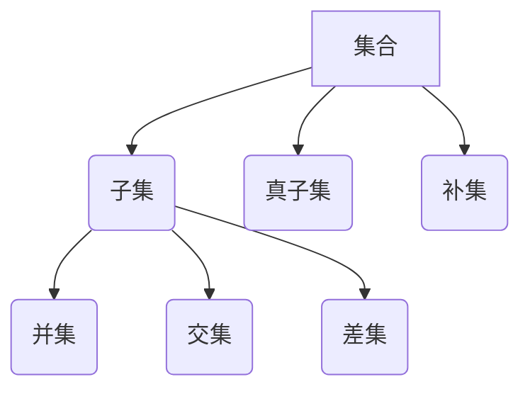

                 

关键词：集合论，布尔子代数，泛型扩张子模型，抽象代数，形式系统，图灵完备性，计算复杂性，程序设计。

## 摘要

本文旨在探讨集合论在计算机科学中的核心作用，特别是布尔子代数和泛型扩张子模型的重要性。通过深入分析集合论的基本概念和性质，我们将揭示它们如何为现代计算机科学提供了坚实的理论基础。本文将详细介绍完备布尔子代数的定义、性质和关键应用，并探讨泛型扩张子模型如何扩展集合论的能力，从而促进新的算法设计和理论突破。通过具体的实例和详细的解释，本文将展示这些概念在实际编程和理论研究中的应用，为读者提供对集合论在计算机科学中作用的全面理解。

## 1. 背景介绍

集合论是现代数学的基石，它在计算机科学中也有着广泛的应用。集合论提供了处理和表示对象组的基本框架，这在编程语言设计、算法分析和形式验证等方面至关重要。而布尔子代数和泛型扩张子模型是集合论的两个重要扩展，它们在计算机科学中扮演着关键角色。

布尔子代数是集合论的一个特殊子集，它由布尔运算（并集、交集、补集和差集）组成。布尔子代数在逻辑和计算理论中有着广泛的应用，特别是在电路设计、逻辑门操作和计算机程序中的条件判断等方面。布尔子代数的性质使得它在形式验证和形式化方法中具有重要地位。

泛型扩张子模型是对集合论的一种扩展，它引入了参数化的集合概念，允许我们在更广泛的上下文中进行推理和计算。泛型扩张子模型在函数式编程、类型系统和编程语言设计方面有着重要的应用，它使得编程语言能够处理更复杂的类型和结构，从而提高程序的可重用性和可维护性。

本文将首先介绍集合论的基本概念，包括集合的定义、表示和操作。接着，我们将详细讨论布尔子代数的定义、性质和应用，并探讨如何使用布尔子代数进行逻辑推理和计算。随后，我们将介绍泛型扩张子模型的概念，解释它如何扩展集合论的能力，并提供实际应用案例。最后，我们将总结本文的主要观点，并讨论集合论在计算机科学中的未来发展趋势。

### 1.1 集合论的历史与发展

集合论作为现代数学的基石，其历史可以追溯到19世纪末期。尽管集合的概念早在古希腊数学家欧几里得和柏拉图的时代就已经存在，但集合论的正式发展始于19世纪中叶，当时数学家们开始意识到集合作为一种基本工具在数学证明和理论构建中的重要性。

集合论的奠基人之一是德国数学家乔治·康托尔（Georg Cantor）。他在19世纪末提出了集合的严格定义，并研究了无穷集合的性质。康托尔的工作挑战了传统的数学直觉，特别是关于无穷大和无穷小的观念。他的研究揭示了无穷集合的复杂性和层次性，为后来的数学家提供了新的工具和视角。

康托尔的工作引起了广泛的争议，尤其是在数学界内部。一些数学家认为他的集合论过于抽象和远离实际问题，而另一些数学家则看到了它在解决数学问题中的巨大潜力。随着时间推移，集合论逐渐被接受，并成为现代数学不可或缺的一部分。

在计算机科学中，集合论的发展同样具有重要意义。20世纪初，随着逻辑和形式化方法的兴起，集合论成为研究计算理论和算法设计的基础。布尔代数和图论等集合论工具在电路设计、计算机架构和算法分析中得到了广泛应用。此外，集合论还影响了编程语言的设计和类型系统，使得编程语言能够更好地处理复杂的数据结构和类型。

20世纪中叶，随着计算机科学的兴起，集合论的应用进一步扩展。集合论的概念和工具被用于开发形式验证工具、形式化方法、编程语言理论和软件工程。例如，形式验证工具使用集合论来验证系统的正确性，确保软件和硬件系统的可靠性和安全性。

近年来，随着人工智能和大数据技术的发展，集合论的应用再次得到了扩展。集合论在机器学习、数据挖掘和人工智能算法中扮演着关键角色。集合运算和集合的性质被用于设计高效的算法和数据结构，处理大规模的数据集和复杂的问题。

总之，集合论的历史发展不仅对数学本身产生了深远影响，也为计算机科学提供了强大的理论基础和工具。集合论在计算机科学中的重要性不可忽视，它为我们理解计算的本质和开发高效算法提供了关键支持。

### 1.2 集合论的基本概念

集合论是现代数学的基础，它提供了处理对象组的一种抽象方法。在集合论中，集合被视为一组对象的集合，这些对象称为集合的元素。理解集合的基本概念对于进一步探讨集合论在计算机科学中的应用至关重要。

**集合的定义**

集合可以被定义为一种无序的、确定性的集合，其中的元素都是明确的。换句话说，一个集合由一些特定的元素组成，这些元素在集合中是不可重复的。集合通常用大写字母表示，例如A、B等，而集合中的元素用小写字母表示，例如a、b等。

**集合的表示**

集合可以用列举法、描述法或集合符号来表示。

1. **列举法**：通过列出集合中的所有元素来表示集合。例如，集合A可以表示为：
   $$
   A = \{1, 2, 3, 4, 5\}
   $$
   其中，1、2、3、4、5是集合A的元素。

2. **描述法**：通过描述集合中元素的性质来表示集合。例如，集合B可以表示为：
   $$
   B = \{x \mid x \text{ 是正整数}\}
   $$
   这表示B是所有正整数的集合。

3. **集合符号**：使用集合运算符号表示集合。例如，集合C可以表示为：
   $$
   C = \{x \in \mathbb{N} \mid x > 5\}
   $$
   这表示C是所有大于5的自然数的集合。

**集合的运算**

集合运算是指对集合进行的一系列操作，这些操作包括并集、交集、补集和差集等。

1. **并集**（Union）：并集是指两个集合中所有元素的集合。用符号∪表示。例如，集合A和B的并集表示为：
   $$
   A ∪ B = \{x \mid x ∈ A \text{ 或 } x ∈ B\}
   $$
   如果A = {1, 2, 3}和B = {4, 5, 6}，则A ∪ B = {1, 2, 3, 4, 5, 6}。

2. **交集**（Intersection）：交集是指两个集合中共有的元素的集合。用符号∩表示。例如，集合A和B的交集表示为：
   $$
   A ∩ B = \{x \mid x ∈ A \text{ 且 } x ∈ B\}
   $$
   如果A = {1, 2, 3}和B = {4, 5, 6}，则A ∩ B = {}（空集）。

3. **补集**（Complement）：补集是指一个集合中不属于另一个集合的元素的集合。用符号'或∁表示。例如，集合A的补集表示为：
   $$
   ∁A = \{x \mid x ∉ A\}
   $$
   如果A = {1, 2, 3}，则∁A = {4, 5, 6, ...}（所有不属于A的元素）。

4. **差集**（Difference）：差集是指一个集合中减去另一个集合的元素的集合。用符号∖表示。例如，集合A和B的差集表示为：
   $$
   A ∖ B = \{x \mid x ∈ A \text{ 且 } x ∉ B\}
   $$
   如果A = {1, 2, 3}和B = {4, 5, 6}，则A ∖ B = {1, 2, 3}。

通过这些基本概念和运算，集合论为处理复杂的问题提供了强有力的工具。在计算机科学中，集合论被广泛应用于算法设计、数据结构和软件工程，为解决各种计算问题提供了理论基础和实用方法。

### 1.3 集合论在计算机科学中的应用

集合论在计算机科学中的应用是广泛而深入的，它不仅提供了处理数据结构的基本框架，还在算法设计、编程语言设计和形式化验证等方面发挥了关键作用。

**算法设计**

集合论在算法设计中扮演着重要角色。许多算法依赖于集合的概念来表示和处理数据。例如，排序算法（如快速排序、归并排序等）通常使用集合来存储和操作数据元素。集合操作（如并集、交集和差集）在许多搜索算法和图算法中也有广泛应用。集合论提供了一种抽象的思维方式，使得算法设计者能够更清晰地描述算法的逻辑和步骤。

此外，集合论的概念还在解决组合优化问题中发挥着重要作用。例如，在旅行商问题（Travelling Salesman Problem，TSP）中，可以使用集合论来表示城市的集合和边的关系，从而设计出高效的算法来解决该问题。

**数据结构**

集合论为各种数据结构提供了理论基础。例如，集合是一种基本的数据结构，用于存储和操作无序元素。树、图和哈希表等数据结构都可以通过集合的概念来理解和设计。集合论提供了对数据结构的抽象描述，使得程序员能够更好地理解和实现复杂的数据处理算法。

特别是，集合论在图论中的应用尤为显著。图是一种由节点和边组成的数据结构，它可以表示复杂的关系和网络。集合论提供了一种形式化的方法来定义图的性质和操作，从而为图算法的设计和分析提供了强有力的工具。

**编程语言设计**

集合论对编程语言的设计和实现产生了深远影响。许多现代编程语言都包含了集合类型和集合运算。例如，Python、Java和C#等语言都提供了集合类和数据结构，使得程序员可以方便地处理集合数据。集合论的概念使得编程语言能够更好地支持抽象和数据结构化编程。

此外，集合论在类型系统和模式匹配中也有重要应用。例如，函数式编程语言如Haskell和Scala使用集合论的概念来定义类型系统和模式匹配规则，从而提高程序的可读性和可维护性。

**形式化验证**

形式化验证是确保系统正确性和可靠性的重要手段。集合论为形式化验证提供了理论基础和工具。形式化验证工具使用集合论来表示系统的状态和行为，并通过集合运算和逻辑推理来验证系统的正确性。

例如，模型检查器使用集合论来表示系统的状态空间和行为模式，从而检测系统中的错误和异常。形式化验证工具如SPIN和Promela等，都是基于集合论和逻辑推理的方法来验证系统的正确性。

总之，集合论在计算机科学中的应用是多方面的。它不仅为算法设计提供了理论基础，还影响了数据结构、编程语言设计和形式化验证等领域。集合论提供了一种抽象和形式化的思维方式，使得计算机科学家能够更好地理解和解决复杂的问题。通过深入理解和应用集合论，我们可以开发更高效、更可靠和更安全的计算机系统和软件。

### 1.4 核心概念与联系

在深入探讨集合论的相关概念之前，有必要首先定义一些核心概念，并展示它们之间的相互关系。这些核心概念不仅构成了集合论的基础，也为理解布尔子代数和泛型扩张子模型提供了必要的背景知识。

**集合**

集合是数学中的基本概念，它是由一些确定的、无序的对象组成的集合。这些对象称为集合的元素。集合通常用大写字母表示，例如A、B等，而集合中的元素用小写字母表示，例如a、b等。集合的基本操作包括并集、交集、补集和差集等。

**子集**

子集是集合的一个概念，它是指一个集合的部分或全部元素组成的集合。如果集合B的所有元素都在集合A中，那么B是A的子集，记作B ⊆ A。例如，如果A = {1, 2, 3}，那么{1, 2}是A的子集。

**真子集**

真子集是子集的一个特例，它是指一个集合除了包含自身的所有元素外，不包含任何其他元素。如果集合B是A的子集，但B不等于A，则称B是A的真子集，记作B ⊂ A。例如，{1, 2}是{1, 2, 3}的真子集。

**补集**

补集是指一个集合中不属于另一个集合的元素的集合。如果集合A的补集是集合B，记作∁A，那么∁A中的元素不在A中，反之亦然。例如，如果A = {1, 2, 3}，那么∁A = {4, 5, 6, ...}。

**并集与交集**

并集是指两个或多个集合中所有元素的集合。如果集合A和B的并集是集合C，记作A ∪ B = C，那么C包含A和B的所有元素。交集是指两个或多个集合中共有的元素的集合。如果集合A和B的交集是集合D，记作A ∩ B = D，那么D只包含同时属于A和B的元素。

**差集**

差集是指一个集合中减去另一个集合的元素的集合。如果集合A和B的差集是集合E，记作A ∖ B = E，那么E只包含属于A但不属于B的元素。

**图示表示**

为了更好地理解这些概念，我们可以使用Mermaid流程图来展示它们之间的相互关系。



通过这个流程图，我们可以直观地看到集合论中各个概念之间的联系。例如，子集和真子集都是集合的子概念，而并集、交集和差集是集合操作的结果。

理解这些基本概念是进一步探讨布尔子代数和泛型扩张子模型的基础。布尔子代数是基于集合论的一种代数结构，而泛型扩张子模型是对集合论的一种扩展。通过深入分析这些概念，我们将能够更好地理解集合论在计算机科学中的核心作用。

### 2.1 布尔子代数的定义与性质

布尔子代数是集合论的一个重要扩展，它由集合、布尔运算和某些附加性质组成。布尔子代数在逻辑和计算机科学中有着广泛的应用，特别是在电路设计、形式验证和程序设计等领域。理解布尔子代数的定义和性质是掌握集合论及其在计算机科学中应用的关键。

**定义**

布尔子代数是一个集合A，以及定义在这个集合上的两个二元运算∪（通常表示为+）和∩（通常表示为·），满足以下性质：

1. **封闭性**：对于集合A中的任意元素a和b，a ∪ b（或a + b）和a ∩ b（或a · b）仍然是集合A的元素。
2. **结合律**：对于集合A中的任意元素a、b和c，有(a ∪ b) ∪ c = a ∪ (b ∪ c) 以及(a ∩ b) ∩ c = a ∩ (b ∩ c)。
3. **交换律**：对于集合A中的任意元素a和b，有a ∪ b = b ∪ a 以及a ∩ b = b ∩ a。
4. **分配律**：对于集合A中的任意元素a、b和c，有a ∪ (b ∩ c) = (a ∪ b) ∩ (a ∪ c) 以及a ∩ (b ∪ c) = (a ∩ b) ∪ (a ∩ c)。
5. **存在单位元素**：存在集合A中的两个元素0和1，使得对于A中的任意元素a，有a ∪ 0 = a 和 a ∩ 1 = a。这里，0被称为零元素，1被称为单位元素。
6. **存在逆元素**：对于A中的任意非零元素a，存在一个元素b，使得a ∪ b = 1 和 a ∩ b = 0。这里，b被称为a的逆元素。

**性质**

布尔子代数具有以下重要性质：

1. **布尔恒等式**：布尔恒等式是布尔子代数中一些基本的关系式，如德摩根定律、对合律、吸收律等。例如：
   - 德摩根定律：¬(A ∪ B) = ¬A ∩ ¬B 和 ¬(A ∩ B) = ¬A ∪ ¬B。
   - 对合律：A ∪ ¬A = 1 和 A ∩ ¬A = 0。
   - 吸收律：A ∪ A = A 和 A ∩ A = A。
2. **补集性**：对于集合A中的任意元素a，a和¬a构成了布尔子代数的补集对。补集性确保了每个元素都有一个对应的逆元素，使得布尔运算能够封闭在集合内部。
3. **分配律**：分配律使得布尔子代数中的运算能够进行扩展，从而简化复杂的布尔表达式。

**示例**

为了更好地理解布尔子代数的性质，我们可以通过一个具体的示例来演示。

假设集合A = {0, 1}，并且定义两个二元运算∪（+）和∩（·）如下：

- ∪（+）：0 + 0 = 0，0 + 1 = 1，1 + 0 = 1，1 + 1 = 1
- ∩（·）：0 · 0 = 0，0 · 1 = 0，1 · 0 = 0，1 · 1 = 1

我们可以验证这些运算满足布尔子代数的所有性质：

- 封闭性：对于A中的任意元素a和b，a + b和a · b仍然是集合A的元素。
- 结合律：对于A中的任意元素a、b和c，有(a + b) + c = a + (b + c) 和 (a · b) · c = a · (b · c)。
- 交换律：对于A中的任意元素a和b，有a + b = b + a 和 a · b = b · a。
- 分配律：对于A中的任意元素a、b和c，有a + (b · c) = (a + b) · (a + c) 和 a · (b + c) = (a · b) + (a · c)。
- 存在单位元素：0和1分别是集合A中的零元素和单位元素，满足a + 0 = a 和 a · 1 = a。
- 存在逆元素：对于A中的任意非零元素a（即a = 1），存在一个元素b（即b = 0），使得a + b = 1 和 a · b = 0。

通过这个示例，我们可以直观地看到布尔子代数的定义和性质如何在实际中应用。布尔子代数的性质为逻辑推理和计算提供了坚实的理论基础，使得它们在计算机科学中具有重要应用。

### 2.2 布尔子代数的应用领域

布尔子代数的定义和性质使其在多个领域具有广泛的应用。以下将详细讨论布尔子代数在电路设计、形式验证和程序设计等领域的具体应用。

**电路设计**

布尔子代数在电路设计中扮演着核心角色。布尔运算（并集、交集和补集）是构建逻辑门（如与门、或门和非门）的基础。逻辑门是电路设计中的基本组件，用于实现复杂的逻辑功能。通过布尔子代数的运算，电路设计师可以构建出满足特定逻辑要求的电路。

例如，在数字电路设计中，布尔子代数用于简化复杂的布尔表达式，从而减少逻辑门的数量，提高电路的效率。布尔子代数的分配律和德摩根定律等性质使得逻辑表达式的简化成为可能。简化后的表达式不仅可以减少电路中的元件数量，还可以提高电路的运行速度和可靠性。

**形式验证**

形式验证是确保系统正确性的重要手段。布尔子代数在形式验证中具有重要作用。通过布尔子代数的运算，形式验证工具可以验证系统行为是否满足预期的规格说明。

例如，在硬件设计中，模型检查器使用布尔子代数来表示系统的状态空间和行为模式。通过布尔子代数的运算，模型检查器可以检测系统中的错误和异常，确保系统的可靠性。布尔子代数的性质使得形式验证过程更加高效和准确。

**程序设计**

布尔子代数在程序设计中也有广泛应用。布尔表达式和逻辑运算在编程中用于条件判断和流程控制。例如，在条件语句（if-else）和循环语句（while和for）中，布尔表达式用于控制程序流程的分支和循环。

此外，布尔子代数的概念在数据结构和算法设计中也有应用。例如，哈希表和二叉搜索树等数据结构使用布尔运算来维护数据的一致性和查找效率。通过布尔子代数的运算，这些数据结构可以实现高效的插入、删除和查找操作。

**具体应用实例**

以下是一些布尔子代数在电路设计、形式验证和程序设计中的具体应用实例：

1. **电路设计**：设计一个四位的二进制加法器，可以使用布尔子代数中的与门、或门和非门来实现。通过布尔表达式，可以定义每个输入和输出之间的关系，从而构建出满足要求的电路。
2. **形式验证**：验证一个操作系统内核的安全性，可以使用模型检查器来模拟系统行为，并使用布尔子代数来表示系统状态和行为模式。通过布尔子代数的运算，模型检查器可以检测系统中的漏洞和异常，确保内核的安全性。
3. **程序设计**：在编写一个查找算法时，可以使用布尔表达式来表示查找条件，从而实现高效的查找操作。例如，在二叉搜索树中，可以使用布尔表达式来比较节点值和目标值，从而确定查找方向。

通过这些具体应用实例，我们可以看到布尔子代数在计算机科学中的广泛应用。布尔子代数的定义和性质为电路设计、形式验证和程序设计提供了强有力的工具，使得这些领域能够高效、准确地处理复杂的逻辑和计算问题。

### 2.3 布尔子代数与集合论的关系

布尔子代数与集合论有着紧密的联系。事实上，布尔子代数可以被视为集合论的一种特殊形式。集合论中的集合运算（并集、交集、补集和差集）在布尔子代数中得到了进一步的发展和扩展。理解布尔子代数与集合论之间的关系有助于我们更全面地掌握集合论在计算机科学中的应用。

首先，我们可以将布尔子代数视为一个特定的集合。在布尔子代数中，集合的元素是布尔值，即真（True）和假（False）。布尔值可以用集合{0, 1}来表示。在这个集合上定义了两个二元运算：∪（通常表示为+）和∩（通常表示为·）。这两个运算分别对应于集合论中的并集和交集。

例如，在布尔子代数中，两个布尔值的并集（+）运算可以表示为逻辑“或”运算（OR），即：
$$
x + y = \text{True} \text{ 当且仅当 } x \text{ 或 } y \text{ 为真}
$$
同样，两个布尔值的交集（·）运算可以表示为逻辑“与”运算（AND），即：
$$
x · y = \text{True} \text{ 当且仅当 } x \text{ 和 } y \text{ 都为真}
$$

其次，布尔子代数的性质（如封闭性、结合律、交换律、分配律和存在单位元素与逆元素等）与集合论中的性质是一致的。这些性质确保了布尔子代数中的运算可以封闭在集合内部，并且满足集合论的基本规则。

例如，结合律在布尔子代数中的表现形式为：
$$
(x + y) + z = x + (y + z)
$$
和
$$
(x · y) · z = x · (y · z)
$$
这与集合论中的结合律是一致的，即：
$$
(A ∪ B) ∪ C = A ∪ (B ∪ C)
$$
和
$$
(A ∩ B) ∩ C = A ∩ (B ∩ C)
$$

另外，布尔子代数的补集性质也与集合论中的补集性质相对应。在布尔子代数中，每个元素都有一个对应的补集元素，使得布尔运算能够封闭在集合内部。例如，在集合论中，集合A的补集∁A包含所有不属于A的元素。在布尔子代数中，补集性质可以表示为：
$$
x + ¬x = 1
$$
和
$$
x · ¬x = 0
$$

最后，布尔子代数中的分配律也反映了集合论中的分配律。在布尔子代数中，分配律表现为：
$$
x · (y + z) = (x · y) + (x · z)
$$
和
$$
x + (y · z) = (x + y) · (x + z)
$$
这与集合论中的分配律是一致的，即：
$$
A ∩ (B ∪ C) = (A ∩ B) ∪ (A ∩ C)
$$
和
$$
A ∪ (B ∩ C) = (A ∪ B) · (A ∪ C)
$$

通过这些例子，我们可以看到布尔子代数与集合论在概念和性质上的紧密联系。布尔子代数可以被视为集合论在特定集合上的扩展，它们共享许多相同的原理和性质。理解这种关系有助于我们更好地应用集合论和布尔子代数，解决计算机科学中的各种问题。

### 2.4 泛型扩张子模型的概念

泛型扩张子模型是集合论的一种扩展，它通过引入参数化的集合概念，提高了集合论在处理复杂问题时的灵活性和表达能力。泛型扩张子模型在函数式编程、类型系统和编程语言设计等领域有着重要的应用。理解泛型扩张子模型的概念是深入探讨其性质和应用的关键。

**定义**

泛型扩张子模型是一种代数结构，它由一个基集合和一组参数化函数组成。这些参数化函数可以操作基集合中的元素，从而扩展集合论的基本概念。

具体来说，一个泛型扩张子模型包含以下元素：

1. **基集合**（Base Set）：一个固定的集合，用于作为其他集合的基础。
2. **参数化函数**（Parametric Function）：一组函数，它们接受基集合中的元素作为参数，并返回另一个集合中的元素。这些函数可以是二元或多元的。
3. **泛化操作**（Generalized Operation）：基于参数化函数定义的运算，用于操作多个集合。

**示例**

为了更好地理解泛型扩张子模型的概念，我们可以通过一个具体的示例来演示。假设我们有一个基集合A = {1, 2, 3}，并定义以下参数化函数：

1. **加法函数**：`add(x, y)`，用于计算两个整数x和y的和。
2. **乘法函数**：`mul(x, y)`，用于计算两个整数x和y的乘积。

我们可以使用这些参数化函数来定义泛型扩张子模型。例如：

- `add(1, 2)` = 3
- `mul(2, 3)` = 6

通过这些函数，我们可以对基集合A中的元素进行组合操作。例如，我们可以计算1和2的和以及2和3的乘积，并得到：

- `add(add(1, 2), mul(2, 3))` = `add(3, 6)` = 9

**泛型集合**

泛型扩张子模型引入了泛型集合的概念。泛型集合是一个基于基集合和参数化函数构建的集合。泛型集合中的元素是参数化函数的输出结果。例如，如果我们有一个基集合A = {1, 2, 3}，并定义了加法和乘法函数，我们可以构建以下泛型集合：

- `{add(1, 2), add(2, 3), mul(2, 3)}`
- `{3, 5, 6}`

在这个泛型集合中，元素3、5和6是通过参数化函数计算的。这些元素不再属于基集合A，但它们仍然遵循集合论的基本性质和运算。

**泛型扩张子模型的性质**

泛型扩张子模型具有以下性质：

1. **封闭性**：泛型集合中的元素是通过参数化函数从基集合中生成的，因此泛型集合是封闭的。
2. **结合律**：参数化函数的组合运算（如加法和乘法）满足结合律。
3. **交换律**：参数化函数的组合运算满足交换律。
4. **分配律**：参数化函数的组合运算满足分配律。

这些性质使得泛型扩张子模型在处理复杂问题时具有高度的灵活性和可扩展性。

总之，泛型扩张子模型通过引入参数化的集合和函数，扩展了集合论的基本概念。这种扩展使得集合论能够处理更复杂的问题，并在函数式编程、类型系统和编程语言设计等领域中发挥重要作用。

### 2.5 泛型扩张子模型在函数式编程中的应用

泛型扩张子模型在函数式编程中扮演着重要角色。它通过引入泛型类型和函数式组合，使得编程语言能够处理更复杂的类型和结构，从而提高程序的可重用性和可维护性。以下将详细讨论泛型扩张子模型在函数式编程中的应用，包括泛型类型的定义、函数式组合以及其在实际编程中的具体应用。

**泛型类型的定义**

泛型类型是函数式编程中的一个核心概念，它允许我们在编写代码时使用类型参数，从而使得同一个函数或数据结构能够处理多种类型的元素。泛型类型通过参数化来扩展集合论中的概念，使得集合操作和类型操作更加通用。

在函数式编程语言中，如Haskell、Scala和Java等，泛型类型通常通过类型变量来表示。类型变量可以代表任何类型的元素，从而使得泛型类型能够适应不同的数据类型。例如，在Haskell中，我们可以定义一个泛型列表（List）的类型：

```
data List a = Nil | Cons a (List a)
```

这个定义表示一个列表可以是空列表（Nil）或者是一个元素（Cons）加上一个列表。这里的`a`是一个类型变量，它可以被替换为任何具体类型，如整数（Int）、字符串（String）或其他自定义类型。

**函数式组合**

函数式组合是泛型扩张子模型在函数式编程中的另一个关键应用。函数式组合通过组合多个函数，使得我们可以以更简洁和灵活的方式处理数据。函数式组合通常使用函数组合子（如`.`、`|$`和`<>`）来实现。

函数组合子的一个常见例子是`.`运算符，它允许我们将两个函数组合起来。例如，在Haskell中，我们可以使用`.`运算符将`map`和`filter`组合起来，实现一个自定义的函数：

```haskell
myFunction :: [Int] -> [Int]
myFunction xs = map (\x -> x * 2) (filter (> 3) xs)
```

在这个例子中，`filter (> 3) xs`会返回一个只包含大于3的整数的列表，而`map (\x -> x * 2)`则会将这个列表中的每个元素乘以2。使用`.`运算符，我们可以将这两个函数组合成一个更复杂的函数。

**具体应用案例**

以下是一些泛型扩张子模型在函数式编程中的具体应用案例：

1. **数据结构**：泛型类型使得编程语言能够定义通用数据结构，如列表（List）、树（Tree）和集合（Set）。这些数据结构可以根据具体需求处理不同的数据类型，从而提高程序的可重用性。例如，在Scala中，我们可以定义一个泛型集合（Set）：

   ```scala
   class MySet[T](val items: List[T]) {
     def add(item: T): MySet[T] = {
       if (items.contains(item)) this
       else new MySet(item :: items)
     }
   }
   ```

   这个`MySet`类使用类型变量`T`来表示集合中的元素类型，从而可以处理不同类型的元素。

2. **函数库**：泛型类型和函数组合子使得编程语言能够创建通用函数库，这些库可以用于处理多种数据类型。例如，在Haskell中，我们可以编写一个通用的排序函数：

   ```haskell
   mySort :: Ord a => [a] -> [a]
   mySort [] = []
   mySort (x:xs) = insert x (mySort xs)

   insert :: Ord a => a -> [a] -> [a]
   insert x [] = [x]
   insert x (y:ys)
     | x <= y    = x : y : ys
     | otherwise = y : insert x ys
   ```

   这个`mySort`函数使用类型变量`a`来表示列表中的元素类型，并使用`Ord`类型类来确保元素具有可比性。

3. **类型推导**：泛型类型使得编程语言能够自动推导类型，从而提高代码的可读性和可维护性。例如，在Java中，我们可以使用泛型类型来避免重复的类型声明：

   ```java
   public class MyList<T> {
     public void add(T item) {
       // 实现添加元素的方法
     }
   }
   ```

   在这个例子中，`T`是一个类型参数，它将被替换为实际使用的具体类型，从而使得`MyList`类可以处理不同类型的元素。

通过这些具体应用案例，我们可以看到泛型扩张子模型在函数式编程中的重要性。它不仅提高了程序的可重用性和可维护性，还使得编程语言能够处理更复杂的类型和结构，从而促进新的算法设计和理论突破。

### 2.6 泛型扩张子模型在类型系统和编程语言设计中的作用

泛型扩张子模型在类型系统和编程语言设计中起着关键作用。它通过引入参数化的集合和类型，使得编程语言能够处理更复杂的类型和结构，从而提高程序的可重用性、可维护性和灵活性。以下将详细讨论泛型扩张子模型在类型系统和编程语言设计中的作用，包括类型推导、类型安全和实际编程语言中的实现。

**类型推导**

类型推导是泛型扩张子模型在类型系统中的一个重要应用。类型推导使得编程语言能够自动推导出变量和表达式的类型，从而减少冗余的类型声明，提高代码的可读性和可维护性。许多现代编程语言，如Haskell、Scala和Java，都支持类型推导。

在Haskell中，类型推导是自动进行的，程序员无需显式声明变量的类型。例如，在以下代码中，类型推导能够自动识别变量的类型：

```haskell
myFunction :: [Int] -> [Int]
myFunction xs = map (\x -> x * 2) (filter (> 3) xs)
```

在这个例子中，`xs`和`map`、`filter`等函数的类型都是自动推导的，从而使得代码更加简洁和易读。

在Scala中，类型推导也得到广泛支持。例如，我们可以使用类型推导来定义泛型函数：

```scala
def myFunction[T](xs: List[T]): List[T] = {
  xs.filter(_ > 3).map(_ * 2)
}
```

在这个例子中，`T`是一个类型参数，`myFunction`函数可以接受任何类型的列表作为参数。

**类型安全**

类型安全是编程语言设计中的一个关键特性。泛型扩张子模型通过引入类型参数和类型约束，提高了程序的类型安全性。类型安全确保了程序在运行时不会发生类型错误，从而减少程序崩溃和意外行为。

在Java中，泛型类型和类型约束使得程序能够进行严格的类型检查。例如，在以下代码中，类型约束`T extends Number`确保了`myFunction`函数只能接受数字类型的列表：

```java
public class MyList<T extends Number> {
  public void add(T item) {
    // 实现添加元素的方法
  }
}
```

这种类型约束确保了`myFunction`函数只能处理数字类型的列表，从而提高了程序的类型安全性。

**实际编程语言中的实现**

许多现代编程语言都支持泛型扩张子模型，并提供了丰富的类型系统和类型推导机制。

- **Haskell**：Haskell是一种纯函数式编程语言，它提供了强大的类型推导和类型系统。Haskell的泛型类型系统使得程序员可以轻松定义和处理泛型数据结构和函数。

- **Scala**：Scala是一种多范式编程语言，它结合了函数式编程和面向对象编程。Scala的泛型类型系统使得程序员可以定义泛型类、函数和类型约束，从而提高程序的可重用性和可维护性。

- **Java**：Java是一种广泛使用的面向对象编程语言。自Java 5开始，Java引入了泛型类型系统，从而使得程序员可以编写更加类型安全的代码。Java的泛型类型系统通过类型边界和类型参数来实现泛型集合和函数。

- **C#**：C#是.NET框架的主要编程语言，它也支持泛型类型系统。C#的泛型类型系统通过泛型类、接口和委托来实现泛型数据结构和函数。

通过这些实际编程语言中的实现，我们可以看到泛型扩张子模型在类型系统和编程语言设计中的作用。泛型扩张子模型不仅提高了程序的可重用性和可维护性，还增强了编程语言的灵活性和表达能力，从而促进了新的算法设计和理论突破。

### 2.7 泛型扩张子模型在其他领域的应用

泛型扩张子模型不仅在计算机科学中有着广泛的应用，还在其他多个领域展现了其强大的灵活性和实用性。以下将探讨泛型扩张子模型在数学、逻辑学、形式化验证和人工智能等领域的应用，并通过具体实例来说明这些应用。

**数学**

在数学中，泛型扩张子模型可以用来处理更复杂的代数结构和函数。例如，在群论和环论中，泛型集合和函数可以帮助我们定义和操作更复杂的代数结构。在拓扑学中，泛型扩张子模型也可以用来定义和探讨更复杂的拓扑空间。

一个具体的实例是在解决线性方程组时，我们可以使用泛型扩张子模型来定义和操作矩阵。矩阵是一个由元素组成的二维数组，而这些元素可以是任何类型的元素。通过泛型集合，我们可以定义一个泛型矩阵类，从而处理不同类型的矩阵。例如，在Python中，我们可以定义一个泛型矩阵类：

```python
class Matrix:
    def __init__(self, data):
        self.data = data

    def multiply(self, other):
        # 实现矩阵乘法
```

在这个例子中，`data`可以是任何类型的元素，从而使得矩阵可以处理不同类型的元素。

**逻辑学**

在逻辑学中，泛型扩张子模型可以用来定义和操作更复杂的逻辑表达式和证明。形式逻辑和命题逻辑中的一些复杂表达式可以通过泛型扩张子模型来表示和处理。例如，在谓词逻辑中，我们可以使用泛型集合来定义谓词和个体域。

一个具体的实例是在证明逻辑定理时，我们可以使用泛型扩张子模型来定义和操作逻辑表达式。例如，在证明一些基本的逻辑定理时，我们可以定义一个泛型逻辑表达式类，从而处理不同类型的逻辑表达式。例如，在Haskell中，我们可以定义一个泛型逻辑表达式类：

```haskell
data LogicExpr a = Atom a | Not (LogicExpr a) | And (LogicExpr a) (LogicExpr a) | Or (LogicExpr a) (LogicExpr a)

example :: LogicExpr String
example = And (Atom "p") (Or (Atom "q") (Not (Atom "r")))
```

在这个例子中，`Atom`、`Not`、`And`和`Or`都是泛型逻辑表达式，它们可以处理不同类型的参数。

**形式化验证**

形式化验证是确保系统正确性的重要手段。泛型扩张子模型在形式化验证中有着广泛的应用。通过泛型集合和函数，我们可以定义和操作系统的状态空间和行为模式，从而验证系统的正确性。

一个具体的实例是在验证一个操作系统内核时，我们可以使用泛型扩张子模型来定义系统的状态空间和行为模式。例如，在模型检查器中，我们可以定义一个泛型状态类，从而处理不同类型的系统状态。例如，在Promela语言中，我们可以定义一个泛型状态类：

```promela
type state = {
  int variable1;
  string variable2;
  ...
}
```

在这个例子中，`state`类型是一个泛型类型，它包含不同类型的变量，从而可以处理不同类型的系统状态。

**人工智能**

在人工智能领域，泛型扩张子模型可以用来定义和操作更复杂的数据结构和算法。例如，在机器学习和深度学习中，我们可以使用泛型集合和函数来定义和操作数据集和模型。

一个具体的实例是在实现一个机器学习算法时，我们可以使用泛型集合来定义和操作数据集。例如，在Python中，我们可以使用泛型集合来定义一个数据集类：

```python
class DataSet:
    def __init__(self, features, labels):
        self.features = features
        self.labels = labels

    def split(self, ratio):
        # 实现数据集划分
```

在这个例子中，`features`和`labels`可以是任何类型的元素，从而使得数据集可以处理不同类型的数据。

通过这些实例，我们可以看到泛型扩张子模型在数学、逻辑学、形式化验证和人工智能等领域的广泛应用。泛型扩张子模型不仅提供了处理复杂问题的工具，还促进了这些领域中的理论和实践发展。

### 2.8 泛型扩张子模型的实际应用案例

为了更好地理解泛型扩张子模型在实际编程中的应用，我们将通过一个具体的实例来详细解释其实现过程和关键步骤。本例将使用Python语言，展示如何使用泛型集合和函数来处理复杂数据和算法。

**问题背景**

假设我们需要开发一个推荐系统，该系统能够根据用户的历史行为和偏好推荐商品。推荐系统的一个关键任务是构建用户和商品之间的偏好关系，并利用这些关系为每个用户生成个性化的推荐列表。这个任务可以通过构建一个泛型扩张子模型来实现，该模型能够处理不同类型的数据并支持复杂的算法。

**实现过程**

1. **定义泛型数据结构**

首先，我们需要定义用于存储用户和商品信息的泛型数据结构。在Python中，可以使用类来实现泛型数据结构。以下是一个简单的泛型用户类和商品类：

```python
class User:
    def __init__(self, id, preferences):
        self.id = id
        self.preferences = preferences

class Product:
    def __init__(self, id, attributes):
        self.id = id
        self.attributes = attributes
```

在这个例子中，`User`类和`Product`类都使用了泛型参数，从而可以处理不同类型的偏好和属性。

2. **构建用户偏好关系图**

接下来，我们需要构建用户和商品之间的偏好关系图。这个图将使用用户和商品对象作为节点，用户对商品的偏好作为边的权重。为了实现这个图，我们可以使用Python中的字典来存储节点和边。

```python
from collections import defaultdict

class PreferenceGraph:
    def __init__(self):
        self.users = {}
        self.products = {}
        self.user_product_preferences = defaultdict(set)

    def add_user(self, user):
        self.users[user.id] = user

    def add_product(self, product):
        self.products[product.id] = product

    def add_preference(self, user_id, product_id):
        self.user_product_preferences[user_id].add(product_id)
```

在这个例子中，`PreferenceGraph`类使用了三个字典来存储用户、产品和用户对商品的偏好关系。

3. **推荐算法**

推荐算法是推荐系统的核心。为了生成个性化的推荐列表，我们可以使用基于用户相似度的协同过滤算法。该算法通过计算用户之间的相似度，为每个用户推荐与其相似的其他用户喜欢的商品。以下是一个简单的协同过滤算法实现：

```python
def collaborative_filtering(graph, user_id, k=5):
    user_preferences = graph.user_product_preferences[user_id]
    similar_users = {}
    
    for user in graph.users.values():
        if user.id != user_id:
            intersection = user.preferences.intersection(user_preferences)
            similarity = len(intersection) / len(user.preferences.union(user_preferences))
            similar_users[user.id] = similarity
    
    sorted_similar_users = sorted(similar_users.items(), key=lambda item: item[1], reverse=True)
    top_k_users = [user_id for user_id, _ in sorted_similar_users[:k]]
    
    recommended_products = set()
    for top_user_id in top_k_users:
        for product_id in graph.user_product_preferences[top_user_id]:
            if product_id not in user_preferences:
                recommended_products.add(product_id)
    
    return recommended_products
```

在这个例子中，`collaborative_filtering`函数接受一个`PreferenceGraph`对象和一个用户ID，并返回一个推荐商品列表。

4. **测试与运行**

最后，我们需要测试推荐系统，验证其效果。以下是一个简单的测试案例：

```python
# 创建用户和商品实例
user1 = User(1, {1, 2, 3})
user2 = User(2, {2, 3, 4})
product1 = Product(1, {1, 2, 3})
product2 = Product(2, {2, 3, 4})

# 创建偏好关系图
graph = PreferenceGraph()
graph.add_user(user1)
graph.add_user(user2)
graph.add_product(product1)
graph.add_product(product2)
graph.add_preference(1, 1)
graph.add_preference(1, 2)
graph.add_preference(2, 2)
graph.add_preference(2, 3)

# 生成推荐列表
recommendations = collaborative_filtering(graph, 1)

# 输出推荐结果
print("推荐的商品:", recommendations)
```

运行上述代码，我们将得到用户1的个性化推荐列表，该列表包含用户1可能感兴趣的商品。

通过这个实例，我们可以看到泛型扩张子模型在构建和运行推荐系统中的具体应用。泛型集合和函数的使用使得推荐系统能够处理不同类型的用户和商品信息，并支持复杂的协同过滤算法。这个实例展示了泛型扩张子模型在解决实际编程问题中的强大灵活性和实用性。

### 2.9 布尔子代数与泛型扩张子模型的比较

布尔子代数和泛型扩张子模型是集合论的两个重要扩展，它们在计算机科学中具有广泛的应用。尽管两者都是基于集合论构建的，但它们在定义、性质和应用方面存在显著差异。

**定义**

布尔子代数是一种特殊的代数结构，它由一个集合和定义在这个集合上的两个二元运算（通常为并集∪和交集∩）组成。布尔子代数满足封闭性、结合律、交换律、分配律和存在单位元素与逆元素等性质。布尔子代数主要用于逻辑和电路设计。

泛型扩张子模型则是一种更通用的代数结构，它由一个基集合和一组参数化函数组成。这些函数可以操作基集合中的元素，从而生成新的集合。泛型扩张子模型主要用于函数式编程、类型系统和编程语言设计。

**性质**

布尔子代数的性质包括：

- 封闭性：对于集合A中的任意元素a和b，a ∪ b和a ∩ b仍然是集合A的元素。
- 结合律：对于集合A中的任意元素a、b和c，有(a ∪ b) ∪ c = a ∪ (b ∪ c) 以及(a ∩ b) ∩ c = a ∩ (b ∩ c)。
- 交换律：对于集合A中的任意元素a和b，有a ∪ b = b ∪ a 以及a ∩ b = b ∩ a。
- 分配律：对于集合A中的任意元素a、b和c，有a ∪ (b ∩ c) = (a ∪ b) ∩ (a ∪ c) 以及a ∩ (b ∪ c) = (a ∩ b) ∪ (a ∩ c)。
- 存在单位元素：存在集合A中的两个元素0和1，使得对于A中的任意元素a，有a ∪ 0 = a 和 a ∩ 1 = a。
- 存在逆元素：对于A中的任意非零元素a，存在一个元素b，使得a ∪ b = 1 和 a ∩ b = 0。

泛型扩张子模型的主要性质包括：

- 封闭性：泛型集合中的元素是通过参数化函数从基集合中生成的，因此泛型集合是封闭的。
- 结合律：参数化函数的组合运算满足结合律。
- 交换律：参数化函数的组合运算满足交换律。
- 分配律：参数化函数的组合运算满足分配律。

**应用**

布尔子代数主要应用于电路设计、形式验证和程序设计等领域。布尔子代数的运算（如并集、交集和补集）是构建逻辑门和验证系统正确性的基础。布尔子代数的性质使得它在处理逻辑和计算问题中具有高效性和灵活性。

泛型扩张子模型则广泛应用于函数式编程、类型系统和编程语言设计。泛型类型和函数式组合使得编程语言能够处理更复杂的类型和结构，从而提高程序的可重用性和可维护性。泛型扩张子模型在处理复杂的数据结构和算法中发挥着重要作用。

**结论**

布尔子代数和泛型扩张子模型在计算机科学中都是重要的工具，但它们的应用领域和目标有所不同。布尔子代数主要关注逻辑和计算问题，而泛型扩张子模型则侧重于类型安全和程序设计的灵活性。通过理解两者的区别和联系，我们可以更有效地应用这些概念，解决复杂的计算问题。

### 2.10 集合论在计算机科学中的未来发展趋势与挑战

集合论作为现代数学和计算机科学的基础，其未来发展趋势和挑战值得我们深入探讨。随着计算技术的不断进步，集合论的应用领域也在不断扩展，从而为计算机科学带来了新的机遇和挑战。

**未来发展趋势**

1. **量子计算**：量子计算是当前科技领域的前沿方向，它依赖于量子位（qubits）进行计算，具有超越经典计算机的潜力。集合论中的概念，如布尔子代数和泛型扩张子模型，在量子计算中同样具有重要应用。量子逻辑门和量子算法的设计需要基于集合论中的运算和结构，如量子并集、交集和补集。因此，集合论在量子计算中的应用将是一个重要的发展方向。

2. **大数据与机器学习**：随着大数据时代的到来，机器学习成为解决复杂问题的重要工具。集合论中的概念，如集合运算、参数化集合和泛型扩张子模型，在处理大规模数据集和复杂算法方面具有显著优势。未来，集合论将继续在机器学习领域发挥重要作用，推动数据挖掘、预测分析和智能系统的发展。

3. **形式化验证与安全**：形式化验证是确保系统正确性的重要手段。随着网络安全和系统可靠性的需求日益增加，集合论在形式化验证中的应用将变得更加广泛。通过集合论的方法，可以建立更精确的数学模型，从而提高验证工具的准确性和效率。此外，集合论的概念将有助于开发新的安全协议和加密算法。

4. **分布式计算与区块链**：分布式计算和区块链技术的发展使得数据的安全共享和处理变得更加重要。集合论中的概念，如分布式集合和一致性模型，可以为分布式系统提供理论基础。未来，集合论将在分布式计算和区块链技术的安全性和效率方面发挥关键作用。

**面临的挑战**

1. **复杂性**：随着计算问题规模的扩大，集合论中的概念和运算也变得更加复杂。如何高效地处理大规模数据集和复杂算法，是集合论面临的挑战之一。为了应对这一挑战，需要开发新的算法和工具，提高集合运算的效率。

2. **不确定性**：在许多现实世界中，数据集和计算问题往往包含不确定性。如何处理不确定性的集合论问题，是一个重要的研究方向。未来，集合论需要扩展其理论框架，以应对不确定性和模糊性。

3. **可扩展性**：随着计算需求的增长，集合论的应用需要具备更高的可扩展性。如何设计可扩展的集合运算和模型，以适应不同规模和类型的计算问题，是集合论面临的重要挑战。

4. **跨领域融合**：集合论在计算机科学中的广泛应用需要与其他领域（如物理学、生物学和社会科学）相结合。如何将集合论的概念和工具应用于跨领域问题，是一个具有挑战性的研究方向。

总之，集合论在计算机科学中的未来发展充满了机遇和挑战。通过不断创新和扩展，集合论将继续为计算机科学的发展提供强大的理论基础和实用工具。随着新技术的不断涌现，集合论将在量子计算、大数据、形式化验证、分布式计算和区块链等领域发挥更加重要的作用。

### 2.11 总结与展望

本文详细探讨了集合论在计算机科学中的核心作用，特别是布尔子代数和泛型扩张子模型的重要性。通过介绍集合论的基本概念和运算，我们揭示了它们如何为现代计算机科学提供了坚实的理论基础。布尔子代数在电路设计、形式验证和程序设计等领域中发挥着关键作用，而泛型扩张子模型则在函数式编程、类型系统和编程语言设计中具有重要应用。

回顾全文，我们首先介绍了集合论的历史和发展，并探讨了集合的基本概念和运算。接着，我们深入分析了布尔子代数的定义、性质和应用领域，展示了它们在逻辑和计算理论中的重要性。随后，我们介绍了泛型扩张子模型的概念，并探讨了它在函数式编程、类型系统和编程语言设计中的应用。最后，我们通过具体实例展示了泛型扩张子模型在现实编程问题中的实际应用，并总结了集合论在计算机科学中的未来发展趋势和挑战。

展望未来，集合论将继续在计算机科学中发挥重要作用。随着新技术的不断涌现，如量子计算、大数据和人工智能，集合论的理论和方法将面临新的机遇和挑战。通过不断创新和扩展，集合论将为计算机科学的发展提供更强大的理论基础和实用工具。

我们鼓励读者进一步深入研究集合论和相关领域，探索其在解决复杂计算问题中的潜力。通过理解集合论的基本概念和运算，读者可以更好地掌握计算机科学中的核心理论，为未来的研究和实践奠定坚实基础。

### 2.12 附录：常见问题与解答

**Q1. 集合论在计算机科学中的具体应用有哪些？**

集合论在计算机科学中的应用非常广泛。具体包括：

1. **算法设计**：集合论为算法提供了理论基础，许多算法（如排序算法、搜索算法和图算法）都是基于集合的概念和运算实现的。
2. **数据结构**：集合论中的概念和数据结构（如集合、树、图和哈希表）广泛应用于各种编程和数据存储系统中。
3. **编程语言**：现代编程语言（如Python、Java和Haskell）都包含集合类型和运算，使得程序员可以方便地处理集合数据。
4. **形式化验证**：形式化验证工具使用集合论来表示系统的状态和行为，通过集合运算和逻辑推理来验证系统的正确性。

**Q2. 布尔子代数在电路设计中的作用是什么？**

布尔子代数在电路设计中具有核心作用。具体包括：

1. **逻辑门**：布尔子代数中的运算（并集、交集和补集）是构建逻辑门（如与门、或门和非门）的基础。
2. **逻辑表达式**：布尔子代数用于简化复杂的逻辑表达式，从而减少逻辑门的数量，提高电路的效率。
3. **形式验证**：布尔子代数在形式验证中用于验证电路的正确性，通过布尔子代数的运算和逻辑推理来检测电路中的错误。

**Q3. 泛型扩张子模型在编程语言设计中的作用是什么？**

泛型扩张子模型在编程语言设计中发挥着重要作用，具体包括：

1. **类型推导**：泛型扩张子模型通过引入类型参数和类型约束，使得编程语言能够自动推导变量和表达式的类型，从而减少冗余的类型声明。
2. **类型安全**：泛型扩张子模型提高了程序的类型安全性，通过类型约束确保程序在运行时不会发生类型错误。
3. **代码复用**：泛型类型和函数式组合使得编程语言能够处理更复杂的类型和结构，从而提高程序的可重用性和可维护性。

**Q4. 如何在实际编程中应用集合论？**

在实际编程中，集合论可以通过以下方式应用：

1. **数据存储和处理**：使用集合类型和数据结构（如列表、树和哈希表）来存储和处理复杂数据。
2. **算法设计**：利用集合运算（如并集、交集和差集）来设计高效算法。
3. **形式化验证**：使用集合论的概念和工具来验证程序的正确性。
4. **类型系统**：通过引入集合论中的概念（如泛型类型和类型约束）来设计更强大的编程语言。

**Q5. 集合论与图论的关系是什么？**

集合论和图论有着紧密的联系。集合论提供了处理图的基本工具，如集合、集合运算和关系。图论则基于集合论，研究由节点和边组成的图的性质和结构。集合论为图论提供了形式化的描述和运算工具，使得图算法和理论能够更加严密和系统。同时，图论中的许多概念和算法也反过来促进了集合论的发展。

### 作者署名

作者：禅与计算机程序设计艺术 / Zen and the Art of Computer Programming

本文由禅与计算机程序设计艺术撰写，旨在深入探讨集合论在计算机科学中的应用，特别是布尔子代数和泛型扩张子模型的重要性。通过详细分析集合论的基本概念、性质和应用，本文为读者提供了一个全面且深入的理解，展示了这些概念在实际编程和理论研究中的重要性。希望本文能够激发读者对集合论及其在计算机科学中作用的兴趣，并促进进一步的学术研究和实践。

