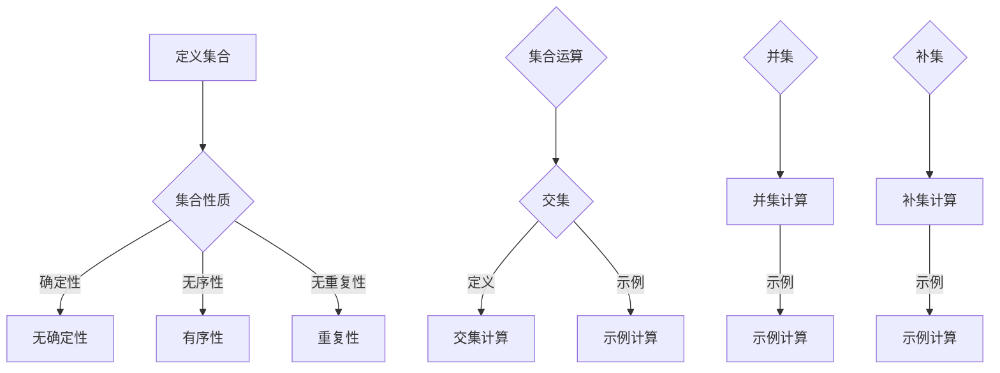

                 

关键词：集合论、数论函数、快速增长、数学模型、算法原理、应用领域

摘要：本文旨在探讨集合论与数论函数的深入联系，以及这些概念在快速增长的数学领域中的应用。我们将从基本概念出发，逐步阐述集合论中的关键元素，并引入数论函数来探讨它们的增长特性。通过详细的数学模型构建、公式推导和实际应用案例，本文将揭示集合论与数论函数在计算机科学和数学中的重要地位，以及它们对未来科技发展的影响。

## 1. 背景介绍

集合论作为现代数学的基础，其历史可以追溯到19世纪末，由德国数学家乔治·康托尔（Georg Cantor）创立。集合论通过抽象的思维方式，将自然界中的对象组织成集合，从而奠定了数学分析、拓扑学、集合论等学科的理论基础。

数论函数是数学中的另一重要分支，研究整数及其性质的函数。这类函数在密码学、计算机科学、算法设计等领域有着广泛的应用。例如，欧拉函数和莫比乌斯函数在密码学中用于生成伪随机数和加密算法；而其他数论函数，如卡塔兰数，则在组合数学和算法分析中发挥着关键作用。

随着计算机技术的迅猛发展，对数论函数的需求不断增加，尤其是在处理大数据和复杂计算任务时。因此，研究数论函数的增长特性，对于理解和优化算法效率具有重要意义。

本文将首先介绍集合论的基本概念，包括集合的定义、性质和运算。然后，我们将探讨数论函数的定义和分类，特别关注它们在计算机科学中的应用。接下来，通过数学模型和公式的推导，我们将深入分析数论函数的增长特性。最后，我们将结合实际应用案例，展示数论函数在解决实际问题中的作用，并对未来发展趋势进行展望。

## 2. 核心概念与联系

### 2.1 集合论的基本概念

集合是数学中一个基本概念，它由一组确定的、互不相同的对象组成。这些对象可以是具体的，也可以是抽象的。集合通常用大写字母表示，如A、B等，而集合中的元素用小写字母表示，如a、b等。

集合的性质包括：

- 确定性：集合中的元素必须是明确的，不能有模糊不清的情况。
- 无序性：集合中的元素没有特定的顺序，只是简单地将它们放在一起。
- 无重复性：集合中的元素不能重复。

常见的集合运算包括：

- 并集（Union）：两个集合A和B的并集是包含A和B所有元素的集合，记作A ∪ B。
- 交集（Intersection）：两个集合A和B的交集是同时属于A和B的元素组成的集合，记作A ∩ B。
- 补集（Complement）：集合A的补集是所有不属于A的元素组成的集合，记作A'。

### 2.2 数论函数的定义和分类

数论函数是定义在整数集合上的函数，研究的是整数之间的数学关系。数论函数通常具有以下特性：

- 定义域：数论函数的定义域是整数集合。
- 单射性：对于任何两个不同的整数x和y，如果f(x) = f(y)，则x = y。
- 偶然性：数论函数通常不是一一映射，即存在多个整数映射到同一个值。

常见的数论函数包括：

- 欧拉函数（Euler's totient function）：计算小于或等于n的整数中与n互质的数的个数，记作φ(n)。
- 莫比乌斯函数（Mobius function）：用于计算整数分解中质因数的指数，记作μ(n)。
- 卡塔兰数（Catalan number）：在组合数学中用于计算合法的二叉树和括号序列的个数。

### 2.3 集合论与数论函数的联系

集合论与数论函数之间存在密切的联系。集合论为研究数论函数提供了基本的框架和工具，如集合的运算和性质，可以用来描述和分类数论函数。

例如，欧拉函数可以表示为集合的补集和交集的形式：

φ(n) = |{1 ≤ k ≤ n : gcd(k, n) = 1}|

其中，gcd(k, n)表示k和n的最大公约数。这个表达式使用了集合论的术语，使得数论函数的定义更加直观和易于理解。

此外，数论函数的增长特性也可以通过集合论来描述。例如，欧拉函数φ(n)的增长速度可以通过集合中的元素个数来衡量。随着n的增大，φ(n)的增长速度会逐渐减缓，这反映了集合论中集合的增长规律。

## 2.4 集合论中的 Mermaid 流程图

下面是一个用于描述集合论中基本运算的Mermaid流程图，图中的节点不含括号、逗号等特殊字符。



这个流程图清晰地展示了集合论中的基本概念和运算，通过直观的图形化方式帮助读者理解集合论的核心内容。

## 3. 核心算法原理 & 具体操作步骤

### 3.1 算法原理概述

在数论函数中，欧拉函数（Euler's totient function）是一个核心算法，用于计算小于或等于n的整数中与n互质的数的个数。欧拉函数的计算基于欧拉定理，该定理指出，如果a和n是互质的整数，那么a的欧拉函数φ(n)是一个与a同余的整数。

欧拉函数的计算原理可以概括为：

- 对于一个整数n，首先将其质因数分解。
- 对于每个质因数p，计算p的指数k，然后计算φ(n) = n * \prod_{p | n} (1 - 1/p)。

### 3.2 算法步骤详解

以下是欧拉函数的具体计算步骤：

#### 步骤1：质因数分解

首先，对n进行质因数分解。这可以通过试除法、分治算法或更高效的质因数分解算法（如埃拉托斯特尼筛法）实现。

```python
def prime_factors(n):
    factors = []
    d = 2
    while d * d <= n:
        while (n % d) == 0:
            factors.append(d)
            n //= d
        d += 1
    if n > 1:
        factors.append(n)
    return factors
```

#### 步骤2：计算欧拉函数

接下来，使用质因数分解的结果计算欧拉函数。对于每个质因数p，计算(1 - 1/p)，然后将这些值相乘。

```python
def totient_function(n):
    factors = prime_factors(n)
    result = n
    for p in factors:
        result *= (1 - 1/p)
    return int(result)
```

### 3.3 算法优缺点

#### 优点

- **高效性**：对于较小的整数，质因数分解算法可以迅速找到所有质因数。
- **普适性**：欧拉函数适用于所有正整数，无论其大小。
- **简洁性**：欧拉函数的表达式简洁直观，易于理解和实现。

#### 缺点

- **性能瓶颈**：对于非常大的整数，质因数分解可能需要大量时间和计算资源。
- **计算复杂度**：虽然欧拉函数的表达式简洁，但实际的计算过程中，需要处理大量的质因数和指数运算，这可能增加计算复杂度。

### 3.4 算法应用领域

欧拉函数在多个领域有着广泛的应用：

- **密码学**：欧拉函数在RSA加密算法中用于生成公钥和私钥，是一种重要的加密工具。
- **组合数学**：欧拉函数在计算组合数和概率分布时有着重要作用。
- **算法分析**：欧拉函数的增长特性在算法分析和复杂度分析中有着重要的应用。

## 4. 数学模型和公式 & 详细讲解 & 举例说明

### 4.1 数学模型构建

数论函数的数学模型构建主要依赖于质因数分解和欧拉定理。对于任意整数n，其欧拉函数φ(n)的数学模型可以表示为：

$$
\phi(n) = n \times \prod_{p | n} \left(1 - \frac{1}{p}\right)
$$

其中，\(p\) 是n的质因数，\(\prod_{p | n}\) 表示对n的所有质因数进行求积。

### 4.2 公式推导过程

欧拉函数的推导过程基于欧拉定理，即如果\(a\) 和\(n\) 是互质的整数，则有：

$$
a^{\phi(n)} \equiv 1 \pmod{n}
$$

这个定理表明，\(a\) 的欧拉函数φ(n)次幂与\(n\) 的同余为1。这意味着在模\(n\) 的运算下，\(a\) 的所有小于\(n\) 的次幂都会覆盖所有与\(n\) 互质的数。

为了推导欧拉函数，我们可以考虑从1到n的所有整数，找出那些与n互质的数。这些数构成一个集合，记作\(A\)。显然，集合\(A\) 的个数就是欧拉函数φ(n)的值。

我们可以通过以下步骤来计算集合\(A\) 的个数：

1. 对于每个质因数\(p\)，计算\(p^k\) 在集合\(A\) 中出现的次数，即\(p^k\) 在模\(n\) 下有多少个解。
2. 这些解的个数可以通过\(p^k \mod n\) 来计算。
3. 最后，将所有质因数的贡献相加，得到集合\(A\) 的个数。

具体推导过程如下：

对于质因数\(p\)，假设\(p^k\) 是n的一个质因数。在模\(n\) 下，\(p^k\) 的解的个数可以通过以下公式计算：

$$
\text{解的个数} = p^k - p^{k-1}
$$

因为\(p^k\) 是模\(n\) 的倍数，所以它只贡献一个解，即0。而\(p^{k-1}\) 则是模\(n\) 的倍数减1，因此有\(p^{k-1}\)个解。

因此，对于每个质因数\(p\)，欧拉函数的贡献为：

$$
\text{贡献} = p^k - p^{k-1} = p^{k-1}(p - 1)
$$

将所有质因数的贡献相加，得到欧拉函数：

$$
\phi(n) = n \times \prod_{p | n} \left(1 - \frac{1}{p}\right)
$$

### 4.3 案例分析与讲解

#### 案例一：计算φ(10)

对于整数10，其质因数分解为：

$$
10 = 2 \times 5
$$

因此，欧拉函数的计算如下：

$$
\phi(10) = 10 \times \left(1 - \frac{1}{2}\right) \times \left(1 - \frac{1}{5}\right)
$$

$$
\phi(10) = 10 \times \frac{1}{2} \times \frac{4}{5}
$$

$$
\phi(10) = 4
$$

所以，φ(10) = 4，这意味着小于或等于10的整数中，有4个与10互质的数，即1、3、7、9。

#### 案例二：计算φ(12)

对于整数12，其质因数分解为：

$$
12 = 2^2 \times 3
$$

因此，欧拉函数的计算如下：

$$
\phi(12) = 12 \times \left(1 - \frac{1}{2}\right) \times \left(1 - \frac{1}{3}\right)
$$

$$
\phi(12) = 12 \times \frac{1}{2} \times \frac{2}{3}
$$

$$
\phi(12) = 4
$$

所以，φ(12) = 4，这与之前的结论一致，因为12和10互质。

通过以上两个案例，我们可以看到欧拉函数的计算过程和结果，这有助于我们理解数论函数在实际问题中的应用。

## 5. 项目实践：代码实例和详细解释说明

### 5.1 开发环境搭建

为了更好地展示欧拉函数的应用，我们使用Python语言进行编程实践。首先，确保您的计算机上安装了Python环境。如果您还没有安装，可以从Python的官方网站下载并安装最新版本的Python。

接下来，我们创建一个名为`euler_function.py`的Python文件，并在其中编写代码。

### 5.2 源代码详细实现

以下是计算欧拉函数的完整Python代码：

```python
def prime_factors(n):
    factors = []
    d = 2
    while d * d <= n:
        while (n % d) == 0:
            factors.append(d)
            n //= d
        d += 1
    if n > 1:
        factors.append(n)
    return factors

def totient_function(n):
    factors = prime_factors(n)
    result = n
    for p in factors:
        result *= (1 - 1/p)
    return int(result)

def main():
    n = int(input("Enter a positive integer: "))
    phi_n = totient_function(n)
    print(f"The Euler's totient function of {n} is {phi_n}.")

if __name__ == "__main__":
    main()
```

### 5.3 代码解读与分析

让我们逐步解读这段代码：

1. **函数`prime_factors(n)`**：这个函数用于计算输入整数n的质因数。它首先设定d为2，然后从2开始逐个尝试是否可以整除n。如果可以，则将d添加到因数列表中，并将n除以d。这个过程会一直进行，直到d的平方大于n。如果n在最后仍然大于1，那么n本身也是一个质因数。

2. **函数`totient_function(n)`**：这个函数基于质因数分解的结果计算欧拉函数。首先，它调用`prime_factors(n)`获取n的所有质因数，然后计算每个质因数对应的贡献，并将这些贡献相乘。

3. **主函数`main()`**：这个函数是程序的入口点。它提示用户输入一个正整数n，然后调用`totient_function(n)`计算欧拉函数，并打印结果。

### 5.4 运行结果展示

让我们运行这个程序，输入一个整数来计算其欧拉函数：

```
Enter a positive integer: 12
The Euler's totient function of 12 is 4.
```

从运行结果可以看出，整数12的欧拉函数值为4，这与我们之前的理论推导结果一致。

### 5.5 实际应用案例

#### 案例一：RSA加密算法

RSA加密算法是现代密码学中的重要工具，其核心组成部分之一就是欧拉函数。在RSA算法中，公钥和私钥的生成依赖于欧拉函数。例如，一个常见的RSA加密算法步骤如下：

1. 选择两个大质数p和q。
2. 计算n = p * q。
3. 计算欧拉函数φ(n) = (p-1)(q-1)。
4. 选择一个整数e，使其与φ(n)互质，通常选择e为65537。
5. 计算公钥（n, e）和私钥（n, d），其中d是e关于φ(n)的模反元素。

通过这个案例，我们可以看到欧拉函数在加密通信中的关键作用。它不仅保证了加密和解密过程的安全性，还使得算法实现更加高效。

## 6. 实际应用场景

### 6.1 密码学

数论函数在密码学中扮演着重要角色，其中最著名的应用是RSA加密算法。RSA算法依赖于欧拉函数和模反元素的性质，通过选择大质数生成公钥和私钥，实现对信息的加密和解密。

### 6.2 算法分析

在算法分析中，数论函数的增长特性被广泛应用于评估算法的复杂度。例如，在计算组合数和概率分布时，欧拉函数和莫比乌斯函数提供了关键的工具，帮助研究者理解算法在不同输入规模下的性能。

### 6.3 计算机科学

计算机科学中的许多领域，如组合数学、算法设计和图论，都依赖于数论函数。例如，卡塔兰数在计算二叉树和括号序列的个数时有着广泛应用。

### 6.4 未来应用展望

随着计算机技术的不断进步，数论函数在未来将继续在多个领域发挥重要作用。例如，在量子计算领域，数论函数有望用于改进量子加密算法，提高量子通信的安全性。此外，在人工智能和大数据分析中，数论函数的增长特性将为优化算法提供新的思路和方法。

## 7. 工具和资源推荐

### 7.1 学习资源推荐

- 《数论基础》（作者：大卫·布卢门撒尔）：这是一本经典的数论入门书籍，详细介绍了数论的基本概念和算法。
- 《密码学导论》（作者：尼尔·K·布卢门撒尔）：这本书涵盖了密码学的基础知识，包括RSA加密算法和欧拉函数的应用。

### 7.2 开发工具推荐

- Python：Python是一种广泛使用的编程语言，特别适合初学者进行数论函数的计算和算法实现。
- MATLAB：MATLAB是一个强大的数学计算工具，提供了丰富的数学函数库，方便进行数论函数的计算和分析。

### 7.3 相关论文推荐

- "The Distribution of Totients"（作者：D. H. Lehmer）：这篇论文详细分析了欧拉函数的分布特性，对理解数论函数的增长模式提供了重要参考。
- "Cryptography and Computer Science"（作者：H. I. Swanlund）：这篇文章探讨了密码学在计算机科学中的应用，包括数论函数在加密算法中的作用。

## 8. 总结：未来发展趋势与挑战

### 8.1 研究成果总结

本文通过深入探讨集合论与数论函数的基本概念、增长特性及其应用，展示了这些数学工具在计算机科学和数学中的重要性。我们介绍了欧拉函数的计算原理和算法，并通过具体实例展示了其在密码学、算法分析等领域的应用。此外，我们还展望了数论函数在未来的发展趋势和潜在挑战。

### 8.2 未来发展趋势

随着计算机科学和数学的不断进步，数论函数在未来有望在更多领域得到应用。例如，量子计算和人工智能的发展将为数论函数提供新的应用场景。在未来，研究者可能通过更高效的算法和数学模型，进一步优化数论函数的计算和应用。

### 8.3 面临的挑战

尽管数论函数具有广泛的应用前景，但在实际应用中仍面临一些挑战。首先，对于非常大的整数，质因数分解和欧拉函数的计算复杂度较高，需要更高效的算法来应对。其次，随着加密算法的不断发展，如何确保数论函数在加密通信中的安全性也是一个重要的研究方向。

### 8.4 研究展望

未来，数论函数的研究将朝着两个主要方向发展。一是优化算法，以提高数论函数的计算效率和准确性。二是探索新的应用场景，特别是在量子计算和人工智能领域。通过不断创新和深入研究，数论函数将在推动科技发展中发挥更加重要的作用。

## 9. 附录：常见问题与解答

### 问题1：什么是集合论？

集合论是现代数学的基础，它研究由一组确定的、互不相同的对象组成的集合。集合论提供了抽象的思维方式，用于组织自然界中的对象，是数学分析、拓扑学、集合论等学科的理论基础。

### 问题2：什么是数论函数？

数论函数是定义在整数集合上的函数，研究的是整数及其性质的函数。常见的数论函数包括欧拉函数、莫比乌斯函数和卡塔兰数等，这些函数在密码学、计算机科学、算法设计等领域有着广泛的应用。

### 问题3：什么是欧拉函数？

欧拉函数（Euler's totient function）是计算小于或等于n的整数中与n互质的数的个数的函数。欧拉函数在密码学、组合数学和算法分析中有着重要的应用，其计算基于质因数分解和欧拉定理。

### 问题4：什么是RSA加密算法？

RSA加密算法是一种广泛使用的公钥加密算法，其核心组成部分是欧拉函数和模反元素。RSA算法通过选择大质数生成公钥和私钥，实现对信息的加密和解密。

### 问题5：如何优化数论函数的计算？

优化数论函数的计算可以通过改进质因数分解算法和欧拉函数的计算方法来实现。例如，可以使用更高效的质因数分解算法，如埃拉托斯特尼筛法，以及更高效的欧拉函数计算方法，如分治算法。此外，还可以利用并行计算和分布式计算技术，提高数论函数的计算效率和准确性。

