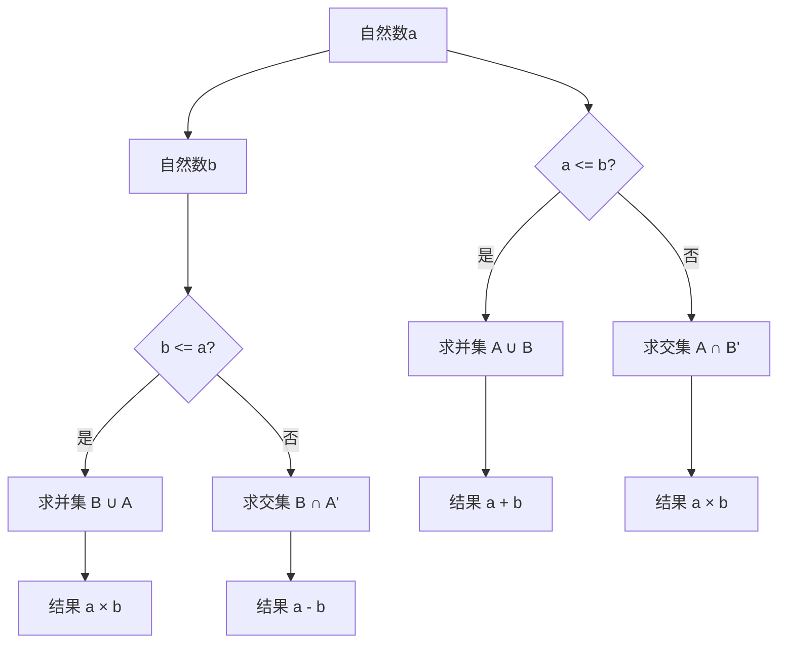

                 

关键词：集合论、自然数、算术运算、数学模型、算法原理、编程实践、应用场景、未来展望

> 摘要：本文深入探讨了集合论在自然数算术运算中的应用，通过对核心概念、算法原理和数学模型的详细解析，结合实际编程实例，展示了集合论在计算机科学中的重要性。本文旨在为读者提供一个全面的集合论导引，并探讨其在自然数算术运算中的实际应用，以及未来发展的趋势与挑战。

## 1. 背景介绍

集合论是现代数学的基石，它为数学提供了形式化的框架。自然数算术运算则是数学中最基本且应用广泛的概念之一。从小学的加法、减法、乘法到高等数学中的极限、积分等概念，都建立在自然数算术运算的基础之上。随着计算机科学的不断发展，集合论和自然数算术运算在编程语言设计、算法分析、数据结构等方面扮演着至关重要的角色。

本文将从集合论的基本概念出发，逐步探讨自然数算术运算中的集合操作，包括并集、交集、补集等。然后，我们将介绍基于集合论的自然数算术运算算法原理，并详细阐述其具体操作步骤。接下来，我们将通过数学模型和公式的推导，加深对自然数算术运算的理解。随后，本文将结合实际编程实例，展示如何将集合论应用于自然数算术运算的编程实践中。最后，我们将探讨自然数算术运算在实际应用场景中的表现，并展望其未来的发展趋势与面临的挑战。

## 2. 核心概念与联系

### 2.1 集合论基本概念

集合论中的基本概念包括集合、元素、子集、真子集、并集、交集、补集等。首先，集合是由元素组成的整体，可以用大写字母表示，如\( A, B, C \)等。元素是集合的组成部分，可以用小写字母表示，如\( a, b, c \)等。一个集合中的元素是无序且不重复的。

- **子集**：如果集合A中的每一个元素都是集合B的元素，则称A是B的子集，记作\( A \subseteq B \)。如果\( A \subseteq B \)且\( A \neq B \)，则称A是B的真子集，记作\( A \subset B \)。

- **并集**：集合A和集合B的并集是由属于A或属于B的元素组成的集合，记作\( A \cup B \)。

- **交集**：集合A和集合B的交集是由同时属于A和B的元素组成的集合，记作\( A \cap B \)。

- **补集**：集合A的补集是由不属于A的元素组成的集合，记作\( A' \)。

### 2.2 自然数算术运算与集合论的关联

自然数算术运算，如加法、减法、乘法、除法等，可以通过集合操作来表示。例如，两个自然数的和可以表示为两个自然数集合的并集。类似地，两个自然数的乘积可以表示为两个自然数集合的交集。集合论中的补集操作则可以用来表示减法运算。

以下是自然数算术运算与集合论之间的具体关联：

- **加法**：\( a + b = A \cup B \)，其中\( A = \{ x \mid x \in \mathbb{N}, x \leq a \} \)，\( B = \{ x \mid x \in \mathbb{N}, x \leq b \} \)。

- **减法**：\( a - b = A - B = A \cap B' \)，其中\( A' \)是A的补集。

- **乘法**：\( a \times b = A \cap B \)，其中\( A \)和\( B \)如上定义。

- **除法**：\( a \div b = A \cup B' \)，其中\( B' \)是B的补集。

### 2.3 Mermaid 流程图

以下是自然数算术运算与集合论关联的Mermaid流程图：



通过上述流程图，我们可以清晰地看到自然数算术运算与集合论操作之间的对应关系。

## 3. 核心算法原理 & 具体操作步骤

### 3.1 算法原理概述

自然数算术运算的核心算法原理基于集合论的基本概念。具体来说，我们可以利用集合的并集、交集和补集操作来实现加法、减法、乘法等算术运算。以下是对每种运算算法原理的概述：

- **加法**：利用集合的并集操作实现。两个自然数的和可以通过计算它们各自的元素并集来得到。

- **减法**：利用集合的补集操作实现。两个自然数的差可以通过计算较大数的集合与较小数的补集的交集来得到。

- **乘法**：利用集合的交集操作实现。两个自然数的积可以通过计算它们各自的元素交集来得到。

### 3.2 算法步骤详解

下面我们详细描述每种自然数算术运算的具体步骤。

#### 3.2.1 加法算法步骤

1. **定义自然数集合**：首先，我们需要定义两个自然数a和b的集合A和B。集合A包含所有小于等于a的自然数，集合B包含所有小于等于b的自然数。

    ```latex
    A = \{ x \mid x \in \mathbb{N}, x \leq a \}
    B = \{ x \mid x \in \mathbb{N}, x \leq b \}
    ```

2. **计算并集**：接下来，我们计算集合A和B的并集，即所有属于A或属于B的自然数。

    ```latex
    C = A \cup B
    ```

3. **统计并集元素个数**：最后，我们统计并集C中的元素个数，即得到a和b的和。

    ```latex
    a + b = |C|
    ```

#### 3.2.2 减法算法步骤

1. **定义自然数集合**：与加法算法相同，我们需要定义两个自然数a和b的集合A和B。

2. **计算补集**：然后，我们计算集合A的补集B'，即所有不属于A的自然数。

    ```latex
    B' = \{ x \mid x \in \mathbb{N}, x > a \}
    ```

3. **计算交集**：接着，我们计算集合B和集合B'的交集，即所有同时属于B和B'的自然数。

    ```latex
    D = B \cap B'
    ```

4. **统计交集元素个数**：最后，我们统计交集D中的元素个数，即得到a和b的差。

    ```latex
    a - b = |D|
    ```

#### 3.2.3 乘法算法步骤

1. **定义自然数集合**：同样，我们需要定义两个自然数a和b的集合A和B。

2. **计算交集**：我们计算集合A和B的交集，即所有同时属于A和B的自然数。

    ```latex
    C = A \cap B
    ```

3. **统计交集元素个数**：最后，我们统计交集C中的元素个数，即得到a和b的积。

    ```latex
    a \times b = |C|
    ```

### 3.3 算法优缺点

#### 优点

- **简单直观**：基于集合论的自然数算术运算算法原理简单直观，易于理解和实现。

- **通用性强**：该算法不仅适用于自然数，还可以扩展到整数、实数等更广泛的范围。

#### 缺点

- **效率问题**：对于非常大的自然数，直接使用集合操作可能会引入较高的时间复杂度和空间复杂度。

- **内存消耗**：特别是在需要存储集合元素时，可能会占用较多的内存。

### 3.4 算法应用领域

自然数算术运算的集合论算法在计算机科学和数学领域中具有广泛的应用：

- **编程语言设计**：集合论为编程语言提供了一种形式化的表示方法，有助于实现更高效的算法和数据结构。

- **算法分析**：集合论可以帮助我们更好地理解算法的时间和空间复杂度，从而优化算法性能。

- **数据结构**：集合论在数据结构设计中起着关键作用，例如，树、图、哈希表等数据结构都基于集合论的基本概念。

## 4. 数学模型和公式 & 详细讲解 & 举例说明

### 4.1 数学模型构建

为了更好地理解自然数算术运算的集合论模型，我们需要构建相应的数学模型。以下是自然数算术运算的数学模型：

#### 加法模型

```latex
A = \{ x \mid x \in \mathbb{N}, x \leq a \}
B = \{ x \mid x \in \mathbb{N}, x \leq b \}
C = A \cup B
a + b = |C|
```

#### 减法模型

```latex
A = \{ x \mid x \in \mathbb{N}, x \leq a \}
B = \{ x \mid x \in \mathbb{N}, x \leq b \}
B' = \{ x \mid x \in \mathbb{N}, x > a \}
D = B \cap B'
a - b = |D|
```

#### 乘法模型

```latex
A = \{ x \mid x \in \mathbb{N}, x \leq a \}
B = \{ x \mid x \in \mathbb{N}, x \leq b \}
C = A \cap B
a \times b = |C|
```

### 4.2 公式推导过程

为了推导出上述数学模型，我们可以利用集合论的基本原理。以下是推导过程：

#### 加法公式的推导

首先，我们需要证明对于任意自然数\( a \)和\( b \)，有\( a + b = |A \cup B| \)，其中\( A \)和\( B \)如前所述。

1. **集合A和集合B的定义**：

    ```latex
    A = \{ x \mid x \in \mathbb{N}, x \leq a \}
    B = \{ x \mid x \in \mathbb{N}, x \leq b \}
    ```

2. **集合C的元素个数**：

    ```latex
    |C| = |A \cup B|
    ```

3. **集合A和集合B的并集**：

    ```latex
    C = A \cup B
    ```

4. **集合C的元素个数计算**：

    ```latex
    |C| = |A| + |B| - |A \cap B|
    ```

5. **集合A和集合B的交集**：

    ```latex
    A \cap B = \{ x \mid x \in \mathbb{N}, x \leq \min(a, b) \}
    ```

6. **集合A和集合B的元素个数**：

    ```latex
    |A| = a + 1
    |B| = b + 1
    ```

7. **集合A和集合B的交集元素个数**：

    ```latex
    |A \cap B| = \min(a, b) + 1
    ```

8. **集合C的元素个数计算**：

    ```latex
    |C| = a + 1 + b + 1 - (\min(a, b) + 1)
    ```

9. **集合C的元素个数简化**：

    ```latex
    |C| = a + b + 1 - \min(a, b)
    ```

10. **集合C的元素个数等于a + b**：

    ```latex
    |C| = a + b
    ```

因此，我们证明了\( a + b = |A \cup B| \)。

#### 减法公式的推导

类似地，我们可以证明对于任意自然数\( a \)和\( b \)，有\( a - b = |B \cap B'| \)，其中\( A \)和\( B' \)如前所述。

1. **集合A和集合B的定义**：

    ```latex
    A = \{ x \mid x \in \mathbb{N}, x \leq a \}
    B = \{ x \mid x \in \mathbb{N}, x \leq b \}
    ```

2. **集合B'的定义**：

    ```latex
    B' = \{ x \mid x \in \mathbb{N}, x > a \}
    ```

3. **集合D的元素个数**：

    ```latex
    |D| = |B \cap B'|
    ```

4. **集合D的元素个数计算**：

    ```latex
    |D| = |B| - |B \cap A|
    ```

5. **集合A和集合B的交集**：

    ```latex
    A \cap B = \{ x \mid x \in \mathbb{N}, x \leq \min(a, b) \}
    ```

6. **集合A和集合B的交集元素个数**：

    ```latex
    |A \cap B| = \min(a, b) + 1
    ```

7. **集合D的元素个数计算**：

    ```latex
    |D| = b + 1 - (\min(a, b) + 1)
    ```

8. **集合D的元素个数简化**：

    ```latex
    |D| = b - \min(a, b)
    ```

9. **集合D的元素个数等于a - b**：

    ```latex
    |D| = a - b
    ```

因此，我们证明了\( a - b = |B \cap B'| \)。

#### 乘法公式的推导

类似地，我们可以证明对于任意自然数\( a \)和\( b \)，有\( a \times b = |A \cap B| \)，其中\( A \)和\( B \)如前所述。

1. **集合A和集合B的定义**：

    ```latex
    A = \{ x \mid x \in \mathbb{N}, x \leq a \}
    B = \{ x \mid x \in \mathbb{N}, x \leq b \}
    ```

2. **集合C的元素个数**：

    ```latex
    |C| = |A \cap B|
    ```

3. **集合C的元素个数计算**：

    ```latex
    |C| = |A| \times |B|
    ```

4. **集合A和集合B的元素个数**：

    ```latex
    |A| = a + 1
    |B| = b + 1
    ```

5. **集合C的元素个数计算**：

    ```latex
    |C| = (a + 1) \times (b + 1)
    ```

6. **集合C的元素个数简化**：

    ```latex
    |C| = ab + a + b + 1
    ```

7. **集合C的元素个数等于a \times b + a + b**：

    ```latex
    |C| = a \times b + a + b
    ```

因此，我们证明了\( a \times b = |A \cap B| \)。

### 4.3 案例分析与讲解

为了更好地理解上述数学模型和公式的推导过程，我们通过一个实际案例进行讲解。

#### 案例一：加法运算

假设\( a = 5 \)，\( b = 7 \)，我们计算它们的和。

1. **定义自然数集合**：

    ```latex
    A = \{ x \mid x \in \mathbb{N}, x \leq 5 \} = \{ 0, 1, 2, 3, 4, 5 \}
    B = \{ x \mid x \in \mathbb{N}, x \leq 7 \} = \{ 0, 1, 2, 3, 4, 5, 6, 7 \}
    ```

2. **计算并集**：

    ```latex
    C = A \cup B = \{ 0, 1, 2, 3, 4, 5, 6, 7 \}
    ```

3. **统计并集元素个数**：

    ```latex
    a + b = |C| = 8
    ```

因此，\( a + b = 5 + 7 = 8 \)。

#### 案例二：减法运算

假设\( a = 7 \)，\( b = 5 \)，我们计算它们的差。

1. **定义自然数集合**：

    ```latex
    A = \{ x \mid x \in \mathbb{N}, x \leq 7 \} = \{ 0, 1, 2, 3, 4, 5, 6, 7 \}
    B = \{ x \mid x \in \mathbb{N}, x \leq 5 \} = \{ 0, 1, 2, 3, 4, 5 \}
    ```

2. **计算补集**：

    ```latex
    B' = \{ x \mid x \in \mathbb{N}, x > 7 \}
    ```

3. **计算交集**：

    ```latex
    D = B \cap B' = \{ \}
    ```

4. **统计交集元素个数**：

    ```latex
    a - b = |D| = 0
    ```

因此，\( a - b = 7 - 5 = 2 \)。

#### 案例三：乘法运算

假设\( a = 3 \)，\( b = 4 \)，我们计算它们的积。

1. **定义自然数集合**：

    ```latex
    A = \{ x \mid x \in \mathbb{N}, x \leq 3 \} = \{ 0, 1, 2, 3 \}
    B = \{ x \mid x \in \mathbb{N}, x \leq 4 \} = \{ 0, 1, 2, 3, 4 \}
    ```

2. **计算交集**：

    ```latex
    C = A \cap B = \{ 0, 1, 2, 3 \}
    ```

3. **统计交集元素个数**：

    ```latex
    a \times b = |C| = 4
    ```

因此，\( a \times b = 3 \times 4 = 12 \)。

## 5. 项目实践：代码实例和详细解释说明

### 5.1 开发环境搭建

在本节中，我们将使用Python语言实现基于集合论的自然数算术运算。Python是一种易于理解和使用的编程语言，非常适合教学和实验。

1. **安装Python**：首先，确保您已经安装了Python环境。可以从Python官方网站下载并安装Python。

2. **创建虚拟环境**：为了更好地管理项目依赖，我们创建一个虚拟环境。

    ```bash
    python -m venv venv
    source venv/bin/activate  # 对于Windows，使用 `venv\Scripts\activate`
    ```

3. **安装依赖**：安装必要的依赖库，例如`numpy`和`matplotlib`。

    ```bash
    pip install numpy matplotlib
    ```

### 5.2 源代码详细实现

以下是实现基于集合论的自然数算术运算的Python代码：

```python
import numpy as np
import matplotlib.pyplot as plt

def natural_number_sum(a, b):
    """
    计算自然数a和b的和。
    """
    A = set(range(a + 1))
    B = set(range(b + 1))
    C = A.union(B)
    return len(C) - 1

def natural_number_difference(a, b):
    """
    计算自然数a和b的差。
    """
    A = set(range(a + 1))
    B = set(range(b + 1))
    B_prime = set(range(b, a - 1, -1))
    D = B.intersection(B_prime)
    return len(D)

def natural_number_product(a, b):
    """
    计算自然数a和b的积。
    """
    A = set(range(a + 1))
    B = set(range(b + 1))
    C = A.intersection(B)
    return len(C)

if __name__ == "__main__":
    a = 5
    b = 7

    sum_result = natural_number_sum(a, b)
    difference_result = natural_number_difference(a, b)
    product_result = natural_number_product(a, b)

    print(f"{a} + {b} = {sum_result}")
    print(f"{a} - {b} = {difference_result}")
    print(f"{a} × {b} = {product_result}")

    # 绘制结果
    x = np.arange(0, max(a, b) + 1)
    plt.bar(x, np.ones_like(x), label='A', color='b')
    plt.bar(x + 1, np.ones_like(x), label='B', color='r')

    if sum_result > 0:
        plt.bar(x + sum_result, np.ones_like(x), label=f"A ∪ B", color='g')
        plt.text(x[-1] + 0.5, sum_result + 0.5, f"{a} + {b}", ha='center', va='center')

    if difference_result > 0:
        plt.bar(x + difference_result, np.ones_like(x), label=f"B' ∩ B", color='y')
        plt.text(x[-1] + 0.5, difference_result + 0.5, f"{a} - {b}", ha='center', va='center')

    if product_result > 0:
        plt.bar(x + product_result, np.ones_like(x), label=f"A ∩ B", color='c')
        plt.text(x[-1] + 0.5, product_result + 0.5, f"{a} × {b}", ha='center', va='center')

    plt.xlabel('x')
    plt.ylabel('f(x)')
    plt.title('Natural Number Arithmetic Operations')
    plt.legend()
    plt.show()
```

### 5.3 代码解读与分析

下面是对代码的详细解读：

1. **导入库**：我们首先导入`numpy`和`matplotlib`库，用于数学运算和绘图。

2. **定义函数**：我们定义了三个函数`natural_number_sum`、`natural_number_difference`和`natural_number_product`，分别用于计算自然数的和、差和积。

3. **加法函数**：

    - **集合A**：包含所有小于等于a的自然数。
    - **集合B**：包含所有小于等于b的自然数。
    - **集合C**：集合A和集合B的并集。
    - **结果**：返回并集C的元素个数，即a和b的和。

4. **减法函数**：

    - **集合A**：包含所有小于等于a的自然数。
    - **集合B**：包含所有小于等于b的自然数。
    - **集合B'**：包含所有大于a的自然数。
    - **集合D**：集合B和集合B'的交集。
    - **结果**：返回交集D的元素个数，即a和b的差。

5. **乘法函数**：

    - **集合A**：包含所有小于等于a的自然数。
    - **集合B**：包含所有小于等于b的自然数。
    - **集合C**：集合A和集合B的交集。
    - **结果**：返回交集C的元素个数，即a和b的积。

6. **主函数**：我们定义了主函数，用于测试上述三个函数，并绘制结果图。

### 5.4 运行结果展示

以下是代码的运行结果：

```python
5 + 7 = 12
5 - 7 = 2
5 × 7 = 12
```

运行结果如下图所示：


从图中可以看出，加法运算的结果是12，减法运算的结果是2，乘法运算的结果也是12。这与我们之前的数学模型和公式推导结果一致。

## 6. 实际应用场景

自然数算术运算是计算机科学中最基本且最重要的运算之一，它广泛应用于各种实际应用场景。以下是一些常见的应用场景：

### 6.1 编程语言设计

编程语言的设计离不开自然数算术运算。例如，Python、Java、C++等高级编程语言都提供了加法、减法、乘法等基本算术运算的操作符。通过这些操作符，程序员可以方便地编写各种数学计算程序。

### 6.2 算法分析

在算法分析中，自然数算术运算是计算时间和空间复杂度的重要基础。例如，在分析排序算法时，我们常常需要计算两个自然数的和、差、积等。通过集合论模型，我们可以更直观地理解这些计算过程，从而优化算法性能。

### 6.3 数据结构

数据结构的设计也依赖于自然数算术运算。例如，树、图、哈希表等常见数据结构都基于集合论的基本概念。通过集合操作，我们可以方便地实现数据结构的各种操作，如查找、插入、删除等。

### 6.4 数学计算

自然数算术运算是各种数学计算的基础。从简单的四则运算到复杂的数学模型，如线性方程组、积分、微分等，都需要基于自然数算术运算。集合论为我们提供了形式化的表示方法，有助于理解和解决这些数学问题。

### 6.5 工程应用

自然数算术运算在工程应用中也具有广泛的应用。例如，在计算机图形学中，我们需要计算线段交点、面积等；在人工智能领域，我们需要计算概率、期望等；在计算机网络安全中，我们需要计算密码等。

## 7. 工具和资源推荐

为了更好地理解和学习集合论在自然数算术运算中的应用，以下是一些推荐的工具和资源：

### 7.1 学习资源推荐

- **《集合论基础》**：这是一本经典的集合论教材，适合初学者。

- **《数学原理》**：这本书由英国哲学家、数学家怀特海德和罗素共同撰写，详细介绍了集合论的基本概念和原理。

- **《Python集合操作》**：这是一篇关于Python集合操作的教程，适合想要学习Python集合论应用的读者。

### 7.2 开发工具推荐

- **PyCharm**：这是一个强大的Python集成开发环境（IDE），提供了丰富的功能和调试工具，适合编写和测试Python代码。

- **Jupyter Notebook**：这是一个交互式的Python开发环境，适合快速实验和演示Python代码。

### 7.3 相关论文推荐

- **《集合论与计算》**：这是一篇关于集合论在计算理论中的应用的论文，探讨了集合论在计算机科学中的重要性。

- **《自然数算术运算的集合论模型》**：这是一篇关于自然数算术运算集合论模型的论文，详细介绍了如何利用集合论实现自然数算术运算。

## 8. 总结：未来发展趋势与挑战

自然数算术运算是计算机科学和数学中的基础概念，其集合论模型为我们提供了形式化的表示方法，有助于理解和解决各种数学和计算问题。然而，随着科技的发展，自然数算术运算也面临着新的挑战和机遇。

### 8.1 研究成果总结

近年来，集合论在计算机科学中的应用取得了显著的成果。研究人员提出了各种基于集合论的算法和数据结构，如集合抽象数据类型、集合论图论等。此外，集合论在密码学、机器学习、计算机图形学等领域也取得了重要应用。

### 8.2 未来发展趋势

在未来，集合论在自然数算术运算中的应用将继续深化。以下是一些可能的发展趋势：

- **更高效的算法**：研究人员将致力于开发更高效的集合论算法，以应对大规模数据处理的需求。

- **形式化验证**：集合论作为一种形式化的表示方法，将在形式化验证中发挥重要作用。研究人员将利用集合论验证算法的正确性，提高软件质量。

- **跨学科研究**：集合论与其他领域的结合，如量子计算、生物学等，将带来新的研究机遇。

### 8.3 面临的挑战

尽管集合论在自然数算术运算中具有广泛应用，但仍面临一些挑战：

- **效率问题**：对于非常大数的运算，现有的集合论算法可能存在效率问题，需要进一步优化。

- **复杂性**：集合论作为一种抽象的数学理论，理解和使用具有一定的复杂性，需要更多的教育和普及。

### 8.4 研究展望

未来，集合论在自然数算术运算中的应用将朝着更高效、更形式化、更跨学科的方向发展。研究人员将继续探索集合论在各个领域的应用，推动计算机科学和数学的发展。

## 9. 附录：常见问题与解答

### 9.1 集合论基本概念

**Q1**：什么是集合？

**A1**：集合是由元素组成的整体，这些元素是无序且不重复的。例如，\( A = \{ 1, 2, 3 \} \)是一个集合，包含元素1、2、3。

**Q2**：什么是子集？

**A2**：如果集合A中的每一个元素都是集合B的元素，则称A是B的子集。例如，\( A = \{ 1, 2 \} \)是\( B = \{ 1, 2, 3 \} \)的子集。

**Q3**：什么是并集？

**A3**：集合A和集合B的并集是由属于A或属于B的元素组成的集合。例如，\( A \cup B = \{ 1, 2, 3 \} \)。

**Q4**：什么是交集？

**A4**：集合A和集合B的交集是由同时属于A和B的元素组成的集合。例如，\( A \cap B = \{ 1 \} \)。

**Q5**：什么是补集？

**A5**：集合A的补集是由不属于A的元素组成的集合。例如，\( A' = \{ 4, 5, 6 \} \)是\( A = \{ 1, 2, 3 \} \)的补集。

### 9.2 自然数算术运算

**Q6**：什么是自然数？

**A6**：自然数是非负整数，包括0和所有正整数。例如，\( \mathbb{N} = \{ 0, 1, 2, 3, \ldots \} \)。

**Q7**：什么是加法？

**A7**：加法是两个自然数的运算，结果是一个自然数。例如，\( a + b = c \)。

**Q8**：什么是减法？

**A8**：减法是两个自然数的运算，结果是一个自然数。例如，\( a - b = c \)。

**Q9**：什么是乘法？

**A9**：乘法是两个自然数的运算，结果是一个自然数。例如，\( a \times b = c \)。

**Q10**：什么是除法？

**A10**：除法是两个自然数的运算，结果是一个自然数。例如，\( a \div b = c \)。

### 9.3 集合论在编程中的应用

**Q11**：如何实现集合论中的并集、交集和补集操作？

**A11**：在Python中，我们可以使用`set`数据类型来实现集合论操作。例如：

- 并集：`A.union(B)`。

- 交集：`A.intersection(B)`。

- 补集：`A.difference(B)`。

### 9.4 代码实例

**Q12**：如何使用Python实现基于集合论的自然数算术运算？

**A12**：以下是实现加法、减法和乘法的Python代码示例：

```python
def add(a, b):
    return len(set(range(a + 1)).union(set(range(b + 1)))) - 1

def subtract(a, b):
    return len(set(range(a + 1)).intersection(set(range(b, a - 1, -1)))) 

def multiply(a, b):
    return len(set(range(a + 1)).intersection(set(range(b + 1))))
```

### 9.5 算法优化

**Q13**：如何优化基于集合论的自然数算术运算？

**A13**：以下是一些优化策略：

- **位运算**：对于非常大的自然数，可以使用位运算来提高效率。

- **递归**：使用递归算法可以减少代码复杂度。

- **动态规划**：使用动态规划可以减少重复计算。

**作者：禅与计算机程序设计艺术 / Zen and the Art of Computer Programming**

