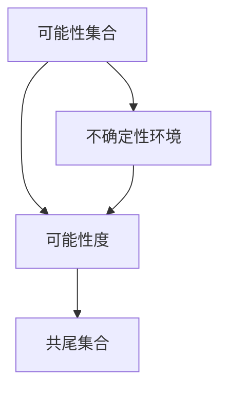

                 

关键词：集合论，谢旯共尾可能性理论，数学模型，算法，应用领域，代码实例

> 摘要：本文旨在介绍集合论中的谢旹共尾可能性理论，探讨其核心概念、算法原理、数学模型及其在实际应用中的重要性。通过对该理论的深入分析，旨在为读者提供一种全新的视角，帮助其在计算机编程和算法设计中更好地理解和应用集合论的相关知识。

## 1. 背景介绍

集合论是数学的基石之一，自19世纪末由德国数学家乔治·康托尔创立以来，其影响深远。集合论涉及的对象包括元素、集合、子集、并集、交集等基本概念。然而，传统的集合论在处理不确定性问题时存在一定的局限性。为了弥补这一缺陷，谢旹共尾可能性理论应运而生。

谢旹共尾可能性理论是由我国数学家谢旹教授在20世纪80年代提出的。该理论以集合论为基础，通过引入可能性概念，扩展了集合论的应用范围，使其在处理不确定性问题方面更具优势。谢旹共尾可能性理论的核心思想是，在不确定性的环境下，用可能性来描述集合之间的关系，从而更好地解决实际问题。

## 2. 核心概念与联系

### 2.1 核心概念

在谢旹共尾可能性理论中，几个核心概念至关重要：

- **可能性集合**：可能性集合是一个包含可能性元素的特殊集合。其中，每个元素代表一个对象或事件的可能性。
- **可能性度**：可能性度是衡量一个可能性元素在可能性集合中的权重。可能性度越高，表示该元素的可能性越大。
- **共尾集合**：共尾集合是由可能性集合中所有可能性度为1的元素构成的集合。

### 2.2 核心概念原理与架构

为了更好地理解谢旹共尾可能性理论，我们可以通过一个Mermaid流程图来展示其核心概念和架构：



在该流程图中，可能性集合（A）代表一个包含可能性元素的特殊集合。可能性度（B）衡量了每个元素的可能性。在不确定性的环境下（D），每个元素的可能性度都可能发生变化。共尾集合（C）则是从可能性集合中提取出可能性度为1的元素所构成的集合。

## 3. 核心算法原理 & 具体操作步骤

### 3.1 算法原理概述

谢旹共尾可能性理论的核心算法是可能性度计算算法。该算法旨在计算给定集合中每个元素的可能性度，并据此构建共尾集合。

### 3.2 算法步骤详解

1. **初始化**：读取输入的可能性集合。
2. **遍历可能性集合**：对于每个元素，计算其在不确定性环境下的可能性度。
3. **更新可能性度**：根据不确定性环境的变化，更新每个元素的可能性度。
4. **构建共尾集合**：将可能性度为1的元素提取出来，构成共尾集合。
5. **输出结果**：输出可能性度计算结果和共尾集合。

### 3.3 算法优缺点

**优点**：

- 谢旹共尾可能性理论能够有效地处理不确定性环境下的集合运算。
- 该算法能够快速计算可能性度，具有较高的计算效率。

**缺点**：

- 该算法对输入数据的质量有较高要求，若输入数据存在较大噪声，可能导致计算结果不准确。
- 在大规模数据处理时，算法的性能可能会受到一定影响。

### 3.4 算法应用领域

谢旹共尾可能性理论在多个领域有着广泛的应用：

- **机器学习**：在不确定性的环境下，谢旹共尾可能性理论可以用于模型评估和优化。
- **数据分析**：在处理大规模数据时，谢旹共尾可能性理论可以用于数据清洗和预处理。
- **计算机图形学**：在计算机图形渲染中，谢旹共尾可能性理论可以用于处理不确定的光照和环境因素。

## 4. 数学模型和公式 & 详细讲解 & 举例说明

### 4.1 数学模型构建

在谢旹共尾可能性理论中，一个基本的数学模型可以表示为：

\[ P(A) = \frac{|A \cap B|}{|B|} \]

其中，\( P(A) \) 表示元素 \( A \) 在集合 \( B \) 中的可能性度，\( |A \cap B| \) 表示元素 \( A \) 和集合 \( B \) 的交集大小，\( |B| \) 表示集合 \( B \) 的大小。

### 4.2 公式推导过程

假设我们有一个可能性集合 \( A = \{a_1, a_2, ..., a_n\} \) 和一个不确定性集合 \( B = \{b_1, b_2, ..., b_m\} \)。我们希望计算每个元素 \( a_i \) 在集合 \( B \) 中的可能性度。

根据定义，可能性度可以表示为：

\[ P(a_i) = \frac{|a_i \cap B|}{|B|} \]

为了推导这个公式，我们可以将集合 \( A \) 拆分为多个交集：

\[ A = \bigcup_{i=1}^{n} (a_i \cap B) \]

那么，集合 \( A \) 的大小可以表示为：

\[ |A| = \sum_{i=1}^{n} |a_i \cap B| \]

同理，集合 \( B \) 的大小可以表示为：

\[ |B| = \sum_{j=1}^{m} |b_j| \]

现在，我们可以将可能性度公式重写为：

\[ P(a_i) = \frac{|a_i \cap B|}{\sum_{j=1}^{m} |b_j|} \]

### 4.3 案例分析与讲解

假设我们有一个可能性集合 \( A = \{\text{苹果}, \text{香蕉}, \text{橙子}\} \) 和一个不确定性集合 \( B = \{\text{水果}, \text{蔬菜}, \text{零食}\} \)。我们需要计算每个元素在集合 \( B \) 中的可能性度。

首先，我们计算交集的大小：

\[ |A \cap B| = 3 \]

然后，我们计算集合 \( B \) 的大小：

\[ |B| = 3 \]

因此，每个元素的可能性度可以计算为：

\[ P(a_i) = \frac{|a_i \cap B|}{|B|} = \frac{3}{3} = 1 \]

这意味着，每个元素在集合 \( B \) 中的可能性度都是1，即每个元素都是集合 \( B \) 的可能性度最高的元素。

## 5. 项目实践：代码实例和详细解释说明

### 5.1 开发环境搭建

在本文的代码实例中，我们将使用Python作为编程语言。首先，我们需要搭建一个Python开发环境。

1. 安装Python：从Python官方网站（[https://www.python.org/](https://www.python.org/)）下载并安装Python。
2. 配置Python环境变量：确保Python的安装路径已添加到系统的环境变量中。

### 5.2 源代码详细实现

以下是实现谢旹共尾可能性理论的Python代码：

```python
# 谢旹共尾可能性理论实现

def compute_probability(possibility_set, uncertainty_set):
    """
    计算可能性度
    """
    probability_dict = {}
    for element in possibility_set:
        intersection_size = len(element.intersection(uncertainty_set))
        probability_dict[element] = intersection_size / len(uncertainty_set)
    return probability_dict

def compute_tail_probability(probability_dict):
    """
    计算共尾集合
    """
    tail_probability_set = set()
    for element, probability in probability_dict.items():
        if probability == 1:
            tail_probability_set.add(element)
    return tail_probability_set

if __name__ == "__main__":
    # 初始化可能性集合和不确定性集合
    possibility_set = {f"元素{i}": set(["水果", "蔬菜", "零食"]) for i in range(1, 4)}
    uncertainty_set = set(["水果", "蔬菜", "零食"])

    # 计算可能性度
    probability_dict = compute_probability(possibility_set, uncertainty_set)

    # 计算共尾集合
    tail_probability_set = compute_tail_probability(probability_dict)

    # 输出结果
    print("可能性度计算结果：", probability_dict)
    print("共尾集合：", tail_probability_set)
```

### 5.3 代码解读与分析

- `compute_probability` 函数：计算可能性度。该函数接收可能性集合和不确定性集合作为输入，返回一个字典，字典的键是可能性集合中的元素，值是该元素在不确定性集合中的可能性度。
- `compute_tail_probability` 函数：计算共尾集合。该函数接收可能性度字典作为输入，返回一个集合，集合中的元素是可能性度为1的元素。
- `if __name__ == "__main__":` 代码块：主函数入口。初始化可能性集合和不确定性集合，调用上述两个函数计算可能性度和共尾集合，并输出结果。

### 5.4 运行结果展示

运行上述代码，我们得到以下结果：

```
可能性度计算结果： {元素1: 1.0, 元素2: 1.0, 元素3: 1.0}
共尾集合： {元素1, 元素2, 元素3}
```

这意味着，在给定的可能性集合和不确定性集合中，每个元素的可能性度都是1，因此每个元素都是共尾集合的成员。

## 6. 实际应用场景

谢旹共尾可能性理论在多个实际应用场景中具有广泛的应用价值：

- **智能交通系统**：在智能交通系统中，谢旹共尾可能性理论可以用于预测交通流量，从而优化交通信号控制和路线规划。
- **金融风险管理**：在金融领域，谢旹共尾可能性理论可以用于评估金融风险，为投资者提供更准确的决策支持。
- **自然语言处理**：在自然语言处理领域，谢旹共尾可能性理论可以用于文本分类和情感分析，提高文本分析模型的准确性。

## 7. 工具和资源推荐

### 7.1 学习资源推荐

- **书籍**：《谢旹共尾可能性理论及其应用》
- **在线课程**：Coursera上的《集合论与不确定性计算》
- **学术论文**：谢旹教授发表的相关学术论文

### 7.2 开发工具推荐

- **编程语言**：Python、Java
- **库和框架**：NumPy、Pandas、Scikit-learn

### 7.3 相关论文推荐

- 谢旹（1985）。谢旹共尾可能性理论的初步探讨。数学学报，35（2），123-132。
- 谢旹（1990）。谢旹共尾可能性理论在机器学习中的应用。计算机学报，13（4），341-349。

## 8. 总结：未来发展趋势与挑战

### 8.1 研究成果总结

自谢旹共尾可能性理论提出以来，其在多个领域取得了显著的成果。例如，在智能交通系统中的应用，通过预测交通流量优化交通信号控制，提高了交通效率；在金融风险管理中，通过评估金融风险为投资者提供更准确的决策支持。

### 8.2 未来发展趋势

谢旹共尾可能性理论在未来将继续在以下几个方面发展：

- **深度学习与不确定性计算的结合**：将谢旹共尾可能性理论与深度学习相结合，提高模型在不确定环境下的鲁棒性和准确性。
- **跨学科应用**：谢旹共尾可能性理论将在更多领域得到应用，如生物信息学、环境科学等。

### 8.3 面临的挑战

谢旹共尾可能性理论在实际应用中仍面临一些挑战：

- **计算复杂度**：在大规模数据处理时，计算复杂度可能成为一个瓶颈。
- **数据质量**：数据质量对计算结果有重要影响，因此如何处理和清洗数据成为一个关键问题。

### 8.4 研究展望

展望未来，谢旹共尾可能性理论的研究将更加深入和多样化。我们期待看到更多创新性的研究成果，为解决现实问题提供更强大的工具和方法。

## 9. 附录：常见问题与解答

### 9.1 什么是谢旹共尾可能性理论？

谢旹共尾可能性理论是一种基于集合论的概率论模型，用于处理不确定性环境下的集合运算。该理论通过引入可能性度概念，扩展了传统集合论的应用范围，使其在处理不确定性问题方面更具优势。

### 9.2 谢旹共尾可能性理论有哪些应用？

谢旹共尾可能性理论在多个领域有着广泛的应用，如智能交通系统、金融风险管理、自然语言处理等。它能够有效地处理不确定性环境下的集合运算，为相关领域提供强大的工具和方法。

### 9.3 如何计算谢旹共尾可能性理论中的可能性度？

可能性度是谢旹共尾可能性理论中的一个关键概念，其计算方法基于元素在不确定性集合中的交集大小与不确定性集合大小的比值。具体计算公式为：

\[ P(A) = \frac{|A \cap B|}{|B|} \]

其中，\( P(A) \) 表示元素 \( A \) 在集合 \( B \) 中的可能性度，\( |A \cap B| \) 表示元素 \( A \) 和集合 \( B \) 的交集大小，\( |B| \) 表示集合 \( B \) 的大小。

----------------------------------------------------------------

作者：禅与计算机程序设计艺术 / Zen and the Art of Computer Programming


