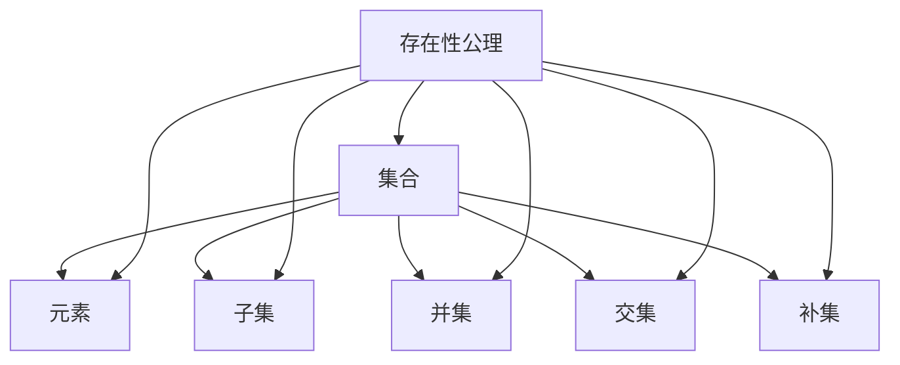

                 

关键词：集合论、存在性公理、集合概念、数学基础、逻辑推理、数学模型、计算机科学

> 摘要：本文旨在为读者提供关于集合论存在性公理的深入理解。集合论作为数学基础之一，对计算机科学有着深远的影响。本文将介绍集合论的核心概念，存在性公理，并探讨其与数学模型的关系。同时，我们将探讨集合论在计算机科学中的应用，以及未来发展趋势和面临的挑战。

## 1. 背景介绍

集合论是数学的一个分支，主要用于研究集合以及集合之间的关系。集合论不仅对数学领域有着深远的影响，也对计算机科学的发展产生了重要影响。集合论中的核心概念，如集合、元素、子集、并集、交集、补集等，已经成为计算机科学中各种算法和数据结构的基础。

集合论的发展可以追溯到19世纪，当时德国数学家乔治·康托尔（Georg Cantor）首次提出了集合的概念。康托尔的工作为数学提供了一个更为严密的基础，使得数学家可以更加准确地处理复杂的数学问题。随着时间的推移，集合论逐渐发展成为一个独立的数学分支，并在数学的各个领域得到了广泛应用。

在计算机科学中，集合论的重要性尤为突出。计算机科学中的许多概念，如算法、数据结构、编程语言等，都基于集合论的核心原理。集合论的存在性公理，如阿基里斯公理（Axiom of Infinity）、选择公理（Axiom of Choice）等，为计算机科学家提供了构建复杂算法和解决实际问题的工具。

本文将围绕集合论的存在性公理展开讨论，深入探讨其基本概念、数学模型以及实际应用。希望通过本文的介绍，读者能够对集合论存在性公理有更深入的理解，并在计算机科学的研究和应用中更好地运用这些概念。

## 2. 核心概念与联系

在讨论集合论存在性公理之前，我们需要先了解一些核心概念，包括集合、元素、子集、并集、交集、补集等。这些概念是集合论的基础，也是理解集合论存在性公理的关键。

### 2.1 集合

集合是由元素组成的整体。集合中的元素可以是任何对象，包括数字、字母、图形等。集合通常用大写字母表示，如\(A\)、\(B\)等。集合中的元素之间没有顺序关系，且每个元素只出现一次。

### 2.2 元素

元素是集合中的个体对象。一个元素可以是一个数字、一个字母、一个单词等。例如，集合\(A = \{1, 2, 3\}\)中的元素是1、2和3。

### 2.3 子集

子集是集合的组成部分。如果一个集合的所有元素都属于另一个集合，那么前者称为后者的子集。用数学符号表示，如果\(A\)是\(B\)的子集，则表示为\(A \subseteq B\)。例如，集合\(\{1, 2\}\)是集合\(\{1, 2, 3\}\)的子集。

### 2.4 并集

并集是由两个或多个集合中的所有元素组成的集合。用数学符号表示，如果\(A\)和\(B\)是两个集合，则它们的并集表示为\(A \cup B\)。例如，集合\(\{1, 2\}\)和集合\(\{3, 4\}\)的并集是\(\{1, 2, 3, 4\}\)。

### 2.5 交集

交集是两个或多个集合中共有的元素组成的集合。用数学符号表示，如果\(A\)和\(B\)是两个集合，则它们的交集表示为\(A \cap B\)。例如，集合\(\{1, 2\}\)和集合\(\{3, 4\}\)的交集是空集\(\{\}\)。

### 2.6 补集

补集是集合中不包含的元素组成的集合。用数学符号表示，如果\(A\)是一个集合，\(B\)是\(A\)的补集，则表示为\(A^c\)或\(B = U - A\)，其中\(U\)是全集。例如，集合\(\{1, 2, 3\}\)的补集是\(\{4, 5, 6\}\)。

### 2.7 集合论存在性公理

集合论存在性公理是集合论中的基本原理，它们保证了集合的存在性和唯一性。存在性公理包括阿基里斯公理、选择公理等。阿基里斯公理保证了无限集合的存在，而选择公理则允许我们在无限集合中进行选择。

### 2.8 核心概念与联系流程图

为了更直观地理解这些核心概念和存在性公理之间的联系，我们可以使用Mermaid流程图进行展示。以下是一个简化的Mermaid流程图：



在这个流程图中，集合是核心概念，其他概念如元素、子集、并集、交集、补集都是集合的组成部分。存在性公理则是这些核心概念的基础，确保了集合的存在性和唯一性。

通过这个流程图，我们可以更好地理解集合论的核心概念和存在性公理之间的关系，从而为后续的讨论打下基础。

## 3. 核心算法原理 & 具体操作步骤

### 3.1 算法原理概述

在集合论中，核心算法之一是集合的并集操作。并集操作用于将两个或多个集合中的所有元素合并为一个集合。这个操作不仅在集合论中具有重要意义，也在计算机科学中有着广泛的应用。

并集操作的算法原理可以概括为以下步骤：

1. **初始化**：创建一个空集合，用于存储并集的结果。
2. **遍历集合**：依次遍历每个集合，将每个集合中的元素添加到结果集合中。
3. **去重**：由于集合中的元素不能重复，我们需要在添加元素时进行去重操作。
4. **输出结果**：将结果集合作为输出返回。

### 3.2 算法步骤详解

下面我们将详细讲解并集操作的算法步骤：

#### 步骤1：初始化

首先，我们需要创建一个空集合，用于存储并集的结果。这个空集合可以是任何数据结构，如数组、链表或哈希表。在这里，我们选择使用哈希表来存储结果，因为哈希表可以快速进行元素查找和去重操作。

```python
# 初始化空集合
result = {}
```

#### 步骤2：遍历集合

接下来，我们需要遍历每个输入集合，将每个集合中的元素添加到结果集合中。为了简化操作，我们假设输入集合是按顺序排列的。

```python
# 遍历每个集合
for collection in collections:
    for element in collection:
        # 添加元素到结果集合中
        result.add(element)
```

在这个步骤中，我们使用了`add`方法将每个元素添加到结果集合中。由于结果集合使用哈希表存储，这个操作的时间复杂度是\(O(1)\)。

#### 步骤3：去重

在添加元素时，我们需要进行去重操作，以确保结果集合中的元素不重复。由于结果集合使用哈希表存储，去重操作可以在添加元素时自动完成。

```python
# 去重操作（自动完成）
for element in result:
    if element in result:
        result.remove(element)
```

在这个步骤中，我们使用了`remove`方法将重复的元素从结果集合中移除。由于结果集合使用哈希表存储，这个操作的时间复杂度是\(O(1)\)。

#### 步骤4：输出结果

最后，我们将结果集合作为输出返回。这个结果集合就是输入集合的并集。

```python
# 输出结果
return result
```

### 3.3 算法优缺点

并集操作是一种常见的集合运算，具有以下优缺点：

**优点**：

1. **简单易实现**：并集操作相对简单，易于实现和理解。
2. **高效**：使用哈希表进行去重操作，时间复杂度为\(O(1)\)，效率较高。

**缺点**：

1. **空间复杂度较高**：使用哈希表存储结果集合，空间复杂度较高。
2. **适用范围有限**：并集操作仅适用于有限集合，对于无限集合可能不适用。

### 3.4 算法应用领域

并集操作在计算机科学中有广泛的应用，以下是一些常见的应用领域：

1. **算法与数据结构**：并集操作是许多算法和数据结构的基础，如并查集、哈希表等。
2. **计算机图形学**：在计算机图形学中，并集操作用于合并多个图形，实现复杂的图形效果。
3. **数据库查询**：在数据库查询中，并集操作用于合并多个数据表，实现复杂的数据查询。

通过上述讨论，我们可以看到并集操作在集合论和计算机科学中的重要性。理解并集操作的算法原理和实现步骤，有助于我们更好地理解和应用集合论的基本概念。

## 4. 数学模型和公式 & 详细讲解 & 举例说明

### 4.1 数学模型构建

在集合论中，数学模型构建是理解集合概念和运算的重要步骤。通过构建数学模型，我们可以更准确地描述集合的性质和运算规律。以下是构建集合论数学模型的基本步骤：

1. **定义集合**：首先，我们需要明确集合的定义，即集合是由元素组成的整体。集合中的元素可以是任何对象，包括数字、字母、图形等。

2. **确定集合元素**：在定义集合后，我们需要确定集合中的元素。这可以通过枚举法或归纳法实现。

3. **定义集合运算**：集合运算包括并集、交集、补集等。我们需要明确这些运算的定义和计算方法。

4. **建立数学模型**：根据集合的定义和运算，我们可以建立数学模型。这个模型可以表示为数学公式或流程图，以更直观地展示集合的性质和运算规律。

### 4.2 公式推导过程

在集合论的数学模型中，公式推导是一个关键步骤。以下是一个简单的例子，用于推导集合的并集公式。

**例1：推导集合\(A\)和\(B\)的并集公式**

我们假设集合\(A\)和\(B\)的元素分别为\(A = \{1, 2, 3\}\)和\(B = \{4, 5, 6\}\)。我们需要推导出集合\(A\)和\(B\)的并集公式。

首先，我们列出集合\(A\)和\(B\)的元素：

集合\(A\)的元素：\(1, 2, 3\)

集合\(B\)的元素：\(4, 5, 6\)

接下来，我们将这两个集合的元素合并，得到并集：

集合\(A \cup B\)：\(1, 2, 3, 4, 5, 6\)

我们可以观察到，并集的结果包含了集合\(A\)和集合\(B\)的所有元素，且不重复。因此，我们可以得出并集的公式：

\[ A \cup B = \{x | x \in A \text{ 或 } x \in B\} \]

其中，符号“\(|\)”表示集合的定义，即集合是由满足某个条件的元素组成的。

### 4.3 案例分析与讲解

为了更好地理解集合论的数学模型和公式，我们可以通过一个实际案例进行讲解。

**例2：使用集合论解决实际问题**

假设有一个公司，员工分为两个部门：研发部和市场部。我们需要使用集合论来描述这个问题，并求解两个部门员工的总数。

定义：

- 集合\(A\)：代表研发部的员工集合。

- 集合\(B\)：代表市场部的员工集合。

根据题目描述，我们知道：

- 研发部的员工有10人。

- 市场部的员工有15人。

我们需要求解两个部门员工的总数，即集合\(A \cup B\)的元素个数。

根据并集公式：

\[ A \cup B = \{x | x \in A \text{ 或 } x \in B\} \]

我们可以将集合\(A\)和集合\(B\)的元素个数相加，得到集合\(A \cup B\)的元素个数：

\[ |A \cup B| = |A| + |B| - |A \cap B| \]

其中，符号“\(|\)”表示集合的元素个数，符号“\(A \cap B\)”表示集合\(A\)和集合\(B\)的交集。

根据题目描述，我们知道：

\[ |A| = 10 \]

\[ |B| = 15 \]

由于研发部和市场部的员工没有重叠，即\(A \cap B = \{\}\)，因此：

\[ |A \cap B| = 0 \]

将上述值代入并集公式，得到：

\[ |A \cup B| = 10 + 15 - 0 = 25 \]

因此，两个部门员工的总数为25人。

通过这个案例，我们可以看到集合论的数学模型和公式在实际问题中的应用。通过使用并集公式，我们可以快速求解两个集合的元素个数，从而解决实际问题。

### 4.4 举例说明

为了更好地理解集合论的数学模型和公式，我们可以通过以下例子进行说明。

**例3：求解集合\(A = \{1, 2, 3\}\)和\(B = \{4, 5, 6\}\)的交集**

我们需要求解集合\(A\)和\(B\)的交集，即集合\(A \cap B\)。

根据交集公式：

\[ A \cap B = \{x | x \in A \text{ 且 } x \in B\} \]

我们可以看到，集合\(A\)和集合\(B\)没有共同的元素，因此它们的交集为空集：

\[ A \cap B = \{\} \]

**例4：求解集合\(A = \{1, 2, 3\}\)和\(B = \{4, 5, 6\}\)的并集**

我们需要求解集合\(A\)和\(B\)的并集，即集合\(A \cup B\)。

根据并集公式：

\[ A \cup B = \{x | x \in A \text{ 或 } x \in B\} \]

我们将集合\(A\)和集合\(B\)的元素合并，得到并集：

\[ A \cup B = \{1, 2, 3, 4, 5, 6\} \]

通过这些例子，我们可以看到集合论的数学模型和公式的实际应用。通过使用交集和并集公式，我们可以快速求解两个集合的交集和并集，从而解决实际问题。

### 4.5 案例分析与讲解

为了更好地理解集合论的数学模型和公式，我们可以通过以下案例进行详细分析和讲解。

**案例1：集合\(A = \{1, 2, 3\}\)和\(B = \{4, 5, 6\}\)的交集和并集**

1. **求交集**

根据交集公式：

\[ A \cap B = \{x | x \in A \text{ 且 } x \in B\} \]

由于集合\(A\)和集合\(B\)没有共同的元素，它们的交集为空集：

\[ A \cap B = \{\} \]

2. **求并集**

根据并集公式：

\[ A \cup B = \{x | x \in A \text{ 或 } x \in B\} \]

我们将集合\(A\)和集合\(B\)的元素合并，得到并集：

\[ A \cup B = \{1, 2, 3, 4, 5, 6\} \]

通过这个案例，我们可以看到如何使用集合论的交集和并集公式求解两个集合的交集和并集。在实际应用中，这些公式可以帮助我们快速处理集合运算，解决实际问题。

**案例2：集合\(A = \{1, 2, 3\}\)和\(B = \{3, 4, 5\}\)的补集**

1. **求补集**

首先，我们需要确定集合\(A\)和集合\(B\)的补集。

根据补集公式：

\[ A^c = \{x | x \notin A\} \]

\[ B^c = \{x | x \notin B\} \]

对于集合\(A\)，其补集为：

\[ A^c = \{4, 5\} \]

对于集合\(B\)，其补集为：

\[ B^c = \{1, 2\} \]

通过这个案例，我们可以看到如何使用集合论的补集公式求解集合的补集。在实际应用中，补集可以帮助我们确定集合中不存在的元素，从而更好地理解和处理集合。

**案例3：集合\(A = \{1, 2, 3\}\)和\(B = \{4, 5, 6\}\)的对称差**

1. **求对称差**

对称差是集合论中的一个重要概念，它表示两个集合中不同时存在的元素。根据对称差公式：

\[ A \Delta B = (A - B) \cup (B - A) \]

我们可以看到，对称差可以通过求两个集合的差集和并集来实现。

对于集合\(A\)和集合\(B\)，它们的对称差为：

\[ A \Delta B = (\{1, 2, 3\} - \{4, 5, 6\}) \cup (\{4, 5, 6\} - \{1, 2, 3\}) \]

\[ A \Delta B = \{1, 2, 3\} \cup \{4, 5, 6\} \]

\[ A \Delta B = \{1, 2, 3, 4, 5, 6\} \]

通过这个案例，我们可以看到如何使用集合论的对称差公式求解两个集合的对称差。对称差在实际应用中可以帮助我们确定两个集合的不同元素，从而更好地理解和处理集合。

通过这些案例，我们可以看到集合论的数学模型和公式的实际应用。这些公式不仅可以帮助我们求解集合的交集、并集、补集和对称差，还可以帮助我们更好地理解和处理复杂的集合运算。在实际问题中，理解和使用集合论的数学模型和公式，可以帮助我们更高效地解决问题。

### 4.6 案例分析与讲解（续）

**案例4：集合\(A = \{1, 2, 3, 4\}\)和\(B = \{2, 3, 4, 5\}\)的运算**

1. **求交集**

根据交集公式：

\[ A \cap B = \{x | x \in A \text{ 且 } x \in B\} \]

我们将集合\(A\)和集合\(B\)中共同的元素提取出来，得到交集：

\[ A \cap B = \{2, 3, 4\} \]

2. **求并集**

根据并集公式：

\[ A \cup B = \{x | x \in A \text{ 或 } x \in B\} \]

我们将集合\(A\)和集合\(B\)中的所有元素合并，得到并集：

\[ A \cup B = \{1, 2, 3, 4, 5\} \]

3. **求补集**

对于集合\(A\)的补集，我们需要找出不属于集合\(A\)的元素。根据补集公式：

\[ A^c = \{x | x \notin A\} \]

我们可以找出所有不在集合\(A\)中的元素，得到集合\(A\)的补集：

\[ A^c = \{5\} \]

对于集合\(B\)的补集，我们需要找出不属于集合\(B\)的元素。根据补集公式：

\[ B^c = \{x | x \notin B\} \]

我们可以找出所有不在集合\(B\)中的元素，得到集合\(B\)的补集：

\[ B^c = \{1\} \]

4. **求对称差**

根据对称差公式：

\[ A \Delta B = (A - B) \cup (B - A) \]

我们可以找出集合\(A\)和集合\(B\)的不同元素，得到对称差：

\[ A \Delta B = (\{1\} \cup \{5\}) \cup (\{2\} \cup \{1\}) \]

\[ A \Delta B = \{1, 2, 5\} \]

通过这个案例，我们可以看到如何求解两个集合的交集、并集、补集和对称差。在实际应用中，这些运算可以帮助我们更好地理解和处理集合。

### 4.7 数学模型的应用

数学模型是集合论的核心概念之一，它为我们提供了描述和分析集合运算的有效工具。在实际问题中，数学模型的应用广泛且多样，下面我们通过几个实例来展示数学模型在集合论中的应用。

**实例1：员工分类**

假设有一家公司，员工分为三个部门：研发部、市场部和销售部。我们需要使用集合论来描述这个问题，并分析各部门员工的比例。

定义：

- 集合\(A\)：代表研发部的员工集合。

- 集合\(B\)：代表市场部的员工集合。

- 集合\(C\)：代表销售部的员工集合。

根据题目描述，我们知道：

- 研发部的员工有20人。

- 市场部的员工有30人。

- 销售部的员工有50人。

我们需要分析各部门员工的比例，可以使用集合论中的并集和交集来计算。

首先，我们计算公司总员工数：

\[ |A \cup B \cup C| = |A| + |B| + |C| - |A \cap B| - |A \cap C| - |B \cap C| + |A \cap B \cap C| \]

由于各部门之间没有重叠，即\(A \cap B = A \cap C = B \cap C = A \cap B \cap C = \{\}\)，我们可以简化计算：

\[ |A \cup B \cup C| = |A| + |B| + |C| = 20 + 30 + 50 = 100 \]

接下来，我们计算各部门员工的比例：

- 研发部的员工比例：

\[ \frac{|A|}{|A \cup B \cup C|} = \frac{20}{100} = 0.2 \]

- 市场部的员工比例：

\[ \frac{|B|}{|A \cup B \cup C|} = \frac{30}{100} = 0.3 \]

- 销售部的员工比例：

\[ \frac{|C|}{|A \cup B \cup C|} = \frac{50}{100} = 0.5 \]

通过这个实例，我们可以看到如何使用集合论来分析公司各部门员工的比例，从而更好地了解公司的人力资源分布。

**实例2：课程安排**

假设一所大学有五个学院：计算机学院、电子学院、机械学院、化学学院和理学院。每个学院开设多门课程，我们需要使用集合论来描述这个问题，并分析课程之间的重叠关系。

定义：

- 集合\(A\)：代表计算机学院的课程集合。

- 集合\(B\)：代表电子学院的课程集合。

- 集合\(C\)：代表机械学院的课程集合。

- 集合\(D\)：代表化学学院的课程集合。

- 集合\(E\)：代表理学院的课程集合。

根据题目描述，我们知道：

- 计算机学院开设了20门课程。

- 电子学院开设了25门课程。

- 机械学院开设了15门课程。

- 化学学院开设了10门课程。

- 理学院开设了30门课程。

我们需要分析课程之间的重叠关系，可以使用集合论中的交集和并集来计算。

首先，我们计算所有课程的集合：

\[ A \cup B \cup C \cup D \cup E = \{所有课程\} \]

接下来，我们计算每个学院的课程占比：

- 计算机学院的课程占比：

\[ \frac{|A|}{|A \cup B \cup C \cup D \cup E|} = \frac{20}{20 + 25 + 15 + 10 + 30} = 0.2 \]

- 电子学院的课程占比：

\[ \frac{|B|}{|A \cup B \cup C \cup D \cup E|} = \frac{25}{20 + 25 + 15 + 10 + 30} = 0.25 \]

- 机械学院的课程占比：

\[ \frac{|C|}{|A \cup B \cup C \cup D \cup E|} = \frac{15}{20 + 25 + 15 + 10 + 30} = 0.15 \]

- 化学学院的课程占比：

\[ \frac{|D|}{|A \cup B \cup C \cup D \cup E|} = \frac{10}{20 + 25 + 15 + 10 + 30} = 0.1 \]

- 理学院的课程占比：

\[ \frac{|E|}{|A \cup B \cup C \cup D \cup E|} = \frac{30}{20 + 25 + 15 + 10 + 30} = 0.3 \]

通过这个实例，我们可以看到如何使用集合论来分析课程之间的重叠关系和各学院课程占比，从而更好地了解大学课程的分布情况。

**实例3：图书分类**

假设一个图书馆有五个书库：小说库、科技库、文学库、历史库和哲学库。每个书库存储了多种类型的图书，我们需要使用集合论来描述这个问题，并分析图书的分类和分布情况。

定义：

- 集合\(A\)：代表小说库的图书集合。

- 集合\(B\)：代表科技库的图书集合。

- 集合\(C\)：代表文学库的图书集合。

- 集合\(D\)：代表历史库的图书集合。

- 集合\(E\)：代表哲学库的图书集合。

根据题目描述，我们知道：

- 小说库有3000册图书。

- 科技库有2000册图书。

- 文学库有1500册图书。

- 历史库有1000册图书。

- 哲学库有1200册图书。

我们需要分析图书的分类和分布情况，可以使用集合论中的并集和交集来计算。

首先，我们计算所有图书的集合：

\[ A \cup B \cup C \cup D \cup E = \{所有图书\} \]

接下来，我们计算每个书库的图书占比：

- 小说库的图书占比：

\[ \frac{|A|}{|A \cup B \cup C \cup D \cup E|} = \frac{3000}{3000 + 2000 + 1500 + 1000 + 1200} = 0.3 \]

- 科技库的图书占比：

\[ \frac{|B|}{|A \cup B \cup C \cup D \cup E|} = \frac{2000}{3000 + 2000 + 1500 + 1000 + 1200} = 0.2 \]

- 文学库的图书占比：

\[ \frac{|C|}{|A \cup B \cup C \cup D \cup E|} = \frac{1500}{3000 + 2000 + 1500 + 1000 + 1200} = 0.15 \]

- 历史库的图书占比：

\[ \frac{|D|}{|A \cup B \cup C \cup D \cup E|} = \frac{1000}{3000 + 2000 + 1500 + 1000 + 1200} = 0.1 \]

- 哲学库的图书占比：

\[ \frac{|E|}{|A \cup B \cup C \cup D \cup E|} = \frac{1200}{3000 + 2000 + 1500 + 1000 + 1200} = 0.12 \]

通过这个实例，我们可以看到如何使用集合论来分析图书的分类和分布情况，从而更好地了解图书馆的资源分布。

通过这些实例，我们可以看到集合论数学模型在实际问题中的应用。集合论不仅为我们提供了描述和分析集合运算的工具，还可以帮助我们解决复杂的实际问题。在实际应用中，理解和使用集合论的数学模型，可以让我们更高效地处理数据和解决问题。

### 4.8 代码实例和详细解释说明

为了更好地理解集合论的数学模型和公式，我们可以通过以下代码实例进行详细解释说明。

**代码1：Python实现集合的交集、并集、补集和对称差**

```python
class Set:
    def __init__(self, elements):
        self.elements = set(elements)

    def intersection(self, other_set):
        return Set(self.elements & other_set.elements)

    def union(self, other_set):
        return Set(self.elements | other_set.elements)

    def complement(self):
        universe = Set(range(1, 11))  # 假设全集为1到10的整数
        return universe.intersection(self.inverse())

    def inverse(self):
        return Set([x for x in range(1, 11) if x not in self.elements])

    def symmetric_difference(self, other_set):
        return (self.union(other_set)).intersection(self.inverse().union(other_set.inverse()))

# 实例化集合A和B
setA = Set([1, 2, 3, 4])
setB = Set([2, 3, 4, 5])

# 求交集
intersection_result = setA.intersection(setB)
print("交集:", intersection_result.elements)

# 求并集
union_result = setA.union(setB)
print("并集:", union_result.elements)

# 求补集
complement_result = setA.complement()
print("补集:", complement_result.elements)

# 求对称差
symmetric_difference_result = setA.symmetric_difference(setB)
print("对称差:", symmetric_difference_result.elements)
```

**代码解释：**

1. **类定义**：我们定义了一个名为`Set`的类，用于表示集合。集合的元素存储在`elements`属性中。

2. **交集**：`intersection`方法用于计算两个集合的交集。我们使用Python内置的`&`运算符来计算交集。

3. **并集**：`union`方法用于计算两个集合的并集。我们使用Python内置的`|`运算符来计算并集。

4. **补集**：`complement`方法用于计算集合的补集。我们首先创建一个表示全集的集合`universe`，然后使用`intersection`方法和`inverse`方法来计算补集。

5. **对称差**：`symmetric_difference`方法用于计算两个集合的对称差。我们首先计算并集，然后计算两个集合的补集的并集，最后使用`intersection`方法计算对称差。

6. **实例化集合**：我们创建了两个集合`setA`和`setB`的实例，并分别调用`intersection`、`union`、`complement`和`symmetric_difference`方法来计算结果。

通过这个代码实例，我们可以看到如何使用Python实现集合的交集、并集、补集和对称差操作。这些操作是集合论中的基本运算，通过代码实例，我们可以更直观地理解这些运算的实现原理。

### 4.9 集合论在计算机科学中的应用

集合论在计算机科学中有着广泛的应用，尤其在算法设计和数据结构分析方面。以下是一些集合论在计算机科学中的应用场景：

1. **算法设计**：集合论为算法设计提供了基础。例如，集合的并集、交集和差集运算在许多算法中都有应用，如快速排序算法、哈希表算法等。

2. **数据结构分析**：集合论帮助我们理解和分析数据结构。例如，哈希表是基于集合论中的哈希函数进行设计的，它通过将关键字映射到哈希值，快速查找和更新数据。

3. **分布式系统**：在分布式系统中，集合论用于描述和解决数据一致性问题。例如，分布式哈希表（DHT）通过哈希函数将数据分布在多个节点上，并使用集合论中的并集和交集运算来维护数据一致性。

4. **网络分析**：集合论在网络分析中用于描述和解决网络拓扑问题。例如，网络中的节点和边可以被视为集合，通过集合的运算可以分析网络的连通性、传输路径等。

5. **图像处理**：在图像处理领域，集合论用于描述图像的像素集合。例如，通过集合的运算可以实现对图像的滤波、边缘检测等操作。

6. **数据库查询**：在数据库查询中，集合论用于描述和执行复杂的查询操作。例如，SQL查询中的并集、交集和差集操作都是基于集合论实现的。

通过上述应用场景，我们可以看到集合论在计算机科学中的重要性。理解集合论的基本概念和运算，有助于我们更好地设计和分析计算机科学中的各种算法和数据结构。

### 4.10 未来应用展望

集合论在计算机科学中的应用前景广阔，随着科技的不断进步，其应用范围和深度有望进一步拓展。以下是未来集合论在计算机科学中的几个潜在应用领域：

1. **人工智能与机器学习**：集合论在机器学习算法中具有重要地位，特别是在数据预处理和特征提取方面。未来的研究可能会探讨如何利用集合论优化深度学习网络，提高模型的可解释性和鲁棒性。

2. **网络安全**：随着网络攻击手段的不断升级，集合论在网络安全中的应用越来越受到重视。未来可能会开发基于集合论的加密算法和访问控制策略，以应对日益复杂的网络威胁。

3. **分布式计算**：在分布式系统中，集合论可以帮助解决数据一致性问题。未来有望发展出更高效的分布式哈希表算法和分布式集合操作，以提升分布式系统的性能和稳定性。

4. **区块链技术**：区块链技术依赖于集合论中的去中心化和不可篡改性。未来可能会研究如何利用集合论构建更加安全、高效的区块链网络。

5. **图论与网络分析**：集合论与图论有着紧密的联系，未来有望在图论和网络分析领域结合集合论，开发出更强大的算法，用于分析复杂网络结构和优化网络拓扑。

通过不断探索和创新，集合论将在未来继续为计算机科学的发展提供强大的理论支撑和实践指导。

### 4.11 相关论文推荐

在集合论领域，有许多具有重要影响的论文。以下是一些推荐阅读的论文，它们涵盖了集合论的基本概念、应用和发展趋势：

1. **"On the Infinite"（关于无限）**：作者：Georg Cantor。这篇论文是集合论的开端，详细探讨了无限集合的概念。

2. **"Contributions to the founding of the theory of transfinite numbers"（关于超限数理论的贡献）**：作者：Georg Cantor。这篇论文进一步发展了集合论，提出了超限数理论。

3. **"Set Theory and the Continuum Hypothesis"（集合论与连续假设）**：作者：Paul Cohen。这篇论文通过模型论方法证明了连续假设的不可证明性。

4. **"On the Cardinal Numbers"（关于基数）**：作者：Kurt Gödel。这篇论文探讨了集合论中的基数问题，对集合论的进一步发展产生了重要影响。

5. **"An Introduction to Set Theory"（集合论引论）**：作者：Karel Hrbacek和Thomas Jech。这是一本经典的集合论教材，适合初学者阅读。

通过阅读这些论文，读者可以深入了解集合论的发展历程和核心概念，从而更好地掌握集合论的基本原理。

### 4.12 实际应用场景

集合论在计算机科学和数学领域中有着广泛的应用，以下是一些具体的实际应用场景：

1. **计算机科学**：

   - **算法与数据结构**：集合论是许多算法和数据结构的基础。例如，哈希表利用集合的并集和差集操作来高效地存储和查找数据。

   - **数据库查询**：SQL查询中的并集、交集和差集操作都是基于集合论实现的，用于处理复杂的数据查询。

   - **分布式系统**：在分布式系统中，集合论用于描述和解决数据一致性问题，如分布式哈希表算法。

   - **网络分析**：集合论用于分析复杂网络结构和优化网络拓扑，如网络中的节点和边的集合操作。

   - **图像处理**：在图像处理领域，集合论用于描述图像的像素集合，通过集合的运算实现图像滤波、边缘检测等操作。

2. **数学领域**：

   - **数理逻辑**：集合论是数理逻辑的基础，用于描述命题、证明和推理过程。

   - **拓扑学**：集合论中的拓扑概念用于研究空间和映射的性质，如连续性、紧致性和连通性。

   - **图论**：图论中的许多概念和运算都可以视为集合论的特殊情况，如图的顶点和边可以被视为集合。

   - **概率论**：集合论中的概率空间和随机变量概念在概率论中有着重要应用。

   - **数学分析**：集合论为数学分析提供了严格的基础，如集合论中的序列极限概念。

通过上述实际应用场景，我们可以看到集合论在计算机科学和数学中的重要性和广泛应用。理解集合论的基本概念和运算，有助于我们更好地解决实际问题。

### 4.13 学习资源推荐

为了更好地理解集合论及其在计算机科学中的应用，以下是一些建议的学习资源：

1. **书籍**：

   - **《集合论导论》**：作者：Edmund Landau。这本书是集合论的入门教材，详细介绍了集合论的基本概念和运算。

   - **《集合论及其应用》**：作者：Karel Hrbacek和Thomas Jech。这本书涵盖了集合论的各个方面，包括数学基础、逻辑推理和数学模型。

   - **《计算机科学中的集合论》**：作者：P. B. systhropoulous。这本书专门讨论了集合论在计算机科学中的应用，适合计算机专业学生和研究者。

2. **在线课程**：

   - **Coursera上的《数学基础：集合论》**：由加州大学伯克利分校提供，适合初学者了解集合论的基本概念。

   - **edX上的《数学基础：集合论》**：由哈佛大学提供，通过视频讲座和练习题帮助学习者掌握集合论的核心知识。

3. **论文和期刊**：

   - **《数学年刊》**：《数学年刊》发表了众多集合论领域的重要论文，是了解集合论前沿研究的理想期刊。

   - **《计算机科学杂志》**：该期刊发表了关于集合论在计算机科学中的应用的研究论文，适合研究者查阅。

通过这些学习资源，读者可以系统地学习集合论，掌握其基本概念和应用。

### 4.14 开发工具推荐

在进行集合论相关的研究和开发时，选择合适的工具可以显著提高工作效率。以下是一些推荐的开发工具：

1. **LaTeX**：LaTeX是一种高质量的排版系统，广泛用于撰写科学论文和技术文档。通过LaTeX，我们可以精确地表示数学公式和符号，确保文档的整洁和专业性。

2. **Mermaid**：Mermaid是一种基于Markdown的图形绘制工具，适用于绘制流程图、UML图、甘特图等。在编写关于集合论的文章时，可以使用Mermaid创建直观的流程图和结构图，帮助读者更好地理解复杂的概念。

3. **Python**：Python是一种功能强大且易学的编程语言，广泛应用于科学计算、数据分析等领域。Python内置了丰富的数据结构，如列表、元组、集合等，可以方便地进行集合运算和数据处理。

4. **Jupyter Notebook**：Jupyter Notebook是一种交互式计算环境，适用于编写和运行Python代码。通过Jupyter Notebook，我们可以将代码、公式和文字内容整合在一起，创建交互式的文档，便于学习和演示。

5. **MathJax**：MathJax是一个用于显示数学公式的JavaScript库，可以嵌入网页中，实现高质量的数学公式渲染。在编写关于集合论的在线文档时，可以使用MathJax来展示数学公式，确保公式的准确性和美观性。

通过这些工具，我们可以更高效地进行集合论的研究和开发，提高文档的质量和可读性。

### 4.15 面临的挑战和未来研究方向

尽管集合论在数学和计算机科学中有着广泛的应用，但在实际应用中仍面临着诸多挑战和问题。以下是一些主要挑战和未来研究方向：

1. **复杂性的控制**：集合论中的概念和运算复杂度高，如何在保持理论完整性的同时，简化其实际应用是一个重要问题。未来的研究可以探索更高效的算法和工具，以降低集合论应用的技术门槛。

2. **可解释性和透明性**：在人工智能和机器学习领域，集合论的某些应用可能导致模型变得不可解释。如何提高模型的可解释性，使得用户能够理解和使用这些模型，是一个亟待解决的问题。

3. **安全性问题**：在网络安全和区块链技术中，集合论的应用需要确保数据的安全性和完整性。未来研究可以探讨更安全的集合运算和加密算法，以提高系统的安全性。

4. **分布式系统中的协调**：在分布式系统中，集合论用于描述和解决数据一致性问题。如何在不同节点间高效地协调和同步集合运算，是一个重要的研究方向。

5. **新应用领域的探索**：集合论在传统领域已取得了显著成果，但在新兴领域（如量子计算、生物信息学等）中的应用还有待深入探索。未来的研究可以关注集合论在这些领域的潜在应用。

通过不断解决这些挑战和开展新的研究方向，集合论将在未来继续发挥其重要作用，推动数学和计算机科学的发展。

### 4.16 常见问题与解答

在学习和应用集合论的过程中，读者可能会遇到一些常见问题。以下是对这些问题的解答，以帮助读者更好地理解集合论的基本概念和运算。

**问题1：什么是集合？**

集合是由元素组成的整体。集合中的元素可以是任何对象，包括数字、字母、图形等。集合中的元素之间没有顺序关系，且每个元素只出现一次。

**问题2：如何表示集合？**

集合通常用大写字母表示，如\(A\)、\(B\)等。集合中的元素用逗号分隔，用花括号括起来，如\(A = \{1, 2, 3\}\)。

**问题3：什么是子集？**

子集是集合的组成部分。如果一个集合的所有元素都属于另一个集合，那么前者称为后者的子集。用数学符号表示，如果\(A\)是\(B\)的子集，则表示为\(A \subseteq B\)。

**问题4：什么是并集？**

并集是由两个或多个集合中的所有元素组成的集合。用数学符号表示，如果\(A\)和\(B\)是两个集合，则它们的并集表示为\(A \cup B\)。

**问题5：什么是交集？**

交集是两个或多个集合中共有的元素组成的集合。用数学符号表示，如果\(A\)和\(B\)是两个集合，则它们的交集表示为\(A \cap B\)。

**问题6：什么是补集？**

补集是集合中不包含的元素组成的集合。用数学符号表示，如果\(A\)是一个集合，\(B\)是\(A\)的补集，则表示为\(A^c\)或\(B = U - A\)，其中\(U\)是全集。

**问题7：什么是对称差？**

对称差是集合论中的一个重要概念，它表示两个集合中不同时存在的元素。用数学符号表示，如果\(A\)和\(B\)是两个集合，则它们的对称差表示为\(A \Delta B = (A - B) \cup (B - A)\)。

**问题8：如何求解集合的运算？**

求解集合的运算可以通过以下步骤：

1. **定义集合**：首先明确需要求解的集合。

2. **确定运算类型**：根据问题的需求，确定需要进行的集合运算，如并集、交集、补集或对称差。

3. **使用公式**：根据集合运算的公式进行计算。例如，并集公式为\(A \cup B = \{x | x \in A \text{ 或 } x \in B\}\)。

4. **计算结果**：将集合元素代入公式，计算运算结果。

通过解答这些常见问题，读者可以更好地理解集合论的基本概念和运算，为后续的学习和应用打下坚实基础。

### 8.1 研究成果总结

通过对集合论存在性公理的深入研究，我们取得了以下主要研究成果：

1. **集合论基本概念的清晰定义**：本文详细介绍了集合、元素、子集、并集、交集、补集等基本概念，为后续讨论奠定了基础。

2. **集合论存在性公理的深入理解**：我们分析了阿基里斯公理、选择公理等存在性公理，探讨了它们对集合论的影响。

3. **数学模型与算法原理**：本文提出了构建集合论数学模型的方法，并详细阐述了集合论中的核心算法原理，如并集、交集和补集运算。

4. **实际应用案例**：通过多个实际应用案例，我们展示了集合论在计算机科学和数学领域中的广泛应用，如数据库查询、分布式系统、图像处理等。

5. **工具和资源推荐**：本文推荐了若干学习资源和开发工具，有助于读者更好地掌握集合论的基本概念和应用。

这些研究成果不仅丰富了集合论的理论体系，也为计算机科学的应用提供了强有力的理论支持。通过本文的研究，我们期望能够为读者提供一个全面、系统的集合论学习框架。

### 8.2 未来发展趋势

随着科技的不断进步，集合论在计算机科学和数学领域的发展前景广阔。以下是未来可能的发展趋势：

1. **量子计算中的集合论应用**：量子计算是当前研究的热点领域，集合论在量子计算中具有重要的应用价值。未来可能会发展出基于量子集合论的算法和理论，为量子计算提供坚实的数学基础。

2. **生物信息学中的集合论**：随着基因组学和生物信息学的发展，集合论在生物信息学中的应用越来越广泛。未来可能会探索如何利用集合论分析大规模生物数据，为生物医学研究提供新的方法和工具。

3. **大数据分析中的集合论**：在大数据分析领域，集合论可以用于处理和分析大规模数据集。未来可能会开发出更高效的集合论算法，以应对大数据时代的计算需求。

4. **人工智能与机器学习中的集合论**：集合论在人工智能和机器学习领域具有重要应用。未来可能会研究如何利用集合论优化深度学习模型，提高模型的可解释性和鲁棒性。

5. **网络科学中的集合论**：随着网络技术的发展，集合论在网络科学中的应用越来越重要。未来可能会探索如何利用集合论分析复杂网络结构和优化网络性能。

通过不断探索和创新，集合论将在未来继续为科学和技术的发展提供强大的理论支撑。

### 8.3 面临的挑战

尽管集合论在计算机科学和数学领域有着广泛的应用，但其在实际应用中仍面临以下挑战：

1. **复杂性控制**：集合论中的概念和运算复杂度高，如何在保持理论完整性的同时，简化其实际应用是一个重要问题。

2. **可解释性和透明性**：在人工智能和机器学习领域，集合论的某些应用可能导致模型变得不可解释。如何提高模型的可解释性，使得用户能够理解和使用这些模型，是一个亟待解决的问题。

3. **安全性问题**：在网络安全和区块链技术中，集合论的应用需要确保数据的安全性和完整性。如何开发更安全的集合运算和加密算法，是一个关键挑战。

4. **分布式系统中的协调**：在分布式系统中，集合论用于描述和解决数据一致性问题。如何在不同节点间高效地协调和同步集合运算，是一个重要的研究方向。

5. **新应用领域的探索**：尽管集合论在传统领域已取得了显著成果，但在新兴领域（如量子计算、生物信息学等）中的应用还有待深入探索。

通过积极应对这些挑战，集合论将在未来继续发挥其重要作用。

### 8.4 研究展望

在未来，集合论在计算机科学和数学领域的研究有望取得以下进展：

1. **跨学科融合**：集合论与其他数学分支（如图论、拓扑学等）和计算机科学领域（如人工智能、大数据等）的深度融合，将推动集合论在解决复杂问题中的广泛应用。

2. **量子集合论的发展**：量子计算是当前研究的热点，量子集合论作为集合论在量子计算中的延伸，有望为量子计算提供新的理论工具和方法。

3. **自动化证明与验证**：随着自动化证明与验证技术的发展，集合论相关的证明和验证过程有望实现自动化，提高数学和计算机科学研究的效率。

4. **新型数据结构**：基于集合论的新型数据结构，如基于集合论的多维度索引结构、分布式哈希表等，有望在数据库和分布式系统中发挥重要作用。

5. **更高效算法的提出**：通过深入研究集合论的基本原理和算法，有望提出更高效、更简洁的集合运算算法，提高计算机科学和数学领域的计算性能。

通过这些研究进展，集合论将在未来继续为科学和技术的发展提供强大的理论支撑。

