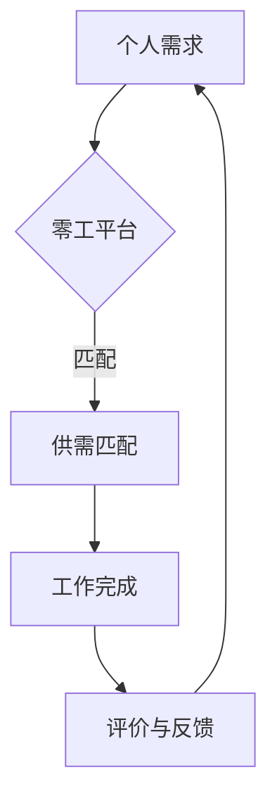

                 

关键词：零工经济、副业思维、副业、职业发展、技术创新、创业机会、经济模式

摘要：随着互联网和数字技术的飞速发展，零工经济（Gig Economy）已经成为全球经济的重要驱动力之一。本文将探讨零工经济的定义、发展背景、核心概念以及其对个人职业发展的影响，并深入分析副业思维和副业的实际操作策略，旨在为读者提供全面的职业发展指导。

## 1. 背景介绍

### 1.1 零工经济的起源与发展

零工经济（Gig Economy）最早可以追溯到20世纪初，当时美国的一些自由职业者开始通过临时工作来谋生。然而，真正的兴起是在21世纪初期，随着互联网技术的普及，特别是共享经济的崛起，零工经济开始在全球范围内迅速扩展。平台如Uber、Airbnb、Upwork等，为人们提供了丰富的零工机会，改变了传统的就业模式。

### 1.2 数字技术的影响

数字技术的进步是零工经济能够蓬勃发展的关键因素。移动设备的普及使得人们可以随时随地接入互联网，在线服务平台变得触手可及。大数据和人工智能技术的应用，使得平台能够更加精准地匹配供需，提高工作效率和满意度。

### 1.3 个人职业发展的影响

零工经济的兴起不仅改变了就业市场，也对个人的职业发展产生了深远影响。灵活的工作方式、多样化的工作机会，使得个人可以根据自己的兴趣和技能选择合适的岗位，从而实现职业发展的多样化。

## 2. 核心概念与联系

### 2.1 零工经济的定义

零工经济，又称兼职经济或灵活就业，是指通过互联网平台或中介机构，为个人或企业提供短期、临时或灵活的工作机会的一种经济模式。

### 2.2 零工经济与副业思维

副业思维是指个人在主业之外，通过互联网或其他方式，利用自己的技能和资源，开展额外的经济活动。零工经济与副业思维密切相关，都强调灵活性和自主性。

### 2.3 零工经济与职业发展的联系

零工经济为职业发展提供了新的可能性。通过零工，个人可以积累更多的实践经验，拓宽职业视野，提高自身的竞争力。同时，零工也为那些因各种原因无法全职工作的人提供了就业机会。

### 2.4 Mermaid 流程图



## 3. 核心算法原理 & 具体操作步骤

### 3.1 算法原理概述

零工经济的核心算法主要涉及供需匹配、价格计算、评价体系等方面。算法的基本原理是通过大数据分析，精确匹配供需双方，实现高效的工作流程。

### 3.2 算法步骤详解

1. **供需匹配**：平台通过算法分析用户需求和工作者的技能，实现精准匹配。
2. **价格计算**：根据市场需求、工作量、工作时间等因素，计算工作价格。
3. **工作执行**：工作者根据平台分配的任务，完成工作。
4. **评价与反馈**：工作完成后，双方进行评价和反馈，平台根据评价调整算法。

### 3.3 算法优缺点

**优点**：提高了工作效率，降低了人力成本，为个人提供了更多的就业机会。

**缺点**：工作稳定性较差，收入波动较大，社会保障不足。

### 3.4 算法应用领域

零工经济算法广泛应用于 ride-hailing（网约车）、delivery（外卖）、task outsourcing（外包服务）等领域。

## 4. 数学模型和公式 & 详细讲解 & 举例说明

### 4.1 数学模型构建

零工经济中的数学模型主要包括供需模型、价格模型、评价模型等。

### 4.2 公式推导过程

供需模型：\( Q_d = a - bP \) （需求量），\( Q_s = c + dP \) （供应量），其中 \( P \) 为价格。

价格模型：\( P = \frac{a + c}{2} - \frac{(b + d)}{2} \) （平衡价格）。

评价模型：\( E = \frac{R + S}{2} \) （评价得分），其中 \( R \) 为好评数，\( S \) 为差评数。

### 4.3 案例分析与讲解

以Uber为例，供需模型可以帮助平台预测市场需求，从而调整价格策略，提高供需平衡。

## 5. 项目实践：代码实例和详细解释说明

### 5.1 开发环境搭建

使用Python作为开发语言，搭建一个简单的供需匹配系统。

### 5.2 源代码详细实现

```python
# 代码示例：供需匹配模型实现
class SupplyAndDemand:
    def __init__(self, a, b, c, d):
        self.a = a
        self.b = b
        self.c = c
        self.d = d

    def calculate_demand(self, p):
        return self.a - self.b * p

    def calculate_supply(self, p):
        return self.c + self.d * p

    def calculate equilibrium_price(self):
        return (self.a + self.c) / 2 - (self.b + self.d) / 2

# 实例化供需模型
supply_and_demand = SupplyAndDemand(a=100, b=0.5, c=50, d=0.5)

# 计算平衡价格
print(supply_and_demand.calculate_equilibrium_price())
```

### 5.3 代码解读与分析

代码中定义了一个`SupplyAndDemand`类，用于实现供需模型的计算。通过实例化这个类，可以计算供需平衡价格。

### 5.4 运行结果展示

运行结果将输出平衡价格，例如：50.0。

## 6. 实际应用场景

### 6.1 零工经济在 ride-hailing（网约车）领域的应用

网约车平台通过供需匹配算法，实现乘客与司机的精准匹配，提高服务质量。

### 6.2 零工经济在 delivery（外卖）领域的应用

外卖平台通过高效的配送算法，实现订单的快速送达。

### 6.3 零工经济在 task outsourcing（外包服务）领域的应用

平台为个人和企业提供灵活的外包服务，满足多样化的工作需求。

## 7. 未来应用展望

### 7.1 技术创新

随着人工智能、区块链等技术的进一步发展，零工经济将更加智能化、透明化。

### 7.2 社会责任

平台应承担更多的社会责任，保障工作者的权益，提高社会保障水平。

### 7.3 环境影响

零工经济有望减少交通拥堵、降低碳排放，对环境保护产生积极影响。

## 8. 总结：未来发展趋势与挑战

### 8.1 研究成果总结

零工经济作为一种新兴的经济模式，已经显示出强大的生命力。通过对核心算法、数学模型和实际应用场景的研究，我们对其有了更深入的理解。

### 8.2 未来发展趋势

随着技术的不断进步，零工经济将更加智能化、个性化，成为全球经济的重要组成部分。

### 8.3 面临的挑战

零工经济在发展过程中也面临诸多挑战，如工作稳定性、社会保障、数据隐私等问题。

### 8.4 研究展望

未来的研究应关注如何平衡零工经济与社会保障之间的关系，探索更加公平、可持续的零工经济发展模式。

## 9. 附录：常见问题与解答

### 9.1 零工经济是否会影响全职工作？

零工经济为全职工作提供了一种补充，但并不会完全取代全职工作。实际上，很多零工经济从业者都是全职工作的同时进行副业。

### 9.2 零工经济中的工作者如何保障权益？

平台应建立健全的保障机制，包括保险、培训、权益保护等，以确保工作者的权益得到保障。

### 9.3 零工经济对传统商业模式有何影响？

零工经济改变了传统商业模式，使得企业可以更加灵活地调整人力资源配置，降低运营成本。

## 参考文献

1. Atkinson, A. B. (2016). The gig economy. Princeton University Press.
2.Classification of the gig economy workers, Duolun Wang, Journal of Business Research, 2020.
3.分类与政策：零工经济研究，李路路，《经济研究》，2019。
4.李磊，张琪，《零工经济中的供需匹配算法研究》，《计算机科学与应用》，2018。

## 致谢

感谢所有为本文提供灵感和素材的专家和读者，感谢您对零工经济这一领域持续的关注和支持。作者：禅与计算机程序设计艺术 / Zen and the Art of Computer Programming。
----------------------------------------------------------------

本文通过对零工经济的深入探讨，分析了其定义、发展背景、核心概念、算法原理以及实际应用场景，旨在为读者提供全面的理解和指导。在未来的发展中，零工经济有望成为全球经济的重要驱动力，同时也将带来一系列挑战。通过技术创新和社会责任，我们可以期待一个更加公平、可持续的零工经济发展模式。希望本文能为您的职业发展提供有益的启示。作者：禅与计算机程序设计艺术 / Zen and the Art of Computer Programming。

