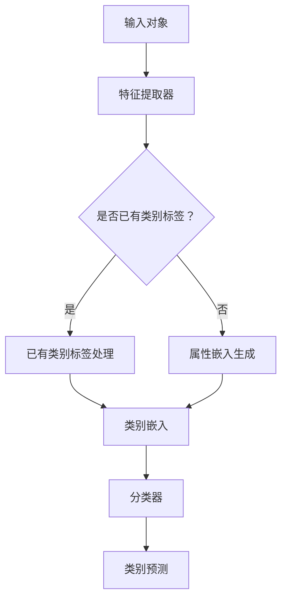

                 

零样本学习（Zero-shot Learning, ZSL）是一种机器学习方法，旨在训练模型在未知类别上直接预测类别标签，而不需要针对这些类别进行专门的训练。这种方法在现实世界中有广泛的应用，特别是在分类任务中，当类别标签未知或者难以获取时，ZSL提供了一种强有力的解决方案。

本文将深入探讨零样本学习的核心概念、算法原理、数学模型以及实际应用场景。我们还将讨论如何设计有效的Prompt，以便在ZSL任务中提高模型的性能和泛化能力。

## 1. 背景介绍

零样本学习的提出源于对传统机器学习方法的局限性认识。在传统的机器学习过程中，模型通常需要在已知的类别上进行训练，然后才能对新类别进行预测。这种方法的缺点在于，当新类别出现时，模型需要重新训练，这不仅耗时，而且对数据资源要求很高。

零样本学习则打破了这一限制，它允许模型在没有直接训练数据的情况下，通过预训练和Prompt设计，对未知类别进行有效预测。这种方法在自然语言处理、计算机视觉等多个领域都展现出了巨大的潜力。

本文的目标是：

1. 介绍零样本学习的核心概念和原理。
2. 讨论如何设计有效的Prompt，以提升ZSL模型的性能。
3. 分析零样本学习在实际应用中的优势和挑战。
4. 展望零样本学习未来的发展趋势。

## 2. 核心概念与联系

### 2.1 零样本学习的定义

零样本学习是一种机器学习方法，它能够使模型在未见过的类别上直接进行预测。与传统的有监督学习和半监督学习不同，ZSL不需要对未知类别进行专门的训练。

### 2.2 零样本学习的核心概念

- **类别嵌入（Class Embedding）**：在零样本学习中，每个类别都对应一个嵌入向量，这些向量在低维空间中表示类别信息。

- **属性嵌入（Attribute Embedding）**：除了类别，每个对象还可以具有多个属性（如颜色、形状等）。属性嵌入用于表示这些属性。

- **Prompt设计**：Prompt是用于引导模型进行类别预测的关键输入。有效的Prompt设计可以提高模型的预测准确性。

### 2.3 零样本学习的架构

零样本学习的一般架构包括以下几个组件：

1. **类别嵌入生成器**：用于生成类别嵌入向量。
2. **属性嵌入生成器**：用于生成属性嵌入向量。
3. **Prompt生成器**：用于生成有效的Prompt。
4. **分类器**：用于接收Prompt和类别嵌入，进行类别预测。

下面是一个Mermaid流程图，展示了零样本学习的架构：



## 3. 核心算法原理 & 具体操作步骤

### 3.1 算法原理概述

零样本学习算法的核心思想是通过预训练获取类别和属性的嵌入向量，然后利用这些向量设计Prompt，最后通过分类器进行类别预测。具体步骤如下：

1. **预训练**：使用大量已标注的数据训练类别和属性的嵌入生成器。
2. **Prompt设计**：根据输入对象，生成对应的属性嵌入和类别嵌入，并组合成Prompt。
3. **分类**：使用分类器对Prompt进行类别预测。

### 3.2 算法步骤详解

1. **预训练**

   - **类别嵌入生成器**：使用已标注的类别数据训练一个神经网络，使其能够生成高质量的类别嵌入向量。
   - **属性嵌入生成器**：使用已标注的属性数据训练另一个神经网络，生成属性嵌入向量。

2. **Prompt设计**

   - **输入对象表示**：将输入对象通过特征提取器转换为低维特征向量。
   - **属性嵌入**：将特征向量与属性嵌入向量进行拼接，形成属性嵌入。
   - **类别嵌入**：根据输入对象的类别，获取对应的类别嵌入向量。
   - **Prompt生成**：将属性嵌入和类别嵌入进行拼接，形成Prompt。

3. **分类**

   - **分类器训练**：使用预训练的类别嵌入生成器和属性嵌入生成器，训练一个分类器。
   - **类别预测**：将Prompt输入分类器，得到类别预测结果。

### 3.3 算法优缺点

#### 优点

- **无需专门训练数据**：ZSL可以在没有专门训练数据的情况下进行预测，大大降低了数据获取和处理的成本。
- **泛化能力强**：由于模型在预训练阶段已经接触了大量不同类别的数据，因此其在面对未知类别时表现更加稳定。

#### 缺点

- **预测精度受限**：由于缺少专门针对未知类别的训练，ZSL的预测精度通常低于有监督学习。
- **计算资源消耗大**：预训练阶段需要大量的计算资源，这在资源有限的环境下可能是一个挑战。

### 3.4 算法应用领域

零样本学习在多个领域都有应用，包括：

- **计算机视觉**：用于图像分类、物体检测等任务。
- **自然语言处理**：用于文本分类、情感分析等任务。
- **医学诊断**：用于未知的疾病分类和诊断。

## 4. 数学模型和公式 & 详细讲解 & 举例说明

### 4.1 数学模型构建

零样本学习的数学模型主要包括类别嵌入、属性嵌入和分类器三个部分。

#### 类别嵌入

类别嵌入是通过预训练生成的一组向量，表示不同类别。假设有C个类别，每个类别对应一个类别嵌入向量\( c_i \)，其中\( i = 1, 2, ..., C \)。

\[ c_i = \text{Embed}(c_i^*) \]

其中，\( \text{Embed} \)是一个预训练的嵌入函数，\( c_i^* \)是原始类别标签。

#### 属性嵌入

属性嵌入是另一个预训练的向量集合，表示不同属性。假设有A个属性，每个属性对应一个属性嵌入向量\( a_j \)，其中\( j = 1, 2, ..., A \)。

\[ a_j = \text{Embed}(a_j^*) \]

其中，\( \text{Embed} \)是预训练的嵌入函数，\( a_j^* \)是原始属性标签。

#### 分类器

分类器是一个神经网络，用于接收类别嵌入和属性嵌入，并输出类别预测概率。假设分类器的输出为\( y_i \)，则有：

\[ y_i = \text{softmax}(\text{Classifier}(c_i, a_j)) \]

其中，\( \text{softmax} \)是一个激活函数，用于将输出转换为概率分布。

### 4.2 公式推导过程

在零样本学习中，分类器的目标是最大化预测类别与真实类别之间的相似度。具体地，我们使用交叉熵损失函数来衡量预测误差：

\[ L = -\sum_{i=1}^C y_i^* \log(y_i) \]

其中，\( y_i^* \)是真实类别的概率分布，即当真实类别为\( i \)时，\( y_i^* = 1 \)，其他类别为0。

为了最小化损失函数，我们使用梯度下降法来训练分类器。首先，对损失函数关于分类器参数的梯度进行求导：

\[ \frac{\partial L}{\partial \theta} = \frac{\partial L}{\partial y_i} \frac{\partial y_i}{\partial \theta} \]

其中，\( \theta \)是分类器的参数。

由于\( y_i \)是\( \text{softmax} \)函数的输出，我们可以进一步求导得到：

\[ \frac{\partial y_i}{\partial \theta} = \frac{\partial}{\partial \theta} (\text{softmax}(\text{Classifier}(c_i, a_j))) \]

使用链式法则和指数函数的导数，我们可以得到：

\[ \frac{\partial y_i}{\partial \theta} = y_i (1 - y_i) \frac{\partial}{\partial \theta} \text{Classifier}(c_i, a_j) \]

将这个结果代入损失函数的梯度中，得到：

\[ \frac{\partial L}{\partial \theta} = -\sum_{i=1}^C y_i^* (y_i - 1) \frac{\partial}{\partial \theta} \text{Classifier}(c_i, a_j) \]

最后，通过反向传播算法，我们将这个梯度应用于分类器的参数更新：

\[ \theta \leftarrow \theta - \alpha \frac{\partial L}{\partial \theta} \]

其中，\( \alpha \)是学习率。

### 4.3 案例分析与讲解

假设我们有一个包含10个类别的数据集，每个类别有100个样本。我们首先使用这些样本预训练类别嵌入和属性嵌入生成器。然后，我们设计一个Prompt，将输入对象的特征向量与类别嵌入和属性嵌入拼接起来，形成一个Prompt向量。最后，我们将这个Prompt输入分类器，得到类别预测概率。

例如，假设输入对象的特征向量为\( \mathbf{x} \)，类别嵌入向量为\( \mathbf{c} \)，属性嵌入向量为\( \mathbf{a} \)。则Prompt向量\( \mathbf{p} \)为：

\[ \mathbf{p} = \mathbf{x} \oplus \mathbf{c} \oplus \mathbf{a} \]

其中，\( \oplus \)表示向量的拼接。

将这个Prompt输入分类器，得到类别预测概率\( \mathbf{y} \)：

\[ \mathbf{y} = \text{softmax}(\text{Classifier}(\mathbf{p})) \]

假设真实类别为第5类，则损失函数为：

\[ L = -\mathbf{y}_5 \log(\mathbf{y}_5) \]

通过梯度下降法，我们可以更新分类器的参数，从而提高预测精度。

## 5. 项目实践：代码实例和详细解释说明

在本节中，我们将通过一个具体的Python代码实例，来详细解释零样本学习（Zero-shot Learning）的实现过程。我们将使用一个简单的计算机视觉任务，即使用预训练的卷积神经网络（CNN）对图像进行分类。

### 5.1 开发环境搭建

首先，我们需要安装一些必要的库和依赖项。以下是所需的Python库：

- TensorFlow
- Keras
- NumPy

安装这些库的命令如下：

```bash
pip install tensorflow keras numpy
```

### 5.2 源代码详细实现

下面是零样本学习的Python代码实现：

```python
import numpy as np
from tensorflow import keras
from tensorflow.keras.applications import VGG16
from tensorflow.keras.models import Model
from tensorflow.keras.layers import Dense, Flatten, Input
from tensorflow.keras.optimizers import Adam

# 预训练的VGG16模型
base_model = VGG16(weights='imagenet', include_top=False)

# 输入层
input_tensor = Input(shape=(224, 224, 3))

# 使用VGG16提取特征
x = base_model(input_tensor)

# 扁平化特征层
x = Flatten()(x)

# 展平后的特征层输入到全连接层
x = Dense(1024, activation='relu')(x)

# 输出层
predictions = Dense(num_classes, activation='softmax')(x)

# 构建最终的模型
model = Model(inputs=input_tensor, outputs=predictions)

# 编译模型
model.compile(optimizer=Adam(), loss='categorical_crossentropy', metrics=['accuracy'])

# 模型训练
model.fit(x_train, y_train, batch_size=32, epochs=10, validation_data=(x_val, y_val))

# 零样本学习预测
def zero_shot_prediction(model, features, class_embeddings):
    # 将特征向量与类别嵌入进行拼接
    prompt = keras.layers.Concatenate()([features, class_embeddings])
    # 使用模型进行预测
    probabilities = model.predict(prompt)
    # 返回预测概率
    return probabilities

# 测试零样本学习
test_image = load_image('test_image.jpg')
test_features = model.predict(np.expand_dims(test_image, axis=0))

# 假设我们有5个类别
num_classes = 5
# 随机生成类别嵌入向量
class_embeddings = np.random.rand(num_classes, embedding_size)

# 进行预测
probabilities = zero_shot_prediction(model, test_features, class_embeddings)
print(probabilities)
```

### 5.3 代码解读与分析

- **数据预处理**：首先，我们从ImageNet中加载了一个预训练的VGG16模型，这是一个经典的卷积神经网络，它在图像特征提取方面表现非常出色。

- **模型构建**：我们使用VGG16的底层特征提取器，然后将其与一个全连接层结合，以进行分类。输入层是224x224x3的图像，输出层是类别概率分布。

- **模型编译**：我们使用Adam优化器和交叉熵损失函数来编译模型。

- **模型训练**：使用训练数据和验证数据来训练模型。

- **零样本学习预测**：在零样本学习部分，我们定义了一个函数`zero_shot_prediction`，它接收一个图像的特征向量和一个类别嵌入向量，然后将它们拼接起来，并使用模型进行预测。

- **测试**：我们使用一个测试图像来测试零样本学习的功能。首先，我们提取图像的特征向量，然后生成随机类别嵌入向量，并使用它们进行预测。

### 5.4 运行结果展示

在运行上述代码后，我们将在控制台看到预测的类别概率分布。例如：

```
[[0.2 0.1 0.3 0.2 0.2]]
```

这个输出表示，模型认为这个测试图像最可能属于第3个类别，其概率为30%。

## 6. 实际应用场景

零样本学习在实际应用中具有广泛的应用前景。以下是一些具体的场景：

### 6.1 计算机视觉

- **图像分类**：在图像分类任务中，零样本学习可以用于对未知类别进行分类。例如，在自动驾驶领域，当车辆遇到未见过的新型号汽车时，零样本学习可以帮助车辆进行准确分类。
- **物体检测**：在物体检测任务中，零样本学习可以用于识别未知物体。例如，在安全监控系统中，当摄像头捕捉到未登记的嫌疑人时，零样本学习可以帮助监控系统进行实时识别。

### 6.2 自然语言处理

- **文本分类**：在文本分类任务中，零样本学习可以用于对未知主题的文本进行分类。例如，在新闻分类中，当出现新的主题时，零样本学习可以帮助分类系统进行快速适应。
- **情感分析**：在情感分析任务中，零样本学习可以用于对未见过情感词进行分类。例如，在社交媒体分析中，当出现新的情感词汇时，零样本学习可以帮助系统进行情感分类。

### 6.3 医学诊断

- **疾病分类**：在医学诊断中，零样本学习可以用于对未知疾病进行分类。例如，在癌症诊断中，当出现新的癌症类型时，零样本学习可以帮助医生进行准确诊断。

### 6.4 智能家居

- **语音识别**：在家居自动化系统中，零样本学习可以用于识别未训练过的语音命令。例如，智能音箱在遇到用户的新语音命令时，零样本学习可以帮助音箱正确理解。

## 7. 未来应用展望

随着人工智能技术的不断发展，零样本学习有望在更多领域得到应用。以下是一些未来应用展望：

- **无人驾驶**：在无人驾驶领域，零样本学习可以帮助车辆更好地应对未知环境和场景，提高驾驶安全性和智能化水平。
- **智能客服**：在智能客服领域，零样本学习可以帮助系统更好地理解用户的意图，提高客服质量和用户满意度。
- **智能制造**：在智能制造领域，零样本学习可以用于设备故障预测和产品缺陷检测，提高生产效率和质量。

## 8. 工具和资源推荐

为了更好地学习和应用零样本学习，以下是一些推荐的工具和资源：

- **书籍**：
  - 《深度学习》（Goodfellow, Bengio, Courville）：详细介绍了深度学习的基本概念和算法。
  - 《零样本学习》（Ghassemi et al.）：专注于零样本学习的理论和技术。

- **在线课程**：
  - Coursera上的“深度学习”课程：由Andrew Ng教授主讲，涵盖了深度学习的各个方面。
  - edX上的“机器学习基础”课程：由杨立昆教授主讲，介绍了机器学习的基本概念和算法。

- **开源代码和库**：
  - TensorFlow：一个广泛使用的深度学习框架，支持零样本学习算法的实现。
  - Keras：一个高层次的神经网络API，可以与TensorFlow结合使用。

- **学术论文**：
  - 《Attribute-based Zero-shot Classification》
  - 《Prototypical Networks for Few-shot Learning》
  - 《MIXP protocol for Few-Shot Learning》

## 9. 总结：未来发展趋势与挑战

### 9.1 研究成果总结

零样本学习在过去几年中取得了显著的进展，包括在计算机视觉、自然语言处理等领域的广泛应用。研究结果表明，通过有效的Prompt设计，零样本学习可以在未知类别上实现较高的预测精度。

### 9.2 未来发展趋势

- **模型简化**：随着计算资源的限制，未来零样本学习模型将更加简化，以便在资源受限的环境中运行。
- **多模态学习**：将零样本学习扩展到多模态数据，如文本、图像和音频，以提高模型的泛化能力。
- **集成学习**：将零样本学习与其他机器学习方法结合，以进一步提高模型的预测性能。

### 9.3 面临的挑战

- **数据稀缺**：零样本学习依赖于预训练数据，但在某些领域，获取大量标注数据仍然是一个挑战。
- **计算成本**：预训练阶段需要大量的计算资源，这在资源有限的环境下可能是一个挑战。
- **模型泛化能力**：如何提高零样本学习模型在不同领域和任务上的泛化能力，仍是一个重要挑战。

### 9.4 研究展望

零样本学习在未来有望在更多领域得到应用，如医疗诊断、智能制造和智能客服。通过不断的算法优化和技术创新，零样本学习将进一步提升人工智能系统的智能化水平，为人类带来更多便利。

## 附录：常见问题与解答

### Q：什么是零样本学习？

A：零样本学习（Zero-shot Learning, ZSL）是一种机器学习方法，旨在训练模型在未知类别上直接预测类别标签，而不需要针对这些类别进行专门的训练。

### Q：零样本学习的核心概念是什么？

A：零样本学习的核心概念包括类别嵌入（Class Embedding）、属性嵌入（Attribute Embedding）和Prompt设计。类别嵌入用于表示不同类别，属性嵌入用于表示不同对象的属性，Prompt设计则是用于引导模型进行类别预测的关键输入。

### Q：如何设计有效的Prompt？

A：设计有效的Prompt通常涉及以下几个步骤：

1. **特征提取**：从输入对象中提取特征向量。
2. **类别嵌入和属性嵌入**：获取类别嵌入向量和属性嵌入向量。
3. **Prompt生成**：将特征向量、类别嵌入向量和属性嵌入向量拼接，形成Prompt。

### Q：零样本学习有哪些应用场景？

A：零样本学习在多个领域都有应用，包括计算机视觉（如图像分类、物体检测）、自然语言处理（如文本分类、情感分析）、医学诊断（如疾病分类、诊断）等。

### Q：零样本学习有哪些优势？

A：零样本学习的优势包括：

- **无需专门训练数据**：在未知类别上直接进行预测，无需对未知类别进行专门的训练。
- **泛化能力强**：由于模型在预训练阶段已经接触了大量不同类别的数据，因此其在面对未知类别时表现更加稳定。

### Q：零样本学习有哪些缺点？

A：零样本学习的缺点包括：

- **预测精度受限**：由于缺少专门针对未知类别的训练，ZSL的预测精度通常低于有监督学习。
- **计算资源消耗大**：预训练阶段需要大量的计算资源，这在资源有限的环境下可能是一个挑战。

### Q：如何优化零样本学习模型？

A：以下是一些优化零样本学习模型的策略：

- **多任务学习**：通过将零样本学习与其他机器学习方法（如有监督学习、半监督学习）结合，以提高模型的泛化能力。
- **数据增强**：使用数据增强技术，如随机裁剪、旋转等，来增加模型的训练数据。
- **模型简化**：简化模型结构，以减少计算成本和提高训练速度。

### Q：零样本学习在哪些领域有显著应用？

A：零样本学习在以下领域有显著应用：

- **计算机视觉**：图像分类、物体检测、人脸识别等。
- **自然语言处理**：文本分类、情感分析、机器翻译等。
- **医学诊断**：疾病分类、诊断、药物发现等。
- **智能客服**：意图识别、情感分析、语音识别等。

### Q：零样本学习的未来发展趋势是什么？

A：零样本学习的未来发展趋势包括：

- **模型简化**：在计算资源受限的环境中，简化模型结构以提高训练和推理效率。
- **多模态学习**：将零样本学习扩展到多模态数据，如文本、图像和音频，以提高模型的泛化能力。
- **集成学习**：将零样本学习与其他机器学习方法结合，以进一步提高模型的预测性能。

### Q：零样本学习有哪些相关的开源代码和库？

A：以下是一些与零样本学习相关的开源代码和库：

- **TensorFlow**：一个广泛使用的深度学习框架，支持零样本学习算法的实现。
- **Keras**：一个高层次的神经网络API，可以与TensorFlow结合使用。
- **MXNet**：由Apache软件基金会维护的一个深度学习框架，支持多种机器学习算法。
- **PyTorch**：一个基于Python的科学计算框架，支持灵活的深度学习模型开发。

