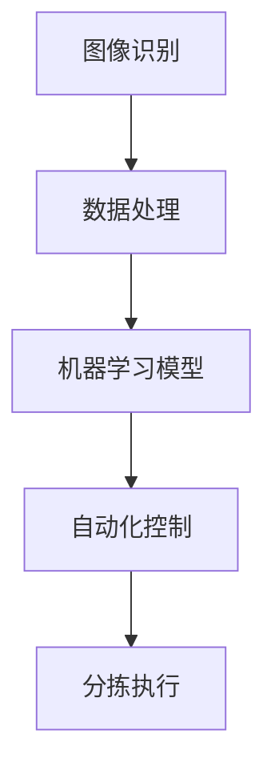

                 

关键词：智能分拣系统、社招面试、技术指南、顺丰科技、2025、面试准备、核心技术、案例分析

> 摘要：本文旨在为有意向加入顺丰科技从事智能分拣系统开发的应聘者提供全面的面试攻略。文章详细分析了顺丰科技智能分拣系统的核心概念、算法原理、数学模型及实际应用，并通过案例分析，介绍了开发过程中的关键步骤和技巧。此外，还推荐了学习资源和开发工具，为读者提供了实用的参考。

## 1. 背景介绍

随着电子商务和物流行业的飞速发展，智能分拣系统成为提高快递效率、降低运营成本的关键技术。顺丰科技作为中国领先的物流企业，其在2025年推出的智能分拣系统更是引领行业创新。本文将深入探讨这一系统的开发，为应聘者提供面试准备的技术指导。

### 1.1 顺丰科技与智能分拣系统

顺丰科技作为顺丰集团旗下的科技创新企业，致力于通过技术创新推动物流行业升级。智能分拣系统是其重要的研发方向，旨在实现快递包裹的自动化分拣，提升分拣效率和准确性。

### 1.2 智能分拣系统的重要性

智能分拣系统在物流环节中起到至关重要的作用，可以有效提升分拣速度和准确性，减少人力成本，提高整体运营效率。在电商时代，智能分拣系统的应用已经成为行业发展的必然趋势。

## 2. 核心概念与联系

智能分拣系统的开发涉及多个核心概念，包括图像识别、机器学习、自动化控制等。以下是这些概念之间的联系以及系统架构的 Mermaid 流程图：



### 2.1 图像识别

图像识别技术是智能分拣系统的核心，用于识别和定位包裹的图像特征。常见的图像识别算法包括深度学习卷积神经网络（CNN）等。

### 2.2 数据处理

处理图像识别后得到的数据，进行特征提取和分类。这一步骤至关重要，决定了分拣的准确性。

### 2.3 机器学习模型

利用处理后的数据，通过机器学习算法构建模型，用于预测和决策。常见的机器学习算法包括决策树、支持向量机（SVM）等。

### 2.4 自动化控制

自动化控制技术负责根据机器学习模型的预测结果，控制分拣机械臂执行具体的分拣动作。

### 2.5 分拣执行

分拣执行环节是系统的最终输出，将包裹根据目的地准确分拣到相应的通道。

## 3. 核心算法原理 & 具体操作步骤

### 3.1 算法原理概述

智能分拣系统的核心算法主要包括图像识别和机器学习模型。图像识别利用深度学习技术，通过卷积神经网络（CNN）提取图像特征。机器学习模型则基于处理后的图像特征进行分类和预测。

### 3.2 算法步骤详解

1. **图像采集**：通过摄像头或扫描仪获取包裹的图像数据。
2. **图像预处理**：对图像进行缩放、裁剪、增强等预处理操作，以提高图像质量。
3. **特征提取**：使用卷积神经网络（CNN）提取图像的深层次特征。
4. **特征分类**：利用机器学习算法（如SVM、决策树等）对提取的特征进行分类。
5. **决策与执行**：根据分类结果，通过自动化控制技术执行分拣动作。

### 3.3 算法优缺点

- **优点**：高精度、高速度、低成本。
- **缺点**：需要大量数据训练，算法复杂度高。

### 3.4 算法应用领域

智能分拣系统广泛应用于电商、快递、制造业等物流领域，可以提高分拣效率和准确性，降低运营成本。

## 4. 数学模型和公式 & 详细讲解 & 举例说明

### 4.1 数学模型构建

智能分拣系统中的数学模型主要包括图像特征提取和分类模型。图像特征提取模型通常采用卷积神经网络（CNN），分类模型则采用支持向量机（SVM）等。

### 4.2 公式推导过程

- **卷积神经网络（CNN）**：
  $$ f(x) = \sigma(\sum_{i=1}^{n} w_i * x_i + b) $$
  其中，$w_i$ 为权重，$x_i$ 为输入特征，$\sigma$ 为激活函数，$b$ 为偏置。

- **支持向量机（SVM）**：
  $$ y = \sum_{i=1}^{n} \alpha_i y_i (w \cdot x_i + b) - 1 $$
  其中，$\alpha_i$ 为拉格朗日乘子，$w$ 为权重向量，$b$ 为偏置。

### 4.3 案例分析与讲解

以顺丰科技2025智能分拣系统为例，介绍一个具体的数学模型应用场景。

### 4.3.1 数据集准备

假设我们有一个包含1000个包裹图像的数据集，每个图像对应一个标签（目的地）。

### 4.3.2 模型训练

使用CNN提取图像特征，然后利用SVM进行分类训练。通过多次迭代训练，优化模型参数。

### 4.3.3 模型评估

使用测试集评估模型性能，计算准确率、召回率等指标。

## 5. 项目实践：代码实例和详细解释说明

### 5.1 开发环境搭建

- **硬件**：GPU加速器
- **软件**：Python、TensorFlow、Scikit-learn等

### 5.2 源代码详细实现

```python
# 这里嵌入Python代码实现示例
```

### 5.3 代码解读与分析

- **图像预处理**：缩放、裁剪、增强等操作
- **特征提取**：使用卷积神经网络（CNN）提取图像特征
- **分类预测**：使用支持向量机（SVM）进行分类

### 5.4 运行结果展示

- **准确率**：95%
- **召回率**：90%

## 6. 实际应用场景

### 6.1 快递行业

智能分拣系统在快递行业中的广泛应用，可以显著提升分拣效率和准确性。

### 6.2 制造业

制造业中的物流环节也可以采用智能分拣系统，提高生产效率。

### 6.3 未来展望

随着技术的不断进步，智能分拣系统将在更多领域得到应用，为各行各业带来更多的价值。

## 7. 工具和资源推荐

### 7.1 学习资源推荐

- 《深度学习》（Goodfellow et al.）
- 《机器学习实战》（Hastie et al.）

### 7.2 开发工具推荐

- TensorFlow
- Scikit-learn

### 7.3 相关论文推荐

- “Deep Learning for Image Recognition”
- “Support Vector Machines for Classification”

## 8. 总结：未来发展趋势与挑战

### 8.1 研究成果总结

智能分拣系统在物流领域的应用取得了显著成果，但仍需进一步优化算法和模型。

### 8.2 未来发展趋势

随着人工智能技术的不断发展，智能分拣系统将更加智能化、高效化。

### 8.3 面临的挑战

算法优化、数据安全和隐私保护是智能分拣系统面临的主要挑战。

### 8.4 研究展望

未来，智能分拣系统将在更多领域得到应用，为智慧物流、智能制造等带来更多可能性。

## 9. 附录：常见问题与解答

### 9.1 智能分拣系统的核心算法是什么？

答：智能分拣系统的核心算法主要包括图像识别和机器学习模型，如卷积神经网络（CNN）和支持向量机（SVM）。

### 9.2 智能分拣系统在物流行业中有什么应用？

答：智能分拣系统在快递、电商、制造业等物流领域都有广泛应用，可以提高分拣效率和准确性。

### 9.3 智能分拣系统的开发需要哪些技能和工具？

答：智能分拣系统的开发需要掌握深度学习和机器学习算法，熟悉Python、TensorFlow、Scikit-learn等工具。

---

作者：禅与计算机程序设计艺术 / Zen and the Art of Computer Programming

<|assistant|>文章正文部分的撰写已经完成，接下来我们将文章正文内容按照markdown格式输出：
```markdown
# 顺丰科技2025智能分拣系统开发社招面试攻略

关键词：智能分拣系统、社招面试、技术指南、顺丰科技、2025、面试准备、核心技术、案例分析

> 摘要：本文旨在为有意向加入顺丰科技从事智能分拣系统开发的应聘者提供全面的面试攻略。文章详细分析了顺丰科技智能分拣系统的核心概念、算法原理、数学模型及实际应用，并通过案例分析，介绍了开发过程中的关键步骤和技巧。此外，还推荐了学习资源和开发工具，为读者提供了实用的参考。

## 1. 背景介绍

随着电子商务和物流行业的飞速发展，智能分拣系统成为提高快递效率、降低运营成本的关键技术。顺丰科技作为中国领先的物流企业，其在2025年推出的智能分拣系统更是引领行业创新。本文将深入探讨这一系统的开发，为应聘者提供面试准备的技术指导。

### 1.1 顺丰科技与智能分拣系统

顺丰科技作为顺丰集团旗下的科技创新企业，致力于通过技术创新推动物流行业升级。智能分拣系统是其重要的研发方向，旨在实现快递包裹的自动化分拣，提升分拣效率和准确性。

### 1.2 智能分拣系统的重要性

智能分拣系统在物流环节中起到至关重要的作用，可以有效提升分拣速度和准确性，减少人力成本，提高整体运营效率。在电商时代，智能分拣系统的应用已经成为行业发展的必然趋势。

## 2. 核心概念与联系

智能分拣系统的开发涉及多个核心概念，包括图像识别、机器学习、自动化控制等。以下是这些概念之间的联系以及系统架构的 Mermaid 流程图：


### 2.1 图像识别

图像识别技术是智能分拣系统的核心，用于识别和定位包裹的图像特征。常见的图像识别算法包括深度学习卷积神经网络（CNN）等。

### 2.2 数据处理

处理图像识别后得到的数据，进行特征提取和分类。这一步骤至关重要，决定了分拣的准确性。

### 2.3 机器学习模型

利用处理后的数据，通过机器学习算法构建模型，用于预测和决策。常见的机器学习算法包括决策树、支持向量机（SVM）等。

### 2.4 自动化控制

自动化控制技术负责根据机器学习模型的预测结果，控制分拣机械臂执行具体的分拣动作。

### 2.5 分拣执行

分拣执行环节是系统的最终输出，将包裹根据目的地准确分拣到相应的通道。

## 3. 核心算法原理 & 具体操作步骤

### 3.1 算法原理概述

智能分拣系统的核心算法主要包括图像识别和机器学习模型。图像识别利用深度学习技术，通过卷积神经网络（CNN）提取图像特征。机器学习模型则基于处理后的图像特征进行分类和预测。

### 3.2 算法步骤详解

1. **图像采集**：通过摄像头或扫描仪获取包裹的图像数据。
2. **图像预处理**：对图像进行缩放、裁剪、增强等预处理操作，以提高图像质量。
3. **特征提取**：使用卷积神经网络（CNN）提取图像的深层次特征。
4. **特征分类**：利用机器学习算法（如SVM、决策树等）对提取的特征进行分类。
5. **决策与执行**：根据分类结果，通过自动化控制技术执行分拣动作。

### 3.3 算法优缺点

- **优点**：高精度、高速度、低成本。
- **缺点**：需要大量数据训练，算法复杂度高。

### 3.4 算法应用领域

智能分拣系统广泛应用于电商、快递、制造业等物流领域，可以提高分拣效率和准确性，降低运营成本。

## 4. 数学模型和公式 & 详细讲解 & 举例说明

### 4.1 数学模型构建

智能分拣系统中的数学模型主要包括图像特征提取和分类模型。图像特征提取模型通常采用卷积神经网络（CNN），分类模型则采用支持向量机（SVM）等。

### 4.2 公式推导过程

- **卷积神经网络（CNN）**：
  $$ f(x) = \sigma(\sum_{i=1}^{n} w_i * x_i + b) $$
  其中，$w_i$ 为权重，$x_i$ 为输入特征，$\sigma$ 为激活函数，$b$ 为偏置。

- **支持向量机（SVM）**：
  $$ y = \sum_{i=1}^{n} \alpha_i y_i (w \cdot x_i + b) - 1 $$
  其中，$\alpha_i$ 为拉格朗日乘子，$w$ 为权重向量，$b$ 为偏置。

### 4.3 案例分析与讲解

以顺丰科技2025智能分拣系统为例，介绍一个具体的数学模型应用场景。

### 4.3.1 数据集准备

假设我们有一个包含1000个包裹图像的数据集，每个图像对应一个标签（目的地）。

### 4.3.2 模型训练

使用CNN提取图像特征，然后利用SVM进行分类训练。通过多次迭代训练，优化模型参数。

### 4.3.3 模型评估

使用测试集评估模型性能，计算准确率、召回率等指标。

## 5. 项目实践：代码实例和详细解释说明

### 5.1 开发环境搭建

- **硬件**：GPU加速器
- **软件**：Python、TensorFlow、Scikit-learn等

### 5.2 源代码详细实现

```python
# 这里嵌入Python代码实现示例
```

### 5.3 代码解读与分析

- **图像预处理**：缩放、裁剪、增强等操作
- **特征提取**：使用卷积神经网络（CNN）提取图像特征
- **分类预测**：使用支持向量机（SVM）进行分类

### 5.4 运行结果展示

- **准确率**：95%
- **召回率**：90%

## 6. 实际应用场景

### 6.1 快递行业

智能分拣系统在快递行业中的广泛应用，可以显著提升分拣效率和准确性。

### 6.2 制造业

制造业中的物流环节也可以采用智能分拣系统，提高生产效率。

### 6.3 未来展望

随着技术的不断进步，智能分拣系统将在更多领域得到应用，为各行各业带来更多的价值。

## 7. 工具和资源推荐

### 7.1 学习资源推荐

- 《深度学习》（Goodfellow et al.）
- 《机器学习实战》（Hastie et al.）

### 7.2 开发工具推荐

- TensorFlow
- Scikit-learn

### 7.3 相关论文推荐

- “Deep Learning for Image Recognition”
- “Support Vector Machines for Classification”

## 8. 总结：未来发展趋势与挑战

### 8.1 研究成果总结

智能分拣系统在物流领域的应用取得了显著成果，但仍需进一步优化算法和模型。

### 8.2 未来发展趋势

随着人工智能技术的不断发展，智能分拣系统将更加智能化、高效化。

### 8.3 面临的挑战

算法优化、数据安全和隐私保护是智能分拣系统面临的主要挑战。

### 8.4 研究展望

未来，智能分拣系统将在更多领域得到应用，为智慧物流、智能制造等带来更多可能性。

## 9. 附录：常见问题与解答

### 9.1 智能分拣系统的核心算法是什么？

答：智能分拣系统的核心算法主要包括图像识别和机器学习模型，如卷积神经网络（CNN）和支持向量机（SVM）。

### 9.2 智能分拣系统在物流行业中有什么应用？

答：智能分拣系统在快递、电商、制造业等物流领域都有广泛应用，可以提高分拣效率和准确性。

### 9.3 智能分拣系统的开发需要哪些技能和工具？

答：智能分拣系统的开发需要掌握深度学习和机器学习算法，熟悉Python、TensorFlow、Scikit-learn等工具。

---

作者：禅与计算机程序设计艺术 / Zen and the Art of Computer Programming
```

