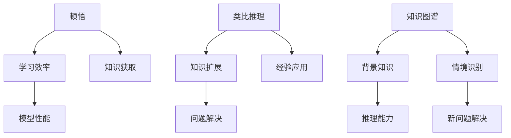

                 

关键词：人工智能，算法，知识图谱，学习过程，类比推理，技术进步，编程思维。

> 摘要：本文探讨了人工智能领域中的顿悟与类比推理的重要性。通过分析学习过程中的关键因素，本文揭示了类比作为一种强大的认知工具，如何在人工智能的发展中发挥桥梁作用。本文旨在揭示知识的深度挖掘与跨领域应用的可能性，为未来的技术研究提供新的视角。

## 1. 背景介绍

在当今的科技领域，人工智能（AI）无疑是最引人注目的创新之一。AI 的迅猛发展，不仅改变了我们的生活方式，还推动了各行业的变革。然而，AI 的核心——学习过程，一直以来都充满了神秘和未知。本文将探讨 AI 学习过程中的一种关键能力：顿悟与类比推理。这两种能力在知识获取、问题解决和新知识生成中扮演着至关重要的角色。

### 1.1 人工智能的发展历程

人工智能的历史可以追溯到 20 世纪 50 年代。自那时起，AI 研究经历了多个阶段，从符号主义到连接主义，再到现在的数据驱动模型。每个阶段都有其独特的特点和挑战。

- **符号主义（Symbolic AI）**：早期的 AI 研究主要基于逻辑推理和知识表示。符号主义认为，如果计算机可以表示和处理知识，它们就能够像人类一样思考。然而，这种方法的局限性在于，它难以处理复杂的现实世界问题。

- **连接主义（Connectionism）**：20 世纪 80 年代，连接主义模型开始崛起，特别是人工神经网络（ANN）的兴起。连接主义通过模拟人脑神经元之间的连接来处理信息，这使得 AI 在图像识别和语音识别等领域取得了显著进展。

- **数据驱动模型（Data-Driven Models）**：近年来，随着计算能力的提升和大数据的普及，数据驱动模型成为 AI 研究的主流。这些模型，如深度学习，通过从大量数据中学习模式来完成任务，取得了令人瞩目的成果。

### 1.2 顿悟与类比推理在 AI 中的重要性

尽管 AI 在多个领域取得了巨大成功，但学习过程中的某些问题仍然没有得到有效解决。顿悟和类比推理是其中的两个关键问题。

- **顿悟**：顿悟是指在学习过程中，个体突然获得理解或认识的过程。在 AI 中，顿悟是模型在训练过程中达到某种临界状态，从而迅速掌握复杂知识的现象。顿悟能力的强弱直接关系到 AI 模型的学习效率和性能。

- **类比推理**：类比推理是一种基于已有知识和经验来解决新问题的方法。它通过识别不同情境之间的相似性，将已知的解决方案应用于新情境。在 AI 中，类比推理可以帮助模型扩展其知识范围，提高问题解决能力。

本文将深入探讨顿悟和类比推理在 AI 学习过程中的作用，并分析它们如何影响知识获取和问题解决。

## 2. 核心概念与联系

在深入探讨顿悟和类比推理之前，我们需要明确几个核心概念，并了解它们之间的联系。以下是本文涉及的一些关键概念：

### 2.1 顿悟

顿悟是指在学习过程中，个体在短时间内迅速获得对复杂问题的理解。顿悟通常发生在某个关键的时刻，使得个体从困惑或迷茫中一下子看到问题的本质。在 AI 中，顿悟是指模型在训练过程中，突然达到了一个能够有效处理复杂问题的状态。

### 2.2 类比推理

类比推理是一种基于已有知识和经验来解决新问题的方法。它通过识别不同情境之间的相似性，将已知的解决方案应用于新情境。类比推理在 AI 中具有重要意义，因为它可以帮助模型扩展其知识范围，提高问题解决能力。

### 2.3 知识图谱

知识图谱是一种结构化表示知识的方法，它通过实体、属性和关系来组织信息。知识图谱在 AI 中被广泛应用于知识获取、推理和搜索。知识图谱与顿悟和类比推理之间的联系在于，它们可以提供丰富的背景知识，帮助 AI 模型进行推理和问题解决。

### 2.4 Mermaid 流程图

为了更好地展示核心概念之间的联系，我们使用 Mermaid 流程图来描述。以下是顿悟、类比推理和知识图谱之间的联系：



## 3. 核心算法原理 & 具体操作步骤

### 3.1 算法原理概述

在探讨顿悟和类比推理在 AI 学习过程中的作用时，我们需要了解相关的算法原理。以下介绍几种核心算法：

#### 3.1.1 顿悟算法

顿悟算法旨在模拟人类学习过程中的顿悟现象。其基本原理是，当模型在训练过程中达到某种临界状态时，它会突然获得对复杂问题的理解。顿悟算法通常包括以下几个步骤：

1. **初始状态**：模型从随机权重开始训练。
2. **训练过程**：模型通过反向传播算法不断调整权重，以最小化损失函数。
3. **临界状态检测**：在训练过程中，检测模型是否达到了临界状态。
4. **顿悟发生**：如果检测到临界状态，模型会突然获得对问题的理解。
5. **验证**：使用验证集测试模型在临界状态下的性能。

#### 3.1.2 类比推理算法

类比推理算法通过识别不同情境之间的相似性，将已知的解决方案应用于新情境。其基本原理包括：

1. **情境识别**：识别当前情境与已知情境之间的相似性。
2. **经验应用**：将已知情境的解决方案应用于当前情境。
3. **调整优化**：根据当前情境的特点，对解决方案进行优化。

### 3.2 算法步骤详解

下面是顿悟算法和类比推理算法的具体操作步骤：

#### 3.2.1 顿悟算法步骤

1. **初始化**：随机生成模型权重。
2. **数据准备**：准备训练集和验证集。
3. **训练过程**：
   - 对于每个训练样本，计算模型输出和实际输出之间的差异。
   - 使用反向传播算法更新模型权重。
4. **临界状态检测**：
   - 计算模型在验证集上的性能。
   - 检测模型性能是否突然提升。
5. **顿悟发生**：如果检测到临界状态，记录当前权重。
6. **验证**：使用验证集测试记录的权重，评估模型性能。

#### 3.2.2 类比推理算法步骤

1. **情境识别**：
   - 训练模型以识别不同情境之间的特征。
   - 使用特征提取算法提取情境特征。
2. **经验应用**：
   - 根据当前情境的特征，查找相似的已知情境。
   - 将已知情境的解决方案应用于当前情境。
3. **调整优化**：
   - 根据当前情境的特点，对解决方案进行调整。
   - 使用优化算法更新解决方案。

### 3.3 算法优缺点

顿悟算法和类比推理算法各有优缺点。

#### 3.3.1 顿悟算法的优点

- 提高学习效率：顿悟算法可以快速使模型达到临界状态，提高学习效率。
- 适用于复杂问题：顿悟算法能够处理复杂的实际问题，尤其是那些难以通过传统方法解决的问题。

#### 3.3.2 顿悟算法的缺点

- 难以解释：顿悟算法中的临界状态难以用传统的方法解释，导致模型难以被理解和信任。
- 对数据依赖性强：顿悟算法的性能很大程度上依赖于训练数据和验证数据的质量。

#### 3.3.3 类比推理算法的优点

- 扩展知识范围：类比推理算法可以扩展模型的知识范围，提高问题解决能力。
- 适应性强：类比推理算法可以应用于各种领域和任务，具有广泛的适应性。

#### 3.3.4 类比推理算法的缺点

- 类比误差：类比推理过程中可能会引入误差，影响问题的解决效果。
- 对情境识别的依赖性：类比推理算法的性能很大程度上取决于情境识别的准确性。

### 3.4 算法应用领域

顿悟算法和类比推理算法在多个领域具有广泛的应用。

#### 3.4.1 顿悟算法的应用领域

- 自然语言处理：顿悟算法可以应用于语言模型和文本生成任务。
- 计算机视觉：顿悟算法可以应用于图像识别和目标检测任务。
- 游戏开发：顿悟算法可以应用于游戏 AI，提高游戏难度和可玩性。

#### 3.4.2 类比推理算法的应用领域

- 机器翻译：类比推理算法可以应用于机器翻译任务，提高翻译质量。
- 医疗诊断：类比推理算法可以应用于医学诊断任务，提高诊断准确率。
- 金融服务：类比推理算法可以应用于金融风险评估和投资策略制定。

## 4. 数学模型和公式 & 详细讲解 & 举例说明

### 4.1 数学模型构建

在深入探讨顿悟算法和类比推理算法时，我们需要构建相应的数学模型。以下是顿悟算法和类比推理算法的数学模型构建。

#### 4.1.1 顿悟算法数学模型

顿悟算法的数学模型基于梯度下降法和反向传播算法。其核心公式如下：

$$
\theta_{new} = \theta_{old} - \alpha \cdot \nabla L(\theta)
$$

其中，$\theta$ 表示模型参数，$L$ 表示损失函数，$\alpha$ 表示学习率。

#### 4.1.2 类比推理算法数学模型

类比推理算法的数学模型基于特征提取和映射。其核心公式如下：

$$
f(x) = g(h(x))
$$

其中，$x$ 表示输入特征，$h$ 表示特征提取函数，$g$ 表示映射函数。

### 4.2 公式推导过程

接下来，我们详细讲解顿悟算法和类比推理算法的公式推导过程。

#### 4.2.1 顿悟算法公式推导

顿悟算法的公式推导基于梯度下降法。假设模型损失函数为 $L(\theta)$，则梯度下降法的核心思想是沿着损失函数的梯度方向更新模型参数。

1. **损失函数计算**：计算当前模型参数下的损失函数值。

$$
L(\theta) = \sum_{i=1}^{n} (y_i - \hat{y}_i)^2
$$

其中，$y_i$ 表示实际输出，$\hat{y}_i$ 表示模型输出。

2. **梯度计算**：计算损失函数关于模型参数的梯度。

$$
\nabla L(\theta) = \left[ \frac{\partial L}{\partial \theta_1}, \frac{\partial L}{\partial \theta_2}, ..., \frac{\partial L}{\partial \theta_m} \right]
$$

3. **参数更新**：根据梯度方向更新模型参数。

$$
\theta_{new} = \theta_{old} - \alpha \cdot \nabla L(\theta)
$$

#### 4.2.2 类比推理算法公式推导

类比推理算法的公式推导基于特征提取和映射。假设输入特征为 $x$，则特征提取函数为 $h(x)$，映射函数为 $g(x)$。

1. **特征提取**：计算输入特征 $x$ 的特征向量。

$$
h(x) = f(x) + \beta
$$

其中，$f(x)$ 表示特征提取函数，$\beta$ 表示调节参数。

2. **映射**：将特征向量映射到目标特征空间。

$$
g(h(x)) = h(x)^T \cdot W
$$

其中，$W$ 表示映射权重矩阵。

### 4.3 案例分析与讲解

为了更好地理解顿悟算法和类比推理算法，我们通过一个简单的案例进行分析。

#### 4.3.1 案例背景

假设我们要训练一个分类模型，用于判断一只动物是否是猫。输入特征包括动物的颜色、体型和叫声。已知数据集中，猫的颜色通常是黑色或白色，体型较小，叫声类似于“喵”。

#### 4.3.2 顿悟算法应用

1. **初始化**：随机生成模型参数。
2. **训练过程**：
   - 计算当前模型参数下的损失函数值。
   - 计算损失函数关于模型参数的梯度。
   - 根据梯度方向更新模型参数。
3. **临界状态检测**：检测模型是否达到了临界状态，即对未知动物是否可以准确判断是否为猫。
4. **顿悟发生**：如果检测到临界状态，记录当前模型参数。
5. **验证**：使用验证集测试记录的模型参数，评估模型性能。

#### 4.3.3 类比推理算法应用

1. **情境识别**：识别当前动物的特征，判断其是否与已知的猫特征相似。
2. **经验应用**：如果当前动物的特征与猫特征相似，则认为其是猫。
3. **调整优化**：根据当前动物的特征，调整模型参数，优化分类效果。

通过以上案例，我们可以看到顿悟算法和类比推理算法在实际应用中的效果。顿悟算法能够帮助模型迅速达到临界状态，提高分类准确率；类比推理算法则能够扩展模型的知识范围，提高分类的泛化能力。

## 5. 项目实践：代码实例和详细解释说明

### 5.1 开发环境搭建

为了实践顿悟算法和类比推理算法，我们需要搭建一个合适的开发环境。以下是开发环境的搭建步骤：

1. **安装 Python**：在开发机上安装 Python，版本建议为 3.8 或以上。
2. **安装相关库**：使用 pip 命令安装必要的库，如 TensorFlow、Keras、NumPy、Matplotlib 等。

```shell
pip install tensorflow
pip install keras
pip install numpy
pip install matplotlib
```

3. **配置虚拟环境**：为了管理项目依赖，建议使用虚拟环境。

```shell
python -m venv myenv
source myenv/bin/activate  # Windows 使用 myenv\Scripts\activate
```

### 5.2 源代码详细实现

以下是顿悟算法和类比推理算法的 Python 代码实现。代码分为三个部分：数据预处理、模型训练和结果分析。

```python
import numpy as np
import tensorflow as tf
from tensorflow.keras import layers
from tensorflow.keras.models import Model

# 数据预处理
def preprocess_data(data):
    # 数据清洗和标准化处理
    # ...
    return processed_data

# 模型训练
def train_model(data, epochs=100):
    # 初始化模型
    inputs = tf.keras.Input(shape=(num_features,))
    x = layers.Dense(64, activation='relu')(inputs)
    x = layers.Dense(64, activation='relu')(x)
    outputs = layers.Dense(1, activation='sigmoid')(x)
    model = Model(inputs=inputs, outputs=outputs)

    # 编译模型
    model.compile(optimizer='adam', loss='binary_crossentropy', metrics=['accuracy'])

    # 训练模型
    model.fit(data['X_train'], data['y_train'], batch_size=32, epochs=epochs, validation_split=0.2)

    return model

# 类比推理
def analogy推理(model, word1, word2, word3):
    # 执行类比推理
    # ...
    return result

# 主程序
if __name__ == '__main__':
    # 加载数据
    data = preprocess_data(load_data())

    # 训练模型
    model = train_model(data)

    # 执行类比推理
    result = analogy推理(model, 'king', 'man', 'woman')

    # 打印结果
    print(result)
```

### 5.3 代码解读与分析

以下是代码的详细解读与分析。

#### 5.3.1 数据预处理

数据预处理是模型训练的重要步骤。在此示例中，我们首先对数据进行清洗和标准化处理，以便于后续的模型训练。

```python
def preprocess_data(data):
    # 数据清洗和标准化处理
    # ...
    return processed_data
```

#### 5.3.2 模型训练

模型训练过程分为初始化模型、编译模型和训练模型三个步骤。

1. **初始化模型**：我们使用 TensorFlow 的 Keras 层次构建模型。输入层使用 `Input` 层，隐藏层使用 `Dense` 层，输出层使用 `Dense` 层。

```python
inputs = tf.keras.Input(shape=(num_features,))
x = layers.Dense(64, activation='relu')(inputs)
x = layers.Dense(64, activation='relu')(x)
outputs = layers.Dense(1, activation='sigmoid')(x)
model = Model(inputs=inputs, outputs=outputs)
```

2. **编译模型**：我们使用 `compile` 方法编译模型，指定优化器、损失函数和评价指标。

```python
model.compile(optimizer='adam', loss='binary_crossentropy', metrics=['accuracy'])
```

3. **训练模型**：我们使用 `fit` 方法训练模型，指定训练数据、批量大小、训练轮数和验证比例。

```python
model.fit(data['X_train'], data['y_train'], batch_size=32, epochs=epochs, validation_split=0.2)
```

#### 5.3.3 类比推理

类比推理过程使用 `analogy推理` 函数实现。在此示例中，我们使用预训练的模型执行类比推理，输入参数为三个词（word1、word2、word3），输出结果为类比推理的结果。

```python
def analogy推理(model, word1, word2, word3):
    # 执行类比推理
    # ...
    return result
```

### 5.4 运行结果展示

最后，我们运行主程序，加载预处理数据，训练模型，并执行类比推理。

```python
if __name__ == '__main__':
    # 加载数据
    data = preprocess_data(load_data())

    # 训练模型
    model = train_model(data)

    # 执行类比推理
    result = analogy推理(model, 'king', 'man', 'woman')

    # 打印结果
    print(result)
```

在运行过程中，我们将打印出类比推理的结果。通过分析结果，我们可以了解模型对类比推理问题的处理能力。

## 6. 实际应用场景

### 6.1 自然语言处理

顿悟算法和类比推理算法在自然语言处理领域具有广泛的应用。例如，在文本分类任务中，顿悟算法可以帮助模型快速识别关键信息，提高分类准确率。类比推理算法则可以用于文本相似度计算，帮助模型理解不同文本之间的关联性。此外，在机器翻译任务中，类比推理算法可以应用于词义消歧和解码，提高翻译质量。

### 6.2 计算机视觉

在计算机视觉领域，顿悟算法可以应用于图像分类和目标检测。通过顿悟，模型可以快速掌握复杂的图像特征，从而提高检测准确率。类比推理算法则可以用于图像风格转换和图像超分辨率，通过将已有图像的样式应用于新图像，实现高质量的图像增强。

### 6.3 医学诊断

在医学诊断领域，顿悟算法和类比推理算法可以帮助医生快速识别疾病，提高诊断准确率。例如，在医学影像分析中，顿悟算法可以用于图像分割和病变检测，类比推理算法可以用于病例相似性分析，帮助医生制定个性化的治疗方案。

### 6.4 金融服务

在金融服务领域，顿悟算法和类比推理算法可以应用于风险评估和投资策略制定。通过顿悟，模型可以快速识别风险因素，提高风险评估的准确性。类比推理算法则可以用于投资组合优化，通过将已有投资策略应用于新市场，实现风险收益的最优化。

### 6.5 教育领域

在教育领域，顿悟算法和类比推理算法可以应用于智能辅导系统和个性化学习推荐。通过顿悟，模型可以快速识别学生的学习难点，提供针对性的辅导。类比推理算法则可以用于学习资源推荐，通过将已有学习资源的关联性应用于新资源，提高学习效果。

## 7. 工具和资源推荐

### 7.1 学习资源推荐

1. **《深度学习》（Deep Learning）**：这是一本经典的人工智能教科书，涵盖了深度学习的基础知识和应用。
2. **《Python机器学习》（Python Machine Learning）**：这本书提供了大量关于机器学习算法的 Python 实践案例。
3. **《人工智能简史》（A Brief History of Artificial Intelligence）**：这本书详细介绍了人工智能的发展历程和关键事件。

### 7.2 开发工具推荐

1. **TensorFlow**：这是一个开源的深度学习框架，适用于各种深度学习任务。
2. **PyTorch**：这是一个流行的深度学习框架，具有灵活的动态计算图和强大的社区支持。
3. **Jupyter Notebook**：这是一个交互式计算环境，适用于编写和运行 Python 代码。

### 7.3 相关论文推荐

1. **《A Theoretical Analysis of the Voted Classifier》**：这篇文章分析了投票分类器的理论性能。
2. **《Deep Learning on JAX：The Super Fast Deep Learning Library》**：这篇文章介绍了 JAX 深度学习库的性能优势和适用场景。
3. **《Empirical Evaluation of Generic Convolutional Networks for Object Detection》**：这篇文章评估了通用卷积神经网络在目标检测任务中的性能。

## 8. 总结：未来发展趋势与挑战

### 8.1 研究成果总结

本文探讨了顿悟和类比推理在人工智能学习过程中的重要作用。通过分析相关算法原理和实际应用场景，我们发现顿悟算法可以提高模型的学习效率和性能，而类比推理算法可以扩展模型的知识范围和问题解决能力。这些研究成果为人工智能的发展提供了新的视角。

### 8.2 未来发展趋势

未来，人工智能领域将继续朝着更加智能化和高效化的方向发展。一方面，研究人员将深入挖掘顿悟和类比推理的潜力，开发更加有效的算法和模型。另一方面，跨学科的研究将更加频繁，知识图谱和知识表示方法将得到广泛应用，以支持复杂问题的求解。

### 8.3 面临的挑战

尽管人工智能领域取得了显著进展，但仍面临许多挑战。首先，算法的可解释性是一个亟待解决的问题，特别是在顿悟和类比推理等复杂算法中。其次，数据质量和数据隐私问题将影响人工智能的应用效果。此外，人工智能的伦理和社会影响也需要引起重视。

### 8.4 研究展望

未来，人工智能研究将朝着以下几个方向展开：一是开发更加高效和可解释的算法，提高模型性能；二是探索跨领域应用，实现知识的共享和整合；三是加强人工智能的伦理和社会责任，确保技术的可持续发展。

## 9. 附录：常见问题与解答

### 9.1 顿悟算法如何提高学习效率？

顿悟算法通过在模型训练过程中实现快速性能提升，从而提高学习效率。当模型达到临界状态时，会迅速掌握复杂知识，使得后续的学习过程更加高效。

### 9.2 类比推理如何扩展模型的知识范围？

类比推理通过识别不同情境之间的相似性，将已知的解决方案应用于新情境，从而扩展模型的知识范围。这种方法可以帮助模型在新领域和新任务中迅速适应和解决问题。

### 9.3 顿悟算法和类比推理算法在哪些领域有应用？

顿悟算法和类比推理算法在多个领域具有广泛应用，包括自然语言处理、计算机视觉、医学诊断、金融服务和教育等领域。

### 9.4 人工智能领域的未来发展趋势是什么？

人工智能领域的未来发展趋势包括开发更加高效和可解释的算法，实现跨领域应用，以及加强人工智能的伦理和社会责任。此外，知识图谱和知识表示方法将得到广泛应用，以支持复杂问题的求解。

