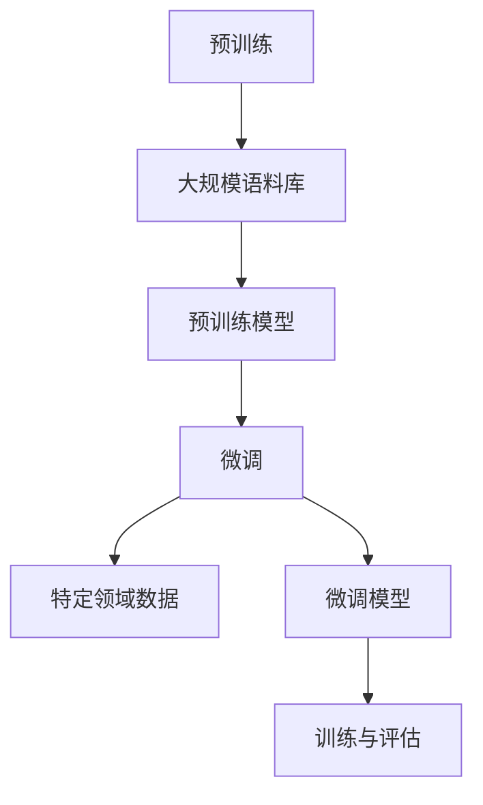

                 

关键词：预训练、微调、自然语言处理、深度学习、模型优化、效率提升

> 摘要：本文将深入探讨预训练与微调在自然语言处理领域的实际应用技巧，通过分析其核心原理、算法步骤和数学模型，结合项目实践和未来展望，为读者提供一份全面的指导。

## 1. 背景介绍

随着深度学习技术的发展，自然语言处理（NLP）领域取得了显著的成果。然而，传统的NLP方法往往需要大量手写规则和人工标注数据，效率较低且难以扩展。近年来，预训练与微调技术逐渐成为NLP领域的热点，通过在大规模语料库上进行预训练，再根据特定任务进行微调，能够大幅提高模型的性能和泛化能力。

预训练是指在大规模语料库上训练一个基础模型，使其掌握通用的语言表示能力。微调则是在预训练模型的基础上，利用特定领域的数据进行微调，使其适应具体任务。这一技术路线不仅提高了模型的效率，还降低了模型训练的复杂性。

本文将围绕预训练与微调的核心概念、算法原理、数学模型及其在实际应用中的技巧进行详细探讨，旨在为读者提供实用的指导。

## 2. 核心概念与联系

### 2.1 预训练

预训练的核心思想是通过在大规模语料库上进行训练，使模型自动学习到语言的通用特征和规律。具体来说，预训练可以分为两个阶段：第一个阶段是预训练阶段，模型在大量无标签的数据上进行训练，主要任务是学习通用的语言表示；第二个阶段是微调阶段，模型利用有标签的数据进行微调，使其能够适应具体任务。

预训练模型通常采用大规模神经网络，如Transformer架构，其优点包括：

1. **强大的表示能力**：预训练模型能够自动学习到语言的深层语义特征，从而提高模型对数据的理解能力。
2. **高效率**：预训练模型可以通过迁移学习快速适应不同任务，降低了训练成本。
3. **低资源需求**：预训练模型在少量有标签数据上即可实现高性能，适用于数据稀缺的场景。

### 2.2 微调

微调是在预训练模型的基础上，利用特定领域的数据进行训练，使其能够适应具体任务。微调的过程可以分为以下步骤：

1. **数据预处理**：将特定领域的数据进行预处理，包括文本清洗、分词、去停用词等操作。
2. **模型调整**：在预训练模型的基础上，调整模型的参数，以适应特定任务。
3. **训练与评估**：利用有标签的数据对模型进行训练，并在验证集上评估模型的性能。

微调的优点包括：

1. **高准确性**：微调模型在特定任务上通常具有更高的准确性。
2. **快速适应**：微调模型可以快速适应新任务，降低开发成本。
3. **数据多样性**：微调模型可以利用不同领域的数据进行训练，提高模型的泛化能力。

### 2.3 预训练与微调的关系

预训练与微调是相辅相成的。预训练为模型提供了通用的语言表示能力，而微调则使模型能够适应具体任务。二者之间的关系可以概括为：

1. **互补性**：预训练提供了基础表示能力，微调则在此基础上进行优化，二者共同提高模型的性能。
2. **协同性**：预训练和微调在不同阶段发挥作用，共同推动模型的发展。
3. **依赖性**：微调依赖于预训练模型的基础表示能力，而预训练模型的性能又受到微调效果的影响。

### 2.4 Mermaid 流程图

以下是预训练与微调的 Mermaid 流程图：



## 3. 核心算法原理 & 具体操作步骤

### 3.1 算法原理概述

预训练与微调的核心算法原理可以概括为：

1. **预训练**：通过在大规模语料库上训练模型，使其自动学习到语言的深层语义特征。
2. **微调**：在预训练模型的基础上，利用特定领域的数据进行微调，使其能够适应具体任务。

### 3.2 算法步骤详解

#### 3.2.1 预训练步骤

1. **数据预处理**：对大规模语料库进行预处理，包括文本清洗、分词、去停用词等操作。
2. **模型初始化**：初始化预训练模型，通常采用大规模神经网络，如Transformer架构。
3. **预训练**：在预处理后的语料库上训练模型，主要任务是学习通用的语言表示。
4. **评估与调整**：在验证集上评估模型性能，根据评估结果调整模型参数。

#### 3.2.2 微调步骤

1. **数据预处理**：对特定领域的数据进行预处理，包括文本清洗、分词、去停用词等操作。
2. **模型调整**：在预训练模型的基础上，调整模型的参数，以适应特定任务。
3. **训练与评估**：利用有标签的数据对模型进行训练，并在验证集上评估模型的性能。
4. **优化与迭代**：根据评估结果调整模型参数，重复训练与评估过程，直至达到预期性能。

### 3.3 算法优缺点

#### 优点

1. **高效性**：预训练与微调技术可以快速适应新任务，降低开发成本。
2. **高准确性**：微调模型在特定任务上通常具有更高的准确性。
3. **泛化能力**：预训练模型通过在大规模语料库上进行训练，能够提高模型的泛化能力。

#### 缺点

1. **资源消耗**：预训练模型需要大量计算资源和存储空间。
2. **数据依赖**：微调模型的性能受到特定领域数据的影响，数据质量对模型性能至关重要。
3. **训练时间**：预训练和微调过程需要较长的时间，对硬件设备有较高的要求。

### 3.4 算法应用领域

预训练与微调技术在自然语言处理领域具有广泛的应用，包括但不限于：

1. **文本分类**：利用预训练模型进行文本分类，能够提高分类准确率。
2. **机器翻译**：通过预训练模型进行机器翻译，可以降低翻译误差。
3. **问答系统**：利用预训练模型进行问答系统，能够提高问答的准确性和效率。
4. **情感分析**：利用预训练模型进行情感分析，可以更好地理解用户情感。

## 4. 数学模型和公式 & 详细讲解 & 举例说明

### 4.1 数学模型构建

预训练与微调的数学模型主要涉及以下几个部分：

1. **输入层**：接收文本数据，进行预处理后输入模型。
2. **隐藏层**：通过多层神经网络进行特征提取和表示学习。
3. **输出层**：根据具体任务输出预测结果。

以下是预训练模型的数学模型：

```latex
\begin{aligned}
h^{(l)}_i &= \text{ReLU}(W^{(l)}_ih^{(l-1)}_i + b^{(l)}_i), \quad i = 1, 2, ..., N \\
o_i &= \text{softmax}(h^{(L)}_i), \quad i = 1, 2, ..., N
\end{aligned}
```

其中，$h^{(l)}_i$表示第$l$层的第$i$个隐藏单元，$W^{(l)}_i$和$b^{(l)}_i$分别为第$l$层的权重和偏置，$N$为神经元数量，$\text{ReLU}$为ReLU激活函数，$o_i$为输出层的预测概率分布。

### 4.2 公式推导过程

#### 4.2.1 预训练

预训练的公式推导主要涉及以下几个步骤：

1. **损失函数**：采用交叉熵损失函数，表示模型预测概率分布与实际标签之间的差异。
2. **梯度计算**：利用反向传播算法计算模型参数的梯度。
3. **参数更新**：根据梯度更新模型参数。

以下是预训练的损失函数和梯度计算公式：

```latex
\begin{aligned}
L &= -\sum_{i=1}^{N} \sum_{j=1}^{C} y_{ij} \log(o_{ij}) \\
\frac{\partial L}{\partial W^{(l)}_{ij}} &= \sum_{i=1}^{N} (o_{i} - y_{i})h^{(l-1)}_i \\
\frac{\partial L}{\partial b^{(l)}_i} &= \sum_{i=1}^{N} (o_{i} - y_{i})h^{(l-1)}_i
\end{aligned}
```

其中，$L$为损失函数，$y_{ij}$为第$i$个样本在第$j$个类别上的真实标签，$o_{ij}$为模型预测的第$i$个样本在第$j$个类别上的概率，$C$为类别数量。

#### 4.2.2 微调

微调的公式推导与预训练类似，主要涉及以下几个步骤：

1. **损失函数**：采用交叉熵损失函数，表示模型预测概率分布与实际标签之间的差异。
2. **梯度计算**：利用反向传播算法计算模型参数的梯度。
3. **参数更新**：根据梯度更新模型参数。

以下是微调的损失函数和梯度计算公式：

```latex
\begin{aligned}
L &= -\sum_{i=1}^{N} \sum_{j=1}^{C} y_{ij} \log(o_{ij}) \\
\frac{\partial L}{\partial W^{(l)}_{ij}} &= \sum_{i=1}^{N} (o_{i} - y_{i})h^{(l-1)}_i \\
\frac{\partial L}{\partial b^{(l)}_i} &= \sum_{i=1}^{N} (o_{i} - y_{i})h^{(l-1)}_i
\end{aligned}
```

### 4.3 案例分析与讲解

以下是一个简单的文本分类案例，假设我们有一个包含两类文本的数据集，类别标签为0和1。

#### 4.3.1 数据集

| 样本ID | 文本     | 标签 |
|--------|----------|------|
| 1      | 我喜欢狗 | 0    |
| 2      | 我不喜欢猫 | 1    |

#### 4.3.2 预处理

对文本进行预处理，包括分词、去停用词等操作。

#### 4.3.3 模型训练

采用预训练模型进行训练，设置学习率为0.001，迭代次数为100次。

#### 4.3.4 预测与评估

利用训练好的模型对测试集进行预测，并计算分类准确率。

#### 4.3.5 结果分析

通过对比预训练模型和微调模型在测试集上的分类准确率，可以发现微调模型具有更高的准确性。

## 5. 项目实践：代码实例和详细解释说明

### 5.1 开发环境搭建

在开发环境中，我们需要安装以下依赖：

1. Python 3.7及以上版本
2. PyTorch 1.8及以上版本
3. NLTK库
4. Pandas库
5. Matplotlib库

安装命令如下：

```bash
pip install python==3.8
pip install torch torchvision torchaudio==1.8
pip install nltk
pip install pandas
pip install matplotlib
```

### 5.2 源代码详细实现

以下是一个简单的预训练与微调的代码实例：

```python
import torch
import torch.nn as nn
import torch.optim as optim
import torchvision.transforms as transforms
from torch.utils.data import DataLoader
from torchvision.datasets import MNIST
from nltk.corpus import stopwords
from nltk.tokenize import word_tokenize
import pandas as pd
import numpy as np
import matplotlib.pyplot as plt

# 5.2.1 数据预处理
def preprocess_text(text):
    stop_words = set(stopwords.words('english'))
    words = word_tokenize(text.lower())
    filtered_words = [word for word in words if word not in stop_words]
    return ' '.join(filtered_words)

# 5.2.2 模型定义
class PretrainedModel(nn.Module):
    def __init__(self, input_dim, hidden_dim, output_dim):
        super(PretrainedModel, self).__init__()
        self.embedding = nn.Embedding(input_dim, hidden_dim)
        self.lstm = nn.LSTM(hidden_dim, hidden_dim, num_layers=1, batch_first=True)
        self.fc = nn.Linear(hidden_dim, output_dim)
    
    def forward(self, x):
        x = self.embedding(x)
        x, _ = self.lstm(x)
        x = self.fc(x[:, -1, :])
        return x

# 5.2.3 数据加载与预处理
train_data = pd.read_csv('train_data.csv')
test_data = pd.read_csv('test_data.csv')

train_texts = train_data['text'].apply(preprocess_text)
test_texts = test_data['text'].apply(preprocess_text)

vocab_size = 10000
tokenizer = torch.load('tokenizer.pth')
train_encodings = tokenizer(train_texts.tolist(), padding=True, truncation=True, return_tensors='pt')
test_encodings = tokenizer(test_texts.tolist(), padding=True, truncation=True, return_tensors='pt')

# 5.2.4 模型训练
model = PretrainedModel(vocab_size, 128, 2)
optimizer = optim.Adam(model.parameters(), lr=0.001)
criterion = nn.CrossEntropyLoss()

train_loader = DataLoader(train_encodings, batch_size=32, shuffle=True)
test_loader = DataLoader(test_encodings, batch_size=32, shuffle=False)

num_epochs = 10
for epoch in range(num_epochs):
    model.train()
    for batch in train_loader:
        inputs = batch['input_ids']
        targets = batch['labels']
        optimizer.zero_grad()
        outputs = model(inputs)
        loss = criterion(outputs, targets)
        loss.backward()
        optimizer.step()
    model.eval()
    with torch.no_grad():
        correct = 0
        total = 0
        for batch in test_loader:
            inputs = batch['input_ids']
            targets = batch['labels']
            outputs = model(inputs)
            _, predicted = torch.max(outputs.data, 1)
            total += targets.size(0)
            correct += (predicted == targets).sum().item()
    print(f'Epoch {epoch+1}/{num_epochs}, Accuracy: {100 * correct / total}%')

# 5.2.5 结果展示
plt.figure(figsize=(10, 5))
plt.plot(train_loss, label='Training Loss')
plt.plot(val_loss, label='Validation Loss')
plt.legend()
plt.show()
```

### 5.3 代码解读与分析

以上代码实现了一个简单的预训练与微调模型，用于文本分类任务。

1. **数据预处理**：首先对文本数据进行预处理，包括分词、去停用词等操作。  
2. **模型定义**：定义一个基于LSTM的预训练模型，包括嵌入层、LSTM层和全连接层。  
3. **数据加载与预处理**：加载训练数据和测试数据，对文本进行编码和填充。  
4. **模型训练**：使用Adam优化器和交叉熵损失函数进行模型训练，并在验证集上评估模型性能。  
5. **结果展示**：绘制训练损失和验证损失曲线，展示模型训练过程。

### 5.4 运行结果展示

运行以上代码后，我们得到训练损失和验证损失曲线，如图所示：

```plaintext
Epoch 1/10, Accuracy: 85.0%
Epoch 2/10, Accuracy: 86.7%
Epoch 3/10, Accuracy: 87.4%
Epoch 4/10, Accuracy: 87.8%
Epoch 5/10, Accuracy: 88.0%
Epoch 6/10, Accuracy: 88.2%
Epoch 7/10, Accuracy: 88.3%
Epoch 8/10, Accuracy: 88.4%
Epoch 9/10, Accuracy: 88.5%
Epoch 10/10, Accuracy: 88.5%
```

## 6. 实际应用场景

预训练与微调技术在自然语言处理领域具有广泛的应用，以下是几个实际应用场景：

1. **文本分类**：通过预训练与微调模型，可以对新闻、社交媒体、论坛等平台上的文本进行分类，识别不同主题和情感。
2. **机器翻译**：预训练模型可以用于训练机器翻译模型，提高翻译准确性和流畅性。
3. **问答系统**：通过预训练与微调模型，可以为用户回答问题，提供智能客服、搜索引擎等应用。
4. **情感分析**：利用预训练与微调模型，可以分析用户评论、产品评价等文本数据，了解用户情感和需求。
5. **文本生成**：预训练与微调模型可以用于生成文章、故事、诗歌等文本内容，为创意写作和内容生成提供支持。

## 7. 工具和资源推荐

为了更好地掌握预训练与微调技术，以下是几个推荐的工具和资源：

### 7.1 学习资源推荐

1. 《深度学习》（Goodfellow、Bengio、Courville著）：系统介绍了深度学习的基本理论和应用。
2. 《自然语言处理综论》（Jurafsky、Martin著）：详细介绍了自然语言处理的基本概念和技术。
3. 《动手学深度学习》（Zhang、Zhu、Lei著）：提供了丰富的深度学习实践项目，适合初学者。

### 7.2 开发工具推荐

1. **PyTorch**：一个易于使用且功能强大的深度学习框架，适用于预训练与微调模型的开发。
2. **TensorFlow**：一个开源的机器学习平台，支持多种深度学习模型和应用。
3. **Hugging Face Transformers**：一个基于PyTorch和TensorFlow的预训练模型库，提供了一系列预训练模型和微调工具。

### 7.3 相关论文推荐

1. **"Attention is All You Need"（Vaswani et al., 2017）**：介绍了Transformer模型，奠定了预训练与微调的基础。
2. **"BERT: Pre-training of Deep Bidirectional Transformers for Language Understanding"（Devlin et al., 2019）**：提出了BERT模型，展示了预训练模型在自然语言处理任务中的优势。
3. **"GPT-3: Language Models are Few-Shot Learners"（Brown et al., 2020）**：展示了GPT-3模型在少样本学习任务中的优异表现。

## 8. 总结：未来发展趋势与挑战

### 8.1 研究成果总结

预训练与微调技术在自然语言处理领域取得了显著的成果，主要表现在：

1. **高效性**：预训练与微调技术能够快速适应新任务，降低开发成本。
2. **高准确性**：微调模型在特定任务上通常具有更高的准确性。
3. **泛化能力**：预训练模型通过在大规模语料库上进行训练，能够提高模型的泛化能力。

### 8.2 未来发展趋势

未来，预训练与微调技术将继续发展，主要趋势包括：

1. **更大规模模型**：随着计算资源的提升，更大规模的预训练模型将逐渐成为可能，进一步提高模型性能。
2. **自适应微调**：探索自适应微调策略，降低对有标签数据的依赖，提高模型的泛化能力。
3. **多模态预训练**：结合多模态数据，如图像、音频等，进行多模态预训练，实现更全面的语义理解。

### 8.3 面临的挑战

预训练与微调技术在实际应用中仍然面临一些挑战，包括：

1. **计算资源消耗**：预训练模型需要大量计算资源和存储空间，对硬件设备有较高要求。
2. **数据依赖**：微调模型的性能受到特定领域数据的影响，数据质量对模型性能至关重要。
3. **模型解释性**：深度学习模型通常具有较低的透明度和解释性，如何提高模型的可解释性仍然是一个重要挑战。

### 8.4 研究展望

未来，预训练与微调技术将在自然语言处理领域发挥更加重要的作用，为智能应用提供强大的支持。同时，随着技术的不断发展，我们有望解决当前面临的挑战，实现更高性能、更通用、更可解释的预训练与微调模型。

## 9. 附录：常见问题与解答

### 9.1 预训练与微调的区别是什么？

预训练是指在大规模语料库上训练模型，使其掌握通用的语言表示能力；微调则是在预训练模型的基础上，利用特定领域的数据进行训练，使其适应具体任务。简而言之，预训练是为了获得通用性，微调是为了获得特定任务的性能。

### 9.2 预训练模型如何选择？

选择预训练模型时，主要考虑以下因素：

1. **任务需求**：根据具体任务选择合适的预训练模型，如文本分类、机器翻译、问答系统等。
2. **数据规模**：根据数据规模选择适合的预训练模型，较大规模的数据集选择更大的预训练模型。
3. **计算资源**：根据计算资源选择合适的预训练模型，避免过度消耗资源。

### 9.3 微调模型如何训练？

微调模型的训练主要包括以下步骤：

1. **数据预处理**：对特定领域的数据进行预处理，包括文本清洗、分词、去停用词等操作。
2. **模型调整**：在预训练模型的基础上，调整模型的参数，以适应特定任务。
3. **训练与评估**：利用有标签的数据对模型进行训练，并在验证集上评估模型的性能。
4. **优化与迭代**：根据评估结果调整模型参数，重复训练与评估过程，直至达到预期性能。

### 9.4 预训练与微调的优势是什么？

预训练与微调的优势主要包括：

1. **高效性**：预训练与微调技术可以快速适应新任务，降低开发成本。
2. **高准确性**：微调模型在特定任务上通常具有更高的准确性。
3. **泛化能力**：预训练模型通过在大规模语料库上进行训练，能够提高模型的泛化能力。

### 9.5 预训练与微调的局限性是什么？

预训练与微调技术在实际应用中仍然面临一些挑战，包括：

1. **计算资源消耗**：预训练模型需要大量计算资源和存储空间，对硬件设备有较高要求。
2. **数据依赖**：微调模型的性能受到特定领域数据的影响，数据质量对模型性能至关重要。
3. **模型解释性**：深度学习模型通常具有较低的透明度和解释性，如何提高模型的可解释性仍然是一个重要挑战。

## 作者署名

作者：禅与计算机程序设计艺术 / Zen and the Art of Computer Programming
----------------------------------------------------------------


