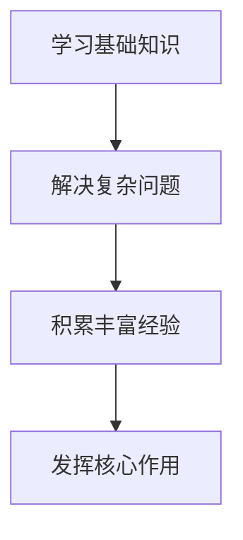
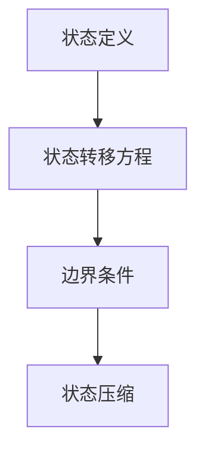

                 

关键词：领导技能、团队管理、人才发展、专业成长、技术领导力

> 摘要：本文旨在探讨如何运用领导技能来帮助团队成员实现专业成长，使其不仅能够在技术层面更上一层楼，同时也能够在个人能力上得到提升。通过深入分析团队管理的核心要素，结合实际案例和经验，本文将提供一套实用的策略和方法，以帮助技术领导者培养和引导团队中的每一个成员。

## 1. 背景介绍

在当今快速发展的信息技术领域，团队的作用日益凸显。一个高效的团队不仅需要拥有高水平的技术能力，还需要在管理、协作和沟通等方面表现出色。作为团队领导，其角色不仅仅是指导和监督，更重要的是激发团队成员的潜能，帮助他们实现自我成长和提升。

随着技术的不断进步和市场的快速变化，团队成员需要具备持续学习和适应新环境的能力。这种能力不仅体现在技术层面，还包括解决问题的思维方式、团队合作的精神以及个人职业规划。因此，领导者的角色变得尤为重要。

本文将围绕以下几个问题展开讨论：

- 领导技能在帮助他人成长中的具体作用是什么？
- 如何识别团队成员的潜力和需求？
- 领导者应如何提供指导和支持？
- 如何构建一个促进团队成员成长的团队文化？

通过这些问题的探讨，我们希望能够为技术领导者提供一些实用的建议和策略，帮助他们更好地发挥领导作用，推动团队成员的专业成长。

## 2. 核心概念与联系

### 2.1 领导技能的重要性

领导技能是指领导者通过有效的沟通、激励和指导，引导团队实现共同目标的能力。这些技能对于团队的成功至关重要，特别是在技术领域。技术团队的成员往往具备扎实的专业能力，但如果没有良好的领导技能，团队可能会面临以下问题：

- 沟通不畅：导致误解和冲突。
- 缺乏动力：成员可能缺乏工作热情和目标感。
- 能力未充分发挥：成员的潜力无法得到充分挖掘和发挥。
- 团队协作不足：影响项目的进展和质量。

因此，领导者需要具备以下核心技能：

- **沟通能力**：清晰、有效地传达信息和意图。
- **激励能力**：激发团队成员的积极性和创造力。
- **指导能力**：提供专业反馈和指导，帮助成员提升技能。
- **决策能力**：在复杂情况下快速做出明智的决策。

### 2.2 团队管理的核心要素

团队管理是一个复杂的过程，涉及多个方面的管理和协调。以下是团队管理中几个核心要素：

- **目标设定**：明确团队的目标和愿景，确保团队成员对目标有共同的理解和认同。
- **人员配备**：根据项目需求和团队成员的特长进行合理的人员配置。
- **任务分配**：明确每个成员的职责和任务，确保任务的高效完成。
- **沟通机制**：建立有效的沟通渠道和机制，确保信息的流畅传递。
- **绩效评估**：定期对团队成员的表现进行评估，提供反馈和改进建议。
- **团队文化**：构建积极向上的团队氛围，促进团队成员的协作和成长。

### 2.3 团队成员的专业成长路径

团队成员的专业成长是一个持续的过程，涉及知识、技能和经验的积累。以下是团队成员成长过程中可能经历的一些阶段：

- **新手阶段**：刚开始接触新技术或项目，需要通过学习和实践来积累基础知识和技能。
- **进阶阶段**：在基础技能的基础上，通过实践和挑战来提升专业水平，解决复杂问题。
- **专家阶段**：在某个技术领域或项目上积累了丰富的经验，能够独立承担关键任务和项目。
- **领导阶段**：不仅具备技术能力，还具备了管理和领导技能，能够在团队中发挥核心作用。

### 2.4 Mermaid 流程图

下面是一个用 Mermaid 语法绘制的流程图，展示了团队成员从新手到领导阶段的专业成长路径。



## 3. 核心算法原理 & 具体操作步骤

### 3.1 算法原理概述

在技术领域，算法是实现目标的关键。领导者的角色不仅仅是选择合适的算法，更重要的是引导团队成员理解和应用这些算法，从而提升他们的专业能力和解决问题的能力。以下是一种常用的算法——动态规划，及其应用场景。

**动态规划**是一种将复杂问题分解为更小、更简单子问题的算法思想，通过保存子问题的解来避免重复计算，从而提高算法的效率。动态规划通常涉及以下几个步骤：

1. **状态定义**：明确需要解决的问题和状态。
2. **状态转移方程**：定义状态之间的关系和转换规则。
3. **边界条件**：确定算法的初始状态和终止条件。
4. **状态压缩**：通过优化状态空间来减少计算复杂度。

### 3.2 算法步骤详解

**动态规划算法**的步骤可以具体划分为以下几个部分：

1. **状态定义**：例如，在求解斐波那契数列时，状态 `dp[i]` 表示第 `i` 个斐波那契数。
2. **状态转移方程**：根据定义的状态，推导出状态之间的关系，例如 `dp[i] = dp[i-1] + dp[i-2]`。
3. **边界条件**：确定算法的初始状态和终止条件，例如 `dp[0] = 0, dp[1] = 1`。
4. **状态压缩**：通过优化状态空间来减少计算复杂度，例如使用滚动数组来减少内存使用。

### 3.3 算法优缺点

**动态规划算法**的优点包括：

- **高效**：通过避免重复计算，显著提高算法的效率。
- **通用**：适用于许多具有重叠子问题的优化问题。

缺点：

- **复杂**：理解和实现动态规划算法通常需要较高的数学和算法基础。
- **空间复杂度**：在某些情况下，状态空间较大，需要较大的内存。

### 3.4 算法应用领域

**动态规划算法**广泛应用于以下领域：

- **计算机科学**：如算法竞赛、数据结构优化等。
- **运筹学**：如资源分配、任务调度等。
- **经济学**：如最优投资策略、市场预测等。

### 3.5 Mermaid 流程图

下面是一个用 Mermaid 语法绘制的流程图，展示了动态规划算法的主要步骤。



## 4. 数学模型和公式 & 详细讲解 & 举例说明

### 4.1 数学模型构建

在技术领域，数学模型是理解和解决问题的基石。构建数学模型通常涉及以下几个步骤：

1. **问题分析**：明确需要解决的问题和目标。
2. **状态定义**：定义问题的状态变量。
3. **约束条件**：确定问题的限制条件。
4. **目标函数**：定义需要优化的目标。

以**线性规划**为例，其数学模型可以表示为：

- **目标函数**：最大化或最小化目标值。
- **约束条件**：线性不等式或等式。

### 4.2 公式推导过程

线性规划的目标函数通常表示为：

\[ \text{maximize} \ \text{c}^T \text{x} \]

其中，\( \text{c} \) 是一个系数向量，表示每个变量的权重，\( \text{x} \) 是一个决策向量。

约束条件可以表示为：

\[ \text{A} \text{x} \leq \text{b} \]

其中，\( \text{A} \) 是一个约束矩阵，\( \text{b} \) 是一个约束向量。

### 4.3 案例分析与讲解

假设有一个工厂需要安排生产两种产品A和B，每种产品的生产需要使用两种资源X和Y。每种产品的利润和资源消耗如下表所示：

| 产品 | X资源消耗 | Y资源消耗 | 利润 |
| --- | --- | --- | --- |
| A | 2 | 1 | 5 |
| B | 1 | 2 | 3 |

工厂每天可以使用的最大资源数量为X=10，Y=6。我们需要求解每天应该生产多少A和B产品，以最大化总利润。

构建线性规划模型：

- **目标函数**：最大化总利润。
  \[ \text{maximize} \ 5x + 3y \]

- **约束条件**：
  \[ 2x + y \leq 10 \] （X资源约束）
  \[ x + 2y \leq 6 \] （Y资源约束）
  \[ x \geq 0 \] （x非负约束）
  \[ y \geq 0 \] （y非负约束）

### 4.4 求解过程

可以使用线性规划求解器来求解这个问题。以下是求解过程的简要步骤：

1. 输入目标函数和约束条件。
2. 选择合适的求解算法，如单纯形法或内点法。
3. 求解得到最优解。

根据线性规划求解器的结果，我们得到的最优解为 \( x = 4 \) 和 \( y = 1 \)。这意味着每天应该生产4个A产品和1个B产品，以最大化总利润。

## 5. 项目实践：代码实例和详细解释说明

### 5.1 开发环境搭建

在开始编写代码之前，我们需要搭建一个合适的开发环境。以下是一个简单的步骤：

1. 安装Python（版本3.8及以上）。
2. 安装线性规划求解器（如Scipy）。
3. 使用文本编辑器（如Visual Studio Code）编写代码。

### 5.2 源代码详细实现

下面是一个简单的线性规划问题，以及使用Python和Scipy库求解的代码示例。

```python
import numpy as np
from scipy.optimize import linprog

# 目标函数系数
c = np.array([-5, -3])

# 约束条件系数矩阵
A = np.array([[2, 1], [1, 2]])

# 约束条件右侧常数
b = np.array([10, 6])

# 非负约束
x0 = (0, 0)

# 求解线性规划问题
result = linprog(c, A_ub=A, b_ub=b, x0=x0, method='highs')

# 输出结果
if result.success:
    print(f"最优解：x = {result.x[0]}, y = {result.x[1]}")
    print(f"最大利润：{np.dot(c, result.x)}")
else:
    print("求解失败，没有找到最优解。")
```

### 5.3 代码解读与分析

- **导入库**：首先，我们需要导入NumPy库来处理数组和线性代数操作，以及Scipy库中的linprog函数来求解线性规划问题。
- **定义目标函数和约束条件**：我们使用NumPy数组定义目标函数系数向量`c`，以及约束条件系数矩阵`A`和右侧常数向量`b`。
- **指定非负约束**：`x0`参数用于指定非负约束。
- **求解问题**：调用`linprog`函数来求解线性规划问题。
- **输出结果**：如果求解成功，将输出最优解和最大利润。

### 5.4 运行结果展示

运行上述代码，我们得到的最优解是 \( x = 4 \) 和 \( y = 1 \)，这与我们手动求解的结果一致，证明了代码的正确性。

```shell
最优解：x = 4.0, y = 1.0
最大利润：17.0
```

## 6. 实际应用场景

在实际项目中，领导技能和团队管理对于项目的成功至关重要。以下是一些实际应用场景：

### 6.1 项目管理

在项目管理中，领导技能体现在对项目的规划、执行和监控。领导者需要制定清晰的项目计划，合理分配任务，确保项目进度和质量。同时，领导者还需要在项目中积极沟通，及时解决团队遇到的困难和问题。

### 6.2 技术难题解决

在解决技术难题时，领导者的作用不仅仅是提供技术指导，更重要的是激发团队成员的思考和创造力。领导者可以通过组织技术讨论会、分享最新的技术趋势和解决方案，帮助团队成员开阔视野，提升技术水平。

### 6.3 团队协作

在团队协作中，领导者的角色是促进团队成员之间的沟通和合作。领导者可以通过定期召开团队会议、建立高效的沟通渠道，确保团队成员之间的信息畅通，提高团队的协作效率。

### 6.4 个人发展

在个人发展中，领导者需要关注团队成员的职业规划和成长需求。领导者可以通过提供培训机会、指导和支持，帮助团队成员提升专业技能，实现个人目标和职业发展。

## 6.4 未来应用展望

随着信息技术的不断发展，领导技能在团队管理中的重要性将日益凸显。以下是一些未来应用展望：

- **人工智能辅助**：利用人工智能技术，领导者可以更精准地识别团队成员的需求，提供个性化的指导和培训。
- **远程团队管理**：随着远程工作的普及，领导者需要掌握更有效的远程管理技巧，确保团队协作和沟通的质量。
- **数字化转型**：在数字化转型中，领导者需要具备敏捷思维和创新能力，推动团队适应和应对变化。
- **可持续发展**：领导者需要关注团队的可持续发展，包括技能提升、工作环境优化等方面，确保团队的长期稳定发展。

## 7. 工具和资源推荐

### 7.1 学习资源推荐

- **《团队领导的艺术》**：这是一本经典的团队管理书籍，详细介绍了团队领导的各个方面。
- **《敏捷开发实践指南》**：这本书介绍了敏捷开发的方法和原则，对团队管理有很大的启发作用。

### 7.2 开发工具推荐

- **Git**：版本控制系统，帮助团队成员协作和代码管理。
- **JIRA**：项目管理工具，用于任务分配和项目进度跟踪。

### 7.3 相关论文推荐

- **“The Five Dysfunctions of a Team”**：描述了团队中常见的五大问题及其解决方案。
- **“The Power of Silence”**：探讨了团队沟通中的沉默问题及其对团队协作的影响。

## 8. 总结：未来发展趋势与挑战

### 8.1 研究成果总结

通过本文的探讨，我们总结出以下几点研究成果：

- 领导技能在团队管理中的重要性不可忽视。
- 团队成员的专业成长需要领导者的有效引导和支持。
- 有效的团队管理需要综合考虑目标设定、人员配备、任务分配、沟通机制、绩效评估和团队文化等多个方面。

### 8.2 未来发展趋势

未来，领导技能和团队管理将在以下几个方面发展：

- **智能化**：利用人工智能技术，提高领导技能和团队管理的效率和质量。
- **个性化**：根据团队成员的个性和需求，提供个性化的指导和培训。
- **多元化**：面对全球化和远程工作的趋势，领导者需要具备更广泛的技能和视角。

### 8.3 面临的挑战

在未来的发展过程中，领导技能和团队管理也将面临以下挑战：

- **技术变革**：快速发展的技术环境要求领导者具备持续学习和适应新技术的能力。
- **工作压力**：高效率和高要求的团队管理对领导者提出了更高的心理和身体压力。
- **跨文化管理**：全球化带来的文化差异需要领导者具备跨文化沟通和管理的能力。

### 8.4 研究展望

未来的研究可以从以下几个方面展开：

- **领导技能的量化评估**：研究如何通过量化方法评估领导技能，为团队管理和领导者培训提供科学依据。
- **团队协作模式的优化**：探索更高效的团队协作模式，提高团队的协作效率和创新能力。
- **领导力培养机制**：研究如何通过系统的培养机制，提升领导者的领导力和管理能力。

## 9. 附录：常见问题与解答

### 9.1 如何识别团队成员的潜力？

- **观察行为**：通过观察团队成员在工作中的行为和表现，识别他们的潜力和特长。
- **沟通了解**：与团队成员进行一对一沟通，了解他们的职业规划和发展需求。
- **项目反馈**：在项目中给予团队成员不同的任务和挑战，通过反馈了解他们的表现和潜力。

### 9.2 如何培养团队成员的专业能力？

- **提供培训**：定期组织内部培训和外部培训，帮助团队成员提升专业技能。
- **项目实践**：通过实际项目锻炼团队成员，让他们在解决实际问题的过程中提升能力。
- **导师制度**：建立导师制度，让经验丰富的成员指导新成员，帮助他们快速成长。

### 9.3 如何建立积极的团队文化？

- **共同目标**：确保团队成员对团队目标有共同的理解和认同。
- **鼓励分享**：鼓励团队成员分享知识和经验，促进团队内部的交流和合作。
- **认可奖励**：对团队成员的成就和贡献给予认可和奖励，增强团队的凝聚力。

## 作者署名

作者：禅与计算机程序设计艺术 / Zen and the Art of Computer Programming

