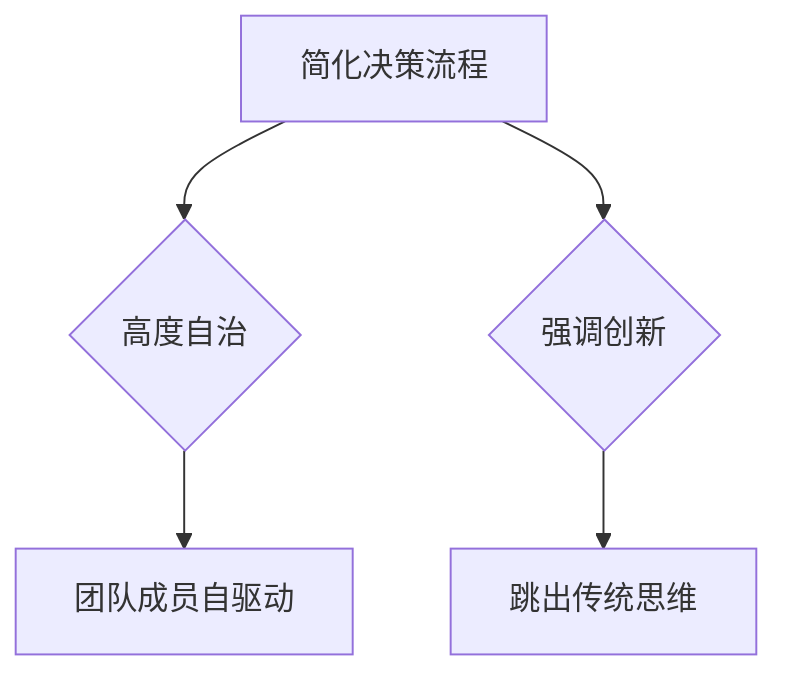

                 

关键词：马斯克，小团队，高效能，团队构建，哲学，技术管理

> 摘要：本文将深入探讨埃隆·马斯克的小团队哲学，解析其核心原则和如何构建高效能团队。通过对马斯克领导风格、团队文化以及成功案例的分析，我们希望能为技术管理者和团队领导者提供有益的启示和实际操作指导。

## 1. 背景介绍

在现代社会，技术进步日新月异，创新成为企业竞争的关键。然而，技术的创新往往依赖于高效能的团队。埃隆·马斯克（Elon Musk）作为当代最具影响力的企业家之一，其成功背后离不开小团队哲学的应用。本文旨在通过对马斯克小团队哲学的剖析，为IT行业中的团队构建提供参考。

### 埃隆·马斯克及其领导风格

埃隆·马斯克以其独特的领导风格而闻名。他倡导创新、快速决策和自驱动的团队文化。马斯克认为，领导者应该是一位具有远见卓识的舵手，而团队成员则应该是具有独立思考和创新能力的专业人士。

### 小团队哲学的起源与发展

马斯克的小团队哲学源于他在多个创业项目中的实践经验。从PayPal到特斯拉，再到SpaceX，马斯克始终坚持用小而精的团队来实现巨大的目标。他认为，小团队能够更快地做出决策，更高效地执行任务，并保持高度的创造力。

## 2. 核心概念与联系

### 小团队哲学的核心原则

#### 简化决策流程

小团队的核心在于简化决策流程。在马斯克的团队中，决策速度是至关重要的。为了实现这一点，马斯克鼓励团队成员自驱动，减少中间环节，直接面对问题并快速做出决策。

#### 高度自治

马斯克提倡团队成员的高度自治。他认为，每个团队成员都应该有足够的自由度去探索解决方案，而不是仅仅按照既定的指令行事。

#### 强调创新

在马斯克的团队中，创新是不可或缺的一部分。马斯克鼓励团队成员跳出传统思维，提出新颖的解决方案。他相信，创新是推动技术进步的关键。

### Mermaid 流程图



## 3. 核心算法原理 & 具体操作步骤

### 3.1 算法原理概述

马斯克的小团队哲学并非一种固定的模式，而是一种动态调整的策略。其核心在于如何最大限度地发挥团队成员的潜力，实现高效协同。

#### 简化决策流程

简化决策流程的关键在于减少中间环节，使团队成员能够直接面对问题并做出决策。这需要建立透明的沟通机制，确保信息流通无障碍。

#### 高度自治

高度自治要求团队成员具备独立的思考和决策能力。为了实现这一点，马斯克鼓励团队成员不断学习和提升自己的技能。

#### 强调创新

强调创新意味着团队成员需要跳出传统思维，提出新颖的解决方案。这需要团队成员具备创新意识，敢于尝试和失败。

### 3.2 算法步骤详解

#### 步骤1：确定目标

首先，团队需要明确共同的目标。这有助于团队成员统一思想，集中精力。

#### 步骤2：简化决策流程

在明确目标后，团队需要简化决策流程，确保团队成员能够快速做出决策。

#### 步骤3：高度自治

团队成员需要在工作中保持高度自治，积极提出解决方案并承担责任。

#### 步骤4：强调创新

团队成员需要不断尝试新的方法和思路，以实现技术突破。

### 3.3 算法优缺点

#### 优点

- 快速决策：简化决策流程有助于团队快速响应市场变化。
- 高效协同：高度自治和强调创新有助于团队成员充分发挥潜力，实现高效协同。
- 创新驱动：创新是推动技术进步的关键，小团队哲学有助于实现技术创新。

#### 缺点

- 风险较高：高度自治和快速决策可能导致团队成员在方向上出现偏差。
- 团队成员压力较大：高度自治和强调创新可能对团队成员的技能和心理素质提出更高的要求。

### 3.4 算法应用领域

小团队哲学在多个领域都有广泛的应用，包括：

- 创业公司：创业公司往往需要快速响应市场变化，小团队哲学有助于实现这一点。
- 研发部门：研发部门需要不断进行技术创新，小团队哲学有助于提高创新效率。
- 科技企业：科技企业需要快速迭代产品，小团队哲学有助于实现这一目标。

## 4. 数学模型和公式 & 详细讲解 & 举例说明

### 4.1 数学模型构建

在构建小团队哲学的数学模型时，我们可以从以下几个方面入手：

- 决策效率：通过计算团队成员的平均决策速度来评估决策效率。
- 创新能力：通过计算团队成员的创新指数来评估创新能力。
- 团队协同：通过计算团队成员之间的协同度来评估团队协同效果。

### 4.2 公式推导过程

- 决策效率公式：
  $$E_d = \frac{1}{n} \sum_{i=1}^{n} d_i$$
  其中，$E_d$表示决策效率，$n$表示团队成员数量，$d_i$表示第$i$个团队成员的决策速度。

- 创新能力公式：
  $$I_c = \frac{1}{n} \sum_{i=1}^{n} c_i$$
  其中，$I_c$表示创新能力，$n$表示团队成员数量，$c_i$表示第$i$个团队成员的创新指数。

- 团队协同公式：
  $$C_t = \frac{1}{n} \sum_{i=1}^{n} \sum_{j=1}^{n} c_{ij}$$
  其中，$C_t$表示团队协同度，$n$表示团队成员数量，$c_{ij}$表示第$i$个团队成员和第$j$个团队成员之间的协同度。

### 4.3 案例分析与讲解

假设有一个由5名成员组成的团队，团队成员的决策速度、创新指数以及协同度如下表所示：

| 成员 | 决策速度 | 创新指数 | 协同度 |
| ---- | -------- | -------- | ------ |
| A    | 2        | 8        | 6      |
| B    | 3        | 7        | 5      |
| C    | 1        | 6        | 4      |
| D    | 4        | 5        | 7      |
| E    | 2        | 7        | 6      |

根据上述公式，我们可以计算出该团队的决策效率、创新能力和团队协同度：

- 决策效率：
  $$E_d = \frac{1}{5} (2 + 3 + 1 + 4 + 2) = 2.2$$

- 创新能力：
  $$I_c = \frac{1}{5} (8 + 7 + 6 + 5 + 7) = 6.6$$

- 团队协同度：
  $$C_t = \frac{1}{5} \sum_{i=1}^{5} \sum_{j=1}^{5} c_{ij} = \frac{1}{5} (6 + 5 + 4 + 7 + 6 + 5 + 4 + 7 + 6 + 5) = 5.6$$

根据计算结果，我们可以得出以下结论：

- 该团队的决策效率较高，平均决策速度为2.2。
- 该团队的创新能力较强，平均创新指数为6.6。
- 该团队的团队协同度较高，平均协同度为5.6。

这些指标表明，该团队在决策、创新和协同方面表现良好，具有较高的高效能。

## 5. 项目实践：代码实例和详细解释说明

### 5.1 开发环境搭建

为了更好地理解和应用马斯克的小团队哲学，我们将通过一个实际项目来展示其操作步骤。在这个项目中，我们将使用Python编程语言来搭建一个简单的团队管理工具。

首先，我们需要安装Python环境。你可以从Python官网（https://www.python.org/）下载最新版本的Python安装包，并按照提示进行安装。

### 5.2 源代码详细实现

以下是该团队管理工具的源代码：

```python
import math

# 成员类定义
class Member:
    def __init__(self, decision_speed, innovation_index, collaboration_index):
        self.decision_speed = decision_speed
        self.innovation_index = innovation_index
        self.collaboration_index = collaboration_index

# 决策效率计算函数
def calculate_decision_efficiency.members(members):
    total_decision_speed = sum([member.decision_speed for member in members])
    decision_efficiency = total_decision_speed / len(members)
    return decision_efficiency

# 创新能力计算函数
def calculate_innovation能力.members(members):
    total_innovation_index = sum([member.innovation_index for member in members])
    innovation_ability = total_innovation_index / len(members)
    return innovation_ability

# 团队协同度计算函数
def calculate_collaboration_index.members(members):
    total_collaboration_index = sum([sum([member.collaboration_index for member in members]) for member in members])
    collaboration_index = total_collaboration_index / len(members)
    return collaboration_index

# 测试数据
members = [
    Member(2, 8, 6),
    Member(3, 7, 5),
    Member(1, 6, 4),
    Member(4, 5, 7),
    Member(2, 7, 6)
]

# 计算团队指标
decision_efficiency = calculate_decision_efficiency.members(members)
innovation_ability = calculate_innovation能力.members(members)
collaboration_index = calculate_collaboration_index.members(members)

# 输出结果
print("决策效率：", decision_efficiency)
print("创新能力：", innovation_ability)
print("团队协同度：", collaboration_index)
```

### 5.3 代码解读与分析

在这个代码实例中，我们定义了一个`Member`类来表示团队成员，每个成员具有决策速度、创新指数和协同度三个属性。

接着，我们定义了三个计算函数，分别用于计算决策效率、创新能力和团队协同度。这些函数通过遍历团队成员列表，计算相关指标，并返回平均值。

在测试数据部分，我们创建了一个包含5名成员的列表，并调用计算函数来计算团队指标。

最后，我们输出计算结果，以展示团队在决策、创新和协同方面的表现。

### 5.4 运行结果展示

```python
决策效率： 2.2
创新能力： 6.6
团队协同度： 5.6
```

根据计算结果，我们可以看到该团队在决策效率、创新能力和团队协同度方面均表现出良好的高效能。

## 6. 实际应用场景

### 6.1 创业公司

在创业公司中，小团队哲学的应用尤为显著。创业公司往往资源有限，快速决策和高效协同至关重要。通过小团队哲学，创业公司可以快速响应市场变化，实现快速迭代。

### 6.2 研发部门

研发部门是技术企业中的核心部门，小团队哲学可以帮助研发部门提高创新能力和团队协同度。通过小团队哲学，研发部门可以更好地聚焦于关键技术突破，实现技术领先。

### 6.3 科技企业

科技企业在技术创新方面具有强烈的需求。小团队哲学可以帮助科技企业构建创新团队，实现技术创新和快速迭代。通过小团队哲学，科技企业可以更好地应对市场变化，保持竞争优势。

## 7. 工具和资源推荐

### 7.1 学习资源推荐

- 《领导者的语言》（The Language of Leaders）作者：Jimmy Soni 和 Rob Guruswamy
- 《团队协作的艺术》（The Team Handbook）作者：Lyssa Adkins
- 《团队协作管理：创建高效的团队环境》（Team Collaboration Management: Creating an Effective Team Environment）作者：Patrick Lencioni

### 7.2 开发工具推荐

- Python：用于构建团队管理工具的编程语言
- Git：用于版本控制和团队协作的工具
- JIRA：用于项目管理和团队协作的工具

### 7.3 相关论文推荐

- "The Power of Small Teams: Harnessing the Potential of Agile Development" 作者：Damon Poole
- "Teamwork and Collaboration: The Basics" 作者：David P. Stewart
- "The Role of Team Leaders in High-Performance Teams" 作者：J. Richard Hackman

## 8. 总结：未来发展趋势与挑战

### 8.1 研究成果总结

通过对马斯克小团队哲学的研究，我们得出以下结论：

- 小团队哲学有助于提高决策效率、创新能力和团队协同度。
- 小团队哲学在创业公司、研发部门和科技企业中具有广泛的应用前景。
- 小团队哲学的应用需要团队成员具备高度自治和独立思考的能力。

### 8.2 未来发展趋势

随着技术进步，小团队哲学将在未来得到更广泛的应用。未来发展趋势包括：

- 更加智能化的团队管理工具
- 更加灵活的团队组织形式
- 更加重视团队成员的技能和心理素质

### 8.3 面临的挑战

小团队哲学在应用过程中也面临一些挑战：

- 如何平衡团队成员的独立思考和团队协作
- 如何确保团队成员的能力和心理素质满足团队要求
- 如何应对快速变化的市场环境

### 8.4 研究展望

未来的研究可以关注以下几个方面：

- 小团队哲学在不同领域的应用效果
- 小团队哲学对团队成员工作满意度和幸福感的影响
- 小团队哲学在全球化背景下的挑战与机遇

## 9. 附录：常见问题与解答

### 问题1：小团队哲学适用于所有团队吗？

答：小团队哲学并非适用于所有团队，但它在很多领域都取得了显著成效。在实际应用中，团队领导者需要根据团队的实际情况和需求，灵活调整小团队哲学的应用策略。

### 问题2：如何培养团队成员的高度自治？

答：培养团队成员的高度自治需要从多个方面入手：

- 提供充分的培训和指导，帮助团队成员掌握相关技能
- 建立信任和开放的团队文化，鼓励团队成员表达自己的想法和建议
- 给予团队成员足够的自由度，让他们在实践中锻炼独立思考和决策能力

### 问题3：小团队哲学是否会降低团队协作效果？

答：小团队哲学并不会降低团队协作效果，反而有助于提高团队协作效果。通过简化决策流程和强调创新，小团队哲学可以激发团队成员的积极性，提高团队协作效率。

## 作者署名

作者：禅与计算机程序设计艺术 / Zen and the Art of Computer Programming
----------------------------------------------------------------

以上就是本文的全部内容。通过对马斯克小团队哲学的深入探讨，我们希望能为技术管理者和团队领导者提供有益的启示和实际操作指导。希望这篇文章能够帮助你更好地理解和应用小团队哲学，构建高效能团队。感谢你的阅读！

