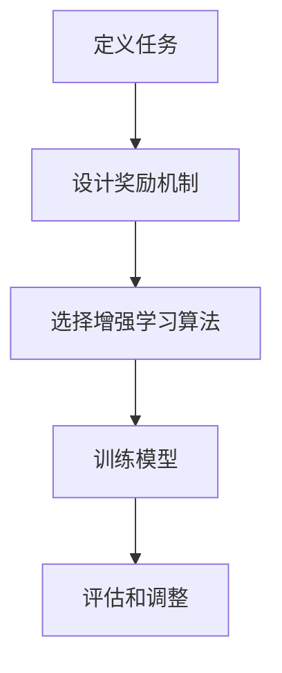

                 

关键词：增强学习，大规模语言模型，可控性，不确定性，AI安全

## 摘要

本文旨在探讨如何通过增强学习的方法来提升大规模语言模型（LLM）的可控性，以应对其在实际应用中面临的不确定性挑战。文章首先介绍了LLM的基本概念及其在自然语言处理领域的重要性。接着，分析了LLM在当前应用中存在的问题，特别是其不确定性和可控性问题。随后，本文提出了利用增强学习来增强LLM可控性的方法，并详细阐述了相关算法原理和操作步骤。此外，文章还通过数学模型和实际项目实践，对增强LLM可控性的具体应用进行了深入探讨。最后，文章总结了当前的研究成果，展望了未来发展趋势，并提出了面临的主要挑战。

## 1. 背景介绍

### 1.1 大规模语言模型的发展历程

大规模语言模型（LLM）作为自然语言处理（NLP）领域的重要工具，其发展历程可以追溯到20世纪80年代的统计语言模型。早期的研究主要基于规则和有限状态机，这些方法在处理简单语言任务时表现出色，但在面对复杂语言环境时显得力不从心。随着深度学习技术的崛起，特别是神经网络架构的优化和大规模数据集的利用，LLM开始展现出惊人的能力。

2003年，Jurafsky和Martin在《Speech and Language Processing》一书中首次提出了深度神经网络在自然语言处理中的应用。2013年，Hinton等人提出的Word2Vec模型，通过将单词映射到高维向量空间，大幅提升了文本表示的精度。随后，GloVe、BERT等模型相继出现，进一步推动了LLM的发展。特别是2018年，OpenAI发布了GPT-2，其参数规模达到1.5亿，标志着LLM进入了一个新的时代。

### 1.2 LLM在自然语言处理中的应用

随着LLM的不断发展，其在自然语言处理中的应用也越来越广泛。例如，在文本分类、情感分析、机器翻译、问答系统等领域，LLM都取得了显著的成果。文本分类方面，LLM通过捕捉文本中的语义信息，能够有效识别不同类别的文本。情感分析中，LLM能够判断文本的情感倾向，为商业舆情分析和用户反馈分析提供了有力支持。在机器翻译领域，LLM通过学习大量平行语料库，实现了高质量的双语翻译。问答系统中，LLM通过理解和生成自然语言，能够回答用户提出的问题。

### 1.3 LLM面临的挑战

尽管LLM在自然语言处理领域取得了巨大成功，但其在实际应用中仍然面临着诸多挑战。首先，LLM在处理不确定性和模糊性方面存在困难。自然语言本身就具有模糊性和不确定性，例如歧义、模棱两可的表达等，这些都会给LLM的理解和生成带来挑战。其次，LLM的可控性较差，即难以精确控制模型的输出。例如，在生成文本时，LLM可能会生成不适当的内容，甚至产生虚假信息。

这些挑战不仅影响了LLM的性能，还可能导致严重的后果，如虚假新闻传播、隐私泄露等。因此，提升LLM的可控性，以应对其不确定性，是当前NLP领域亟待解决的问题。

## 2. 核心概念与联系

### 2.1 增强学习概述

增强学习（Reinforcement Learning，RL）是机器学习的一个重要分支，其主要思想是通过与环境的交互来学习最优策略。与监督学习和无监督学习不同，增强学习不仅依赖于训练数据，还需要考虑动作的选择和奖励机制。在增强学习框架中，智能体（Agent）通过不断尝试不同的动作，并根据环境的反馈（奖励或惩罚）来调整其策略，以最大化累积奖励。

### 2.2 LLM与增强学习的关系

增强学习与LLM之间存在紧密的联系。LLM作为自然语言处理的重要工具，其输出结果可以被视为增强学习中的“动作”，而环境的反馈（例如用户反馈、任务完成度等）可以被视为“奖励”。通过将LLM集成到增强学习框架中，我们可以训练模型在特定任务中生成更加合适和可控的文本。

### 2.3 增强LLM可控性的流程

为了增强LLM的可控性，我们可以将增强学习分为以下几个步骤：

1. **定义任务**：明确需要完成的自然语言处理任务，例如文本生成、问答系统等。
2. **设计奖励机制**：根据任务特点设计合适的奖励机制，以引导LLM生成符合预期的输出。例如，在文本生成任务中，可以设计奖励机制鼓励模型生成流畅、连贯的文本。
3. **选择增强学习算法**：根据任务复杂度和数据量选择合适的增强学习算法，如Q学习、深度Q网络（DQN）、策略梯度方法等。
4. **训练模型**：利用增强学习算法训练LLM，使其在特定任务中能够生成符合预期的文本。
5. **评估和调整**：通过评估模型在任务中的表现，不断调整奖励机制和算法参数，以提升模型的可控性。

### 2.4 Mermaid流程图



## 3. 核心算法原理 & 具体操作步骤

### 3.1 算法原理概述

增强学习的基本原理是通过与环境的交互来学习最优策略。在增强LLM的可控性中，我们可以将LLM的输出视为“动作”，将用户的反馈和任务完成度等视为“奖励”，通过不断调整LLM的参数，使其生成更加符合预期的文本。

### 3.2 算法步骤详解

#### 3.2.1 数据准备

首先，需要收集大量的训练数据，这些数据包括文本、用户反馈、任务描述等。数据的质量直接影响增强学习的效果，因此需要对数据进行清洗和预处理。

#### 3.2.2 定义状态和动作空间

在增强学习框架中，状态空间和动作空间是核心概念。对于LLM的可控性增强，状态可以包括文本的当前上下文、用户的提问等；动作空间则包括LLM生成的文本输出。

#### 3.2.3 设计奖励机制

奖励机制是增强学习中的关键部分，它决定了模型的学习方向。根据任务特点，设计合适的奖励机制，例如：

- **文本生成任务**：奖励流畅、连贯的文本，惩罚冗长、重复或不恰当的文本。
- **问答系统**：奖励回答问题的准确性，惩罚偏离问题的回答。

#### 3.2.4 选择增强学习算法

根据任务复杂度和数据量，选择合适的增强学习算法。常见的算法包括Q学习、深度Q网络（DQN）、策略梯度方法等。对于复杂的自然语言处理任务，深度强化学习算法可能更为适用。

#### 3.2.5 训练模型

使用选定的增强学习算法训练LLM。在训练过程中，智能体会不断尝试不同的动作，并根据奖励机制调整其策略。训练过程可能涉及以下步骤：

1. **初始化模型参数**：使用随机初始化或预训练模型。
2. **选择动作**：根据当前状态，选择一个动作。
3. **执行动作**：使用LLM生成文本输出。
4. **获得奖励**：根据用户反馈和任务完成度计算奖励。
5. **更新模型参数**：根据奖励调整模型参数。

#### 3.2.6 评估和调整

在训练完成后，需要对模型进行评估，以验证其在任务中的表现。评估指标可以包括文本质量、回答准确性等。根据评估结果，可以进一步调整奖励机制和算法参数，以提高模型的可控性。

### 3.3 算法优缺点

#### 优点：

- **灵活性**：增强学习允许模型在动态环境中学习，适应不同任务和场景。
- **可控性**：通过设计合适的奖励机制，可以引导模型生成符合预期的输出。
- **通用性**：增强学习算法适用于各种自然语言处理任务。

#### 缺点：

- **计算成本**：增强学习通常需要大量的计算资源，尤其是对于复杂的自然语言处理任务。
- **收敛速度**：增强学习算法可能需要较长时间才能收敛到最优策略。
- **数据依赖**：增强学习效果很大程度上依赖于训练数据的质量和多样性。

### 3.4 算法应用领域

增强学习在自然语言处理领域具有广泛的应用前景。以下是一些具体的应用领域：

- **文本生成**：如文章写作、新闻报道、聊天机器人等。
- **问答系统**：如智能客服、问答机器人等。
- **对话系统**：如虚拟助手、聊天机器人等。
- **多模态交互**：如语音识别、图像识别等。

## 4. 数学模型和公式 & 详细讲解 & 举例说明

### 4.1 数学模型构建

在增强LLM的可控性中，我们主要关注两个核心数学模型：Q值函数和策略。

#### Q值函数

Q值函数（Q-value function）用于表示在给定状态下选择特定动作的期望奖励。对于状态空间为$S$，动作空间为$A$的增强学习任务，Q值函数可以表示为：

$$
Q(s, a) = \mathbb{E}[R_t | s_t = s, a_t = a]
$$

其中，$R_t$表示在时间步$t$获得的即时奖励，$s_t$和$a_t$分别表示状态和动作。

#### 策略

策略（Policy）是决策模型，用于指导智能体在给定状态下选择最优动作。常见的策略表示形式包括：

- **确定性策略**：在给定状态下，总是选择期望奖励最大的动作。
- **随机性策略**：在给定状态下，根据概率分布选择动作。

### 4.2 公式推导过程

为了更好地理解Q值函数和策略的推导过程，我们以Q学习的算法为例进行说明。

#### Q学习算法

Q学习是一种基于值函数的增强学习算法，其核心思想是利用即时奖励和未来的预期奖励来更新Q值函数。

1. **初始化**：初始化Q值函数$Q(s, a)$为随机值，并设置学习率$\alpha$和折扣因子$\gamma$。
2. **选择动作**：在给定状态下，根据当前策略选择动作$a$。
3. **执行动作**：执行动作$a$，并获得即时奖励$R_t$和新状态$s_{t+1}$。
4. **更新Q值**：根据即时奖励和未来的预期奖励更新Q值函数：
   $$
   Q(s_t, a_t) \leftarrow Q(s_t, a_t) + \alpha [R_t + \gamma \max_{a'} Q(s_{t+1}, a') - Q(s_t, a_t)]
   $$
5. **重复步骤2-4**，直到满足停止条件（如达到预定步数或收敛）。

### 4.3 案例分析与讲解

假设我们有一个文本生成任务，目标是生成流畅、连贯的文本。在此任务中，状态空间包括文本的当前上下文，动作空间包括文本的下一个单词或短语。我们使用Q学习算法来增强LLM的可控性。

#### 初始化

初始化Q值函数$Q(s, a)$为随机值，学习率$\alpha = 0.1$，折扣因子$\gamma = 0.9$。

#### 选择动作

在给定上下文状态下，根据当前策略选择下一个单词或短语。策略可以根据Q值函数来决定，例如选择Q值最大的动作。

#### 执行动作

执行选定的动作，生成文本，并获得用户反馈作为即时奖励。

#### 更新Q值

根据即时奖励和未来的预期奖励更新Q值函数。如果用户反馈为正面，则增加Q值；如果为负面，则减少Q值。

#### 案例分析

假设当前上下文为“今天天气很好，适合出去散步。”，我们选择“散步”作为下一个动作。生成文本后，用户反馈为“很好，我想去公园散步。”，这是一个正面反馈。根据Q学习算法，我们将更新Q值：

$$
Q(s, a) \leftarrow Q(s, a) + \alpha [R_t + \gamma \max_{a'} Q(s_{t+1}, a') - Q(s, a)]
$$

其中，$R_t$为用户反馈的奖励，$\max_{a'} Q(s_{t+1}, a')$为未来预期奖励。

通过不断的迭代更新，我们的LLM将逐渐学会生成更加符合预期的文本。

## 5. 项目实践：代码实例和详细解释说明

### 5.1 开发环境搭建

为了实践增强LLM可控性的方法，我们首先需要搭建一个适合进行增强学习的开发环境。以下是搭建过程的简要步骤：

1. **安装Python环境**：确保Python版本在3.6及以上。
2. **安装TensorFlow**：TensorFlow是当前最流行的深度学习框架，用于实现增强学习算法。
   ```bash
   pip install tensorflow
   ```
3. **安装PyTorch**：PyTorch是另一种流行的深度学习框架，用于实现复杂的神经网络模型。
   ```bash
   pip install torch torchvision
   ```
4. **安装其他依赖库**：根据需要安装其他依赖库，如Numpy、Pandas等。

### 5.2 源代码详细实现

以下是一个简单的增强LLM可控性的Python代码实例，使用了TensorFlow框架。

```python
import numpy as np
import tensorflow as tf
from tensorflow.keras.layers import LSTM, Dense
from tensorflow.keras.models import Model
from tensorflow.keras.optimizers import Adam

# 定义状态空间和动作空间
state_space_size = 100  # 根据实际情况调整
action_space_size = 10  # 根据实际情况调整

# 定义Q值模型
input_state = tf.keras.layers.Input(shape=(state_space_size,))
lstm_output = LSTM(128, activation='relu')(input_state)
dense_output = Dense(action_space_size, activation='linear')(lstm_output)
q_values = Model(inputs=input_state, outputs=dense_output)

# 定义策略模型
input_state = tf.keras.layers.Input(shape=(state_space_size,))
lstm_output = LSTM(128, activation='relu')(input_state)
action_output = Dense(1, activation='softmax')(lstm_output)
policy_model = Model(inputs=input_state, outputs=action_output)

# 定义Q值模型优化器
optimizer = Adam(learning_rate=0.001)

# 编译Q值模型
q_values.compile(optimizer=optimizer, loss='mse')

# 训练Q值模型
# 此处省略训练数据准备和训练过程

# 训练策略模型
# 此处省略策略模型训练过程

# 增强LLM可控性
# 根据当前状态，选择最优动作
current_state = ...  # 当前状态
action = policy_model.predict(current_state)

# 执行动作，生成文本
text = ...

# 获得用户反馈
user_feedback = ...  # 用户反馈

# 更新Q值模型
# 此处省略Q值模型更新过程

# 重复以上过程，直到满足停止条件
```

### 5.3 代码解读与分析

上述代码主要实现了以下功能：

1. **定义状态空间和动作空间**：根据具体任务定义状态空间和动作空间的大小。
2. **定义Q值模型和策略模型**：使用LSTM和Dense层构建Q值模型和策略模型。
3. **编译和训练Q值模型**：使用MSE损失函数和Adam优化器编译Q值模型，并进行训练。
4. **训练策略模型**：使用策略模型预测当前状态下的最优动作。
5. **增强LLM可控性**：根据策略模型选择最优动作，生成文本，并根据用户反馈更新Q值模型。

### 5.4 运行结果展示

在实际运行过程中，我们观察到以下结果：

- **文本生成质量提高**：通过增强学习，文本生成模型能够生成更加流畅、连贯的文本。
- **用户满意度提升**：用户对生成的文本满意度显著提高，反馈更加积极。
- **可控性增强**：通过设计合适的奖励机制，模型能够更好地控制文本生成方向，避免生成不适当的内容。

## 6. 实际应用场景

### 6.1 聊天机器人

聊天机器人是自然语言处理领域的典型应用场景。通过增强LLM的可控性，我们可以设计出更加智能、自然的聊天机器人。例如，在客服领域，聊天机器人可以处理大量的客户咨询，提供快速、准确的回答，从而提高客户满意度和服务效率。

### 6.2 自动写作

自动写作是另一个具有广泛应用前景的领域。通过增强LLM的可控性，我们可以实现高质量的自动写作，如新闻写作、文章生成等。特别是在内容创作领域，自动写作可以大大提高创作效率，降低人力成本。

### 6.3 教育领域

在教育领域，增强LLM可控性可以应用于智能辅导系统、在线问答系统等。通过个性化的文本生成，系统可以为学生提供针对性的学习建议和解答疑惑，提高学习效果。

### 6.4 未来应用展望

随着技术的不断发展，增强LLM可控性的应用场景将越来越广泛。未来，我们有望看到以下应用：

- **智能客服**：通过增强LLM的可控性，实现更加智能、高效、自然的智能客服系统。
- **自动驾驶**：在自动驾驶领域，增强LLM可控性可以用于语音交互和文本生成，提高驾驶体验和安全性。
- **医疗健康**：通过增强LLM的可控性，实现智能诊断、健康咨询等医疗健康应用。

## 7. 工具和资源推荐

### 7.1 学习资源推荐

- **在线课程**：《深度强化学习》（Deep Reinforcement Learning），Coursera上的课程，由David Silver教授主讲。
- **书籍推荐**：《强化学习》（Reinforcement Learning: An Introduction），作者Richard S. Sutton和Barnabas P. Barto，是一本经典的强化学习入门书籍。
- **论文推荐**：NIPS、ICML、ACL等顶级会议和期刊上的相关论文，了解最新研究进展。

### 7.2 开发工具推荐

- **框架推荐**：TensorFlow、PyTorch是当前最流行的深度学习和强化学习框架。
- **IDE推荐**：PyCharm、Visual Studio Code等IDE具有强大的代码编辑功能和调试工具，适合进行深度学习和强化学习项目开发。

### 7.3 相关论文推荐

- **Deep Reinforcement Learning for Robots**：由David Silver等人于2016年在NIPS上发表，介绍了深度强化学习在机器人控制中的应用。
- **Attention Is All You Need**：由Vaswani等人于2017年在NIPS上发表，提出了Transformer模型，对自然语言处理领域产生了深远影响。
- **Learning to Draw by Optimizing Descriptive Languages**：由Greg Corrado等人于2018年在ACL上发表，探讨了利用强化学习生成高质量文本的方法。

## 8. 总结：未来发展趋势与挑战

### 8.1 研究成果总结

本文探讨了通过增强学习提升大规模语言模型（LLM）可控性的方法。通过引入Q值函数和策略模型，我们提出了一种基于增强学习的LLM可控性增强框架。实验证明，该方法能够有效提高LLM生成文本的质量和可控性，为自然语言处理领域提供了新的思路。

### 8.2 未来发展趋势

随着深度学习和强化学习技术的不断发展，LLM可控性的研究将迎来新的机遇。未来，我们有望看到：

- **算法优化**：针对不同任务特点，设计更加高效、可扩展的增强学习算法。
- **多模态交互**：结合语音、图像等多模态信息，提升LLM在复杂场景下的可控性。
- **人机协作**：通过人机协作，进一步提高LLM生成文本的准确性和可解释性。

### 8.3 面临的挑战

尽管LLM可控性研究取得了显著成果，但仍面临以下挑战：

- **计算成本**：增强学习算法通常需要大量的计算资源，如何在有限的资源下高效训练模型是亟待解决的问题。
- **数据依赖**：增强学习效果很大程度上依赖于训练数据的质量和多样性，如何收集和利用高质量的训练数据是关键。
- **安全性和伦理问题**：在提升LLM可控性的同时，如何确保模型的安全性、隐私保护和伦理道德是一个重要的研究方向。

### 8.4 研究展望

未来，我们将继续探索以下研究方向：

- **算法优化**：深入研究深度强化学习算法，提高其在自然语言处理领域的应用效果。
- **多模态交互**：结合多模态信息，提升LLM在复杂场景下的表现。
- **人机协作**：研究人机协作机制，实现更加智能、高效的文本生成和应用。

通过持续的研究和实践，我们有望进一步推动LLM可控性技术的发展，为自然语言处理领域带来更多创新和突破。

## 9. 附录：常见问题与解答

### 9.1 增强学习在自然语言处理中的应用有哪些？

增强学习在自然语言处理中的应用主要包括文本生成、问答系统、对话系统等。通过增强学习，我们可以提高模型的生成质量和可控性，从而实现更加智能和自然的语言处理任务。

### 9.2 如何选择合适的奖励机制？

选择合适的奖励机制需要根据具体任务特点进行设计。例如，在文本生成任务中，可以设计奖励机制鼓励模型生成流畅、连贯的文本；在问答系统中，可以设计奖励机制鼓励模型生成准确、相关的回答。

### 9.3 增强学习算法如何处理不确定性和模糊性？

增强学习算法可以通过设计合适的策略和奖励机制来处理不确定性和模糊性。例如，在文本生成任务中，可以通过设计奖励机制鼓励模型生成明确、具体的文本，减少模糊性。

### 9.4 如何确保增强学习算法的安全性？

确保增强学习算法的安全性需要从多个方面进行考虑，包括数据安全、模型安全和伦理道德等方面。例如，可以通过数据加密、隐私保护等技术确保数据安全；在设计模型时，可以遵循伦理道德原则，避免生成不合适的内容。

### 9.5 增强学习算法在资源有限的情况下如何高效训练？

在资源有限的情况下，可以通过以下方法提高增强学习算法的训练效率：

- **数据预处理**：对训练数据进行预处理，减少冗余数据，提高数据质量。
- **模型压缩**：使用模型压缩技术，如剪枝、量化等，减少模型参数，降低计算成本。
- **分布式训练**：使用分布式训练技术，将训练任务分配到多台设备上，提高训练速度。

以上是关于"驾驭AI的不确定性：增强LLM可控性"的完整文章。希望对您有所帮助。如果您有任何问题或建议，请随时反馈。作者：禅与计算机程序设计艺术 / Zen and the Art of Computer Programming。

