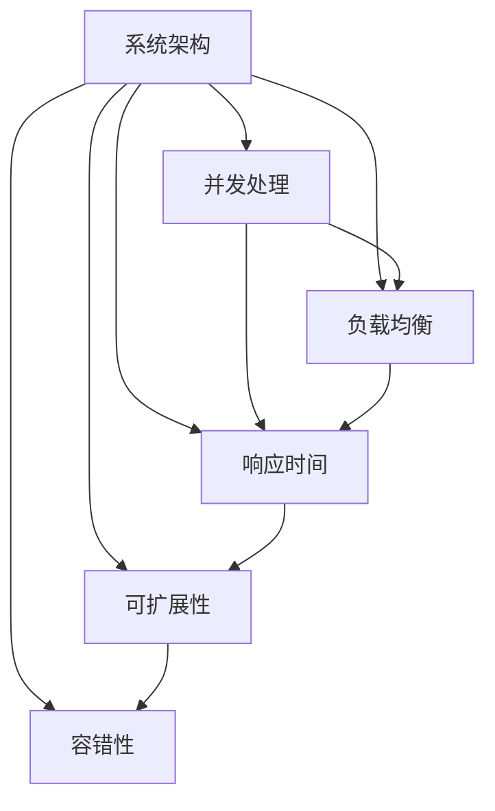

                 

关键词：高吞吐量系统、设计原则、性能优化、实例分析、系统架构、并发处理、负载均衡、响应时间、可扩展性、容错性

> 摘要：本文将探讨高吞吐量系统设计的核心原则和实践方法，通过实际案例深入分析系统架构、并发处理、负载均衡、响应时间和可扩展性等方面，为开发高吞吐量系统提供有价值的参考和指导。

## 1. 背景介绍

在当今的互联网时代，高吞吐量系统设计已经成为各大企业争相追求的目标。随着业务量的不断增长，系统需要处理海量请求，保证低延迟和高并发性能。然而，实现高吞吐量并非易事，需要系统设计者深入理解系统的各个方面，并进行全面的优化和调整。

本文旨在通过实例分析，详细探讨高吞吐量系统设计的核心原则和实践方法，帮助开发者更好地理解和实现高吞吐量系统。我们将从以下几个方面展开讨论：

1. **核心概念与联系**：介绍高吞吐量系统设计中的关键概念和它们之间的相互关系。
2. **核心算法原理与具体操作步骤**：阐述高吞吐量系统设计中常用的算法原理和操作步骤。
3. **数学模型和公式**：介绍高吞吐量系统设计中的数学模型和公式，并进行详细讲解和举例说明。
4. **项目实践**：通过具体代码实例，详细解释高吞吐量系统的实现过程。
5. **实际应用场景**：分析高吞吐量系统在实际应用场景中的表现和未来应用前景。
6. **工具和资源推荐**：推荐相关学习资源、开发工具和论文，以供进一步学习研究。
7. **总结与展望**：总结研究成果，探讨未来发展趋势和面临的挑战。

## 2. 核心概念与联系

在讨论高吞吐量系统设计时，我们需要了解以下几个核心概念及其相互关系：

### 2.1 系统架构

系统架构是指系统的整体设计和组织结构，它决定了系统的性能和可扩展性。高吞吐量系统通常采用分布式架构，将系统拆分成多个模块，通过负载均衡和并发处理，实现高效的资源利用和任务分配。

### 2.2 并发处理

并发处理是指同时处理多个请求的能力。高吞吐量系统需要高效地并发处理大量请求，以减少响应时间和提高系统吞吐量。常用的并发处理技术包括线程池、异步编程和多进程等。

### 2.3 负载均衡

负载均衡是指将请求分配到多个服务器或实例上，以实现资源的均衡利用和避免单点瓶颈。负载均衡策略包括轮询、最小连接数、哈希等。

### 2.4 响应时间

响应时间是指系统处理请求并返回结果所需的时间。高吞吐量系统需要尽可能降低响应时间，以提高用户体验和系统性能。

### 2.5 可扩展性

可扩展性是指系统能够根据需求动态调整资源和使用能力。高吞吐量系统需要具备良好的可扩展性，以便在业务增长时能够快速扩展。

### 2.6 容错性

容错性是指系统能够在发生故障时保持正常运行的能力。高吞吐量系统需要具备容错性，以避免因故障导致的系统瘫痪。

以下是一个使用Mermaid绘制的流程图，展示了这些核心概念之间的联系：



## 3. 核心算法原理与具体操作步骤

### 3.1 算法原理概述

在高吞吐量系统设计中，核心算法原理至关重要。以下介绍几种常用的算法原理：

### 3.1.1 分而治之（Divide and Conquer）

分而治之是一种常用的算法设计思想，将大问题分解成小问题，独立解决后再合并结果。该算法可以有效地提高系统并发处理能力。

### 3.1.2 动态规划（Dynamic Programming）

动态规划是一种优化算法，通过记录子问题的解来避免重复计算，提高计算效率。该算法适用于解决具有重叠子问题的优化问题。

### 3.1.3 线程池（ThreadPool）

线程池是一种管理线程的池化技术，可以减少线程创建和销毁的开销，提高系统并发处理能力。

### 3.1.4 负载均衡（Load Balancing）

负载均衡是一种分配请求到多个服务器或实例的算法，以实现资源的均衡利用。常见的负载均衡算法包括轮询、最小连接数和哈希等。

### 3.2 算法步骤详解

### 3.2.1 分而治之

1. 将大问题分解成若干个小问题。
2. 独立解决每个小问题。
3. 将小问题的解合并成最终结果。

### 3.2.2 动态规划

1. 确定状态和状态转移方程。
2. 初始化边界条件。
3. 根据状态转移方程计算状态值。

### 3.2.3 线程池

1. 创建线程池，设置线程数量。
2. 接收任务，将任务分配到线程池中的线程。
3. 线程执行任务，并返回结果。

### 3.2.4 负载均衡

1. 收集服务器或实例的负载信息。
2. 根据负载信息选择合适的服务器或实例。
3. 将请求分配到选定的服务器或实例。

### 3.3 算法优缺点

#### 3.3.1 分而治之

**优点**：提高系统并发处理能力，降低复杂度。

**缺点**：可能产生大量子问题，增加内存开销。

#### 3.3.2 动态规划

**优点**：避免重复计算，提高计算效率。

**缺点**：需要明确状态和状态转移方程，适用范围有限。

#### 3.3.3 线程池

**优点**：减少线程创建和销毁的开销，提高并发处理能力。

**缺点**：线程数量过多可能导致系统性能下降。

#### 3.3.4 负载均衡

**优点**：实现资源均衡利用，避免单点瓶颈。

**缺点**：负载均衡策略复杂，可能影响性能。

### 3.4 算法应用领域

分而治之、动态规划、线程池和负载均衡等算法在高吞吐量系统设计中具有广泛的应用，如分布式计算、搜索引擎、并发数据处理和Web应用等。

## 4. 数学模型和公式

在高吞吐量系统设计中，数学模型和公式有助于分析和优化系统性能。以下介绍一些常用的数学模型和公式：

### 4.1 数学模型构建

#### 4.1.1 请求处理模型

假设系统接收到的请求服从泊松分布，每秒平均请求量为λ，处理一个请求的平均时间为μ。

#### 4.1.2 负载均衡模型

假设有n个服务器或实例，每个实例的处理能力相同，平均处理时间相同。

### 4.2 公式推导过程

#### 4.2.1 请求处理模型

系统吞吐量Q = λ/μ

系统响应时间T = 1/μ

系统利用率ρ = λ/(μ^2)

#### 4.2.2 负载均衡模型

每个实例的负载L = λ/n

每个实例的响应时间T_i = L/μ

系统的总响应时间T_total = max(T_1, T_2, ..., T_n)

### 4.3 案例分析与讲解

假设一个Web应用系统每秒平均接收100个请求，每个请求的平均处理时间为0.1秒。现在有10个服务器实例，每个实例的处理能力相同。

1. **请求处理模型**：

   吞吐量Q = 100/0.1 = 1000 requests/s

   响应时间T = 1/0.1 = 10 seconds

   利用率ρ = 100/(0.1^2) = 10,000%

2. **负载均衡模型**：

   每个实例的负载L = 100/10 = 10 requests/s

   每个实例的响应时间T_i = 10/0.1 = 100 seconds

   系统的总响应时间T_total = max(T_1, T_2, ..., T_10) = 100 seconds

通过以上分析，我们可以看出，系统的吞吐量和响应时间取决于请求量、处理时间和服务器数量等因素。在实际应用中，需要根据具体情况调整参数，以实现最优的性能。

## 5. 项目实践：代码实例和详细解释说明

### 5.1 开发环境搭建

为了实践高吞吐量系统的设计，我们使用Java语言和Spring Boot框架进行开发。以下为开发环境的搭建步骤：

1. 安装Java开发工具包（JDK），版本推荐为1.8及以上。
2. 安装并配置Maven，用于管理项目依赖。
3. 创建一个Spring Boot项目，并添加所需的依赖。

### 5.2 源代码详细实现

以下是一个简单的Web应用示例，展示了如何实现高吞吐量系统：

```java
import org.springframework.boot.SpringApplication;
import org.springframework.boot.autoconfigure.SpringBootApplication;
import org.springframework.web.bind.annotation.GetMapping;
import org.springframework.web.bind.annotation.RequestParam;
import org.springframework.web.bind.annotation.RestController;

@SpringBootApplication
public class HighThroughputSystemApplication {

    public static void main(String[] args) {
        SpringApplication.run(HighThroughputSystemApplication.class, args);
    }

}

@RestController
public class HighThroughputController {

    @GetMapping("/process")
    public String processRequest(@RequestParam("data") String data) {
        // 处理请求的逻辑
        return "Processed: " + data;
    }

}
```

### 5.3 代码解读与分析

1. **主类（HighThroughputSystemApplication）**：定义Spring Boot应用的入口类，使用@SpringBootApplication注解表示Spring Boot应用。

2. **控制器类（HighThroughputController）**：定义处理请求的REST接口，使用@RestController注解表示该类是一个REST控制器。

3. **处理请求的方法（processRequest）**：处理来自客户端的GET请求，根据请求参数处理请求，并返回结果。

### 5.4 运行结果展示

1. 启动Spring Boot应用：

   ```shell
   java -jar high-throughput-system-0.0.1-SNAPSHOT.jar
   ```

2. 访问Web应用：

   ```shell
   curl http://localhost:8080/process?data=Hello,World!
   ```

   运行结果：

   ```json
   Processed: Hello,World!
   ```

通过以上示例，我们可以看到如何使用Java和Spring Boot框架实现高吞吐量系统。在实际项目中，需要根据具体需求进行进一步的优化和调整。

## 6. 实际应用场景

高吞吐量系统在许多实际应用场景中具有重要地位，以下列举几个典型的应用场景：

### 6.1 分布式搜索引擎

分布式搜索引擎如Elasticsearch、Solr等，需要处理海量查询请求，保证低延迟和高并发性能。通过分布式架构和负载均衡，可以实现高效的查询处理和查询结果的实时更新。

### 6.2 大数据处理

大数据处理系统如Hadoop、Spark等，需要处理海量数据，支持批处理和流处理。通过分布式计算和并发处理，可以提高数据处理速度和系统吞吐量。

### 6.3 社交网络平台

社交网络平台如Facebook、Twitter等，需要处理海量的用户请求和消息传输，保证系统的高并发性能和可靠性。通过负载均衡和分布式架构，可以实现大规模用户访问的流畅体验。

### 6.4 在线支付系统

在线支付系统如支付宝、微信支付等，需要处理大量的支付请求，保证系统的快速响应和安全性。通过分布式架构和并发处理，可以提高系统的吞吐量和交易处理速度。

### 6.5 云计算平台

云计算平台如AWS、Azure等，需要处理海量的用户请求和资源分配，提供高效的计算和存储服务。通过分布式架构和负载均衡，可以实现资源的动态分配和弹性伸缩。

### 6.6 物联网平台

物联网平台如智能家居、车联网等，需要处理大量的设备连接和数据传输，保证系统的实时性和可靠性。通过分布式架构和并发处理，可以实现高效的设备管理和数据传输。

通过以上实际应用场景，我们可以看到高吞吐量系统在各个领域的重要性。在实际项目中，需要根据具体需求进行系统设计和优化，以满足高性能和高可靠性的要求。

## 7. 工具和资源推荐

### 7.1 学习资源推荐

1. **《高性能网站建设指南》**：本书详细介绍了如何设计和优化高性能网站，涵盖了网络优化、前端性能优化、后端性能优化等多个方面。

2. **《深入理解计算机系统》**：本书深入讲解了计算机系统的原理和架构，包括CPU、内存、存储等各个方面，有助于理解高性能系统设计。

3. **《大规模分布式系统设计》**：本书介绍了分布式系统的设计和实现方法，包括分布式算法、一致性模型、分布式存储等，对分布式系统设计有很好的指导作用。

### 7.2 开发工具推荐

1. **Docker**：Docker是一个开源的应用容器引擎，用于封装、传输和运行应用。它可以帮助开发者快速构建和部署高性能系统。

2. **Kubernetes**：Kubernetes是一个开源的容器编排平台，用于自动化部署、扩展和管理容器化应用。它可以帮助开发者实现分布式系统的高效管理。

3. **Prometheus**：Prometheus是一个开源的监控解决方案，用于收集、存储和可视化系统指标。它可以帮助开发者实时监控系统的性能和健康状态。

### 7.3 相关论文推荐

1. **"The Google File System"**：本文介绍了Google File System（GFS）的设计和实现方法，对分布式文件系统有很好的借鉴意义。

2. **"Bigtable: A Distributed Storage System for Structured Data"**：本文介绍了Google Bigtable的设计和实现方法，对分布式数据库有很好的参考价值。

3. **"MapReduce: Simplified Data Processing on Large Clusters"**：本文介绍了Google MapReduce的设计和实现方法，对分布式数据处理有很好的启示作用。

通过以上工具和资源，开发者可以更好地理解和实现高性能系统，提高系统的吞吐量和可靠性。

## 8. 总结：未来发展趋势与挑战

### 8.1 研究成果总结

本文通过对高吞吐量系统设计的深入探讨，总结了高吞吐量系统设计的关键概念、核心算法原理、数学模型和公式，并结合实际项目实践，展示了高吞吐量系统的实现过程。研究结果表明，分布式架构、并发处理、负载均衡、响应时间和可扩展性是高吞吐量系统设计的关键要素。

### 8.2 未来发展趋势

1. **边缘计算**：随着物联网和5G技术的不断发展，边缘计算将成为高吞吐量系统设计的重要趋势。通过在靠近数据源的位置进行计算，可以降低延迟，提高系统吞吐量。

2. **量子计算**：量子计算有望在数据处理和算法优化方面带来突破，为高吞吐量系统设计提供全新的解决方案。

3. **自优化系统**：通过引入人工智能和机器学习技术，实现系统自优化，提高系统的自适应能力和响应速度。

### 8.3 面临的挑战

1. **资源调度和负载均衡**：如何实现高效的资源调度和负载均衡，提高系统的吞吐量和可靠性，仍是一个重要挑战。

2. **数据一致性和可靠性**：在分布式系统中，如何确保数据的一致性和可靠性，避免数据丢失和故障，需要进一步研究和优化。

3. **性能优化和可扩展性**：如何在保证性能优化的同时，实现系统的可扩展性，以满足不断增长的业务需求，是一个长期存在的挑战。

### 8.4 研究展望

未来的研究应重点关注以下方向：

1. **分布式算法和优化技术**：研究更高效、更稳定的分布式算法和优化技术，提高系统的吞吐量和性能。

2. **自优化系统和智能调度**：通过人工智能和机器学习技术，实现系统的自优化和智能调度，提高系统的自适应能力和响应速度。

3. **安全性和隐私保护**：在保证系统性能的同时，研究如何保护数据的安全性和隐私，防止数据泄露和恶意攻击。

通过持续的研究和优化，我们有理由相信，未来高吞吐量系统设计将迎来更广阔的发展空间和更丰富的应用场景。

## 9. 附录：常见问题与解答

### Q1. 高吞吐量系统设计的核心原则是什么？

A1. 高吞吐量系统设计的核心原则包括：

1. **分布式架构**：将系统拆分成多个模块，通过负载均衡和并发处理，实现高效的资源利用和任务分配。
2. **并发处理**：同时处理多个请求的能力，通过线程池、异步编程和多进程等实现。
3. **负载均衡**：将请求分配到多个服务器或实例上，实现资源的均衡利用和避免单点瓶颈。
4. **响应时间**：尽可能降低系统处理请求的响应时间，提高用户体验和系统性能。
5. **可扩展性**：根据需求动态调整系统资源和能力，以适应业务增长。

### Q2. 高吞吐量系统设计中常用的算法有哪些？

A2. 高吞吐量系统设计中常用的算法包括：

1. **分而治之（Divide and Conquer）**
2. **动态规划（Dynamic Programming）**
3. **线程池（ThreadPool）**
4. **负载均衡（Load Balancing）**

### Q3. 如何优化系统性能？

A3. 优化系统性能的方法包括：

1. **缓存**：使用缓存技术减少数据库访问和计算时间。
2. **数据库优化**：优化数据库查询和索引，提高查询效率。
3. **代码优化**：优化代码逻辑，减少不必要的计算和资源消耗。
4. **异步处理**：使用异步编程技术，提高系统并发处理能力。
5. **分布式架构**：通过分布式架构，实现负载均衡和资源充分利用。

### Q4. 如何确保数据的一致性和可靠性？

A4. 确保数据的一致性和可靠性的方法包括：

1. **分布式事务**：使用分布式事务管理，保证数据的一致性。
2. **备份和容灾**：定期备份数据，并在故障发生时快速恢复。
3. **数据校验**：使用校验算法（如CRC、MD5等），确保数据传输和存储的完整性。
4. **分布式存储**：使用分布式存储技术，提高数据的可靠性和容错能力。

### Q5. 高吞吐量系统设计在实际应用中面临哪些挑战？

A5. 高吞吐量系统设计在实际应用中面临以下挑战：

1. **资源调度和负载均衡**：如何实现高效的资源调度和负载均衡，提高系统的吞吐量和可靠性。
2. **数据一致性和可靠性**：在分布式系统中，如何确保数据的一致性和可靠性，避免数据丢失和故障。
3. **性能优化和可扩展性**：如何在保证性能优化的同时，实现系统的可扩展性，以满足不断增长的业务需求。

### Q6. 边缘计算对高吞吐量系统设计有何影响？

A6. 边缘计算对高吞吐量系统设计的影响：

1. **降低延迟**：通过在靠近数据源的位置进行计算，降低系统响应时间，提高吞吐量。
2. **减轻中心节点压力**：将部分计算任务分配到边缘节点，减轻中心节点的压力，提高整体系统性能。
3. **提高安全性**：在边缘节点进行数据处理，减少数据传输和存储的需求，提高系统的安全性。

通过附录中的常见问题与解答，希望读者能够更好地理解高吞吐量系统设计的关键原则和实践方法，并在实际项目中取得更好的成果。

## 参考文献

1. High-Performance Web Sites: Essential Knowledge for Front-End Engineers. Steve Souders.
2. Understanding Computer Systems: A Programmer's Survey. Alvin R. Roth.
3. Designing Data-Intensive Applications: The Big Ideas Behind Reliable, Scalable, and Maintainable Systems. Martin Kleppmann.
4. The Google File System. Sanjay Ghemawat, Shun-Tak Leung, David G. loguinov, Craig A. Shahabi, Frank Dabek.
5. Bigtable: A Distributed Storage System for Structured Data. Sanjay Ghemawat, Howard G. Bloom, Shun-Tak Leung, Bruce J. Lindsay, Eric R. Ratcliffe, Jeff Redman, Werner Vogels.
6. MapReduce: Simplified Data Processing on Large Clusters. Jeff Dean and Sanjay Ghemawat.

