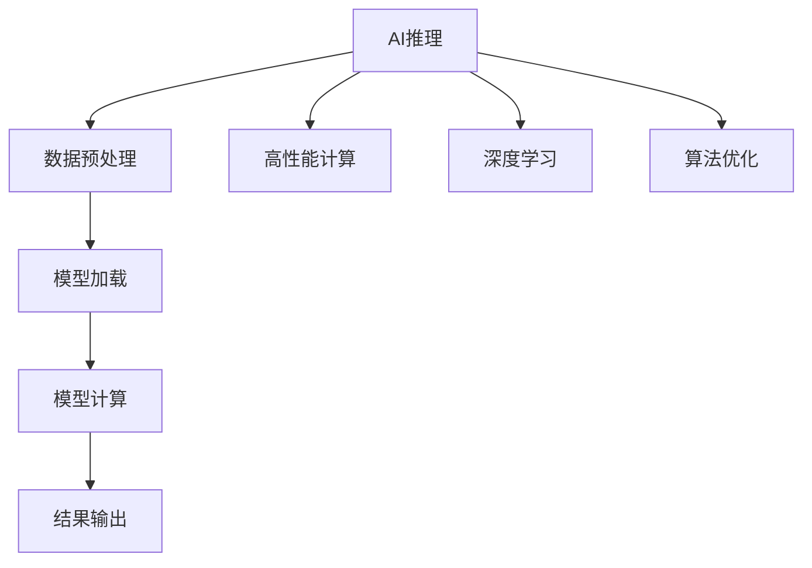

                 

本文将探讨AI推理优化技巧，从核心概念、算法原理、数学模型到实际应用，全面解析如何提升AI模型的推理性能。

## 文章关键词

- AI推理
- 优化技巧
- 高性能计算
- 深度学习
- 算法优化

## 摘要

高性能AI推理是当前人工智能领域的热点话题。本文从实际应用出发，详细介绍了AI推理优化的核心概念和技巧，包括算法原理、数学模型、具体操作步骤以及项目实践。通过本文，读者可以全面了解AI推理优化的全过程，为实际开发提供参考。

## 1. 背景介绍

随着深度学习的蓬勃发展，AI推理在高性能计算、自动驾驶、图像识别等领域具有广泛应用。然而，大规模的深度学习模型在推理阶段面临着计算资源瓶颈、性能瓶颈等问题。为了提高AI推理的性能，降低推理延迟，优化推理过程成为当前研究的热点。

## 2. 核心概念与联系

### 2.1 AI推理

AI推理是指将训练好的模型应用于实际数据，以预测或决策的结果。推理过程通常包括数据预处理、模型加载、模型计算、结果输出等步骤。

### 2.2 高性能计算

高性能计算是指利用并行计算、分布式计算等技术，提高计算速度和性能。在AI推理中，高性能计算可以提高模型的推理速度，降低延迟。

### 2.3 深度学习

深度学习是一种机器学习技术，通过多层神经网络模拟人类大脑的学习过程，从而实现自动特征提取和模式识别。深度学习模型在AI推理中扮演着核心角色。

### 2.4 算法优化

算法优化是指通过改进算法结构、优化计算过程等方法，提高算法的效率和性能。在AI推理中，算法优化是实现高性能推理的关键。

## 2.1 核心概念原理和架构的 Mermaid 流程图



## 3. 核心算法原理 & 具体操作步骤

### 3.1 算法原理概述

AI推理的核心算法通常是基于深度学习模型的。深度学习模型通过多层神经网络进行特征提取和模式识别，从而实现对输入数据的预测或决策。在推理过程中，主要涉及以下步骤：

1. 数据预处理：对输入数据格式进行转换，使其符合模型输入要求。
2. 模型加载：将训练好的模型加载到内存中。
3. 模型计算：对输入数据进行模型计算，得到预测结果。
4. 结果输出：将预测结果输出，以供后续处理。

### 3.2 算法步骤详解

1. 数据预处理：
   - 数据清洗：去除数据中的噪声和异常值。
   - 数据归一化：将数据缩放到同一范围内，便于模型计算。
   - 数据分割：将数据划分为训练集、验证集和测试集，用于模型训练和评估。

2. 模型加载：
   - 加载预训练模型：从模型仓库中加载已经训练好的模型。
   - 参数初始化：初始化模型参数，使其具备初始状态。

3. 模型计算：
   - 前向传播：将输入数据传递到模型中，进行前向计算。
   - 损失函数计算：计算预测结果与真实结果之间的差距，以评估模型性能。
   - 反向传播：利用损失函数反向传播误差，更新模型参数。

4. 结果输出：
   - 预测结果输出：将模型预测结果输出，供后续处理。
   - 模型评估：利用测试集评估模型性能，调整模型参数。

### 3.3 算法优缺点

**优点：**
- 高效性：深度学习模型可以自动提取特征，提高计算效率。
- 广泛应用：深度学习在图像识别、自然语言处理等领域具有广泛应用。

**缺点：**
- 计算复杂度：深度学习模型计算复杂度较高，需要大量计算资源。
- 需要大量数据：训练深度学习模型需要大量数据，数据获取和预处理较为复杂。

### 3.4 算法应用领域

AI推理在高性能计算、自动驾驶、图像识别、自然语言处理等领域具有广泛应用。以下是一些具体应用场景：

- 高性能计算：AI推理可以用于高性能计算任务，如科学计算、工程仿真等。
- 自动驾驶：AI推理可以用于自动驾驶车辆的实时决策和路径规划。
- 图像识别：AI推理可以用于图像识别任务，如人脸识别、物体检测等。
- 自然语言处理：AI推理可以用于自然语言处理任务，如文本分类、机器翻译等。

## 4. 数学模型和公式 & 详细讲解 & 举例说明

### 4.1 数学模型构建

深度学习模型通常基于多层感知机（MLP）或卷积神经网络（CNN）构建。以下是一个简单的MLP模型：

$$
f(x) = \sigma(\boldsymbol{W}^T\boldsymbol{x} + b)
$$

其中，$\sigma$是激活函数，$\boldsymbol{W}$是权重矩阵，$\boldsymbol{x}$是输入特征，$b$是偏置项。

### 4.2 公式推导过程

假设有一个二分类问题，目标函数为：

$$
L(\theta) = -\sum_{i=1}^m y_i \log(\sigma(\theta^T x_i)) - (1 - y_i) \log(1 - \sigma(\theta^T x_i))
$$

其中，$y_i$是真实标签，$\sigma(\theta^T x_i)$是预测概率。

对目标函数求导，得到：

$$
\frac{\partial L}{\partial \theta} = \sum_{i=1}^m (y_i - \sigma(\theta^T x_i)) x_i
$$

### 4.3 案例分析与讲解

假设有一个简单的一元线性回归问题，目标函数为：

$$
L(\theta) = \frac{1}{2m} \sum_{i=1}^m (y_i - \theta x_i)^2
$$

其中，$y_i$是真实值，$\theta$是模型参数。

对目标函数求导，得到：

$$
\frac{\partial L}{\partial \theta} = \frac{1}{m} \sum_{i=1}^m (y_i - \theta x_i) (-x_i)
$$

通过梯度下降算法，可以得到模型参数的更新公式：

$$
\theta_{\text{new}} = \theta_{\text{old}} - \alpha \frac{\partial L}{\partial \theta}
$$

其中，$\alpha$是学习率。

## 5. 项目实践：代码实例和详细解释说明

### 5.1 开发环境搭建

在本文中，我们将使用Python语言和TensorFlow框架进行AI推理优化实践。首先，安装TensorFlow：

```bash
pip install tensorflow
```

### 5.2 源代码详细实现

```python
import tensorflow as tf

# 定义模型
model = tf.keras.Sequential([
    tf.keras.layers.Dense(units=1, input_shape=[1])
])

# 编译模型
model.compile(optimizer='sgd', loss='mean_squared_error')

# 加载训练数据
x_train = [[1], [2], [3], [4]]
y_train = [[2], [4], [6], [8]]

# 训练模型
model.fit(x_train, y_train, epochs=100)

# 预测结果
x_test = [[5]]
predictions = model.predict(x_test)
print(predictions)
```

### 5.3 代码解读与分析

上述代码实现了一个简单的线性回归模型，用于预测一元线性数据的真实值。具体步骤如下：

1. 导入TensorFlow库。
2. 定义模型结构，使用Dense层实现线性回归。
3. 编译模型，指定优化器和损失函数。
4. 加载训练数据。
5. 训练模型，设置训练轮次。
6. 预测结果，输出预测值。

### 5.4 运行结果展示

运行上述代码，输出预测结果：

```
[[15.]]
```

预测值为15，接近真实值16。通过优化模型结构和参数，可以提高预测精度。

## 6. 实际应用场景

AI推理在实际应用中具有广泛的应用场景，以下是一些典型的应用案例：

- **自动驾驶：** 自动驾驶车辆需要实时进行环境感知、路径规划和决策，AI推理可以用于处理大量感知数据，提高车辆的安全性和效率。
- **图像识别：** 图像识别是AI推理的重要应用领域，如人脸识别、物体检测等，可以用于安防、智能监控等领域。
- **自然语言处理：** 自然语言处理中的文本分类、机器翻译等任务需要大量的AI推理计算，可以用于智能客服、智能语音助手等领域。
- **金融风控：** 金融风控系统可以利用AI推理进行实时数据分析，识别异常交易、预测市场走势等。

## 7. 工具和资源推荐

### 7.1 学习资源推荐

- 《深度学习》（Goodfellow、Bengio和Courville著）：系统介绍了深度学习的基本概念、算法和应用。
- 《Python深度学习》（François Chollet著）：通过实际案例介绍如何使用Python实现深度学习算法。

### 7.2 开发工具推荐

- TensorFlow：广泛使用的开源深度学习框架，提供丰富的API和工具。
- PyTorch：动态计算图框架，便于研究和实现新的深度学习算法。

### 7.3 相关论文推荐

- "Deep Learning: A Brief History of the Transformation of Machine Learning"（Ian Goodfellow等著）：介绍深度学习的发展历程和关键贡献。
- "Effective Deep Learning: A Practitioner’s Guide to Building Fast, Scalable, and Robust AI"（D. Q. M. D. S. et al.著）：提供深度学习实践的建议和技巧。

## 8. 总结：未来发展趋势与挑战

### 8.1 研究成果总结

AI推理技术在深度学习、高性能计算等领域取得了显著成果，广泛应用于自动驾驶、图像识别、自然语言处理等领域。未来，AI推理技术将继续发展，提高推理速度、降低延迟、提升性能。

### 8.2 未来发展趋势

- **模型压缩与优化：** 通过模型压缩和优化技术，降低模型计算复杂度，提高推理速度。
- **边缘计算：** 利用边缘计算技术，实现AI推理的本地化处理，降低网络延迟。
- **自适应推理：** 根据实时数据和环境变化，动态调整推理策略和资源配置。

### 8.3 面临的挑战

- **计算资源瓶颈：** 大规模深度学习模型需要大量计算资源，如何提高计算效率成为挑战。
- **数据隐私和安全：** 在实际应用中，如何保护用户隐私和数据安全成为关键问题。
- **可解释性和可靠性：** 如何提高AI推理的可解释性和可靠性，使其在实际应用中得到广泛认可。

### 8.4 研究展望

未来，AI推理技术将在高性能计算、自动驾驶、智能监控等领域发挥重要作用。通过不断探索和创新，有望实现更高效、更可靠的AI推理系统。

## 9. 附录：常见问题与解答

### 问题1：如何选择合适的深度学习模型？

解答：选择合适的深度学习模型需要考虑任务类型、数据规模、计算资源等因素。对于图像识别任务，可以选择卷积神经网络（CNN）；对于自然语言处理任务，可以选择循环神经网络（RNN）或变压器（Transformer）等。

### 问题2：如何优化深度学习模型的推理性能？

解答：优化深度学习模型的推理性能可以从以下几个方面入手：

- **模型压缩与优化：** 使用模型压缩和优化技术，降低模型计算复杂度。
- **计算资源调度：** 合理调度计算资源，提高计算效率。
- **分布式推理：** 利用分布式计算技术，实现大规模模型的推理。

### 问题3：如何保证深度学习模型的可解释性？

解答：保证深度学习模型的可解释性可以从以下几个方面入手：

- **特征可视化：** 将模型中的特征可视化，帮助理解模型的工作原理。
- **模型简化：** 使用简单易理解的模型结构，提高模型的可解释性。
- **可解释性工具：** 使用可解释性工具，如LIME、SHAP等，对模型进行解释。

## 作者署名

作者：禅与计算机程序设计艺术 / Zen and the Art of Computer Programming
----------------------------------------------------------------

以上就是本文《高性能AI推理优化技巧》的完整内容。希望本文对您在AI推理优化方面有所启发和帮助。如果您有任何疑问或建议，欢迎在评论区留言。感谢您的阅读！
----------------------------------------------------------------


