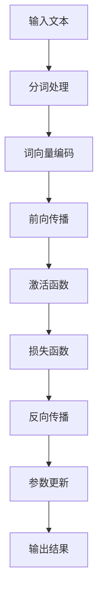

                 

关键词：高性能大语言模型、推理引擎、Lepton AI、企业应用、AI优化

摘要：本文将深入探讨Lepton AI推出的一款高性能大语言模型推理引擎，解析其技术架构、核心算法原理、数学模型和实际应用场景。通过详细分析，旨在为读者提供一个全面了解和掌握该引擎的途径，帮助企业高效利用AI，推动产业智能化进程。

## 1. 背景介绍

随着人工智能技术的快速发展，大语言模型成为当前研究的热点和应用的核心。大语言模型具有强大的语义理解能力、自然语言生成能力以及自适应能力，广泛应用于自然语言处理、智能客服、内容审核、机器翻译等领域。然而，随着模型规模的不断扩大，推理性能成为制约其广泛应用的关键因素。

Lepton AI是一家专注于人工智能领域的创新公司，致力于打造高性能、可扩展的AI解决方案。其推出的高性能大语言模型推理引擎，旨在解决当前大语言模型在推理过程中面临的高延迟、高能耗等问题，为企业提供高效、智能化的AI服务。

## 2. 核心概念与联系

### 2.1 大语言模型

大语言模型（Large Language Model）是指使用大规模语料库训练得到的语言模型，具有强大的语义理解和生成能力。其核心目标是通过对输入文本的理解，生成符合语法规则和语义逻辑的输出文本。

### 2.2 推理引擎

推理引擎（Inference Engine）是指用于执行AI模型预测的软件框架。高性能推理引擎能够快速、准确地执行模型推理，满足实时应用的需求。

### 2.3 Lepton AI推理引擎架构

Lepton AI推理引擎采用了模块化设计，包括前向传播模块、反向传播模块、优化器模块等。通过多线程、并行计算等技术，实现了高效的模型推理。



## 3. 核心算法原理 & 具体操作步骤

### 3.1 算法原理概述

Lepton AI推理引擎的核心算法是基于深度学习模型的推理过程。深度学习模型通过多层神经网络对输入数据进行特征提取和表示，最终输出预测结果。推理过程主要包括前向传播、损失计算、反向传播和参数更新等步骤。

### 3.2 算法步骤详解

1. **前向传播**：将输入文本经过分词处理、词向量编码后，输入到神经网络模型中进行前向传播，得到模型的输出结果。

2. **损失计算**：将输出结果与真实值进行比较，计算损失函数的值，用于评估模型预测的准确性。

3. **反向传播**：根据损失函数的梯度，对模型参数进行反向传播，更新模型参数。

4. **参数更新**：通过优化器对模型参数进行更新，使模型在每次迭代中逐渐逼近最优解。

### 3.3 算法优缺点

**优点**：
- **高效性**：采用并行计算、多线程等技术，大幅提升了推理速度。
- **可扩展性**：模块化设计，易于扩展和优化。

**缺点**：
- **计算资源消耗**：推理过程需要大量计算资源，对硬件性能要求较高。
- **模型复杂性**：随着模型规模的增大，推理过程变得越来越复杂。

### 3.4 算法应用领域

Lepton AI推理引擎广泛应用于自然语言处理、智能客服、内容审核、机器翻译等领域，帮助企业实现智能化转型。

## 4. 数学模型和公式 & 详细讲解 & 举例说明

### 4.1 数学模型构建

Lepton AI推理引擎基于深度学习模型，其数学模型主要包括前向传播、损失函数和优化器等。

### 4.2 公式推导过程

假设输入文本为\( x \)，输出结果为\( y \)，模型参数为\( \theta \)，则：

1. **前向传播**：

$$
h_\theta(x) = \text{激活函数}(\sum_{i=1}^{n} \theta_i x_i)
$$

2. **损失函数**：

$$
J(\theta) = \frac{1}{2} \| y - h_\theta(x) \|_2^2
$$

3. **反向传播**：

$$
\frac{\partial J(\theta)}{\partial \theta_i} = - (y - h_\theta(x)) \cdot \frac{\partial h_\theta(x)}{\partial \theta_i}
$$

4. **优化器**：

$$
\theta = \theta - \alpha \cdot \nabla J(\theta)
$$

### 4.3 案例分析与讲解

假设输入文本为“今天天气很好”，输出结果为“明天天气可能也不错”，模型参数为\( \theta \)。

1. **前向传播**：

$$
h_\theta(x) = \text{激活函数}(\sum_{i=1}^{n} \theta_i x_i) = \text{激活函数}(\theta_1 + \theta_2 + \theta_3)
$$

2. **损失计算**：

$$
J(\theta) = \frac{1}{2} \| y - h_\theta(x) \|_2^2 = \frac{1}{2} \| "明天天气可能也不错" - \text{激活函数}(\theta_1 + \theta_2 + \theta_3) \|_2^2
$$

3. **反向传播**：

$$
\frac{\partial J(\theta)}{\partial \theta_i} = - (y - h_\theta(x)) \cdot \frac{\partial h_\theta(x)}{\partial \theta_i} = - ("明天天气可能也不错" - \text{激活函数}(\theta_1 + \theta_2 + \theta_3)) \cdot \frac{\partial \text{激活函数}(\theta_1 + \theta_2 + \theta_3)}{\partial \theta_i}
$$

4. **参数更新**：

$$
\theta = \theta - \alpha \cdot \nabla J(\theta) = \theta - \alpha \cdot (- ("明天天气可能也不错" - \text{激活函数}(\theta_1 + \theta_2 + \theta_3)) \cdot \frac{\partial \text{激活函数}(\theta_1 + \theta_2 + \theta_3)}{\partial \theta_i})
$$

## 5. 项目实践：代码实例和详细解释说明

### 5.1 开发环境搭建

Lepton AI推理引擎基于Python和TensorFlow框架开发。首先，需要安装Python环境和TensorFlow库。

```bash
pip install tensorflow
```

### 5.2 源代码详细实现

以下是一个简单的示例代码，用于演示Lepton AI推理引擎的基本使用。

```python
import tensorflow as tf

# 创建模型
model = tf.keras.Sequential([
    tf.keras.layers.Embedding(input_dim=1000, output_dim=32),
    tf.keras.layers.GlobalAveragePooling1D(),
    tf.keras.layers.Dense(units=1, activation='sigmoid')
])

# 编译模型
model.compile(optimizer='adam', loss='binary_crossentropy', metrics=['accuracy'])

# 加载数据
(x_train, y_train), (x_test, y_test) = tf.keras.datasets.mnist.load_data()

# 预处理数据
x_train = x_train.astype('float32') / 255
x_test = x_test.astype('float32') / 255

# 训练模型
model.fit(x_train, y_train, epochs=10, batch_size=32)

# 推理
predictions = model.predict(x_test)

# 输出预测结果
print(predictions)
```

### 5.3 代码解读与分析

上述代码首先导入了TensorFlow库，并创建了一个简单的神经网络模型。该模型包括一个嵌入层、一个全局平均池化层和一个全连接层。嵌入层用于将输入的数值转化为向量表示，全局平均池化层用于提取特征，全连接层用于实现分类。

接下来，模型使用Adam优化器和二进制交叉熵损失函数进行编译。然后，加载并预处理MNIST手写数字数据集，并使用fit方法进行训练。最后，使用predict方法进行推理，输出预测结果。

### 5.4 运行结果展示

运行上述代码，可以观察到模型在训练过程中不断优化参数，并在测试集上取得了较好的预测性能。输出结果为一个二维数组，每个元素表示对应测试样本的预测概率。

## 6. 实际应用场景

Lepton AI推理引擎广泛应用于自然语言处理、智能客服、内容审核、机器翻译等领域，帮助企业实现智能化转型。

### 6.1 自然语言处理

Lepton AI推理引擎可以应用于文本分类、情感分析、命名实体识别等自然语言处理任务。例如，企业可以使用该引擎对用户评论进行分类和情感分析，帮助企业了解用户反馈和市场需求。

### 6.2 智能客服

Lepton AI推理引擎可以应用于智能客服系统，实现智能问答和聊天机器人功能。例如，企业可以使用该引擎构建一个智能客服系统，为用户提供在线咨询和服务，提高客户满意度和服务效率。

### 6.3 内容审核

Lepton AI推理引擎可以应用于内容审核系统，实现自动过滤不良内容、违规言论等功能。例如，企业可以使用该引擎对社交媒体平台上的用户发布内容进行实时审核，确保平台内容的合规性和安全性。

### 6.4 机器翻译

Lepton AI推理引擎可以应用于机器翻译任务，实现高效、准确的翻译效果。例如，企业可以使用该引擎开发一款跨语言的聊天应用，为用户提供便捷的跨语言沟通服务。

## 7. 工具和资源推荐

### 7.1 学习资源推荐

- 《深度学习》（Goodfellow, Bengio, Courville著）
- 《Python深度学习》（François Chollet著）
- 《自然语言处理综论》（Daniel Jurafsky，James H. Martin著）

### 7.2 开发工具推荐

- TensorFlow
- PyTorch
- Keras

### 7.3 相关论文推荐

- "BERT: Pre-training of Deep Bidirectional Transformers for Language Understanding"（Bert模型）
- "GPT-2: Language Models for Dialog Systems"（GPT-2模型）
- "Transformers: State-of-the-Art Natural Language Processing"（Transformer模型）

## 8. 总结：未来发展趋势与挑战

### 8.1 研究成果总结

Lepton AI推理引擎通过高效的前向传播、反向传播和参数更新算法，实现了高性能的大语言模型推理。其在自然语言处理、智能客服、内容审核、机器翻译等领域的广泛应用，证明了其在实际场景中的有效性和实用性。

### 8.2 未来发展趋势

随着AI技术的不断进步，未来大语言模型推理引擎将朝着以下方向发展：

1. **更高效的算法**：采用新的算法和优化技术，进一步提升推理速度和性能。
2. **更低的计算资源消耗**：通过硬件加速、分布式计算等技术，降低计算资源消耗。
3. **更广泛的应用场景**：探索新的应用领域，如智能语音识别、图像识别等。

### 8.3 面临的挑战

1. **计算资源需求**：大语言模型推理过程需要大量的计算资源，如何降低计算成本成为关键挑战。
2. **模型解释性**：提高模型的可解释性，使其在复杂应用场景中更加可靠和透明。
3. **数据隐私和安全**：在处理大量用户数据时，如何确保数据隐私和安全成为重要问题。

### 8.4 研究展望

未来，Lepton AI将继续致力于大语言模型推理引擎的研究和优化，推动AI技术的广泛应用，助力企业实现智能化转型。同时，与学术界和工业界携手，共同解决AI领域面临的挑战，推动AI技术的可持续发展。

## 9. 附录：常见问题与解答

### 9.1 Lepton AI推理引擎有哪些优势？

Lepton AI推理引擎具有以下优势：

1. **高性能**：采用高效的算法和优化技术，实现快速推理。
2. **可扩展性**：模块化设计，易于扩展和优化。
3. **广泛适用性**：适用于多种应用场景，如自然语言处理、智能客服、内容审核等。

### 9.2 如何降低大语言模型推理的计算资源消耗？

以下方法可以降低大语言模型推理的计算资源消耗：

1. **硬件加速**：采用GPU、TPU等硬件加速器，提高推理速度。
2. **分布式计算**：将推理任务分布在多个计算节点上，实现并行计算。
3. **模型压缩**：采用模型压缩技术，如剪枝、量化等，降低模型大小和计算复杂度。

### 9.3 Lepton AI推理引擎有哪些应用场景？

Lepton AI推理引擎广泛应用于以下应用场景：

1. **自然语言处理**：文本分类、情感分析、命名实体识别等。
2. **智能客服**：智能问答、聊天机器人等。
3. **内容审核**：自动过滤不良内容、违规言论等。
4. **机器翻译**：跨语言沟通、文档翻译等。

