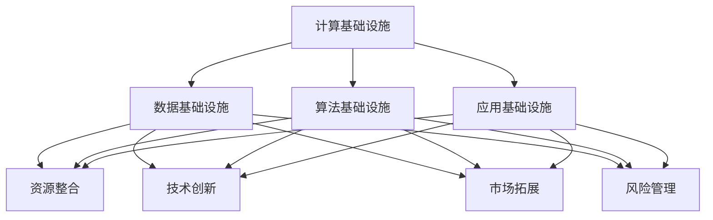

                 

关键词：AI 2.0、基础设施、全球化、合作共建、人工智能

摘要：本文深入探讨了 AI 2.0 基础设施建设的现状与未来，分析了全球化发展与合作共建的重要性，为人工智能领域的可持续发展提供了策略性建议。

## 1. 背景介绍

随着人工智能技术的迅速发展，AI 2.0 时代的到来已经成为不可避免的趋势。AI 2.0 不同于传统的人工智能，它强调智能的自主性、多样性以及人机协同。为了实现这一目标，基础设施建设成为了至关重要的环节。

在全球范围内，各国都在积极布局 AI 2.0 基础设施，以期在人工智能领域占据先机。然而，基础设施的建设不仅涉及到技术问题，还包括政策、法律、经济等多方面因素。因此，全球化发展与合作共建成为推动 AI 2.0 基础设施建设的必然选择。

## 2. 核心概念与联系

### 2.1 AI 2.0 基础设施的构成

AI 2.0 基础设施主要包括以下几个部分：

- **计算基础设施**：包括高性能计算集群、分布式计算网络等，为人工智能算法提供强大的计算能力。
- **数据基础设施**：包括数据存储、数据传输、数据治理等，保障数据的安全、合规和高效利用。
- **算法基础设施**：包括算法库、模型库、工具链等，为人工智能应用提供丰富的算法资源和工具支持。
- **应用基础设施**：包括开发环境、测试环境、部署环境等，为人工智能项目的开发和运行提供全面的保障。

### 2.2 全球化发展与合作共建的意义

全球化发展与合作共建在 AI 2.0 基础设施建设中具有重要作用。具体表现为：

- **资源整合**：各国可以共享计算资源、数据资源、人才资源等，提高资源利用效率。
- **技术创新**：通过国际合作，可以加速技术创新，推动人工智能技术的快速发展。
- **市场拓展**：全球化发展有助于扩大市场，提高人工智能应用的普及率。
- **风险管理**：通过国际合作，可以共同应对政策、法律、安全等风险。

### 2.3 Mermaid 流程图

下面是 AI 2.0 基础设施建设的 Mermaid 流程图：



## 3. 核心算法原理 & 具体操作步骤

### 3.1 算法原理概述

AI 2.0 基础设施建设涉及多种核心算法，其中一些典型的算法包括：

- **深度学习**：通过多层神经网络模拟人脑学习过程，实现数据的自动分类、识别和预测。
- **强化学习**：通过与环境交互，不断优化决策策略，实现智能体的自主学习和优化。
- **迁移学习**：通过利用已有模型的权重，快速适应新任务，提高模型的可迁移性和泛化能力。

### 3.2 算法步骤详解

以深度学习算法为例，其基本步骤如下：

1. **数据预处理**：包括数据清洗、归一化、分割等，为模型训练做好准备。
2. **模型构建**：包括选择合适的网络结构、参数设置等，构建深度学习模型。
3. **模型训练**：通过大量数据进行迭代训练，不断优化模型参数。
4. **模型评估**：通过验证集或测试集评估模型性能，调整模型参数。
5. **模型部署**：将训练好的模型部署到实际应用环境中，进行预测或决策。

### 3.3 算法优缺点

- **深度学习**：优点包括强大的建模能力、较高的预测精度；缺点包括对数据量的要求较高、模型参数难以解释。
- **强化学习**：优点包括自主学习能力强、适用于动态环境；缺点包括训练过程缓慢、对环境依赖性强。
- **迁移学习**：优点包括快速适应新任务、提高模型泛化能力；缺点包括模型复杂度较高、迁移效果不稳定。

### 3.4 算法应用领域

深度学习算法在图像识别、自然语言处理、推荐系统等领域具有广泛应用。强化学习算法在游戏、自动驾驶、智能控制等领域具有广阔前景。迁移学习算法在医疗诊断、金融风控等领域具有重要应用价值。

## 4. 数学模型和公式 & 详细讲解 & 举例说明

### 4.1 数学模型构建

以深度学习算法为例，其数学模型主要包括：

- **前向传播**：计算输入数据经过神经网络传递后的输出结果。
- **反向传播**：计算神经网络参数的梯度，用于模型参数的更新。

### 4.2 公式推导过程

以前向传播为例，其公式推导过程如下：

$$
Z^{[l]} = \sigma(W^{[l]} \cdot Z^{[l-1]} + b^{[l]})
$$

其中，\(Z^{[l]}\) 表示第 \(l\) 层的输出，\(\sigma\) 表示激活函数，\(W^{[l]}\) 表示第 \(l\) 层的权重矩阵，\(Z^{[l-1]}\) 表示第 \(l-1\) 层的输出，\(b^{[l]}\) 表示第 \(l\) 层的偏置项。

### 4.3 案例分析与讲解

以图像识别任务为例，使用深度学习算法进行图像分类的过程如下：

1. **数据预处理**：对图像进行缩放、裁剪、翻转等处理，将图像数据转换为神经网络可接受的格式。
2. **模型构建**：选择合适的网络结构，如卷积神经网络（CNN），并设置相应的参数。
3. **模型训练**：使用大量训练数据进行迭代训练，优化模型参数。
4. **模型评估**：使用验证集或测试集评估模型性能，调整模型参数。
5. **模型部署**：将训练好的模型部署到实际应用环境中，进行图像分类。

## 5. 项目实践：代码实例和详细解释说明

### 5.1 开发环境搭建

为了进行 AI 2.0 基础设施建设的项目实践，我们需要搭建一个合适的开发环境。以下是一个基于 Python 的开发环境搭建步骤：

1. **安装 Python**：下载并安装 Python 3.8 或更高版本。
2. **安装 PyTorch**：使用 pip 安装 PyTorch，命令如下：

   ```
   pip install torch torchvision
   ```

3. **安装其他依赖库**：安装其他必要的依赖库，如 NumPy、Pandas 等。

### 5.2 源代码详细实现

以下是一个简单的深度学习模型实现示例，使用 PyTorch 库实现：

```python
import torch
import torch.nn as nn
import torch.optim as optim

# 定义网络结构
class NeuralNetwork(nn.Module):
    def __init__(self):
        super(NeuralNetwork, self).__init__()
        self.layer1 = nn.Linear(784, 128)
        self.relu = nn.ReLU()
        self.layer2 = nn.Linear(128, 64)
        self.dropout = nn.Dropout(0.2)
        self.layer3 = nn.Linear(64, 10)

    def forward(self, x):
        x = self.layer1(x)
        x = self.relu(x)
        x = self.dropout(x)
        x = self.layer2(x)
        x = self.relu(x)
        x = self.dropout(x)
        x = self.layer3(x)
        return x

# 实例化模型
model = NeuralNetwork()

# 定义损失函数和优化器
criterion = nn.CrossEntropyLoss()
optimizer = optim.Adam(model.parameters(), lr=0.001)

# 训练模型
for epoch in range(10):
    running_loss = 0.0
    for i, data in enumerate(train_loader, 0):
        inputs, labels = data
        optimizer.zero_grad()
        outputs = model(inputs)
        loss = criterion(outputs, labels)
        loss.backward()
        optimizer.step()
        running_loss += loss.item()
    print(f'Epoch {epoch + 1}, Loss: {running_loss / len(train_loader)}')

print('Finished Training')
```

### 5.3 代码解读与分析

这段代码实现了基于 PyTorch 的深度学习模型训练。主要步骤如下：

1. **定义网络结构**：定义一个简单的全连接神经网络，包括输入层、隐藏层和输出层。
2. **定义损失函数和优化器**：选择交叉熵损失函数和 Adam 优化器，用于模型训练。
3. **训练模型**：使用训练数据迭代训练模型，更新模型参数。

### 5.4 运行结果展示

在完成模型训练后，我们可以使用测试数据评估模型性能。以下是一个简单的测试代码示例：

```python
# 测试模型
correct = 0
total = 0
with torch.no_grad():
    for data in test_loader:
        images, labels = data
        outputs = model(images)
        _, predicted = torch.max(outputs.data, 1)
        total += labels.size(0)
        correct += (predicted == labels).sum().item()

print(f'Accuracy of the network on the test images: {100 * correct / total}%')
```

运行结果展示了模型在测试数据上的准确率。

## 6. 实际应用场景

AI 2.0 基础设施建设在实际应用场景中具有广泛的应用。以下是一些典型的应用场景：

- **智能制造**：利用 AI 2.0 基础设施实现生产线的自动化和智能化，提高生产效率和产品质量。
- **智慧医疗**：利用 AI 2.0 基础设施实现疾病的早期诊断、个性化治疗和健康监测。
- **智能交通**：利用 AI 2.0 基础设施实现交通流量预测、智能调度和自动驾驶。
- **金融科技**：利用 AI 2.0 基础设施实现风险控制、智能投顾和智能支付等。

## 7. 工具和资源推荐

### 7.1 学习资源推荐

- **书籍**：
  - 《深度学习》（Ian Goodfellow、Yoshua Bengio、Aaron Courville 著）
  - 《机器学习》（Tom Mitchell 著）
  - 《人工智能：一种现代的方法》（Stuart Russell、Peter Norvig 著）
- **在线课程**：
  - Coursera 上的《机器学习基础》
  - edX 上的《深度学习》
  - Udacity 上的《人工智能工程师纳米学位》

### 7.2 开发工具推荐

- **深度学习框架**：
  - PyTorch
  - TensorFlow
  - Keras
- **数据预处理工具**：
  - Pandas
  - NumPy
  - Matplotlib

### 7.3 相关论文推荐

- **深度学习**：
  - "Deep Learning"（Ian Goodfellow 等）
  - "Deep Neural Networks for Speech Recognition"（Geoff Hinton 等）
- **强化学习**：
  - "Reinforcement Learning: An Introduction"（Richard S. Sutton、Andrew G. Barto）
  - "Human-level control through deep reinforcement learning"（DeepMind）
- **迁移学习**：
  - "Transfer Learning"（Karen Simonyan、Andrew Zisserman）

## 8. 总结：未来发展趋势与挑战

### 8.1 研究成果总结

AI 2.0 基础设施建设已经取得了显著的成果，包括：

- **计算能力大幅提升**：高性能计算集群、分布式计算网络等基础设施的快速发展，为人工智能算法提供了强大的计算支持。
- **数据资源日益丰富**：数据基础设施的建设，使得数据资源的获取、存储、处理和共享变得更加便捷。
- **算法创新层出不穷**：深度学习、强化学习、迁移学习等核心算法的不断发展，推动了人工智能技术的持续进步。
- **应用领域不断拓展**：人工智能在智能制造、智慧医疗、智能交通、金融科技等领域的广泛应用，展现了巨大的市场潜力。

### 8.2 未来发展趋势

未来，AI 2.0 基础设施建设将呈现以下发展趋势：

- **跨界融合**：人工智能与其他领域的深度融合，推动新产业的诞生。
- **自主进化**：基于深度学习、强化学习等技术的自主进化能力，使得人工智能系统更加智能化、自适应化。
- **人机协同**：人工智能与人类的协作，实现更高效、更智能的工作方式。
- **全球合作**：全球化发展与合作共建，推动人工智能基础设施的共建共享。

### 8.3 面临的挑战

尽管 AI 2.0 基础设施建设取得了显著成果，但仍面临以下挑战：

- **数据隐私与安全**：如何在保障数据隐私和安全的前提下，充分利用数据资源，成为亟待解决的问题。
- **算法透明性与解释性**：如何提高算法的透明性和解释性，使其更加容易被用户接受和理解。
- **技术标准化**：如何制定统一的技术标准，促进人工智能技术的健康发展。
- **国际合作与竞争**：如何在全球化发展中，实现国际合作与竞争的平衡，推动人工智能基础设施的建设。

### 8.4 研究展望

未来，AI 2.0 基础设施建设将继续沿着以下方向展开研究：

- **技术创新**：持续推动深度学习、强化学习、迁移学习等核心算法的研究与优化。
- **数据治理**：加强数据治理，提高数据质量，实现数据的安全、合规和高效利用。
- **人机协同**：深入研究人机协同的机制和模式，实现更高效、更智能的协作方式。
- **政策法规**：制定合理的政策法规，促进人工智能技术的健康发展。

## 9. 附录：常见问题与解答

### Q：什么是 AI 2.0？

A：AI 2.0 是指新一代的人工智能技术，它强调智能的自主性、多样性以及人机协同。与传统的 AI 相比，AI 2.0 在算法、数据、应用等方面都有较大的突破。

### Q：全球化发展与合作共建在 AI 2.0 基础设施建设中有何作用？

A：全球化发展与合作共建在 AI 2.0 基础设施建设中具有重要作用，它能够实现资源整合、技术创新、市场拓展和风险管理，推动人工智能技术的快速发展。

### Q：如何搭建一个 AI 2.0 开发环境？

A：搭建 AI 2.0 开发环境需要安装 Python、深度学习框架（如 PyTorch、TensorFlow）以及其他必要的依赖库。具体的安装步骤可以参考相关的教程和文档。

### Q：AI 2.0 基础设施建设有哪些应用场景？

A：AI 2.0 基础设施建设在实际应用场景中具有广泛的应用，包括智能制造、智慧医疗、智能交通、金融科技等领域。

### Q：未来 AI 2.0 基础设施建设将呈现哪些发展趋势？

A：未来 AI 2.0 基础设施建设将呈现跨界融合、自主进化、人机协同和全球合作等发展趋势。

## 参考文献

- Goodfellow, I., Bengio, Y., & Courville, A. (2016). Deep learning. MIT press.
- Mitchell, T. M. (1997). Machine learning. McGraw-Hill.
- Russell, S., & Norvig, P. (2016). Artificial intelligence: A modern approach. Prentice Hall.
- Simonyan, K., & Zisserman, A. (2014). Very deep convolutional networks for large-scale image recognition. arXiv preprint arXiv:1409.1556.
- Sutton, R. S., & Barto, A. G. (2018). Reinforcement learning: An introduction. MIT press.
- DeepMind. (2015). Human-level control through deep reinforcement learning. Nature, 518(7540), 529-533.

