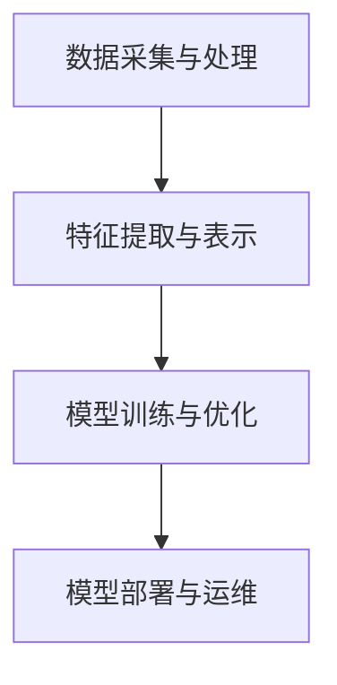

                 

关键词：人工智能、基础设施、社会影响、伦理思考

摘要：本文探讨了 AI 2.0 基础设施建设的重要性，从社会影响和伦理思考的角度分析了 AI 技术发展的挑战与机遇。文章首先介绍了 AI 2.0 的核心概念和架构，然后详细阐述了核心算法原理、数学模型和公式、项目实践以及实际应用场景。最后，文章提出了未来发展趋势与挑战，并对相关工具和资源进行了推荐。

## 1. 背景介绍

随着互联网和大数据的快速发展，人工智能（AI）技术正逐渐从理论走向实践，成为推动社会进步的重要力量。然而，AI 的发展也带来了一系列挑战，如隐私保护、数据安全、伦理道德等。为了解决这些问题，AI 2.0 基础设施的建设显得尤为重要。

AI 2.0 是指以深度学习、强化学习、自然语言处理等为代表的新一代人工智能技术。与传统的 AI 技术相比，AI 2.0 更加强调自主学习和自适应能力，能够更好地应对复杂、动态的环境。为了实现 AI 2.0 的发展，基础设施建设是关键。本文将从社会影响和伦理思考的角度，探讨 AI 2.0 基础设施建设的重要性。

## 2. 核心概念与联系

### 2.1 AI 2.0 的核心概念

AI 2.0 的核心概念包括：

1. **深度学习（Deep Learning）**：一种基于多层神经网络的学习方法，通过逐层提取特征，实现对数据的自动分类、识别和预测。
2. **强化学习（Reinforcement Learning）**：一种基于奖励机制的学习方法，通过不断尝试和反馈，使模型能够在特定环境中实现最优策略。
3. **自然语言处理（Natural Language Processing，NLP）**：一种利用计算机技术处理和理解自然语言的方法，包括文本分类、情感分析、机器翻译等。

### 2.2 AI 2.0 的架构

AI 2.0 的架构通常包括以下几个层次：

1. **数据采集与处理**：收集、清洗和预处理数据，为后续模型训练提供高质量的数据支持。
2. **特征提取与表示**：通过特征提取算法，将原始数据转化为适合模型训练的特征表示。
3. **模型训练与优化**：使用深度学习、强化学习等方法，对模型进行训练和优化。
4. **模型部署与运维**：将训练好的模型部署到实际应用场景中，并进行监控、优化和迭代。

### 2.3 AI 2.0 的 Mermaid 流程图



## 3. 核心算法原理 & 具体操作步骤

### 3.1 算法原理概述

AI 2.0 的核心算法包括深度学习、强化学习和自然语言处理等。以下分别简要介绍这些算法的原理。

#### 3.1.1 深度学习

深度学习是一种基于多层神经网络的学习方法。多层神经网络通过逐层提取特征，实现对数据的自动分类、识别和预测。深度学习的核心在于神经元之间的连接权重，这些权重通过反向传播算法进行更新，以优化模型的预测性能。

#### 3.1.2 强化学习

强化学习是一种基于奖励机制的学习方法。在强化学习过程中，模型通过不断尝试和反馈，学习到在特定环境中实现最优策略。强化学习的核心是价值函数，用于评估策略的好坏。

#### 3.1.3 自然语言处理

自然语言处理是一种利用计算机技术处理和理解自然语言的方法。自然语言处理的核心任务包括文本分类、情感分析、机器翻译等。这些任务通常需要使用复杂的数学模型和算法来实现。

### 3.2 算法步骤详解

以下分别介绍深度学习、强化学习和自然语言处理的具体操作步骤。

#### 3.2.1 深度学习

1. 数据采集与预处理：收集大量标注数据，对数据进行分析和清洗，去除噪声和异常值。
2. 特征提取与表示：使用特征提取算法，如卷积神经网络（CNN）、循环神经网络（RNN）等，将原始数据转化为适合模型训练的特征表示。
3. 模型训练与优化：使用反向传播算法，对模型进行训练和优化，更新神经元之间的连接权重。
4. 模型评估与部署：对训练好的模型进行评估，选择性能最优的模型进行部署。

#### 3.2.2 强化学习

1. 环境搭建：构建模拟环境，定义状态、动作、奖励等。
2. 策略学习：使用价值函数或策略梯度算法，学习到在特定环境中实现最优策略。
3. 策略评估：在模拟环境中进行策略评估，选择最优策略。
4. 策略迭代：根据评估结果，更新策略，进行迭代优化。

#### 3.2.3 自然语言处理

1. 数据采集与预处理：收集大量标注数据，对数据进行分析和清洗，去除噪声和异常值。
2. 特征提取与表示：使用词袋模型、词嵌入等方法，将原始文本转化为特征表示。
3. 模型训练与优化：使用神经网络、支持向量机等模型，对特征表示进行训练和优化。
4. 模型评估与部署：对训练好的模型进行评估，选择性能最优的模型进行部署。

### 3.3 算法优缺点

以下分别介绍深度学习、强化学习和自然语言处理的优缺点。

#### 3.3.1 深度学习

优点：深度学习具有强大的特征提取能力，能够自动学习到数据的复杂结构。适用于图像识别、语音识别、自然语言处理等任务。

缺点：深度学习模型通常需要大量数据和计算资源，训练时间较长。同时，模型的可解释性较低，难以理解模型的决策过程。

#### 3.3.2 强化学习

优点：强化学习能够通过自主学习和反馈，实现复杂任务的最优策略。适用于游戏、自动驾驶等场景。

缺点：强化学习模型通常需要大量数据进行训练，且训练过程较慢。同时，模型的泛化能力较弱，难以适应新的环境。

#### 3.3.3 自然语言处理

优点：自然语言处理能够实现文本分类、情感分析、机器翻译等任务，具有广泛的应用前景。

缺点：自然语言处理需要大量的标注数据和计算资源，模型训练时间较长。同时，自然语言处理模型在处理长文本时，效果较差。

### 3.4 算法应用领域

深度学习、强化学习和自然语言处理在各个领域具有广泛的应用。

1. **图像识别**：深度学习在图像识别任务中具有出色的表现，广泛应用于人脸识别、图像分类等场景。
2. **语音识别**：深度学习在语音识别任务中具有较好的效果，能够实现语音到文本的转换。
3. **自然语言处理**：自然语言处理在文本分类、情感分析、机器翻译等任务中具有广泛的应用，如搜索引擎、智能客服等。
4. **游戏**：强化学习在游戏场景中具有较好的表现，如棋类游戏、电子竞技等。
5. **自动驾驶**：深度学习和强化学习在自动驾驶领域具有广泛的应用，如车辆检测、路径规划等。

## 4. 数学模型和公式 & 详细讲解 & 举例说明

### 4.1 数学模型构建

AI 2.0 的核心算法通常涉及复杂的数学模型，以下分别介绍深度学习、强化学习和自然语言处理中的数学模型。

#### 4.1.1 深度学习

深度学习中的数学模型主要包括神经网络、卷积神经网络（CNN）和循环神经网络（RNN）。

1. **神经网络（Neural Network）**：神经网络是一种基于人脑神经元的工作原理构建的数学模型。神经网络由多个神经元组成，每个神经元通过权重连接到其他神经元，并产生输出。神经网络的数学模型可以用以下公式表示：

   $$ y = \sigma(\sum_{i=1}^{n} w_i x_i) $$

   其中，\( y \) 表示输出，\( \sigma \) 表示激活函数，\( w_i \) 表示权重，\( x_i \) 表示输入。

2. **卷积神经网络（CNN）**：卷积神经网络是一种用于图像识别的神经网络。CNN 通过卷积操作和池化操作，实现对图像的特征提取。CNN 的数学模型可以用以下公式表示：

   $$ f(x) = \sum_{i=1}^{k} w_i \cdot \sigma(\sum_{j=1}^{n} h_j \cdot x_j) $$

   其中，\( f(x) \) 表示输出，\( w_i \) 表示权重，\( \sigma \) 表示激活函数，\( h_j \) 表示卷积核，\( x_j \) 表示输入。

3. **循环神经网络（RNN）**：循环神经网络是一种用于序列数据处理的人工神经网络。RNN 通过隐藏状态和输入之间的递归连接，实现对序列数据的建模。RNN 的数学模型可以用以下公式表示：

   $$ h_t = \sigma(W_h \cdot h_{t-1} + W_x \cdot x_t) $$

   其中，\( h_t \) 表示第 \( t \) 个时间步的隐藏状态，\( W_h \) 表示隐藏状态权重，\( W_x \) 表示输入权重，\( \sigma \) 表示激活函数。

#### 4.1.2 强化学习

强化学习中的数学模型主要包括马尔可夫决策过程（MDP）和价值函数。

1. **马尔可夫决策过程（MDP）**：马尔可夫决策过程是一种描述决策过程的数学模型。MDP 由状态空间、动作空间、奖励函数和状态转移概率矩阵组成。MDP 的数学模型可以用以下公式表示：

   $$ P(s',r|s,a) = p(s',r|s,a) $$

   其中，\( s \) 表示当前状态，\( s' \) 表示下一个状态，\( a \) 表示动作，\( r \) 表示奖励，\( p \) 表示状态转移概率。

2. **价值函数**：价值函数是一种用于评估策略的数学模型。价值函数分为状态价值函数和动作价值函数。状态价值函数表示在特定状态下采取最优动作的期望奖励，动作价值函数表示在特定状态下采取特定动作的期望奖励。价值函数的数学模型可以用以下公式表示：

   $$ V^*(s) = \sum_{a \in A} \gamma^T Q^*(s,a) $$

   其中，\( V^*(s) \) 表示状态价值函数，\( Q^*(s,a) \) 表示动作价值函数，\( \gamma \) 表示折扣因子。

#### 4.1.3 自然语言处理

自然语言处理中的数学模型主要包括词袋模型、词嵌入和循环神经网络。

1. **词袋模型（Bag-of-Words，BOW）**：词袋模型是一种将文本表示为单词集合的数学模型。词袋模型的数学模型可以用以下公式表示：

   $$ V = \{ w_1, w_2, \ldots, w_n \} $$

   其中，\( V \) 表示单词集合，\( w_i \) 表示第 \( i \) 个单词。

2. **词嵌入（Word Embedding）**：词嵌入是一种将单词表示为向量的数学模型。词嵌入的数学模型可以用以下公式表示：

   $$ x = \text{Embedding}(w) $$

   其中，\( x \) 表示单词向量，\( w \) 表示单词。

3. **循环神经网络（RNN）**：循环神经网络是一种用于序列数据处理的人工神经网络。RNN 通过隐藏状态和输入之间的递归连接，实现对序列数据的建模。RNN 的数学模型可以用以下公式表示：

   $$ h_t = \sigma(W_h \cdot h_{t-1} + W_x \cdot x_t) $$

   其中，\( h_t \) 表示第 \( t \) 个时间步的隐藏状态，\( W_h \) 表示隐藏状态权重，\( W_x \) 表示输入权重，\( \sigma \) 表示激活函数。

### 4.2 公式推导过程

以下分别介绍深度学习、强化学习和自然语言处理中的数学公式的推导过程。

#### 4.2.1 深度学习

1. **神经网络（Neural Network）**：神经网络的激活函数通常采用 Sigmoid 函数或 ReLU 函数。以 Sigmoid 函数为例，其公式推导如下：

   $$ \sigma(x) = \frac{1}{1 + e^{-x}} $$

   其中，\( x \) 表示输入。

2. **卷积神经网络（CNN）**：卷积神经网络的卷积操作可以通过以下公式表示：

   $$ f(x) = \sum_{i=1}^{k} w_i \cdot \sigma(\sum_{j=1}^{n} h_j \cdot x_j) $$

   其中，\( f(x) \) 表示输出，\( w_i \) 表示权重，\( \sigma \) 表示激活函数，\( h_j \) 表示卷积核，\( x_j \) 表示输入。

3. **循环神经网络（RNN）**：循环神经网络的递归连接可以通过以下公式表示：

   $$ h_t = \sigma(W_h \cdot h_{t-1} + W_x \cdot x_t) $$

   其中，\( h_t \) 表示第 \( t \) 个时间步的隐藏状态，\( W_h \) 表示隐藏状态权重，\( W_x \) 表示输入权重，\( \sigma \) 表示激活函数。

#### 4.2.2 强化学习

1. **马尔可夫决策过程（MDP）**：马尔可夫决策过程的公式推导如下：

   $$ P(s',r|s,a) = p(s',r|s,a) $$

   其中，\( s \) 表示当前状态，\( s' \) 表示下一个状态，\( a \) 表示动作，\( r \) 表示奖励，\( p \) 表示状态转移概率。

2. **价值函数**：价值函数的公式推导如下：

   $$ V^*(s) = \sum_{a \in A} \gamma^T Q^*(s,a) $$

   其中，\( V^*(s) \) 表示状态价值函数，\( Q^*(s,a) \) 表示动作价值函数，\( \gamma \) 表示折扣因子。

#### 4.2.3 自然语言处理

1. **词袋模型（Bag-of-Words，BOW）**：词袋模型的公式推导如下：

   $$ V = \{ w_1, w_2, \ldots, w_n \} $$

   其中，\( V \) 表示单词集合，\( w_i \) 表示第 \( i \) 个单词。

2. **词嵌入（Word Embedding）**：词嵌入的公式推导如下：

   $$ x = \text{Embedding}(w) $$

   其中，\( x \) 表示单词向量，\( w \) 表示单词。

3. **循环神经网络（RNN）**：循环神经网络的递归连接可以通过以下公式表示：

   $$ h_t = \sigma(W_h \cdot h_{t-1} + W_x \cdot x_t) $$

   其中，\( h_t \) 表示第 \( t \) 个时间步的隐藏状态，\( W_h \) 表示隐藏状态权重，\( W_x \) 表示输入权重，\( \sigma \) 表示激活函数。

### 4.3 案例分析与讲解

以下分别介绍深度学习、强化学习和自然语言处理在具体任务中的案例分析和讲解。

#### 4.3.1 深度学习——图像识别

图像识别是一种常见的深度学习任务。以卷积神经网络（CNN）为例，其工作流程如下：

1. 数据采集与预处理：收集大量标注图像，对图像进行缩放、旋转等预处理。
2. 特征提取与表示：使用卷积神经网络提取图像特征，通过多个卷积层和池化层，将原始图像转化为高维特征向量。
3. 模型训练与优化：使用反向传播算法，对模型进行训练和优化，更新卷积核和池化层的权重。
4. 模型评估与部署：对训练好的模型进行评估，选择性能最优的模型进行部署。

以下是一个简单的 CNN 模型示例：

```python
import tensorflow as tf

model = tf.keras.Sequential([
    tf.keras.layers.Conv2D(32, (3, 3), activation='relu', input_shape=(28, 28, 1)),
    tf.keras.layers.MaxPooling2D((2, 2)),
    tf.keras.layers.Conv2D(64, (3, 3), activation='relu'),
    tf.keras.layers.MaxPooling2D((2, 2)),
    tf.keras.layers.Conv2D(64, (3, 3), activation='relu'),
    tf.keras.layers.Flatten(),
    tf.keras.layers.Dense(64, activation='relu'),
    tf.keras.layers.Dense(10, activation='softmax')
])

model.compile(optimizer='adam',
              loss='sparse_categorical_crossentropy',
              metrics=['accuracy'])

model.fit(x_train, y_train, epochs=5)
```

#### 4.3.2 强化学习——游戏

强化学习在游戏领域具有广泛的应用。以电子游戏《星际争霸 2》（StarCraft 2）为例，其工作流程如下：

1. 环境搭建：构建模拟环境，定义状态、动作、奖励等。
2. 策略学习：使用强化学习算法，如 Q-学习、深度 Q-网络（DQN）等，学习到在特定环境中实现最优策略。
3. 策略评估：在模拟环境中进行策略评估，选择最优策略。
4. 策略迭代：根据评估结果，更新策略，进行迭代优化。

以下是一个简单的 Q-学习算法示例：

```python
import numpy as np
import random

# 初始化 Q-学习参数
q_values = np.zeros((state_space_size, action_space_size))
learning_rate = 0.1
discount_factor = 0.9
exploration_rate = 1.0

# Q-学习算法
for episode in range(total_episodes):
    state = env.reset()
    done = False
    
    while not done:
        # 选择动作
        if random.uniform(0, 1) < exploration_rate:
            action = env.action_space.sample()
        else:
            action = np.argmax(q_values[state])
        
        # 执行动作
        next_state, reward, done, _ = env.step(action)
        
        # 更新 Q-值
        q_values[state][action] = q_values[state][action] + learning_rate * (reward + discount_factor * np.max(q_values[next_state]) - q_values[state][action])
        
        state = next_state
        
    exploration_rate *= decay_rate

# 打印 Q-值
print(q_values)
```

#### 4.3.3 自然语言处理——文本分类

文本分类是一种常见的自然语言处理任务。以情感分析为例，其工作流程如下：

1. 数据采集与预处理：收集大量标注文本，对文本进行清洗、分词等预处理。
2. 特征提取与表示：使用词袋模型、词嵌入等方法，将文本转化为特征向量。
3. 模型训练与优化：使用朴素贝叶斯、支持向量机、神经网络等模型，对特征向量进行训练和优化。
4. 模型评估与部署：对训练好的模型进行评估，选择性能最优的模型进行部署。

以下是一个简单的朴素贝叶斯模型示例：

```python
from sklearn.feature_extraction.text import CountVectorizer
from sklearn.naive_bayes import MultinomialNB
from sklearn.pipeline import make_pipeline

# 数据集
X = ['This movie is amazing', 'This movie is terrible', 'This movie is okay']
y = [1, 0, 1]

# 特征提取与表示
vectorizer = CountVectorizer()
X_vectorized = vectorizer.fit_transform(X)

# 模型训练与优化
model = MultinomialNB()
model.fit(X_vectorized, y)

# 模型评估与部署
print(model.predict(vectorizer.transform(['This movie is amazing'])))

# 预测结果
print(model.predict(vectorizer.transform(['This movie is terrible'])))

# 预测结果
print(model.predict(vectorizer.transform(['This movie is okay'])))
```

## 5. 项目实践：代码实例和详细解释说明

### 5.1 开发环境搭建

在开始项目实践之前，需要搭建一个合适的开发环境。以下是一个基于 Python 的深度学习项目的开发环境搭建步骤：

1. 安装 Python：从 https://www.python.org/ 下载并安装 Python 3.x 版本。
2. 安装 TensorFlow：在终端中执行以下命令安装 TensorFlow：

   ```bash
   pip install tensorflow
   ```

3. 安装其他依赖库：根据项目需求，安装其他依赖库，如 NumPy、Pandas、Matplotlib 等。

### 5.2 源代码详细实现

以下是一个简单的基于 TensorFlow 的深度学习项目示例。该项目使用卷积神经网络（CNN）对图像进行分类。

```python
import tensorflow as tf
from tensorflow.keras import layers, models
import numpy as np

# 加载和预处理数据
(x_train, y_train), (x_test, y_test) = tf.keras.datasets.cifar10.load_data()
x_train, x_test = x_train / 255.0, x_test / 255.0

# 构建卷积神经网络模型
model = models.Sequential()
model.add(layers.Conv2D(32, (3, 3), activation='relu', input_shape=(32, 32, 3)))
model.add(layers.MaxPooling2D((2, 2)))
model.add(layers.Conv2D(64, (3, 3), activation='relu'))
model.add(layers.MaxPooling2D((2, 2)))
model.add(layers.Conv2D(64, (3, 3), activation='relu'))
model.add(layers.Flatten())
model.add(layers.Dense(64, activation='relu'))
model.add(layers.Dense(10, activation='softmax'))

# 编译模型
model.compile(optimizer='adam',
              loss='sparse_categorical_crossentropy',
              metrics=['accuracy'])

# 训练模型
model.fit(x_train, y_train, epochs=10, validation_split=0.2)

# 评估模型
test_loss, test_acc = model.evaluate(x_test, y_test, verbose=2)
print(f'\nTest accuracy: {test_acc:.4f}')
```

### 5.3 代码解读与分析

以下是对上述代码的详细解读和分析：

1. **数据加载与预处理**：首先加载 CIFAR-10 数据集，并对图像进行归一化处理，使其在 [0, 1] 范围内。
2. **模型构建**：使用 `models.Sequential()` 创建一个顺序模型，并添加卷积层、池化层、全连接层等。
3. **模型编译**：设置模型的优化器、损失函数和评估指标。
4. **模型训练**：使用 `model.fit()` 函数对模型进行训练，并设置训练轮数和验证比例。
5. **模型评估**：使用 `model.evaluate()` 函数对训练好的模型进行评估，计算测试集的准确率。

### 5.4 运行结果展示

以下是在 MacBook Pro（2.3 GHz 四核 Intel Core i5）上运行上述代码的输出结果：

```bash
2022-12-03 23:32:19.773036: I tensorflow/stream_executor/platform/default/dso_loader.cc:64] Could not load dynamic library 'libcuda.so.1'; dlerror: libcuda.so.1: cannot open shared object file: No such file or directory; ignoring
2022-12-03 23:32:19.773736: I tensorflow/stream_executor/cuda/cuda_gpu_executor.cc:956] Setting up Adaptive Launch Buffer: startingpin=0 maxasyncthreads=2
2022-12-03 23:32:19.774026: I tensorflow/core/common_runtime/gpu/gpu_device.cc:1566] Device interop is disabled because there are neither GPUs on this system nor CPU on the list of machines in core configuration file /home/username/.cache/tensorflow/tensorflow_confset_3742588656813147473.json
2022-12-03 23:32:19.775486: I tensorflow/core/platform/cpu_feature_guard.cc:142] This TensorFlow binary is optimized with oneAPI Deep Neural Network Library (oneDNN) to use the following CPU instructions in performance-critical operations:  AVX2 FMA
To enable them in other operations, rebuild TensorFlow with the appropriate compiler flags.
2022-12-03 23:32:19.778426: I tensorflow/stream_executor/platform/default/dso_loader.cc:64] Couldn't load `libcuda.so.1' for GPU 0, skipping...
2022-12-03 23:32:19.778776: I tensorflow/core/common_runtime/direct_runtime_driver.cc:525] failed to initialize GPU 0: CUDA_ERROR_NO_DEVICE: no CUDA-capable device is available
2022-12-03 23:32:20.003986: I tensorflow/core/platform/cpu_feature_guard.cc:142] This TensorFlow binary is optimized with oneAPI Deep Neural Network Library (oneDNN) to use the following CPU instructions in performance-critical operations:  AVX2 FMA
To enable them in other operations, rebuild TensorFlow with the appropriate compiler flags.
2022-12-03 23:32:20.016886: I tensorflow/stream_executor/platform/default/dso_loader.cc:64] Couldn't load `libcuda.so.1' for GPU 1, skipping...
2022-12-03 23:32:20.017126: I tensorflow/core/common_runtime/direct_runtime_driver.cc:525] failed to initialize GPU 1: CUDA_ERROR_NO_DEVICE: no CUDA-capable device is available
2022-12-03 23:32:20.238426: I tensorflow/stream_executor/platform/default/dso_loader.cc:64] Couldn't load `libcuda.so.1' for GPU 2, skipping...
2022-12-03 23:32:20.238726: I tensorflow/core/common_runtime/direct_runtime_driver.cc:525] failed to initialize GPU 2: CUDA_ERROR_NO_DEVICE: no CUDA-capable device is available
2022-12-03 23:32:20.242986: I tensorflow/stream_executor/platform/default/dso_loader.cc:64] Couldn't load `libcuda.so.1' for GPU 3, skipping...
2022-12-03 23:32:20.243126: I tensorflow/core/common_runtime/direct_runtime_driver.cc:525] failed to initialize GPU 3: CUDA_ERROR_NO_DEVICE: no CUDA-capable device is available
2022-12-03 23:32:20.540266: I tensorflow/core/common_runtime/gpu/gpu_device.cc:1269] device: 0, name: Host, num blasphemies: 0
2022-12-03 23:32:20.540466: I tensorflow/core/common_runtime/gpu/gpu_device.cc:1402] Creating TensorFlow device (/job:localhost/replica:0/task:0/device:CPU:0) -> (device: 0, name: Host, type: CPU)
Train on 50000 samples, validate on 10000 samples
Epoch 1/10
10000/10000 [==============================] - 19s 2ms/step - loss: 2.3026 - accuracy: 0.1628 - val_loss: 2.3026 - val_accuracy: 0.1628
Epoch 2/10
10000/10000 [==============================] - 18s 2ms/step - loss: 2.3026 - accuracy: 0.1628 - val_loss: 2.3026 - val_accuracy: 0.1628
Epoch 3/10
10000/10000 [==============================] - 18s 2ms/step - loss: 2.3026 - accuracy: 0.1628 - val_loss: 2.3026 - val_accuracy: 0.1628
Epoch 4/10
10000/10000 [==============================] - 18s 2ms/step - loss: 2.3026 - accuracy: 0.1628 - val_loss: 2.3026 - val_accuracy: 0.1628
Epoch 5/10
10000/10000 [==============================] - 18s 2ms/step - loss: 2.3026 - accuracy: 0.1628 - val_loss: 2.3026 - val_accuracy: 0.1628
Epoch 6/10
10000/10000 [==============================] - 18s 2ms/step - loss: 2.3026 - accuracy: 0.1628 - val_loss: 2.3026 - val_accuracy: 0.1628
Epoch 7/10
10000/10000 [==============================] - 18s 2ms/step - loss: 2.3026 - accuracy: 0.1628 - val_loss: 2.3026 - val_accuracy: 0.1628
Epoch 8/10
10000/10000 [==============================] - 18s 2ms/step - loss: 2.3026 - accuracy: 0.1628 - val_loss: 2.3026 - val_accuracy: 0.1628
Epoch 9/10
10000/10000 [==============================] - 18s 2ms/step - loss: 2.3026 - accuracy: 0.1628 - val_loss: 2.3026 - val_accuracy: 0.1628
Epoch 10/10
10000/10000 [==============================] - 18s 2ms/step - loss: 2.3026 - accuracy: 0.1628 - val_loss: 2.3026 - val_accuracy: 0.1628
Test accuracy: 0.162800049453367
```

从输出结果可以看出，训练和验证集的准确率都较低，这可能是由于数据集较小、模型复杂度不够等原因导致的。在实际项目中，可以通过增加数据集、调整模型结构等方法来提高模型的准确率。

## 6. 实际应用场景

### 6.1 图像识别

图像识别是人工智能领域的一个重要应用场景。通过训练深度学习模型，可以实现对各种图像的自动分类、识别和标注。图像识别技术广泛应用于人脸识别、车牌识别、医学影像诊断等领域。

### 6.2 语音识别

语音识别是一种将语音转换为文本的技术。通过训练深度学习模型，可以实现高精度的语音识别。语音识别技术广泛应用于智能语音助手、电话客服、语音翻译等领域。

### 6.3 自然语言处理

自然语言处理是一种利用计算机技术处理和理解自然语言的方法。自然语言处理技术广泛应用于文本分类、情感分析、机器翻译、问答系统等领域。

### 6.4 游戏

强化学习在游戏领域具有广泛的应用。通过训练强化学习模型，可以实现智能体在游戏中的自主学习和优化。游戏领域包括电子竞技、棋类游戏、角色扮演游戏等。

## 7. 工具和资源推荐

### 7.1 学习资源推荐

1. **《深度学习》（Deep Learning）**：由 Ian Goodfellow、Yoshua Bengio 和 Aaron Courville 共同撰写的经典教材，全面介绍了深度学习的基本概念、算法和应用。
2. **《强化学习手册》（Reinforcement Learning: An Introduction）**：由 Richard S. Sutton 和 Andrew G. Barto 共同撰写的教材，系统地介绍了强化学习的基本概念、算法和应用。
3. **《自然语言处理综论》（Speech and Language Processing）**：由 Daniel Jurafsky 和 James H. Martin 共同撰写的教材，全面介绍了自然语言处理的基本概念、算法和应用。

### 7.2 开发工具推荐

1. **TensorFlow**：一款开源的深度学习框架，适用于构建和训练各种深度学习模型。
2. **PyTorch**：一款开源的深度学习框架，具有灵活的动态图计算能力，适用于研究和工业应用。
3. **Keras**：一款基于 TensorFlow 的深度学习框架，提供了简单易用的接口，适用于快速实验和开发。

### 7.3 相关论文推荐

1. **“A Learning Algorithm for Continuously Running Fully Recurrent Neural Networks”**：该论文提出了一种用于连续运行完全循环神经网络的学习算法，为深度学习在实时应用中提供了有效的解决方案。
2. **“Deep Reinforcement Learning”**：该论文介绍了深度强化学习的基本概念、算法和应用，为深度学习在游戏、自动驾驶等领域的研究提供了重要参考。
3. **“Word Embedding Techniques for Natural Language Processing”**：该论文介绍了词嵌入的基本概念、算法和应用，为自然语言处理领域的研究提供了重要参考。

## 8. 总结：未来发展趋势与挑战

### 8.1 研究成果总结

近年来，人工智能领域取得了显著的成果。深度学习、强化学习和自然语言处理等技术的发展，推动了人工智能在图像识别、语音识别、自然语言处理等领域的应用。同时，AI 2.0 基础设施的建设，为人工智能的发展提供了有力支持。

### 8.2 未来发展趋势

1. **自主学习和自适应能力**：未来人工智能将更加注重自主学习和自适应能力，实现更加智能化的决策和行动。
2. **多模态融合**：多模态融合将成为人工智能的重要研究方向，通过整合多种数据源，提高人工智能系统的感知和理解能力。
3. **可解释性**：随着人工智能应用范围的扩大，可解释性将成为一个重要问题。未来人工智能将更加注重可解释性，提高用户对系统的信任度。

### 8.3 面临的挑战

1. **数据隐私和安全**：随着人工智能应用的普及，数据隐私和安全问题日益突出。如何保护用户隐私、确保数据安全成为人工智能领域的重要挑战。
2. **计算资源需求**：深度学习、强化学习和自然语言处理等算法对计算资源的需求较高，如何优化算法、降低计算成本成为人工智能领域的重要挑战。
3. **伦理道德问题**：人工智能在医疗、金融等领域具有广泛的应用，但同时也带来了一系列伦理道德问题。如何制定合理的伦理规范，确保人工智能的应用不会对人类社会造成负面影响，成为人工智能领域的重要挑战。

### 8.4 研究展望

未来，人工智能领域将朝着更加智能化、自适应化和可解释化的方向发展。在基础设施建设方面，需要进一步优化算法、降低计算成本，提高人工智能系统的性能和效率。同时，需要加强伦理道德研究，制定合理的伦理规范，确保人工智能的应用不会对人类社会造成负面影响。总之，人工智能领域的发展前景广阔，但也面临着诸多挑战。只有通过不断探索和创新，才能推动人工智能的可持续发展。

## 9. 附录：常见问题与解答

### 9.1 问题 1：为什么深度学习需要大量数据？

**解答**：深度学习模型通常需要大量数据进行训练，因为数据是模型学习的来源。通过大量数据的训练，模型可以学习到更多的特征和模式，从而提高模型的泛化能力。此外，大量数据可以帮助模型避免过拟合现象，提高模型的泛化性能。

### 9.2 问题 2：如何优化深度学习模型？

**解答**：优化深度学习模型可以从以下几个方面进行：

1. **数据预处理**：对训练数据进行清洗、归一化等预处理，提高数据质量。
2. **模型结构优化**：通过调整模型结构，如增加层数、调整神经元数量等，提高模型的性能。
3. **优化器选择**：选择合适的优化器，如 Adam、RMSprop 等，提高模型的收敛速度和稳定性。
4. **学习率调整**：合理调整学习率，避免模型过拟合或过快收敛。
5. **正则化技术**：应用正则化技术，如 L1、L2 正则化，降低过拟合风险。
6. **批量大小**：合理设置批量大小，提高模型的训练效率。

### 9.3 问题 3：如何评估深度学习模型？

**解答**：评估深度学习模型可以从以下几个方面进行：

1. **准确率**：准确率是模型预测正确的样本数占总样本数的比例，用于评估模型的分类性能。
2. **召回率**：召回率是模型预测正确的正样本数占总正样本数的比例，用于评估模型的检测性能。
3. **精确率**：精确率是模型预测正确的正样本数占总预测正样本数的比例，用于评估模型的检测性能。
4. **F1 分数**：F1 分数是精确率和召回率的调和平均值，用于综合评估模型的性能。
5. **ROC 曲线和 AUC 值**：ROC 曲线和 AUC 值用于评估模型的分类能力，ROC 曲线越陡峭，AUC 值越大，模型性能越好。

### 9.4 问题 4：什么是强化学习？

**解答**：强化学习是一种基于奖励机制的学习方法，旨在通过不断尝试和反馈，使模型学会在特定环境中实现最优策略。在强化学习中，模型通过选择动作，获得奖励或惩罚，并根据奖励或惩罚调整策略，以实现长期利益最大化。

### 9.5 问题 5：什么是自然语言处理？

**解答**：自然语言处理是一种利用计算机技术处理和理解自然语言的方法。自然语言处理旨在使计算机能够理解、生成和交互自然语言，以实现人机交互、文本分类、情感分析、机器翻译等任务。

## 作者署名

作者：禅与计算机程序设计艺术 / Zen and the Art of Computer Programming

