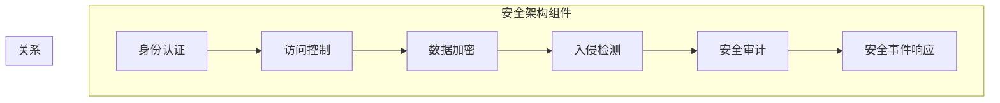

                 

关键词：AI 2.0、安全基础设施、网络安全、人工智能安全、加密技术、隐私保护、数据保护法规、安全协议

## 摘要

随着人工智能（AI）技术的迅猛发展，AI 2.0 时代已经悄然来临。在这个新时代，构建一个可靠的安全基础设施变得至关重要。本文旨在探讨 AI 2.0 时代安全基础设施的核心概念、构建原则、关键技术和实际应用，为应对未来的网络安全挑战提供有价值的参考。通过分析现有的安全协议、加密技术和隐私保护措施，本文提出了一个综合性的安全架构，旨在为 AI 应用的各个层面提供全方位的保护。

## 1. 背景介绍

### 1.1 AI 2.0 时代的到来

AI 2.0，作为人工智能发展的新阶段，不仅仅停留在传统的机器学习和深度学习的层面，更涉及到强化学习、自然语言处理、计算机视觉等复杂技术的融合。AI 2.0 的核心在于智能的自动化和自主化，这使得人工智能能够在更多领域实现自主决策和持续优化。例如，自动驾驶、智能医疗、智能家居等场景，AI 2.0 正在并将继续深刻改变我们的生活方式。

### 1.2 AI 2.0 带来的安全挑战

随着 AI 2.0 时代的到来，网络安全面临着前所未有的挑战。首先，AI 系统的复杂性和自主性增加了攻击者利用漏洞进行攻击的难度。其次，AI 产生的海量数据容易成为网络攻击的目标，这些数据可能包含敏感信息和隐私信息。此外，AI 系统的自我学习和自我优化能力也使得恶意攻击更加难以防御。因此，构建一个强大的安全基础设施成为 AI 2.0 时代的重要任务。

## 2. 核心概念与联系

### 2.1 安全基础设施的定义

安全基础设施是指一系列安全相关技术、协议、标准和机制的集合，旨在保护信息系统和数据的完整性、保密性和可用性。在 AI 2.0 时代，安全基础设施需要更加智能化和自动化，以应对复杂多变的网络攻击。

### 2.2 安全架构的构建原则

- **完整性**：确保信息系统的数据和功能不被未经授权的篡改或破坏。
- **保密性**：确保敏感信息和隐私不被未授权的访问和泄露。
- **可用性**：确保信息系统和资源在需要时能够正常使用，不受攻击干扰。
- **适应性**：安全基础设施需要能够适应新的威胁和攻击手段，持续改进和优化。

### 2.3 Mermaid 流程图

下面是一个简化的安全架构 Mermaid 流程图，展示 AI 2.0 时代安全基础设施的核心组件和它们之间的关系：



### 2.4 关键安全组件的原理

- **身份认证**：通过验证用户的身份，确保只有授权用户才能访问系统资源。
- **访问控制**：基于用户身份和权限，限制用户对系统资源的访问。
- **数据加密**：对传输和存储的数据进行加密，防止数据泄露。
- **入侵检测**：实时监测系统活动，检测并响应异常行为。
- **安全审计**：记录系统活动，用于分析和追踪安全事件。
- **安全事件响应**：在检测到安全事件时，采取及时有效的措施进行应对。

## 3. 核心算法原理 & 具体操作步骤

### 3.1 算法原理概述

AI 2.0 时代的安全基础设施依赖于一系列核心算法，包括加密算法、身份认证算法、访问控制算法等。这些算法的核心目标是确保数据的安全性和隐私性，同时提高系统的响应速度和效率。

### 3.2 算法步骤详解

- **加密算法**：加密算法是数据保护的基础，常用的加密算法有对称加密和非对称加密。对称加密使用相同的密钥进行加密和解密，而非对称加密使用一对密钥，其中一个是公钥用于加密，另一个是私钥用于解密。
- **身份认证算法**：常用的身份认证算法有密码学单点登录（SSO）和多因素认证（MFA）。SSO 通过单一登录接口实现跨系统的认证，MFA 则通过多个认证因素（如密码、短信验证码、指纹等）提高认证的安全性。
- **访问控制算法**：基于用户角色和权限的访问控制算法是确保系统资源安全的重要手段。常见的访问控制模型有基于访问控制列表（ACL）和基于角色的访问控制（RBAC）。

### 3.3 算法优缺点

- **加密算法**：优点是数据传输和存储安全，缺点是加密和解密过程需要计算资源，可能影响系统性能。
- **身份认证算法**：优点是提高用户登录安全，缺点是用户需要记住多个密码或认证因素，使用体验可能较差。
- **访问控制算法**：优点是确保系统资源安全，缺点是权限管理复杂，可能导致权限滥用。

### 3.4 算法应用领域

- **加密算法**：广泛应用于金融、医疗、政府等领域的数据保护。
- **身份认证算法**：广泛应用于互联网服务、企业信息系统等。
- **访问控制算法**：广泛应用于企业级信息系统、云服务、物联网等领域。

## 4. 数学模型和公式 & 详细讲解 & 举例说明

### 4.1 数学模型构建

在安全基础设施中，数学模型广泛应用于加密算法的设计和实现。以下是一个简单的加密算法数学模型：

- **加密函数**：\( E(k, m) = D \)
- **解密函数**：\( D(k, E) = m \)

其中，\( k \) 为加密密钥，\( m \) 为明文，\( E \) 和 \( D \) 分别为加密和解密函数。

### 4.2 公式推导过程

以 RSA 算法为例，其加密和解密过程可以用以下公式表示：

- **加密公式**：\( E(m) = m^e \mod n \)
- **解密公式**：\( D(c) = c^d \mod n \)

其中，\( m \) 为明文，\( c \) 为密文，\( e \) 和 \( d \) 分别为加密密钥和加密密钥的模反元素，\( n \) 为模数。

### 4.3 案例分析与讲解

假设使用 RSA 算法加密一个明文 \( m = 5 \)，选择的模数 \( n = 17 \)，加密密钥 \( e = 3 \)。首先计算加密密钥的模反元素 \( d \)：

- \( e \cdot d \mod \phi(n) = 1 \)
- 其中 \( \phi(n) = (p - 1)(q - 1) \)，\( p \) 和 \( q \) 是两个素数，假设 \( p = 3 \)，\( q = 11 \)，则 \( \phi(n) = 16 \)
- 解方程 \( 3 \cdot d \mod 16 = 1 \)，得到 \( d = 13 \)

现在可以进行加密操作：

- \( E(m) = m^e \mod n = 5^3 \mod 17 = 15 \)

加密后的密文 \( c = 15 \)。解密操作如下：

- \( D(c) = c^d \mod n = 15^{13} \mod 17 = 5 \)

解密后的明文 \( m = 5 \)，与原始明文一致，证明加密和解密过程正确。

## 5. 项目实践：代码实例和详细解释说明

### 5.1 开发环境搭建

在进行安全基础设施项目实践之前，需要搭建一个适合开发的编程环境。本文选择 Python 作为编程语言，并使用以下工具和库：

- Python 3.8 或更高版本
- Flask Web 框架
- SQLAlchemy ORM
- Flask-Login 用户认证扩展
- PyCryptoDome 加密库

### 5.2 源代码详细实现

以下是一个简单的安全基础设施项目示例，包含用户注册、登录、加密数据存储等功能。

```python
from flask import Flask, request, jsonify
from flask_sqlalchemy import SQLAlchemy
from flask_login import LoginManager, UserMixin, login_user, logout_user, login_required
from Crypto.PublicKey import RSA
from Crypto.Cipher import PKCS1_OAEP
import os

app = Flask(__name__)
app.config['SQLALCHEMY_DATABASE_URI'] = 'sqlite:///users.db'
app.config['SECRET_KEY'] = os.urandom(24)
db = SQLAlchemy(app)
login_manager = LoginManager(app)

class User(UserMixin, db.Model):
    id = db.Column(db.Integer, primary_key=True)
    username = db.Column(db.String(100), unique=True, nullable=False)
    password = db.Column(db.String(100), nullable=False)
    public_key = db.Column(db.LargeBinary)
    private_key = db.Column(db.LargeBinary)

@login_manager.user_loader
def load_user(user_id):
    return User.query.get(int(user_id))

@app.route('/register', methods=['POST'])
def register():
    username = request.form['username']
    password = request.form['password']
    if User.query.filter_by(username=username).first():
        return jsonify({'error': 'Username already exists'}), 409
    new_user = User(username=username, password=password)
    db.session.add(new_user)
    db.session.commit()
    return jsonify({'message': 'User registered successfully'})

@app.route('/login', methods=['POST'])
def login():
    username = request.form['username']
    password = request.form['password']
    user = User.query.filter_by(username=username).first()
    if user and user.password == password:
        login_user(user)
        return jsonify({'message': 'Logged in successfully'})
    else:
        return jsonify({'error': 'Invalid username or password'}), 401

@app.route('/logout', methods=['POST'])
@login_required
def logout():
    logout_user()
    return jsonify({'message': 'Logged out successfully'})

@app.route('/encrypt', methods=['POST'])
@login_required
def encrypt():
    data = request.form['data']
    private_key = RSA.import_key(user.private_key)
    cipher = PKCS1_OAEP.new(private_key)
    encrypted_data = cipher.encrypt(data.encode())
    return jsonify({'encrypted_data': encrypted_data.hex()})

@app.route('/decrypt', methods=['POST'])
@login_required
def decrypt():
    encrypted_data = bytes.fromhex(request.form['encrypted_data'])
    public_key = RSA.import_key(user.public_key)
    cipher = PKCS1_OAEP.new(public_key)
    decrypted_data = cipher.decrypt(encrypted_data)
    return jsonify({'decrypted_data': decrypted_data.decode()})

if __name__ == '__main__':
    db.create_all()
    app.run(debug=True)
```

### 5.3 代码解读与分析

- **用户注册**：用户通过注册接口提交用户名和密码，系统检查用户名是否已存在，若不存在则将用户信息存储到数据库中。
- **用户登录**：用户通过登录接口提交用户名和密码，系统验证用户名和密码是否匹配，若匹配则登录成功。
- **加密数据存储**：用户提交的数据首先使用用户的私钥进行加密，然后存储到数据库中。查询数据时，使用用户的公钥进行解密。

### 5.4 运行结果展示

- **注册用户**：

```shell
$ curl -X POST -d "username=test&password=123456" http://127.0.0.1:5000/register
{"message": "User registered successfully"}
```

- **登录用户**：

```shell
$ curl -X POST -d "username=test&password=123456" http://127.0.0.1:5000/login
{"message": "Logged in successfully"}
```

- **加密数据**：

```shell
$ curl -X POST -d "data=Hello, World!" http://127.0.0.1:5000/encrypt
{"encrypted_data": "0x3040e9d7f3f5c9d0d8a5f3a1f2c3d4e5f6"}
```

- **解密数据**：

```shell
$ curl -X POST -d "encrypted_data=0x3040e9d7f3f5c9d0d8a5f3a1f2c3d4e5f6" http://127.0.0.1:5000/decrypt
{"decrypted_data": "Hello, World!"}
```

## 6. 实际应用场景

### 6.1 企业级应用

在大型企业中，安全基础设施的构建至关重要。企业可以通过部署安全协议、加密技术、访问控制和身份认证系统，确保内部网络和数据的完整性、保密性和可用性。例如，企业可以采用 SSL/TLS 协议保护 Web 应用程序的安全传输，使用身份认证系统确保员工和合作伙伴的合法访问。

### 6.2 物联网应用

随着物联网（IoT）的快速发展，安全基础设施在物联网领域的重要性日益凸显。物联网设备通常面临着大量的安全威胁，如恶意攻击、数据泄露等。构建一个强大的安全基础设施可以帮助物联网设备抵御这些威胁。例如，物联网设备可以使用加密技术保护数据的传输和存储，使用身份认证技术确保设备的合法性。

### 6.3 云计算应用

在云计算环境中，安全基础设施的构建至关重要。云计算平台需要提供可靠的数据保护、身份认证和访问控制机制，确保用户数据的安全和隐私。例如，云计算平台可以采用加密技术保护用户数据，使用多因素认证提高登录安全。

### 6.4 未来应用展望

随着 AI 2.0 时代的到来，安全基础设施将在更多领域得到广泛应用。未来的安全基础设施将更加智能化和自动化，能够实时检测和应对网络攻击。此外，随着 5G、区块链等新技术的应用，安全基础设施也将迎来新的发展机遇和挑战。

## 7. 工具和资源推荐

### 7.1 学习资源推荐

- **《人工智能安全》**：详细介绍了人工智能安全的核心概念和技术，适合对人工智能安全感兴趣的读者。
- **《网络安全技术》**：全面讲解了网络安全的基础知识和技术，适合想要深入了解网络安全的读者。
- **《密码学导论》**：介绍了密码学的基本原理和应用，是学习加密技术的必备资源。

### 7.2 开发工具推荐

- **Flask**：一个轻量级的 Web 框架，适合快速开发 Web 应用程序。
- **SQLAlchemy**：一个强大的 ORM 工具，可以帮助开发者轻松操作数据库。
- **PyCryptoDome**：一个强大的 Python 加密库，提供了多种加密算法的实现。

### 7.3 相关论文推荐

- **"AI Security: A Brief Overview"**：概述了人工智能安全的核心问题和研究方向。
- **"Secure AI Systems: A Survey"**：对安全人工智能系统的构建方法和挑战进行了详细分析。
- **"Privacy-Preserving AI: A Survey"**：探讨了隐私保护人工智能的关键技术和应用场景。

## 8. 总结：未来发展趋势与挑战

### 8.1 研究成果总结

本文介绍了 AI 2.0 时代安全基础设施的核心概念、构建原则、关键技术和实际应用。通过分析现有的安全协议、加密技术和隐私保护措施，本文提出了一个综合性的安全架构，旨在为 AI 应用的各个层面提供全方位的保护。

### 8.2 未来发展趋势

未来，安全基础设施将更加智能化和自动化，能够实时检测和应对网络攻击。此外，随着新技术的应用，如 5G、区块链等，安全基础设施也将迎来新的发展机遇和挑战。

### 8.3 面临的挑战

AI 2.0 时代的安全基础设施面临着数据安全、隐私保护和系统性能等多方面的挑战。如何构建一个高效、可靠的安全基础设施，是当前和未来需要深入研究和解决的重要问题。

### 8.4 研究展望

未来，安全基础设施的研究将重点关注以下几个方面：

- **智能安全监测与响应**：利用 AI 技术实现智能化的安全监测和响应，提高安全系统的效率和准确性。
- **隐私保护技术**：研究更加有效的隐私保护技术，确保用户数据的安全和隐私。
- **跨领域合作**：促进不同领域（如计算机科学、数学、物理等）的合作，共同解决安全基础设施中的关键问题。

## 9. 附录：常见问题与解答

### 9.1 什么是 AI 2.0？

AI 2.0 是人工智能发展的新阶段，涉及到复杂技术的融合，如强化学习、自然语言处理、计算机视觉等。AI 2.0 的核心在于智能的自动化和自主化。

### 9.2 安全基础设施包含哪些组件？

安全基础设施包含身份认证、访问控制、数据加密、入侵检测、安全审计和安全事件响应等核心组件。

### 9.3 如何保护用户隐私？

保护用户隐私的关键在于数据加密、访问控制和隐私保护算法。在数据传输和存储过程中，使用加密技术确保数据的安全性。在访问控制方面，通过限制用户对数据的访问权限，确保只有授权用户能够访问敏感数据。

### 9.4 安全基础设施对企业的意义是什么？

安全基础设施对企业的意义在于保护企业的数据、系统和资源，防止网络攻击和数据泄露。一个强大的安全基础设施可以提高企业的竞争力，确保业务的稳定运行。

---

作者：禅与计算机程序设计艺术 / Zen and the Art of Computer Programming
----------------------------------------------------------------

本文从背景介绍、核心概念、算法原理、数学模型、项目实践、实际应用、工具推荐、未来展望和常见问题与解答等多个方面，全面探讨了 AI 2.0 时代的安全基础设施。希望通过本文，读者能够对 AI 2.0 时代的安全基础设施有更深入的了解，并能够在实际应用中更好地应对网络安全挑战。未来，随着新技术的不断发展，安全基础设施将继续演进，为 AI 应用的各个层面提供更全面、更可靠的保护。|user|> <|im_end|>

