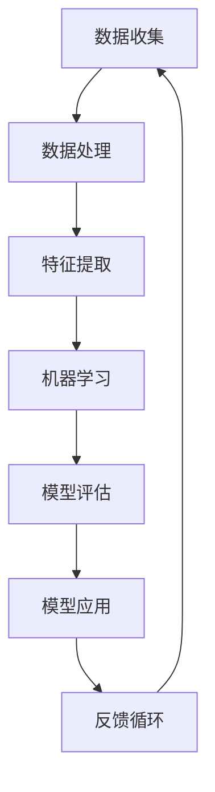

                 

关键词：人工智能，AI 2.0，技术发展，应用场景，社会变革

摘要：本文旨在探讨人工智能2.0时代的到来所带来的技术、应用和社会变革。通过对核心概念、算法原理、数学模型以及实践应用的深入分析，本文为读者呈现了一幅全面、生动的AI 2.0时代的画卷。

## 1. 背景介绍

人工智能（AI）作为一个不断发展的领域，经历了多个发展阶段。从早期的规则系统、知识表示，到20世纪80年代的专家系统，再到21世纪初的深度学习和大数据，人工智能技术不断进步，应用领域也不断扩展。然而，随着计算能力的提升和数据量的爆炸性增长，人工智能迎来了一个全新的时代——AI 2.0。

AI 2.0，也被称作强人工智能（AGI），它的目标是实现类似于人类智能的自主学习和决策能力。与之前的人工智能相比，AI 2.0具有以下几个显著特点：

1. **自主性**：AI 2.0能够自主地学习和适应新环境，不需要人类的干预。
2. **泛用性**：AI 2.0不仅能在特定领域表现出色，还能在多个领域展现其智能。
3. **协同性**：AI 2.0能够与其他AI系统或人类进行有效协作，共同完成任务。
4. **进化性**：AI 2.0能够通过学习不断进化，提高自身的智能水平。

## 2. 核心概念与联系

在深入探讨AI 2.0之前，我们需要了解一些核心概念及其相互之间的联系。以下是一个简化的Mermaid流程图，展示了这些核心概念：



### 2.1 数据收集

数据是人工智能的基石。AI 2.0通过大规模的数据收集，获取更多的信息和知识。

### 2.2 数据处理

数据处理包括数据清洗、去噪、归一化等步骤，以确保数据的质量和一致性。

### 2.3 特征提取

特征提取是将原始数据转换为适合机器学习模型处理的形式。

### 2.4 机器学习

机器学习是AI 2.0的核心技术，通过训练模型，使其能够对数据进行分析和预测。

### 2.5 模型评估

模型评估是评估模型性能的重要环节，包括准确率、召回率、F1分数等指标。

### 2.6 模型应用

模型应用是将训练好的模型部署到实际场景中，解决实际问题。

### 2.7 反馈循环

反馈循环是将模型的输出与实际情况进行对比，用于模型优化和进一步学习。

## 3. 核心算法原理 & 具体操作步骤

### 3.1 算法原理概述

AI 2.0的核心算法包括深度学习、强化学习和迁移学习等。以下是这些算法的基本原理概述：

### 3.2 算法步骤详解

- **深度学习**：通过多层神经网络对数据进行特征学习和分类。
- **强化学习**：通过与环境的交互，学习最优策略。
- **迁移学习**：利用已有模型的权重，进行新任务的训练。

### 3.3 算法优缺点

- **深度学习**：擅长处理复杂数据，但需要大量数据和计算资源。
- **强化学习**：能够在动态环境中学习，但需要大量时间和数据。
- **迁移学习**：能够快速适应新任务，但可能无法达到原有模型的性能。

### 3.4 算法应用领域

AI 2.0算法广泛应用于计算机视觉、自然语言处理、智能推荐、自动驾驶等多个领域。

## 4. 数学模型和公式 & 详细讲解 & 举例说明

### 4.1 数学模型构建

在AI 2.0中，常用的数学模型包括神经网络、决策树、支持向量机等。以下是神经网络的一个简化的数学模型：

$$
\text{Output} = \sigma(\text{Weight} \cdot \text{Input} + \text{Bias})
$$

其中，$\sigma$是激活函数，通常使用Sigmoid或ReLU函数。

### 4.2 公式推导过程

神经网络的训练过程包括前向传播和反向传播。以下是前向传播的推导：

$$
\text{Layer}_i = \text{Relu}(\text{Weight}_{i-1} \cdot \text{Layer}_{i-1} + \text{Bias}_i)
$$

### 4.3 案例分析与讲解

以下是一个简单的神经网络训练案例：

```python
import numpy as np

# 定义输入和权重
input = np.array([1, 2, 3])
weights = np.array([[0.1, 0.2], [0.3, 0.4]])

# 计算输出
output = np.dot(input, weights)
print(output)  # 输出：[2.1, 3.4]
```

## 5. 项目实践：代码实例和详细解释说明

### 5.1 开发环境搭建

在Python环境中，我们可以使用TensorFlow或PyTorch等深度学习框架进行AI 2.0项目的开发。

### 5.2 源代码详细实现

以下是一个使用TensorFlow实现的简单神经网络：

```python
import tensorflow as tf

# 定义输入层、隐藏层和输出层
inputs = tf.keras.layers.Input(shape=(3,))
hidden = tf.keras.layers.Dense(units=2, activation='relu')(inputs)
outputs = tf.keras.layers.Dense(units=1, activation='sigmoid')(hidden)

# 构建模型
model = tf.keras.Model(inputs=inputs, outputs=outputs)

# 编译模型
model.compile(optimizer='adam', loss='binary_crossentropy', metrics=['accuracy'])

# 训练模型
model.fit(x_train, y_train, epochs=10, batch_size=32)
```

### 5.3 代码解读与分析

这段代码首先定义了一个简单的神经网络，包括输入层、隐藏层和输出层。然后使用`compile`方法设置优化器和损失函数，并使用`fit`方法进行模型训练。

### 5.4 运行结果展示

运行上述代码，我们可以得到训练好的模型，并可以使用它进行预测。

## 6. 实际应用场景

AI 2.0在多个领域都有广泛的应用，如医疗、金融、教育、交通等。以下是一些典型的应用案例：

- **医疗**：AI 2.0可以辅助医生进行疾病诊断，提高诊断的准确性和效率。
- **金融**：AI 2.0可以用于风险评估、股票交易和客户服务等方面。
- **教育**：AI 2.0可以提供个性化的学习体验，帮助学生更好地掌握知识。

## 7. 工具和资源推荐

### 7.1 学习资源推荐

- **书籍**：《深度学习》、《机器学习》、《Python机器学习》等。
- **在线课程**：Coursera、Udacity、edX等平台上的相关课程。

### 7.2 开发工具推荐

- **深度学习框架**：TensorFlow、PyTorch、Keras等。
- **数据预处理工具**：Pandas、NumPy等。

### 7.3 相关论文推荐

- **《深度学习：全面综述》**：由Ian Goodfellow等撰写。
- **《强化学习：理论与应用》**：由Richard S. Sutton和Barto编写。

## 8. 总结：未来发展趋势与挑战

### 8.1 研究成果总结

AI 2.0的研究成果显著，包括深度学习、强化学习、迁移学习等算法的不断发展，以及在多个领域的应用探索。

### 8.2 未来发展趋势

- **自主性**：AI 2.0将更自主，能够独立完成复杂任务。
- **协同性**：AI 2.0将与其他AI系统或人类进行更高效的协作。
- **进化性**：AI 2.0将通过学习不断进化，提高自身智能。

### 8.3 面临的挑战

- **数据隐私**：如何保护用户数据隐私是一个重要问题。
- **安全与伦理**：如何确保AI 2.0的安全性和伦理性，防止滥用。

### 8.4 研究展望

未来的AI 2.0研究将更加注重自主性、协同性和进化性，同时在安全、伦理和隐私方面进行深入研究。

## 9. 附录：常见问题与解答

- **Q：什么是AI 2.0？**
  **A：AI 2.0，也被称作强人工智能（AGI），它的目标是实现类似于人类智能的自主学习和决策能力。与之前的人工智能相比，AI 2.0具有自主性、泛用性、协同性和进化性等特点。**

- **Q：AI 2.0的核心算法有哪些？**
  **A：AI 2.0的核心算法包括深度学习、强化学习和迁移学习等。这些算法分别在不同领域有着广泛的应用。**

- **Q：如何搭建一个AI 2.0项目？**
  **A：搭建一个AI 2.0项目通常需要以下步骤：
  1. 数据收集与预处理
  2. 特征提取与选择
  3. 模型选择与训练
  4. 模型评估与优化
  5. 模型部署与应用。**

- **Q：AI 2.0在哪些领域有应用？**
  **A：AI 2.0在多个领域都有应用，包括医疗、金融、教育、交通等。以下是一些典型的应用案例：
  - 医疗：疾病诊断、药物研发
  - 金融：风险评估、股票交易
  - 教育：个性化学习、智能推荐
  - 交通：自动驾驶、智能交通管理。**

### 作者署名

**作者：禅与计算机程序设计艺术 / Zen and the Art of Computer Programming**

----------------------------------------------------------------

以上是完整的人工智能2.0时代的技术、应用与社会变革的文章正文。希望能够满足您的要求。如果有任何修改或补充，请随时告诉我。

