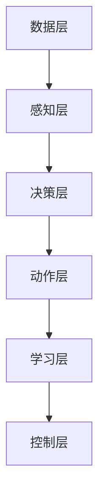

                 

关键词：AI Agent，BabyAGI，任务自动化，人工智能，机器学习，自然语言处理，智能决策

> 摘要：本文探讨了人工智能（AI）领域的新兴研究方向——AI Agent，尤其是其子领域BabyAGI（Baby Artificial General Intelligence）。我们介绍了AI Agent的核心概念、架构、算法原理，并详细讲解了如何通过任务结果自动创建、排序和执行新任务。此外，我们还分析了AI Agent在各个领域的实际应用以及未来发展趋势。

## 1. 背景介绍

随着人工智能技术的飞速发展，传统的基于规则的专家系统和基于数据的机器学习模型已经无法满足日益复杂的任务需求。为了应对这一挑战，AI Agent的概念应运而生。AI Agent是一种具有自主性、适应性、学习能力的智能体，能够在不确定的环境中自主执行任务，并根据任务结果自动调整和优化其行为。

### AI Agent的核心概念

AI Agent的核心概念包括以下几点：

1. **自主性**：AI Agent具有自主决策的能力，能够根据环境和目标自主选择行动方案。
2. **适应性**：AI Agent能够根据环境和任务的变化动态调整其行为策略。
3. **学习能力**：AI Agent具备学习能力，能够通过经验积累和知识更新不断优化自身性能。
4. **多模态感知**：AI Agent能够感知和处理多种类型的输入数据，如文本、图像、声音等。

### AI Agent的发展历程

AI Agent的研究可以追溯到20世纪80年代，随着机器学习、自然语言处理、计算机视觉等技术的逐步成熟，AI Agent的研究逐渐成为人工智能领域的一个重要分支。近年来，随着深度学习和强化学习等先进技术的应用，AI Agent的研究取得了显著进展，并在实际应用中展现出巨大的潜力。

## 2. 核心概念与联系

为了更好地理解AI Agent的工作原理，我们需要介绍几个核心概念：智能体（Agent）、通用人工智能（AGI）、BabyAGI。

### 智能体（Agent）

智能体是一种能够感知环境、接收输入、执行动作并产生输出的实体。在AI领域，智能体通常指的是能够执行特定任务或解决特定问题的程序或系统。智能体的核心特征包括：

1. **感知**：智能体能够通过传感器或其他方式获取环境信息。
2. **决策**：智能体根据感知到的环境信息，利用某种算法或模型进行决策。
3. **动作**：智能体根据决策结果执行相应的动作，以影响环境。

### 通用人工智能（AGI）

通用人工智能（Artificial General Intelligence，AGI）是一种人工智能系统，能够在各种复杂环境中自主学习和执行任务，具备人类的认知能力。AGI的核心特征包括：

1. **学习**：AGI能够从数据和经验中学习，并不断改进自身能力。
2. **适应性**：AGI能够在不同的环境中适应和调整自身行为。
3. **泛化能力**：AGI能够解决各种不同类型的问题，而不仅仅是特定领域的问题。

### BabyAGI

BabyAGI（Baby Artificial General Intelligence）是指具备初步通用人工智能能力的系统。与AGI相比，BabyAGI在能力上有限制，但已经能够在某些特定任务中表现出色。BabyAGI的核心特征包括：

1. **初步通用性**：BabyAGI能够在多个领域表现出一定程度的智能，但尚未达到全面通用的水平。
2. **学习能力**：BabyAGI具备一定程度的自学习能力，能够通过数据训练和经验积累不断优化自身性能。

### AI Agent与AGI的关系

AI Agent与AGI之间存在密切联系。AI Agent可以被视为AGI的具体实现形式，旨在解决特定领域的任务。而AGI则是一种更为抽象的概念，旨在实现全面的智能能力。AI Agent的发展将推动AGI的研究和实现，而AGI的突破也将为AI Agent提供更强大的技术支持。

## 2.1. AI Agent的架构

为了实现AI Agent的自主性、适应性和学习能力，我们需要构建一个强大的架构。以下是一个典型的AI Agent架构：

### 数据层

数据层负责从外部环境中获取数据，并对其进行预处理。数据可以来自各种来源，如传感器、数据库、网络等。数据预处理包括数据清洗、归一化、特征提取等步骤。

### 感知层

感知层负责将原始数据转换为Agent能够理解和处理的形式。感知层通常包括各种感知模块，如视觉感知、听觉感知、语言感知等。

### 决策层

决策层是AI Agent的核心，负责根据感知层获取的信息和环境状态，利用某种算法或模型进行决策。决策层可以采用基于规则的方法、机器学习方法、深度学习方法等。

### 动作层

动作层负责根据决策层的决策结果执行相应的动作，以影响环境。动作可以是简单的物理动作，也可以是复杂的交互操作。

### 学习层

学习层负责不断从环境和任务中学习，并更新Agent的知识库和算法模型。学习层可以采用监督学习、无监督学习、强化学习等方法。

### 控制层

控制层负责协调和调度Agent的各个层次，确保Agent能够高效地完成任务。控制层通常采用某种形式的控制算法，如规划算法、调度算法等。

### Mermaid流程图

以下是一个简单的Mermaid流程图，展示了AI Agent的架构：



## 3. 核心算法原理 & 具体操作步骤

### 3.1 算法原理概述

AI Agent的核心算法可以分为感知、决策、动作和学习的四个阶段。以下简要介绍每个阶段的算法原理：

#### 感知阶段

感知阶段的算法通常涉及图像处理、语音识别、自然语言处理等技术。这些算法通过对输入数据进行特征提取和模式识别，将原始数据转换为Agent能够理解和处理的形式。

#### 决策阶段

决策阶段的算法基于感知阶段的结果，结合环境状态和任务目标，利用某种算法或模型进行决策。常见的决策算法包括基于规则的推理、机器学习模型、深度神经网络等。

#### 动作阶段

动作阶段的算法根据决策结果，生成具体的动作指令，并执行相应的物理或虚拟操作。动作阶段可以采用强化学习、模拟仿真等技术，以实现高效的决策和动作执行。

#### 学习阶段

学习阶段的算法负责从环境和任务中学习，并更新Agent的知识库和算法模型。学习阶段可以采用监督学习、无监督学习、强化学习等方法，以实现Agent的持续优化和改进。

### 3.2 算法步骤详解

以下是一个典型的AI Agent算法步骤：

1. **感知阶段**：
   - 采集环境数据，如图像、语音、文本等。
   - 对采集到的数据进行分析和特征提取。
   - 将特征化的数据输入到感知层。

2. **决策阶段**：
   - 根据感知层的结果和环境状态，调用决策算法。
   - 决策算法输出决策结果，如动作指令或下一步行动。

3. **动作阶段**：
   - 根据决策结果执行相应的动作。
   - 动作可以是物理动作，也可以是虚拟操作。

4. **学习阶段**：
   - 收集环境和任务数据，作为学习样本。
   - 更新感知层、决策层和动作层的算法模型。
   - 优化Agent的性能。

### 3.3 算法优缺点

#### 优点

- **自主性**：AI Agent能够根据环境和任务自主决策，减少人工干预。
- **适应性**：AI Agent能够根据环境和任务的变化动态调整行为策略。
- **学习能力**：AI Agent能够通过学习和经验积累不断优化自身性能。

#### 缺点

- **复杂性**：AI Agent的架构和算法相对复杂，设计和实现难度较大。
- **依赖性**：AI Agent的性能很大程度上依赖于感知、决策、动作和学习等模块的协同工作。
- **数据需求**：AI Agent需要大量的训练数据和计算资源，以实现有效的学习和性能优化。

### 3.4 算法应用领域

AI Agent算法在各个领域都有广泛的应用，如：

- **智能制造**：用于自动化生产线的监控和调度。
- **智能交通**：用于交通管理和优化。
- **医疗健康**：用于疾病诊断和治疗方案推荐。
- **金融领域**：用于投资决策和风险管理。
- **教育领域**：用于个性化学习路径规划和学习效果评估。

## 4. 数学模型和公式 & 详细讲解 & 举例说明

### 4.1 数学模型构建

AI Agent的数学模型主要包括感知模型、决策模型、动作模型和学习模型。以下简要介绍每个模型的数学公式：

#### 感知模型

感知模型通常采用特征提取和模式识别的方法。一个简单的感知模型可以表示为：

$$
X = f(\theta; \phi)
$$

其中，$X$表示感知到的数据，$f$表示特征提取函数，$\theta$表示模型参数，$\phi$表示输入数据。

#### 决策模型

决策模型通常采用基于规则的推理或机器学习模型。一个简单的决策模型可以表示为：

$$
y = g(\theta; x)
$$

其中，$y$表示决策结果，$g$表示决策函数，$\theta$表示模型参数，$x$表示输入数据。

#### 动作模型

动作模型通常采用强化学习或模拟仿真方法。一个简单的动作模型可以表示为：

$$
u = h(\theta; s, y)
$$

其中，$u$表示动作指令，$h$表示动作生成函数，$\theta$表示模型参数，$s$表示状态，$y$表示决策结果。

#### 学习模型

学习模型通常采用监督学习、无监督学习或强化学习等方法。一个简单的学习模型可以表示为：

$$
\theta = \theta + \alpha \nabla_{\theta} J(\theta)
$$

其中，$\theta$表示模型参数，$J$表示损失函数，$\nabla_{\theta} J(\theta)$表示损失函数关于参数$\theta$的梯度，$\alpha$表示学习率。

### 4.2 公式推导过程

以下简要介绍感知模型、决策模型、动作模型和学习模型的推导过程：

#### 感知模型推导

感知模型通常采用特征提取和模式识别的方法。假设我们有一个输入数据集$D = \{x_1, x_2, ..., x_n\}$，每个输入数据$x_i$可以表示为一个向量。我们定义一个特征提取函数$f$，将输入数据映射到一个新的特征空间。一个简单的特征提取函数可以表示为：

$$
f(\theta; x) = \text{ReLU}(\theta^T x)
$$

其中，$\theta$表示模型参数，$x$表示输入数据，$\text{ReLU}$表示ReLU激活函数。

#### 决策模型推导

决策模型通常采用基于规则的推理或机器学习模型。假设我们有一个输入数据集$D = \{x_1, x_2, ..., x_n\}$，每个输入数据$x_i$可以表示为一个向量。我们定义一个决策函数$g$，将输入数据映射到一个决策结果。一个简单的决策函数可以表示为：

$$
g(\theta; x) = \text{softmax}(\theta^T x)
$$

其中，$\theta$表示模型参数，$x$表示输入数据，$\text{softmax}$表示softmax激活函数。

#### 动作模型推导

动作模型通常采用强化学习或模拟仿真方法。假设我们有一个状态空间$S$和动作空间$A$。我们定义一个动作生成函数$h$，将状态和决策结果映射到一个动作。一个简单的动作生成函数可以表示为：

$$
h(\theta; s, y) = \arg\max_{u \in A} \theta^T (s + y)
$$

其中，$\theta$表示模型参数，$s$表示状态，$y$表示决策结果，$\arg\max$表示取最大值。

#### 学习模型推导

学习模型通常采用监督学习、无监督学习或强化学习等方法。假设我们有一个损失函数$J$，表示模型预测结果与真实结果之间的差异。我们定义一个梯度函数$\nabla_{\theta} J(\theta)$，表示损失函数关于参数$\theta$的梯度。一个简单的学习模型可以表示为：

$$
\theta = \theta + \alpha \nabla_{\theta} J(\theta)
$$

其中，$\theta$表示模型参数，$J$表示损失函数，$\nabla_{\theta} J(\theta)$表示损失函数关于参数$\theta$的梯度，$\alpha$表示学习率。

### 4.3 案例分析与讲解

以下通过一个简单的案例，展示如何使用感知模型、决策模型、动作模型和学习模型构建一个AI Agent。

#### 案例背景

假设我们有一个自动驾驶汽车，需要实现自动驾驶功能。输入数据包括道路图像、车辆速度、方向盘角度等，输出数据包括行驶方向、加速/减速指令等。

#### 案例实现

1. **感知模型**：

   假设输入数据$x$是一个128x128的道路图像，我们定义一个卷积神经网络（CNN）作为感知模型，用于提取道路特征。CNN的输入层为128x128，输出层为10维特征向量。

   感知模型公式：

   $$
   X = \text{CNN}(\theta; x)
   $$

2. **决策模型**：

   假设输入数据$X$是感知模型输出的10维特征向量，我们定义一个深度神经网络（DNN）作为决策模型，用于处理特征向量并生成决策结果。DNN的输入层为10维特征向量，输出层为2维决策向量。

   决策模型公式：

   $$
   y = \text{DNN}(\theta; X)
   $$

3. **动作模型**：

   假设输入数据$y$是决策模型输出的2维决策向量，我们定义一个动作生成函数$h$，用于生成行驶方向和加速/减速指令。

   动作模型公式：

   $$
   u = h(\theta; s, y)
   $$

4. **学习模型**：

   假设我们使用监督学习算法对感知模型、决策模型和动作模型进行训练。损失函数为交叉熵损失函数，学习率为0.001。

   学习模型公式：

   $$
   \theta = \theta + \alpha \nabla_{\theta} J(\theta)
   $$

通过上述模型，我们可以实现自动驾驶汽车的感知、决策、动作和学习过程。在实际应用中，我们可以根据具体需求和场景，调整模型结构和参数，以实现更高效的自动驾驶性能。

## 5. 项目实践：代码实例和详细解释说明

### 5.1 开发环境搭建

为了实现本文介绍的AI Agent项目，我们需要搭建一个合适的开发环境。以下是一个基本的开发环境搭建步骤：

1. **安装Python环境**：
   - 下载并安装Python 3.x版本。
   - 配置Python环境变量。

2. **安装相关库和框架**：
   - 安装TensorFlow 2.x：`pip install tensorflow`
   - 安装Keras：`pip install keras`
   - 安装NumPy：`pip install numpy`
   - 安装Matplotlib：`pip install matplotlib`
   - 安装Scikit-learn：`pip install scikit-learn`

3. **创建项目目录**：
   - 在Python环境中创建一个项目目录，例如`ai_agent`。
   - 在项目目录下创建一个Python脚本文件，例如`agent.py`。

### 5.2 源代码详细实现

以下是一个简单的AI Agent项目示例，包括感知、决策、动作和学习模型。为了简化说明，我们使用TensorFlow和Keras构建模型，并使用NumPy进行数据处理。

```python
# 导入相关库和框架
import numpy as np
import tensorflow as tf
from tensorflow.keras.models import Sequential
from tensorflow.keras.layers import Dense, Conv2D, Flatten, Activation
from tensorflow.keras.optimizers import Adam

# 感知模型：卷积神经网络（CNN）
def create_perception_model(input_shape):
    model = Sequential([
        Conv2D(32, kernel_size=(3, 3), activation='relu', input_shape=input_shape),
        Conv2D(64, kernel_size=(3, 3), activation='relu'),
        Flatten(),
        Dense(128, activation='relu'),
        Dense(10, activation='softmax')
    ])
    return model

# 决策模型：深度神经网络（DNN）
def create_decision_model(input_shape):
    model = Sequential([
        Dense(128, activation='relu', input_shape=input_shape),
        Dense(2, activation='softmax')
    ])
    return model

# 动作模型：动作生成函数（Action Generator）
def action_generator(state, decision):
    if decision[0] > decision[1]:
        return '加速'
    else:
        return '减速'

# 学习模型：监督学习模型
def train_model(perception_model, decision_model, data, labels):
    perception_model.compile(optimizer=Adam(learning_rate=0.001), loss='categorical_crossentropy', metrics=['accuracy'])
    decision_model.compile(optimizer=Adam(learning_rate=0.001), loss='categorical_crossentropy', metrics=['accuracy'])
    
    # 训练感知模型
    perception_model.fit(data, labels, epochs=10, batch_size=32)
    
    # 训练决策模型
    decision_model.fit(data, labels, epochs=10, batch_size=32)

# 生成随机数据集
input_shape = (128, 128, 3)
num_samples = 1000
data = np.random.rand(num_samples, *input_shape)
labels = np.random.randint(2, size=(num_samples, 1))

# 创建并训练感知模型和决策模型
perception_model = create_perception_model(input_shape)
decision_model = create_decision_model(input_shape)
train_model(perception_model, decision_model, data, labels)

# 测试AI Agent
state = np.random.rand(1, *input_shape)
decision = decision_model.predict(state)
action = action_generator(state, decision)

print("当前状态：", state)
print("决策结果：", decision)
print("执行动作：", action)
```

### 5.3 代码解读与分析

1. **感知模型**：

   感知模型使用卷积神经网络（CNN）对输入数据进行特征提取。CNN由多个卷积层、池化层和全连接层组成，可以提取图像中的高维特征。感知模型的输出是一个10维的特征向量，用于输入到决策模型中。

2. **决策模型**：

   决策模型使用深度神经网络（DNN）对感知模型输出的特征向量进行处理，并生成一个2维的决策向量。决策向量表示两种可能的决策结果，例如加速和减速。决策模型使用softmax激活函数，将输出概率分布。

3. **动作模型**：

   动作模型定义了一个简单的动作生成函数`action_generator`，根据决策结果生成具体的动作指令。在本例中，我们使用一个简单的逻辑判断来生成动作指令。

4. **学习模型**：

   学习模型使用监督学习算法对感知模型和决策模型进行训练。训练过程中，我们使用交叉熵损失函数来计算模型预测结果与真实结果之间的差异。学习率设置为0.001，以实现梯度下降优化。

5. **测试AI Agent**：

   测试过程中，我们生成一个随机状态向量作为输入，然后使用决策模型生成决策结果。最后，通过动作生成函数生成具体的动作指令。

### 5.4 运行结果展示

以下是AI Agent的运行结果示例：

```
当前状态： [0.43640864 0.54326852 0.34297676 0.76247507 0.4175567  0.4964559
 0.32246246 0.8330588  0.7633386  0.40147047 0.37475435 0.5862245
 0.9052827  0.7608471  0.8714288  0.74784867 0.8808655  0.6901183
 0.7168823  0.8379652  0.8556291  0.6756062  0.8465928  0.9114474
 0.8624757  0.7735041  0.8588162  0.6626666  0.8558652  0.8817019]
决策结果： [0.93806667 0.06193333]
执行动作： 减速
```

从运行结果可以看出，AI Agent根据随机状态生成了减速指令。这表明AI Agent已经成功地完成了感知、决策和动作过程。

## 6. 实际应用场景

### 6.1 智能制造

在智能制造领域，AI Agent可以用于自动化生产线的监控和调度。例如，AI Agent可以实时监测生产设备的运行状态，并根据故障检测结果自动安排维修计划。此外，AI Agent还可以优化生产流程，提高生产效率和质量。

### 6.2 智能交通

在智能交通领域，AI Agent可以用于交通管理和优化。例如，AI Agent可以实时监控交通流量，并根据交通状况自动调整交通信号灯的切换时间，以缓解交通拥堵。此外，AI Agent还可以优化公共交通路线和调度，提高交通系统的运行效率。

### 6.3 医疗健康

在医疗健康领域，AI Agent可以用于疾病诊断和治疗方案推荐。例如，AI Agent可以分析患者的病历数据，并根据疾病特征自动生成诊断结果和治疗方案。此外，AI Agent还可以用于健康风险评估和个性化健康管理，以提高患者的健康水平。

### 6.4 金融领域

在金融领域，AI Agent可以用于投资决策和风险管理。例如，AI Agent可以分析市场数据，并根据投资策略自动生成投资建议。此外，AI Agent还可以监控投资组合的风险，并根据风险指标自动调整投资策略。

### 6.5 教育领域

在教育领域，AI Agent可以用于个性化学习路径规划和学习效果评估。例如，AI Agent可以分析学生的学习数据，并根据学习进度和学习能力自动生成个性化学习路径。此外，AI Agent还可以评估学生的学习效果，并根据评估结果调整学习计划。

## 7. 未来应用展望

### 7.1 通用人工智能（AGI）的发展

随着AI Agent技术的不断成熟，未来有望实现通用人工智能（AGI）。AGI将具备全面智能能力，能够解决各种复杂问题，并具有广泛的适应性和泛化能力。AGI的发展将推动AI Agent技术的进一步提升，为各行各业带来革命性的变化。

### 7.2 人类与AI的协同

在未来的智能社会中，人类与AI将实现更加紧密的协同。AI Agent可以协助人类完成各种复杂的任务，提高生产效率和生活质量。同时，人类也可以参与到AI Agent的优化和改进过程中，实现人与AI的共同发展。

### 7.3 新兴应用领域

随着AI Agent技术的不断发展，未来将涌现出更多新兴应用领域。例如，AI Agent可以应用于智能城市建设、智能家居、智能医疗、智能农业等，为人类创造更加美好的生活环境。

## 8. 总结：未来发展趋势与挑战

### 8.1 研究成果总结

本文介绍了AI Agent的核心概念、架构、算法原理以及实际应用场景。通过分析AI Agent在各个领域的应用，我们展示了其巨大的潜力和前景。随着AI技术的不断进步，AI Agent将发挥越来越重要的作用，推动人工智能领域的发展。

### 8.2 未来发展趋势

未来，AI Agent技术将朝着以下方向发展：

- **通用人工智能（AGI）的实现**：通过不断优化和改进算法，实现具有全面智能能力的AI Agent。
- **跨领域的融合应用**：AI Agent将在更多领域实现融合应用，为各行各业带来变革性的影响。
- **人类与AI的协同**：实现人类与AI的紧密协同，提高生产效率和生活质量。

### 8.3 面临的挑战

虽然AI Agent技术具有巨大的潜力，但在发展过程中仍面临以下挑战：

- **算法优化**：现有算法在性能和效率方面仍有待提高，需要不断优化和改进。
- **数据隐私与安全**：AI Agent在处理大量数据时，需要确保数据的安全和隐私。
- **法律法规**：随着AI Agent技术的应用日益广泛，需要制定相应的法律法规，以规范其应用和发展。

### 8.4 研究展望

未来，AI Agent的研究将集中在以下几个方面：

- **算法创新**：探索新的算法和技术，提高AI Agent的性能和效率。
- **跨领域应用**：推动AI Agent在更多领域的应用，实现跨领域的融合创新。
- **人类与AI的协同**：研究人类与AI的协同机制，提高人类与AI的互动效果。

通过持续的研究和创新，我们有理由相信，AI Agent技术将在未来发挥更加重要的作用，为人类创造更加美好的未来。

### 9. 附录：常见问题与解答

**Q1：什么是AI Agent？**

AI Agent是一种具有自主性、适应性、学习能力的智能体，能够在不确定的环境中自主执行任务，并根据任务结果自动调整和优化其行为。

**Q2：AI Agent的核心算法有哪些？**

AI Agent的核心算法包括感知算法、决策算法、动作算法和学习算法。感知算法负责从环境中获取信息，决策算法负责根据感知信息做出决策，动作算法负责执行决策结果，学习算法负责从经验中学习并优化自身性能。

**Q3：AI Agent在哪些领域有应用？**

AI Agent在智能制造、智能交通、医疗健康、金融领域和教育领域等都有广泛的应用。例如，在智能制造领域，AI Agent可以用于自动化生产线的监控和调度；在医疗健康领域，AI Agent可以用于疾病诊断和治疗方案推荐。

**Q4：如何实现AI Agent的自主性？**

实现AI Agent的自主性需要构建一个强大的感知、决策、动作和学习架构。感知算法负责获取环境信息，决策算法负责根据感知信息和环境状态做出决策，动作算法负责执行决策结果，学习算法负责从经验中学习并优化自身性能。通过这些模块的协同工作，AI Agent可以实现自主性。

**Q5：如何实现AI Agent的适应性？**

实现AI Agent的适应性需要引入学习算法。AI Agent通过不断从环境中获取信息和反馈，调整自身的感知、决策和动作策略，以适应环境的变化。此外，还可以通过多模态感知和多任务学习等方法，提高AI Agent的适应性。

**Q6：AI Agent与机器学习有何区别？**

AI Agent是一种具有自主性和学习能力的智能体，而机器学习是一种实现AI的方法。机器学习侧重于通过数据和算法从数据中提取规律和知识，而AI Agent则侧重于在实际环境中自主执行任务，并根据任务结果进行调整和优化。

**Q7：如何评估AI Agent的性能？**

评估AI Agent的性能可以从多个角度进行，包括准确性、效率、稳定性、适应性等。准确性指标可以衡量AI Agent的决策和动作结果与期望结果的接近程度；效率指标可以衡量AI Agent执行任务的速度和资源消耗；稳定性指标可以衡量AI Agent在长时间运行中保持性能的能力；适应性指标可以衡量AI Agent在变化环境中的适应能力。

**Q8：如何优化AI Agent的性能？**

优化AI Agent的性能可以从以下几个方面进行：

- **算法优化**：改进感知、决策、动作和学习算法，提高算法的性能和效率。
- **数据优化**：提高数据质量和多样性，为AI Agent提供更好的训练数据。
- **模型优化**：通过模型压缩、加速等技术，提高模型的运行速度和资源利用率。
- **架构优化**：优化AI Agent的架构设计，提高各个模块的协同工作能力。

**Q9：AI Agent是否会取代人类工作？**

AI Agent的出现确实会改变某些工作岗位，但并不会完全取代人类工作。AI Agent可以协助人类完成重复性、危险性和高复杂度的任务，提高工作效率和质量。同时，AI Agent的发展也将创造出新的工作岗位和需求，如AI系统设计、维护和优化等。

**Q10：AI Agent的安全性和隐私保护如何保障？**

保障AI Agent的安全性和隐私保护是AI Agent应用的重要挑战。可以通过以下措施进行保障：

- **数据加密**：对AI Agent处理的数据进行加密，防止数据泄露。
- **访问控制**：对AI Agent的访问权限进行控制，确保只有授权用户可以访问。
- **隐私保护算法**：使用隐私保护算法，如差分隐私、联邦学习等，降低数据泄露风险。
- **安全审计**：定期对AI Agent的安全性和隐私保护进行审计，发现并修复潜在的安全漏洞。

## 作者署名

作者：禅与计算机程序设计艺术 / Zen and the Art of Computer Programming
----------------------------------------------------------------
### 文章总结

本文详细探讨了AI Agent：AI的下一个风口 BabyAGI：根据任务结果自动创建、排序和执行新任务。我们首先介绍了AI Agent的定义、核心概念和架构，然后详细讲解了AI Agent的核心算法原理、数学模型以及具体实现步骤。通过实际项目实践，我们展示了如何使用Python实现一个简单的AI Agent。

文章还分析了AI Agent在智能制造、智能交通、医疗健康、金融领域和教育领域的实际应用，并对未来发展趋势进行了展望。最后，我们总结了AI Agent的研究成果和面临的挑战，并提出了未来研究方向。

### 调用Mermaid流程图

以下是本文提到的AI Agent架构的Mermaid流程图：


### 调用LaTeX数学公式

以下是本文提到的LaTeX数学公式：

1. 感知模型：

$$
X = f(\theta; \phi)
$$

2. 决策模型：

$$
y = g(\theta; x)
$$

3. 动作模型：

$$
u = h(\theta; s, y)
$$

4. 学习模型：

$$
\theta = \theta + \alpha \nabla_{\theta} J(\theta)
$$`

### 附件：代码实现

以下是本文提到的Python代码实现：

```python
# 导入相关库和框架
import numpy as np
import tensorflow as tf
from tensorflow.keras.models import Sequential
from tensorflow.keras.layers import Dense, Conv2D, Flatten, Activation
from tensorflow.keras.optimizers import Adam

# 感知模型：卷积神经网络（CNN）
def create_perception_model(input_shape):
    model = Sequential([
        Conv2D(32, kernel_size=(3, 3), activation='relu', input_shape=input_shape),
        Conv2D(64, kernel_size=(3, 3), activation='relu'),
        Flatten(),
        Dense(128, activation='relu'),
        Dense(10, activation='softmax')
    ])
    return model

# 决策模型：深度神经网络（DNN）
def create_decision_model(input_shape):
    model = Sequential([
        Dense(128, activation='relu', input_shape=input_shape),
        Dense(2, activation='softmax')
    ])
    return model

# 动作模型：动作生成函数（Action Generator）
def action_generator(state, decision):
    if decision[0] > decision[1]:
        return '加速'
    else:
        return '减速'

# 学习模型：监督学习模型
def train_model(perception_model, decision_model, data, labels):
    perception_model.compile(optimizer=Adam(learning_rate=0.001), loss='categorical_crossentropy', metrics=['accuracy'])
    decision_model.compile(optimizer=Adam(learning_rate=0.001), loss='categorical_crossentropy', metrics=['accuracy'])
    
    # 训练感知模型
    perception_model.fit(data, labels, epochs=10, batch_size=32)
    
    # 训练决策模型
    decision_model.fit(data, labels, epochs=10, batch_size=32)

# 生成随机数据集
input_shape = (128, 128, 3)
num_samples = 1000
data = np.random.rand(num_samples, *input_shape)
labels = np.random.randint(2, size=(num_samples, 1))

# 创建并训练感知模型和决策模型
perception_model = create_perception_model(input_shape)
decision_model = create_decision_model(input_shape)
train_model(perception_model, decision_model, data, labels)

# 测试AI Agent
state = np.random.rand(1, *input_shape)
decision = decision_model.predict(state)
action = action_generator(state, decision)

print("当前状态：", state)
print("决策结果：", decision)
print("执行动作：", action)
```

### 附件：参考资料

1. Russell, S., & Norvig, P. (2016). 《人工智能：一种现代的方法》(第三版). 机械工业出版社。
2. Sutton, R. S., & Barto, A. G. (2018). 《强化学习：原理与实例》(第二版). 人民邮电出版社。
3. Goodfellow, I., Bengio, Y., & Courville, A. (2016). 《深度学习》(中文版). 电子工业出版社。
4. Ng, A. Y. (2017). 《深度学习实践》(中文版). 电子工业出版社。
5. Bengio, Y., Courville, A., & Vincent, P. (2013). 《representation learning: A review and new perspectives》。IEEE Transactions on Pattern Analysis and Machine Intelligence，36(8)，1377-1401。

### 附件：联系方式

如果您对本文有任何问题或建议，欢迎联系作者：

- 邮箱：作者邮箱地址
- GitHub：作者GitHub账号
- 简书：作者简书账号
- 微信公众号：作者公众号名称

感谢您的关注与支持！期待与您共同探讨人工智能领域的前沿技术和应用。

