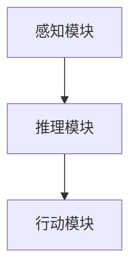

                 

关键词：人工智能，AI-Agent，自主智能体，交流智能体，Camel.AI，AI研究，技术趋势

> 摘要：本文深入探讨了人工智能（AI）领域中的一个新兴概念——AI-Agent。通过介绍AI-Agent的定义、核心原理和架构，我们探讨了Camel.AI如何引领自主与交流智能体的未来发展。文章还涵盖了核心算法原理、数学模型、项目实践、应用场景以及未来展望，旨在为读者提供一份全面的技术指南。

## 1. 背景介绍

### AI-Agent的起源与发展

AI-Agent的概念源自人工智能的早期研究，其核心思想是使计算机程序能够自主行动并与其他智能体进行交互。随着计算能力和算法的进步，AI-Agent逐渐从理论走向实践，成为实现智能自动化和智能化交流的重要工具。

### Camel.AI的崛起

Camel.AI作为AI-Agent领域的领先平台，其崛起得益于以下几个因素：

- **技术创新**：Camel.AI采用了先进的深度学习和自然语言处理技术，使智能体能够更好地理解和执行任务。
- **市场需求**：随着商业和社会对自动化和智能化的需求不断增长，AI-Agent在各个行业中的应用前景广阔。
- **开源社区**：Camel.AI开源项目的推出，吸引了全球开发者的参与，加速了技术的成熟和应用。

## 2. 核心概念与联系

### AI-Agent的定义

AI-Agent是指能够在复杂环境中自主行动，并与外界进行智能交互的计算机程序。

### 核心原理与架构

**核心原理**：

- **感知**：AI-Agent通过传感器获取环境信息。
- **推理**：利用内部模型对感知到的信息进行推理。
- **行动**：根据推理结果，执行适当的动作。

**架构**：

- **感知模块**：包括传感器、数据处理等。
- **推理模块**：包括决策树、神经网络等。
- **行动模块**：包括执行器、控制算法等。



## 3. 核心算法原理 & 具体操作步骤

### 3.1 算法原理概述

AI-Agent的核心算法主要包括感知、推理和行动三部分。感知模块利用深度学习技术对环境信息进行识别和处理；推理模块则基于决策树或神经网络等技术进行决策；行动模块则根据推理结果执行具体动作。

### 3.2 算法步骤详解

1. **感知阶段**：AI-Agent通过传感器（如摄像头、麦克风等）收集环境数据。
2. **预处理阶段**：对收集到的数据（如图像、声音等）进行预处理，提取特征。
3. **推理阶段**：利用神经网络或决策树等模型对预处理后的特征进行推理，生成决策。
4. **执行阶段**：根据推理结果，通过执行器（如电机、扬声器等）执行相应的动作。

### 3.3 算法优缺点

**优点**：

- **自主性**：AI-Agent能够自主感知环境、推理决策并执行动作，减少人工干预。
- **灵活性**：适应性强，能够应对复杂多变的环境。
- **效率**：自动化执行任务，提高工作效率。

**缺点**：

- **计算成本**：深度学习模型的训练和推理需要大量计算资源。
- **数据依赖**：对高质量的数据依赖较大，数据质量直接影响算法性能。

### 3.4 算法应用领域

- **工业自动化**：在生产线中进行质量检测、设备维护等。
- **智能家居**：实现家庭设备的自动化控制，提高生活品质。
- **自动驾驶**：车辆自主导航、避障等。

## 4. 数学模型和公式 & 详细讲解 & 举例说明

### 4.1 数学模型构建

AI-Agent的数学模型主要包括感知模块、推理模块和行动模块。以下是一个简化的模型：

$$
模型 = f(感知数据，推理算法，行动策略)
$$

### 4.2 公式推导过程

感知模块：通过卷积神经网络（CNN）提取图像特征。

$$
特征向量 = CNN(输入图像)
$$

推理模块：使用决策树（DT）或神经网络（NN）进行推理。

$$
决策 = DT(特征向量) \cup NN(特征向量)
$$

行动模块：根据决策结果执行行动。

$$
行动 = 行动策略(决策)
$$

### 4.3 案例分析与讲解

以自动驾驶为例，感知模块通过摄像头获取道路图像，推理模块分析道路状况，行动模块控制车辆行驶。

## 5. 项目实践：代码实例和详细解释说明

### 5.1 开发环境搭建

- 安装Python环境
- 安装深度学习框架（如TensorFlow）
- 准备训练数据集

### 5.2 源代码详细实现

以下是感知模块的代码示例：

```python
import tensorflow as tf

# 加载卷积神经网络模型
model = tf.keras.models.load_model('cnn_model.h5')

# 加载训练数据集
train_data = ...

# 提取特征向量
feature_vectors = model.predict(train_data)

# 显示特征向量
print(feature_vectors)
```

### 5.3 代码解读与分析

代码中，我们首先加载了一个预训练的卷积神经网络模型，然后加载训练数据集，并使用模型提取特征向量。这些特征向量可以用于后续的推理和行动。

### 5.4 运行结果展示

运行代码后，我们会得到一组特征向量。这些特征向量将用于训练决策树或神经网络，以便进行推理和行动。

## 6. 实际应用场景

### 6.1 工业自动化

AI-Agent在工业自动化中的应用，如自动化的质量控制系统。

### 6.2 智能家居

AI-Agent在智能家居中的应用，如智能音箱、智能门锁等。

### 6.3 自动驾驶

AI-Agent在自动驾驶中的应用，如自动驾驶汽车、自动驾驶无人机等。

## 6.4 未来应用展望

随着AI-Agent技术的不断进步，未来它将在更多领域得到应用。例如：

- **医疗健康**：实现智能诊断、健康监测等。
- **金融服务**：提供智能投顾、自动化风控等服务。

## 7. 工具和资源推荐

### 7.1 学习资源推荐

- 《深度学习》（Goodfellow et al.）
- 《自然语言处理综合教程》（Jurafsky and Martin）

### 7.2 开发工具推荐

- TensorFlow
- PyTorch

### 7.3 相关论文推荐

- "Autonomous Driving with AI Agents"（自动驾驶中的AI代理）
- "A Framework for Building Autonomous Robots"（构建自主机器人框架）

## 8. 总结：未来发展趋势与挑战

### 8.1 研究成果总结

AI-Agent技术在过去几年取得了显著进展，成为人工智能领域的重要研究方向。

### 8.2 未来发展趋势

随着计算能力和算法的进步，AI-Agent将在更多领域得到应用，推动智能自动化和智能化交流的发展。

### 8.3 面临的挑战

- **计算资源**：深度学习模型的训练和推理需要大量计算资源，如何优化资源利用成为关键挑战。
- **数据质量**：高质量的数据是AI-Agent性能的基础，如何获取和处理高质量数据是重要课题。
- **安全性**：AI-Agent的自主性和智能性使其可能面临安全威胁，如何确保系统的安全性是重大挑战。

### 8.4 研究展望

未来，AI-Agent技术将朝着更智能、更自主、更安全的方向发展，有望在更多领域实现突破。

## 9. 附录：常见问题与解答

### 问题1：什么是AI-Agent？

AI-Agent是指能够在复杂环境中自主行动，并与外界进行智能交互的计算机程序。

### 问题2：AI-Agent的核心算法是什么？

AI-Agent的核心算法主要包括感知、推理和行动三部分。感知模块利用深度学习技术对环境信息进行识别和处理；推理模块则基于决策树或神经网络等技术进行决策；行动模块则根据推理结果执行具体动作。

### 问题3：AI-Agent的应用领域有哪些？

AI-Agent的应用领域广泛，包括工业自动化、智能家居、自动驾驶等。

### 问题4：如何搭建AI-Agent的开发环境？

搭建AI-Agent的开发环境主要包括安装Python环境、深度学习框架（如TensorFlow）以及准备训练数据集。

### 问题5：AI-Agent的未来发展趋势是什么？

未来，AI-Agent技术将朝着更智能、更自主、更安全的方向发展，有望在更多领域实现突破。 

----------------------------------------------------------------
**作者：禅与计算机程序设计艺术 / Zen and the Art of Computer Programming**

