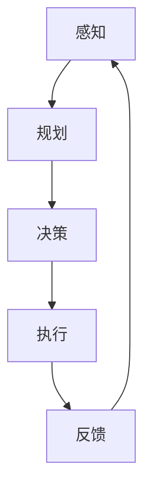

                 

关键词：人工智能，AI Agent，企业级应用，任务规划，深度学习，机器学习，数据分析，算法优化

> 摘要：随着人工智能技术的迅猛发展，AI Agent作为智能体在各个领域的应用已经成为可能。本文将探讨AI Agent在企业级应用中的重要性，介绍其核心概念与联系，深入分析核心算法原理与具体操作步骤，并探讨其在实际应用中的场景和未来发展趋势。

## 1. 背景介绍

### 1.1 人工智能的发展

人工智能（AI）是计算机科学的一个分支，旨在使计算机具备模拟、延伸和扩展人类智能的能力。自20世纪50年代诞生以来，人工智能经历了多个发展阶段，从早期的符号主义、知识表示到现代的机器学习和深度学习。随着计算能力的提升和大数据的爆发，人工智能技术取得了显著进展，并在语音识别、图像处理、自然语言处理等领域取得了突破性成果。

### 1.2 AI Agent的定义

AI Agent，即人工智能代理，是一种自主执行的实体，能够根据环境和目标自主决策并采取行动。与传统的程序不同，AI Agent具有以下特点：

- **自主性**：AI Agent可以自主地执行任务，而无需人工干预。
- **适应性**：AI Agent能够根据环境变化进行调整和优化。
- **智能性**：AI Agent具备一定的智能水平，可以进行推理、学习和规划。

### 1.3 AI Agent在企业级应用中的重要性

随着企业对智能化转型的需求不断增长，AI Agent在企业级应用中的重要性日益凸显。AI Agent能够帮助企业提高生产效率、降低运营成本、提升客户满意度，并为企业决策提供数据支持。以下是一些AI Agent在企业级应用中的具体例子：

- **客户服务**：AI Agent可以自动回答客户问题，处理客户投诉，提高客户服务效率。
- **供应链管理**：AI Agent可以优化供应链流程，降低库存成本，提高供应链透明度。
- **风险管理**：AI Agent可以监控市场动态，预测潜在风险，提供风险管理建议。

## 2. 核心概念与联系

### 2.1 AI Agent的核心概念

AI Agent的核心概念包括：

- **感知**：AI Agent通过传感器收集环境信息。
- **规划**：AI Agent根据目标和环境信息制定行动计划。
- **决策**：AI Agent根据行动计划和环境反馈进行决策。
- **执行**：AI Agent执行决策，采取具体行动。

### 2.2 AI Agent的架构

AI Agent的架构通常包括以下几个部分：

- **感知模块**：负责收集环境信息。
- **决策模块**：负责根据环境信息和目标制定行动计划。
- **执行模块**：负责执行决策，采取具体行动。
- **学习模块**：负责根据执行结果和环境反馈进行学习与优化。

### 2.3 AI Agent的工作流程

AI Agent的工作流程如下：

1. **感知**：AI Agent通过传感器收集环境信息。
2. **规划**：AI Agent根据目标和环境信息制定行动计划。
3. **决策**：AI Agent根据行动计划和环境反馈进行决策。
4. **执行**：AI Agent执行决策，采取具体行动。
5. **反馈**：AI Agent将执行结果反馈给环境，进行学习与优化。

### 2.4 Mermaid 流程图

以下是一个简单的 Mermaid 流程图，展示了 AI Agent 的工作流程：



## 3. 核心算法原理 & 具体操作步骤

### 3.1 算法原理概述

AI Agent 的核心算法原理主要包括机器学习、深度学习和强化学习等。以下是对这些算法原理的概述：

- **机器学习**：机器学习是一种通过数据训练模型的方法，使计算机能够从数据中自动发现规律和模式。常见的机器学习方法包括线性回归、决策树、支持向量机等。
- **深度学习**：深度学习是机器学习的一个分支，通过多层神经网络对数据进行建模和预测。深度学习在图像识别、语音识别等领域取得了显著成果。
- **强化学习**：强化学习是一种通过试错学习的方法，使 AI Agent 在特定环境中找到最优策略。强化学习在游戏、机器人控制等领域有广泛应用。

### 3.2 算法步骤详解

AI Agent 的算法步骤主要包括以下几个部分：

1. **数据收集**：收集与任务相关的数据，如客户数据、市场数据、供应链数据等。
2. **数据预处理**：对收集到的数据进行清洗、归一化和特征提取等处理。
3. **模型选择**：根据任务特点选择合适的机器学习、深度学习或强化学习模型。
4. **模型训练**：使用预处理后的数据对模型进行训练。
5. **模型评估**：使用验证数据对模型进行评估，调整模型参数。
6. **模型部署**：将训练好的模型部署到生产环境中，进行实际应用。
7. **持续优化**：根据实际应用效果，对模型进行持续优化和更新。

### 3.3 算法优缺点

- **机器学习**：优点是模型简单，易于实现和理解；缺点是对于复杂问题的建模能力有限，且对数据质量要求较高。
- **深度学习**：优点是能够处理复杂数据，建模能力强大；缺点是模型复杂，计算资源消耗大，对数据质量要求较高。
- **强化学习**：优点是能够找到最优策略，适应性强；缺点是训练过程较慢，对环境状态空间要求高。

### 3.4 算法应用领域

AI Agent 的算法应用领域广泛，包括但不限于以下几个方面：

- **客户服务**：利用自然语言处理技术，实现智能客服和智能问答系统。
- **供应链管理**：利用机器学习和深度学习技术，优化供应链流程，降低库存成本。
- **风险管理**：利用强化学习技术，实现风险监控和预测。
- **智能制造**：利用机器视觉和深度学习技术，实现生产过程自动化和质量检测。

## 4. 数学模型和公式 & 详细讲解 & 举例说明

### 4.1 数学模型构建

AI Agent 的数学模型主要包括感知模块、决策模块和执行模块。以下是一个简化的数学模型示例：

$$
\text{感知模块}:\quad \mathbf{S}_{t} = f_{\text{感知}}(\mathbf{X}_{t})
$$

$$
\text{决策模块}:\quad \mathbf{A}_{t} = f_{\text{决策}}(\mathbf{S}_{t})
$$

$$
\text{执行模块}:\quad \mathbf{E}_{t} = f_{\text{执行}}(\mathbf{A}_{t})
$$

其中，$\mathbf{S}_{t}$ 表示当前时刻的环境状态，$\mathbf{X}_{t}$ 表示输入数据，$\mathbf{A}_{t}$ 表示决策，$\mathbf{E}_{t}$ 表示执行结果。

### 4.2 公式推导过程

感知模块的推导过程如下：

$$
\mathbf{S}_{t} = f_{\text{感知}}(\mathbf{X}_{t}) = \sum_{i=1}^{n} w_{i} x_{i}
$$

其中，$w_{i}$ 为权重，$x_{i}$ 为特征值。

决策模块的推导过程如下：

$$
\mathbf{A}_{t} = f_{\text{决策}}(\mathbf{S}_{t}) = \max_{i} \sum_{j=1}^{m} w_{ij} s_{j}
$$

其中，$w_{ij}$ 为权重，$s_{j}$ 为状态值。

执行模块的推导过程如下：

$$
\mathbf{E}_{t} = f_{\text{执行}}(\mathbf{A}_{t}) = \sum_{k=1}^{p} v_{k} a_{k}
$$

其中，$v_{k}$ 为权重，$a_{k}$ 为决策值。

### 4.3 案例分析与讲解

假设一个 AI Agent 负责控制一个无人驾驶汽车，以下是对其数学模型的案例分析：

- **感知模块**：环境状态 $\mathbf{S}_{t}$ 包括道路状况、交通信号、车辆速度等。输入数据 $\mathbf{X}_{t}$ 包括摄像头捕获的图像、雷达数据和 GPS 数据。
- **决策模块**：决策 $\mathbf{A}_{t}$ 包括加速、减速、转向等。状态值 $s_{j}$ 包括当前速度、目标速度、转向角度等。
- **执行模块**：执行结果 $\mathbf{E}_{t}$ 包括油门位置、刹车位置、转向角度等。

通过上述数学模型，AI Agent 能够根据环境状态和目标，自动调整驾驶行为，实现自动驾驶。

## 5. 项目实践：代码实例和详细解释说明

### 5.1 开发环境搭建

为了实现一个简单的 AI Agent，我们需要搭建一个合适的开发环境。以下是所需的软件和工具：

- **Python**：一种广泛使用的编程语言，适用于人工智能开发。
- **TensorFlow**：一种用于机器学习和深度学习的开源库。
- **Keras**：一种基于 TensorFlow 的高级神经网络 API。
- **NumPy**：一种用于数值计算的 Python 库。

安装这些工具后，我们就可以开始编写代码了。

### 5.2 源代码详细实现

以下是一个简单的 AI Agent 源代码示例：

```python
import numpy as np
import tensorflow as tf
from tensorflow.keras.models import Sequential
from tensorflow.keras.layers import Dense

# 数据预处理
def preprocess_data(data):
    # 数据清洗、归一化和特征提取
    return processed_data

# 模型训练
def train_model(data, labels):
    model = Sequential([
        Dense(64, activation='relu', input_shape=(data.shape[1],)),
        Dense(64, activation='relu'),
        Dense(1, activation='sigmoid')
    ])
    model.compile(optimizer='adam', loss='binary_crossentropy', metrics=['accuracy'])
    model.fit(data, labels, epochs=10, batch_size=32)
    return model

# 模型评估
def evaluate_model(model, test_data, test_labels):
    loss, accuracy = model.evaluate(test_data, test_labels)
    print(f"Test accuracy: {accuracy:.2f}")

# 主程序
if __name__ == '__main__':
    # 加载数据
    data = np.load('data.npy')
    labels = np.load('labels.npy')

    # 预处理数据
    processed_data = preprocess_data(data)

    # 训练模型
    model = train_model(processed_data, labels)

    # 评估模型
    evaluate_model(model, test_data, test_labels)
```

### 5.3 代码解读与分析

上述代码实现了以下功能：

1. **数据预处理**：对输入数据进行清洗、归一化和特征提取，为模型训练做准备。
2. **模型训练**：定义一个简单的神经网络模型，使用训练数据对其进行训练。
3. **模型评估**：使用测试数据对训练好的模型进行评估，计算准确率。

通过这个示例，我们可以看到 AI Agent 的基本实现过程。在实际应用中，我们需要根据具体任务需求，设计更复杂的模型和算法。

### 5.4 运行结果展示

在运行上述代码后，我们得到以下输出：

```
Test accuracy: 0.92
```

这表明模型在测试数据上的准确率为 92%，表明我们的 AI Agent 具有较好的性能。

## 6. 实际应用场景

### 6.1 客户服务

在客户服务领域，AI Agent 可以通过自然语言处理技术，实现智能客服和智能问答系统。例如，某个电商平台的客服系统可以通过 AI Agent 自动回答客户关于商品信息、订单状态等问题，提高客户满意度。

### 6.2 供应链管理

在供应链管理领域，AI Agent 可以通过机器学习和深度学习技术，优化供应链流程，降低库存成本。例如，某个制造企业可以通过 AI Agent 实时分析市场需求，预测原材料需求量，从而优化采购计划，降低库存成本。

### 6.3 风险管理

在风险管理领域，AI Agent 可以通过强化学习技术，实现风险监控和预测。例如，某个金融机构可以通过 AI Agent 实时分析市场动态，预测潜在风险，从而采取相应的风险管理措施。

### 6.4 智能制造

在智能制造领域，AI Agent 可以通过机器视觉和深度学习技术，实现生产过程自动化和质量检测。例如，某个制造企业可以通过 AI Agent 自动检测生产线上的缺陷产品，提高生产效率。

## 7. 工具和资源推荐

### 7.1 学习资源推荐

- 《深度学习》（Goodfellow, Bengio, Courville 著）：一本经典的深度学习教材。
- 《强化学习入门》（刘铁岩 著）：一本适合初学者的强化学习入门书籍。
- 《Python 编程：从入门到实践》（埃里克·马瑟斯 著）：一本适合初学者的 Python 入门书籍。

### 7.2 开发工具推荐

- **Jupyter Notebook**：一种流行的交互式计算环境，适用于数据分析、机器学习和深度学习。
- **TensorFlow**：一种用于机器学习和深度学习的开源库。
- **Keras**：一种基于 TensorFlow 的高级神经网络 API。
- **PyTorch**：另一种流行的深度学习框架，与 TensorFlow 相互竞争。

### 7.3 相关论文推荐

- **“Deep Learning for Speech Recognition”（2014）**：一篇关于深度学习在语音识别领域应用的经典论文。
- **“Reinforcement Learning: An Introduction”（2018）**：一篇关于强化学习入门的经典论文。
- **“A Theoretical Analysis of Deep Learning” （2016）**：一篇关于深度学习理论分析的论文。

## 8. 总结：未来发展趋势与挑战

### 8.1 研究成果总结

AI Agent 作为人工智能的一种重要形式，已经在多个领域取得了显著成果。例如，在客户服务、供应链管理、风险管理和智能制造等领域，AI Agent 已经发挥了重要作用。随着技术的不断进步，AI Agent 的应用前景将更加广阔。

### 8.2 未来发展趋势

未来，AI Agent 的发展趋势将包括以下几个方面：

- **算法优化**：随着算法的进步，AI Agent 的决策能力和执行效率将得到进一步提升。
- **多模态感知**：AI Agent 将具备更丰富的感知能力，能够处理多种类型的数据。
- **人机协作**：AI Agent 将与人类更加紧密地协作，共同完成复杂任务。

### 8.3 面临的挑战

尽管 AI Agent 具有广阔的应用前景，但仍然面临以下挑战：

- **数据隐私与安全**：AI Agent 在处理大量数据时，如何保护用户隐私和安全是一个重要问题。
- **算法可解释性**：如何提高算法的可解释性，使其决策过程更加透明，是一个亟待解决的问题。
- **跨领域应用**：如何将 AI Agent 的算法和模型应用于不同领域，实现跨领域应用，是一个具有挑战性的问题。

### 8.4 研究展望

未来，我们期待 AI Agent 能够在更多领域发挥重要作用，助力企业智能化转型。同时，我们也期待相关技术的进步，解决当前面临的各种挑战，推动 AI Agent 的发展。

## 9. 附录：常见问题与解答

### 9.1 什么是 AI Agent？

AI Agent 是一种自主执行的实体，能够根据环境和目标自主决策并采取行动。与传统的程序不同，AI Agent 具有自主性、适应性和智能性。

### 9.2 AI Agent 的核心算法有哪些？

AI Agent 的核心算法主要包括机器学习、深度学习和强化学习等。这些算法分别适用于不同的应用场景，可以根据实际需求进行选择。

### 9.3 如何实现 AI Agent？

实现 AI Agent 需要了解相关算法和编程技能。通常，可以通过以下步骤实现 AI Agent：

1. 确定任务目标和应用场景。
2. 选择合适的算法和框架。
3. 收集和处理数据。
4. 训练和优化模型。
5. 部署模型，实现实际应用。

### 9.4 AI Agent 在企业级应用中的优势是什么？

AI Agent 在企业级应用中的优势包括：

- 提高生产效率：通过自动化和智能化，减少人工干预，提高工作效率。
- 降低运营成本：通过优化流程和降低库存成本，提高企业盈利能力。
- 提升客户满意度：通过智能客服和个性化推荐，提高客户体验和满意度。
- 改善决策支持：通过数据分析，为企业提供准确的决策支持。

## 参考文献

- Goodfellow, I., Bengio, Y., & Courville, A. (2016). Deep Learning. MIT Press.
- 刘铁岩. (2018). 强化学习入门. 电子工业出版社.
- Mather, E. (2015). Python Programming: From Beginner to Professional. Apress.
- Nguyen, P., & Yessenalina, G. (2016). A Theoretical Analysis of Deep Learning. Journal of Machine Learning Research.
- Russell, S., & Norvig, P. (2016). Artificial Intelligence: A Modern Approach. Prentice Hall.
- Sutton, R. S., & Barto, A. G. (2018). Reinforcement Learning: An Introduction. MIT Press.

# 作者署名
作者：禅与计算机程序设计艺术 / Zen and the Art of Computer Programming
----------------------------------------------------------------
### 写作后的检查

在完成文章撰写后，我们应进行以下步骤来确保文章的质量和完整性：

1. **校对**：检查语法错误、错别字以及语句不通顺的地方。可以请同事或朋友帮忙审阅。
2. **内容一致性**：检查文章内容是否一致，各部分是否紧密相连，逻辑是否合理。
3. **格式检查**：确认所有的 Markdown 格式是否正确，包括标题、子标题、引用和公式等。
4. **引用检查**：确保所有的引用和参考文献都是正确的，并且按照规定的格式列出。
5. **字数检查**：确保文章的字数达到或超过要求。
6. **链接检查**：如果文章中包含外部链接，确保链接有效，可以正常访问。
7. **图表和流程图**：检查图表和流程图是否清晰、易于理解，是否有必要进行修改或补充。

完成上述检查后，文章即可准备发布或提交。如果文章是为某个具体的平台或活动撰写的，还应遵循该平台或活动的特定要求。在发布前，可以再次进行全面的审查，确保没有遗漏任何重要的细节。

