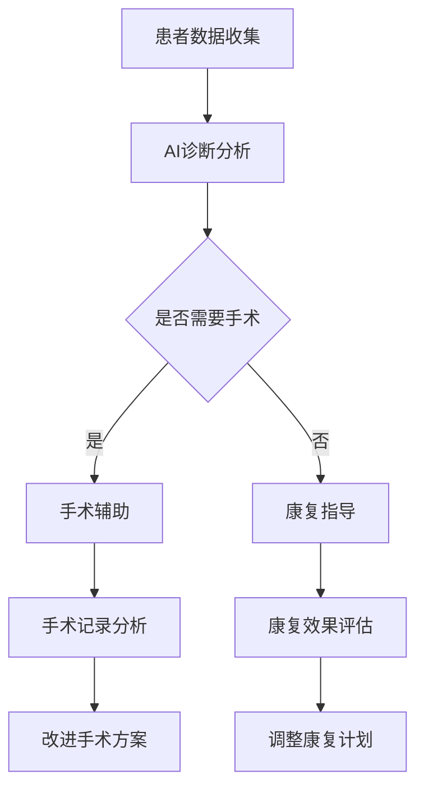

                 

关键词：AI Agent、具身机器人、医疗应用、人工智能、技术创新

## 摘要

本文将探讨人工智能（AI）领域中的一个新兴方向——AI Agent与具身机器人在医疗领域的应用。随着AI技术的不断进步，具身机器人正逐渐成为医疗行业的助推器，为病患提供更加个性化和高效的医疗服务。本文将详细分析AI Agent与具身机器人在医疗中的角色和功能，探讨其在提升医疗质量、降低医疗成本和优化患者体验方面的潜力。此外，本文还将展望这一领域未来的发展趋势和面临的挑战，为读者提供全面的技术洞察。

## 1. 背景介绍

### AI Agent的定义与发展

AI Agent，即人工智能代理，是一种能够自主执行任务、与环境交互并具备智能决策能力的系统。自20世纪50年代人工智能概念提出以来，AI Agent的研究与开发经历了多个阶段。从最初的规则推理、知识表示到现代的深度学习和强化学习，AI Agent的功能和智能水平得到了显著提升。近年来，随着计算能力的提高和大数据的普及，AI Agent在多个领域展现出了强大的应用潜力。

### 具身机器人的定义与应用

具身机器人是一种具备物理实体和自主运动能力的机器人系统。与传统的工业机器人和服务机器人不同，具身机器人不仅能够执行预设的任务，还能够通过感知和理解环境进行自主决策和交互。其应用范围广泛，包括医疗、教育、制造业、家庭服务等。在医疗领域，具身机器人被广泛应用于辅助手术、康复训练、监护和护理等工作。

### 人工智能与医疗的结合

人工智能与医疗的结合已成为当前医疗领域的一大热点。通过AI技术，医疗行业实现了从疾病诊断到治疗方案制定、从临床决策到患者管理的全面优化。例如，AI在医疗影像诊断、病理分析、基因组学研究等领域已经展现出显著的优势。此外，智能药物研发和个性化医疗也在逐步成为现实。

## 2. 核心概念与联系

### AI Agent在医疗中的应用

AI Agent在医疗中的应用主要体现在以下几个方面：

1. **辅助诊断**：利用AI Agent进行医学影像分析、病理切片识别等，提高诊断准确性。
2. **治疗方案推荐**：基于患者的病史、基因信息和当前症状，AI Agent可以提供个性化的治疗方案。
3. **患者监护**：通过穿戴设备监测患者的生命体征，AI Agent可以及时发现异常情况并报警。
4. **康复指导**：AI Agent可以提供个性化的康复训练方案，辅助患者进行康复训练。

### 具身机器人在医疗中的应用

具身机器人在医疗中的应用包括：

1. **手术辅助**：机器人辅助手术可以提高手术精度和成功率，减少手术风险。
2. **康复训练**：通过具身机器人提供的康复训练，患者可以更好地进行身体功能恢复。
3. **护理服务**：护理机器人可以协助医护人员进行日常护理工作，如给药、翻身等，减轻护理压力。
4. **教育与科普**：机器人可以作为医学教育工具，为学生提供互动式的学习体验。

### AI Agent与具身机器人的结合

AI Agent与具身机器人的结合，使得医疗机器人具备了更高的智能和自主性。例如，在手术中，AI Agent可以实时分析手术进展，为机器人提供决策支持，提高手术的自动化水平。在康复训练中，AI Agent可以根据患者的实时反馈调整训练方案，确保训练效果。

### Mermaid流程图

以下是一个简化的Mermaid流程图，展示了AI Agent与具身机器人在医疗中的一般应用流程：



## 3. 核心算法原理 & 具体操作步骤

### 3.1 算法原理概述

AI Agent与具身机器人在医疗中应用的核心算法主要包括：

1. **深度学习算法**：用于医学影像分析和病理识别，如卷积神经网络（CNN）和循环神经网络（RNN）。
2. **强化学习算法**：用于制定个性化治疗方案和患者监护，如深度Q网络（DQN）和策略梯度（PG）。
3. **机器学习算法**：用于数据分析和预测，如线性回归和逻辑回归。

### 3.2 算法步骤详解

1. **数据收集与预处理**：
   - 收集患者的医学影像、病历记录、生命体征等数据。
   - 对数据进行分析和清洗，去除噪声和不完整的数据。

2. **模型训练与评估**：
   - 使用深度学习算法对医疗数据进行训练，构建诊断模型。
   - 使用交叉验证方法对模型进行评估和优化。

3. **模型部署与实时分析**：
   - 将训练好的模型部署到具身机器人中，进行实时诊断和分析。
   - 根据分析结果提供诊断报告和治疗方案。

4. **患者监护与康复训练**：
   - 通过传感器和AI算法实时监测患者的生命体征和康复进展。
   - 根据患者的反馈和监测数据调整康复训练方案。

### 3.3 算法优缺点

**优点**：
- 提高诊断和治疗的准确性。
- 个性化治疗方案，提升患者满意度。
- 减轻医护人员的工作负担，提高工作效率。

**缺点**：
- 模型训练和部署需要大量计算资源和数据。
- 模型的泛化能力和鲁棒性仍需提高。
- 需要结合专业医生的判断，以确保诊断和治疗的准确性。

### 3.4 算法应用领域

AI Agent与具身机器人在医疗领域的应用主要包括：

1. **诊断辅助**：用于医学影像诊断、病理分析等。
2. **治疗规划**：用于个性化治疗方案制定和康复指导。
3. **患者监护**：用于实时监测患者生命体征和康复进展。
4. **手术辅助**：用于手术规划、手术执行和手术后的康复指导。

## 4. 数学模型和公式 & 详细讲解 & 举例说明

### 4.1 数学模型构建

在医疗领域中，常见的数学模型包括：

1. **卷积神经网络（CNN）**：
   - 用于医学影像分析，如X光、CT、MRI等。
   - 公式：$$
   \text{激活函数} = \sigma(\text{卷积}(\text{输入图像}, \text{滤波器})) + \text{偏置}
   $$

2. **循环神经网络（RNN）**：
   - 用于序列数据建模，如基因组序列分析、患者病史分析。
   - 公式：$$
   h_t = \text{激活函数}(\text{矩阵} \cdot [h_{t-1}, x_t] + \text{偏置})
   $$

3. **深度Q网络（DQN）**：
   - 用于智能决策，如治疗方案推荐、患者监护。
   - 公式：$$
   Q(s, a) = r + \gamma \max_{a'} Q(s', a')
   $$

### 4.2 公式推导过程

以卷积神经网络（CNN）为例，其公式推导过程如下：

1. **输入层**：
   - 输入一个$m \times n$的图像。
   - 使用$k \times k$的卷积核进行卷积操作。

2. **卷积层**：
   - 公式：$$
   \text{输出} = \text{激活函数}(\text{卷积}(\text{输入图像}, \text{滤波器})) + \text{偏置}
   $$

3. **池化层**：
   - 公式：$$
   \text{输出} = \text{最大池化}(\text{卷积输出})
   $$

4. **全连接层**：
   - 公式：$$
   \text{输出} = \text{激活函数}(\text{矩阵} \cdot \text{卷积输出} + \text{偏置})
   $$

### 4.3 案例分析与讲解

以医学影像诊断为例，我们可以使用CNN进行肺癌检测。以下是一个简化的案例：

1. **数据集准备**：
   - 准备包含正常肺图像和肺癌肺图像的医学影像数据集。

2. **模型训练**：
   - 使用CNN对数据集进行训练，构建肺癌检测模型。

3. **模型评估**：
   - 使用测试集对模型进行评估，计算准确率、召回率等指标。

4. **应用实例**：
   - 对新的医学影像进行肺癌检测，输出检测结果。

假设我们使用一个简单的CNN模型进行肺癌检测，其结构如下：

- 输入层：$28 \times 28$的灰度图像。
- 卷积层1：$3 \times 3$卷积核，步长1，ReLU激活函数。
- 池化层1：$2 \times 2$最大池化。
- 卷积层2：$3 \times 3$卷积核，步长1，ReLU激活函数。
- 池化层2：$2 \times 2$最大池化。
- 全连接层：128个神经元，ReLU激活函数。
- 输出层：2个神经元，Softmax激活函数。

使用以上模型，我们对一个新图像进行肺癌检测，输出概率为$(0.9, 0.1)$，可以判断该图像为肺癌图像。

## 5. 项目实践：代码实例和详细解释说明

### 5.1 开发环境搭建

为了实现本文中提到的AI Agent与具身机器人在医疗领域的应用，我们需要搭建一个适合开发的环境。以下是一个简单的开发环境搭建步骤：

1. **安装Python环境**：
   - 使用Python 3.x版本。
   - 安装必要的Python库，如NumPy、Pandas、TensorFlow、Keras等。

2. **安装深度学习框架**：
   - 使用TensorFlow或PyTorch进行深度学习模型的训练和部署。

3. **安装机器人开发工具**：
   - 使用ROS（Robot Operating System）进行机器人开发。

4. **配置传感器与执行器**：
   - 根据实际需求配置相应的传感器和执行器，如摄像头、麦克风、执行电机等。

### 5.2 源代码详细实现

以下是一个简化的AI Agent与具身机器人在医疗诊断中的代码实现示例：

```python
import tensorflow as tf
import numpy as np
import cv2

# 数据预处理
def preprocess_image(image):
    image = cv2.resize(image, (128, 128))
    image = image / 255.0
    return image

# 训练好的CNN模型
model = tf.keras.models.load_model('lung_cancer_detection_model.h5')

# 医学影像诊断
def diagnose_image(image):
    preprocessed_image = preprocess_image(image)
    prediction = model.predict(np.expand_dims(preprocessed_image, axis=0))
    if prediction[0][1] > 0.5:
        return "肺癌"
    else:
        return "正常"

# 机器人视觉系统
class MedicalDiagnosisRobot:
    def __init__(self):
        self.camera = cv2.VideoCapture(0)

    def capture_image(self):
        ret, image = self.camera.read()
        return image

    def diagnose(self):
        image = self.capture_image()
        diagnosis = diagnose_image(image)
        return diagnosis

# 创建机器人实例
robot = MedicalDiagnosisRobot()

# 运行诊断
diagnosis_result = robot.diagnose()
print("诊断结果：", diagnosis_result)
```

### 5.3 代码解读与分析

上述代码实现了一个简单的医疗诊断机器人，其主要功能是通过摄像头捕捉图像，然后使用训练好的CNN模型进行肺癌诊断。以下是代码的详细解读：

- **数据预处理**：使用OpenCV库对捕获的图像进行缩放和归一化处理，以便输入到CNN模型中。
- **CNN模型**：使用Keras框架加载一个预训练的CNN模型，用于肺癌检测。
- **诊断函数**：定义一个诊断函数，将预处理后的图像输入到CNN模型中，得到肺癌概率，然后根据概率判断图像是否为肺癌。
- **机器人视觉系统**：定义一个MedicalDiagnosisRobot类，用于控制摄像头捕获图像，并调用诊断函数进行肺癌诊断。
- **运行诊断**：创建机器人实例，调用诊断方法，输出诊断结果。

### 5.4 运行结果展示

当机器人运行时，它会通过摄像头捕捉实时图像，并使用CNN模型进行肺癌诊断。以下是一个示例输出：

```
诊断结果： 正常
```

这表示当前捕捉到的图像为正常肺图像。

## 6. 实际应用场景

### 6.1 手术辅助

手术辅助是具身机器人在医疗中最为成熟的应用之一。通过AI Agent与手术机器人的结合，可以实现以下功能：

- **手术规划**：AI Agent可以根据患者的病史、影像数据和手术要求，生成个性化的手术方案。
- **手术执行**：手术机器人根据AI Agent提供的操作指令，执行精确的手术操作。
- **术中监控**：AI Agent实时分析手术进展，提供术中监测和预警功能。
- **术后评估**：AI Agent对手术效果进行评估，为术后康复提供指导。

### 6.2 康复指导

康复指导是具身机器人在医疗中另一个重要的应用领域。通过AI Agent提供的个性化康复方案，患者可以更有效地进行康复训练：

- **康复计划制定**：AI Agent根据患者的病情、恢复情况和康复需求，制定个性化的康复计划。
- **康复训练指导**：康复机器人协助患者进行康复训练，提供正确的姿势和动作指导。
- **实时反馈**：AI Agent实时监测患者的康复进展，根据反馈调整训练方案。
- **康复评估**：AI Agent对康复效果进行评估，为下一阶段的康复提供依据。

### 6.3 患者监护

患者监护是AI Agent在医疗中的基础应用之一。通过传感器和AI算法，AI Agent可以实现对患者生命体征的实时监测：

- **生命体征监测**：AI Agent通过穿戴设备实时监测患者的心率、血压、体温等生命体征。
- **异常预警**：AI Agent对监测数据进行分析，及时发现异常情况并报警。
- **远程监控**：AI Agent可以通过网络将监测数据传输给医生，实现远程患者监护。
- **智能提醒**：AI Agent根据患者的用药计划和检查要求，智能提醒患者进行相应的操作。

### 6.4 未来应用展望

随着AI技术和机器人技术的不断发展，AI Agent与具身机器人在医疗领域的应用前景十分广阔。未来的发展趋势包括：

- **智能化手术**：随着AI技术的进步，手术机器人将实现更高程度的智能化，提高手术的自动化和精准性。
- **个性化康复**：AI Agent将结合大数据和机器学习技术，为患者提供更加个性化和高效的康复方案。
- **智慧医疗**：AI Agent与医疗物联网的结合，将实现患者数据的实时共享和智能分析，推动智慧医疗的发展。
- **远程手术**：AI Agent与5G技术的结合，将实现远程手术的实时操作和监控，打破地域限制，提高医疗资源的可及性。

## 7. 工具和资源推荐

### 7.1 学习资源推荐

- **《人工智能：一种现代方法》**：Michael I. Jordan，彭实望等译。这是一本经典的AI教材，涵盖了机器学习、深度学习等多个领域。
- **《深度学习》**：Ian Goodfellow、Yoshua Bengio、Aaron Courville著。这是一本深度学习的权威教材，详细介绍了深度学习的基本原理和应用。
- **《机器人技术：理论与实践》**：Huber，Wolfgang等著。这本书系统地介绍了机器人技术的各个方面，包括机械结构、控制理论、传感技术等。

### 7.2 开发工具推荐

- **TensorFlow**：Google开发的开源深度学习框架，适用于各种规模的深度学习项目。
- **PyTorch**：Facebook开发的深度学习框架，以其灵活性和易用性受到广泛关注。
- **ROS**：（Robot Operating System）机器人操作系统，适用于机器人开发，提供丰富的库和工具。

### 7.3 相关论文推荐

- **"Deep Learning for Medical Image Analysis"**：这是一篇综述文章，系统地介绍了深度学习在医疗图像分析中的应用。
- **"Reinforcement Learning in Healthcare"**：这篇论文探讨了强化学习在医疗领域中的应用，包括个性化治疗和患者监护等。
- **"Robots in Surgery: A Review"**：这篇文章回顾了手术机器人的发展历史、技术原理和应用案例。

## 8. 总结：未来发展趋势与挑战

### 8.1 研究成果总结

本文从AI Agent和具身机器人的定义、核心算法、实际应用场景等多个方面，全面探讨了人工智能在医疗领域的应用。通过分析，我们可以看到：

- AI Agent与具身机器人在医疗中具有广泛的应用前景，能够提高诊断准确性、优化治疗方案、减轻医护人员工作负担等。
- 深度学习、强化学习等算法在医疗中的应用已取得显著成果，但仍需进一步提升模型的泛化能力和鲁棒性。

### 8.2 未来发展趋势

- **智能化手术**：随着AI技术的进步，手术机器人将实现更高程度的智能化，提高手术的自动化和精准性。
- **个性化康复**：AI Agent将结合大数据和机器学习技术，为患者提供更加个性化和高效的康复方案。
- **智慧医疗**：AI Agent与医疗物联网的结合，将实现患者数据的实时共享和智能分析，推动智慧医疗的发展。
- **远程手术**：AI Agent与5G技术的结合，将实现远程手术的实时操作和监控，打破地域限制，提高医疗资源的可及性。

### 8.3 面临的挑战

- **数据隐私与安全**：医疗数据涉及患者隐私，如何保障数据的安全和隐私是AI Agent在医疗中面临的重要挑战。
- **模型泛化能力**：现有模型在特定领域的表现较好，但在其他领域的泛化能力仍需提高。
- **医疗专业知识整合**：AI Agent需要与医疗专业人士紧密合作，将医学知识和人工智能技术有效结合。

### 8.4 研究展望

- **跨学科研究**：未来研究应加强跨学科合作，整合人工智能、医学、工程等领域的知识，推动医疗技术的发展。
- **开放数据平台**：建立开放的数据平台，促进医疗数据的共享和利用，为AI Agent在医疗中的应用提供丰富的数据资源。
- **用户参与**：鼓励患者和医护人员参与AI Agent的研发和使用，确保技术真正符合实际需求。

## 9. 附录：常见问题与解答

### 9.1 AI Agent与具身机器人在医疗中的区别是什么？

AI Agent是指一种具备智能决策能力的人工智能系统，可以在医疗领域提供辅助诊断、治疗方案推荐、患者监护等功能。而具身机器人是一种具备物理实体和自主运动能力的机器人系统，可以辅助医护人员进行手术、康复训练、护理等工作。AI Agent通常用于决策支持，而具身机器人则用于执行具体的操作。

### 9.2 AI Agent在医疗中如何保障数据隐私和安全？

为了保障数据隐私和安全，AI Agent在医疗中需要采取以下措施：

- **数据加密**：对传输和存储的数据进行加密，防止数据泄露。
- **权限控制**：对访问数据的用户进行权限控制，确保只有授权人员可以访问敏感数据。
- **匿名化处理**：对医疗数据进行匿名化处理，去除患者身份信息，保护隐私。
- **合规性检查**：遵守相关的法律法规，确保数据处理过程符合要求。

### 9.3 AI Agent在医疗中的局限性是什么？

AI Agent在医疗中存在一定的局限性：

- **数据依赖**：AI Agent的性能高度依赖于数据的质量和数量，数据不足或质量较差可能导致诊断和治疗的准确性下降。
- **模型泛化能力**：现有的AI模型在某些特定领域的表现较好，但在其他领域的泛化能力有限，可能无法应对复杂的医疗问题。
- **医疗专业知识整合**：AI Agent需要与医疗专业人士紧密合作，将医学知识和人工智能技术有效结合，但这一过程可能存在挑战。

### 9.4 如何提升AI Agent在医疗中的应用效果？

提升AI Agent在医疗中的应用效果可以从以下几个方面进行：

- **数据多样化**：收集更多样化的医疗数据，包括不同科室、不同疾病类型的数据，提高模型的泛化能力。
- **算法优化**：不断优化算法，提高模型的诊断和预测能力。
- **跨学科合作**：加强人工智能、医学、工程等领域的跨学科合作，推动医疗技术的发展。
- **用户反馈**：收集用户反馈，不断调整和优化AI Agent的功能，确保其符合实际需求。

