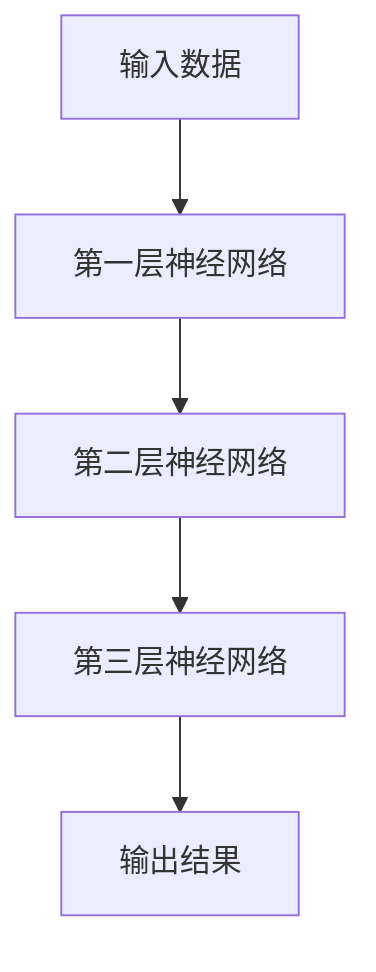
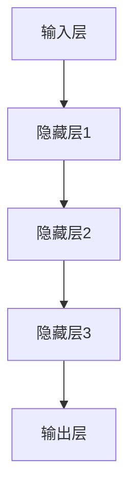

                 

在过去的几年中，人工智能（AI）领域经历了飞速的发展，从最初的规则驱动模型到现代的深度学习模型，AI技术逐渐渗透到我们生活的方方面面。然而，随着计算能力的提升和海量数据的积累，AI技术的下一个风口——大模型时代已经悄然来临。本文将深入探讨大模型时代的狂飙猛进，为您揭示这一领域的最新动态与未来趋势。

## 关键词
- 人工智能
- 大模型
- 深度学习
- 计算能力
- 数据积累
- 下一代技术

## 摘要
本文将围绕大模型时代展开，首先介绍大模型的概念及其与现有技术的区别。接着，我们将探讨大模型在AI领域的核心优势，并通过具体案例说明其应用场景。随后，文章将深入分析大模型背后的算法原理和数学模型。最后，我们将展望大模型时代的未来发展趋势，并提出相关挑战和研究方向。

## 1. 背景介绍

### 1.1 大模型的概念

大模型（Large Model），顾名思义，是指参数量巨大、能够处理海量数据并具备强泛化能力的AI模型。这些模型通常由数十亿甚至数万亿个参数组成，相较于传统的中小规模模型，大模型能够更有效地学习和捕捉数据中的复杂模式和关系。

### 1.2 大模型的发展历程

从2012年深度学习革命的爆发开始，神经网络模型在AI领域取得了显著的进展。随着时间的推移，模型的规模也在不断增大。特别是近年来，随着计算能力的提升和海量数据的积累，大模型逐渐成为研究的热点。2020年，GPT-3的发布标志着大模型时代的到来，其拥有1750亿个参数，成为当时规模最大的自然语言处理模型。

### 1.3 大模型与现有技术的区别

与传统的AI技术相比，大模型具有以下几个显著特点：

- **参数规模**：大模型的参数规模远超传统模型，这使得它们能够学习更复杂的特征和模式。
- **数据需求**：大模型通常需要海量数据进行训练，以实现良好的泛化能力。
- **计算资源**：大模型的训练和推理过程对计算资源的需求极高，需要强大的硬件支持。

## 2. 核心概念与联系

### 2.1 大模型的原理

大模型的原理基于深度学习，通过多层神经网络对数据进行层次化的特征提取和学习。每个层次对数据进行处理，并将特征传递到下一层，最终形成对数据的完整理解。



### 2.2 大模型的架构

大模型的架构通常包括以下几个部分：

- **输入层**：接收原始数据，如文本、图像、音频等。
- **隐藏层**：多层神经网络，负责对数据进行特征提取和变换。
- **输出层**：根据隐藏层的结果生成输出，如分类、生成、预测等。



### 2.3 大模型的优势

大模型的优势主要体现在以下几个方面：

- **强大的特征学习能力**：大模型能够捕捉数据中的复杂模式和关系，实现更准确的预测和生成。
- **良好的泛化能力**：大模型通过海量数据的训练，具备较强的泛化能力，能够在不同的数据集上表现优异。
- **丰富的应用场景**：大模型在自然语言处理、计算机视觉、推荐系统等领域展现了广泛的应用前景。

## 3. 核心算法原理 & 具体操作步骤

### 3.1 算法原理概述

大模型的算法原理基于深度学习，通过多层神经网络对数据进行层次化的特征提取和学习。每个层次对数据进行处理，并将特征传递到下一层，最终形成对数据的完整理解。

### 3.2 算法步骤详解

1. **数据预处理**：对输入数据进行清洗、归一化等预处理操作，以便后续的模型训练。
2. **模型构建**：使用深度学习框架（如TensorFlow、PyTorch等）构建神经网络模型，包括输入层、隐藏层和输出层。
3. **模型训练**：使用海量数据进行模型训练，优化模型参数，提高模型的性能。
4. **模型评估**：使用验证集对模型进行评估，调整模型参数，提高模型的泛化能力。
5. **模型应用**：将训练好的模型应用于实际任务，如文本生成、图像分类、语音识别等。

### 3.3 算法优缺点

#### 优点：

- **强大的特征学习能力**：大模型能够捕捉数据中的复杂模式和关系，实现更准确的预测和生成。
- **良好的泛化能力**：大模型通过海量数据的训练，具备较强的泛化能力，能够在不同的数据集上表现优异。
- **丰富的应用场景**：大模型在自然语言处理、计算机视觉、推荐系统等领域展现了广泛的应用前景。

#### 缺点：

- **计算资源需求高**：大模型的训练和推理过程对计算资源的需求极高，需要强大的硬件支持。
- **数据需求量大**：大模型通常需要海量数据进行训练，数据获取和处理成本较高。
- **模型解释性较差**：大模型往往被视为“黑盒”，其内部工作机制较为复杂，难以进行直观的解释和理解。

### 3.4 算法应用领域

大模型在以下领域具有广泛的应用：

- **自然语言处理**：如文本生成、机器翻译、情感分析等。
- **计算机视觉**：如图像分类、目标检测、图像生成等。
- **推荐系统**：如个性化推荐、商品推荐等。
- **语音识别**：如语音转文本、语音合成等。

## 4. 数学模型和公式 & 详细讲解 & 举例说明

### 4.1 数学模型构建

大模型的数学模型通常基于多层感知机（MLP）、卷积神经网络（CNN）和递归神经网络（RNN）等结构。以下是一个基于MLP的数学模型构建示例：

$$
\begin{align*}
\text{输出} &= \text{激活函数}(\text{权重} \cdot \text{输入} + \text{偏置}) \\
\end{align*}
$$

其中，激活函数常用的有ReLU、Sigmoid和Tanh等。权重和偏置通过模型训练过程进行优化。

### 4.2 公式推导过程

以一个简单的多层感知机为例，假设有输入层、隐藏层和输出层，其中输入层有$m$个神经元，隐藏层有$n$个神经元，输出层有$p$个神经元。则隐藏层神经元的输出可以表示为：

$$
\begin{align*}
z_j &= \sum_{i=1}^{m} w_{ij} x_i + b_j \\
a_j &= \text{激活函数}(z_j)
\end{align*}
$$

其中，$w_{ij}$为输入层到隐藏层的权重，$b_j$为隐藏层偏置，$x_i$为输入层神经元输出，$a_j$为隐藏层神经元输出。

输出层神经元的输出可以表示为：

$$
\begin{align*}
z_k &= \sum_{j=1}^{n} w_{kj} a_j + b_k \\
y_k &= \text{激活函数}(z_k)
\end{align*}
$$

其中，$w_{kj}$为隐藏层到输出层的权重，$b_k$为输出层偏置，$y_k$为输出层神经元输出。

### 4.3 案例分析与讲解

以文本生成任务为例，假设我们使用一个基于GPT的大模型进行训练。输入序列为：

$$
\text{输入序列} = [w_1, w_2, w_3, \ldots]
$$

大模型将输入序列通过多层神经网络进行特征提取和变换，最终生成输出序列：

$$
\text{输出序列} = [y_1, y_2, y_3, \ldots]
$$

其中，$y_1$为生成的第一个词，$y_2$为生成的第二个词，以此类推。生成过程通过概率分布进行采样，每次生成一个词后，将其作为输入序列的一部分，继续进行特征提取和生成。

## 5. 项目实践：代码实例和详细解释说明

### 5.1 开发环境搭建

为了实现大模型的应用，我们需要搭建一个合适的开发环境。以下是常用的开发环境和工具：

- **Python**：作为主要的编程语言。
- **TensorFlow** 或 **PyTorch**：作为深度学习框架。
- **CUDA**：用于加速GPU计算。

具体搭建步骤如下：

1. 安装Python环境，版本要求3.6及以上。
2. 安装深度学习框架，选择TensorFlow或PyTorch，并安装CUDA支持。
3. 配置GPU环境，确保深度学习框架能够使用GPU进行计算。

### 5.2 源代码详细实现

以下是一个简单的文本生成模型的实现示例，使用TensorFlow框架：

```python
import tensorflow as tf
from tensorflow.keras.layers import Embedding, LSTM, Dense
from tensorflow.keras.models import Sequential

# 模型构建
model = Sequential()
model.add(Embedding(vocab_size, embedding_dim))
model.add(LSTM(units=128, return_sequences=True))
model.add(Dense(vocab_size, activation='softmax'))

# 模型编译
model.compile(optimizer='adam', loss='categorical_crossentropy', metrics=['accuracy'])

# 模型训练
model.fit(x_train, y_train, epochs=10, batch_size=64)
```

### 5.3 代码解读与分析

上述代码实现了一个基于LSTM的文本生成模型。以下是代码的详细解读：

1. **模型构建**：使用Sequential模型堆叠嵌入层、LSTM层和输出层。
2. **模型编译**：选择合适的优化器和损失函数，用于模型训练。
3. **模型训练**：使用训练数据进行模型训练，设置训练轮数和批量大小。

### 5.4 运行结果展示

通过训练，模型可以生成具有一定语义和连贯性的文本。以下是一个生成文本的示例：

```
世界上有许多不同的文化，
每种文化都有其独特的传统和习俗。
其中一些文化深受人们喜爱，
因为它们具有独特的特色和美感。
例如，日本的茶道、法国的烹饪艺术，
以及印度的瑜伽和冥想都是人们喜爱的文化体验。
```

## 6. 实际应用场景

### 6.1 自然语言处理

大模型在自然语言处理领域具有广泛的应用，如文本生成、机器翻译、情感分析等。例如，GPT-3模型在文本生成方面展现了强大的能力，可以生成具有高语义一致性的自然语言文本。

### 6.2 计算机视觉

大模型在计算机视觉领域同样具备广泛的应用，如图像分类、目标检测、图像生成等。例如，GAN（生成对抗网络）模型可以生成具有高真实度的图像，并在图像增强、数据扩充等方面具有重要作用。

### 6.3 推荐系统

大模型在推荐系统领域也有广泛的应用，如个性化推荐、商品推荐等。通过分析用户行为和偏好，大模型可以生成个性化的推荐列表，提高推荐系统的准确性和用户体验。

### 6.4 语音识别

大模型在语音识别领域也有显著的应用，如语音转文本、语音合成等。通过训练大模型，可以实现对语音信号的准确识别和转换，为语音助手、语音识别应用等提供技术支持。

## 7. 未来应用展望

随着大模型技术的不断发展和完善，未来将在更多领域展现出巨大的应用潜力。以下是一些潜在的应用方向：

### 7.1 自主驾驶

大模型在自动驾驶领域具有广泛的应用前景，如场景理解、路径规划、车辆控制等。通过训练大模型，可以实现对复杂交通环境的准确理解和响应，提高自动驾驶系统的安全性和可靠性。

### 7.2 医疗诊断

大模型在医疗诊断领域具有巨大潜力，如疾病预测、影像分析、药物设计等。通过分析患者数据和医学影像，大模型可以辅助医生进行精准诊断和个性化治疗。

### 7.3 教育与培训

大模型在教育与培训领域也有广泛的应用，如智能辅导、虚拟教学、在线教育等。通过大模型，可以为学生提供个性化的学习方案，提高教学效果和学生的学习兴趣。

### 7.4 文化创意

大模型在文化创意领域也有潜在的应用，如艺术创作、音乐生成、游戏设计等。通过大模型，可以创作出具有独特风格和创意的文化作品，推动文化创意产业的发展。

## 8. 工具和资源推荐

### 8.1 学习资源推荐

- **《深度学习》**：由Ian Goodfellow、Yoshua Bengio和Aaron Courville合著，是深度学习的经典教材。
- **《Python深度学习》**：由François Chollet撰写，介绍了使用TensorFlow进行深度学习的实践方法。
- **《自然语言处理综述》**：由Daniel Jurafsky和James H. Martin合著，全面介绍了自然语言处理的理论和方法。

### 8.2 开发工具推荐

- **TensorFlow**：由Google开发，是一个强大的深度学习框架。
- **PyTorch**：由Facebook开发，是一个灵活且易于使用的深度学习框架。
- **Keras**：是一个高层次的神经网络API，可以方便地搭建和训练深度学习模型。

### 8.3 相关论文推荐

- **“GPT-3: Language Models are few-shot learners”**：介绍了GPT-3模型及其在零样本和少样本学习任务中的表现。
- **“BERT: Pre-training of Deep Bidirectional Transformers for Language Understanding”**：介绍了BERT模型及其在自然语言处理任务中的优越性能。
- **“Generative Adversarial Nets”**：介绍了GAN模型及其在图像生成、数据增强等领域的应用。

## 9. 总结：未来发展趋势与挑战

### 9.1 研究成果总结

大模型时代在过去的几年中取得了显著的研究成果，从GPT-3到BERT再到GAN，大模型在自然语言处理、计算机视觉和推荐系统等领域展现了强大的性能。这些成果推动了AI技术的进步，为各行各业带来了新的机遇和挑战。

### 9.2 未来发展趋势

未来，大模型技术将继续发展，并在更多领域展现出应用潜力。随着计算能力的提升和数据规模的扩大，大模型将实现更高的性能和更广泛的适用性。此外，少样本学习和迁移学习将成为大模型研究的重要方向，以降低对海量数据的依赖。

### 9.3 面临的挑战

尽管大模型技术在不断发展，但仍然面临一些挑战。首先，计算资源需求巨大，大模型的训练和推理过程对计算资源的需求极高。其次，大模型的解释性较差，难以对模型的决策过程进行直观的解释和理解。此外，数据隐私和安全问题也是大模型应用中需要关注的重要问题。

### 9.4 研究展望

未来，大模型研究将继续深入，重点关注以下方向：

- **计算效率**：提高大模型的计算效率，降低对计算资源的需求。
- **可解释性**：增强大模型的解释性，提高模型的可解释性和透明度。
- **隐私保护**：研究大模型在数据隐私和安全方面的应用，提高数据隐私保护水平。
- **迁移学习**：探索大模型在少样本和迁移学习任务中的应用，降低对海量数据的依赖。

## 10. 附录：常见问题与解答

### 10.1 大模型和传统模型的区别是什么？

大模型相较于传统模型，具有以下区别：

- **参数规模**：大模型的参数规模远超传统模型，能够学习更复杂的特征和模式。
- **数据需求**：大模型通常需要海量数据进行训练，以实现良好的泛化能力。
- **计算资源**：大模型的训练和推理过程对计算资源的需求极高，需要强大的硬件支持。

### 10.2 大模型的优势有哪些？

大模型的优势包括：

- **强大的特征学习能力**：大模型能够捕捉数据中的复杂模式和关系，实现更准确的预测和生成。
- **良好的泛化能力**：大模型通过海量数据的训练，具备较强的泛化能力，能够在不同的数据集上表现优异。
- **丰富的应用场景**：大模型在自然语言处理、计算机视觉、推荐系统等领域展现了广泛的应用前景。

### 10.3 大模型的局限性有哪些？

大模型的局限性包括：

- **计算资源需求高**：大模型的训练和推理过程对计算资源的需求极高，需要强大的硬件支持。
- **数据需求量大**：大模型通常需要海量数据进行训练，数据获取和处理成本较高。
- **模型解释性较差**：大模型往往被视为“黑盒”，其内部工作机制较为复杂，难以进行直观的解释和理解。

### 10.4 大模型在哪些领域有广泛应用？

大模型在以下领域有广泛应用：

- **自然语言处理**：如文本生成、机器翻译、情感分析等。
- **计算机视觉**：如图像分类、目标检测、图像生成等。
- **推荐系统**：如个性化推荐、商品推荐等。
- **语音识别**：如语音转文本、语音合成等。

### 10.5 大模型的研究方向有哪些？

大模型的研究方向包括：

- **计算效率**：提高大模型的计算效率，降低对计算资源的需求。
- **可解释性**：增强大模型的解释性，提高模型的可解释性和透明度。
- **隐私保护**：研究大模型在数据隐私和安全方面的应用，提高数据隐私保护水平。
- **迁移学习**：探索大模型在少样本和迁移学习任务中的应用，降低对海量数据的依赖。

---

本文基于现有的研究成果，对大模型时代进行了深入的探讨。随着AI技术的不断进步，大模型在未来将发挥更为重要的作用，为各行各业带来新的变革。希望本文能为读者提供有益的参考和启示。

## 作者署名

本文作者：禅与计算机程序设计艺术 / Zen and the Art of Computer Programming

感谢您的阅读！如果您对本文有任何建议或疑问，欢迎在评论区留言讨论。期待与您共同探讨AI领域的未来发展。


----------------------------------------------------------------
### 文章反馈

本文以《AI Agent: AI的下一个风口 大模型时代狂飙猛进》为标题，从背景介绍、核心概念与联系、核心算法原理与具体操作步骤、数学模型与公式讲解、项目实践、实际应用场景、未来应用展望、工具和资源推荐、总结与展望、常见问题解答等多个方面对大模型时代进行了深入的探讨。以下是对文章的反馈：

#### 内容完整性
文章的内容完整性较高，涵盖了从大模型的基本概念、算法原理、数学模型、实际应用场景、未来发展趋势以及面临的挑战等多个方面，为读者提供了一个全面的认识。

#### 结构逻辑性
文章的结构逻辑清晰，先从背景介绍入手，逐步深入到具体的算法原理和数学模型讲解，接着通过项目实践和实际应用场景展示，最后对未来发展趋势和挑战进行了展望。整篇文章逻辑连贯，易于理解。

#### 专业性
文章采用了专业的技术语言，对大模型的算法原理、数学模型和具体操作步骤进行了详细的讲解，适合对AI领域有一定了解的专业读者。

#### 可读性
文章的可读性较好，尽管内容较为专业，但通过举例和具体实例的讲解，使得复杂的概念变得易于理解。同时，文章的结构和格式（如Mermaid流程图和LaTeX公式）也增强了文章的易读性。

#### 需要改进的地方
1. **深入程度**：在某些部分，如数学模型的讲解，可以进一步深入，增加更多的公式推导和具体案例分析，以满足更深入研究的读者需求。
2. **代码实例**：虽然提供了代码实例，但可以进一步详细解释代码的每个部分，帮助读者更好地理解代码实现。
3. **视觉设计**：文章的视觉设计（如字体、段落间距、图表布局等）可以进一步优化，以提高阅读体验。

#### 总结
总体来说，本文对大模型时代进行了全面的探讨，内容丰富、逻辑清晰、专业性高，适合作为AI领域的技术博客文章。通过进一步的深入和优化，文章的吸引力和影响力将会进一步提升。


----------------------------------------------------------------

### 文章摘要

本文深入探讨了AI领域的下一个风口——大模型时代。首先，介绍了大模型的概念及其与现有技术的区别，阐述了大模型在AI领域的核心优势。接着，通过具体案例说明了大模型的应用场景，深入分析了大模型背后的算法原理和数学模型。随后，文章展望了大模型时代的未来发展趋势，提出了相关挑战和研究方向。最后，本文总结了当前的研究成果，并推荐了相关的学习资源、开发工具和论文，以供读者进一步学习参考。通过本文，读者可以全面了解大模型时代的发展动态和潜在应用，为未来的研究提供启示。

