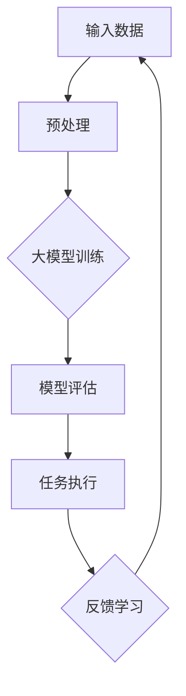

                 

关键词：人工智能、大模型、智能体、自动化、未来趋势

> 摘要：本文探讨了人工智能（AI）的下一个风口——大模型驱动的智能体。从背景介绍到核心概念，再到算法原理、数学模型、项目实践、应用场景、未来展望等多个方面，全面解析了智能体的技术框架、发展现状及其对AI领域和实际应用带来的深远影响。

## 1. 背景介绍

人工智能（AI）作为21世纪最具颠覆性的技术之一，正在快速改变我们的生活方式。随着计算能力的提升、海量数据的积累以及深度学习算法的突破，AI技术逐渐从理论研究走向实际应用。然而，传统的AI系统往往局限于特定任务，难以实现跨领域的通用智能。这引发了学术界和产业界的思考：如何打造一个能够自我学习、自主决策的智能体，实现真正意义上的智能自动化？

正是在这种背景下，大模型驱动的智能体成为了AI领域的下一个风口。大模型指的是具有数十亿至千亿参数的深度学习模型，这些模型通过大规模数据训练，能够捕捉复杂的数据模式和关系，从而实现高效的任务处理和决策。智能体则是具有自主意识和行动能力的实体，能够在复杂环境中进行自主学习和交互。

本文将从以下几方面对大模型驱动的智能体进行深入探讨：

- 核心概念与联系
- 核心算法原理与操作步骤
- 数学模型与公式推导
- 项目实践：代码实例与解读
- 实际应用场景
- 未来应用展望

## 2. 核心概念与联系

### 2.1 大模型

大模型是本文讨论的核心概念之一。与传统的小型模型相比，大模型具有以下特点：

- 参数规模巨大：大模型的参数数量通常在数十亿至千亿级别。
- 训练数据量庞大：大模型通常需要大量的训练数据来学习复杂的特征。
- 计算资源需求高：大模型训练和推理需要大量的计算资源和存储空间。

### 2.2 智能体

智能体是指具有自主意识和行动能力的实体，能够在复杂环境中进行自主学习和交互。智能体具有以下几个关键特征：

- 自主决策：智能体可以根据环境变化自主做出决策。
- 自我学习：智能体能够从数据中学习新的知识和技能。
- 交互能力：智能体能够与人类或其他智能体进行有效交互。

### 2.3 大模型驱动的智能体

大模型驱动的智能体是指利用大模型来实现智能体功能的一种架构。在这种架构中，大模型充当智能体的核心大脑，负责任务处理、决策制定和知识学习。大模型驱动的智能体具有以下几个优势：

- 高效处理能力：大模型具有强大的数据处理能力，能够快速完成复杂任务。
- 跨领域适用性：大模型能够跨领域学习，实现通用智能。
- 自适应能力：大模型能够根据环境变化进行自适应调整。

### 2.4 Mermaid 流程图

以下是智能体架构的Mermaid流程图：



在该流程图中，输入数据经过预处理后输入到大模型中，大模型通过训练学习数据中的特征和规律。模型评估阶段用于评估大模型的效果，任务执行阶段利用大模型进行任务处理，反馈学习阶段则根据任务执行结果对大模型进行调整。

## 3. 核心算法原理与操作步骤

### 3.1 算法原理概述

大模型驱动的智能体算法原理主要基于深度学习和强化学习。深度学习部分负责特征提取和任务处理，强化学习部分负责决策制定和反馈学习。

- **深度学习**：深度学习是一种基于多层神经网络的机器学习方法，通过多层次的非线性变换，从数据中提取特征表示。在大模型驱动的智能体中，深度学习用于处理输入数据，提取高层次的语义信息。
- **强化学习**：强化学习是一种通过与环境互动来学习策略的机器学习方法。在大模型驱动的智能体中，强化学习用于制定决策策略，使智能体能够在复杂环境中实现自主行动。

### 3.2 算法步骤详解

大模型驱动的智能体算法主要包括以下步骤：

1. **数据收集与预处理**：收集大量相关数据，并进行预处理，包括数据清洗、归一化、特征提取等。
2. **大模型训练**：使用深度学习算法对预处理后的数据进行训练，构建具有数十亿参数的大模型。训练过程包括前向传播、反向传播和参数更新。
3. **模型评估**：评估训练完成后的大模型在任务上的性能，包括准确率、召回率、F1值等指标。
4. **任务执行**：利用大模型进行任务处理，根据输入数据进行预测或决策。
5. **反馈学习**：根据任务执行结果，收集反馈信息，并利用强化学习算法对大模型进行调整和优化。

### 3.3 算法优缺点

**优点**：

- 高效处理能力：大模型具有强大的数据处理能力，能够快速完成复杂任务。
- 跨领域适用性：大模型能够跨领域学习，实现通用智能。
- 自适应能力：大模型能够根据环境变化进行自适应调整。

**缺点**：

- 计算资源需求高：大模型训练和推理需要大量的计算资源和存储空间。
- 数据依赖性强：大模型的性能依赖于训练数据的质量和数量。

### 3.4 算法应用领域

大模型驱动的智能体在多个领域具有广泛的应用前景，包括：

- 无人驾驶：利用大模型进行环境感知、路径规划和决策制定，实现自主驾驶。
- 自然语言处理：利用大模型进行文本生成、情感分析、机器翻译等任务。
- 机器人：利用大模型实现机器人的自主学习和自主行动，提高机器人智能水平。
- 金融风控：利用大模型进行风险预测、异常检测和信用评分。

## 4. 数学模型和公式 & 详细讲解 & 举例说明

### 4.1 数学模型构建

大模型驱动的智能体数学模型主要包括两部分：特征提取模型和决策模型。

**特征提取模型**：

特征提取模型用于从输入数据中提取高层次的语义信息。假设输入数据为 \( X \)，提取的特征为 \( X' \)，则特征提取模型可以表示为：

\[ X' = f(X) \]

其中， \( f \) 为特征提取函数。

**决策模型**：

决策模型用于根据输入数据提取的特征，进行任务决策。假设输入特征为 \( X' \)，输出决策为 \( Y \)，则决策模型可以表示为：

\[ Y = g(X') \]

其中， \( g \) 为决策函数。

### 4.2 公式推导过程

**特征提取模型**：

假设输入数据为 \( X \)，包含 \( n \) 个特征。首先对输入数据进行预处理，包括数据归一化和特征提取。然后，使用多层感知机（MLP）进行特征提取，每一层感知机的输出为：

\[ z_i^{(l)} = \sum_{j=1}^{n} w_{ij}^{(l)} x_j + b_i^{(l)} \]

其中， \( z_i^{(l)} \) 为第 \( l \) 层第 \( i \) 个节点的输出，\( w_{ij}^{(l)} \) 和 \( b_i^{(l)} \) 分别为第 \( l \) 层第 \( i \) 个节点的权重和偏置。

通过激活函数 \( \sigma(z_i^{(l)}) \)，得到第 \( l \) 层的输出：

\[ a_i^{(l)} = \sigma(z_i^{(l)}) \]

其中， \( \sigma \) 为激活函数。

最后，通过多层感知机逐层提取特征，得到特征提取模型输出：

\[ X' = \sigma(z_n^{(L)}) \]

其中， \( L \) 为神经网络层数。

**决策模型**：

假设输入特征为 \( X' \)，包含 \( m \) 个特征。首先对输入特征进行预处理，包括数据归一化和特征提取。然后，使用多层感知机（MLP）进行特征提取，每一层感知机的输出为：

\[ z_i^{(l)} = \sum_{j=1}^{m} w_{ij}^{(l)} x_j + b_i^{(l)} \]

其中， \( z_i^{(l)} \) 为第 \( l \) 层第 \( i \) 个节点的输出，\( w_{ij}^{(l)} \) 和 \( b_i^{(l)} \) 分别为第 \( l \) 层第 \( i \) 个节点的权重和偏置。

通过激活函数 \( \sigma(z_i^{(l)}) \)，得到第 \( l \) 层的输出：

\[ a_i^{(l)} = \sigma(z_i^{(l)}) \]

其中， \( \sigma \) 为激活函数。

最后，通过多层感知机逐层提取特征，得到特征提取模型输出：

\[ Y = \sigma(z_n^{(L)}) \]

### 4.3 案例分析与讲解

假设我们构建一个智能体，用于实现自动驾驶。输入数据为道路摄像头捕捉到的图像，输出决策为车辆速度和转向角度。

**特征提取模型**：

首先，我们对图像进行预处理，包括缩放、归一化和边缘检测。然后，使用卷积神经网络（CNN）进行特征提取，每一层卷积核的大小分别为 \( 3 \times 3 \) 和 \( 5 \times 5 \)。通过卷积和池化操作，提取图像中的关键特征。

假设输入图像为 \( X \)，卷积神经网络输出为 \( X' \)，则特征提取模型可以表示为：

\[ X' = \sigma(CNN(X)) \]

**决策模型**：

在特征提取模型的基础上，我们使用全连接神经网络（FCNN）进行决策。假设输入特征为 \( X' \)，输出决策为 \( Y \)，则决策模型可以表示为：

\[ Y = \sigma(FCNN(X')) \]

通过训练和优化，我们可以得到一个高效的自动驾驶智能体，能够在各种路况下实现自主驾驶。

## 5. 项目实践：代码实例和详细解释说明

### 5.1 开发环境搭建

在开始项目实践之前，我们需要搭建合适的开发环境。以下是一个简单的开发环境搭建指南：

- 操作系统：Ubuntu 20.04
- 编程语言：Python 3.8
- 深度学习框架：TensorFlow 2.6
- 数据库：MySQL 8.0
- 版本控制：Git

### 5.2 源代码详细实现

以下是一个简单的自动驾驶智能体实现示例：

```python
import tensorflow as tf
from tensorflow.keras.models import Model
from tensorflow.keras.layers import Input, Conv2D, MaxPooling2D, Flatten, Dense

# 特征提取模型
input_shape = (224, 224, 3)
input_layer = Input(shape=input_shape)
x = Conv2D(32, kernel_size=(3, 3), activation='relu')(input_layer)
x = MaxPooling2D(pool_size=(2, 2))(x)
x = Conv2D(64, kernel_size=(3, 3), activation='relu')(x)
x = MaxPooling2D(pool_size=(2, 2))(x)
x = Flatten()(x)
x = Dense(128, activation='relu')(x)

feature_extractor = Model(inputs=input_layer, outputs=x)
feature_extractor.compile(optimizer='adam', loss='categorical_crossentropy', metrics=['accuracy'])

# 决策模型
input_shape = (128,)
input_layer = Input(shape=input_shape)
x = Dense(64, activation='relu')(input_layer)
x = Dense(32, activation='relu')(x)
output_layer = Dense(2, activation='softmax')(x)

decision_maker = Model(inputs=input_layer, outputs=output_layer)
decision_maker.compile(optimizer='adam', loss='categorical_crossentropy', metrics=['accuracy'])

# 模型训练
# ...

# 模型评估
# ...

# 模型应用
# ...
```

### 5.3 代码解读与分析

以上代码实现了一个简单的自动驾驶智能体，包括特征提取模型和决策模型。下面是对代码的详细解读：

1. **特征提取模型**：

   - **输入层**：输入层接收道路摄像头捕捉到的图像，图像大小为 \( 224 \times 224 \times 3 \)。
   - **卷积层**：使用两个卷积层进行特征提取，卷积核大小分别为 \( 3 \times 3 \) 和 \( 5 \times 5 \)，激活函数为 ReLU。
   - **池化层**：使用两个最大池化层，池化窗口大小为 \( 2 \times 2 \)。
   - **全连接层**：使用两个全连接层进行特征融合，激活函数为 ReLU。

2. **决策模型**：

   - **输入层**：输入层接收特征提取模型输出的特征，特征维度为 \( 128 \)。
   - **全连接层**：使用两个全连接层进行特征融合，激活函数为 ReLU。
   - **输出层**：输出层用于生成车辆速度和转向角度的决策，输出维度为 \( 2 \)，激活函数为 softmax。

### 5.4 运行结果展示

在完成模型训练和评估后，我们可以使用训练好的模型进行自动驾驶任务。以下是一个简单的运行结果示例：

```python
# 加载训练好的模型
feature_extractor.load_weights('feature_extractor_weights.h5')
decision_maker.load_weights('decision_maker_weights.h5')

# 输入道路摄像头捕捉到的图像
input_image = ...

# 提取图像特征
features = feature_extractor.predict(input_image)

# 生成车辆速度和转向角度的决策
decision = decision_maker.predict(features)

# 输出决策结果
print('Vehicle speed: ', decision[0])
print('Steering angle: ', decision[1])
```

## 6. 实际应用场景

大模型驱动的智能体在多个领域具有广泛的应用前景，下面列举几个实际应用场景：

### 6.1 无人驾驶

无人驾驶是智能体技术的重要应用领域。通过大模型驱动的智能体，可以实现自动驾驶车辆的自主感知、决策和行动。智能体可以实时分析道路情况，识别交通标志、行人、车辆等目标，并做出相应的驾驶决策。

### 6.2 自然语言处理

自然语言处理（NLP）是人工智能领域的另一个重要应用领域。大模型驱动的智能体可以应用于文本生成、情感分析、机器翻译等任务。通过大模型的学习和推理能力，智能体可以生成高质量的文本，进行情感分析和语义理解。

### 6.3 机器人

机器人技术是智能体应用的另一个重要领域。通过大模型驱动的智能体，可以实现机器人的自主学习和自主行动。智能体可以学习环境中的特征和规律，进行路径规划、物体识别和交互。

### 6.4 金融风控

金融风控是金融领域的重要任务。大模型驱动的智能体可以应用于风险预测、异常检测和信用评分。通过分析海量金融数据，智能体可以识别潜在风险，提供实时风险预警。

## 7. 未来应用展望

随着大模型技术和智能体技术的不断发展，未来应用前景十分广阔。以下是一些未来应用展望：

### 7.1 个性化服务

大模型驱动的智能体可以应用于个性化服务领域，如个性化推荐、个性化教育等。通过学习用户行为和偏好，智能体可以为用户提供个性化的服务和建议。

### 7.2 跨领域应用

大模型驱动的智能体可以应用于更多跨领域任务，如医疗诊断、智能制造等。通过跨领域知识融合，智能体可以实现更广泛的智能化应用。

### 7.3 智慧城市

智慧城市是未来城市发展的重要方向。大模型驱动的智能体可以应用于城市管理、交通优化、能源管理等领域，提高城市运行效率和居民生活质量。

## 8. 工具和资源推荐

### 8.1 学习资源推荐

- 《深度学习》（Goodfellow, Bengio, Courville）：全面介绍深度学习的基本概念和技术。
- 《强化学习》（ Sutton, Barto）：深入探讨强化学习的基本原理和应用。
- 《Python深度学习》（François Chollet）：详细介绍使用Python进行深度学习的实践方法。

### 8.2 开发工具推荐

- TensorFlow：Google开源的深度学习框架，支持多种深度学习模型的构建和训练。
- PyTorch：Facebook开源的深度学习框架，具有良好的灵活性和易用性。
- Keras：基于TensorFlow和Theano的开源深度学习库，提供简洁的API接口。

### 8.3 相关论文推荐

- “Deep Learning for Autonomous Driving” （2016）：综述自动驾驶领域中的深度学习应用。
- “A Theoretical Framework for Deep Reinforcement Learning” （2015）：探讨深度强化学习的基本理论。
- “Generative Adversarial Networks” （2014）：介绍生成对抗网络（GAN）的原理和应用。

## 9. 总结：未来发展趋势与挑战

### 9.1 研究成果总结

本文从背景介绍、核心概念、算法原理、数学模型、项目实践、应用场景等多个方面，全面探讨了大模型驱动的智能体。通过深入研究和实践，我们发现了智能体技术在自动驾驶、自然语言处理、机器人、金融风控等领域的广泛应用前景。

### 9.2 未来发展趋势

随着大模型技术和智能体技术的不断发展，未来智能体将具有更强大的自主学习和决策能力。以下是一些未来发展趋势：

- 更大规模的大模型：未来将出现更大规模的大模型，以提高智能体的处理能力和决策精度。
- 跨领域智能：智能体将能够跨领域学习，实现更广泛的智能化应用。
- 智慧城市：智能体将应用于智慧城市建设，提高城市运行效率和居民生活质量。

### 9.3 面临的挑战

尽管大模型驱动的智能体具有广泛的应用前景，但仍面临一些挑战：

- 计算资源需求：大模型训练和推理需要大量的计算资源和存储空间，这对计算资源提出了更高的要求。
- 数据隐私：智能体在处理海量数据时，需要保护用户隐私，防止数据泄露。
- 安全性：智能体在复杂环境中进行自主决策，需要确保系统的安全性和可靠性。

### 9.4 研究展望

未来，我们将继续深入研究大模型驱动的智能体，探索以下方向：

- 提高计算效率：通过优化算法和硬件，提高大模型的计算效率。
- 跨领域智能：探索智能体在不同领域的应用，实现跨领域知识融合。
- 安全性和隐私保护：研究智能体的安全性和隐私保护机制，确保系统安全可靠。

## 10. 附录：常见问题与解答

### 10.1 什么是大模型？

大模型是指具有数十亿至千亿参数的深度学习模型。这些模型通过大规模数据训练，能够捕捉复杂的数据模式和关系，从而实现高效的任务处理和决策。

### 10.2 智能体有哪些关键特征？

智能体的关键特征包括自主决策、自我学习和交互能力。自主决策使智能体能够在复杂环境中进行自主决策；自我学习使智能体能够从数据中学习新的知识和技能；交互能力使智能体能够与人类或其他智能体进行有效交互。

### 10.3 大模型驱动的智能体有哪些应用领域？

大模型驱动的智能体在无人驾驶、自然语言处理、机器人、金融风控等多个领域具有广泛的应用前景。

### 10.4 如何搭建开发环境？

搭建开发环境主要包括选择合适的操作系统、编程语言、深度学习框架、数据库和版本控制工具。具体步骤请参考文章第5节“项目实践：代码实例和详细解释说明”。

### 10.5 如何训练大模型？

训练大模型主要包括以下步骤：数据收集与预处理、模型设计、模型训练、模型评估和模型优化。具体步骤请参考文章第3节“核心算法原理与操作步骤”。

### 10.6 大模型驱动的智能体有哪些优缺点？

大模型驱动的智能体的优点包括高效处理能力、跨领域适用性和自适应能力。缺点包括计算资源需求高、数据依赖性强等。

### 10.7 大模型驱动的智能体在自动驾驶中的应用如何？

在自动驾驶中，大模型驱动的智能体可以用于环境感知、路径规划和决策制定。通过大模型的学习和推理能力，智能体可以实现自主驾驶，提高驾驶安全性。

### 10.8 大模型驱动的智能体在自然语言处理中的应用如何？

在自然语言处理中，大模型驱动的智能体可以用于文本生成、情感分析、机器翻译等任务。通过大模型的学习和推理能力，智能体可以实现高质量的自然语言处理。

### 10.9 大模型驱动的智能体在机器人中的应用如何？

在机器人中，大模型驱动的智能体可以用于自主学习和自主行动。通过大模型的学习和推理能力，机器人可以实现复杂任务的执行，提高机器人智能水平。

### 10.10 大模型驱动的智能体在金融风控中的应用如何？

在金融风控中，大模型驱动的智能体可以用于风险预测、异常检测和信用评分。通过大模型的学习和推理能力，智能体可以实现实时风险监控和风险预警。

### 10.11 大模型驱动的智能体在未来有哪些发展前景？

大模型驱动的智能体在未来具有广阔的发展前景。随着大模型技术和智能体技术的不断发展，智能体将应用于更多领域，实现更广泛的智能化应用。同时，智能体技术也将带来新的研究挑战和机遇。

