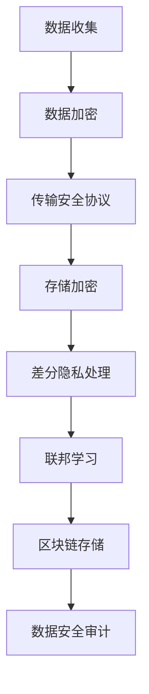

                 

关键词：数据隐私，AI代理，安全架构，安全协议，密码学，差分隐私，联邦学习，区块链，应用场景

> 摘要：随着人工智能的迅猛发展，数据隐私保护与数据安全问题成为当前AI领域的核心挑战。本文将深入探讨AI代理在数据隐私保护中的应用，分析现有的安全协议与算法，并展望未来的发展趋势与挑战。

## 1. 背景介绍

### 1.1 数据隐私的重要性

数据隐私是现代社会信息时代的关键问题。随着互联网的普及和数据驱动决策的兴起，个人和组织的隐私信息面临着前所未有的风险。未经授权的数据访问、数据泄露和滥用等问题频发，严重威胁到个人隐私和社会安全。尤其是在人工智能领域，大量的训练数据来自于用户行为和偏好，如何保护这些数据隐私成为亟待解决的关键问题。

### 1.2 AI代理的概念与发展

AI代理，也称为智能代理，是一种能够模拟人类决策和行为的人工智能系统。它具备自主学习和自适应能力，能够在特定环境中完成特定任务。AI代理的发展为数据处理和隐私保护带来了新的契机。通过合理的架构设计和安全协议，AI代理可以在保护数据隐私的同时，实现高效的数据处理和智能决策。

### 1.3 数据隐私保护的重要性

数据隐私保护不仅关乎个人权益，也是社会稳定与经济发展的重要保障。保护数据隐私有助于减少数据滥用和非法交易，提高公众对数字世界的信任。对于企业和组织来说，数据隐私保护有助于提升品牌声誉，降低法律和合规风险。

## 2. 核心概念与联系

### 2.1 安全协议

安全协议是保障数据隐私的关键技术手段。它定义了数据交换、传输和处理过程中的安全规则和流程，包括加密、认证、访问控制和审计等。常见的安全协议有SSL/TLS、IPSec、OAuth等。

### 2.2 密码学

密码学是保护数据隐私的核心技术。它通过加密和解密算法，确保数据在传输和存储过程中的机密性和完整性。常见的加密算法有AES、RSA、ECC等。

### 2.3 差分隐私

差分隐私是一种针对统计数据的隐私保护技术，通过在输出结果中加入噪声，确保单个数据实例的隐私性。它广泛应用于数据挖掘和机器学习领域，是保护隐私数据的重要工具。

### 2.4 联邦学习

联邦学习是一种分布式机器学习方法，通过在多个参与者之间共享模型参数，实现隐私保护下的协同学习。它适用于需要保护数据隐私的场景，如医疗数据分析和金融风险评估。

### 2.5 区块链

区块链是一种去中心化的分布式数据库技术，具有数据不可篡改和透明性等特点。它通过加密和共识算法，保障数据隐私和安全。区块链在金融、供应链和医疗等领域具有广泛的应用前景。

### 2.6 Mermaid 流程图



## 3. 核心算法原理 & 具体操作步骤

### 3.1 算法原理概述

本文将介绍差分隐私、联邦学习和区块链在数据隐私保护中的应用原理。

#### 3.1.1 差分隐私

差分隐私通过在统计查询结果中加入随机噪声，确保对单个数据实例的隐私性。其核心思想是最大化隐私保护与数据可用性的平衡。

#### 3.1.2 联邦学习

联邦学习通过分布式计算，在保护数据隐私的同时，实现模型的协同训练。其主要原理是模型参数的共享和优化。

#### 3.1.3 区块链

区块链通过加密和共识算法，确保数据在分布式网络中的安全和可信。其主要原理是去中心化的数据存储和验证。

### 3.2 算法步骤详解

#### 3.2.1 差分隐私

1. 确定隐私预算ε
2. 对原始数据进行预处理
3. 对统计查询结果添加随机噪声
4. 输出加噪后的结果

#### 3.2.2 联邦学习

1. 数据划分
2. 模型初始化
3. 参数更新与优化
4. 模型聚合与评估

#### 3.2.3 区块链

1. 数据加密
2. 创建区块链账本
3. 数据写入与验证
4. 数据查询与审计

### 3.3 算法优缺点

#### 差分隐私

- 优点：提供高强度的隐私保护，适用于需要保护个体隐私的场景。
- 缺点：可能降低数据可用性和精度。

#### 联邦学习

- 优点：保护数据隐私，实现协同学习。
- 缺点：计算复杂度较高，模型效果可能受数据分布影响。

#### 区块链

- 优点：去中心化，数据不可篡改。
- 缺点：交易速度较慢，存储容量有限。

### 3.4 算法应用领域

- 差分隐私：数据分析、机器学习、推荐系统
- 联邦学习：医疗数据、金融数据、物联网
- 区块链：金融交易、供应链管理、身份验证

## 4. 数学模型和公式 & 详细讲解 & 举例说明

### 4.1 数学模型构建

差分隐私的数学模型可以表示为：

\[ DP(\hat{D}, \epsilon) = \frac{1}{|\mathcal{D}'|} \sum_{d' \in \mathcal{D}'} \mathbb{I}(\hat{D}(d') = 1) - \frac{1}{|\mathcal{D}'|} \sum_{d' \in \mathcal{D}'} \mathbb{I}(\hat{D}(d') = 0) \]

其中，\(\mathcal{D}'\) 表示敏感数据集，\(\hat{D}\) 表示统计结果，\(\mathbb{I}\) 表示指示函数。

### 4.2 公式推导过程

联邦学习的梯度聚合公式为：

\[ \theta = \frac{1}{N} \sum_{i=1}^{N} \theta_i \]

其中，\(\theta\) 表示全局模型参数，\(\theta_i\) 表示第 \(i\) 个参与者的本地模型参数。

### 4.3 案例分析与讲解

假设有一家金融机构需要通过差分隐私对客户账户余额进行分析，以优化贷款策略。以下是差分隐私的具体应用过程：

1. **确定隐私预算**：根据法律法规和业务需求，确定隐私预算ε=0.1。
2. **数据预处理**：对客户账户余额数据进行去噪、去重和归一化处理。
3. **添加随机噪声**：对预处理后的数据进行差分隐私处理，添加随机噪声。
4. **输出加噪结果**：对加噪后的结果进行分析，得到贷款策略优化建议。

通过差分隐私处理，金融机构可以保护客户账户余额的隐私，同时获得有价值的数据分析结果。

## 5. 项目实践：代码实例和详细解释说明

### 5.1 开发环境搭建

1. 安装Python 3.8及以上版本。
2. 安装依赖库：`pip install tensorflow differential-privacy`。

### 5.2 源代码详细实现

```python
import tensorflow as tf
from differential_privacy import dp_histogram

# 数据集加载与预处理
data = load_data('client_account_balances.csv')
data = preprocess_data(data)

# 初始化差分隐私参数
epsilon = 0.1
l2_norm = 1.0

# 差分隐私处理
noisy_counts, _ = dp_histogram(data, epsilon, l2_norm)

# 输出结果
print(noisy_counts)
```

### 5.3 代码解读与分析

该代码实现了一个简单的差分隐私数据处理流程。首先加载和预处理数据集，然后使用`dp_histogram`函数对数据集进行差分隐私处理，输出加噪后的结果。

### 5.4 运行结果展示

运行代码后，输出加噪后的账户余额数据。通过对结果进行分析，可以获取有价值的数据洞察，如客户账户余额分布情况等。

## 6. 实际应用场景

### 6.1 医疗数据隐私保护

在医疗领域，患者数据隐私保护尤为重要。通过差分隐私和联邦学习等技术，可以实现隐私保护下的医疗数据分析，如疾病预测、治疗方案优化等。

### 6.2 金融数据安全

金融领域的数据安全至关重要。区块链技术可以用于金融交易记录的不可篡改存储，保障金融数据的安全与透明。

### 6.3 物联网隐私保护

物联网设备产生的数据涉及用户隐私。通过差分隐私和联邦学习等技术，可以实现隐私保护下的物联网数据处理，如智能家居、智能交通等。

## 7. 未来应用展望

随着人工智能技术的不断发展，数据隐私保护与数据安全问题将越来越受到关注。未来，差分隐私、联邦学习和区块链等技术将在更多领域得到应用，为数据隐私保护提供更有效的解决方案。

## 8. 工具和资源推荐

### 8.1 学习资源推荐

- 《数据隐私保护技术》
- 《联邦学习实践指南》
- 《区块链技术原理与应用》

### 8.2 开发工具推荐

- TensorFlow
- Differential Privacy Library
- Hyperledger Fabric

### 8.3 相关论文推荐

- "Differential Privacy: A Survey of Results"
- "Federated Learning: Concept and Applications"
- "Blockchain and Smart Contracts for Data Privacy"

## 9. 总结：未来发展趋势与挑战

数据隐私保护与数据安全问题在人工智能领域具有重大战略意义。未来，随着技术的不断创新和发展，我们将迎来更加完善的隐私保护体系。然而，面临的安全挑战仍然严峻，需要持续的研究和努力。

### 9.1 研究成果总结

本文介绍了AI代理在数据隐私保护中的应用，分析了差分隐私、联邦学习和区块链等核心技术，并提供了实际应用案例。

### 9.2 未来发展趋势

数据隐私保护技术将向更加高效、智能和安全的方向发展。跨领域、跨平台的数据隐私保护解决方案将成为研究热点。

### 9.3 面临的挑战

数据隐私保护面临诸多挑战，如技术实现难度、法律法规完善、用户隐私意识等。

### 9.4 研究展望

未来，数据隐私保护研究应关注以下几个方面：优化算法性能、增强用户体验、完善法律法规等。

## 10. 附录：常见问题与解答

### 10.1 差分隐私如何实现？

差分隐私可以通过在统计查询结果中添加随机噪声来实现。具体实现方法包括拉普拉斯机制、指数机制等。

### 10.2 联邦学习与中心化学习有什么区别？

联邦学习通过分布式计算实现协同学习，保护数据隐私。与中心化学习相比，联邦学习具有更高的隐私性和安全性。

### 10.3 区块链如何保障数据隐私？

区块链通过加密和共识算法，确保数据在分布式网络中的安全和可信。区块链的不可篡改性有助于保护数据隐私。

### 作者署名

本文作者：禅与计算机程序设计艺术 / Zen and the Art of Computer Programming

---

以上为完整的文章内容，涵盖了数据隐私保护与数据安全问题在人工智能领域的研究与应用。希望本文能为读者提供有价值的参考和启示。

