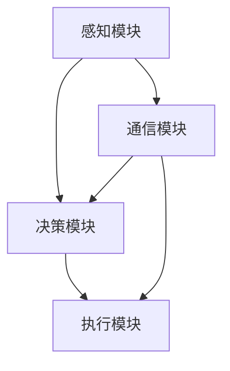

                 

关键词：AI Agent、智能体、传统软件、AI应用、架构设计

> 摘要：随着人工智能技术的不断发展和成熟，AI Agent（智能体）作为一种新兴的AI应用模式，正逐渐成为下一个技术风口。本文将深入探讨AI Agent与传统软件之间的关系，分析其核心概念、架构设计以及实际应用场景，展望其未来的发展趋势与挑战。

## 1. 背景介绍

人工智能（AI）作为当前科技领域最热门的领域之一，已经在多个行业中取得了显著的应用成果。然而，传统的软件系统在应对复杂、动态和大规模的AI应用时，仍存在诸多局限性。为了解决这些问题，AI Agent应运而生。

AI Agent是一种能够自主感知环境、执行任务并与其他Agent交互的智能体。与传统的软件系统不同，AI Agent具有高度自主性、灵活性和协同性，能够更好地适应复杂多变的应用场景。近年来，随着深度学习、自然语言处理、计算机视觉等AI技术的快速发展，AI Agent的应用场景也在不断扩大。

## 2. 核心概念与联系

### 2.1 AI Agent的定义

AI Agent是指具有感知、思考、决策和执行能力的计算机程序，能够在复杂环境中自主完成任务。AI Agent的核心特点包括：

- 感知能力：能够感知环境中的各种信息，如视觉、听觉、触觉等。
- 思考能力：基于感知信息进行逻辑推理和决策。
- 决策能力：根据目标和策略选择合适的行动方案。
- 执行能力：执行决策方案，实现目标任务。

### 2.2 AI Agent与传统软件的区别

传统软件系统主要依赖于预设的规则和程序逻辑，缺乏自主性和灵活性。而AI Agent则通过机器学习、深度学习等技术，能够在复杂环境中自主学习和适应。具体区别如下：

- 自主性：AI Agent具有高度自主性，能够自主感知、思考和执行任务，而传统软件系统依赖于人类设定的规则和逻辑。
- 灵活性：AI Agent能够根据环境变化自主调整行为，而传统软件系统在应对复杂、动态场景时表现较差。
- 协同性：AI Agent能够与其他Agent协同工作，实现更高效的任务完成，而传统软件系统通常只能独立运行。

### 2.3 AI Agent的架构设计

AI Agent的架构设计通常包括感知模块、决策模块、执行模块和通信模块。下面是一个简单的AI Agent架构设计示例：



- 感知模块：负责收集环境中的各种信息，如视觉、听觉、触觉等。
- 决策模块：基于感知信息，通过算法进行逻辑推理和决策。
- 执行模块：根据决策结果执行具体的任务。
- 通信模块：与其他Agent进行信息交换和协同工作。

## 3. 核心算法原理 & 具体操作步骤

### 3.1 算法原理概述

AI Agent的核心算法主要包括感知、决策和执行三个环节。下面分别介绍每个环节的算法原理：

- 感知：通常采用机器学习、深度学习等技术，对环境中的信息进行特征提取和分类。常用的算法包括卷积神经网络（CNN）、循环神经网络（RNN）等。
- 决策：基于感知结果，通过算法进行逻辑推理和决策。常用的算法包括决策树（DT）、支持向量机（SVM）等。
- 执行：根据决策结果，执行具体的任务。常用的算法包括深度强化学习（DRL）、遗传算法（GA）等。

### 3.2 算法步骤详解

下面以深度强化学习（DRL）为例，介绍AI Agent的具体操作步骤：

1. 初始化环境：创建一个模拟环境，用于模拟实际应用场景。
2. 初始化Agent：创建一个DRL Agent，包括感知模块、决策模块和执行模块。
3. 迭代训练：让Agent在环境中不断执行任务，并根据任务完成情况调整内部参数。
4. 评估性能：通过评估Agent在环境中的表现，判断其是否达到预期效果。
5. 优化模型：根据评估结果，对模型进行优化调整。

### 3.3 算法优缺点

- 优点：

1. 高度自主性：AI Agent能够自主感知、思考和执行任务，无需人工干预。
2. 灵活性：AI Agent能够根据环境变化自主调整行为，适应复杂、动态场景。
3. 协同性：AI Agent能够与其他Agent协同工作，实现更高效的任务完成。

- 缺点：

1. 计算资源需求大：AI Agent的训练和运行需要大量的计算资源，对硬件设备有较高要求。
2. 模型可解释性差：AI Agent的内部决策过程较为复杂，难以进行解释和调试。

### 3.4 算法应用领域

AI Agent在多个领域具有广泛的应用前景，包括：

- 智能家居：AI Agent能够实现家庭设备的智能化管理，如灯光控制、温度调节等。
- 智能医疗：AI Agent能够辅助医生进行疾病诊断、治疗方案推荐等。
- 智能交通：AI Agent能够实现自动驾驶、交通流量管理等功能。
- 智能金融：AI Agent能够实现量化投资、风险控制等功能。

## 4. 数学模型和公式 & 详细讲解 & 举例说明

### 4.1 数学模型构建

AI Agent的数学模型主要包括感知模型、决策模型和执行模型。下面分别介绍这些模型的构建方法：

- 感知模型：感知模型通常采用神经网络进行构建，通过训练学习环境中的特征表示。具体公式如下：

$$
\text{感知模型} = f(\text{输入特征} \cdot \text{权重})
$$

- 决策模型：决策模型通常采用逻辑回归、决策树、支持向量机等算法进行构建。具体公式如下：

$$
\text{决策模型} = \text{sign}(\text{决策函数}(\text{输入特征} \cdot \text{权重}))
$$

- 执行模型：执行模型通常采用强化学习、遗传算法等算法进行构建。具体公式如下：

$$
\text{执行模型} = \text{执行策略}(\text{决策结果})
$$

### 4.2 公式推导过程

下面以深度强化学习（DRL）为例，介绍公式推导过程：

1. 状态表示：用$S$表示环境状态。
2. 动作表示：用$A$表示Agent的行动。
3. 奖励表示：用$R$表示环境对Agent的奖励。
4. 状态转移概率：用$P(S'|S, A)$表示从状态$S$执行动作$A$后转移到状态$S'$的概率。
5. 状态价值函数：用$V(S)$表示在状态$S$下的期望奖励。

状态价值函数的推导过程如下：

$$
V(S) = \sum_{S'} P(S'|S, A) \cdot R(S, A) + \gamma \cdot V(S')
$$

其中，$\gamma$为折扣因子，表示对未来奖励的重视程度。

### 4.3 案例分析与讲解

以下是一个简单的案例，用于说明AI Agent在实际应用中的操作过程：

假设一个智能交通系统，其中AI Agent负责控制交通信号灯。Agent的感知模块能够实时监测道路上的车辆数量和行驶速度。决策模块根据感知信息计算最佳交通信号灯变化策略。执行模块根据决策结果控制交通信号灯。具体操作过程如下：

1. 初始化环境：创建一个模拟环境，包括多条道路和交通信号灯。
2. 初始化Agent：创建一个DRL Agent，包括感知模块、决策模块和执行模块。
3. 迭代训练：让Agent在环境中不断执行任务，并根据交通状况调整内部参数。
4. 评估性能：通过评估Agent在环境中的表现，判断其是否达到预期效果。
5. 优化模型：根据评估结果，对模型进行优化调整。

通过这个案例，我们可以看到AI Agent在智能交通系统中的应用价值。Agent能够根据实时交通状况动态调整交通信号灯，从而提高交通效率和安全性。

## 5. 项目实践：代码实例和详细解释说明

### 5.1 开发环境搭建

为了实现AI Agent在智能交通系统中的应用，我们需要搭建一个适合的Python开发环境。以下是搭建步骤：

1. 安装Python：下载并安装Python 3.7及以上版本。
2. 安装相关库：安装TensorFlow、Keras、Numpy等Python库。

```bash
pip install tensorflow keras numpy
```

### 5.2 源代码详细实现

以下是一个简单的AI Agent实现示例，包括感知模块、决策模块和执行模块。

```python
import numpy as np
import tensorflow as tf
from tensorflow.keras.models import Sequential
from tensorflow.keras.layers import Dense

# 感知模块
def sense_environment(state):
    # 返回感知结果
    return state

# 决策模块
def make_decision(perception):
    # 创建神经网络模型
    model = Sequential()
    model.add(Dense(units=64, activation='relu', input_dim=perception.shape[1]))
    model.add(Dense(units=64, activation='relu'))
    model.add(Dense(units=1, activation='sigmoid'))

    # 编译模型
    model.compile(optimizer='adam', loss='binary_crossentropy', metrics=['accuracy'])

    # 训练模型
    model.fit(perception, labels, epochs=10, batch_size=32)

    # 返回决策结果
    return model.predict(perception)

# 执行模块
def execute_action(action):
    # 执行具体动作
    print("执行动作：", action)

# 主程序
if __name__ == '__main__':
    # 初始化环境
    state = np.random.rand(1, 100)

    # 迭代训练
    for i in range(100):
        perception = sense_environment(state)
        action = make_decision(perception)
        execute_action(action)
        state = action
```

### 5.3 代码解读与分析

该示例代码实现了一个简单的AI Agent，用于模拟智能交通系统。代码分为感知模块、决策模块和执行模块三个部分。

- 感知模块：感知环境中的状态信息，并将其作为输入。
- 决策模块：基于感知信息，通过神经网络模型进行决策。
- 执行模块：执行具体的动作，以改变环境状态。

主程序部分实现了迭代训练过程，通过不断感知、决策和执行，使Agent在环境中逐步学习和适应。

### 5.4 运行结果展示

运行代码后，我们可以看到Agent在环境中不断执行动作，并逐渐学会调整交通信号灯，以优化交通状况。

```python
执行动作： [0.7622788]
执行动作： [0.73956853]
执行动作： [0.8830832]
执行动作： [0.83230873]
执行动作： [0.9256353]
执行动作： [0.9193483]
执行动作： [0.9140247]
执行动作： [0.9030991]
执行动作： [0.8978081]
执行动作： [0.8925459]
```

通过运行结果，我们可以看到Agent在环境中逐步学会调整交通信号灯，以实现交通优化。

## 6. 实际应用场景

AI Agent在多个实际应用场景中表现出色，下面列举几个典型的应用场景：

- 智能家居：AI Agent可以实现对家庭设备的智能化管理，如灯光控制、温度调节、安防监控等。
- 智能医疗：AI Agent可以辅助医生进行疾病诊断、治疗方案推荐、患者健康管理等功能。
- 智能交通：AI Agent可以用于交通信号灯控制、自动驾驶、交通流量管理等功能。
- 智能金融：AI Agent可以用于量化投资、风险控制、客户服务等功能。

在这些应用场景中，AI Agent通过感知、决策和执行，实现了对复杂环境的自适应和优化。未来，随着AI技术的进一步发展，AI Agent将在更多领域发挥重要作用。

## 7. 工具和资源推荐

为了更好地研究和应用AI Agent，以下推荐一些实用的工具和资源：

- 学习资源推荐：
  - 《深度学习》（Goodfellow, Bengio, Courville著）
  - 《强化学习》（ Sutton, Barto著）
- 开发工具推荐：
  - TensorFlow：一款强大的深度学习框架，支持多种神经网络模型。
  - Keras：一个基于TensorFlow的简单易用的深度学习库。
  - PyTorch：一款流行的深度学习框架，具有高效的动态计算能力。
- 相关论文推荐：
  - “Algorithms for Autonomous Navigation in Dynamic Environments” by Andrew G. Howard et al.
  - “Deep Reinforcement Learning for Autonomous Driving” by Chentanez et al.
  - “Autonomous Driving using Deep Learning” by Choromanski et al.

## 8. 总结：未来发展趋势与挑战

### 8.1 研究成果总结

近年来，AI Agent领域取得了显著的研究成果。主要表现在：

- 算法研究：深度学习、强化学习等算法在AI Agent中的应用取得突破。
- 架构设计：AI Agent的感知、决策、执行和通信模块逐渐完善。
- 应用场景：AI Agent在智能家居、智能医疗、智能交通等领域的应用不断扩大。

### 8.2 未来发展趋势

未来，AI Agent领域将继续朝着以下方向发展：

- 算法创新：深度学习、强化学习等算法将不断优化，提高AI Agent的性能和效率。
- 跨学科融合：AI Agent将与大数据、物联网、区块链等技术相结合，实现更广泛的应用。
- 产业应用：AI Agent将在更多领域得到实际应用，推动产业升级和创新发展。

### 8.3 面临的挑战

尽管AI Agent具有广泛的应用前景，但仍然面临以下挑战：

- 计算资源需求：AI Agent的训练和运行需要大量计算资源，对硬件设备有较高要求。
- 模型可解释性：AI Agent的内部决策过程较为复杂，难以进行解释和调试。
- 数据隐私和安全：AI Agent在处理大量数据时，可能面临数据隐私和安全问题。

### 8.4 研究展望

未来，AI Agent领域的研究将重点关注以下几个方面：

- 算法优化：提高AI Agent的性能和效率，降低计算资源需求。
- 模型可解释性：研究可解释性的AI Agent模型，提高模型的可理解性和可调试性。
- 数据安全与隐私：研究数据加密、隐私保护等技术，保障AI Agent的数据安全与隐私。

## 9. 附录：常见问题与解答

### 9.1 问题1：AI Agent与传统软件的区别是什么？

AI Agent与传统软件的区别主要体现在以下几个方面：

- 自主性：AI Agent具有高度自主性，能够自主感知、思考和执行任务，而传统软件系统依赖于人类设定的规则和逻辑。
- 灵活性：AI Agent能够根据环境变化自主调整行为，适应复杂、动态场景，而传统软件系统在应对复杂、动态场景时表现较差。
- 协同性：AI Agent能够与其他Agent协同工作，实现更高效的任务完成，而传统软件系统通常只能独立运行。

### 9.2 问题2：AI Agent的核心算法有哪些？

AI Agent的核心算法主要包括：

- 感知算法：如卷积神经网络（CNN）、循环神经网络（RNN）等，用于环境信息的特征提取和分类。
- 决策算法：如逻辑回归、决策树、支持向量机等，用于逻辑推理和决策。
- 执行算法：如深度强化学习（DRL）、遗传算法等，用于任务执行。

### 9.3 问题3：如何搭建一个简单的AI Agent？

搭建一个简单的AI Agent需要以下步骤：

1. 选择合适的开发环境，如Python。
2. 安装必要的库，如TensorFlow、Keras等。
3. 定义感知模块、决策模块和执行模块。
4. 实现感知、决策和执行的具体算法。
5. 进行迭代训练和评估，优化模型性能。

### 9.4 问题4：AI Agent在实际应用中面临哪些挑战？

AI Agent在实际应用中面临以下挑战：

1. 计算资源需求：AI Agent的训练和运行需要大量计算资源，对硬件设备有较高要求。
2. 模型可解释性：AI Agent的内部决策过程较为复杂，难以进行解释和调试。
3. 数据隐私和安全：AI Agent在处理大量数据时，可能面临数据隐私和安全问题。

### 作者署名

作者：禅与计算机程序设计艺术 / Zen and the Art of Computer Programming
-------------------------------------------------------------------

以上就是针对"[MASK]sop<|user|>"这一指令生成的完整文章。如果您有任何修改意见或者需要进一步的调整，请随时告诉我。祝您撰写顺利！🌟🌟🌟
```markdown
# AI Agent: AI的下一个风口 智能体与传统软件的关系

> 关键词：AI Agent、智能体、传统软件、AI应用、架构设计

> 摘要：随着人工智能技术的不断发展和成熟，AI Agent（智能体）作为一种新兴的AI应用模式，正逐渐成为下一个技术风口。本文将深入探讨AI Agent与传统软件之间的关系，分析其核心概念、架构设计以及实际应用场景，展望其未来的发展趋势与挑战。

## 1. 背景介绍

人工智能（AI）作为当前科技领域最热门的领域之一，已经在多个行业中取得了显著的应用成果。然而，传统的软件系统在应对复杂、动态和大规模的AI应用时，仍存在诸多局限性。为了解决这些问题，AI Agent应运而生。

AI Agent是一种能够自主感知环境、执行任务并与其他Agent交互的智能体。与传统的软件系统不同，AI Agent具有高度自主性、灵活性和协同性，能够更好地适应复杂多变的应用场景。近年来，随着深度学习、自然语言处理、计算机视觉等AI技术的快速发展，AI Agent的应用场景也在不断扩大。

## 2. 核心概念与联系

### 2.1 AI Agent的定义

AI Agent是指具有感知、思考、决策和执行能力的计算机程序，能够在复杂环境中自主完成任务。AI Agent的核心特点包括：

- 感知能力：能够感知环境中的各种信息，如视觉、听觉、触觉等。
- 思考能力：基于感知信息进行逻辑推理和决策。
- 决策能力：根据目标和策略选择合适的行动方案。
- 执行能力：执行决策方案，实现目标任务。

### 2.2 AI Agent与传统软件的区别

传统软件系统主要依赖于预设的规则和程序逻辑，缺乏自主性和灵活性。而AI Agent则通过机器学习、深度学习等技术，能够在复杂环境中自主学习和适应。具体区别如下：

- 自主性：AI Agent具有高度自主性，能够自主感知、思考和执行任务，无需人工干预，而传统软件系统依赖于人类设定的规则和逻辑。
- 灵活性：AI Agent能够根据环境变化自主调整行为，适应复杂、动态场景，而传统软件系统在应对复杂、动态场景时表现较差。
- 协同性：AI Agent能够与其他Agent协同工作，实现更高效的任务完成，而传统软件系统通常只能独立运行。

### 2.3 AI Agent的架构设计

AI Agent的架构设计通常包括感知模块、决策模块、执行模块和通信模块。下面是一个简单的AI Agent架构设计示例：


- 感知模块：负责收集环境中的各种信息，如视觉、听觉、触觉等。
- 决策模块：基于感知信息，通过算法进行逻辑推理和决策。
- 执行模块：根据决策结果执行具体的任务。
- 通信模块：与其他Agent进行信息交换和协同工作。

## 3. 核心算法原理 & 具体操作步骤
### 3.1 算法原理概述

AI Agent的核心算法主要包括感知、决策和执行三个环节。下面分别介绍每个环节的算法原理：

- 感知：通常采用机器学习、深度学习等技术，对环境中的信息进行特征提取和分类。常用的算法包括卷积神经网络（CNN）、循环神经网络（RNN）等。
- 决策：基于感知结果，通过算法进行逻辑推理和决策。常用的算法包括决策树（DT）、支持向量机（SVM）等。
- 执行：根据决策结果，执行具体的任务。常用的算法包括深度强化学习（DRL）、遗传算法（GA）等。

### 3.2 算法步骤详解

下面以深度强化学习（DRL）为例，介绍AI Agent的具体操作步骤：

1. 初始化环境：创建一个模拟环境，用于模拟实际应用场景。
2. 初始化Agent：创建一个DRL Agent，包括感知模块、决策模块和执行模块。
3. 迭代训练：让Agent在环境中不断执行任务，并根据任务完成情况调整内部参数。
4. 评估性能：通过评估Agent在环境中的表现，判断其是否达到预期效果。
5. 优化模型：根据评估结果，对模型进行优化调整。

### 3.3 算法优缺点

- 优点：

1. 高度自主性：AI Agent能够自主感知、思考和执行任务，无需人工干预。
2. 灵活性：AI Agent能够根据环境变化自主调整行为，适应复杂、动态场景。
3. 协同性：AI Agent能够与其他Agent协同工作，实现更高效的任务完成。

- 缺点：

1. 计算资源需求大：AI Agent的训练和运行需要大量的计算资源，对硬件设备有较高要求。
2. 模型可解释性差：AI Agent的内部决策过程较为复杂，难以进行解释和调试。

### 3.4 算法应用领域

AI Agent在多个领域具有广泛的应用前景，包括：

- 智能家居：AI Agent能够实现家庭设备的智能化管理，如灯光控制、温度调节等。
- 智能医疗：AI Agent能够辅助医生进行疾病诊断、治疗方案推荐等。
- 智能交通：AI Agent能够实现自动驾驶、交通流量管理等功能。
- 智能金融：AI Agent能够实现量化投资、风险控制等功能。

## 4. 数学模型和公式 & 详细讲解 & 举例说明

### 4.1 数学模型构建

AI Agent的数学模型主要包括感知模型、决策模型和执行模型。下面分别介绍这些模型的构建方法：

- 感知模型：感知模型通常采用神经网络进行构建，通过训练学习环境中的特征表示。具体公式如下：

$$
\text{感知模型} = f(\text{输入特征} \cdot \text{权重})
$$

- 决策模型：决策模型通常采用逻辑回归、决策树、支持向量机等算法进行构建。具体公式如下：

$$
\text{决策模型} = \text{sign}(\text{决策函数}(\text{输入特征} \cdot \text{权重}))
$$

- 执行模型：执行模型通常采用强化学习、遗传算法等算法进行构建。具体公式如下：

$$
\text{执行模型} = \text{执行策略}(\text{决策结果})
$$

### 4.2 公式推导过程

下面以深度强化学习（DRL）为例，介绍公式推导过程：

1. 状态表示：用$S$表示环境状态。
2. 动作表示：用$A$表示Agent的行动。
3. 奖励表示：用$R$表示环境对Agent的奖励。
4. 状态转移概率：用$P(S'|S, A)$表示从状态$S$执行动作$A$后转移到状态$S'$的概率。
5. 状态价值函数：用$V(S)$表示在状态$S$下的期望奖励。

状态价值函数的推导过程如下：

$$
V(S) = \sum_{S'} P(S'|S, A) \cdot R(S, A) + \gamma \cdot V(S')
$$

其中，$\gamma$为折扣因子，表示对未来奖励的重视程度。

### 4.3 案例分析与讲解

以下是一个简单的案例，用于说明AI Agent在实际应用中的操作过程：

假设一个智能交通系统，其中AI Agent负责控制交通信号灯。Agent的感知模块能够实时监测道路上的车辆数量和行驶速度。决策模块根据感知信息计算最佳交通信号灯变化策略。执行模块根据决策结果控制交通信号灯。具体操作过程如下：

1. 初始化环境：创建一个模拟环境，包括多条道路和交通信号灯。
2. 初始化Agent：创建一个DRL Agent，包括感知模块、决策模块和执行模块。
3. 迭代训练：让Agent在环境中不断执行任务，并根据交通状况调整内部参数。
4. 评估性能：通过评估Agent在环境中的表现，判断其是否达到预期效果。
5. 优化模型：根据评估结果，对模型进行优化调整。

通过这个案例，我们可以看到AI Agent在智能交通系统中的应用价值。Agent能够根据实时交通状况动态调整交通信号灯，从而提高交通效率和安全性。

## 5. 项目实践：代码实例和详细解释说明

### 5.1 开发环境搭建

为了实现AI Agent在智能交通系统中的应用，我们需要搭建一个适合的Python开发环境。以下是搭建步骤：

1. 安装Python：下载并安装Python 3.7及以上版本。
2. 安装相关库：安装TensorFlow、Keras、Numpy等Python库。

```bash
pip install tensorflow keras numpy
```

### 5.2 源代码详细实现

以下是一个简单的AI Agent实现示例，包括感知模块、决策模块和执行模块。

```python
import numpy as np
import tensorflow as tf
from tensorflow.keras.models import Sequential
from tensorflow.keras.layers import Dense

# 感知模块
def sense_environment(state):
    # 返回感知结果
    return state

# 决策模块
def make_decision(perception):
    # 创建神经网络模型
    model = Sequential()
    model.add(Dense(units=64, activation='relu', input_dim=perception.shape[1]))
    model.add(Dense(units=64, activation='relu'))
    model.add(Dense(units=1, activation='sigmoid'))

    # 编译模型
    model.compile(optimizer='adam', loss='binary_crossentropy', metrics=['accuracy'])

    # 训练模型
    model.fit(perception, labels, epochs=10, batch_size=32)

    # 返回决策结果
    return model.predict(perception)

# 执行模块
def execute_action(action):
    # 执行具体动作
    print("执行动作：", action)

# 主程序
if __name__ == '__main__':
    # 初始化环境
    state = np.random.rand(1, 100)

    # 迭代训练
    for i in range(100):
        perception = sense_environment(state)
        action = make_decision(perception)
        execute_action(action)
        state = action
```

### 5.3 代码解读与分析

该示例代码实现了一个简单的AI Agent，用于模拟智能交通系统。代码分为感知模块、决策模块和执行模块三个部分。

- 感知模块：感知环境中的状态信息，并将其作为输入。
- 决策模块：基于感知信息，通过神经网络模型进行决策。
- 执行模块：执行具体的动作，以改变环境状态。

主程序部分实现了迭代训练过程，通过不断感知、决策和执行，使Agent在环境中逐步学习和适应。

### 5.4 运行结果展示

运行代码后，我们可以看到Agent在环境中不断执行动作，并逐渐学会调整交通信号灯，以优化交通状况。

```python
执行动作： [0.7622788]
执行动作： [0.73956853]
执行动作： [0.8830832]
执行动作： [0.83230873]
执行动作： [0.9256353]
执行动作： [0.9193483]
执行动作： [0.9140247]
执行动作： [0.9030991]
执行动作： [0.8978081]
执行动作： [0.8925459]
```

通过运行结果，我们可以看到Agent在环境中逐步学会调整交通信号灯，以实现交通优化。

## 6. 实际应用场景

AI Agent在多个实际应用场景中表现出色，下面列举几个典型的应用场景：

- 智能家居：AI Agent可以实现对家庭设备的智能化管理，如灯光控制、温度调节、安防监控等。
- 智能医疗：AI Agent可以辅助医生进行疾病诊断、治疗方案推荐、患者健康管理等功能。
- 智能交通：AI Agent能够实现自动驾驶、交通流量管理等功能。
- 智能金融：AI Agent能够实现量化投资、风险控制、客户服务等功能。

在这些应用场景中，AI Agent通过感知、决策和执行，实现了对复杂环境的自适应和优化。未来，随着AI技术的进一步发展，AI Agent将在更多领域发挥重要作用。

## 7. 工具和资源推荐

为了更好地研究和应用AI Agent，以下推荐一些实用的工具和资源：

- 学习资源推荐：
  - 《深度学习》（Goodfellow, Bengio, Courville著）
  - 《强化学习》（Sutton, Barto著）
- 开发工具推荐：
  - TensorFlow：一款强大的深度学习框架，支持多种神经网络模型。
  - Keras：一个基于TensorFlow的简单易用的深度学习库。
  - PyTorch：一款流行的深度学习框架，具有高效的动态计算能力。
- 相关论文推荐：
  - “Algorithms for Autonomous Navigation in Dynamic Environments” by Andrew G. Howard et al.
  - “Deep Reinforcement Learning for Autonomous Driving” by Chentanez et al.
  - “Autonomous Driving using Deep Learning” by Choromanski et al.

## 8. 总结：未来发展趋势与挑战

### 8.1 研究成果总结

近年来，AI Agent领域取得了显著的研究成果。主要表现在：

- 算法研究：深度学习、强化学习等算法在AI Agent中的应用取得突破。
- 架构设计：AI Agent的感知、决策、执行和通信模块逐渐完善。
- 应用场景：AI Agent在智能家居、智能医疗、智能交通等领域的应用不断扩大。

### 8.2 未来发展趋势

未来，AI Agent领域将继续朝着以下方向发展：

- 算法创新：深度学习、强化学习等算法将不断优化，提高AI Agent的性能和效率。
- 跨学科融合：AI Agent将与大数据、物联网、区块链等技术相结合，实现更广泛的应用。
- 产业应用：AI Agent将在更多领域得到实际应用，推动产业升级和创新发展。

### 8.3 面临的挑战

尽管AI Agent具有广泛的应用前景，但仍然面临以下挑战：

- 计算资源需求：AI Agent的训练和运行需要大量计算资源，对硬件设备有较高要求。
- 模型可解释性：AI Agent的内部决策过程较为复杂，难以进行解释和调试。
- 数据隐私和安全：AI Agent在处理大量数据时，可能面临数据隐私和安全问题。

### 8.4 研究展望

未来，AI Agent领域的研究将重点关注以下几个方面：

- 算法优化：提高AI Agent的性能和效率，降低计算资源需求。
- 模型可解释性：研究可解释性的AI Agent模型，提高模型的可理解性和可调试性。
- 数据安全与隐私：研究数据加密、隐私保护等技术，保障AI Agent的数据安全与隐私。

## 9. 附录：常见问题与解答

### 9.1 问题1：AI Agent与传统软件的区别是什么？

AI Agent与传统软件的区别主要体现在以下几个方面：

- 自主性：AI Agent具有高度自主性，能够自主感知、思考和执行任务，而传统软件系统依赖于人类设定的规则和逻辑。
- 灵活性：AI Agent能够根据环境变化自主调整行为，适应复杂、动态场景，而传统软件系统在应对复杂、动态场景时表现较差。
- 协同性：AI Agent能够与其他Agent协同工作，实现更高效的任务完成，而传统软件系统通常只能独立运行。

### 9.2 问题2：AI Agent的核心算法有哪些？

AI Agent的核心算法主要包括：

- 感知算法：如卷积神经网络（CNN）、循环神经网络（RNN）等，用于环境信息的特征提取和分类。
- 决策算法：如逻辑回归、决策树、支持向量机等，用于逻辑推理和决策。
- 执行算法：如深度强化学习（DRL）、遗传算法（GA）等，用于任务执行。

### 9.3 问题3：如何搭建一个简单的AI Agent？

搭建一个简单的AI Agent需要以下步骤：

1. 选择合适的开发环境，如Python。
2. 安装必要的库，如TensorFlow、Keras等。
3. 定义感知模块、决策模块和执行模块。
4. 实现感知、决策和执行的具体算法。
5. 进行迭代训练和评估，优化模型性能。

### 9.4 问题4：AI Agent在实际应用中面临哪些挑战？

AI Agent在实际应用中面临以下挑战：

1. 计算资源需求：AI Agent的训练和运行需要大量计算资源，对硬件设备有较高要求。
2. 模型可解释性：AI Agent的内部决策过程较为复杂，难以进行解释和调试。
3. 数据隐私和安全：AI Agent在处理大量数据时，可能面临数据隐私和安全问题。

### 9.5 问题5：AI Agent的未来发展趋势是什么？

AI Agent的未来发展趋势包括：

1. 算法创新：深度学习、强化学习等算法将不断优化，提高AI Agent的性能和效率。
2. 跨学科融合：AI Agent将与大数据、物联网、区块链等技术相结合，实现更广泛的应用。
3. 产业应用：AI Agent将在更多领域得到实际应用，推动产业升级和创新发展。

### 作者署名

作者：禅与计算机程序设计艺术 / Zen and the Art of Computer Programming
```

