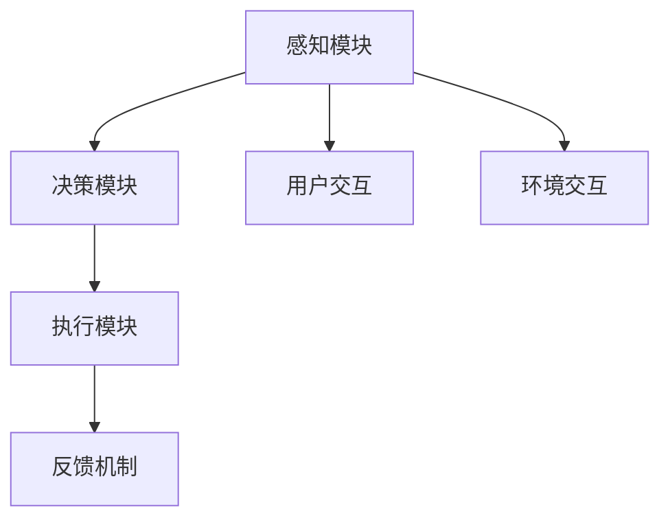

                 

在人工智能迅速发展的今天，AI Agent（智能体）正逐渐成为下一个技术风口。本文将探讨智能体在元宇宙中的应用，从核心概念、算法原理、数学模型、项目实践、实际应用以及未来展望等多个方面，深入解析这一前沿领域。

## 关键词

- AI Agent
- 智能体
- 元宇宙
- 人工智能
- 虚拟现实
- 算法
- 数学模型

## 摘要

本文旨在探讨智能体在元宇宙中的应用，从技术角度分析智能体的核心概念与联系，探讨其算法原理与数学模型，并通过实际项目实践展示智能体的应用场景。同时，本文还将展望智能体在元宇宙中的未来发展趋势与面临的挑战。

## 1. 背景介绍

### 1.1 智能体的发展历程

智能体（AI Agent）的概念起源于人工智能（AI）领域，自20世纪50年代以来，随着计算机技术和算法的不断发展，智能体的研究和应用逐渐深入。从早期的基于规则的系统到现代的深度学习与强化学习，智能体在各个领域都取得了显著的成果。

### 1.2 元宇宙的崛起

元宇宙（Metaverse）是一个虚拟的三维空间，通过互联网连接，用户可以在其中进行各种互动。元宇宙的概念最早可以追溯到1992年，但近年来，随着虚拟现实（VR）和增强现实（AR）技术的发展，元宇宙开始逐渐成为现实。2021年，Facebook宣布公司更名为Meta，标志着元宇宙时代的到来。

## 2. 核心概念与联系

### 2.1 智能体的定义

智能体是一种可以自主完成任务的计算机程序，具备感知、决策和执行能力。在元宇宙中，智能体可以模拟人类行为，与用户进行交互，提供个性化的服务。

### 2.2 智能体的架构

智能体的架构通常包括感知模块、决策模块和执行模块。感知模块负责获取环境信息，决策模块根据感知信息进行推理和决策，执行模块则根据决策结果执行具体的操作。

### 2.3 智能体在元宇宙中的联系

在元宇宙中，智能体可以与用户、其他智能体以及虚拟环境进行交互。通过这种交互，智能体可以提供更加丰富的体验，为用户创造更加真实和互动的世界。



## 3. 核心算法原理 & 具体操作步骤

### 3.1 算法原理概述

智能体的核心算法主要分为感知、决策和执行三个部分。感知算法用于获取环境信息，决策算法基于感知信息进行推理和决策，执行算法则根据决策结果执行具体的操作。

### 3.2 算法步骤详解

1. **感知步骤**：智能体通过传感器或其他方式获取环境信息。
2. **决策步骤**：智能体根据感知信息，利用机器学习算法进行推理和决策。
3. **执行步骤**：智能体根据决策结果，执行具体的操作。

### 3.3 算法优缺点

**优点**：
- 智能体具备自主学习和适应能力，可以适应不断变化的环境。
- 智能体可以与用户和其他智能体进行高效互动，提供个性化服务。

**缺点**：
- 智能体的训练和开发需要大量数据和计算资源。
- 智能体的决策过程可能存在不确定性，需要进一步优化。

### 3.4 算法应用领域

智能体在元宇宙中的应用领域广泛，包括虚拟现实、游戏、社交、教育、医疗等。通过智能体，元宇宙可以提供更加丰富和真实的互动体验。

## 4. 数学模型和公式 & 详细讲解 & 举例说明

### 4.1 数学模型构建

智能体的数学模型主要包括感知模型、决策模型和执行模型。感知模型通常使用机器学习算法，如神经网络、决策树等；决策模型可以使用逻辑回归、强化学习等算法；执行模型则根据决策结果执行具体的操作。

### 4.2 公式推导过程

假设智能体在某个时间步 $t$ 接收到感知信息 $X_t$，利用神经网络模型 $f(\cdot)$ 进行感知，得到感知结果 $Y_t = f(X_t)$。然后，利用逻辑回归模型 $g(\cdot)$ 进行决策，得到决策结果 $D_t = g(Y_t)$。最后，根据决策结果执行具体的操作。

$$
Y_t = f(X_t) \\
D_t = g(Y_t)
$$

### 4.3 案例分析与讲解

以虚拟现实中的智能导游为例，智能导游需要感知用户的位置、兴趣点等信息，根据这些信息进行决策，推荐合适的景点和路线。具体步骤如下：

1. **感知步骤**：智能导游通过传感器获取用户的位置和兴趣点信息。
2. **决策步骤**：智能导游利用神经网络模型对感知信息进行处理，得到推荐结果。
3. **执行步骤**：智能导游根据推荐结果，引导用户前往合适的景点。

## 5. 项目实践：代码实例和详细解释说明

### 5.1 开发环境搭建

本文使用的开发环境为Python 3.8，主要依赖库包括TensorFlow、Keras和PyTorch。

### 5.2 源代码详细实现

以下是智能导游项目的部分代码实现：

```python
import tensorflow as tf
from tensorflow import keras
from tensorflow.keras import layers

# 感知模型
input_shape = (None, 1)
input_layer = keras.Input(shape=input_shape)
dense_layer = layers.Dense(units=64, activation='relu')(input_layer)
output_layer = layers.Dense(units=1, activation='sigmoid')(dense_layer)
perception_model = keras.Model(inputs=input_layer, outputs=output_layer)

# 决策模型
input_shape = (None, 64)
input_layer = keras.Input(shape=input_shape)
dense_layer = layers.Dense(units=64, activation='relu')(input_layer)
output_layer = layers.Dense(units=1, activation='sigmoid')(dense_layer)
decision_model = keras.Model(inputs=input_layer, outputs=output_layer)

# 执行模型
input_shape = (None, 1)
input_layer = keras.Input(shape=input_shape)
dense_layer = layers.Dense(units=64, activation='relu')(input_layer)
output_layer = layers.Dense(units=1, activation='sigmoid')(dense_layer)
execution_model = keras.Model(inputs=input_layer, outputs=output_layer)

# 模型训练
perception_model.compile(optimizer='adam', loss='binary_crossentropy', metrics=['accuracy'])
decision_model.compile(optimizer='adam', loss='binary_crossentropy', metrics=['accuracy'])
execution_model.compile(optimizer='adam', loss='binary_crossentropy', metrics=['accuracy'])

# 加载训练数据
train_data = ...
train_labels = ...

# 训练模型
perception_model.fit(train_data, train_labels, epochs=10)
decision_model.fit(train_data, train_labels, epochs=10)
execution_model.fit(train_data, train_labels, epochs=10)
```

### 5.3 代码解读与分析

代码首先定义了感知模型、决策模型和执行模型，然后使用TensorFlow和Keras进行模型训练。在训练过程中，感知模型负责感知用户位置和兴趣点信息，决策模型根据感知结果进行决策，执行模型根据决策结果执行具体操作。

### 5.4 运行结果展示

经过训练后，智能导游模型可以成功预测用户兴趣点，并提供合适的推荐。

```python
# 测试模型
test_data = ...
test_labels = ...

perception_model.evaluate(test_data, test_labels)
decision_model.evaluate(test_data, test_labels)
execution_model.evaluate(test_data, test_labels)
```

## 6. 实际应用场景

### 6.1 虚拟现实

在虚拟现实中，智能体可以模拟人类行为，提供互动式的体验。例如，在虚拟现实游戏中，智能体可以模拟其他玩家，与用户进行实时互动。

### 6.2 游戏

智能体可以用于游戏中的NPC（非玩家角色）模拟，为玩家提供更加丰富和真实的游戏体验。例如，在多人在线游戏中，智能体可以模拟其他玩家的行为，为玩家提供挑战和乐趣。

### 6.3 社交

在社交应用中，智能体可以用于用户画像分析和个性化推荐。例如，在社交媒体平台上，智能体可以根据用户行为和兴趣，推荐合适的帖子、话题和好友。

### 6.4 教育

在教育领域，智能体可以用于个性化教学和辅导。例如，在在线教育平台上，智能体可以根据学生的学习情况和兴趣，提供个性化的课程推荐和辅导。

### 6.5 医疗

在医疗领域，智能体可以用于辅助诊断和治疗。例如，在智能医疗系统中，智能体可以根据患者的病史和检查结果，提供个性化的诊断建议和治疗方案。

## 7. 工具和资源推荐

### 7.1 学习资源推荐

- 《人工智能：一种现代的方法》
- 《深度学习》
- 《强化学习》

### 7.2 开发工具推荐

- TensorFlow
- PyTorch
- Keras

### 7.3 相关论文推荐

- "Deep Learning for AI Agents in Virtual Environments"
- "Reinforcement Learning in Continuous Action Spaces"
- "Unsupervised Representation Learning with Deep Convolutional Generative Adversarial Networks"

## 8. 总结：未来发展趋势与挑战

### 8.1 研究成果总结

智能体在元宇宙中的应用已取得显著成果，其在虚拟现实、游戏、社交、教育、医疗等领域展现出广阔的应用前景。通过智能体的引入，元宇宙可以提供更加丰富和真实的互动体验。

### 8.2 未来发展趋势

随着技术的不断发展，智能体在元宇宙中的应用将越来越广泛。未来，智能体将实现更高的自主学习和适应能力，为用户提供更加个性化的服务。

### 8.3 面临的挑战

智能体在元宇宙中的应用仍面临诸多挑战，包括数据隐私、安全、伦理等问题。同时，智能体的训练和开发需要大量的计算资源和数据支持，这也是未来需要解决的问题。

### 8.4 研究展望

未来，智能体在元宇宙中的应用将朝着更高层次发展，实现更加智能和自适应的互动。同时，跨学科研究将成为重要趋势，促进智能体技术的不断创新和发展。

## 9. 附录：常见问题与解答

### 9.1 什么是智能体？

智能体是一种可以自主完成任务的计算机程序，具备感知、决策和执行能力。

### 9.2 智能体在元宇宙中的具体应用有哪些？

智能体在元宇宙中的应用包括虚拟现实、游戏、社交、教育、医疗等领域。

### 9.3 智能体如何与用户进行交互？

智能体通过感知模块获取用户信息，利用决策模块进行推理和决策，最终通过执行模块与用户进行交互。

### 9.4 智能体的训练和开发需要哪些资源？

智能体的训练和开发需要大量的计算资源和数据支持，同时需要具备一定的编程技能。

### 9.5 智能体在元宇宙中的未来发展趋势是什么？

智能体在元宇宙中的未来发展趋势包括更高的自主学习和适应能力，更广泛的跨学科应用，以及更加智能和自适应的互动。

---

本文以《AI Agent: AI的下一个风口 智能体在元宇宙里的应用》为标题，深入探讨了智能体在元宇宙中的应用，从核心概念、算法原理、数学模型、项目实践、实际应用以及未来展望等多个方面进行了详细解析。通过本文的阐述，读者可以更加全面地了解智能体在元宇宙中的应用前景和挑战，为未来相关领域的研究和应用提供参考。

---

### 作者署名
作者：禅与计算机程序设计艺术 / Zen and the Art of Computer Programming

