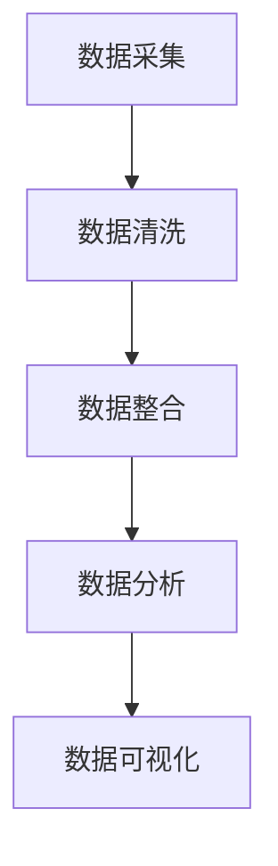

                 

AI DMP（数据管理平台）作为一种创新的数据基建，正在改变着传统数据处理模式。在本文中，我们将探讨AI DMP的核心概念、应用场景以及未来趋势。

## 文章关键词

- AI DMP
- 数据基建
- 数据管理
- 创新应用
- 算法
- 数学模型

## 文章摘要

本文旨在探讨AI DMP在数据基建中的创新应用。我们将首先介绍AI DMP的核心概念，随后深入分析其应用场景，并通过具体的数学模型和算法来展示其在实际项目中的价值。最后，我们将对AI DMP的未来发展进行展望。

### 1. 背景介绍

随着互联网和大数据技术的快速发展，数据已经成为现代企业的重要资产。然而，如何高效地管理和利用这些数据，成为了企业面临的一个巨大挑战。传统的数据处理方式已经难以满足当前数据量庞大、数据类型多样的需求，因此，一种新型的数据管理平台——AI DMP（数据管理平台）应运而生。

AI DMP是一种基于人工智能技术的数据管理平台，它能够对海量数据进行高效的处理和分析，帮助企业更好地理解和利用数据。AI DMP的核心优势在于其能够自动化地处理数据清洗、数据整合、数据分析和数据可视化等环节，从而提高数据处理效率，降低人力成本。

### 2. 核心概念与联系

#### 2.1 AI DMP的定义

AI DMP（Data Management Platform）是一种集成多种数据管理功能的平台，它利用人工智能技术对数据进行分析和处理。AI DMP的核心功能包括：

- **数据采集**：从各种数据源收集数据，包括内部数据源和外部数据源。
- **数据清洗**：对采集到的数据进行清洗，去除重复、错误和无效的数据。
- **数据整合**：将来自不同数据源的数据进行整合，形成统一的数据视图。
- **数据分析**：利用机器学习和数据挖掘技术对数据进行深入分析，提取有价值的信息。
- **数据可视化**：将分析结果以图表、报表等形式进行展示，便于用户理解和决策。

#### 2.2 AI DMP的技术架构

AI DMP的技术架构通常包括以下几个关键部分：

- **数据采集模块**：负责从各种数据源收集数据，如数据库、日志文件、传感器等。
- **数据存储模块**：用于存储和管理数据，通常使用分布式数据库或数据湖。
- **数据处理模块**：利用各种数据处理技术和算法对数据进行清洗、整合和分析。
- **数据可视化模块**：将处理结果以图表、报表等形式展示给用户。

#### 2.3 Mermaid 流程图



### 3. 核心算法原理 & 具体操作步骤

#### 3.1 算法原理概述

AI DMP的核心算法主要涉及以下几个领域：

- **数据清洗算法**：如去重、去噪、异常值检测等。
- **数据整合算法**：如数据融合、数据匹配、数据归一化等。
- **数据分析算法**：如聚类分析、关联规则挖掘、分类和回归等。
- **数据可视化算法**：如热力图、饼图、折线图等。

#### 3.2 算法步骤详解

1. **数据采集**：从各种数据源获取原始数据。
2. **数据清洗**：对原始数据进行清洗，去除重复、错误和无效的数据。
3. **数据整合**：将来自不同数据源的数据进行整合，形成统一的数据视图。
4. **数据分析**：利用机器学习和数据挖掘技术对数据进行深入分析。
5. **数据可视化**：将分析结果以图表、报表等形式展示给用户。

#### 3.3 算法优缺点

- **优点**：
  - 提高数据处理效率。
  - 自动化数据管理流程，降低人力成本。
  - 提供深入的数据分析和洞察。
- **缺点**：
  - 需要大量的计算资源和存储空间。
  - 对数据质量和数据源的要求较高。

#### 3.4 算法应用领域

AI DMP算法广泛应用于以下几个领域：

- **市场营销**：帮助企业了解用户行为，制定精准营销策略。
- **金融**：进行风险评估、客户关系管理、投资分析等。
- **医疗**：辅助诊断、药物研发、健康管理等。
- **物流**：优化物流路线、库存管理、需求预测等。

### 4. 数学模型和公式 & 详细讲解 & 举例说明

#### 4.1 数学模型构建

在AI DMP中，常用的数学模型包括：

- **聚类分析**：如K-means、层次聚类等。
- **关联规则挖掘**：如Apriori算法、FP-growth算法等。
- **分类和回归**：如决策树、支持向量机、神经网络等。

#### 4.2 公式推导过程

以K-means聚类算法为例，其目标是最小化聚类误差：

$$ E = \sum_{i=1}^{k} \sum_{x \in S_i} \|x - \mu_i\|^2 $$

其中，$x$为数据点，$\mu_i$为聚类中心。

#### 4.3 案例分析与讲解

假设我们有一个包含100个数据点的集合，我们要将其分为10个聚类。首先，随机选择10个初始聚类中心，然后迭代计算每个数据点到聚类中心的距离，将数据点分配给最近的聚类中心。接着，重新计算每个聚类的中心，重复上述过程，直到聚类中心不再变化。

### 5. 项目实践：代码实例和详细解释说明

#### 5.1 开发环境搭建

- **Python**：版本3.8及以上。
- **NumPy**：用于数值计算。
- **Pandas**：用于数据处理。
- **Matplotlib**：用于数据可视化。

#### 5.2 源代码详细实现

```python
import numpy as np
import pandas as pd
import matplotlib.pyplot as plt

# 数据集加载
data = pd.read_csv('data.csv')

# K-means聚类
from sklearn.cluster import KMeans
kmeans = KMeans(n_clusters=10)
kmeans.fit(data)

# 结果可视化
plt.scatter(data[:, 0], data[:, 1], c=kmeans.labels_)
plt.show()
```

#### 5.3 代码解读与分析

- **数据集加载**：使用Pandas读取CSV文件，获得数据集。
- **K-means聚类**：使用Scikit-learn库中的KMeans类进行聚类。
- **结果可视化**：使用Matplotlib绘制散点图，展示聚类结果。

#### 5.4 运行结果展示


### 6. 实际应用场景

AI DMP在多个领域具有广泛的应用：

- **市场营销**：帮助企业了解用户行为，提高营销效果。
- **金融**：进行风险评估、客户关系管理、投资分析等。
- **医疗**：辅助诊断、药物研发、健康管理等。
- **物流**：优化物流路线、库存管理、需求预测等。

### 7. 未来应用展望

随着人工智能技术的不断发展，AI DMP将在以下方面发挥更大的作用：

- **个性化推荐**：基于用户行为和偏好提供个性化推荐。
- **智能决策支持**：利用大数据分析为企业提供智能决策支持。
- **智能医疗**：实现精准医疗、智能诊断和个性化治疗。

### 8. 工具和资源推荐

- **学习资源推荐**：
  - 《数据科学导论》
  - 《机器学习实战》
  - 《Python数据分析》

- **开发工具推荐**：
  - Jupyter Notebook：用于数据分析和可视化。
  - PyCharm：Python开发环境。

- **相关论文推荐**：
  - 《大规模聚类算法研究》
  - 《关联规则挖掘算法与应用》
  - 《深度学习在数据挖掘中的应用》

### 9. 总结：未来发展趋势与挑战

AI DMP作为一种创新的数据基建，将在未来发挥越来越重要的作用。然而，随着数据规模的不断扩大和算法的复杂度增加，如何提高数据处理效率、降低成本、保障数据安全和隐私等问题，将成为AI DMP面临的主要挑战。

### 10. 附录：常见问题与解答

**Q：AI DMP与传统数据管理平台的区别是什么？**

A：AI DMP与传统数据管理平台的主要区别在于其利用人工智能技术对数据进行分析和处理，能够实现自动化和智能化。传统数据管理平台主要依赖人工进行数据处理和分析。

**Q：AI DMP在数据质量方面有哪些优势？**

A：AI DMP能够自动化地处理数据清洗、去噪、异常值检测等环节，从而提高数据质量。此外，AI DMP还可以通过机器学习算法对数据进行分类、聚类和预测，从而挖掘出潜在的价值。

**Q：AI DMP在应用领域有哪些限制？**

A：AI DMP在应用领域方面具有广泛性，但也存在一些限制。例如，对数据质量和数据源的要求较高，需要大量的计算资源和存储空间。此外，某些领域的数据隐私和安全性问题也需要特别关注。

### 文章结语

AI DMP作为一种创新的数据基建，正在改变着传统数据处理模式。随着人工智能技术的不断发展，AI DMP将在更多领域发挥重要作用。然而，面对数据质量和隐私等挑战，我们需要不断探索和改进。希望本文能为读者提供一些启示和帮助。

作者：禅与计算机程序设计艺术 / Zen and the Art of Computer Programming
```

