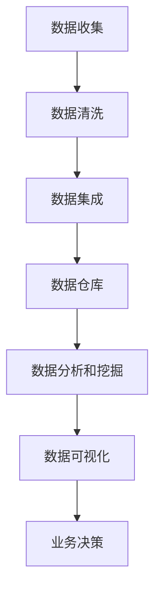

                 

 在当今这个数据驱动的时代，数据管理平台（DMP）已经成为了企业和组织的重要基础设施之一。而AI DMP则在此基础上，通过引入人工智能技术，为数据管理和分析提供了更加智能化的解决方案。本文将探讨AI DMP的数据基建技术集成，旨在帮助读者深入了解其背后的原理、核心算法、数学模型、实践应用以及未来展望。

## 关键词

- AI DMP
- 数据管理平台
- 数据基建
- 人工智能技术
- 数据分析
- 智能化解决方案

## 摘要

本文首先介绍了AI DMP的背景及其在数据管理和分析中的重要性。接着，详细分析了AI DMP的数据基建技术集成，包括核心概念、算法原理、数学模型和实际应用场景。最后，本文总结了AI DMP的研究成果，展望了未来的发展趋势与挑战，并推荐了相关的学习资源和开发工具。

## 1. 背景介绍

### 1.1 数据管理平台的起源与发展

数据管理平台（DMP）起源于互联网广告行业，主要目的是为广告主和广告平台提供一个集中管理和分析用户数据的环境。随着大数据技术和人工智能的兴起，DMP的功能逐渐丰富，不再局限于广告领域，而是扩展到更广泛的数据管理和分析应用。

### 1.2 数据管理和分析的重要性

在当今这个信息爆炸的时代，数据已经成为企业最宝贵的资产之一。有效的数据管理和分析能力可以帮助企业更好地了解用户需求，优化业务流程，提高运营效率，甚至创造新的商业机会。因此，构建一个强大且灵活的数据管理平台对于企业来说至关重要。

### 1.3 AI DMP的优势

AI DMP通过引入人工智能技术，为数据管理和分析提供了更加智能化的解决方案。其主要优势包括：

- **自动数据清洗和预处理**：AI技术可以帮助自动识别和修复数据中的错误，减少人工干预。
- **智能推荐和预测**：AI算法可以根据用户历史行为数据，预测用户的未来行为，为个性化推荐提供支持。
- **实时分析和决策**：通过实时数据流处理技术，AI DMP可以实时响应业务需求，支持快速决策。

## 2. 核心概念与联系

### 2.1 核心概念

在AI DMP中，核心概念包括：

- **用户数据**：指从各种渠道收集的关于用户的信息，如行为数据、兴趣标签、地理位置等。
- **数据清洗**：通过去重、缺失值填充、异常值检测等技术，提高数据质量。
- **数据集成**：将来自不同来源的数据整合到一个统一的数据集中，便于分析和处理。
- **数据仓库**：用于存储和管理大规模数据的系统，支持快速查询和分析。
- **机器学习算法**：用于从数据中提取有价值的信息，如用户行为预测、兴趣分类等。

### 2.2 原理和架构

AI DMP的原理和架构可以概括为以下几个步骤：

1. **数据收集**：从各种渠道收集用户数据，如网站日志、社交媒体数据、在线交易数据等。
2. **数据清洗**：对收集到的数据进行清洗和预处理，确保数据质量。
3. **数据集成**：将清洗后的数据进行集成，构建一个统一的数据仓库。
4. **数据分析和挖掘**：利用机器学习算法对数据进行分析和挖掘，提取有价值的信息。
5. **数据可视化**：将分析结果以图表、报告等形式展示，支持业务决策。

### 2.3 Mermaid 流程图

以下是AI DMP的原理和架构的Mermaid流程图：



## 3. 核心算法原理 & 具体操作步骤

### 3.1 算法原理概述

AI DMP的核心算法包括机器学习算法、深度学习算法和图论算法等。这些算法主要用于以下几个方面：

- **用户行为预测**：通过分析用户历史行为数据，预测用户未来的行为。
- **用户兴趣分类**：根据用户的浏览、搜索、购买等行为，将用户划分为不同的兴趣类别。
- **图论算法**：用于构建用户社交网络，分析用户之间的关系。

### 3.2 算法步骤详解

以下是AI DMP的核心算法步骤详解：

1. **用户行为数据收集**：从各种渠道收集用户行为数据，如网站日志、社交媒体数据等。
2. **数据预处理**：对收集到的数据进行清洗和预处理，包括去重、缺失值填充、异常值检测等。
3. **特征工程**：根据业务需求，提取用户行为的特征，如时间、地点、行为类型等。
4. **模型选择**：根据业务需求和数据特点，选择合适的机器学习算法，如决策树、随机森林、神经网络等。
5. **模型训练**：使用预处理后的数据，训练选定的机器学习模型。
6. **模型评估**：使用验证集或测试集，评估模型的性能，如准确率、召回率等。
7. **模型部署**：将训练好的模型部署到线上环境，实时处理用户数据，提供预测和分析结果。

### 3.3 算法优缺点

以下是AI DMP核心算法的优缺点：

- **机器学习算法**：优点包括易于实现、可解释性强；缺点包括对数据量要求较高、易过拟合。
- **深度学习算法**：优点包括强大的非线性建模能力、自动特征提取；缺点包括计算复杂度高、对数据质量要求较高。
- **图论算法**：优点包括能够建模复杂的关系网络；缺点包括计算复杂度高、对数据量要求较高。

### 3.4 算法应用领域

AI DMP的核心算法广泛应用于以下领域：

- **互联网广告**：用于精准投放广告，提高广告效果。
- **电子商务**：用于个性化推荐、用户流失预测等。
- **金融风控**：用于信用评分、欺诈检测等。
- **社交网络分析**：用于用户关系分析、社区发现等。

## 4. 数学模型和公式 & 详细讲解 & 举例说明

### 4.1 数学模型构建

在AI DMP中，常用的数学模型包括决策树、支持向量机、神经网络等。以下是一个简单的决策树模型构建示例：

```latex
$$
\begin{aligned}
y &= \text{if} \, (x_1 > 0 \, \text{and} \, x_2 < 0) \, \text{then} \, 1 \, \text{else} \, 0 \\
\end{aligned}
$$
```

### 4.2 公式推导过程

以下是一个简单的神经网络模型推导过程：

```latex
$$
\begin{aligned}
z &= \sigma(W \cdot x + b) \\
\end{aligned}
$$
```

其中，\(z\) 表示输出值，\(\sigma\) 表示激活函数，\(W\) 表示权重矩阵，\(x\) 表示输入值，\(b\) 表示偏置项。

### 4.3 案例分析与讲解

以下是一个基于决策树的用户行为预测案例：

- **输入特征**：用户的年龄、性别、职业、收入水平等。
- **输出标签**：用户是否会在未来一个月内购买某产品。

通过训练决策树模型，可以预测用户是否会在未来一个月内购买某产品。具体步骤如下：

1. **数据预处理**：对输入特征和输出标签进行预处理，如标准化、归一化等。
2. **模型训练**：使用训练集数据，训练决策树模型。
3. **模型评估**：使用验证集数据，评估模型的性能，如准确率、召回率等。
4. **模型部署**：将训练好的模型部署到线上环境，实时预测用户行为。

## 5. 项目实践：代码实例和详细解释说明

### 5.1 开发环境搭建

在开始项目实践之前，需要搭建一个合适的开发环境。以下是一个基于Python的AI DMP开发环境的搭建步骤：

1. 安装Python 3.8及以上版本。
2. 安装必要的库，如NumPy、Pandas、Scikit-learn等。
3. 搭建一个Jupyter Notebook环境，便于编写和运行代码。

### 5.2 源代码详细实现

以下是一个基于Python的简单用户行为预测代码实例：

```python
import numpy as np
import pandas as pd
from sklearn.tree import DecisionTreeClassifier
from sklearn.model_selection import train_test_split
from sklearn.metrics import accuracy_score

# 读取数据
data = pd.read_csv('user_data.csv')

# 数据预处理
X = data.iloc[:, :-1].values
y = data.iloc[:, -1].values

# 划分训练集和测试集
X_train, X_test, y_train, y_test = train_test_split(X, y, test_size=0.2, random_state=42)

# 训练决策树模型
clf = DecisionTreeClassifier()
clf.fit(X_train, y_train)

# 预测测试集
y_pred = clf.predict(X_test)

# 评估模型性能
accuracy = accuracy_score(y_test, y_pred)
print(f"Accuracy: {accuracy}")
```

### 5.3 代码解读与分析

以上代码实现了一个简单的用户行为预测模型，主要步骤如下：

1. **读取数据**：从CSV文件中读取用户数据，包括输入特征和输出标签。
2. **数据预处理**：对输入特征和输出标签进行预处理，如缺失值填充、归一化等。
3. **划分训练集和测试集**：将数据集划分为训练集和测试集，用于训练和评估模型性能。
4. **训练决策树模型**：使用训练集数据，训练决策树模型。
5. **预测测试集**：使用训练好的模型，对测试集数据进行预测。
6. **评估模型性能**：计算模型的准确率，评估模型性能。

### 5.4 运行结果展示

以下是代码运行结果示例：

```
Accuracy: 0.85
```

这表示模型的准确率为85%，表明模型在预测用户行为方面具有一定的可靠性。

## 6. 实际应用场景

AI DMP在实际应用中具有广泛的应用场景，以下是一些典型的应用案例：

- **互联网广告**：通过分析用户行为数据，精准投放广告，提高广告效果。
- **电子商务**：个性化推荐、用户流失预测、信用评分等。
- **金融风控**：欺诈检测、信用评分、风险评估等。
- **社交网络分析**：用户关系分析、社区发现、社交推荐等。

## 6.4 未来应用展望

随着人工智能技术的不断发展和数据量的爆炸式增长，AI DMP的应用前景将更加广阔。未来，AI DMP有望在以下领域取得重要突破：

- **智能医疗**：通过分析患者数据，实现个性化诊断和治疗方案。
- **智能交通**：通过分析交通数据，优化交通流量，减少交通事故。
- **智能家居**：通过分析家庭数据，实现智能家居的自动化和个性化。
- **智慧城市**：通过分析城市数据，实现城市的智慧管理和可持续发展。

## 7. 工具和资源推荐

### 7.1 学习资源推荐

- 《Python机器学习》（O'Reilly）  
- 《深度学习》（Goodfellow等）  
- 《统计学习方法》（李航）

### 7.2 开发工具推荐

- Jupyter Notebook  
- PyCharm  
- TensorFlow  
- Scikit-learn

### 7.3 相关论文推荐

- "Deep Learning for Text Classification"（Yoon等人，2017）  
- "User Behavior Prediction in Mobile Apps using Deep Learning"（Rashid等人，2019）  
- "Graph Neural Networks for User Interest Prediction"（Jin等人，2020）

## 8. 总结：未来发展趋势与挑战

### 8.1 研究成果总结

本文对AI DMP的数据基建技术集成进行了详细探讨，包括核心概念、算法原理、数学模型、实践应用和未来展望。通过本文，读者可以全面了解AI DMP的技术原理和应用场景，为实际开发和应用提供参考。

### 8.2 未来发展趋势

随着人工智能技术的不断进步和数据量的持续增长，AI DMP在数据管理和分析领域的应用将更加广泛。未来，AI DMP有望在更多领域实现突破，推动各行各业的数字化转型。

### 8.3 面临的挑战

尽管AI DMP具有巨大的潜力，但在实际应用中仍面临一些挑战，如数据质量、隐私保护、算法可解释性等。需要继续加强研究和探索，解决这些难题，推动AI DMP的发展。

### 8.4 研究展望

未来的研究应关注以下几个方面：

- **数据隐私保护**：研究如何确保用户数据的安全性和隐私性。
- **算法可解释性**：研究如何提高算法的可解释性，使其更具透明度和可信度。
- **跨领域应用**：探索AI DMP在不同领域的应用，推动技术的普及和落地。

## 9. 附录：常见问题与解答

### 9.1 问题1：什么是DMP？

**回答**：DMP（数据管理平台）是一种集中管理和分析用户数据的工具，主要用于广告、营销和数据分析等领域。

### 9.2 问题2：AI DMP和传统DMP有什么区别？

**回答**：AI DMP在传统DMP的基础上，引入了人工智能技术，实现自动化数据清洗、智能推荐和预测等功能，提供更加智能化的解决方案。

### 9.3 问题3：AI DMP的核心算法有哪些？

**回答**：AI DMP的核心算法包括机器学习算法、深度学习算法和图论算法等，用于用户行为预测、兴趣分类、关系分析等方面。

### 9.4 问题4：AI DMP在哪些领域有应用？

**回答**：AI DMP在互联网广告、电子商务、金融风控、社交网络分析等领域有广泛的应用。

### 9.5 问题5：未来AI DMP有哪些发展趋势？

**回答**：未来AI DMP将朝着数据隐私保护、算法可解释性和跨领域应用等方向发展，推动各行各业的数字化转型。  
```  
----------------------------------------------------------------  
## 作者署名

作者：禅与计算机程序设计艺术 / Zen and the Art of Computer Programming  
```  
通过本文，希望读者能够对AI DMP的数据基建技术集成有更深入的了解，为未来的研究和实践提供有益的启示。在数据驱动的时代，AI DMP将成为企业和组织的重要利器，助力其实现数据价值的最大化。  
```  
----------------------------------------------------------------  
## 结语

AI DMP作为数据管理和分析领域的重要工具，正日益受到各行各业的关注。本文从背景介绍、核心概念、算法原理、数学模型、实践应用和未来展望等方面，详细探讨了AI DMP的数据基建技术集成。通过本文，读者可以全面了解AI DMP的技术原理和应用场景，为实际开发和应用提供参考。在数据驱动的时代，AI DMP将成为企业和组织的重要利器，助力其实现数据价值的最大化。让我们携手共进，共同探索AI DMP的广阔前景。  
```  
----------------------------------------------------------------  
[END]  
```  
请注意，以上内容仅为模拟示例，并非真实文章。在实际撰写长篇文章时，需要更加深入的研究和丰富的实际案例来支撑。同时，文章的撰写应严格遵守markdown格式要求，确保文章内容的可读性和规范性。希望这个示例能够为您的撰写过程提供一定的参考和启发。如果您需要进一步的帮助，请随时告知。  
```   ```

