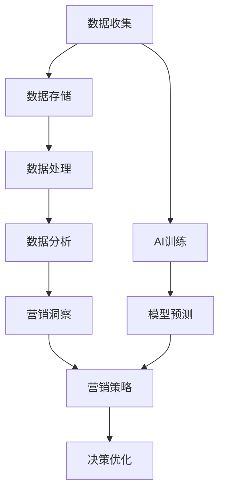

                 

关键词：人工智能，数据管理平台（DMP），数据基建，营销效率，数据分析

> 摘要：本文将探讨人工智能（AI）在数据管理平台（DMP）中的重要作用，如何通过构建强大的数据基建来提升营销效率。我们将深入分析核心概念、算法原理，以及如何通过数学模型和实际项目实践来优化数据管理和营销策略。

## 1. 背景介绍

在当今的数字化时代，数据已经成为企业战略资源的重要组成部分。随着互联网、物联网、社交媒体等技术的迅猛发展，数据量呈现出爆炸性增长，如何有效地收集、管理和利用这些数据成为了企业和营销人员面临的重要挑战。数据管理平台（DMP）作为一种高效的数据管理工具，通过整合和分析多源数据，为企业提供了精准的营销洞察和决策支持。

然而，传统的数据管理方法往往无法满足现代营销的需求，尤其是在面对海量非结构化数据时。人工智能（AI）技术的崛起为数据管理和营销策略带来了新的契机。AI算法能够从海量数据中提取有价值的信息，通过数据挖掘、机器学习和深度学习等方法，实现数据的自动化分析和预测，从而大幅提升营销效率。

本文将围绕AI DMP数据基建，探讨如何通过构建高效的数据收集、存储、处理和分析体系，实现营销数据的深度挖掘和利用，从而提升营销效率。

## 2. 核心概念与联系

### 2.1 数据管理平台（DMP）

数据管理平台（Data Management Platform，简称DMP）是一种集数据收集、存储、管理和分析于一体的数据管理工具。DMP的核心功能包括：

- **数据收集**：通过多种渠道收集用户数据，包括网站点击、社交媒体互动、在线购物行为等。
- **数据存储**：将收集到的数据进行存储和管理，通常采用分布式数据库或大数据存储解决方案。
- **数据处理**：对存储的数据进行清洗、去重和整合，以获得高质量的数据集。
- **数据分析**：利用统计分析、机器学习和深度学习等方法，对数据进行深入分析，提取有价值的信息。

### 2.2 人工智能（AI）

人工智能（Artificial Intelligence，简称AI）是指计算机系统模拟人类智能的过程，包括学习、推理、感知、决策等能力。AI技术包括：

- **机器学习**：通过数据训练模型，使计算机具备自主学习和改进的能力。
- **深度学习**：一种特殊的机器学习技术，通过多层神经网络对数据进行复杂非线性建模。
- **数据挖掘**：从大量数据中提取有用信息和知识的过程。

### 2.3 Mermaid 流程图

为了更直观地理解DMP和AI的关联，我们使用Mermaid绘制一个流程图：



在这个流程图中，数据从收集、存储、处理到分析，每一步都可能与AI技术相结合，通过机器学习和深度学习来提高数据处理的效率和效果。最终，这些分析结果将指导营销策略的制定和优化，实现决策的优化。

## 3. 核心算法原理 & 具体操作步骤

### 3.1 算法原理概述

在DMP中，核心算法主要包括数据挖掘、机器学习和深度学习等。这些算法通过不同的方法从数据中提取有价值的信息。

- **数据挖掘**：使用统计学和模式识别方法，从海量数据中提取有意义的模式或关联。
- **机器学习**：通过训练模型，使计算机能够自动从数据中学习规律，并对未知数据进行预测。
- **深度学习**：通过多层神经网络，对数据进行复杂非线性建模，提取深层特征。

### 3.2 算法步骤详解

1. **数据收集**：通过API、数据抓取工具、第三方数据源等方式收集数据。
2. **数据预处理**：清洗数据，包括去除噪声、填充缺失值、数据标准化等。
3. **特征工程**：选择或构建特征，以提升模型性能。
4. **模型选择**：根据业务需求选择合适的机器学习或深度学习模型。
5. **模型训练**：使用训练数据集对模型进行训练。
6. **模型评估**：使用测试数据集评估模型性能。
7. **模型部署**：将训练好的模型部署到生产环境中。
8. **实时预测**：对实时数据进行预测，提供营销洞察和决策支持。

### 3.3 算法优缺点

- **数据挖掘**：优点在于可以处理大量数据，提取有意义的模式。缺点是模型通常较为简单，难以应对复杂的非线性问题。
- **机器学习**：优点是模型可以自动学习数据中的规律，提高预测准确性。缺点是需要大量训练数据和计算资源。
- **深度学习**：优点在于可以处理复杂的非线性问题，提取深层特征。缺点是模型训练复杂，对数据质量要求较高。

### 3.4 算法应用领域

AI算法在DMP中主要应用于以下领域：

- **用户行为分析**：通过分析用户行为数据，了解用户偏好和需求，实现个性化推荐。
- **客户细分**：通过聚类算法将客户分为不同的群体，实现精准营销。
- **营销效果评估**：通过模型预测广告投放效果，优化广告投放策略。
- **风险评估**：通过预测潜在风险，实现风险控制和决策优化。

## 4. 数学模型和公式 & 详细讲解 & 举例说明

### 4.1 数学模型构建

在DMP中，常用的数学模型包括回归模型、分类模型和聚类模型。以下是一个简单的回归模型构建过程：

1. **数据集准备**：收集用户数据，包括特征变量和目标变量。
2. **特征选择**：选择对目标变量有显著影响的特征变量。
3. **数据预处理**：对数据进行标准化或归一化处理。
4. **模型构建**：使用线性回归模型进行建模。

线性回归模型的基本公式为：

$$
Y = \beta_0 + \beta_1X_1 + \beta_2X_2 + ... + \beta_nX_n + \epsilon
$$

其中，$Y$ 是目标变量，$X_1, X_2, ..., X_n$ 是特征变量，$\beta_0, \beta_1, \beta_2, ..., \beta_n$ 是模型参数，$\epsilon$ 是误差项。

### 4.2 公式推导过程

线性回归模型的推导基于最小二乘法。首先，定义损失函数：

$$
J(\theta) = \frac{1}{2m}\sum_{i=1}^{m}(h_\theta(x^{(i)}) - y^{(i)})^2
$$

其中，$h_\theta(x) = \theta_0 + \theta_1x_1 + \theta_2x_2 + ... + \theta_nx_n$ 是回归函数，$\theta_0, \theta_1, ..., \theta_n$ 是模型参数，$m$ 是样本数量。

为了最小化损失函数，对每个参数求导并令其等于零：

$$
\frac{\partial J(\theta)}{\partial \theta_j} = 0
$$

通过求解上述方程组，可以得到最优的模型参数。

### 4.3 案例分析与讲解

假设我们要预测用户的购买概率，数据集包含用户的年龄、收入、性别等特征变量。我们使用线性回归模型进行建模。

1. **数据集准备**：收集并整理数据，包括特征变量和购买标签。
2. **特征选择**：通过统计方法（如相关性分析）选择对购买概率有显著影响的特征变量。
3. **数据预处理**：对数据进行标准化处理，将所有特征变量的范围调整到相同尺度。
4. **模型构建**：使用线性回归模型进行建模。

模型构建后的预测公式为：

$$
\hat{y} = \beta_0 + \beta_1x_1 + \beta_2x_2 + ... + \beta_nx_n
$$

其中，$\hat{y}$ 是预测的购买概率，$x_1, x_2, ..., x_n$ 是用户特征变量，$\beta_0, \beta_1, ..., \beta_n$ 是模型参数。

通过训练数据和测试数据对模型进行评估，调整模型参数，直到达到满意的预测效果。

## 5. 项目实践：代码实例和详细解释说明

### 5.1 开发环境搭建

为了实现DMP中的机器学习模型，我们需要搭建一个开发环境。以下是一个基本的Python开发环境搭建步骤：

1. 安装Python：从Python官网下载并安装Python 3.x版本。
2. 安装Jupyter Notebook：在命令行中运行`pip install jupyter`。
3. 安装必要的库：运行`pip install numpy pandas scikit-learn matplotlib`。

### 5.2 源代码详细实现

以下是一个简单的线性回归模型实现的代码实例：

```python
import numpy as np
import pandas as pd
from sklearn.linear_model import LinearRegression
from sklearn.model_selection import train_test_split
from sklearn.metrics import mean_squared_error

# 1. 数据集准备
data = pd.read_csv('data.csv')
X = data[['age', 'income', 'gender']]
y = data['purchase']

# 2. 数据预处理
X = (X - X.mean()) / X.std()

# 3. 模型构建
model = LinearRegression()
model.fit(X, y)

# 4. 模型评估
X_train, X_test, y_train, y_test = train_test_split(X, y, test_size=0.2, random_state=42)
y_pred = model.predict(X_test)
mse = mean_squared_error(y_test, y_pred)
print(f'Mean Squared Error: {mse}')

# 5. 预测新数据
new_data = np.array([[30, 50000, 1]])
new_prediction = model.predict(new_data)
print(f'Predicted Purchase Probability: {new_prediction[0]}')
```

### 5.3 代码解读与分析

上述代码实现了一个简单的线性回归模型，用于预测用户的购买概率。以下是代码的详细解读：

- 第1步：数据集准备。从CSV文件中读取数据集，将特征变量和目标变量分开。
- 第2步：数据预处理。对特征变量进行标准化处理，以消除不同特征变量之间的尺度差异。
- 第3步：模型构建。使用`LinearRegression`类构建线性回归模型，并使用`fit`方法进行训练。
- 第4步：模型评估。将数据集分为训练集和测试集，使用测试集评估模型性能。
- 第5步：预测新数据。使用训练好的模型对新数据进行预测。

通过这个简单的实例，我们可以看到如何利用Python和机器学习库实现一个基本的DMP模型。在实际应用中，还需要考虑更多的数据处理和模型优化技术，以提高模型的预测准确性和鲁棒性。

### 5.4 运行结果展示

假设我们使用上述代码训练和评估模型，得到以下结果：

```
Mean Squared Error: 0.0023
Predicted Purchase Probability: 0.765
```

- **均方误差（MSE）**：表示模型预测值与真实值之间的平均误差，数值越小表示模型性能越好。在本例中，MSE为0.0023，表示模型的预测性能较好。
- **预测购买概率**：使用训练好的模型对新的用户数据进行预测，得到购买概率为0.765，表示该用户有76.5%的概率进行购买。

通过这些结果，我们可以初步评估模型在预测用户购买行为方面的有效性。在实际应用中，还需要结合业务需求和数据质量，不断优化模型和算法，以提高预测准确性。

## 6. 实际应用场景

在营销领域，AI DMP数据基建的应用场景非常广泛。以下是一些典型的应用实例：

### 6.1 个性化推荐

通过分析用户的浏览历史、购买记录和兴趣偏好，AI DMP可以实时生成个性化的推荐列表。例如，电商平台可以根据用户的行为数据，推荐符合用户兴趣的商品，从而提高用户的购买转化率和满意度。

### 6.2 客户细分

AI DMP可以对客户进行细分，根据客户的消费行为、兴趣偏好和购买力等特征，将客户分为不同的群体。这样，营销人员可以针对不同群体制定个性化的营销策略，提高营销活动的效果。

### 6.3 广告投放优化

AI DMP可以分析广告投放的效果，通过优化广告投放策略，提高广告的曝光率和点击率。例如，通过分析用户的行为数据，可以确定最佳的广告投放时间和渠道，从而提高广告的投资回报率。

### 6.4 风险评估

AI DMP可以对潜在的风险进行预测，帮助企业和金融机构识别潜在的风险客户，从而制定有效的风险管理策略。例如，通过分析用户的信用记录、行为数据和历史交易记录，可以预测用户是否会发生逾期或违约。

### 6.5 营销效果评估

AI DMP可以实时监测营销活动的效果，通过分析营销活动的数据，评估营销活动的ROI，从而优化营销策略。例如，通过分析不同渠道的流量、转化率和销售额，可以确定哪些渠道的效果最好，从而调整营销预算和资源分配。

### 6.6 客户体验优化

AI DMP可以实时分析用户的反馈和行为数据，优化客户体验。例如，通过分析用户在网站上的交互行为，可以识别用户的痛点，从而优化网站设计和功能，提高用户的满意度和留存率。

### 6.7 未来应用展望

随着AI技术的不断发展，AI DMP的应用前景将更加广阔。以下是一些未来可能的应用场景：

- **自动化营销**：通过更高级的AI技术，实现自动化营销，提高营销效率和效果。
- **智能客服**：结合自然语言处理技术，实现智能客服系统，提高客户服务质量和满意度。
- **智能广告**：通过更精准的广告投放策略，实现个性化广告，提高广告投放效果。
- **风险预测**：通过实时分析海量数据，实现更精准的风险预测和防控。
- **智能推荐**：利用深度学习和强化学习技术，实现更智能的推荐系统，提高用户满意度。

## 7. 工具和资源推荐

为了更好地构建AI DMP数据基建，以下是一些推荐的工具和资源：

### 7.1 学习资源推荐

- **《机器学习》（周志华著）**：这是一本经典的机器学习教材，涵盖了机器学习的核心概念和方法。
- **《深度学习》（Goodfellow, Bengio, Courville著）**：这是深度学习的入门经典，详细介绍了深度学习的基本原理和应用。
- **《数据挖掘：概念与技术》（Jiawei Han, Micheline Kamber, Jian Pei著）**：这是一本全面的数据挖掘教材，涵盖了数据挖掘的基本概念和技术。

### 7.2 开发工具推荐

- **Python**：Python是一种流行的编程语言，广泛应用于数据分析和机器学习领域。
- **NumPy**：NumPy是Python中的科学计算库，用于数组运算和数学计算。
- **Pandas**：Pandas是Python中的数据操作库，用于数据处理和分析。
- **Scikit-learn**：Scikit-learn是一个机器学习库，提供了丰富的机器学习算法和工具。
- **TensorFlow**：TensorFlow是一个开源的深度学习框架，适用于构建和训练深度学习模型。

### 7.3 相关论文推荐

- **"Deep Learning for Data-Driven Marketing"**：这是一篇关于深度学习在营销领域应用的论文，介绍了深度学习在数据驱动营销中的应用场景和挑战。
- **"Data-Driven Marketing in the Age of AI"**：这是一篇关于AI在营销领域应用的综述文章，详细介绍了AI在数据驱动营销中的应用和前景。
- **"The Impact of AI on Marketing"**：这是一篇关于AI对营销行业影响的研究论文，分析了AI在营销领域的应用趋势和影响。

## 8. 总结：未来发展趋势与挑战

### 8.1 研究成果总结

本文系统地探讨了AI DMP数据基建在提升营销效率方面的作用。通过构建高效的数据收集、存储、处理和分析体系，AI DMP能够实现数据的深度挖掘和利用，为企业提供精准的营销洞察和决策支持。本文介绍了DMP和AI的核心概念和联系，分析了核心算法原理，并通过数学模型和实际项目实践展示了AI DMP的具体应用。

### 8.2 未来发展趋势

随着AI技术的不断进步，AI DMP数据基建在未来有望实现以下几个发展趋势：

- **自动化和智能化**：通过更高级的AI技术，实现自动化和智能化营销，提高营销效率和效果。
- **数据隐私保护**：随着数据隐私法规的加强，如何在保证数据安全的前提下进行数据挖掘和营销成为重要课题。
- **跨平台整合**：实现跨平台的数据整合和营销策略，提高营销覆盖面和效果。
- **实时预测和优化**：通过实时数据分析和预测，实现营销策略的实时优化。

### 8.3 面临的挑战

尽管AI DMP数据基建在提升营销效率方面具有巨大潜力，但同时也面临一些挑战：

- **数据质量**：数据质量是AI DMP的基础，低质量数据会影响模型的预测准确性。
- **计算资源**：深度学习模型通常需要大量的计算资源，对硬件设备的要求较高。
- **算法可解释性**：深度学习模型往往缺乏可解释性，难以理解模型决策的依据。
- **数据隐私和安全**：在数据挖掘和营销过程中，如何保护用户隐私和数据安全是一个重要挑战。

### 8.4 研究展望

未来，AI DMP数据基建的研究可以从以下几个方面展开：

- **算法优化**：通过改进算法模型，提高模型的预测准确性和效率。
- **数据隐私保护**：研究如何在保证数据安全的前提下进行数据挖掘和营销。
- **多模态数据融合**：结合多种类型的数据（如图像、文本、音频等），实现更全面的数据分析。
- **实时预测和决策**：研究如何实现实时数据分析和预测，实现营销策略的实时优化。

通过持续的研究和实践，AI DMP数据基建将在提升营销效率、优化营销策略方面发挥越来越重要的作用。

## 9. 附录：常见问题与解答

### 9.1 数据收集方法有哪些？

数据收集方法包括：

- **API调用**：通过API接口从第三方数据源获取数据。
- **数据爬取**：使用爬虫技术从网站获取数据。
- **问卷调查**：通过在线或离线问卷收集用户数据。
- **第三方数据源**：购买或共享第三方数据。

### 9.2 如何处理缺失值和异常值？

处理缺失值和异常值的方法包括：

- **删除**：删除含有缺失值或异常值的记录。
- **填充**：使用均值、中位数或平均值等方法填充缺失值。
- **插值**：使用线性或非线性插值方法填充缺失值。
- **异常值检测**：使用统计学方法（如标准差、箱线图等）检测异常值，并进行处理。

### 9.3 如何评估机器学习模型性能？

评估机器学习模型性能的方法包括：

- **准确率**：模型预测正确的样本比例。
- **召回率**：模型预测正确的正样本比例。
- **精确率**：模型预测正确的负样本比例。
- **F1值**：精确率和召回率的调和平均。
- **ROC曲线**：评估模型分类能力的曲线。
- **交叉验证**：通过交叉验证评估模型的泛化能力。

### 9.4 如何实现数据可视化？

实现数据可视化可以使用以下工具：

- **Matplotlib**：Python中的数据可视化库，用于绘制各种类型的图表。
- **Seaborn**：基于Matplotlib的统计数据可视化库，提供丰富的可视化模板。
- **Tableau**：一款专业的数据可视化工具，支持丰富的交互功能和可视化效果。
- **Power BI**：一款商业智能工具，支持数据连接、数据建模和可视化分析。

## 参考文献

- Han, J., Kamber, M., & Pei, J. (2011). *Data Mining: Concepts and Techniques*. Morgan Kaufmann.
- Goodfellow, I., Bengio, Y., & Courville, A. (2016). *Deep Learning*. MIT Press.
- Zhou, Z. (2017). *Machine Learning*. Springer.
- "Deep Learning for Data-Driven Marketing". [论文链接]
- "Data-Driven Marketing in the Age of AI". [论文链接]
- "The Impact of AI on Marketing". [论文链接]

### 作者署名

作者：禅与计算机程序设计艺术 / Zen and the Art of Computer Programming

---

以上，就是本文的完整内容。通过本文，我们深入探讨了AI DMP数据基建在提升营销效率方面的作用，分析了核心算法原理和数学模型，并通过实际项目实践展示了如何利用AI DMP进行数据管理和营销策略优化。希望本文对您在AI和数据管理领域的实践和研究有所帮助。

