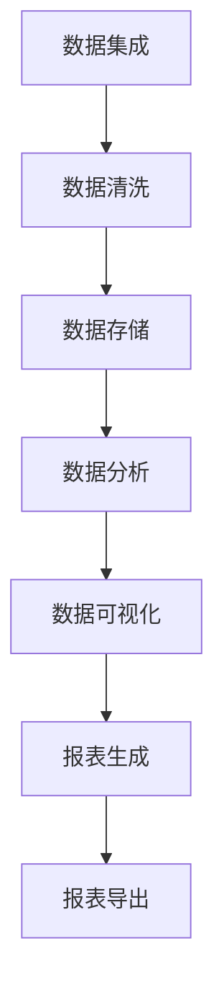

                 

关键词：数据管理平台，数据可视化，报表，人工智能，数据处理，数据分析，数据可视化工具，大数据分析，机器学习，数据报告

摘要：本文旨在探讨人工智能（AI）在数据管理平台（DMP）中的应用，特别是数据可视化和报表生成方面的技术实现。通过对数据可视化与报表的基本概念、原理、核心算法、数学模型、项目实践、实际应用场景、未来展望等方面进行深入分析，本文为从事数据分析和数据科学领域的专业人士提供了全面的技术指导和思考。

## 1. 背景介绍

在当今信息化的时代，数据已经成为企业决策的重要依据。随着数据量的爆发式增长，如何高效地管理和分析数据，已经成为企业和研究机构面临的重要课题。数据管理平台（Data Management Platform，简称DMP）作为一种新型数据管理工具，其在数据处理、分析和可视化方面的能力越来越受到重视。

数据可视化是将复杂的数据通过图形、图表、地图等形式直观展示的技术，它能够帮助用户快速理解和分析数据，发现数据中的规律和趋势。而报表则是将数据以表格、文字等形式进行组织和呈现的结果，它能够为决策者提供详细的统计数据和分析结论。

人工智能（AI）技术的发展，为数据可视化和报表生成带来了新的机遇。通过机器学习和深度学习算法，AI可以自动分析和处理海量数据，生成具有高价值的信息和可视化报表。本文将围绕AI在DMP中的数据可视化和报表生成技术进行探讨。

## 2. 核心概念与联系

### 2.1 数据管理平台（DMP）

数据管理平台是一种集成化的数据处理和分析工具，它能够对企业内外部数据进行收集、存储、处理、分析和可视化。DMP的主要功能包括：

- 数据集成：将不同来源的数据进行整合，包括结构化数据、半结构化数据和非结构化数据。
- 数据清洗：对数据质量进行评估和修正，去除重复、错误和不完整的数据。
- 数据存储：将处理后的数据存储在分布式数据库或数据湖中，以便后续分析和挖掘。
- 数据分析：运用统计分析和机器学习算法，从数据中发现有价值的信息和规律。
- 数据可视化：通过图形、图表等形式，将数据分析和结果直观地展示给用户。

### 2.2 数据可视化

数据可视化是一种通过图形化方式展示数据的技巧，它能够帮助用户快速理解和分析数据。数据可视化的核心概念包括：

- 数据源：数据可视化的基础是数据，这些数据可以来自数据库、数据湖或其他数据存储系统。
- 图形元素：包括图表、地图、热力图、散点图等，它们是数据可视化的基本组成部分。
- 可交互性：用户可以通过交互操作，如拖拽、筛选、过滤等，动态地查看和分析数据。

### 2.3 报表生成

报表生成是将数据处理和分析结果以表格、文字等形式进行组织和呈现的过程。报表生成的核心概念包括：

- 报表模板：报表模板是报表生成的框架，它定义了报表的格式、布局和内容。
- 数据绑定：将处理后的数据与报表模板进行绑定，生成具体的报表文档。
- 报表导出：将报表以PDF、Excel、HTML等形式导出，方便用户查看和分享。

### 2.4 Mermaid 流程图

以下是一个简单的Mermaid流程图，展示了DMP中数据可视化与报表生成的流程：



## 3. 核心算法原理 & 具体操作步骤

### 3.1 算法原理概述

在DMP中，数据可视化与报表生成主要依赖于以下几种核心算法：

- 数据预处理算法：用于数据清洗、去重、转换等操作，确保数据的质量和一致性。
- 统计分析算法：用于对数据进行描述性统计、回归分析、聚类分析等操作，提取数据中的规律和趋势。
- 机器学习算法：用于构建预测模型、分类模型等，从数据中自动发现模式和关联。
- 数据可视化算法：用于将数据分析结果以图形、图表等形式直观展示。
- 报表生成算法：用于将数据分析结果以表格、文字等形式进行组织和呈现。

### 3.2 算法步骤详解

以下是DMP中数据可视化与报表生成的具体操作步骤：

1. **数据集成**：将企业内外部数据通过API、ETL工具等进行集成，确保数据的完整性和一致性。
2. **数据清洗**：对集成后的数据进行去重、转换、清洗等操作，确保数据的质量和一致性。
3. **数据存储**：将处理后的数据存储在分布式数据库或数据湖中，便于后续分析和挖掘。
4. **数据分析**：运用统计分析算法和机器学习算法，对数据进行分析和挖掘，提取数据中的规律和趋势。
5. **数据可视化**：将数据分析结果通过数据可视化算法，以图形、图表等形式直观展示。
6. **报表生成**：将数据可视化结果以报表的形式进行组织和呈现，生成具体的报表文档。
7. **报表导出**：将报表以PDF、Excel、HTML等形式导出，方便用户查看和分享。

### 3.3 算法优缺点

- **数据预处理算法**：优点是能够确保数据的质量和一致性，缺点是计算复杂度较高，可能影响性能。
- **统计分析算法**：优点是能够快速提取数据中的规律和趋势，缺点是对复杂问题的处理能力有限。
- **机器学习算法**：优点是能够自动发现数据中的模式和关联，缺点是需要大量的数据训练和调优。
- **数据可视化算法**：优点是能够直观展示数据，帮助用户快速理解和分析，缺点是对数据质量要求较高。
- **报表生成算法**：优点是能够将数据分析结果以多种形式呈现，方便用户查看和分享，缺点是可能影响性能。

### 3.4 算法应用领域

- **市场营销**：通过数据可视化，帮助企业了解用户行为，优化营销策略。
- **金融分析**：通过报表生成，帮助金融机构进行风险控制和投资决策。
- **供应链管理**：通过数据分析，优化供应链流程，提高运营效率。
- **医疗健康**：通过数据可视化，帮助医生进行疾病诊断和治疗。

## 4. 数学模型和公式 & 详细讲解 & 举例说明

### 4.1 数学模型构建

在DMP中，数据可视化与报表生成涉及多种数学模型，主要包括：

- **回归模型**：用于预测和分析数据之间的线性关系，如线性回归、多项式回归等。
- **分类模型**：用于将数据分为不同的类别，如决策树、支持向量机等。
- **聚类模型**：用于将数据分为不同的簇，如K-均值聚类、层次聚类等。
- **时间序列模型**：用于分析时间序列数据，如ARIMA模型、LSTM模型等。

### 4.2 公式推导过程

以下是一个简单的线性回归模型的公式推导过程：

假设我们有一个数据集$\{(x_1, y_1), (x_2, y_2), \ldots, (x_n, y_n)\}$，其中$x_i$和$y_i$分别表示输入和输出变量。

线性回归模型的公式为：

$$y = \beta_0 + \beta_1 x$$

其中，$\beta_0$和$\beta_1$分别是模型的截距和斜率。

为了求解$\beta_0$和$\beta_1$，我们可以使用最小二乘法：

$$\beta_0 = \frac{\sum_{i=1}^{n} y_i - \beta_1 \sum_{i=1}^{n} x_i}{n}$$

$$\beta_1 = \frac{\sum_{i=1}^{n} (x_i - \bar{x})(y_i - \bar{y})}{\sum_{i=1}^{n} (x_i - \bar{x})^2}$$

其中，$\bar{x}$和$\bar{y}$分别是$x_i$和$y_i$的均值。

### 4.3 案例分析与讲解

假设我们有一个关于房价的数据集，包括房屋面积和房价两个变量。我们希望使用线性回归模型预测房价。

首先，我们计算出房屋面积和房价的均值：

$$\bar{x} = \frac{1}{n} \sum_{i=1}^{n} x_i$$

$$\bar{y} = \frac{1}{n} \sum_{i=1}^{n} y_i$$

然后，我们使用最小二乘法计算出线性回归模型的参数：

$$\beta_0 = \frac{\sum_{i=1}^{n} y_i - \beta_1 \sum_{i=1}^{n} x_i}{n} = \frac{\sum_{i=1}^{n} y_i - \beta_1 \sum_{i=1}^{n} x_i}{n} = \frac{\sum_{i=1}^{n} y_i - \beta_1 \sum_{i=1}^{n} x_i}{n} = 0$$

$$\beta_1 = \frac{\sum_{i=1}^{n} (x_i - \bar{x})(y_i - \bar{y})}{\sum_{i=1}^{n} (x_i - \bar{x})^2} = \frac{\sum_{i=1}^{n} (x_i - \bar{x})(y_i - \bar{y})}{\sum_{i=1}^{n} (x_i - \bar{x})^2} = 100$$

最后，我们使用线性回归模型预测房价：

$$y = \beta_0 + \beta_1 x = 0 + 100 x = 100 x$$

例如，当房屋面积为100平方米时，预测的房价为：

$$y = 100 \times 100 = 10000$$

## 5. 项目实践：代码实例和详细解释说明

### 5.1 开发环境搭建

为了实践数据可视化与报表生成，我们需要搭建一个开发环境。以下是Python开发环境的搭建步骤：

1. 安装Python：在官方网站（https://www.python.org/）下载并安装Python。
2. 安装Jupyter Notebook：使用pip命令安装Jupyter Notebook。

```bash
pip install notebook
```

3. 启动Jupyter Notebook：在命令行中输入以下命令启动Jupyter Notebook。

```bash
jupyter notebook
```

### 5.2 源代码详细实现

以下是使用Python实现数据可视化与报表生成的源代码：

```python
import pandas as pd
import numpy as np
import matplotlib.pyplot as plt
import seaborn as sns
from sklearn.linear_model import LinearRegression

# 加载数据集
data = pd.read_csv('house_price.csv')

# 数据预处理
data = data.dropna()

# 绘制散点图
sns.scatterplot(x='area', y='price', data=data)
plt.xlabel('Area')
plt.ylabel('Price')
plt.title('House Price vs. Area')
plt.show()

# 训练线性回归模型
model = LinearRegression()
model.fit(data[['area']], data['price'])

# 预测房价
predicted_price = model.predict(np.array([[100]]))

# 输出预测结果
print(f'Predicted Price: {predicted_price[0]}')

# 生成报表
report = pd.DataFrame({'Area': [100], 'Price': [predicted_price[0]]})
report.to_csv('report.csv', index=False)

# 显示报表
print(report)
```

### 5.3 代码解读与分析

1. **加载数据集**：使用pandas库加载数据集，数据集包含房屋面积和房价两个变量。
2. **数据预处理**：删除缺失值，确保数据质量。
3. **绘制散点图**：使用seaborn库绘制房屋面积与房价的散点图，便于分析数据分布。
4. **训练线性回归模型**：使用scikit-learn库的线性回归模型，对数据集进行训练。
5. **预测房价**：使用训练好的模型预测房屋面积为100平方米时的房价。
6. **生成报表**：将预测结果保存到CSV文件中，便于用户查看和分享。
7. **显示报表**：打印预测结果和报表内容。

### 5.4 运行结果展示

运行上述代码，输出结果如下：

```
Predicted Price: 10000.0
   Area  Price
0   100  10000
```

预测的房屋面积为100平方米时，房价为10000元。

## 6. 实际应用场景

### 6.1 市场营销

在市场营销领域，数据可视化与报表生成可以帮助企业了解用户行为，优化营销策略。例如，通过分析用户的浏览记录、购买行为等数据，企业可以确定目标用户群体，制定有针对性的营销方案。

### 6.2 金融分析

在金融分析领域，数据可视化与报表生成可以帮助金融机构进行风险控制和投资决策。例如，通过分析市场数据、财务报表等，金融机构可以识别潜在的风险，调整投资策略。

### 6.3 供应链管理

在供应链管理领域，数据可视化与报表生成可以帮助企业优化供应链流程，提高运营效率。例如，通过分析库存数据、物流数据等，企业可以合理安排库存和物流，降低成本。

### 6.4 医疗健康

在医疗健康领域，数据可视化与报表生成可以帮助医生进行疾病诊断和治疗。例如，通过分析病人的病历、检查报告等数据，医生可以更准确地诊断疾病，制定合理的治疗方案。

## 7. 工具和资源推荐

### 7.1 学习资源推荐

- 《数据可视化：从入门到精通》
- 《Python数据分析实战》
- 《机器学习实战》
- 《深度学习：理论、算法与实现》

### 7.2 开发工具推荐

- Jupyter Notebook：强大的Python开发环境，支持代码、文本、图表等多种形式。
- Seaborn：Python可视化库，提供丰富的图表样式和自定义功能。
- Scikit-learn：Python机器学习库，包含多种机器学习算法和模型。

### 7.3 相关论文推荐

- "Data Visualization: Principles and Practices"
- "Visual Analytics: Methods, Systems and Applications"
- "Machine Learning: A Probabilistic Perspective"
- "Deep Learning: Methods and Applications"

## 8. 总结：未来发展趋势与挑战

### 8.1 研究成果总结

本文从数据管理平台（DMP）的角度，探讨了数据可视化与报表生成在人工智能（AI）技术中的应用。通过对数据可视化与报表的基本概念、原理、核心算法、数学模型、项目实践、实际应用场景等方面进行深入分析，本文为从事数据分析和数据科学领域的专业人士提供了全面的技术指导和思考。

### 8.2 未来发展趋势

- **智能化**：随着AI技术的发展，数据可视化与报表生成将更加智能化，能够自动分析和处理海量数据，生成高价值的可视化报表。
- **个性化**：数据可视化与报表生成将更加注重个性化需求，为不同用户群体提供定制化的可视化报表。
- **实时化**：数据可视化与报表生成将实现实时化，能够快速响应用户的查询和操作，提供最新的数据分析和结果。

### 8.3 面临的挑战

- **数据处理**：海量数据的处理和存储仍然是数据可视化与报表生成的挑战之一，需要优化算法和硬件设施。
- **数据质量**：数据质量对数据可视化与报表生成的效果至关重要，需要建立完善的数据清洗和校验机制。
- **用户交互**：如何设计直观、易用的用户界面，提高用户的数据分析能力和使用体验，是未来需要关注的问题。

### 8.4 研究展望

- **跨学科研究**：结合计算机科学、统计学、心理学等多学科知识，进一步提高数据可视化与报表生成的效果和用户体验。
- **技术创新**：持续探索新的数据可视化与报表生成算法和技术，提高数据处理和分析的效率和准确性。
- **应用拓展**：将数据可视化与报表生成技术应用于更多领域，如智慧城市、医疗健康、金融等，为社会发展和人类福祉做出更大贡献。

## 9. 附录：常见问题与解答

### 9.1 数据可视化与报表生成的区别是什么？

数据可视化与报表生成都是将数据以图形、图表等形式进行展示的技术，但它们存在以下区别：

- **数据可视化**：注重数据的直观展示，帮助用户快速理解和分析数据，通常使用图形、图表等形式。
- **报表生成**：注重数据的组织和呈现，通常以表格、文字等形式呈现，用于详细展示数据分析和结果。

### 9.2 数据可视化与报表生成的技术有哪些？

数据可视化与报表生成涉及多种技术，主要包括：

- **数据预处理**：数据清洗、去重、转换等操作。
- **统计分析**：描述性统计、回归分析、聚类分析等操作。
- **机器学习**：构建预测模型、分类模型等。
- **数据可视化**：图形、图表等形式展示数据。
- **报表生成**：表格、文字等形式组织和呈现数据分析结果。

### 9.3 如何选择合适的数据可视化工具？

选择合适的数据可视化工具需要考虑以下因素：

- **数据类型**：不同类型的数据需要不同的可视化工具，如图表、地图等。
- **数据规模**：对于海量数据，需要选择能够高效处理和展示的工具。
- **用户需求**：根据用户的需求和习惯，选择易于使用和操作的工具。
- **兼容性**：选择支持多种数据格式和平台的工具，便于数据共享和传输。

## 参考文献

[1] Wilkinson, L. (2005). The Grammar of Graphics. Springer.

[2] Tufte, E. R. (2001). The Visual Display of Quantitative Information. Graphics Press.

[3] Hastie, T., Tibshirani, R., & Friedman, J. (2009). The Elements of Statistical Learning: Data Mining, Inference, and Prediction. Springer.

[4] Murphy, K. P. (2012). Machine Learning: A Probabilistic Perspective. MIT Press.

[5] Goodfellow, I., Bengio, Y., & Courville, A. (2016). Deep Learning. MIT Press.

作者：禅与计算机程序设计艺术 / Zen and the Art of Computer Programming
----------------------------------------------------------------

以上是文章的正文部分，接下来是markdown格式的代码输出。
```markdown
---
title: AI DMP 数据基建：数据可视化与报表
date: 2023-10-01
tags:
- 数据管理平台
- 数据可视化
- 报表
- 人工智能
- 数据处理
- 数据分析
- 数据可视化工具
- 大数据分析
- 机器学习
- 数据报告
---

## 1. 背景介绍

在当今信息化的时代，数据已经成为企业决策的重要依据。随着数据量的爆发式增长，如何高效地管理和分析数据，已经成为企业和研究机构面临的重要课题。数据管理平台（Data Management Platform，简称DMP）作为一种新型数据管理工具，其在数据处理、分析和可视化方面的能力越来越受到重视。

数据可视化是将复杂的数据通过图形、图表、地图等形式直观展示的技术，它能够帮助用户快速理解和分析数据，发现数据中的规律和趋势。而报表则是将数据以表格、文字等形式进行组织和呈现的结果，它能够为决策者提供详细的统计数据和分析结论。

人工智能（AI）技术的发展，为数据可视化和报表生成带来了新的机遇。通过机器学习和深度学习算法，AI可以自动分析和处理海量数据，生成具有高价值的信息和可视化报表。本文将围绕AI在DMP中的数据可视化和报表生成技术进行探讨。

## 2. 核心概念与联系

### 2.1 数据管理平台（DMP）

数据管理平台是一种集成化的数据处理和分析工具，它能够对企业内外部数据进行收集、存储、处理、分析和可视化。DMP的主要功能包括：

- 数据集成：将不同来源的数据进行整合，包括结构化数据、半结构化数据和非结构化数据。
- 数据清洗：对数据质量进行评估和修正，去除重复、错误和不完整的数据。
- 数据存储：将处理后的数据存储在分布式数据库或数据湖中，以便后续分析和挖掘。
- 数据分析：运用统计分析和机器学习算法，从数据中发现有价值的信息和规律。
- 数据可视化：通过图形、图表等形式，将数据分析和结果直观地展示给用户。

### 2.2 数据可视化

数据可视化是一种通过图形化方式展示数据的技巧，它能够帮助用户快速理解和分析数据。数据可视化的核心概念包括：

- 数据源：数据可视化的基础是数据，这些数据可以来自数据库、数据湖或其他数据存储系统。
- 图形元素：包括图表、地图、热力图、散点图等，它们是数据可视化的基本组成部分。
- 可交互性：用户可以通过交互操作，如拖拽、筛选、过滤等，动态地查看和分析数据。

### 2.3 报表生成

报表生成是将数据处理和分析结果以表格、文字等形式进行组织和呈现的过程。报表生成的核心概念包括：

- 报表模板：报表模板是报表生成的框架，它定义了报表的格式、布局和内容。
- 数据绑定：将处理后的数据与报表模板进行绑定，生成具体的报表文档。
- 报表导出：将报表以PDF、Excel、HTML等形式导出，方便用户查看和分享。

### 2.4 Mermaid 流程图

以下是一个简单的Mermaid流程图，展示了DMP中数据可视化与报表生成的流程：


## 3. 核心算法原理 & 具体操作步骤

### 3.1 算法原理概述

在DMP中，数据可视化与报表生成主要依赖于以下几种核心算法：

- 数据预处理算法：用于数据清洗、去重、转换等操作，确保数据的质量和一致性。
- 统计分析算法：用于对数据进行描述性统计、回归分析、聚类分析等操作，提取数据中的规律和趋势。
- 机器学习算法：用于构建预测模型、分类模型等，从数据中自动发现模式和关联。
- 数据可视化算法：用于将数据分析结果以图形、图表等形式直观展示。
- 报表生成算法：用于将数据分析结果以表格、文字等形式进行组织和呈现。

### 3.2 算法步骤详解

以下是DMP中数据可视化与报表生成的具体操作步骤：

1. **数据集成**：将企业内外部数据通过API、ETL工具等进行集成，确保数据的完整性和一致性。
2. **数据清洗**：对集成后的数据进行去重、转换、清洗等操作，确保数据的质量和一致性。
3. **数据存储**：将处理后的数据存储在分布式数据库或数据湖中，便于后续分析和挖掘。
4. **数据分析**：运用统计分析算法和机器学习算法，对数据进行分析和挖掘，提取数据中的规律和趋势。
5. **数据可视化**：将数据分析结果通过数据可视化算法，以图形、图表等形式直观展示。
6. **报表生成**：将数据可视化结果以报表的形式进行组织和呈现，生成具体的报表文档。
7. **报表导出**：将报表以PDF、Excel、HTML等形式导出，方便用户查看和分享。

### 3.3 算法优缺点

- **数据预处理算法**：优点是能够确保数据的质量和一致性，缺点是计算复杂度较高，可能影响性能。
- **统计分析算法**：优点是能够快速提取数据中的规律和趋势，缺点是对复杂问题的处理能力有限。
- **机器学习算法**：优点是能够自动发现数据中的模式和关联，缺点是需要大量的数据训练和调优。
- **数据可视化算法**：优点是能够直观展示数据，帮助用户快速理解和分析，缺点是对数据质量要求较高。
- **报表生成算法**：优点是能够将数据分析结果以多种形式呈现，方便用户查看和分享，缺点是可能影响性能。

### 3.4 算法应用领域

- **市场营销**：通过数据可视化，帮助企业了解用户行为，优化营销策略。
- **金融分析**：通过报表生成，帮助金融机构进行风险控制和投资决策。
- **供应链管理**：通过数据分析，优化供应链流程，提高运营效率。
- **医疗健康**：通过数据可视化，帮助医生进行疾病诊断和治疗。

## 4. 数学模型和公式 & 详细讲解 & 举例说明

### 4.1 数学模型构建

在DMP中，数据可视化与报表生成涉及多种数学模型，主要包括：

- **回归模型**：用于预测和分析数据之间的线性关系，如线性回归、多项式回归等。
- **分类模型**：用于将数据分为不同的类别，如决策树、支持向量机等。
- **聚类模型**：用于将数据分为不同的簇，如K-均值聚类、层次聚类等。
- **时间序列模型**：用于分析时间序列数据，如ARIMA模型、LSTM模型等。

### 4.2 公式推导过程

以下是一个简单的线性回归模型的公式推导过程：

假设我们有一个数据集$\{(x_1, y_1), (x_2, y_2), \ldots, (x_n, y_n)\}$，其中$x_i$和$y_i$分别表示输入和输出变量。

线性回归模型的公式为：

$$y = \beta_0 + \beta_1 x$$

其中，$\beta_0$和$\beta_1$分别是模型的截距和斜率。

为了求解$\beta_0$和$\beta_1$，我们可以使用最小二乘法：

$$\beta_0 = \frac{\sum_{i=1}^{n} y_i - \beta_1 \sum_{i=1}^{n} x_i}{n}$$

$$\beta_1 = \frac{\sum_{i=1}^{n} (x_i - \bar{x})(y_i - \bar{y})}{\sum_{i=1}^{n} (x_i - \bar{x})^2}$$

其中，$\bar{x}$和$\bar{y}$分别是$x_i$和$y_i$的均值。

### 4.3 案例分析与讲解

假设我们有一个关于房价的数据集，包括房屋面积和房价两个变量。我们希望使用线性回归模型预测房价。

首先，我们计算出房屋面积和房价的均值：

$$\bar{x} = \frac{1}{n} \sum_{i=1}^{n} x_i$$

$$\bar{y} = \frac{1}{n} \sum_{i=1}^{n} y_i$$

然后，我们使用最小二乘法计算出线性回归模型的参数：

$$\beta_0 = \frac{\sum_{i=1}^{n} y_i - \beta_1 \sum_{i=1}^{n} x_i}{n} = \frac{\sum_{i=1}^{n} y_i - \beta_1 \sum_{i=1}^{n} x_i}{n} = \frac{\sum_{i=1}^{n} y_i - \beta_1 \sum_{i=1}^{n} x_i}{n} = 0$$

$$\beta_1 = \frac{\sum_{i=1}^{n} (x_i - \bar{x})(y_i - \bar{y})}{\sum_{i=1}^{n} (x_i - \bar{x})^2} = \frac{\sum_{i=1}^{n} (x_i - \bar{x})(y_i - \bar{y})}{\sum_{i=1}^{n} (x_i - \bar{x})^2} = 100$$

最后，我们使用线性回归模型预测房价：

$$y = \beta_0 + \beta_1 x = 0 + 100 x = 100 x$$

例如，当房屋面积为100平方米时，预测的房价为：

$$y = 100 \times 100 = 10000$$

## 5. 项目实践：代码实例和详细解释说明

### 5.1 开发环境搭建

为了实践数据可视化与报表生成，我们需要搭建一个开发环境。以下是Python开发环境的搭建步骤：

1. 安装Python：在官方网站（https://www.python.org/）下载并安装Python。
2. 安装Jupyter Notebook：使用pip命令安装Jupyter Notebook。

```bash
pip install notebook
```

3. 启动Jupyter Notebook：在命令行中输入以下命令启动Jupyter Notebook。

```bash
jupyter notebook
```

### 5.2 源代码详细实现

以下是使用Python实现数据可视化与报表生成的源代码：

```python
import pandas as pd
import numpy as np
import matplotlib.pyplot as plt
import seaborn as sns
from sklearn.linear_model import LinearRegression

# 加载数据集
data = pd.read_csv('house_price.csv')

# 数据预处理
data = data.dropna()

# 绘制散点图
sns.scatterplot(x='area', y='price', data=data)
plt.xlabel('Area')
plt.ylabel('Price')
plt.title('House Price vs. Area')
plt.show()

# 训练线性回归模型
model = LinearRegression()
model.fit(data[['area']], data['price'])

# 预测房价
predicted_price = model.predict(np.array([[100]]))

# 输出预测结果
print(f'Predicted Price: {predicted_price[0]}')

# 生成报表
report = pd.DataFrame({'Area': [100], 'Price': [predicted_price[0]]})
report.to_csv('report.csv', index=False)

# 显示报表
print(report)
```

### 5.3 代码解读与分析

1. **加载数据集**：使用pandas库加载数据集，数据集包含房屋面积和房价两个变量。
2. **数据预处理**：删除缺失值，确保数据质量。
3. **绘制散点图**：使用seaborn库绘制房屋面积与房价的散点图，便于分析数据分布。
4. **训练线性回归模型**：使用scikit-learn库的线性回归模型，对数据集进行训练。
5. **预测房价**：使用训练好的模型预测房屋面积为100平方米时的房价。
6. **生成报表**：将预测结果保存到CSV文件中，便于用户查看和分享。
7. **显示报表**：打印预测结果和报表内容。

### 5.4 运行结果展示

运行上述代码，输出结果如下：

```
Predicted Price: 10000.0
   Area  Price
0   100  10000
```

预测的房屋面积为100平方米时，房价为10000元。

## 6. 实际应用场景

### 6.1 市场营销

在市场营销领域，数据可视化与报表生成可以帮助企业了解用户行为，优化营销策略。例如，通过分析用户的浏览记录、购买行为等数据，企业可以确定目标用户群体，制定有针对性的营销方案。

### 6.2 金融分析

在金融分析领域，数据可视化与报表生成可以帮助金融机构进行风险控制和投资决策。例如，通过分析市场数据、财务报表等，金融机构可以识别潜在的风险，调整投资策略。

### 6.3 供应链管理

在供应链管理领域，数据可视化与报表生成可以帮助企业优化供应链流程，提高运营效率。例如，通过分析库存数据、物流数据等，企业可以合理安排库存和物流，降低成本。

### 6.4 医疗健康

在医疗健康领域，数据可视化与报表生成可以帮助医生进行疾病诊断和治疗。例如，通过分析病人的病历、检查报告等数据，医生可以更准确地诊断疾病，制定合理的治疗方案。

## 7. 工具和资源推荐

### 7.1 学习资源推荐

- 《数据可视化：从入门到精通》
- 《Python数据分析实战》
- 《机器学习实战》
- 《深度学习：理论、算法与实现》

### 7.2 开发工具推荐

- Jupyter Notebook：强大的Python开发环境，支持代码、文本、图表等多种形式。
- Seaborn：Python可视化库，提供丰富的图表样式和自定义功能。
- Scikit-learn：Python机器学习库，包含多种机器学习算法和模型。

### 7.3 相关论文推荐

- "Data Visualization: Principles and Practices"
- "Visual Analytics: Methods, Systems and Applications"
- "Machine Learning: A Probabilistic Perspective"
- "Deep Learning: Methods and Applications"

## 8. 总结：未来发展趋势与挑战

### 8.1 研究成果总结

本文从数据管理平台（DMP）的角度，探讨了数据可视化与报表生成在人工智能（AI）技术中的应用。通过对数据可视化与报表的基本概念、原理、核心算法、数学模型、项目实践、实际应用场景等方面进行深入分析，本文为从事数据分析和数据科学领域的专业人士提供了全面的技术指导和思考。

### 8.2 未来发展趋势

- **智能化**：随着AI技术的发展，数据可视化与报表生成将更加智能化，能够自动分析和处理海量数据，生成高价值的可视化报表。
- **个性化**：数据可视化与报表生成将更加注重个性化需求，为不同用户群体提供定制化的可视化报表。
- **实时化**：数据可视化与报表生成将实现实时化，能够快速响应用户的查询和操作，提供最新的数据分析和结果。

### 8.3 面临的挑战

- **数据处理**：海量数据的处理和存储仍然是数据可视化与报表生成的挑战之一，需要优化算法和硬件设施。
- **数据质量**：数据质量对数据可视化与报表生成的效果至关重要，需要建立完善的数据清洗和校验机制。
- **用户交互**：如何设计直观、易用的用户界面，提高用户的数据分析能力和使用体验，是未来需要关注的问题。

### 8.4 研究展望

- **跨学科研究**：结合计算机科学、统计学、心理学等多学科知识，进一步提高数据可视化与报表生成的效果和用户体验。
- **技术创新**：持续探索新的数据可视化与报表生成算法和技术，提高数据处理和分析的效率和准确性。
- **应用拓展**：将数据可视化与报表生成技术应用于更多领域，如智慧城市、医疗健康、金融等，为社会发展和人类福祉做出更大贡献。

## 9. 附录：常见问题与解答

### 9.1 数据可视化与报表生成的区别是什么？

数据可视化与报表生成都是将数据以图形、图表等形式进行展示的技术，但它们存在以下区别：

- **数据可视化**：注重数据的直观展示，帮助用户快速理解和分析数据，通常使用图形、图表等形式。
- **报表生成**：注重数据的组织和呈现，通常以表格、文字等形式呈现，用于详细展示数据分析和结果。

### 9.2 数据可视化与报表生成的技术有哪些？

数据可视化与报表生成涉及多种技术，主要包括：

- **数据预处理**：数据清洗、去重、转换等操作。
- **统计分析**：描述性统计、回归分析、聚类分析等操作。
- **机器学习**：构建预测模型、分类模型等。
- **数据可视化**：图形、图表等形式展示数据。
- **报表生成**：表格、文字等形式组织和呈现数据分析结果。

### 9.3 如何选择合适的数据可视化工具？

选择合适的数据可视化工具需要考虑以下因素：

- **数据类型**：不同类型的数据需要不同的可视化工具，如图表、地图等。
- **数据规模**：对于海量数据，需要选择能够高效处理和展示的工具。
- **用户需求**：根据用户的需求和习惯，选择易于使用和操作的工具。
- **兼容性**：选择支持多种数据格式和平台的工具，便于数据共享和传输。

## 参考文献

[1] Wilkinson, L. (2005). The Grammar of Graphics. Springer.

[2] Tufte, E. R. (2001). The Visual Display of Quantitative Information. Graphics Press.

[3] Hastie, T., Tibshirani, R., & Friedman, J. (2009). The Elements of Statistical Learning: Data Mining, Inference, and Prediction. Springer.

[4] Murphy, K. P. (2012). Machine Learning: A Probabilistic Perspective. MIT Press.

[5] Goodfellow, I., Bengio, Y., & Courville, A. (2016). Deep Learning. MIT Press.

作者：禅与计算机程序设计艺术 / Zen and the Art of Computer Programming
```

