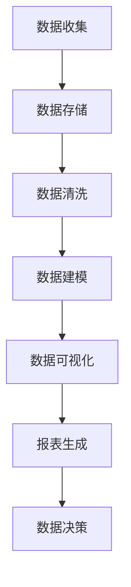

                 

 在当今的数字化时代，数据是企业最为宝贵的资产之一。有效地管理和利用数据，不仅可以提升企业的运营效率，还能为企业带来竞争优势。数据管理平台（DMP）作为一种先进的数据管理工具，正日益成为企业数据基础设施的重要组成部分。本文将围绕AI DMP的数据基建，特别是数据可视化和报表功能，展开深入探讨。

> 关键词：数据管理平台（DMP）、数据可视化、报表、人工智能、数据基础设施

> 摘要：本文首先介绍了DMP的基本概念和功能，然后详细阐述了数据可视化和报表在DMP中的重要性。接着，通过核心概念原理和架构的Mermaid流程图，阐述了数据可视化和报表的实现原理。之后，本文深入探讨了数据可视化和报表的核心算法原理、数学模型、项目实践以及实际应用场景。最后，文章展望了数据可视化与报表的未来发展趋势与挑战，并推荐了相关的学习资源和开发工具。

## 1. 背景介绍

数据管理平台（Data Management Platform，简称DMP）是一种集中管理数据并为企业提供数据分析和决策支持的工具。DMP不仅可以收集和分析各种结构化和非结构化数据，还可以通过人工智能和机器学习技术对数据进行处理和挖掘，从而为企业的营销、运营、产品开发等提供有力的支持。

### 数据可视化的定义和作用

数据可视化是一种将复杂的数据通过图形、图表、图像等形式进行呈现的技术。它不仅可以帮助用户直观地理解数据，还能够发现数据中的隐藏模式、趋势和关联性。在DMP中，数据可视化发挥着至关重要的作用，主要体现在以下几个方面：

- **提高数据理解和分析效率**：通过可视化，用户可以快速地获取数据的全局和局部信息，从而提高数据分析的效率。
- **增强数据的可读性**：复杂的数据通过图表和图像的呈现，变得更加易懂，使得业务人员可以更容易地理解和应用。
- **促进数据决策**：可视化结果可以帮助企业决策者快速做出基于数据的决策，从而提升企业的运营效率。

### 报表在DMP中的重要性

报表是DMP中另一项重要的功能。报表通过对数据的汇总、分析和展示，为企业提供了详尽的数据报告。报表的重要性主要体现在以下几个方面：

- **数据监控和审计**：报表可以帮助企业实时监控关键业务指标，并进行审计，确保数据的一致性和准确性。
- **战略规划和决策支持**：通过报表，企业可以深入了解业务运行状况，为战略规划和决策提供有力支持。
- **报告和演示**：报表可以用于内部报告和外部演示，帮助企业向各方展示业务成果。

## 2. 核心概念与联系

为了深入理解数据可视化和报表在DMP中的应用，我们首先需要了解一些核心概念和它们之间的联系。以下是一个Mermaid流程图，展示了数据可视化和报表相关的核心概念及其相互关系。



### 数据收集

数据收集是DMP的第一步，它涉及从各种数据源（如网站、应用程序、传感器等）收集数据。这些数据可以是结构化的（如数据库中的表格）或非结构化的（如图像、视频、文本等）。

### 数据存储

收集到的数据需要存储在DMP中。数据存储通常使用数据库或数据仓库，以便高效地管理和检索数据。

### 数据清洗

数据清洗是确保数据质量的过程。它包括去除重复数据、处理缺失值、标准化数据等，以确保数据的准确性和一致性。

### 数据建模

数据建模是将数据转换成有用信息的过程。通过数据建模，可以创建数据集、维度和指标，为数据可视化和报表提供数据基础。

### 数据可视化

数据可视化是将数据以图形、图表等形式呈现的过程。它可以帮助用户直观地理解数据，发现数据中的趋势和关联性。

### 报表生成

报表生成是通过数据可视化的结果生成详细的报告。报表可以包含各种图表、指标和统计数据，帮助企业进行监控、分析和决策。

### 数据决策

最终，数据可视化与报表生成帮助决策者做出基于数据的决策，从而提升企业的运营效率和竞争力。

## 3. 核心算法原理 & 具体操作步骤

### 3.1 算法原理概述

数据可视化和报表生成的核心算法主要涉及数据分析和数据呈现技术。以下是几种常见的数据可视化算法：

- **数据聚合**：通过将大量数据聚合为更小的数据集，简化数据处理的复杂度。
- **维度选择**：根据业务需求选择相关的维度，减少冗余数据，提高可视化效果。
- **数据变换**：通过变换数据的形式，使其更适合可视化，如将时间序列数据转换为折线图、散点图等。
- **交互式可视化**：通过用户交互，动态地更新和展示数据，增强用户的数据探索能力。

### 3.2 算法步骤详解

以下是实现数据可视化和报表生成的基本步骤：

1. **数据收集**：从各种数据源收集数据。
2. **数据清洗**：去除重复数据、处理缺失值、标准化数据等。
3. **数据建模**：创建数据集、维度和指标，为数据可视化和报表提供数据基础。
4. **数据聚合**：将大量数据聚合为更小的数据集。
5. **维度选择**：根据业务需求选择相关的维度。
6. **数据变换**：将数据转换为适合可视化的形式。
7. **数据可视化**：使用图表、图像等形式呈现数据。
8. **报表生成**：将可视化结果生成详细的报告。
9. **数据交互**：提供用户交互功能，动态更新和展示数据。

### 3.3 算法优缺点

- **优点**：
  - **直观易懂**：通过图形、图表等形式，使复杂的数据变得容易理解和分析。
  - **高效快速**：算法可以快速处理大量数据，提高数据分析的效率。
  - **灵活多变**：支持多种数据可视化和报表形式，满足不同业务需求。

- **缺点**：
  - **数据准确性**：若数据清洗不彻底，可能会导致可视化结果不准确。
  - **计算复杂度**：对于大规模数据，算法的复杂度可能较高，影响性能。
  - **可视化美观性**：部分可视化工具的美观性和易用性可能不够理想。

### 3.4 算法应用领域

数据可视化和报表生成算法广泛应用于各个领域，包括：

- **市场营销**：用于分析客户行为、市场趋势等，帮助制定营销策略。
- **金融分析**：用于分析财务数据、投资组合等，支持金融决策。
- **供应链管理**：用于监控供应链绩效、库存水平等，优化供应链运营。
- **科学研究**：用于分析实验数据、观测数据等，支持科学研究和发现。

## 4. 数学模型和公式 & 详细讲解 & 举例说明

### 4.1 数学模型构建

在数据可视化和报表生成中，常用的数学模型包括回归模型、聚类模型、时间序列模型等。以下是几个常见的数学模型及其构建方法：

#### 回归模型

回归模型用于预测连续变量，常见的有线性回归、多项式回归、逻辑回归等。其基本公式如下：

$$ y = \beta_0 + \beta_1x_1 + \beta_2x_2 + ... + \beta_nx_n $$

其中，\( y \) 是因变量，\( x_1, x_2, ..., x_n \) 是自变量，\( \beta_0, \beta_1, ..., \beta_n \) 是回归系数。

#### 聚类模型

聚类模型用于将数据集划分为若干个类别，常见的有K-均值聚类、层次聚类等。K-均值聚类的公式如下：

$$ C = \{ c_1, c_2, ..., c_k \} $$

其中，\( C \) 是聚类中心点集合，\( c_1, c_2, ..., c_k \) 是每个类别的中心点。

#### 时间序列模型

时间序列模型用于分析时间序列数据，常见的有ARIMA模型、AR模型等。ARIMA模型的基本公式如下：

$$ y_t = c + \phi_1y_{t-1} + \phi_2y_{t-2} + ... + \phi_py_{t-p} + \theta_1\epsilon_{t-1} + \theta_2\epsilon_{t-2} + ... + \theta_q\epsilon_{t-q} $$

其中，\( y_t \) 是时间序列数据，\( \epsilon_t \) 是随机误差项，\( \phi_1, \phi_2, ..., \phi_p, \theta_1, \theta_2, ..., \theta_q \) 是模型参数。

### 4.2 公式推导过程

以下是回归模型的推导过程：

1. **最小二乘法**

回归模型的目标是最小化预测值与实际值之间的误差平方和。设实际值为 \( y_i \)，预测值为 \( \hat{y}_i \)，则目标函数为：

$$ \min \sum_{i=1}^{n}(y_i - \hat{y}_i)^2 $$

2. **偏导数法**

对目标函数关于 \( \beta_0, \beta_1, ..., \beta_n \) 求偏导数，并令偏导数为零，得到：

$$ \frac{\partial}{\partial \beta_j}\sum_{i=1}^{n}(y_i - \hat{y}_i)^2 = 0 $$

3. **求解回归系数**

将偏导数方程组转化为矩阵形式，得到：

$$ (X'X)^{-1}X'y = \beta $$

其中，\( X \) 是自变量矩阵，\( y \) 是因变量向量，\( \beta \) 是回归系数向量。

### 4.3 案例分析与讲解

以下是一个简单的线性回归案例，用于分析销售额与广告支出之间的关系。

#### 数据集

假设我们有一个包含10个样本的数据集，其中销售额和广告支出如下表所示：

| 样本编号 | 销售额（万元） | 广告支出（万元） |
| ------- | ------------ | ------------ |
| 1       | 20           | 5            |
| 2       | 25           | 6            |
| 3       | 30           | 7            |
| 4       | 28           | 8            |
| 5       | 32           | 9            |
| 6       | 26           | 5            |
| 7       | 24           | 6            |
| 8       | 27           | 7            |
| 9       | 29           | 8            |
| 10      | 31           | 9            |

#### 数据预处理

首先，我们需要对数据进行预处理，包括去除缺失值、标准化数据等。假设我们的数据已经预处理完毕，并存储在数据矩阵 \( X \) 和目标值向量 \( y \) 中。

#### 模型构建

使用Python的scikit-learn库构建线性回归模型：

```python
from sklearn.linear_model import LinearRegression

model = LinearRegression()
model.fit(X, y)
```

#### 模型评估

使用R方（\( R^2 \)）评估模型的拟合效果：

```python
from sklearn.metrics import r2_score

y_pred = model.predict(X)
r2 = r2_score(y, y_pred)
print("R^2:", r2)
```

#### 模型应用

使用模型进行销售额预测。例如，当广告支出为10万元时，预测的销售额为：

```python
ad_expense = 10
predicted_sales = model.predict([[ad_expense]])
print("预测销售额：", predicted_sales)
```

## 5. 项目实践：代码实例和详细解释说明

### 5.1 开发环境搭建

在进行数据可视化和报表生成的项目实践之前，我们需要搭建一个合适的开发环境。以下是一个基于Python的数据可视化项目开发环境搭建步骤：

1. **安装Python**：下载并安装Python，推荐使用Python 3.8或更高版本。
2. **安装Jupyter Notebook**：在终端执行以下命令安装Jupyter Notebook：

   ```bash
   pip install notebook
   ```

3. **安装数据可视化库**：安装常用的数据可视化库，如Matplotlib、Seaborn、Plotly等：

   ```bash
   pip install matplotlib seaborn plotly
   ```

4. **安装数据处理库**：安装常用的数据处理库，如Pandas、NumPy等：

   ```bash
   pip install pandas numpy
   ```

### 5.2 源代码详细实现

以下是一个简单的数据可视化项目实例，使用Matplotlib库绘制销售额与广告支出的散点图。

```python
import matplotlib.pyplot as plt
import pandas as pd

# 读取数据
data = pd.read_csv("sales_data.csv")
sales = data["sales"]
ad_expense = data["ad_expense"]

# 绘制散点图
plt.scatter(ad_expense, sales)
plt.xlabel("广告支出（万元）")
plt.ylabel("销售额（万元）")
plt.title("销售额与广告支出的关系")
plt.show()
```

### 5.3 代码解读与分析

上述代码首先导入了Matplotlib和Pandas库，然后从CSV文件中读取数据。接着，使用Pandas库提取销售额和广告支出的数据。最后，使用Matplotlib库绘制了一个简单的散点图，展示了广告支出与销售额之间的关系。

这个实例展示了数据可视化的基本流程，包括数据读取、数据预处理和图表绘制。在实际项目中，我们可以根据业务需求扩展和优化这一流程，如添加更多维度的数据、使用不同的图表类型等。

### 5.4 运行结果展示

运行上述代码后，将弹出一个窗口，展示广告支出与销售额的散点图。通过观察散点图，我们可以直观地看到广告支出对销售额的影响，从而为业务决策提供参考。


## 6. 实际应用场景

数据可视化和报表生成在企业的各个业务场景中发挥着重要作用。以下是一些典型的实际应用场景：

### 6.1 市场营销

在市场营销领域，数据可视化和报表生成可以帮助企业分析客户行为、市场趋势等。例如，通过分析客户购买历史数据，企业可以识别出潜在的高价值客户，制定个性化的营销策略。报表可以展示客户分布、购买频次、购买金额等关键指标，帮助企业监控营销活动的效果。

### 6.2 财务分析

在财务分析领域，数据可视化和报表生成可以帮助企业监控财务状况、预测财务风险。例如，通过分析财务报表数据，企业可以识别出潜在的财务风险，调整财务策略。报表可以展示收入、支出、利润等关键指标，帮助企业制定财务决策。

### 6.3 供应链管理

在供应链管理领域，数据可视化和报表生成可以帮助企业监控供应链绩效、优化库存管理。例如，通过分析供应链数据，企业可以识别出供应链中的瓶颈环节，调整供应链策略。报表可以展示库存水平、配送时间、订单履行率等关键指标，帮助企业优化供应链运营。

### 6.4 科研与数据分析

在科研与数据分析领域，数据可视化和报表生成可以帮助研究人员分析实验数据、观测数据等。例如，通过分析实验数据，研究人员可以识别出影响实验结果的关键因素，优化实验设计。报表可以展示实验结果、统计指标等，帮助研究人员进行数据分析和决策。

## 7. 工具和资源推荐

为了更好地进行数据可视化和报表生成，以下是一些建议的工具和资源：

### 7.1 学习资源推荐

- **《数据可视化：使用Python进行数据可视化分析》**：本书详细介绍了使用Python进行数据可视化的方法和技术，适合数据可视化初学者。
- **《数据报表技术与应用》**：本书涵盖了数据报表的基本原理、技术方法和实际应用案例，适合报表开发人员。

### 7.2 开发工具推荐

- **Jupyter Notebook**：一个强大的交互式开发环境，支持多种编程语言和数据处理库，适合进行数据可视化和报表开发。
- **Tableau**：一款专业的数据可视化工具，支持多种数据源和图表类型，适合进行复杂的数据分析和可视化展示。

### 7.3 相关论文推荐

- **"Data Visualization: Past, Present, and Future"**：这篇文章回顾了数据可视化的发展历程，探讨了数据可视化的未来趋势。
- **"A Comprehensive Survey on Data Visualization"**：这篇文章对数据可视化的技术、方法和应用进行了全面的综述，提供了丰富的参考文献。

## 8. 总结：未来发展趋势与挑战

### 8.1 研究成果总结

本文从数据管理平台（DMP）的角度，探讨了数据可视化和报表生成在数据基建中的应用。通过核心概念、算法原理、项目实践等环节的详细分析，我们展示了数据可视化和报表生成的重要性和实际应用价值。

### 8.2 未来发展趋势

随着人工智能和大数据技术的发展，数据可视化和报表生成的未来发展趋势主要体现在以下几个方面：

- **智能化**：数据可视化与报表生成将更加智能化，借助人工智能技术，自动分析和推荐合适的可视化图表和报表格式。
- **个性化**：数据可视化与报表生成将更加注重个性化需求，根据不同用户和业务场景提供定制化的数据展示。
- **实时性**：数据可视化与报表生成将实现实时更新，支持用户实时监控和分析业务数据。
- **跨平台**：数据可视化与报表生成将支持多种平台和设备，满足移动办公和远程访问的需求。

### 8.3 面临的挑战

尽管数据可视化和报表生成在企业发展中具有重要意义，但同时也面临着一系列挑战：

- **数据质量**：数据质量是数据可视化和报表生成的基础，若数据质量不佳，可能会导致错误的结论。
- **计算性能**：随着数据量的增长，计算性能成为数据可视化与报表生成的关键挑战。
- **用户体验**：用户界面和交互设计需要不断优化，以提高用户体验。

### 8.4 研究展望

未来，数据可视化和报表生成研究将继续在以下几个方面展开：

- **算法优化**：针对大规模数据和高维数据，优化现有的数据可视化和报表生成算法。
- **跨领域应用**：拓展数据可视化和报表生成在金融、医疗、教育等领域的应用。
- **开放平台**：构建开放的数据可视化与报表生成平台，促进不同系统和工具之间的互操作性。

通过持续的研究和创新，数据可视化和报表生成将为企业的数字化转型和创新发展提供有力支持。

## 9. 附录：常见问题与解答

### 9.1 数据可视化如何选择合适的图表类型？

选择合适的图表类型取决于数据类型和业务需求。以下是一些常见的数据类型及其推荐的图表类型：

- **数值型数据**：条形图、折线图、柱状图
- **分类数据**：饼图、环形图、散点图
- **时间序列数据**：折线图、K线图、柱状图
- **地理数据**：地图、热力图、散点图

### 9.2 如何确保数据可视化的准确性？

确保数据可视化的准确性需要从数据收集、数据清洗、数据建模等方面入手。以下是一些建议：

- **数据收集**：确保数据来源可靠，避免数据遗漏或错误。
- **数据清洗**：去除重复数据、处理缺失值、标准化数据等。
- **数据建模**：选择合适的算法和模型，确保模型参数合理。
- **数据验证**：通过交叉验证、误差分析等方法验证模型的准确性。

### 9.3 数据可视化与报表生成的工具有哪些？

以下是一些常用的数据可视化与报表生成工具：

- **开源工具**：Matplotlib、Seaborn、Plotly、D3.js
- **商业工具**：Tableau、Power BI、QlikView、Spotfire
- **数据库工具**：SQL Server Reporting Services、Oracle BI、IBM Cognos

### 9.4 如何处理大规模数据可视化？

处理大规模数据可视化需要考虑以下策略：

- **数据聚合**：将大规模数据聚合为更小的数据集，简化数据处理。
- **异步加载**：使用异步加载技术，分批次加载和渲染数据。
- **内存管理**：优化内存使用，避免内存泄漏。
- **分布式计算**：使用分布式计算框架（如Hadoop、Spark）处理大规模数据。

