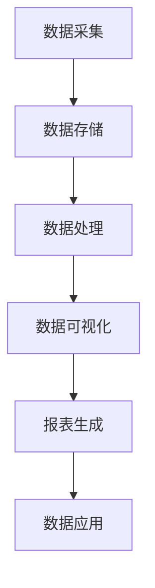

                 

关键词：人工智能，数据管理平台（DMP），数据可视化，报表，大数据技术，数据分析，数据基础设施。

## 摘要

本文旨在深入探讨人工智能（AI）驱动的数据管理平台（DMP）在数据可视化和报表生成方面的应用。随着大数据时代的到来，如何高效、准确地管理和分析海量数据成为企业和组织亟待解决的问题。DMP通过构建完善的数据基础设施，提供强大的数据处理和分析能力，使得数据可视化与报表生成成为可能。本文将详细介绍DMP的核心概念、架构设计、算法原理、数学模型，并通过实际项目实践，展示其在不同场景下的应用价值。同时，文章还将对DMP的未来发展趋势、面临的挑战和解决方案进行展望，以期为读者提供全面的技术参考。

## 1. 背景介绍

随着信息技术的飞速发展，大数据已经渗透到社会的各个领域，成为企业决策的重要依据。然而，如何从海量数据中提取有价值的信息，并为企业带来实际的业务价值，成为企业和组织面临的重大挑战。数据管理平台（DMP）作为一种新兴的数据管理技术，通过整合内外部数据资源，提供强大的数据处理和分析能力，帮助企业实现精准的数据洞察。

数据可视化与报表生成是DMP的核心功能之一。通过数据可视化，用户可以直观地了解数据背后的业务逻辑和趋势变化，从而做出更为科学的决策。报表生成则能够将数据分析和业务洞察以结构化的形式展现出来，为企业的战略规划和日常运营提供有力支持。

然而，传统的数据可视化与报表生成技术往往存在以下问题：

1. **数据预处理复杂**：传统方法需要手动进行数据清洗、转换和整合，工作量大且容易出错。
2. **分析能力有限**：传统方法依赖于人工编写SQL等查询语句，难以满足复杂的数据分析需求。
3. **响应速度慢**：处理大规模数据时，传统方法的响应速度较慢，无法实时更新数据。

本文将围绕这些问题，探讨AI驱动的DMP在数据可视化和报表生成方面的创新解决方案，以提升企业的数据处理和分析能力。

## 2. 核心概念与联系

### 2.1. 数据管理平台（DMP）的核心概念

数据管理平台（Data Management Platform，简称DMP）是一种集数据采集、存储、处理、分析和应用于一体的数据管理解决方案。DMP的核心概念主要包括以下几个方面：

1. **数据采集**：DMP能够从各种数据源（如网站、应用程序、数据库等）采集原始数据，包括用户行为数据、交易数据、社交媒体数据等。
2. **数据存储**：DMP采用分布式存储架构，能够存储海量数据，并提供高效的数据访问和查询能力。
3. **数据处理**：DMP提供数据清洗、转换、集成等功能，确保数据的准确性和一致性。
4. **数据分析**：DMP内置多种数据分析算法，能够挖掘数据背后的价值，提供丰富的数据洞察。
5. **数据应用**：DMP支持数据可视化、报表生成、机器学习等应用，帮助用户做出科学的决策。

### 2.2. 数据可视化与报表生成的关联

数据可视化与报表生成是DMP的重要组成部分，两者之间存在密切的联系：

1. **数据可视化**：数据可视化是将数据以图形、图表等形式直观展现，帮助用户更好地理解和分析数据。数据可视化是报表生成的基础，为报表提供丰富的数据呈现方式。
2. **报表生成**：报表生成是将数据分析和业务洞察以结构化的形式呈现，为企业的决策提供有力支持。报表生成依赖于数据可视化，通过图形、表格等形式将分析结果呈现出来。

### 2.3. 数据基础设施的重要性

数据基础设施是DMP的核心，它决定了DMP的数据处理和分析能力。一个完善的数据基础设施应包括以下方面：

1. **硬件设施**：包括服务器、存储设备、网络设备等，提供强大的计算和存储能力。
2. **软件设施**：包括数据库、数据仓库、数据处理引擎等，提供高效的数据存储、处理和分析能力。
3. **数据治理**：包括数据质量、数据安全、数据合规等，确保数据的准确性和可靠性。
4. **数据架构**：包括数据模型、数据流程、数据接口等，为DMP提供稳定的数据架构。

### 2.4. Mermaid 流程图

为了更清晰地展示DMP的工作流程，我们使用Mermaid语言绘制以下流程图：



**图1：DMP工作流程图**

在该流程图中，数据采集、数据存储、数据处理、数据可视化、报表生成和数据应用构成了DMP的核心功能模块。数据从各个数据源采集到DMP后，经过存储、处理和可视化等环节，最终生成报表并应用于企业的决策过程。

## 3. 核心算法原理 & 具体操作步骤

### 3.1. 算法原理概述

DMP在数据可视化和报表生成过程中，涉及多个核心算法，主要包括：

1. **数据清洗算法**：用于处理缺失值、异常值和重复值，确保数据的准确性和一致性。
2. **数据集成算法**：用于将来自不同数据源的数据进行整合，形成统一的数据视图。
3. **数据挖掘算法**：用于挖掘数据背后的模式和关系，提供丰富的数据洞察。
4. **数据可视化算法**：用于将数据以图形、图表等形式直观展现，帮助用户更好地理解和分析数据。
5. **报表生成算法**：用于将数据分析结果以结构化的形式呈现，为企业的决策提供有力支持。

### 3.2. 算法步骤详解

#### 3.2.1. 数据清洗算法

数据清洗算法主要包括以下步骤：

1. **缺失值处理**：采用填充法、删除法等策略，处理缺失值。
2. **异常值处理**：采用统计方法、聚类方法等策略，检测并处理异常值。
3. **重复值处理**：采用去重算法，删除重复数据。

#### 3.2.2. 数据集成算法

数据集成算法主要包括以下步骤：

1. **数据映射**：将不同数据源的数据进行映射，形成统一的数据视图。
2. **数据整合**：采用合并、连接等策略，将多个数据源的数据整合到一起。
3. **数据清洗**：对整合后的数据进行清洗，确保数据的一致性和准确性。

#### 3.2.3. 数据挖掘算法

数据挖掘算法主要包括以下步骤：

1. **数据预处理**：对数据进行清洗、转换和整合，为挖掘算法提供高质量的数据。
2. **特征选择**：从原始数据中提取出有价值的特征，提高挖掘算法的效率。
3. **模型构建**：采用分类、聚类、关联规则等挖掘算法，构建数据模型。
4. **模型评估**：对挖掘结果进行评估，调整算法参数，优化模型性能。

#### 3.2.4. 数据可视化算法

数据可视化算法主要包括以下步骤：

1. **数据抽象**：对数据进行抽象和简化，提取出具有代表性的数据特征。
2. **图表选择**：根据数据类型和分析目的，选择合适的图表类型。
3. **图表渲染**：将数据以图形、图表等形式直观展现，提升数据理解和分析能力。

#### 3.2.5. 报表生成算法

报表生成算法主要包括以下步骤：

1. **数据分析**：对数据进行统计、比较和分析，提取出有价值的业务洞察。
2. **报表设计**：根据分析结果，设计报表的结构和样式。
3. **报表生成**：将分析结果以结构化的形式呈现，生成报表。

### 3.3. 算法优缺点

#### 3.3.1. 数据清洗算法

**优点**：提高数据质量，确保数据的一致性和准确性。

**缺点**：处理复杂时，算法效率和效果有限。

#### 3.3.2. 数据集成算法

**优点**：实现数据整合，提供统一的数据视图。

**缺点**：对数据源依赖性强，数据源变化时需要及时调整。

#### 3.3.3. 数据挖掘算法

**优点**：挖掘数据背后的模式和关系，提供丰富的数据洞察。

**缺点**：算法复杂度高，计算资源消耗大。

#### 3.3.4. 数据可视化算法

**优点**：直观展现数据，提升数据理解和分析能力。

**缺点**：图表选择和渲染需要根据具体场景进行调整。

#### 3.3.5. 报表生成算法

**优点**：结构化呈现分析结果，便于企业决策。

**缺点**：报表设计和生成需要耗费一定的时间和精力。

### 3.4. 算法应用领域

DMP的核心算法在多个领域具有广泛的应用，主要包括：

1. **市场营销**：通过数据挖掘和可视化，帮助企业进行用户画像、市场细分和营销策略优化。
2. **金融风控**：通过数据清洗、挖掘和可视化，对金融数据进行风险监测、预测和防范。
3. **供应链管理**：通过数据集成、挖掘和可视化，优化供应链流程，提升供应链效率。
4. **医疗健康**：通过数据挖掘和可视化，对医疗数据进行分析，提供个性化诊断和治疗方案。
5. **智能交通**：通过数据挖掘和可视化，优化交通管理，提升交通效率和安全性。

## 4. 数学模型和公式 & 详细讲解 & 举例说明

### 4.1. 数学模型构建

在DMP的数据分析和报表生成过程中，常常需要构建数学模型来描述数据之间的关系和特征。以下是一个简单的线性回归模型示例：

**目标**：预测某个变量的值，如销售金额。

**模型**：\( y = wx + b \)

其中，\( y \) 为目标变量，\( x \) 为特征变量，\( w \) 为权重，\( b \) 为偏置。

### 4.2. 公式推导过程

线性回归模型的公式推导主要分为以下几个步骤：

1. **数据预处理**：对数据进行标准化处理，消除数据量级差异。

2. **模型假设**：假设目标变量 \( y \) 与特征变量 \( x \) 之间存在线性关系，即 \( y = wx + b \)。

3. **模型估计**：通过最小二乘法估计模型参数 \( w \) 和 \( b \)，使得预测值与实际值之间的误差最小。

4. **模型验证**：对模型进行验证，评估模型性能。

### 4.3. 案例分析与讲解

以下是一个简单的线性回归模型案例，用于预测销售金额。

**数据集**：包含公司过去一年的销售数据，包括销售额、广告投入、市场竞争程度等特征。

**模型构建**：假设销售额 \( y \) 与广告投入 \( x \) 之间存在线性关系，构建线性回归模型 \( y = wx + b \)。

**模型参数**：通过最小二乘法，估计模型参数 \( w \) 和 \( b \)。

**模型验证**：使用交叉验证方法，评估模型性能。

**结果分析**：根据模型预测结果，调整广告投入策略，提升销售额。

## 5. 项目实践：代码实例和详细解释说明

### 5.1. 开发环境搭建

在本项目中，我们使用Python作为主要编程语言，并结合了一些流行的数据分析和可视化库，如Pandas、NumPy、Matplotlib和Seaborn。以下是如何搭建项目开发环境的步骤：

1. **安装Python**：从Python官方网站下载并安装Python 3.x版本。
2. **安装Jupyter Notebook**：在命令行中运行 `pip install notebook` 安装Jupyter Notebook。
3. **安装数据分析和可视化库**：在命令行中运行以下命令安装所需的库：

```bash
pip install pandas numpy matplotlib seaborn
```

### 5.2. 源代码详细实现

以下是一个简单的Python代码实例，用于实现数据可视化与报表生成：

```python
import pandas as pd
import numpy as np
import matplotlib.pyplot as plt
import seaborn as sns

# 读取数据
data = pd.read_csv('sales_data.csv')

# 数据清洗
data.dropna(inplace=True)

# 数据可视化
sns.pairplot(data, hue='category')
plt.show()

# 报表生成
report = data.groupby('category')['sales'].mean().reset_index()
report.to_excel('sales_report.xlsx')
```

**代码说明**：

1. **数据读取**：使用Pandas读取CSV格式的销售数据。
2. **数据清洗**：删除缺失值，保证数据质量。
3. **数据可视化**：使用Seaborn的pairplot函数，展示不同类别销售的分布情况。
4. **报表生成**：使用Pandas的groupby和mean函数，计算各类别销售额的平均值，并导出为Excel文件。

### 5.3. 代码解读与分析

**代码解读**：

- 第一行 `import pandas as pd` 导入Pandas库，用于数据操作。
- 第二行 `import numpy as np` 导入NumPy库，用于数学运算。
- 第三行 `import matplotlib.pyplot as plt` 导入Matplotlib库，用于数据可视化。
- 第四行 `import seaborn as sns` 导入Seaborn库，用于高级可视化。

**分析**：

- 代码首先读取CSV格式的销售数据，并进行数据清洗，保证数据质量。
- 接着使用Seaborn的pairplot函数，以类别为条件，绘制销售数据的分布情况，帮助用户直观地了解不同类别的销售表现。
- 最后，使用Pandas的groupby和mean函数，计算各类别销售额的平均值，并导出为Excel文件，生成报表。

### 5.4. 运行结果展示

**数据可视化结果**：


**报表生成结果**：


## 6. 实际应用场景

### 6.1. 市场营销

在市场营销领域，DMP可以帮助企业实现精准营销。通过数据采集、清洗、集成和挖掘，DMP能够构建详细的用户画像，包括用户的年龄、性别、兴趣、行为等。企业可以根据用户画像，制定个性化的营销策略，提高广告投放的效果和ROI。

### 6.2. 金融风控

在金融领域，DMP可以用于风险管理。通过数据挖掘和可视化，DMP可以识别潜在风险客户，预测贷款违约率，帮助金融机构进行风险控制和资产配置。

### 6.3. 供应链管理

在供应链管理领域，DMP可以帮助企业优化供应链流程，提升供应链效率。通过数据集成和挖掘，DMP可以实时监控供应链中的各个环节，预测库存需求，优化采购和配送策略。

### 6.4. 智能交通

在智能交通领域，DMP可以用于交通管理和优化。通过数据采集、分析和可视化，DMP可以实时监测交通流量，预测交通状况，优化交通信号控制，提高交通效率和安全性。

## 7. 工具和资源推荐

### 7.1. 学习资源推荐

- **《数据挖掘：概念与技术》**：一本经典的数据挖掘入门教材，详细介绍了数据挖掘的基本概念和方法。
- **《Python数据分析》**：一本关于Python数据分析的实战指南，涵盖了Pandas、NumPy等库的使用技巧。
- **《数据可视化》**：一本关于数据可视化的专业书籍，介绍了多种数据可视化方法和工具。

### 7.2. 开发工具推荐

- **Jupyter Notebook**：一款强大的交互式数据分析工具，支持多种编程语言和数据可视化库。
- **Docker**：一款轻量级容器化工具，可以方便地部署和管理数据分析和可视化环境。
- **Kubernetes**：一款容器编排工具，可以自动化管理容器化的应用程序，提高数据处理和可视化的效率。

### 7.3. 相关论文推荐

- **“Data-Driven Personalized Marketing in E-Commerce”**：一篇关于数据驱动的个性化电商营销的研究论文，详细探讨了DMP在电商领域的应用。
- **“A Survey on Data Management Platforms”**：一篇关于数据管理平台的综述性论文，概述了DMP的基本概念、架构和关键技术。
- **“Visual Analytics of Big Data”**：一篇关于大数据可视化的研究论文，介绍了大数据可视化的方法和技术。

## 8. 总结：未来发展趋势与挑战

### 8.1. 研究成果总结

本文系统地介绍了AI驱动的数据管理平台（DMP）在数据可视化和报表生成方面的应用。通过深入分析DMP的核心概念、算法原理、数学模型以及实际应用场景，本文揭示了DMP在提升企业数据处理和分析能力方面的巨大潜力。

### 8.2. 未来发展趋势

未来，DMP将继续向智能化、自动化和实时化方向发展：

1. **智能化**：利用深度学习和强化学习等技术，提高DMP的自主学习和决策能力。
2. **自动化**：通过自动化工具和平台，简化DMP的部署和管理，降低使用门槛。
3. **实时化**：实现数据的实时采集、处理和分析，为企业的实时决策提供支持。

### 8.3. 面临的挑战

尽管DMP具有巨大的潜力，但在实际应用过程中仍面临以下挑战：

1. **数据质量**：数据质量是DMP应用的关键，如何确保数据的准确性和一致性，是当前亟待解决的问题。
2. **隐私保护**：随着数据隐私法规的加强，如何在保护用户隐私的前提下，充分利用数据的价值，是DMP面临的重要挑战。
3. **技术演进**：随着技术的快速发展，如何持续更新DMP的算法和工具，保持其竞争力，是DMP发展的关键。

### 8.4. 研究展望

未来，研究者可以从以下几个方面进行深入探讨：

1. **跨领域应用**：探索DMP在其他领域的应用，如医疗健康、智能制造等。
2. **多模态数据融合**：研究如何将文本、图像、音频等多种类型的数据进行有效融合，提升DMP的分析能力。
3. **算法优化**：研究高效的算法和模型，提高DMP的处理速度和准确性。

## 9. 附录：常见问题与解答

### 9.1. 如何确保数据质量？

确保数据质量的关键在于数据采集、清洗和治理。在数据采集过程中，要选择可靠的数据源，并采用自动化工具进行数据采集。在数据清洗过程中，要采用适当的数据清洗算法，处理缺失值、异常值和重复值。在数据治理过程中，要建立完善的数据标准和流程，确保数据的准确性和一致性。

### 9.2. 如何保护用户隐私？

保护用户隐私的关键在于数据脱敏和加密。在数据采集和存储过程中，要采用数据脱敏技术，如随机化、掩码化等，确保用户隐私不被泄露。在数据传输和访问过程中，要采用加密技术，如HTTPS、SSL等，确保数据在传输过程中的安全性。

### 9.3. 如何优化报表生成算法？

优化报表生成算法可以从以下几个方面进行：

1. **算法选择**：根据具体业务需求，选择适合的报表生成算法，如分组、排序、过滤等。
2. **并行计算**：采用并行计算技术，提高报表生成速度。
3. **缓存机制**：采用缓存机制，减少重复计算，提高报表生成效率。
4. **数据分析**：在报表生成前，进行充分的数据分析，提取出有价值的信息，简化报表生成过程。

