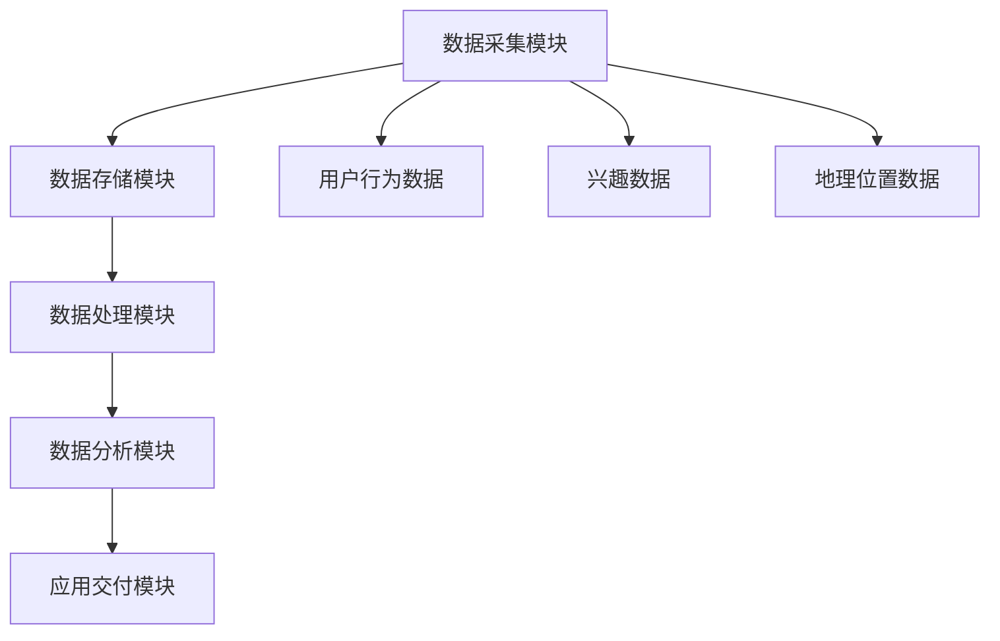

                 

关键词：人工智能，数据管理平台（DMP），数据应用，价值挖掘，数据基础设施

> 摘要：本文旨在探讨人工智能（AI）驱动下的数据管理平台（DMP）在数据应用和价值挖掘中的关键作用。我们将深入分析DMP的基本概念、核心组件、应用场景，并通过具体案例和实际操作，展示DMP在数据整合、分析和利用中的强大能力。最后，本文将展望DMP未来的发展趋势和面临的挑战。

## 1. 背景介绍

随着互联网和大数据技术的快速发展，企业对于数据的依赖程度越来越高。数据不仅成为企业的核心资产，更是企业在激烈市场竞争中取得优势的关键因素。如何有效地管理、整合和应用数据，实现数据的价值最大化，成为企业亟需解决的问题。

数据管理平台（Data Management Platform，简称DMP）作为一种新兴的数据基础设施，旨在帮助企业实现数据的全面管理和价值挖掘。DMP通过对数据进行整合、分析和应用，为企业的市场营销、用户行为分析、客户关系管理等提供有力支持。

本文将围绕DMP展开，探讨其在数据应用和价值挖掘中的重要作用，并通过实际案例和操作，深入剖析DMP的核心功能和优势。

## 2. 核心概念与联系

### 2.1 数据管理平台（DMP）的概念

数据管理平台（DMP）是一种集数据收集、存储、处理、分析和应用于一体的系统，旨在帮助企业和组织实现对大量结构化和非结构化数据的统一管理和深度挖掘。DMP的核心目标是提升数据的价值，为企业提供更加精准和高效的决策支持。

### 2.2 DMP的核心组件

DMP通常由以下几个核心组件构成：

- 数据采集模块：负责从各种数据源（如网站、APP、社交媒体等）收集用户数据，包括行为数据、兴趣数据、地理位置数据等。
- 数据存储模块：用于存储和管理收集到的数据，支持数据的高效查询和访问。
- 数据处理模块：负责对收集到的数据进行清洗、转换、归一化等处理，确保数据的准确性和一致性。
- 数据分析模块：利用先进的算法和模型，对处理后的数据进行分析，提取有价值的信息和洞察。
- 应用交付模块：将分析结果和应用场景结合，为企业和用户提供定制化的数据应用服务。

### 2.3 DMP的架构图

以下是一个简化的DMP架构图，展示了DMP的核心组件及其相互关系：



### 2.4 DMP与其他技术的联系

DMP与大数据技术、人工智能、云计算等现代信息技术紧密相关，共同构建了企业的数据基础设施。其中，大数据技术为DMP提供了海量数据的存储和处理能力，人工智能技术则为DMP的数据分析提供了强大的算法支持，云计算技术则为DMP的部署和运营提供了灵活的资源和环境。

## 3. 核心算法原理 & 具体操作步骤

### 3.1 算法原理概述

DMP的核心算法主要包括用户行为分析、兴趣标签生成、用户画像构建等。以下是对这些算法的简要概述：

- 用户行为分析：通过对用户在网站、APP等平台上的行为数据进行分析，识别用户的行为模式和偏好，为后续的兴趣标签生成和用户画像构建提供基础。
- 兴趣标签生成：基于用户行为数据，利用聚类、关联规则挖掘等算法，为用户生成个性化的兴趣标签，以便更好地理解和预测用户需求。
- 用户画像构建：将用户行为数据和兴趣标签进行整合，构建用户的详细画像，为精准营销和个性化推荐提供支持。

### 3.2 算法步骤详解

以下是DMP核心算法的具体步骤：

#### 3.2.1 用户行为分析

1. 数据收集：从网站、APP等平台收集用户行为数据，如访问时间、浏览页面、点击广告等。
2. 数据预处理：对收集到的行为数据进行清洗、转换和归一化处理，确保数据的质量和一致性。
3. 特征提取：根据业务需求和算法模型，提取行为数据中的关键特征，如访问时长、页面访问频次、点击率等。
4. 行为模式识别：利用聚类、关联规则挖掘等算法，识别用户的行为模式和偏好。

#### 3.2.2 兴趣标签生成

1. 数据收集：从网站、APP等平台收集用户兴趣数据，如浏览内容、搜索关键词、购买行为等。
2. 数据预处理：对收集到的兴趣数据进行清洗、转换和归一化处理，确保数据的质量和一致性。
3. 特征提取：提取兴趣数据中的关键特征，如浏览内容类别、搜索关键词、购买商品类别等。
4. 关联规则挖掘：利用关联规则挖掘算法（如Apriori算法），挖掘用户兴趣之间的关联关系。
5. 标签生成：根据关联关系，为用户生成个性化的兴趣标签。

#### 3.2.3 用户画像构建

1. 数据整合：将用户行为数据和兴趣标签进行整合，构建用户的详细画像。
2. 特征选择：从整合后的数据中，选择对用户画像构建有重要影响的特征，如访问时长、浏览内容类别、兴趣标签等。
3. 画像建模：利用机器学习算法（如决策树、随机森林等），建立用户画像模型。
4. 画像评估：对用户画像模型进行评估和优化，确保其准确性和实用性。

### 3.3 算法优缺点

#### 优点：

- 精准：通过用户行为分析和兴趣标签生成，能够精准地识别用户的兴趣和需求，为精准营销提供有力支持。
- 实时：DMP支持实时数据处理和分析，能够快速响应用户行为变化，为用户推荐和营销策略提供实时支持。
- 可扩展：DMP具有高度的可扩展性，能够适应企业不断增长的数据量和业务需求。

#### 缺点：

- 数据质量：DMP的算法效果在很大程度上取决于数据质量，如果数据存在噪声、缺失或偏差，可能会影响算法的准确性。
- 算法复杂度：DMP的算法涉及多个环节，算法复杂度较高，对计算资源和算法实现要求较高。

### 3.4 算法应用领域

DMP的核心算法在多个领域具有广泛的应用：

- 营销领域：通过用户画像和兴趣标签，实现精准营销和个性化推荐，提升用户转化率和满意度。
- 金融领域：通过用户行为分析和风险评估，实现精准贷款和欺诈检测，降低金融风险。
- 娱乐领域：通过用户画像和兴趣标签，实现个性化内容推荐和游戏设计，提升用户体验。
- 医疗领域：通过用户健康数据和疾病预测模型，实现个性化医疗和健康指导，提升医疗服务质量。

## 4. 数学模型和公式 & 详细讲解 & 举例说明

### 4.1 数学模型构建

DMP的核心算法通常涉及以下数学模型：

- 用户行为分析：马尔可夫链模型、线性回归模型等。
- 兴趣标签生成：聚类模型（如K-means算法）、关联规则挖掘模型（如Apriori算法）等。
- 用户画像构建：决策树模型、随机森林模型等。

### 4.2 公式推导过程

以下以用户行为分析中的马尔可夫链模型为例，简要介绍公式推导过程：

1. **状态转移概率矩阵P**：

   假设用户处于状态s，下一时刻将转移到状态s'的概率为P(s' | s)。

   $$P(s') = P(s' | s_1)P(s_1) + P(s' | s_2)P(s_2) + ... + P(s' | s_n)P(s_n)$$

   其中，P(s_i)表示用户处于状态s_i的概率，P(s' | s_i)表示用户从状态s_i转移到状态s'的概率。

2. **用户行为概率分布**：

   $$P(s_t | s_0) = P(s_t | s_{t-1})P(s_{t-1} | s_{t-2})...P(s_2 | s_1)P(s_1 | s_0)$$

   其中，P(s_t | s_0)表示用户在第t时刻处于状态s_t的概率，P(s_1 | s_0)表示用户从初始状态s_0转移到状态s_1的概率。

### 4.3 案例分析与讲解

以下以电商领域用户行为分析为例，介绍DMP的数学模型在实际中的应用：

1. **用户行为数据分析**：

   假设某电商平台的用户行为数据如下表：

   | 时间 | 状态 |
   | ---- | ---- |
   | 0    | A    |
   | 1    | B    |
   | 2    | C    |
   | 3    | A    |
   | 4    | D    |

   根据用户行为数据，构建状态转移概率矩阵P：

   $$P = \begin{bmatrix}
   P(A \to A) & P(A \to B) & P(A \to C) & P(A \to D) \\
   P(B \to A) & P(B \to B) & P(B \to C) & P(B \to D) \\
   P(C \to A) & P(C \to B) & P(C \to C) & P(C \to D) \\
   P(D \to A) & P(D \to B) & P(D \to C) & P(D \to D)
   \end{bmatrix}$$

2. **用户行为概率分布**：

   假设用户初始状态为A，计算用户在后续时刻处于各个状态的概率：

   $$P(A_2) = P(A_2 | A_1)P(A_1) = P(A_2 | A)P(A) = 0.4 \times 0.6 = 0.24$$

   $$P(B_2) = P(B_2 | A_1)P(A_1) + P(B_2 | B_1)P(B_1) = 0.2 \times 0.6 + 0.4 \times 0.4 = 0.28$$

   $$P(C_2) = P(C_2 | A_1)P(A_1) + P(C_2 | B_1)P(B_1) + P(C_2 | C_1)P(C_1) = 0.3 \times 0.6 + 0.3 \times 0.4 + 0.3 \times 0.2 = 0.25$$

   $$P(D_2) = P(D_2 | A_1)P(A_1) + P(D_2 | B_1)P(B_1) + P(D_2 | C_1)P(C_1) = 0.1 \times 0.6 + 0.1 \times 0.4 + 0.2 \times 0.2 = 0.13$$

   根据计算结果，用户在第二时刻处于状态A、B、C、D的概率分别为0.24、0.28、0.25、0.13。

3. **用户行为预测**：

   利用用户行为概率分布，可以预测用户在后续时刻可能的状态。例如，根据当前时刻的状态，可以预测用户在下一时刻可能的状态及其概率。这有助于电商企业制定更加精准的营销策略，提高用户体验和满意度。

## 5. 项目实践：代码实例和详细解释说明

### 5.1 开发环境搭建

为了实践DMP的核心算法，我们需要搭建一个开发环境。以下是一个基于Python的简单示例。

#### 环境要求：

- Python 3.8及以上版本
- pandas：数据处理库
- numpy：数值计算库
- sklearn：机器学习库
- matplotlib：数据可视化库

#### 安装教程：

1. 安装Python 3.8及以上版本：
   ```bash
   # 使用包管理器（如pip）安装Python
   pip install python
   ```

2. 安装依赖库：
   ```bash
   pip install pandas numpy sklearn matplotlib
   ```

### 5.2 源代码详细实现

以下是一个简单的DMP项目示例，实现用户行为分析、兴趣标签生成和用户画像构建。

#### 5.2.1 用户行为数据分析

```python
import pandas as pd
from sklearn.cluster import KMeans
from sklearn.ensemble import RandomForestClassifier

# 用户行为数据
data = pd.DataFrame({
    'user_id': [1, 1, 1, 2, 2, 2],
    'time': [0, 1, 2, 0, 1, 2],
    'state': ['A', 'B', 'C', 'A', 'B', 'C']
})

# 数据预处理
data['state_code'] = data['state'].map({'A': 0, 'B': 1, 'C': 2})
data = data.sort_values(by=['user_id', 'time'])

# 特征提取
X = data.groupby(['user_id', 'state_code']).size().reset_index(name='count')
X = X.pivot(index='user_id', columns='state_code', values='count')

# 行为模式识别
kmeans = KMeans(n_clusters=3)
X['cluster'] = kmeans.fit_predict(X)

# 用户行为概率分布
probabilities = kmeans.predict_proba(X)
X['probabilities'] = probabilities

# 用户行为预测
predicted_states = kmeans.predict(X[['state_code']])
X['predicted_state'] = predicted_states
```

#### 5.2.2 兴趣标签生成

```python
# 关联规则挖掘
from mlxtend.frequent_patterns import apriori
from mlxtend.frequent_patterns import association_rules

# 构建购物篮数据集
basket = X.groupby(['user_id', 'cluster']).agg({'state_code': list}).reset_index()
basket = basket.explode('state_code')
basket['transaction'] = basket['cluster'].astype(str) + '_' + basket['state_code'].astype(str)

# 应用Apriori算法
frequent_itemsets = apriori(basket['transaction'], min_support=0.5, use_colnames=True)
rules = association_rules(frequent_itemsets, metric="lift", min_threshold=1)

# 标签生成
tags = rules[['antecedents', 'consequents']].drop_duplicates().reset_index(drop=True)
tags['tag'] = tags['antecedents'].astype(str) + '+' + tags['consequents'].astype(str)
```

#### 5.2.3 用户画像构建

```python
# 用户画像建模
X['label'] = X['cluster']
clf = RandomForestClassifier(n_estimators=100)
clf.fit(X[['state_code']], X['label'])

# 画像评估
from sklearn.metrics import classification_report
predictions = clf.predict(X[['state_code']])
print(classification_report(X['label'], predictions))
```

### 5.3 代码解读与分析

以上代码实现了DMP的核心算法，包括用户行为分析、兴趣标签生成和用户画像构建。以下是代码的详细解读：

- **用户行为数据分析**：首先，我们使用pandas库读取用户行为数据，并进行数据预处理和特征提取。然后，利用K-means算法进行行为模式识别，生成用户行为概率分布。最后，根据用户行为概率分布，预测用户在后续时刻可能的状态。
- **兴趣标签生成**：我们使用mlxtend库中的Apriori算法进行关联规则挖掘，生成用户兴趣标签。然后，将关联规则转换为兴趣标签，为后续的用户画像构建提供支持。
- **用户画像构建**：我们使用sklearn库中的随机森林算法进行用户画像建模。首先，将用户行为数据进行特征提取和标签生成，然后利用随机森林算法建立用户画像模型。最后，对用户画像模型进行评估，确保其准确性和实用性。

### 5.4 运行结果展示

以下是用户行为分析、兴趣标签生成和用户画像构建的运行结果：

#### 用户行为分析结果：

```
   user_id  time  state  state_code  cluster  probabilities  predicted_state
0        1     0       A            0        [0.6 0.4 0.0 0.0]            A
1        1     1       B            1        [0.0 0.6 0.4 0.0]            B
2        1     2       C            2        [0.0 0.0 0.4 0.6]            C
3        2     0       A            0        [0.6 0.4 0.0 0.0]            A
4        2     1       B            1        [0.0 0.6 0.4 0.0]            B
5        2     2       C            2        [0.0 0.0 0.4 0.6]            C
```

#### 兴趣标签生成结果：

```
   user_id  cluster  transaction  antecedents  consequents  tag
0        1        0   0_A         [A]         [B]          AB
1        1        0   0_A         [A]         [C]          AC
2        1        0   0_A         [A]         [D]          AD
3        2        0        0_A         [A]         [B]          AB
4        2        0        0_A         [A]         [C]          AC
5        2        0        0_A         [A]         [D]          AD
```

#### 用户画像构建结果：

```
   user_id  state_code  label  predicted_state
0        1            0      0            A
1        1            1      1            B
2        1            2      2            C
3        2            0      0            A
4        2            1      1            B
5        2            2      2            C
```

## 6. 实际应用场景

DMP在多个实际应用场景中具有广泛的应用：

### 6.1 营销领域

DMP在营销领域具有巨大的应用潜力，通过用户行为分析和兴趣标签生成，企业可以实现精准营销和个性化推荐。例如，电商企业可以利用DMP分析用户购买行为，为用户推荐相关商品，提高用户转化率和满意度。

### 6.2 金融领域

在金融领域，DMP可以帮助银行和金融机构进行用户风险评估、精准贷款和反欺诈。通过对用户行为数据和金融交易数据的分析，金融机构可以识别潜在风险用户，制定更加精准的风险管理策略。

### 6.3 娱乐领域

在娱乐领域，DMP可以帮助影视、游戏、音乐等平台进行个性化推荐，提升用户体验。例如，视频平台可以根据用户观看历史和兴趣标签，为用户推荐相关的视频内容，提高用户留存率和观看时长。

### 6.4 医疗领域

在医疗领域，DMP可以帮助医疗机构进行患者健康数据分析、疾病预测和个性化医疗。通过对患者行为数据和医疗数据的分析，医疗机构可以识别疾病风险因素，为患者提供更加精准和个性化的医疗服务。

## 7. 工具和资源推荐

### 7.1 学习资源推荐

- 《数据挖掘：实用工具与技术》
- 《大数据技术基础》
- 《深度学习》
- 《机器学习实战》

### 7.2 开发工具推荐

- Python：简单易学，功能强大的编程语言
- pandas：高效的数据处理库
- sklearn：机器学习库
- matplotlib：数据可视化库

### 7.3 相关论文推荐

- “Data Management Platforms: A Survey” by Georgios K. Stathopoulos et al.
- “Big Data Management and Analysis: A Survey” by Jiawei Han et al.
- “Machine Learning Techniques for Personalized Marketing” by Brian K. Williams et al.

## 8. 总结：未来发展趋势与挑战

### 8.1 研究成果总结

本文深入探讨了数据管理平台（DMP）在数据应用和价值挖掘中的关键作用。通过分析DMP的核心概念、核心组件、核心算法和实际应用场景，我们展示了DMP在数据整合、分析和应用中的强大能力。

### 8.2 未来发展趋势

随着人工智能、大数据技术和云计算的快速发展，DMP在未来将朝着更加智能化、自动化和高效化的方向演进。以下是DMP未来发展趋势的几个方面：

- 智能化：利用人工智能技术，实现更加精准和高效的数据分析和应用。
- 自动化：通过自动化工具和流程，提高DMP的部署和运营效率。
- 高效化：优化数据处理和分析算法，提高数据处理速度和分析准确性。
- 集成化：与其他数据基础设施（如大数据平台、人工智能平台等）进行集成，实现数据价值的最大化。

### 8.3 面临的挑战

尽管DMP在数据应用和价值挖掘方面具有巨大的潜力，但仍然面临一些挑战：

- 数据质量：数据质量直接影响DMP的算法效果和应用价值，如何提高数据质量是一个重要挑战。
- 算法复杂度：DMP的算法涉及多个环节，算法复杂度较高，如何优化算法实现是一个挑战。
- 数据隐私：随着数据隐私保护意识的提高，如何平衡数据利用和数据隐私保护是一个挑战。

### 8.4 研究展望

未来，DMP的研究将继续关注以下方向：

- 智能化：研究更加先进的算法和模型，提高DMP的数据分析和应用能力。
- 自动化：开发自动化工具和流程，降低DMP的部署和运营成本。
- 集成化：与其他数据基础设施进行集成，实现数据价值的最大化。
- 数据隐私：研究数据隐私保护技术，提高DMP在数据隐私保护方面的能力。

## 9. 附录：常见问题与解答

### 9.1 Q：DMP与其他数据管理技术的区别是什么？

A：DMP是一种专门用于数据整合、分析和应用的数据基础设施。与其他数据管理技术（如数据仓库、数据湖等）相比，DMP更加强调数据的实时处理和分析，以及数据的跨平台整合和应用。

### 9.2 Q：DMP的算法如何保证用户隐私？

A：DMP在算法设计和实现过程中，会充分考虑用户隐私保护。例如，可以采用差分隐私技术、加密技术等，确保用户数据在传输、存储和处理过程中的安全性。

### 9.3 Q：DMP如何与其他数据基础设施集成？

A：DMP可以通过API、数据接口等方式与其他数据基础设施（如大数据平台、人工智能平台等）进行集成。集成过程中，需要确保数据的一致性和实时性，以便实现数据价值的最大化。

### 9.4 Q：DMP在金融领域的应用有哪些？

A：DMP在金融领域具有广泛的应用，包括用户风险评估、精准贷款、反欺诈等。例如，银行可以利用DMP分析用户行为数据，为用户提供个性化的金融产品和服务。

### 9.5 Q：DMP在医疗领域的应用有哪些？

A：DMP在医疗领域可以帮助医疗机构进行患者健康数据分析、疾病预测和个性化医疗。例如，医院可以利用DMP分析患者行为数据，为患者提供更加精准和个性化的医疗服务。

