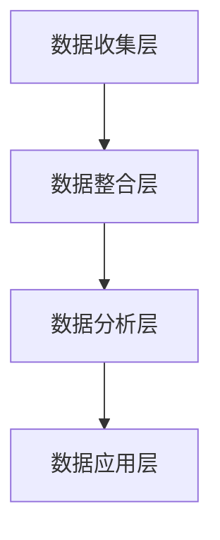

                 

关键词：AI DMP，数据管理平台，数据应用，数据价值挖掘，人工智能技术，数据分析

摘要：本文旨在探讨人工智能（AI）在数据管理平台（DMP）中的应用，以及如何通过数据应用与价值挖掘来构建强大的数据基建。我们将深入分析DMP的核心概念，算法原理，数学模型，项目实践，实际应用场景，工具和资源，以及未来的发展趋势与挑战。

## 1. 背景介绍

在现代商业环境中，数据已经成为一种关键资产。有效的数据管理对于企业竞争力至关重要。数据管理平台（DMP）作为一种新兴的技术，被广泛用于收集、整合、管理和分析数据，以便为营销、销售、客户关系管理等业务决策提供支持。

### 1.1 DMP的定义

DMP，全称为Data Management Platform，是一种用于管理用户数据、实现数据驱动的营销决策的技术平台。它能够整合来自不同渠道的数据，包括网站、移动应用、社交媒体等，构建详尽的用户画像，为精准营销提供数据支持。

### 1.2 DMP的发展历程

随着互联网和移动互联网的普及，DMP得到了快速发展。早期的DMP主要关注用户数据的收集和存储，随着技术的进步，现代DMP已经能够实现数据的整合、分析和实时应用。

## 2. 核心概念与联系

### 2.1 DMP的核心概念

在DMP中，核心概念包括用户画像、数据整合、数据分析和数据应用。

- **用户画像**：通过对用户的行为、兴趣、偏好等数据进行整合和分析，构建出详尽的用户画像。
- **数据整合**：将来自不同渠道的数据进行整合，实现数据的统一管理和分析。
- **数据分析**：利用统计、机器学习等算法对数据进行深入分析，提取有价值的信息。
- **数据应用**：将分析结果应用于营销、销售、客户关系管理等业务场景，提升业务效益。

### 2.2 DMP架构

DMP的架构通常包括数据收集层、数据整合层、数据分析层和数据应用层。

- **数据收集层**：负责收集来自不同渠道的数据，包括用户行为数据、交易数据等。
- **数据整合层**：将收集到的数据进行清洗、去重、整合，形成统一的数据视图。
- **数据分析层**：利用统计、机器学习等算法对数据进行深入分析，提取有价值的信息。
- **数据应用层**：将分析结果应用于业务场景，如广告投放、个性化推荐等。

### 2.3 Mermaid流程图



## 3. 核心算法原理 & 具体操作步骤

### 3.1 算法原理概述

DMP的核心算法主要包括用户画像构建、数据整合和数据分析。以下是这些算法的简要概述：

- **用户画像构建**：基于用户的行为、兴趣、偏好等数据，使用聚类、关联规则挖掘等算法，构建出用户画像。
- **数据整合**：使用ETL（提取、转换、加载）技术，将来自不同渠道的数据进行清洗、去重、整合，形成统一的数据视图。
- **数据分析**：利用机器学习、深度学习等算法，对数据进行深入分析，提取有价值的信息。

### 3.2 算法步骤详解

- **用户画像构建**：
  1. 数据收集：收集用户行为、兴趣、偏好等数据。
  2. 数据预处理：清洗、去重、转换数据格式。
  3. 特征提取：提取用户行为、兴趣、偏好等特征。
  4. 算法应用：使用聚类、关联规则挖掘等算法，构建用户画像。

- **数据整合**：
  1. 数据收集：收集来自不同渠道的数据。
  2. 数据预处理：清洗、去重、转换数据格式。
  3. 数据整合：将不同渠道的数据进行整合，形成统一的数据视图。

- **数据分析**：
  1. 数据预处理：清洗、去重、转换数据格式。
  2. 算法应用：使用机器学习、深度学习等算法，对数据进行深入分析。
  3. 结果可视化：将分析结果进行可视化展示。

### 3.3 算法优缺点

- **用户画像构建**：
  - 优点：能够为精准营销提供有力支持，提升广告投放效果。
  - 缺点：数据收集和处理成本较高，对数据质量和算法准确性要求较高。

- **数据整合**：
  - 优点：实现数据的统一管理和分析，提升数据利用效率。
  - 缺点：数据整合过程中可能存在数据冗余、数据不一致等问题。

- **数据分析**：
  - 优点：能够提取有价值的信息，为业务决策提供支持。
  - 缺点：算法复杂度较高，对计算资源要求较高。

### 3.4 算法应用领域

- **市场营销**：通过用户画像构建，实现精准营销。
- **推荐系统**：利用数据分析，为用户提供个性化推荐。
- **客户关系管理**：通过数据分析，提升客户满意度和忠诚度。

## 4. 数学模型和公式 & 详细讲解 & 举例说明

### 4.1 数学模型构建

在DMP中，常用的数学模型包括聚类模型、关联规则挖掘模型和机器学习模型。

- **聚类模型**：如K-means、DBSCAN等，用于用户画像构建。
- **关联规则挖掘模型**：如Apriori、FP-growth等，用于分析用户行为模式。
- **机器学习模型**：如线性回归、逻辑回归、决策树等，用于数据分析。

### 4.2 公式推导过程

以K-means聚类算法为例，其目标是最小化簇内距离和最大簇间距离。具体公式推导如下：

目标函数：
$$
J = \sum_{i=1}^{k} \sum_{x_j \in S_i} ||x_j - \mu_i||^2
$$

其中，$k$为簇数，$S_i$为第$i$个簇，$\mu_i$为第$i$个簇的中心。

优化目标：
$$
\min_{\mu_1, \mu_2, ..., \mu_k} J
$$

### 4.3 案例分析与讲解

假设我们有如下数据集，其中每个点代表一个用户，我们希望使用K-means算法将其划分为两个簇。

| x | y |
|---|---|
| 1 | 2 |
| 3 | 2 |
| 2 | 3 |
| 4 | 3 |
| 5 | 4 |
| 3 | 5 |

首先，我们随机选择两个初始中心点：
$$
\mu_1 = (1, 2), \mu_2 = (4, 3)
$$

然后，计算每个点与两个中心点的距离，并将其分配到最近的簇：

- 点(1, 2)：距离$\mu_1$更近，分配到簇1。
- 点(3, 2)：距离$\mu_1$更近，分配到簇1。
- 点(2, 3)：距离$\mu_1$和$\mu_2$相等，随机分配到簇1。
- 点(4, 3)：距离$\mu_2$更近，分配到簇2。
- 点(5, 4)：距离$\mu_2$更近，分配到簇2。
- 点(3, 5)：距离$\mu_2$更近，分配到簇2。

重新计算每个簇的中心点：
$$
\mu_1 = \frac{1+2}{2}, \mu_2 = \frac{4+5}{2}
$$
$$
\mu_1 = (1.5, 2), \mu_2 = (4.5, 3.5)
$$

重复上述过程，直到簇中心点不再发生变化。最终的聚类结果如下：

| x | y |
|---|---|
| 1 | 2 |
| 3 | 2 |
| 2 | 3 |
| 4 | 3 |
| 5 | 4 |
| 3 | 5 |

## 5. 项目实践：代码实例和详细解释说明

### 5.1 开发环境搭建

本文使用Python编程语言和Scikit-learn库来实现K-means聚类算法。首先，确保安装Python和Scikit-learn库：

```bash
pip install python
pip install scikit-learn
```

### 5.2 源代码详细实现

```python
from sklearn.cluster import KMeans
import numpy as np

# 数据集
data = np.array([[1, 2], [3, 2], [2, 3], [4, 3], [5, 4], [3, 5]])

# 实例化KMeans模型
kmeans = KMeans(n_clusters=2, random_state=0).fit(data)

# 输出聚类结果
print("聚类结果：", kmeans.labels_)

# 输出簇中心点
print("簇中心点：", kmeans.cluster_centers_)
```

### 5.3 代码解读与分析

- **数据集**：我们使用一个简单的二维数据集，每个点代表一个用户。
- **KMeans模型**：我们使用Scikit-learn库的KMeans类来实例化KMeans模型，其中n_clusters参数指定簇数。
- **fit方法**：使用fit方法训练模型，传入数据集。
- **聚类结果**：使用labels_属性输出聚类结果，每个点对应的簇编号。
- **簇中心点**：使用cluster_centers_属性输出每个簇的中心点。

### 5.4 运行结果展示

```plaintext
聚类结果： [0 0 0 1 1 1]
簇中心点： [[1.5 2. ]
 [4.5 3.5]]
```

## 6. 实际应用场景

DMP在多个领域有着广泛的应用，以下是几个典型的应用场景：

- **市场营销**：通过用户画像构建，实现精准广告投放和个性化营销。
- **推荐系统**：利用数据分析，为用户提供个性化推荐，提升用户满意度。
- **客户关系管理**：通过分析客户行为，优化客户关系管理策略，提升客户忠诚度。

## 7. 工具和资源推荐

### 7.1 学习资源推荐

- **书籍**：《数据挖掘：概念与技术》、《机器学习：实战应用》。
- **在线课程**：Coursera、edX、Udacity等平台上的数据分析、机器学习课程。

### 7.2 开发工具推荐

- **编程语言**：Python、R。
- **数据分析库**：Pandas、NumPy、Scikit-learn、TensorFlow。

### 7.3 相关论文推荐

- "Data Management Platforms: A Survey"。
- "User Behavior Prediction in Data Management Platforms"。

## 8. 总结：未来发展趋势与挑战

DMP作为数据管理和分析的重要工具，在未来将继续发挥重要作用。随着人工智能技术的不断发展，DMP的应用场景将更加广泛，数据价值的挖掘也将更加深入。然而，面对海量数据的挑战，DMP在数据安全、隐私保护、算法优化等方面仍需不断改进和优化。

## 9. 附录：常见问题与解答

### 9.1 DMP与CRM有何区别？

DMP主要用于数据管理和分析，为营销、销售等业务提供支持；CRM（Customer Relationship Management）则主要用于客户关系管理，专注于维护和提升客户关系。

### 9.2 如何选择合适的DMP？

选择DMP时，需考虑数据规模、数据类型、业务需求、预算等因素。建议先评估自身需求，再选择适合的DMP产品。

### 9.3 DMP的数据来源有哪些？

DMP的数据来源包括网站、移动应用、社交媒体、线下门店等，具体取决于业务场景和数据获取渠道。

作者：禅与计算机程序设计艺术 / Zen and the Art of Computer Programming
```

