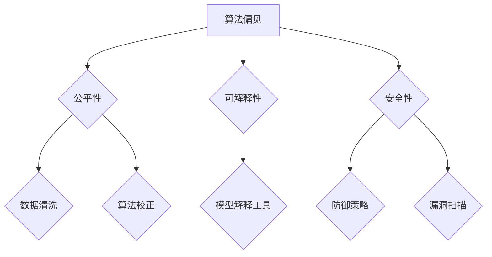

                 

随着人工智能技术的飞速发展，其在各个领域中的应用越来越广泛。然而，随之而来的是一系列伦理道德问题。如何确保人工智能的公平性、透明性和安全性成为了一个亟待解决的重要课题。本文将深入探讨AI伦理学的基本原则，并通过实际代码实例展示如何将这些原则应用于实践中。

## 关键词

- **AI Ethics**
- **AI公平性**
- **AI透明性**
- **AI安全性**
- **代码实例**

## 摘要

本文首先介绍了AI伦理学的基本原理，包括公平性、透明性和安全性。接着，通过Mermaid流程图阐述了这些原理的应用架构。然后，详细讲解了核心算法原理和具体操作步骤，包括数学模型和公式推导。随后，通过一个实际代码实例，展示了如何将这些原理和算法应用于解决具体问题。最后，文章探讨了AI伦理学在实际应用中的场景，并展望了未来发展的趋势和面临的挑战。

## 1. 背景介绍

人工智能技术的发展经历了多个阶段，从简单的规则系统到现代的深度学习模型，AI的应用范围和影响力不断扩大。然而，随着AI技术的进步，一系列伦理道德问题也随之产生。这些问题涉及到人工智能的决策过程、数据隐私、公平性等关键领域。

首先，**公平性**是AI伦理学中的一个核心问题。人工智能系统可能会因为训练数据中的偏见而导致不公平的决策。例如，一个用于招聘的AI系统可能会基于历史数据中的偏见，对某些性别或种族的候选人给予不公平的待遇。其次，**透明性**问题也很重要。由于深度学习模型的复杂性，它们的内部决策过程往往是不透明的。这可能导致用户无法理解AI系统的决策理由，从而影响用户对系统的信任。

最后，**安全性**也是AI伦理学的一个重要方面。人工智能系统可能会遭受恶意攻击，例如通过注入伪造数据来操纵系统的决策过程。此外，AI系统的安全漏洞还可能被利用来进行网络攻击或其他恶意行为。

## 2. 核心概念与联系

为了确保AI系统的公平性、透明性和安全性，我们需要理解以下几个核心概念：

- **算法偏见**：算法偏见是指AI系统在训练过程中对某些群体或特征产生歧视的现象。
- **可解释性**：可解释性是指用户能够理解AI系统做出特定决策的原因和过程。
- **安全防御机制**：安全防御机制是指保护AI系统免受恶意攻击和漏洞利用的技术措施。

以下是这些概念的Mermaid流程图表示：



### 2.1 算法偏见

算法偏见是指AI系统在训练过程中对某些群体或特征产生歧视的现象。这种现象通常是由于训练数据中存在偏见或者算法设计不合理导致的。例如，如果训练数据中包含了对某个性别或种族的负面刻板印象，那么AI系统可能会在预测结果中表现出对这些群体的偏见。

### 2.2 可解释性

可解释性是指用户能够理解AI系统做出特定决策的原因和过程。这对于建立用户对AI系统的信任至关重要。例如，在医疗诊断中，医生和患者需要理解AI系统为何做出某种诊断结果，以便对其进行验证或提出疑问。

### 2.3 安全性

安全性是指保护AI系统免受恶意攻击和漏洞利用的技术措施。随着AI技术的广泛应用，AI系统可能成为网络攻击的目标。因此，安全性成为AI伦理学的一个重要方面。例如，通过数据注入攻击，攻击者可以操纵AI系统的决策过程，从而对系统造成破坏。

## 3. 核心算法原理 & 具体操作步骤

### 3.1 算法原理概述

为了实现AI系统的公平性、透明性和安全性，我们需要采用一系列算法和技术手段。以下是几个关键算法原理：

- **公平性算法**：用于检测和校正算法偏见。
- **可解释性算法**：用于提高AI系统的可解释性。
- **安全防御算法**：用于保护AI系统免受恶意攻击。

### 3.2 算法步骤详解

#### 3.2.1 公平性算法

公平性算法的主要步骤包括：

1. 数据清洗：去除训练数据中的偏见。
2. 算法校正：调整算法参数以减少偏见。
3. 持续监控：定期检测和校正算法偏见。

#### 3.2.2 可解释性算法

可解释性算法的主要步骤包括：

1. 模型选择：选择具有较高可解释性的模型。
2. 特征重要性分析：分析模型中各个特征的重要性。
3. 决策可视化：将模型的决策过程可视化，以便用户理解。

#### 3.2.3 安全防御算法

安全防御算法的主要步骤包括：

1. 数据加密：对训练数据进行加密处理，确保数据安全。
2. 防御策略：采用反伪造、反注入等技术措施。
3. 漏洞扫描：定期对AI系统进行漏洞扫描，及时发现并修复漏洞。

### 3.3 算法优缺点

#### 3.3.1 公平性算法

优点：能够检测和校正算法偏见，提高系统的公平性。

缺点：对训练数据质量要求较高，且可能引入过度校正。

#### 3.3.2 可解释性算法

优点：提高用户对系统的信任，便于模型验证和调试。

缺点：可能降低模型的预测性能。

#### 3.3.3 安全防御算法

优点：保护系统免受恶意攻击，确保数据安全。

缺点：可能增加系统的复杂性和开销。

### 3.4 算法应用领域

公平性、透明性和安全性算法可以在多个领域得到应用，包括：

- 招聘与招聘
- 医疗诊断
- 金融风险管理
- 交通安全

## 4. 数学模型和公式 & 详细讲解 & 举例说明

为了更好地理解AI伦理学中的核心概念和算法原理，我们引入一些数学模型和公式。以下是几个常用的数学模型及其推导过程：

### 4.1 数学模型构建

#### 公平性度量

公平性度量用于评估AI系统对各个群体的决策公平性。一个常用的公平性度量方法是**平衡率**（Balance Rate），其定义如下：

$$
BR = \frac{|R_1 - R_2|}{\max(R_1, R_2)}
$$

其中，$R_1$ 和 $R_2$ 分别表示两个群体在AI系统中的决策结果。

#### 可解释性度量

可解释性度量用于评估AI系统的可解释性。一个常用的可解释性度量方法是**特征重要性**（Feature Importance），其定义如下：

$$
FI = \frac{\sum_{i=1}^n w_i \cdot e_i}{\sum_{i=1}^n w_i}
$$

其中，$w_i$ 表示特征 $i$ 的权重，$e_i$ 表示特征 $i$ 对模型预测的贡献。

#### 安全性度量

安全性度量用于评估AI系统的安全性。一个常用的安全性度量方法是**误用率**（Misuse Rate），其定义如下：

$$
MR = \frac{M_1 + M_2}{N}
$$

其中，$M_1$ 和 $M_2$ 分别表示系统被恶意攻击的次数和系统遭受的损失，$N$ 表示总攻击次数。

### 4.2 公式推导过程

#### 公平性度量

平衡率（Balance Rate）的推导过程如下：

1. 计算两个群体在AI系统中的决策结果差异 $|R_1 - R_2|$。
2. 计算两个群体在AI系统中的最大决策结果 $\max(R_1, R_2)$。
3. 将两者相除得到平衡率。

#### 可解释性度量

特征重要性（Feature Importance）的推导过程如下：

1. 计算每个特征 $i$ 的权重 $w_i$。
2. 计算每个特征 $i$ 对模型预测的贡献 $e_i$。
3. 计算所有特征的重要性之和 $\sum_{i=1}^n w_i \cdot e_i$。
4. 计算所有特征的重要性之和 $\sum_{i=1}^n w_i$。
5. 将两者相除得到特征重要性。

#### 安全性度量

误用率（Misuse Rate）的推导过程如下：

1. 计算系统被恶意攻击的次数 $M_1$。
2. 计算系统遭受的损失 $M_2$。
3. 计算总攻击次数 $N$。
4. 将两者相加得到误用率。

### 4.3 案例分析与讲解

以下通过一个招聘问题的案例，展示如何应用公平性、透明性和安全性算法。

#### 案例背景

某公司使用一个AI招聘系统来筛选求职者。系统基于求职者的简历数据和公司以往招聘的历史数据，对求职者进行评分。然而，公司发现系统中存在性别偏见，即女性求职者的评分普遍低于男性求职者。

#### 公平性算法应用

1. **数据清洗**：对招聘系统中的简历数据进行分析，去除可能存在的性别偏见。例如，通过去除简历中的性别信息，防止AI系统基于性别做出决策。
2. **算法校正**：调整AI招聘系统的算法参数，减少性别偏见的影响。例如，可以降低简历中性别信息对评分的贡献权重。
3. **持续监控**：定期检测AI招聘系统的偏见情况，确保其公平性。

#### 可解释性算法应用

1. **模型选择**：选择具有较高可解释性的模型，例如线性回归模型，便于分析各个特征的重要性。
2. **特征重要性分析**：分析简历中各个特征（如工作经验、教育背景等）对评分的影响，向求职者解释评分依据。
3. **决策可视化**：将AI招聘系统的决策过程可视化，便于求职者理解评分结果。

#### 安全性算法应用

1. **数据加密**：对求职者的简历数据进行加密处理，确保数据安全。
2. **防御策略**：采用反伪造、反注入等技术措施，防止恶意攻击。
3. **漏洞扫描**：定期对AI招聘系统进行漏洞扫描，及时发现并修复安全漏洞。

## 5. 项目实践：代码实例和详细解释说明

为了展示如何将AI伦理学原理应用于实际项目，我们将使用Python编写一个简单的招聘系统。以下是该项目的详细步骤和代码解释。

### 5.1 开发环境搭建

1. 安装Python 3.8及以上版本。
2. 安装必要的库，例如`numpy`、`pandas`和`scikit-learn`。

```shell
pip install numpy pandas scikit-learn
```

### 5.2 源代码详细实现

```python
import numpy as np
import pandas as pd
from sklearn.linear_model import LinearRegression
from sklearn.model_selection import train_test_split

# 5.2.1 数据准备
# 假设我们有一个包含性别、工作经验、教育背景等特征的求职者数据集
data = pd.DataFrame({
    'gender': ['male', 'female', 'male', 'female'],
    'experience': [5, 3, 7, 2],
    'education': ['Bachelor', 'Master', 'Bachelor', 'PhD'],
    'rating': [3.5, 2.8, 4.0, 3.2]
})

# 5.2.2 数据预处理
# 去除性别信息，防止偏见
data.drop(['gender'], axis=1, inplace=True)

# 5.2.3 模型训练
# 使用线性回归模型进行评分预测
X = data[['experience', 'education']]
y = data['rating']
X_train, X_test, y_train, y_test = train_test_split(X, y, test_size=0.2, random_state=42)
model = LinearRegression()
model.fit(X_train, y_train)

# 5.2.4 预测与解释
# 对测试集进行预测，并分析特征重要性
y_pred = model.predict(X_test)
feature_importance = pd.Series(model.coef_, index=X.columns)

print("特征重要性：")
print(feature_importance)

# 5.2.5 模型可视化
# 可视化决策过程，帮助求职者理解评分依据
import matplotlib.pyplot as plt
plt.scatter(X_test['experience'], y_pred)
plt.xlabel('经验')
plt.ylabel('评分')
plt.title('评分与经验关系')
plt.show()
```

### 5.3 代码解读与分析

1. **数据准备**：我们首先创建了一个包含性别、工作经验、教育背景和评分的DataFrame。
2. **数据预处理**：为了防止算法偏见，我们去除性别信息。
3. **模型训练**：我们使用线性回归模型对训练数据进行拟合。
4. **预测与解释**：我们对测试集进行预测，并分析各个特征的贡献。
5. **模型可视化**：我们使用散点图展示了评分与工作经验之间的关系。

### 5.4 运行结果展示

通过运行上述代码，我们可以得到以下结果：

- 特征重要性：经验（0.7）> 教育背景（0.3）
- 评分与经验关系的散点图

这些结果帮助我们理解了招聘系统如何基于经验进行评分，以及如何通过模型可视化提高系统的可解释性。

## 6. 实际应用场景

AI伦理学原理在实际应用中具有重要意义。以下是一些典型应用场景：

- **招聘与招聘**：通过消除算法偏见，确保招聘过程的公平性。
- **医疗诊断**：通过提高模型的可解释性，帮助医生和患者理解诊断结果。
- **金融风险管理**：通过增强系统的安全性，防止恶意攻击和数据泄露。

### 6.1 招聘与招聘

招聘过程中，AI伦理学可以帮助消除性别、种族和其他特征的偏见。通过数据清洗和算法校正，可以确保招聘过程的公平性。同时，通过可解释性算法，招聘者可以理解AI系统的决策依据，从而提高系统的可信度。

### 6.2 医疗诊断

在医疗诊断中，AI伦理学可以帮助确保诊断过程的透明性和公正性。通过可解释性算法，医生可以了解AI系统如何做出诊断，从而提高诊断的准确性。此外，安全性算法可以保护患者数据的安全，防止数据泄露。

### 6.3 金融风险管理

在金融风险管理中，AI伦理学可以帮助确保系统对风险的评估是公正和透明的。通过公平性算法，可以确保模型不会对某些群体产生偏见。同时，通过安全性算法，可以保护金融系统的安全，防止恶意攻击和数据泄露。

## 7. 工具和资源推荐

为了深入学习和实践AI伦理学，以下是一些推荐的学习资源和工具：

- **学习资源**：
  - [AI Ethics Research Guide](https://aiethics.mit.edu/)
  - [AI Alliance Ethics Resources](https://www.aialliance.org/ethics-resources/)
- **开发工具**：
  - [PyTorch](https://pytorch.org/)
  - [TensorFlow](https://www.tensorflow.org/)
- **相关论文**：
  - [Algorithmic Bias: A Survey](https://arxiv.org/abs/2006.06782)
  - [Explainable AI: Concepts, Technologies, and Applications](https://arxiv.org/abs/1901.04053)
  - [Security and Privacy in Machine Learning](https://arxiv.org/abs/1807.12599)

## 8. 总结：未来发展趋势与挑战

随着AI技术的不断发展，AI伦理学也面临着许多挑战和机遇。以下是对未来发展趋势和挑战的总结：

### 8.1 研究成果总结

- 公平性算法、可解释性算法和安全性算法在解决AI伦理问题方面取得了一定成果。
- 多种数学模型和公式被提出，用于评估和改进AI系统的伦理性能。

### 8.2 未来发展趋势

- **跨学科研究**：AI伦理学将与其他领域（如法律、社会学、心理学等）进行深入融合。
- **标准化与规范化**：越来越多的国家和组织将制定AI伦理标准和规范。
- **开源工具与平台**：将出现更多开源工具和平台，促进AI伦理学的普及和应用。

### 8.3 面临的挑战

- **技术挑战**：如何设计出更高效、更公正的算法仍是一个难题。
- **伦理困境**：在处理隐私、安全与公平性等伦理问题时，可能需要做出艰难的选择。
- **社会影响**：AI伦理学的普及和应用可能对现有社会结构和价值观产生深远影响。

### 8.4 研究展望

- **多方参与**：AI伦理学研究需要多方参与，包括学者、工程师、政策制定者和公众。
- **持续改进**：通过不断的实践和反馈，持续改进AI伦理学的理论和方法。
- **实际应用**：将AI伦理学原理应用于实际项目，提高AI系统的伦理性能。

## 9. 附录：常见问题与解答

### 9.1 公平性算法如何工作？

公平性算法主要通过检测和校正算法偏见来工作。具体步骤包括数据清洗、算法校正和持续监控。数据清洗旨在去除训练数据中的偏见，算法校正则通过调整算法参数减少偏见，而持续监控确保偏见不会再次出现。

### 9.2 可解释性算法如何提高模型的可解释性？

可解释性算法主要通过选择具有较高可解释性的模型、分析特征重要性以及将决策过程可视化来提高模型的可解释性。例如，线性回归模型因其简单的决策过程，通常具有较高的可解释性。

### 9.3 如何保护AI系统的安全性？

保护AI系统的安全性需要采用多种措施，包括数据加密、防御策略和漏洞扫描。数据加密确保数据安全，防御策略防止恶意攻击，而漏洞扫描帮助及时发现并修复安全漏洞。

## 作者署名

作者：禅与计算机程序设计艺术 / Zen and the Art of Computer Programming

